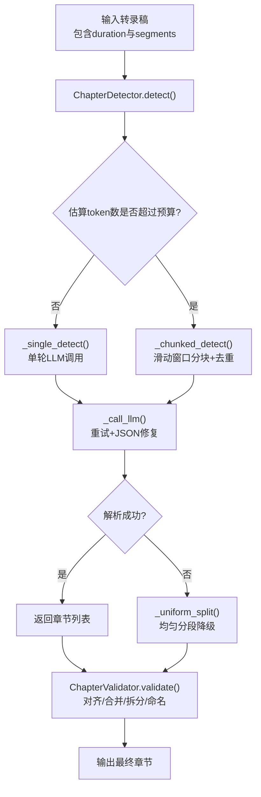
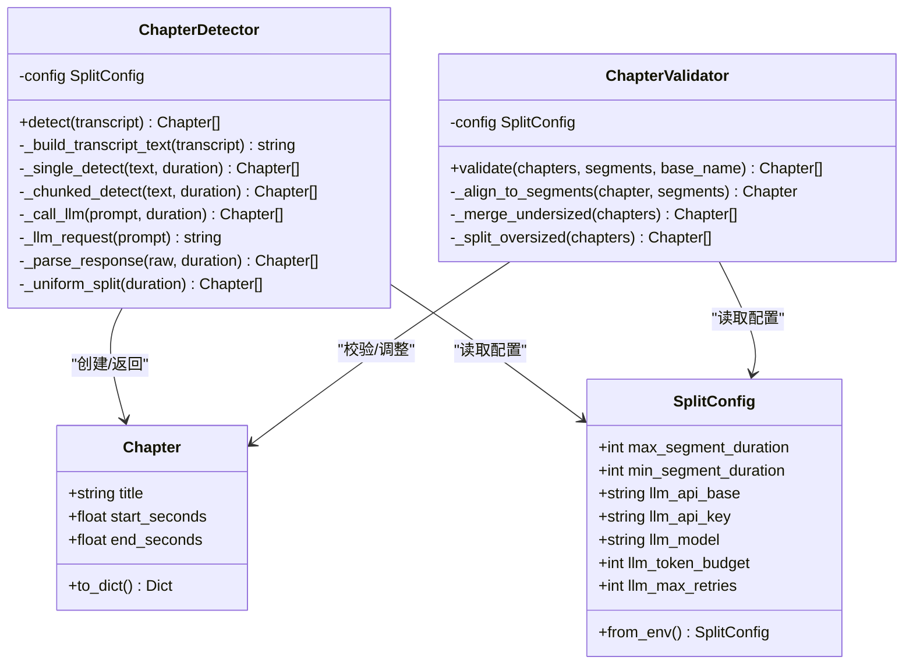
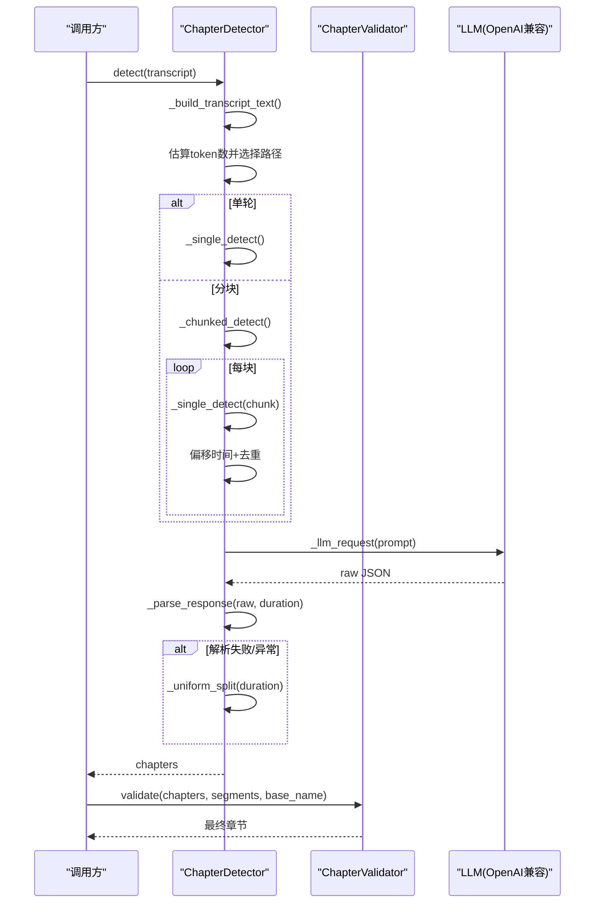
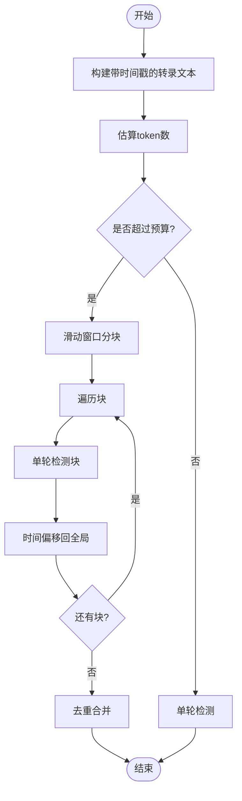
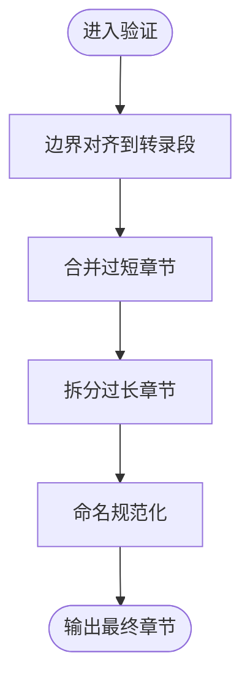
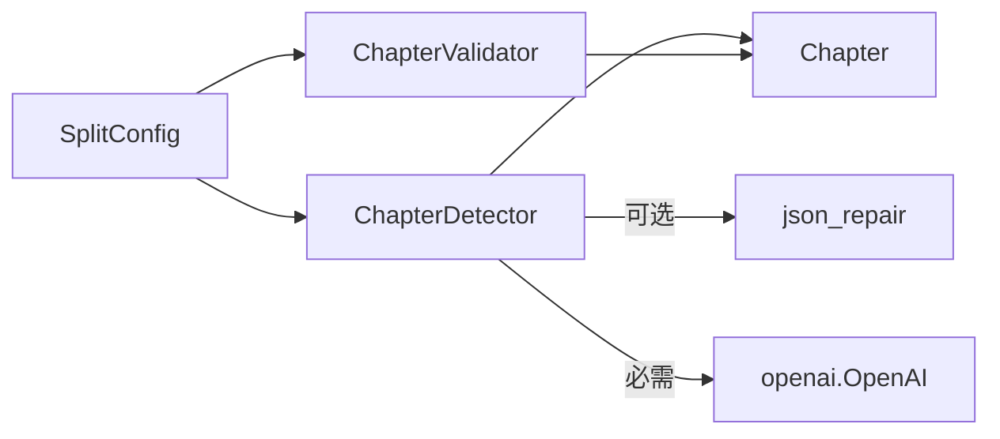

# AI章节检测

<cite>
**本文引用的文件**
- [video_splitter/analyzer/chapter.py](file://video_splitter/analyzer/chapter.py)
- [video_splitter/analyzer/validator.py](file://video_splitter/analyzer/validator.py)
- [video_splitter/config.py](file://video_splitter/config.py)
- [video_splitter/tests/test_chapter.py](file://video_splitter/tests/test_chapter.py)
</cite>

## 目录
1. [简介](#简介)
2. [项目结构](#项目结构)
3. [核心组件](#核心组件)
4. [架构总览](#架构总览)
5. [详细组件分析](#详细组件分析)
6. [依赖关系分析](#依赖关系分析)
7. [性能与可扩展性](#性能与可扩展性)
8. [故障排查指南](#故障排查指南)
9. [结论](#结论)
10. [附录：API调用与提示词开发指南](#附录api调用与提示词开发指南)

## 简介
本技术文档围绕“AI章节检测”能力，系统性解析 ChapterDetector 的算法原理、分块策略、提示词工程、结果验证与容错降级机制，并给出不同 LLM 提供商的集成配置要点与使用示例。同时提供章节质量评估指标和优化建议，帮助读者在生产环境中稳定落地该功能。

## 项目结构
与本章检测相关的代码主要位于 analyzer 子模块，配合配置与测试用例共同构成完整链路：
- analyzer/chapter.py：实现基于 LLM 的语义章节检测、分块处理、响应解析与降级策略
- analyzer/validator.py：对检测结果进行边界对齐、时长约束与命名规范化
- config.py：集中管理 LLM 与切分策略的配置项，支持环境变量覆盖
- tests/test_chapter.py：覆盖关键路径与异常分支，保障稳定性

图表来源
- [video_splitter/analyzer/chapter.py:77-210](file://video_splitter/analyzer/chapter.py#L77-L210)
- [video_splitter/analyzer/validator.py:22-53](file://video_splitter/analyzer/validator.py#L22-L53)

章节来源
- [video_splitter/analyzer/chapter.py:77-210](file://video_splitter/analyzer/chapter.py#L77-L210)
- [video_splitter/analyzer/validator.py:22-53](file://video_splitter/analyzer/validator.py#L22-L53)
- [video_splitter/config.py:19-54](file://video_splitter/config.py#L19-L54)

## 核心组件
- Chapter：表示一个章节片段，包含标题与起止秒数，并提供序列化方法
- ChapterDetector：核心检测器，负责构建提示词、选择单轮或分块策略、调用 LLM、解析响应与降级
- ChapterValidator：校验与调整章节，包括边界对齐、过短合并、过长拆分、统一命名
- SplitConfig：集中配置项，涵盖 LLM 参数、切分策略、设备与引擎等

章节来源
- [video_splitter/analyzer/chapter.py:18-41](file://video_splitter/analyzer/chapter.py#L18-L41)
- [video_splitter/analyzer/chapter.py:43-210](file://video_splitter/analyzer/chapter.py#L43-L210)
- [video_splitter/analyzer/validator.py:10-53](file://video_splitter/analyzer/validator.py#L10-L53)
- [video_splitter/config.py:19-54](file://video_splitter/config.py#L19-L54)

## 架构总览
下图展示从转录稿到最终章节输出的端到端流程，以及各组件间的交互关系。

图表来源
- [video_splitter/analyzer/chapter.py:18-210](file://video_splitter/analyzer/chapter.py#L18-L210)
- [video_splitter/analyzer/validator.py:10-133](file://video_splitter/analyzer/validator.py#L10-L133)
- [video_splitter/config.py:19-54](file://video_splitter/config.py#L19-L54)

## 详细组件分析

### ChapterDetector 算法原理
- 输入：包含 duration 与 segments 的转录稿字典
- 文本构建：将每个 segment 转换为带时间戳的行，便于 LLM 定位话题边界
- Token 预算判断：按字符长度粗略估计 token 数，决定是否走单轮或分块路径
- 单轮检测：构造 PROMPT_TEMPLATE，注入总时长与转录文本，调用 LLM 一次得到章节
- 分块检测（长文本）：
  - 以约15分钟为窗口，设置2分钟重叠，保证跨边界上下文
  - 逐段累积行，达到阈值时切块；回溯最近若干行构造重叠区
  - 对每块执行单轮检测，并将相对时间偏移回全局时间轴
  - 去重：若相邻章节重叠超过阈值，保留标题更长者，避免重复
- LLM 调用与容错：
  - 指数退避重试，最多尝试配置次数
  - 可选 JSON 修复（json_repair），提升鲁棒性
  - 解析失败或网络异常时，自动降级为均匀分段
- 响应解析：
  - 去除 Markdown 围栏
  - 强制要求数组格式，字段校验（起止时间范围、start < end）
  - 自动补全缺失字段（如 title 默认序号+片段编号）

图表来源
- [video_splitter/analyzer/chapter.py:77-210](file://video_splitter/analyzer/chapter.py#L77-L210)
- [video_splitter/analyzer/validator.py:22-53](file://video_splitter/analyzer/validator.py#L22-L53)

章节来源
- [video_splitter/analyzer/chapter.py:77-210](file://video_splitter/analyzer/chapter.py#L77-L210)

#### 分块处理机制与大文本内容处理
- 窗口大小：默认约15分钟
- 重叠窗口：默认2分钟，用于保持跨边界上下文
- 回溯策略：当新行触发切块时，回溯最近若干行（上限50条）中满足重叠时间阈值的行，作为下一块的起始上下文
- 时间偏移：每块内检测到的起止时间加上块起始偏移，恢复全局时间轴
- 去重策略：比较相邻章节的重叠时长，若超过阈值则保留标题更长者，减少重复

图表来源
- [video_splitter/analyzer/chapter.py:116-193](file://video_splitter/analyzer/chapter.py#L116-L193)

章节来源
- [video_splitter/analyzer/chapter.py:116-193](file://video_splitter/analyzer/chapter.py#L116-L193)

#### 提示词工程设计与优化策略
- 角色设定：强调视频编辑专家身份，聚焦中文培训视频场景
- 任务说明：识别主要话题、定位自然起止点、生成简洁中文标题、控制段落时长
- 输出规范：严格 JSON 数组格式，禁止额外文字与 Markdown 包裹
- 规则约束：
  - 边界必须是自然话题转换点
  - 序号从01递增
  - 起止时间必须在视频总时长范围内
  - 相邻段落首尾相接，无间隙无重叠
  - 标题命名遵循“序号_中文标题”，且不含非法字符
- System Prompt：在请求层再次强调只输出纯 JSON 数组，降低模型自由发挥概率
- 温度与最大令牌：temperature 较低以保证稳定性，max_tokens 限制输出规模

章节来源
- [video_splitter/analyzer/chapter.py:51-72](file://video_splitter/analyzer/chapter.py#L51-L72)
- [video_splitter/analyzer/chapter.py:225-239](file://video_splitter/analyzer/chapter.py#L225-L239)

#### 结果验证与容错降级机制
- 边界对齐：将章节结束时间对齐到最近的转录段边界，提高与原始音频/字幕的一致性
- 时长约束：
  - 过短合并：小于最小时长的章节与相邻合并
  - 过长拆分：大于最大时长的章节递归拆分为多段
- 命名规范化：清理非法字符，确保以“序号_标题”开头
- 容错降级：
  - LLM 调用失败或解析异常时，自动回退为均匀分段
  - 指数退避重试，避免瞬时抖动导致失败
  - 可选 JSON 修复，增强对非标准 JSON 的容忍度

图表来源
- [video_splitter/analyzer/validator.py:22-53](file://video_splitter/analyzer/validator.py#L22-L53)
- [video_splitter/analyzer/validator.py:55-133](file://video_splitter/analyzer/validator.py#L55-L133)

章节来源
- [video_splitter/analyzer/validator.py:22-53](file://video_splitter/analyzer/validator.py#L22-L53)
- [video_splitter/analyzer/validator.py:55-133](file://video_splitter/analyzer/validator.py#L55-L133)

### 不同 LLM 提供商的集成配置与使用示例
- 接口协议：采用 OpenAI 兼容的 chat.completions.create 接口
- 关键配置项：
  - llm_api_base：服务基地址（可通过 OPENAI_API_BASE 覆盖）
  - llm_api_key：访问密钥（优先 WHALECLOUD_API_KEY，其次 OPENAI_API_KEY）
  - llm_model：模型名称（例如 MiniMax-M2.7）
  - llm_token_budget：单次处理的 token 预算
  - llm_max_retries：最大重试次数
- 环境变量覆盖：
  - OPENAI_API_BASE、OPENAI_API_KEY、WHALECLOUD_API_KEY、VIDEO_SPLITTER_DEVICE、VIDEO_SPLITTER_RESUME、VIDEO_SPLITTER_ENGINE
- 使用示例（概念性步骤）：
  - 通过 SplitConfig.from_env() 加载配置
  - 初始化 ChapterDetector(config)
  - 调用 detect(transcript) 获取章节
  - 如需自定义提示词，可修改 PROMPT_TEMPLATE 与 system_prompt 的内容与约束

章节来源
- [video_splitter/config.py:19-54](file://video_splitter/config.py#L19-L54)
- [video_splitter/analyzer/chapter.py:211-241](file://video_splitter/analyzer/chapter.py#L211-L241)

## 依赖关系分析
- 外部依赖：
  - openai：用于发起 LLM 请求（未安装时抛出运行时错误）
  - json_repair（可选）：用于修复非标准 JSON，提升解析成功率
- 内部依赖：
  - ChapterDetector 依赖 SplitConfig 与工具函数（时间戳转换/解析）
  - ChapterValidator 依赖 SplitConfig 与 Chapter 对象

图表来源
- [video_splitter/analyzer/chapter.py:9-15](file://video_splitter/analyzer/chapter.py#L9-L15)
- [video_splitter/analyzer/chapter.py:211-241](file://video_splitter/analyzer/chapter.py#L211-L241)
- [video_splitter/config.py:19-54](file://video_splitter/config.py#L19-L54)

章节来源
- [video_splitter/analyzer/chapter.py:9-15](file://video_splitter/analyzer/chapter.py#L9-L15)
- [video_splitter/analyzer/chapter.py:211-241](file://video_splitter/analyzer/chapter.py#L211-L241)
- [video_splitter/config.py:19-54](file://video_splitter/config.py#L19-L54)

## 性能与可扩展性
- 分块策略：
  - 窗口大小与重叠可根据业务需求调整，平衡上下文完整性与调用成本
  - 回溯行数上限可控制内存占用与上下文长度
- 重试与退避：
  - 指数退避有助于缓解服务端抖动，但需结合超时与熔断策略
- 解析优化：
  - 启用 json_repair 可降低因格式不规范导致的失败率
- 可扩展方向：
  - 引入缓存（相同转录文本复用结果）
  - 并行化分块检测（注意去重与顺序一致性）
  - 动态调整窗口大小（根据内容密度自适应）

[本节为通用指导，不直接分析具体文件]

## 故障排查指南
- 常见错误与定位：
  - 缺少 openai 包：会抛出运行时错误，需安装依赖
  - JSON 解析失败：检查系统提示词与用户提示词是否足够强约束；启用 json_repair
  - 时间戳越界或 start >= end：检查 LLM 输出是否符合约束，必要时增加更严格的 system prompt
  - 超长转录导致分块过多：调大 llm_token_budget 或增大窗口大小
- 日志与断点：
  - 在 _call_llm 与 _parse_response 处记录原始请求与响应，便于复现问题
  - 在 validator 阶段打印对齐前后与合并/拆分前后的章节信息
- 回归测试：
  - 参考测试用例覆盖单轮/分块/降级/解析异常等路径，确保改动不影响主流程

章节来源
- [video_splitter/analyzer/chapter.py:195-241](file://video_splitter/analyzer/chapter.py#L195-L241)
- [video_splitter/analyzer/chapter.py:243-301](file://video_splitter/analyzer/chapter.py#L243-L301)
- [video_splitter/tests/test_chapter.py:276-310](file://video_splitter/tests/test_chapter.py#L276-L310)

## 结论
ChapterDetector 通过“提示词工程 + 分块策略 + 健壮解析 + 容错降级”的组合，实现了在高可用前提下对长文本转录稿的语义章节划分。配合 ChapterValidator 的边界对齐与时长约束，最终输出符合生产要求的章节序列。通过合理配置与持续优化提示词，可在不同 LLM 提供商间灵活迁移并保持稳定的质量与性能。

[本节为总结性内容，不直接分析具体文件]

## 附录：API调用与提示词开发指南

### API 调用流程（概念性）
- 准备转录稿：包含 duration 与 segments（每个 segment 含 start、end、text）
- 加载配置：SplitConfig.from_env()
- 初始化检测器：ChapterDetector(config)
- 调用检测：detector.detect(transcript)
- 验证与命名：ChapterValidator.validate(chapters, transcript.segments, base_name)
- 输出：最终章节列表

章节来源
- [video_splitter/analyzer/chapter.py:77-96](file://video_splitter/analyzer/chapter.py#L77-L96)
- [video_splitter/analyzer/validator.py:22-53](file://video_splitter/analyzer/validator.py#L22-L53)
- [video_splitter/config.py:39-54](file://video_splitter/config.py#L39-L54)

### 自定义提示词开发指南
- 目标明确：限定输出为 JSON 数组，字段名与时间格式固定
- 约束强化：
  - 禁止多余解释与 Markdown 包裹
  - 起止时间必须在视频总时长范围内
  - 相邻段落首尾相接，无间隙无重叠
  - 标题命名规范与字符过滤
- 系统提示词：在请求层再次强调只输出纯 JSON 数组
- 温度与最大令牌：低温度提升稳定性，限制输出规模
- 迭代优化：
  - 收集失败样例，针对性加强约束
  - 针对特定领域（如技术讲座、产品演示）微调任务描述与标题风格
  - 结合测试用例进行回归验证

章节来源
- [video_splitter/analyzer/chapter.py:51-72](file://video_splitter/analyzer/chapter.py#L51-L72)
- [video_splitter/analyzer/chapter.py:225-239](file://video_splitter/analyzer/chapter.py#L225-L239)

### 章节质量评估指标与优化建议
- 指标建议：
  - 边界准确率：与人工标注的章节边界对比（允许一定误差）
  - 标题可读性与一致性：是否遵循命名规范、是否简洁准确
  - 时长分布：平均时长、方差、是否满足最小/最大约束
  - 覆盖率：是否覆盖整段视频，是否存在空白或重叠
- 优化建议：
  - 调整分块窗口与重叠，改善跨边界上下文
  - 增强 system prompt 与 user prompt 的约束强度
  - 启用 json_repair 提升解析成功率
  - 在 validator 阶段细化对齐与合并/拆分策略

[本节为通用指导，不直接分析具体文件]