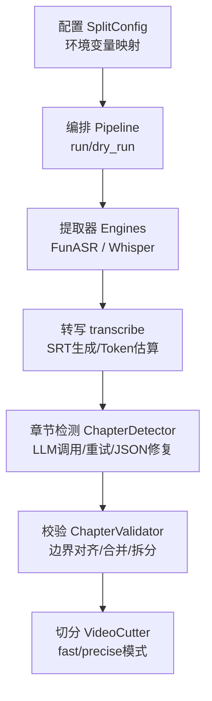
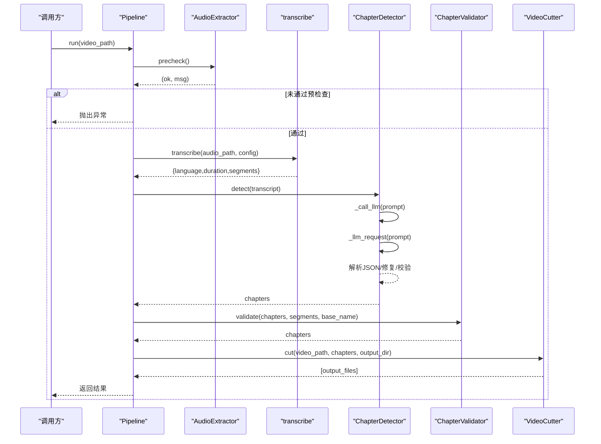
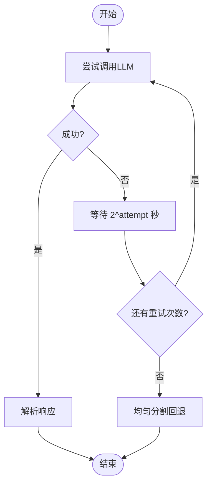
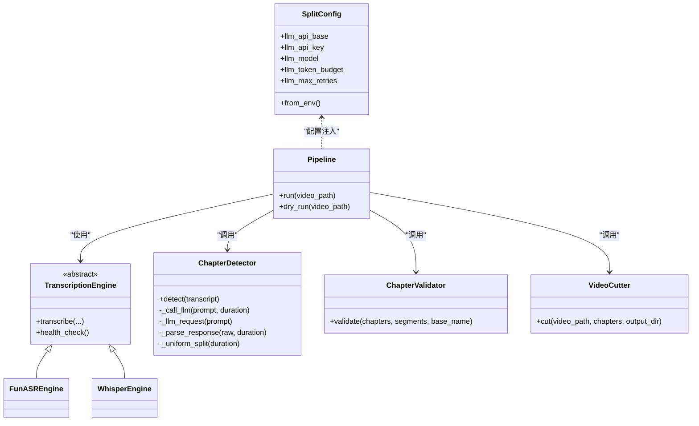

# LLM集成架构

<cite>
**本文引用的文件**   
- [config.py](file://video_splitter/config.py)
- [chapter.py](file://video_splitter/analyzer/chapter.py)
- [validator.py](file://video_splitter/analyzer/validator.py)
- [pipeline.py](file://video_splitter/pipeline.py)
- [transcribe.py](file://video_splitter/extractor/transcribe.py)
- [engines.py](file://video_splitter/extractor/engines.py)
- [cutter.py](file://video_splitter/splitter/cutter.py)
- [cli.py](file://video_splitter/cli.py)
- [test_pipeline.py](file://video_splitter/tests/test_pipeline.py)
</cite>

## 目录
1. [简介](#简介)
2. [项目结构](#项目结构)
3. [核心组件](#核心组件)
4. [架构总览](#架构总览)
5. [详细组件分析](#详细组件分析)
6. [依赖关系分析](#依赖关系分析)
7. [性能与成本考量](#性能与成本考量)
8. [故障排查指南](#故障排查指南)
9. [结论](#结论)
10. [附录](#附录)

## 简介
本技术文档聚焦于视频分割系统中的LLM集成架构，围绕OpenAI兼容API的客户端配置、请求构建与响应处理展开，详细说明重试机制与指数退避算法的实现原理，解释JSON修复库的集成与容错策略，阐述系统提示词与用户提示词的分离设计，并提供不同LLM提供商的配置示例与迁移指南。同时涵盖错误处理、超时控制与网络异常恢复的最佳实践，并给出扩展支持新LLM服务提供商的方法。

## 项目结构
本项目采用分层与按功能模块组织的方式：
- 配置层：集中管理模型、ASR引擎、LLM相关参数与环境变量映射
- 提取层：音频提取与转写（FunASR/faster-whisper）
- 分析层：基于LLM的语义章节检测、校验与命名
- 切分层：基于FFmpeg的视频切割
- 编排层：Pipeline串联各阶段，提供运行与dry-run能力

图表来源
- [config.py:19-53](file://video_splitter/config.py#L19-L53)
- [pipeline.py:21-131](file://video_splitter/pipeline.py#L21-L131)
- [engines.py:17-251](file://video_splitter/extractor/engines.py#L17-L251)
- [transcribe.py:11-105](file://video_splitter/extractor/transcribe.py#L11-L105)
- [chapter.py:43-343](file://video_splitter/analyzer/chapter.py#L43-L343)
- [validator.py:10-152](file://video_splitter/analyzer/validator.py#L10-L152)
- [cutter.py:22-98](file://video_splitter/splitter/cutter.py#L22-L98)

章节来源
- [config.py:19-53](file://video_splitter/config.py#L19-L53)
- [pipeline.py:21-131](file://video_splitter/pipeline.py#L21-L131)

## 核心组件
- 配置中心（SplitConfig）
  - 提供默认值与环境变量覆盖，包括OpenAI兼容API的base_url、api_key、模型名、token预算、最大重试次数等
  - 关键路径：[config.py:19-53](file://video_splitter/config.py#L19-L53)
- 编排器（Pipeline）
  - 负责预检查、音频提取、转写、章节检测、校验、切分的顺序执行与结果汇总
  - dry_run用于预估token数与费用，以及判断是否分块调用LLM
  - 关键路径：[pipeline.py:21-131](file://video_splitter/pipeline.py#L21-L131)
- 转写与工具（transcribe）
  - 使用faster-whisper进行语音转文本，输出带时间戳的segments，并提供SRT导出与粗略token估算
  - 关键路径：[transcribe.py:11-105](file://video_splitter/extractor/transcribe.py#L11-L105)
- 可插拔转写引擎（engines）
  - 抽象TranscriptionEngine接口，实现FunASREngine与WhisperEngine，并通过工厂create_engine注册与创建
  - 关键路径：[engines.py:17-251](file://video_splitter/extractor/engines.py#L17-L251)
- 章节检测（ChapterDetector）
  - 基于OpenAI兼容API进行语义章节划分；支持滑动窗口分块、重试+指数退避、JSON修复与统一分割回退
  - 关键路径：[chapter.py:43-343](file://video_splitter/analyzer/chapter.py#L43-L343)
- 章节校验（ChapterValidator）
  - 将章节边界对齐到转写片段、合并过短段、拆分过长段，并规范化命名
  - 关键路径：[validator.py:10-152](file://video_splitter/analyzer/validator.py#L10-L152)
- 视频切分（VideoCutter）
  - 基于FFmpegSkill或ffmpeg命令行，支持快速copy与精确重编码两种模式，具备超时与回退逻辑
  - 关键路径：[cutter.py:22-98](file://video_splitter/splitter/cutter.py#L22-L98)

章节来源
- [config.py:19-53](file://video_splitter/config.py#L19-L53)
- [pipeline.py:21-131](file://video_splitter/pipeline.py#L21-L131)
- [transcribe.py:11-105](file://video_splitter/extractor/transcribe.py#L11-L105)
- [engines.py:17-251](file://video_splitter/extractor/engines.py#L17-L251)
- [chapter.py:43-343](file://video_splitter/analyzer/chapter.py#L43-L343)
- [validator.py:10-152](file://video_splitter/analyzer/validator.py#L10-L152)
- [cutter.py:22-98](file://video_splitter/splitter/cutter.py#L22-L98)

## 架构总览
下图展示了从输入视频到最终分段输出的端到端流程，重点标注了LLM集成的位置与容错点。

图表来源
- [pipeline.py:31-111](file://video_splitter/pipeline.py#L31-L111)
- [chapter.py:195-241](file://video_splitter/analyzer/chapter.py#L195-L241)
- [validator.py:22-53](file://video_splitter/analyzer/validator.py#L22-L53)
- [cutter.py:30-53](file://video_splitter/splitter/cutter.py#L30-L53)

## 详细组件分析

### OpenAI兼容API集成与客户端配置
- 客户端初始化
  - 在章节检测中通过openai.OpenAI构造客户端，传入api_key与base_url，遵循OpenAI兼容协议
  - 参考路径：[chapter.py:222-225](file://video_splitter/analyzer/chapter.py#L222-L225)
- 配置来源
  - llm_api_base、llm_api_key、llm_model、llm_token_budget、llm_max_retries等来自SplitConfig，支持环境变量覆盖
  - 参考路径：[config.py:26-30](file://video_splitter/config.py#L26-L30), [config.py:40-53](file://video_splitter/config.py#L40-L53)
- 请求构建
  - 使用chat.completions.create，包含system与user两条消息，设置temperature与max_tokens，并附加额外请求头
  - 参考路径：[chapter.py:226-239](file://video_splitter/analyzer/chapter.py#L226-L239)
- 响应处理
  - 取choices[0].message.content作为原始文本，后续进入JSON修复与解析流程
  - 参考路径：[chapter.py:240-241](file://video_splitter/analyzer/chapter.py#L240-L241)

章节来源
- [chapter.py:222-241](file://video_splitter/analyzer/chapter.py#L222-L241)
- [config.py:26-30](file://video_splitter/config.py#L26-L30)
- [config.py:40-53](file://video_splitter/config.py#L40-L53)

### 重试机制与指数退避算法
- 重试循环
  - 在_call_llm中，最多尝试llm_max_retries+1次，每次失败后继续下一次尝试
  - 参考路径：[chapter.py:199-207](file://video_splitter/analyzer/chapter.py#L199-L207)
- 指数退避
  - 首次尝试后，等待时间为2^attempt秒，形成指数退避
  - 参考路径：[chapter.py:201-202](file://video_splitter/analyzer/chapter.py#L201-L202)
- 回退策略
  - 所有重试均失败时，自动回退为均匀时间分割，保证流程不中断
  - 参考路径：[chapter.py:209](file://video_splitter/analyzer/chapter.py#L209), [chapter.py:303-322](file://video_splitter/analyzer/chapter.py#L303-L322)

图表来源
- [chapter.py:195-209](file://video_splitter/analyzer/chapter.py#L195-L209)
- [chapter.py:303-322](file://video_splitter/analyzer/chapter.py#L303-L322)

章节来源
- [chapter.py:195-209](file://video_splitter/analyzer/chapter.py#L195-L209)
- [chapter.py:303-322](file://video_splitter/analyzer/chapter.py#L303-L322)

### JSON修复库集成与容错处理
- 可选依赖
  - json_repair为可选依赖，若不可用则跳过修复步骤
  - 参考路径：[chapter.py:9-15](file://video_splitter/analyzer/chapter.py#L9-L15)
- 清理与修复
  - 去除可能的markdown代码块包裹，尝试repair_json修复非法JSON
  - 参考路径：[chapter.py:258-265](file://video_splitter/analyzer/chapter.py#L258-L265)
- 严格校验
  - 要求返回数组类型，校验时间戳范围与起止顺序，否则抛出异常触发上层回退
  - 参考路径：[chapter.py:267-290](file://video_splitter/analyzer/chapter.py#L267-L290)

章节来源
- [chapter.py:9-15](file://video_splitter/analyzer/chapter.py#L9-L15)
- [chapter.py:258-290](file://video_splitter/analyzer/chapter.py#L258-L290)

### 系统提示词与用户提示词的分离设计
- system角色
  - 定义助手身份与输出格式约束，强调只输出纯JSON数组，避免多余文字
  - 参考路径：[chapter.py:226-229](file://video_splitter/analyzer/chapter.py#L226-L229)
- user角色
  - 包含具体任务说明、规则与转录内容，动态拼接时长与文本
  - 参考路径：[chapter.py:230-235](file://video_splitter/analyzer/chapter.py#L230-L235)
- 模板化
  - PROMPT_TEMPLATE集中管理用户侧提示词模板，便于维护与扩展
  - 参考路径：[chapter.py:51-72](file://video_splitter/analyzer/chapter.py#L51-L72)

章节来源
- [chapter.py:51-72](file://video_splitter/analyzer/chapter.py#L51-L72)
- [chapter.py:226-235](file://video_splitter/analyzer/chapter.py#L226-L235)

### 长文本分块与去重策略
- 滑动窗口
  - 将长转录稿按约15分钟分块，保留2分钟重叠以维持上下文连贯性
  - 参考路径：[chapter.py:116-168](file://video_splitter/analyzer/chapter.py#L116-L168)
- 结果合并与去重
  - 对相邻章节进行重叠度评估，超过阈值时选择更长标题的章节，减少重复
  - 参考路径：[chapter.py:179-191](file://video_splitter/analyzer/chapter.py#L179-L191)

章节来源
- [chapter.py:116-191](file://video_splitter/analyzer/chapter.py#L116-L191)

### 校验与命名规范
- 边界对齐
  - 将章节end边界对齐到最近的转写片段边界，提升切分精度
  - 参考路径：[validator.py:55-74](file://video_splitter/analyzer/validator.py#L55-L74)
- 合并与拆分
  - 小于最小时长的段落合并至邻居；大于最大时长的段落递归拆分为多段
  - 参考路径：[validator.py:76-132](file://video_splitter/analyzer/validator.py#L76-L132)
- 命名规范
  - 清理非法字符，确保序号前缀，生成稳定文件名
  - 参考路径：[validator.py:47-52](file://video_splitter/analyzer/validator.py#L47-L52), [validator.py:135-151](file://video_splitter/analyzer/validator.py#L135-L151)

章节来源
- [validator.py:55-151](file://video_splitter/analyzer/validator.py#L55-L151)

### 视频切分与超时控制
- 快速模式
  - 使用流拷贝（-c copy），若实际时长偏差超过容忍度则回退到精确模式
  - 参考路径：[cutter.py:55-73](file://video_splitter/splitter/cutter.py#L55-L73)
- 精确模式
  - 重新编码视频与音频，设置超时保护，失败时抛出FFmpegError
  - 参考路径：[cutter.py:74-86](file://video_splitter/splitter/cutter.py#L74-L86)
- 时长探测
  - 使用ffprobe获取输出时长，辅助判定是否需要回退
  - 参考路径：[cutter.py:87-97](file://video_splitter/splitter/cutter.py#L87-L97)

章节来源
- [cutter.py:55-97](file://video_splitter/splitter/cutter.py#L55-L97)

### 不同LLM提供商的配置示例与迁移指南
- 通用配置项
  - OPENAI_API_BASE：指向任意OpenAI兼容服务的base URL
  - OPENAI_API_KEY：鉴权密钥
  - WHALECLOUD_API_KEY：特定服务商密钥覆盖
  - VIDEO_SPLITTER_ENGINE：切换ASR引擎（funasr/whisper）
  - 参考路径：[config.py:40-53](file://video_splitter/config.py#L40-L53)
- 迁移建议
  - 更换提供商只需调整OPENAI_API_BASE与OPENAI_API_KEY，保持chat.completions接口一致
  - 若目标服务不支持extra_headers，可在上层封装中移除或替换
  - 若需启用json-repair增强容错，安装json_repair包并在CLI健康检查中验证
  - 参考路径：[cli.py:130-136](file://video_splitter/cli.py#L130-L136)

章节来源
- [config.py:40-53](file://video_splitter/config.py#L40-L53)
- [cli.py:130-136](file://video_splitter/cli.py#L130-L136)

### 扩展支持新的LLM服务提供商
- 当前实现已基于OpenAI兼容协议，新增提供商无需改动核心逻辑，仅需：
  - 配置OPENAI_API_BASE与OPENAI_API_KEY
  - 确认服务支持chat.completions与messages格式
  - 如需要，调整extra_headers或温度/最大token等参数
- 如需自定义客户端行为（如代理、重试策略），可在ChapterDetector._llm_request中封装HTTP客户端，但应保持与现有调用契约一致

章节来源
- [chapter.py:222-239](file://video_splitter/analyzer/chapter.py#L222-L239)

## 依赖关系分析

图表来源
- [config.py:19-53](file://video_splitter/config.py#L19-L53)
- [pipeline.py:21-131](file://video_splitter/pipeline.py#L21-L131)
- [engines.py:17-251](file://video_splitter/extractor/engines.py#L17-L251)
- [chapter.py:43-343](file://video_splitter/analyzer/chapter.py#L43-L343)
- [validator.py:10-152](file://video_splitter/analyzer/validator.py#L10-L152)
- [cutter.py:22-98](file://video_splitter/splitter/cutter.py#L22-L98)

章节来源
- [config.py:19-53](file://video_splitter/config.py#L19-L53)
- [pipeline.py:21-131](file://video_splitter/pipeline.py#L21-L131)
- [engines.py:17-251](file://video_splitter/extractor/engines.py#L17-L251)
- [chapter.py:43-343](file://video_splitter/analyzer/chapter.py#L43-L343)
- [validator.py:10-152](file://video_splitter/analyzer/validator.py#L10-L152)
- [cutter.py:22-98](file://video_splitter/splitter/cutter.py#L22-L98)

## 性能与成本考量
- Token估算与预算控制
  - 使用粗略估算（中文约1.5字符/token）计算总token数，结合llm_token_budget决定单次或分块调用
  - 参考路径：[transcribe.py:62-76](file://video_splitter/extractor/transcribe.py#L62-L76), [chapter.py:87-93](file://video_splitter/analyzer/chapter.py#L87-L93)
- dry_run成本预估
  - 根据duration与token估算输出预估费用与调用次数，便于上线前评估
  - 参考路径：[pipeline.py:113-131](file://video_splitter/pipeline.py#L113-L131)
- 分块策略
  - 长文本采用15分钟窗口+2分钟重叠，降低单次请求长度与失败风险
  - 参考路径：[chapter.py:116-168](file://video_splitter/analyzer/chapter.py#L116-L168)

章节来源
- [transcribe.py:62-76](file://video_splitter/extractor/transcribe.py#L62-L76)
- [chapter.py:87-93](file://video_splitter/analyzer/chapter.py#L87-L93)
- [pipeline.py:113-131](file://video_splitter/pipeline.py#L113-L131)
- [chapter.py:116-168](file://video_splitter/analyzer/chapter.py#L116-L168)

## 故障排查指南
- 常见错误与定位
  - 缺少openai包：在LLM调用处抛出运行时异常，需安装依赖
    - 参考路径：[chapter.py:217-220](file://video_splitter/analyzer/chapter.py#L217-L220)
  - JSON解析失败：通过json_repair修复仍失败会触发回退到均匀分割
    - 参考路径：[chapter.py:258-290](file://video_splitter/analyzer/chapter.py#L258-L290)
  - FFmpeg命令失败：精确模式失败抛出FFmpegError，快速模式自动回退
    - 参考路径：[cutter.py:74-86](file://video_splitter/splitter/cutter.py#L74-L86)
- 健康检查与依赖验证
  - CLI中包含对json-repair与faster-whisper的检查，便于部署前自检
    - 参考路径：[cli.py:101-136](file://video_splitter/cli.py#L101-L136)
- 测试用例参考
  - Pipeline全流程与dry_run场景的断言覆盖了正常与异常路径
    - 参考路径：[test_pipeline.py:55-147](file://video_splitter/tests/test_pipeline.py#L55-L147)

章节来源
- [chapter.py:217-220](file://video_splitter/analyzer/chapter.py#L217-L220)
- [chapter.py:258-290](file://video_splitter/analyzer/chapter.py#L258-L290)
- [cutter.py:74-86](file://video_splitter/splitter/cutter.py#L74-L86)
- [cli.py:101-136](file://video_splitter/cli.py#L101-L136)
- [test_pipeline.py:55-147](file://video_splitter/tests/test_pipeline.py#L55-L147)

## 结论
该LLM集成架构以OpenAI兼容协议为核心，通过配置驱动与模块化设计，实现了高可用的章节检测流程。其关键特性包括：
- 稳定的重试与指数退避，保障网络波动下的成功率
- 可选的JSON修复与严格的响应校验，提升容错能力
- 系统提示词与用户提示词分离，便于维护与扩展
- 长文本分块与去重策略，兼顾上下文与效率
- 完善的校验与命名规范，确保下游切分质量
- 灵活的提供商迁移与扩展方式，适配多种后端服务

## 附录
- 环境变量清单
  - OPENAI_API_BASE：OpenAI兼容服务地址
  - OPENAI_API_KEY：鉴权密钥
  - WHALECLOUD_API_KEY：特定服务商密钥覆盖
  - VIDEO_SPLITTER_ENGINE：ASR引擎选择（funasr/whisper）
  - 参考路径：[config.py:40-53](file://video_splitter/config.py#L40-L53)
- 关键流程入口
  - Pipeline.run：主流程
  - Pipeline.dry_run：成本与调用次数预估
  - 参考路径：[pipeline.py:31-131](file://video_splitter/pipeline.py#L31-L131)
