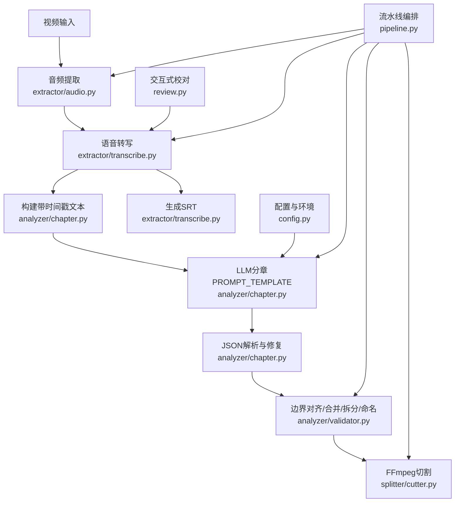
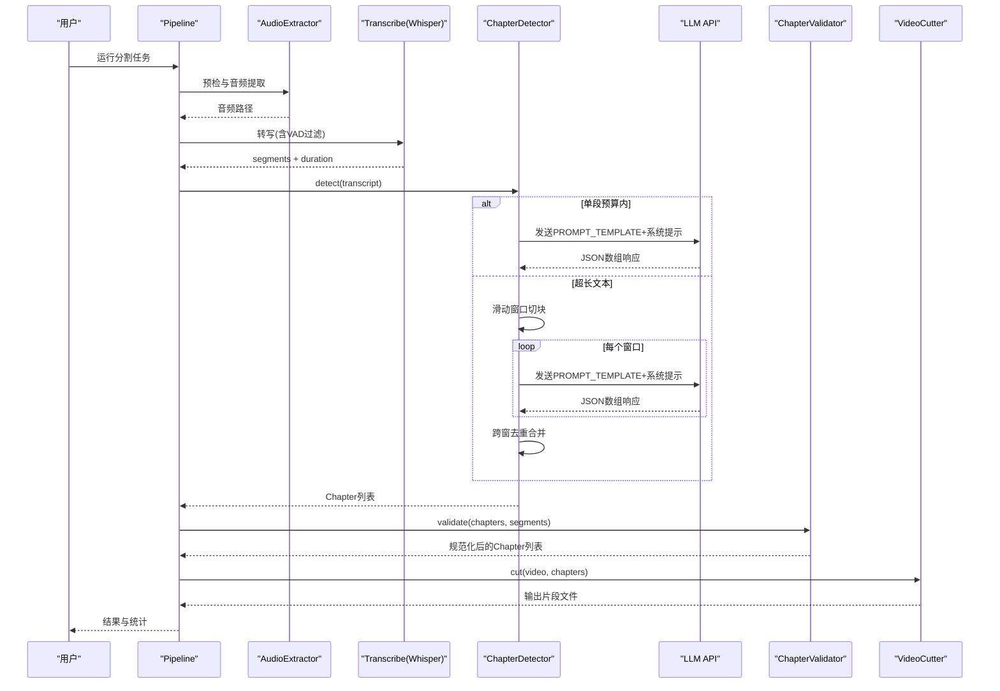
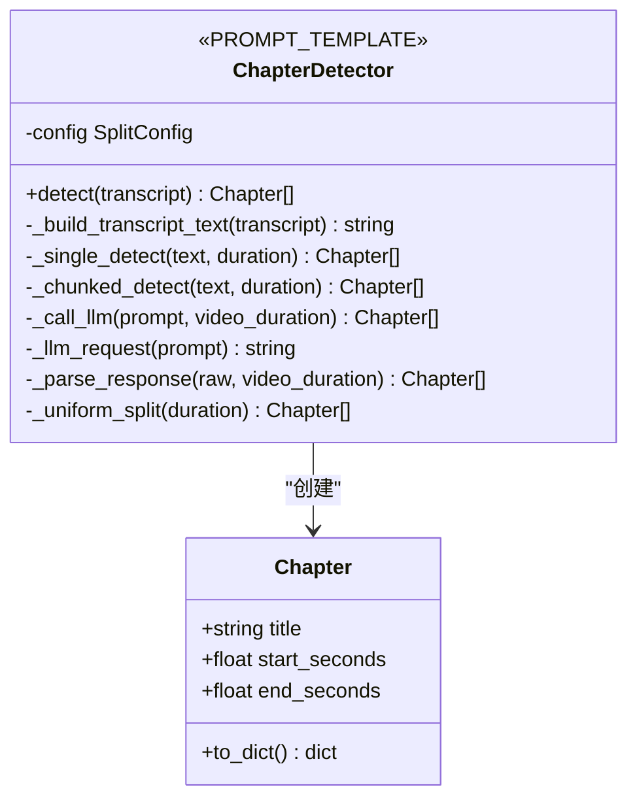
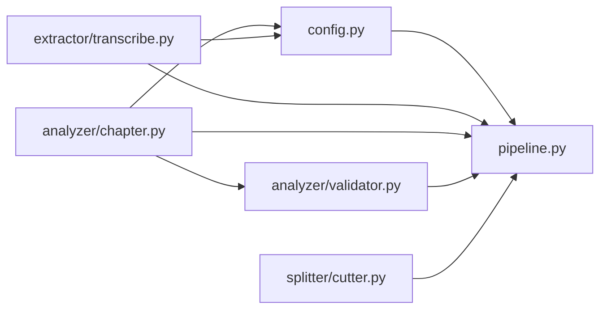

# 提示词工程

<cite>
**本文引用的文件**   
- [README.md](file://README.md)
- [video_splitter/AGENTS.md](file://video_splitter/AGENTS.md)
- [video_splitter/config.py](file://video_splitter/config.py)
- [video_splitter/pipeline.py](file://video_splitter/pipeline.py)
- [video_splitter/extractor/transcribe.py](file://video_splitter/extractor/transcribe.py)
- [video_splitter/analyzer/chapter.py](file://video_splitter/analyzer/chapter.py)
- [video_splitter/analyzer/validator.py](file://video_splitter/analyzer/validator.py)
- [video_splitter/review.py](file://video_splitter/review.py)
- [video_splitter/tests/test_chapter.py](file://video_splitter/tests/test_chapter.py)
- [ffmpeg-video-workspace/iteration-1/review.html](file://ffmpeg-video-workspace/iteration-1/review.html)
</cite>

## 目录
1. [引言](#引言)
2. [项目结构](#项目结构)
3. [核心组件](#核心组件)
4. [架构总览](#架构总览)
5. [详细组件分析](#详细组件分析)
6. [依赖分析](#依赖分析)
7. [性能考量](#性能考量)
8. [故障排查指南](#故障排查指南)
9. [结论](#结论)
10. [附录](#附录)

## 引言
本指南面向“中文培训视频”场景的提示词工程实践，围绕项目中基于大模型的章节检测能力，系统阐述提示词模板的设计理念、结构与约束，给出调优方法、评估指标与A/B测试框架，并提供不同视频类型的定制方案、边缘情况处理技巧以及完整的调试工具与日志分析方法。

## 项目结构
本项目将“音频提取→语音转写→LLM语义分章→校验→切割”串联为可配置流水线。与提示词工程直接相关的核心位于：
- 提示词模板与调用：analyzer/chapter.py
- 转写与SRT导出：extractor/transcribe.py
- 校验与命名：analyzer/validator.py
- 流水线编排与恢复：pipeline.py
- 交互式转写校对：review.py
- 配置与环境变量：config.py



图表来源
- [video_splitter/analyzer/chapter.py:50-72](file://video_splitter/analyzer/chapter.py#L50-L72)
- [video_splitter/analyzer/chapter.py:195-241](file://video_splitter/analyzer/chapter.py#L195-L241)
- [video_splitter/analyzer/validator.py:22-53](file://video_splitter/analyzer/validator.py#L22-L53)
- [video_splitter/extractor/transcribe.py:79-96](file://video_splitter/extractor/transcribe.py#L79-L96)
- [video_splitter/pipeline.py:31-111](file://video_splitter/pipeline.py#L31-L111)
- [video_splitter/config.py:19-54](file://video_splitter/config.py#L19-L54)

章节来源
- [video_splitter/AGENTS.md:1-55](file://video_splitter/AGENTS.md#L1-L55)
- [video_splitter/pipeline.py:1-131](file://video_splitter/pipeline.py#L1-L131)

## 核心组件
- 提示词模板与系统提示
  - 用户提示：定义角色、任务、输出格式与强约束（纯JSON数组、标题长度与字符限制、时间码范围与连续性等）。
  - 系统提示：强调只输出纯JSON数组，禁止任何解释或Markdown包裹，降低解析失败率。
- 长文本策略
  - 当转录文本超过token预算时，采用滑动窗口切块（约15分钟，重叠2分钟），对每块独立分章并去重合并。
- 容错与降级
  - 重试机制（指数退避）、可选json-repair修复、最终回退到均匀分段。
- 校验与规范化
  - 边界对齐到最近ASR段边界；过短合并、过长拆分；统一序号前缀与非法字符清洗。
- 转写与SRT
  - Whisper转写，支持进度回调；提供to_srt转换用于人工校对与可视化。
- 交互式校对
  - TTY界面支持逐条编辑、断点续编、原子写入与SRT再生成。

章节来源
- [video_splitter/analyzer/chapter.py:50-72](file://video_splitter/analyzer/chapter.py#L50-L72)
- [video_splitter/analyzer/chapter.py:195-241](file://video_splitter/analyzer/chapter.py#L195-L241)
- [video_splitter/analyzer/chapter.py:116-193](file://video_splitter/analyzer/chapter.py#L116-L193)
- [video_splitter/analyzer/chapter.py:243-301](file://video_splitter/analyzer/chapter.py#L243-L301)
- [video_splitter/analyzer/validator.py:22-53](file://video_splitter/analyzer/validator.py#L22-L53)
- [video_splitter/extractor/transcribe.py:11-59](file://video_splitter/extractor/transcribe.py#L11-L59)
- [video_splitter/extractor/transcribe.py:79-96](file://video_splitter/extractor/transcribe.py#L79-L96)
- [video_splitter/review.py:201-347](file://video_splitter/review.py#L201-L347)

## 架构总览
下图展示从视频到分片输出的端到端流程，突出提示词在“语义分章”环节的作用位置。



图表来源
- [video_splitter/pipeline.py:31-111](file://video_splitter/pipeline.py#L31-L111)
- [video_splitter/analyzer/chapter.py:116-193](file://video_splitter/analyzer/chapter.py#L116-L193)
- [video_splitter/analyzer/chapter.py:195-241](file://video_splitter/analyzer/chapter.py#L195-L241)
- [video_splitter/analyzer/validator.py:22-53](file://video_splitter/analyzer/validator.py#L22-L53)

## 详细组件分析

### 提示词模板设计（PROMPT_TEMPLATE）
- 角色定义
  - 明确“视频编辑专家”身份，聚焦中文培训视频内容理解与结构化输出。
- 任务描述
  - 识别主要话题与知识点；定位自然起止时间点；生成简洁中文标题；控制段落时长区间。
- 输出格式规范
  - 强制纯JSON数组，字段包含title、start、end；禁止Markdown包裹与额外文字。
- 约束条件
  - 标题≤12字且不含特殊字符；序号从01递增；时间码在视频总时长范围内；相邻段首尾相接无间隙无重叠。
- 中文培训视频优化要点
  - 强调“自然话题转换点”，避免句子中间切断；以“MM:SS 或 HH:MM:SS”时间码形式便于后续对齐与校验。

章节来源
- [video_splitter/analyzer/chapter.py:50-72](file://video_splitter/analyzer/chapter.py#L50-L72)

#### 类关系图（与提示词相关）


图表来源
- [video_splitter/analyzer/chapter.py:18-41](file://video_splitter/analyzer/chapter.py#L18-L41)
- [video_splitter/analyzer/chapter.py:43-322](file://video_splitter/analyzer/chapter.py#L43-L322)

### 系统提示与LLM调用
- 系统提示
  - 再次强调“只输出纯JSON数组”，减少模型自由发挥导致的解析错误。
- 请求参数
  - 低温度（提高稳定性）、最大输出token上限、兼容OpenAI协议的base_url与api_key。
- 重试与降级
  - 指数退避重试；若全部失败则回退为按max_segment_duration均匀分段。

章节来源
- [video_splitter/analyzer/chapter.py:211-241](file://video_splitter/analyzer/chapter.py#L211-L241)
- [video_splitter/analyzer/chapter.py:195-209](file://video_splitter/analyzer/chapter.py#L195-L209)
- [video_splitter/analyzer/chapter.py:303-322](file://video_splitter/analyzer/chapter.py#L303-L322)

### 长文本滑动窗口与去重
- 切块策略
  - 每块约15分钟，重叠2分钟保留上下文；按行时间戳切分。
- 跨块合并
  - 对重叠>60秒的相邻段进行去重，优先保留更长标题的段。
- 偏移校正
  - 各块相对起始时间加回全局偏移，保证时间轴一致。

章节来源
- [video_splitter/analyzer/chapter.py:116-193](file://video_splitter/analyzer/chapter.py#L116-L193)

### JSON解析与健壮性
- 清理Markdown围栏
  - 自动剥离```json...```包裹。
- 可选修复
  - 使用json-repair尝试修复非标准JSON。
- 严格校验
  - 必须为数组；时间码必须在视频时长范围内；start<end；非法字符清洗；缺失字段补全默认值。

章节来源
- [video_splitter/analyzer/chapter.py:243-301](file://video_splitter/analyzer/chapter.py#L243-L301)

### 校验器：边界对齐、合并与拆分
- 边界对齐
  - 将章节结束时间对齐到最近的ASR段边界，提升与转写一致性。
- 过短合并
  - 低于最小阈值的段与其邻居合并，避免碎片化。
- 过长拆分
  - 超过最大阈值的段递归均分，并在标题追加_partN后缀。
- 命名规范
  - 统一“序号_标题”前缀，去除文件系统非法字符。

章节来源
- [video_splitter/analyzer/validator.py:22-53](file://video_splitter/analyzer/validator.py#L22-L53)
- [video_splitter/analyzer/validator.py:55-132](file://video_splitter/analyzer/validator.py#L55-L132)

### 转写与SRT导出
- Whisper转写
  - 支持设备与计算类型配置；开启VAD过滤；返回segments与duration。
- SRT生成
  - 将segments转换为标准SRT字幕，便于人工校对与播放验证。

章节来源
- [video_splitter/extractor/transcribe.py:11-59](file://video_splitter/extractor/transcribe.py#L11-L59)
- [video_splitter/extractor/transcribe.py:79-96](file://video_splitter/extractor/transcribe.py#L79-L96)

### 交互式校对工具
- 功能
  - 逐条浏览与替换文本；支持跳转、帮助、退出；断点续编；原子写入；完成后自动更新SRT。
- 适用场景
  - 修正ASR错误、补充术语、统一风格，从而提升下游分章质量。

章节来源
- [video_splitter/review.py:201-347](file://video_splitter/review.py#L201-L347)

### 流水线编排与恢复
- 步骤
  - 预检→提取→转写→分章→校验→切割；支持resume从已有transcript/chapters恢复。
- 成本估算
  - dry_run模式估算tokens与费用，辅助A/B实验的成本对比。

章节来源
- [video_splitter/pipeline.py:31-131](file://video_splitter/pipeline.py#L31-L131)

## 依赖分析
- 模块耦合
  - pipeline依赖audio、transcribe、chapter、validator、cutter；chapter依赖config与openai协议客户端；validator依赖chapter模型。
- 外部依赖
  - OpenAI兼容API、可选json-repair、Whisper/Faster-Whisper、FFmpeg。
- 潜在环依赖
  - 当前结构清晰，未见循环导入风险。



图表来源
- [video_splitter/pipeline.py:1-30](file://video_splitter/pipeline.py#L1-L30)
- [video_splitter/analyzer/chapter.py:1-16](file://video_splitter/analyzer/chapter.py#L1-L16)
- [video_splitter/analyzer/validator.py:1-8](file://video_splitter/analyzer/validator.py#L1-L8)
- [video_splitter/extractor/transcribe.py:1-9](file://video_splitter/extractor/transcribe.py#L1-L9)
- [video_splitter/config.py:1-11](file://video_splitter/config.py#L1-L11)

章节来源
- [video_splitter/AGENTS.md:1-55](file://video_splitter/AGENTS.md#L1-L55)

## 性能考量
- Token预算与切块
  - 通过estimate_tokens粗略估计中文token数，决定是否走单段或滑动窗口路径，避免超限与超时。
- 重试与退避
  - 指数退避降低瞬时拥塞影响；失败回退保障可用性。
- 资源与设备
  - 可通过环境变量切换device与compute_type，平衡速度与精度。
- 批量与并发
  - 建议对多视频任务串行执行以避免GPU/网络争用；必要时按批次限流。

章节来源
- [video_splitter/extractor/transcribe.py:62-76](file://video_splitter/extractor/transcribe.py#L62-L76)
- [video_splitter/analyzer/chapter.py:195-209](file://video_splitter/analyzer/chapter.py#L195-L209)
- [video_splitter/config.py:19-54](file://video_splitter/config.py#L19-L54)

## 故障排查指南
- 常见错误与定位
  - JSON解析失败：检查是否被Markdown包裹、是否存在非法字符、是否满足数组与时间码约束。
  - 时间码越界或start≥end：由解析器抛出异常，需调整提示词或数据源。
  - LLM不可用：触发重试与均匀分段回退，确认OPENAI_API_BASE/KEY与网络连通。
- 日志与追踪
  - Pipeline记录步骤完成状态与耗时；review工具保存进度与修改计数；dry_run输出预估tokens与费用。
- 快速复现
  - 使用单元测试覆盖关键分支（如空转录、超长文本、解析异常、重试成功/失败等）。

章节来源
- [video_splitter/analyzer/chapter.py:243-301](file://video_splitter/analyzer/chapter.py#L243-L301)
- [video_splitter/pipeline.py:102-111](file://video_splitter/pipeline.py#L102-L111)
- [video_splitter/review.py:101-149](file://video_splitter/review.py#L101-L149)
- [video_splitter/tests/test_chapter.py:109-310](file://video_splitter/tests/test_chapter.py#L109-L310)

## 结论
本指南围绕“中文培训视频”的提示词工程，构建了从模板设计、调用策略、解析容错到校验命名的完整闭环。通过滑动窗口与降级策略保障鲁棒性，结合交互式校对与dry_run评估，形成可迭代、可度量、可回归的提示词工程体系。

## 附录

### 提示词调优的实验方法与评估指标
- 实验设计
  - 固定数据集与随机种子，仅变更提示词版本；记录tokens、费用、延迟与通过率。
- 评估指标
  - 结构正确率（是否为合法JSON数组）、时间码合法性（范围与顺序）、标题合规（长度与字符）、段落时长分布（接近目标区间）、与ASR边界对齐误差。
- 自动化评测
  - 参考review.html中的A/B对比视图，汇总pass_rate、time_seconds、tokens等指标，并展示逐用例差异。

章节来源
- [ffmpeg-video-workspace/iteration-1/review.html:1151-1305](file://ffmpeg-video-workspace/iteration-1/review.html#L1151-L1305)

### 不同视频类型的提示词定制方案
- 教程类
  - 强调“知识点粒度”和“操作演示边界”，要求标题体现步骤编号与动作动词，段落时长偏向5-10分钟。
- 会议类
  - 强调“议题/发言人切换”作为边界，允许较短段落（2-5分钟），标题包含议题关键词。
- 演讲/公开课
  - 强调“故事线/论点转折”，段落时长8-15分钟，标题更具概括性与吸引力。
- 实操录屏
  - 强调“界面/菜单/命令序列”的边界，标题包含关键操作路径，避免跨步骤切分。

[本节为概念性指导，不直接分析具体文件]

### A/B测试框架与版本管理策略
- 版本标识
  - 为每次提示词变更增加版本号与变更摘要，保存在元数据中以便回溯。
- 双跑对比
  - 同一批视频分别用A/B提示词运行，收集pass_rate、tokens、cost、latency与章节质量指标。
- 决策阈值
  - 设定改进门槛（如pass_rate提升≥X%、tokens下降≥Y%、cost下降≥Z%）再合并主分支。

[本节为概念性指导，不直接分析具体文件]

### 边缘情况与高质量输出技巧
- 空/极短转录
  - 回退均匀分段；在prompt中显式声明“若无足够信息则按默认策略”。
- 噪声与口误
  - 先经review工具清洗，再进入分章；在prompt中加入“忽略重复与无意义填充词”。
- 跨语言混合
  - 在prompt中明确“以中文为主，专有名词保留原文”，避免翻译失真。
- 标题可读性
  - 限制长度与字符集；强制序号前缀；避免歧义缩写。

章节来源
- [video_splitter/analyzer/chapter.py:303-322](file://video_splitter/analyzer/chapter.py#L303-L322)
- [video_splitter/analyzer/validator.py:47-53](file://video_splitter/analyzer/validator.py#L47-L53)
- [video_splitter/review.py:57-77](file://video_splitter/review.py#L57-L77)

### 提示词调试工具与日志分析方法
- 交互式校对
  - 使用review工具逐条修正ASR文本，观察对分章的影响。
- Dry-run与成本估算
  - 使用pipeline.dry_run获取tokens与费用预估，辅助选择更经济的模型与参数。
- 单元测试回归
  - 针对解析、重试、切块、去重、边界对齐等关键路径编写用例，确保提示词变更后行为稳定。

章节来源
- [video_splitter/review.py:201-347](file://video_splitter/review.py#L201-L347)
- [video_splitter/pipeline.py:113-131](file://video_splitter/pipeline.py#L113-L131)
- [video_splitter/tests/test_chapter.py:215-310](file://video_splitter/tests/test_chapter.py#L215-L310)
