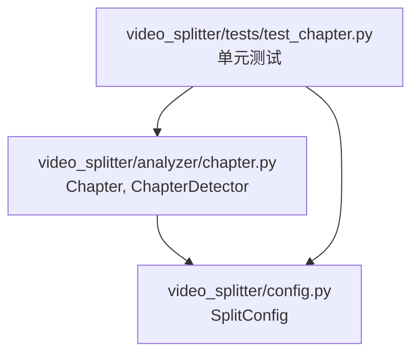
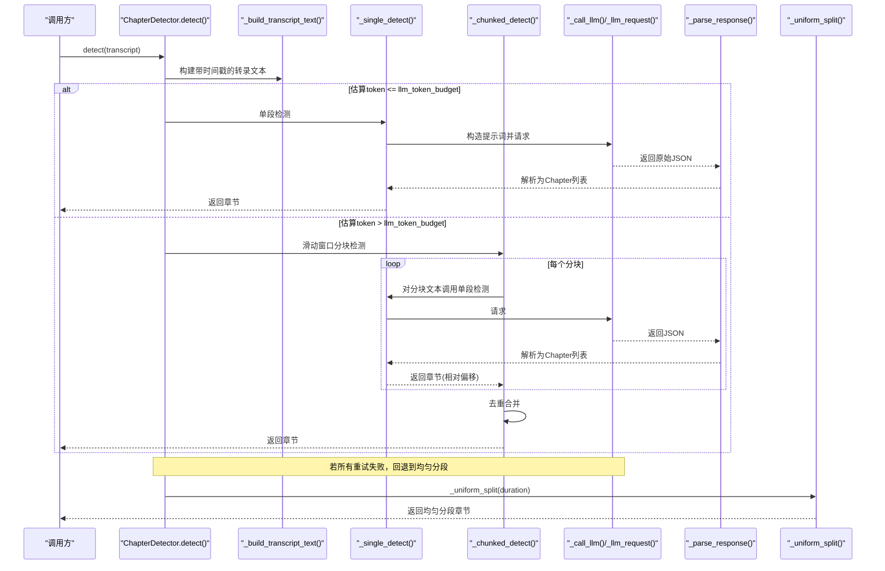
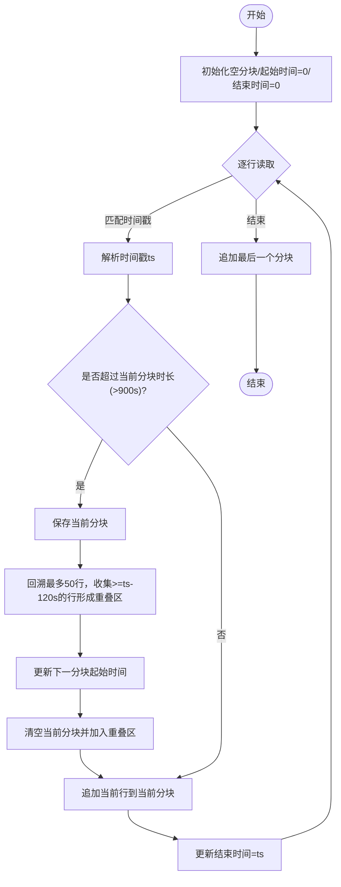
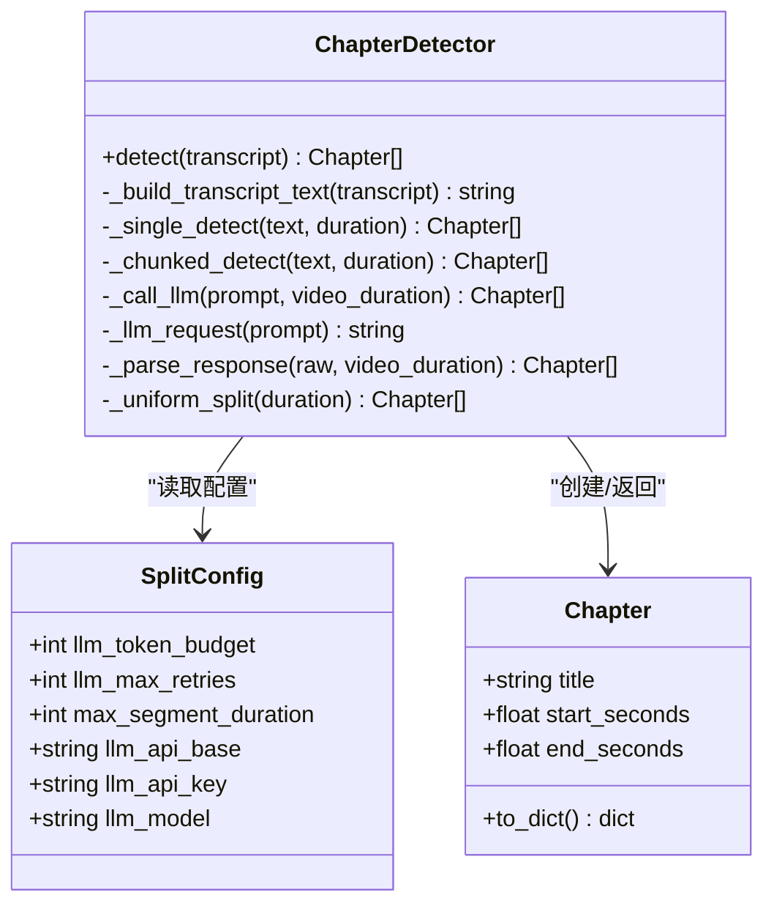

# 章节检测算法

<cite>
**本文引用的文件**   
- [video_splitter/analyzer/chapter.py](file://video_splitter/analyzer/chapter.py)
- [video_spliter/config.py](file://video_splitter/config.py)
- [video_splitter/tests/test_chapter.py](file://video_splitter/tests/test_chapter.py)
</cite>

## 目录
1. [简介](#简介)
2. [项目结构](#项目结构)
3. [核心组件](#核心组件)
4. [架构总览](#架构总览)
5. [详细组件分析](#详细组件分析)
6. [依赖关系分析](#依赖关系分析)
7. [性能与内存优化](#性能与内存优化)
8. [故障排查指南](#故障排查指南)
9. [结论](#结论)
10. [附录：关键流程示例](#附录关键流程示例)

## 简介
本技术文档聚焦于“章节检测算法”，围绕 ChapterDetector 类实现，系统阐述以下要点：
- 单段检测与分块检测两种模式的选择逻辑
- 滑动窗口分块算法的工作原理（15分钟分块、2分钟重叠）
- 时间戳解析与转换机制
- 章节去重算法的实现细节
- 长视频与短视频处理差异
- 性能优化策略与内存管理方式

该算法以转录文本为输入，优先通过大语言模型进行语义化章节划分；当内容过长时采用滑动窗口分块；在 LLM 不可用时回退到等间隔切分。

## 项目结构
与章节检测直接相关的代码位于 analyzer 模块中，配置由 SplitConfig 提供，测试覆盖核心行为与边界条件。



图示来源
- [video_splitter/analyzer/chapter.py:1-343](file://video_splitter/analyzer/chapter.py#L1-L343)
- [video_splitter/config.py:1-54](file://video_splitter/config.py#L1-L54)
- [video_splitter/tests/test_chapter.py:1-348](file://video_splitter/tests/test_chapter.py#L1-L348)

章节来源
- [video_splitter/analyzer/chapter.py:1-343](file://video_splitter/analyzer/chapter.py#L1-L343)
- [video_splitter/config.py:1-54](file://video_splitter/config.py#L1-L54)
- [video_splitter/tests/test_chapter.py:1-348](file://video_splitter/tests/test_chapter.py#L1-L348)

## 核心组件
- Chapter：表示一个章节片段，包含标题与起止秒数，并提供序列化方法。
- ChapterDetector：核心检测器，负责：
  - 构建带时间戳的转录文本
  - 根据 token 预算选择单段或分块检测
  - 调用 LLM 并解析返回 JSON
  - 失败时回退到均匀分段
  - 对分块结果执行去重合并

章节来源
- [video_splitter/analyzer/chapter.py:18-41](file://video_splitter/analyzer/chapter.py#L18-L41)
- [video_splitter/analyzer/chapter.py:43-323](file://video_splitter/analyzer/chapter.py#L43-L323)

## 架构总览
下图展示了从检测到输出的整体流程，包括模式选择、LLM 调用、回退与去重。



图示来源
- [video_splitter/analyzer/chapter.py:77-96](file://video_splitter/analyzer/chapter.py#L77-L96)
- [video_splitter/analyzer/chapter.py:97-114](file://video_splitter/analyzer/chapter.py#L97-L114)
- [video_splitter/analyzer/chapter.py:116-193](file://video_splitter/analyzer/chapter.py#L116-L193)
- [video_splitter/analyzer/chapter.py:195-241](file://video_splitter/analyzer/chapter.py#L195-L241)
- [video_splitter/analyzer/chapter.py:243-301](file://video_splitter/analyzer/chapter.py#L243-L301)
- [video_splitter/analyzer/chapter.py:303-322](file://video_splitter/analyzer/chapter.py#L303-L322)

## 详细组件分析

### 模式选择逻辑：单段 vs 分块
- 输入 transcript 包含 duration 与 segments。
- 将 segments 拼接为带时间戳的文本后，按字符长度粗略估计 token 数（除以 1.5）。
- 若估算 token 不超过 llm_token_budget，走单段路径；否则走分块路径。
- 无论哪条路径，最终都会尝试 LLM 调用；全部失败则回退到均匀分段。

章节来源
- [video_splitter/analyzer/chapter.py:77-96](file://video_splitter/analyzer/chapter.py#L77-L96)
- [video_splitter/analyzer/chapter.py:97-103](file://video_splitter/analyzer/chapter.py#L97-L103)
- [video_splitter/config.py:29](file://video_splitter/config.py#L29)

### 滑动窗口分块算法（15分钟分块 + 2分钟重叠）
- 分块大小：约 15 分钟（900 秒）。
- 重叠窗口：2 分钟（120 秒），用于跨边界的上下文衔接。
- 扫描转录文本行，逐行累积当前分块；当新行的时间戳超过当前起始时间 + 900 秒时：
  - 保存当前分块
  - 回溯最近最多 50 行，提取时间戳 >= (当前行时间 - 120 秒) 的行作为下一个分块的开头，确保重叠
  - 更新下一分块的起始时间为重叠区间的第一个时间戳，若无有效重叠则设为当前行时间 - 120 秒
- 遍历结束后追加最后一个分块。
- 对每个分块调用单段检测，得到相对时间戳的章节，再统一加上分块起始偏移得到全局时间戳。

设计考虑
- 15 分钟分块：控制单次 LLM 输入规模，避免超出上下文限制。
- 2 分钟重叠：降低边界处话题被截断的风险，提高跨段一致性。
- 回溯上限 50 行：兼顾上下文完整与内存占用。

章节来源
- [video_splitter/analyzer/chapter.py:116-193](file://video_splitter/analyzer/chapter.py#L116-L193)

#### 分块流程图


图示来源
- [video_splitter/analyzer/chapter.py:125-168](file://video_splitter/analyzer/chapter.py#L125-L168)

### 时间戳解析与转换机制
- 支持 HH:MM:SS 与 MM:SS 格式，兼容逗号分隔的小数位（如 01:02:03,5）。
- 转换规则：
  - HH:MM:SS → 小时*3600 + 分钟*60 + 秒
  - MM:SS → 分钟*60 + 秒
- 输出格式：
  - 小于 1 小时：MM:SS.sss
  - 大于等于 1 小时：HH:MM:SS.sss

章节来源
- [video_splitter/analyzer/chapter.py:325-342](file://video_splitter/analyzer/chapter.py#L325-L342)
- [video_splitter/tests/test_chapter.py:29-53](file://video_splitter/tests/test_chapter.py#L29-L53)

### 章节去重算法
- 输入为各分块检测结果的串联序列。
- 顺序遍历，维护已保留的最后一个章节 last：
  - 计算当前章节 ch 与 last 的重叠时长 = min(ch.end, last.end) - max(ch.start, last.start)
  - 若重叠 > 60 秒：
    - 比较标题长度，保留较长标题的章节（替换 last）
  - 否则：
    - 追加 ch 到结果集
- 目标：消除因重叠导致的重复段落，同时尽量保留信息量更大的标题。

章节来源
- [video_splitter/analyzer/chapter.py:179-191](file://video_splitter/analyzer/chapter.py#L179-L191)
- [video_splitter/tests/test_chapter.py:180-199](file://video_splitter/tests/test_chapter.py#L180-L199)

### LLM 调用与容错
- 重试策略：最多重试 llm_max_retries 次，指数退避 sleep(2^attempt)。
- 响应解析：
  - 去除可能的 markdown 围栏（```json ... ```）
  - 可选使用 json-repair 修复不合法 JSON
  - 校验必须为数组，且每个条目 start < end，且处于视频时长范围内
- 失败回退：任一环节异常均触发均匀分段回退。

章节来源
- [video_splitter/analyzer/chapter.py:195-241](file://video_splitter/analyzer/chapter.py#L195-L241)
- [video_splitter/analyzer/chapter.py:243-301](file://video_splitter/analyzer/chapter.py#L243-L301)
- [video_splitter/analyzer/chapter.py:303-322](file://video_splitter/analyzer/chapter.py#L303-L322)

### 均匀分段回退
- 当 LLM 全部失败时，按 max_segment_duration 分钟将视频等分为若干段。
- 每段标题按序号生成，保证连续性与可预期性。

章节来源
- [video_splitter/analyzer/chapter.py:303-322](file://video_splitter/analyzer/chapter.py#L303-L322)
- [video_splitter/tests/test_chapter.py:55-83](file://video_splitter/tests/test_chapter.py#L55-L83)

## 依赖关系分析
- ChapterDetector 依赖 SplitConfig 获取 llm_token_budget、max_segment_duration、llm_max_retries 等参数。
- 对外部 openai 客户端为可选依赖，未安装时抛出运行时错误。
- 可选依赖 json_repair 用于增强 JSON 鲁棒性。



图示来源
- [video_splitter/analyzer/chapter.py:18-41](file://video_splitter/analyzer/chapter.py#L18-L41)
- [video_splitter/analyzer/chapter.py:43-323](file://video_splitter/analyzer/chapter.py#L43-L323)
- [video_splitter/config.py:19-37](file://video_splitter/config.py#L19-L37)

章节来源
- [video_splitter/analyzer/chapter.py:18-41](file://video_splitter/analyzer/chapter.py#L18-L41)
- [video_splitter/analyzer/chapter.py:43-323](file://video_splitter/analyzer/chapter.py#L43-L323)
- [video_splitter/config.py:19-37](file://video_splitter/config.py#L19-L37)

## 性能与内存优化
- 分块大小与重叠权衡：
  - 15 分钟分块控制单次 LLM 输入规模，减少超时与成本风险。
  - 2 分钟重叠提升跨段一致性，但会增加额外 LLM 调用次数与开销。
- 回溯行数上限（最多 50 行）：
  - 限制内存占用，避免在超长转录中累积过多历史行。
- 估算 token 的启发式：
  - 按字符长度 / 1.5 估算 token，快速决定单段/分块路径，避免不必要的分块。
- 重试与退避：
  - 指数退避降低瞬时拥塞时的失败率，避免雪崩。
- 均匀分段回退：
  - 在 LLM 不可用时仍能保证产出，保障可用性。
- 内存管理建议：
  - 分块过程中仅保留必要行（重叠区），避免全量复制。
  - 对超大转录，建议调小分块时长或增大 llm_token_budget（若模型允许）。

章节来源
- [video_splitter/analyzer/chapter.py:116-193](file://video_splitter/analyzer/chapter.py#L116-L193)
- [video_splitter/analyzer/chapter.py:195-241](file://video_splitter/analyzer/chapter.py#L195-L241)
- [video_splitter/analyzer/chapter.py:303-322](file://video_splitter/analyzer/chapter.py#L303-L322)
- [video_splitter/config.py:24-30](file://video_splitter/config.py#L24-L30)

## 故障排查指南
- LLM 不可用或未安装 openai：
  - 现象：调用 _llm_request 抛出运行时错误。
  - 处理：安装 openai 或配置代理；系统将自动回退到均匀分段。
- JSON 解析失败：
  - 现象：非数组、字段缺失、时间戳越界或 start >= end。
  - 处理：检查 LLM 输出格式；启用 json-repair 提升鲁棒性；必要时调整提示词约束。
- 分块结果重复：
  - 现象：相邻章节存在较大重叠。
  - 处理：确认去重阈值（>60 秒）与标题长度比较逻辑是否符合预期；可适当调整重叠窗口或分块时长。
- 时间戳格式问题：
  - 现象：解析报错。
  - 处理：确保时间戳为 HH:MM:SS 或 MM:SS，小数可用逗号或点。

章节来源
- [video_splitter/analyzer/chapter.py:211-241](file://video_splitter/analyzer/chapter.py#L211-L241)
- [video_splitter/analyzer/chapter.py:243-301](file://video_splitter/analyzer/chapter.py#L243-L301)
- [video_splitter/analyzer/chapter.py:335-342](file://video_splitter/analyzer/chapter.py#L335-L342)
- [video_splitter/tests/test_chapter.py:215-274](file://video_splitter/tests/test_chapter.py#L215-L274)

## 结论
ChapterDetector 提供了稳健的章节检测方案：在短文本场景下高效单段检测，在长文本场景下通过滑动窗口分块保持上下文连贯；具备完善的容错与回退机制，并在去重阶段平衡了准确性与可读性。通过合理配置分块大小、重叠窗口与重试策略，可在不同规模视频上取得稳定表现。

## 附录：关键流程示例
以下为不同场景下的端到端处理流程说明（不含具体代码，仅给出路径参考）：

- 短视频（单段检测）
  - 步骤：构建转录文本 → 估算 token ≤ 预算 → 单段检测 → 解析返回 → 返回章节
  - 参考路径
    - [video_splitter/analyzer/chapter.py:77-114](file://video_splitter/analyzer/chapter.py#L77-L114)
    - [video_splitter/tests/test_chapter.py:112-129](file://video_splitter/tests/test_chapter.py#L112-L129)

- 长视频（分块检测）
  - 步骤：构建转录文本 → 估算 token > 预算 → 滑动窗口分块（15 分钟 + 2 分钟重叠）→ 对每个分块单段检测 → 去重合并 → 返回章节
  - 参考路径
    - [video_splitter/analyzer/chapter.py:116-193](file://video_splitter/analyzer/chapter.py#L116-L193)
    - [video_splitter/tests/test_chapter.py:166-212](file://video_splitter/tests/test_chapter.py#L166-L212)

- LLM 失败回退（均匀分段）
  - 步骤：多次重试失败 → 按 max_segment_duration 分钟均匀分段 → 返回章节
  - 参考路径
    - [video_splitter/analyzer/chapter.py:195-241](file://video_splitter/analyzer/chapter.py#L195-L241)
    - [video_splitter/analyzer/chapter.py:303-322](file://video_splitter/analyzer/chapter.py#L303-L322)
    - [video_splitter/tests/test_chapter.py:131-143](file://video_splitter/tests/test_chapter.py#L131-L143)
