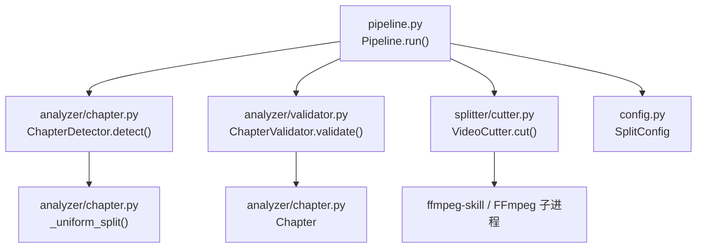
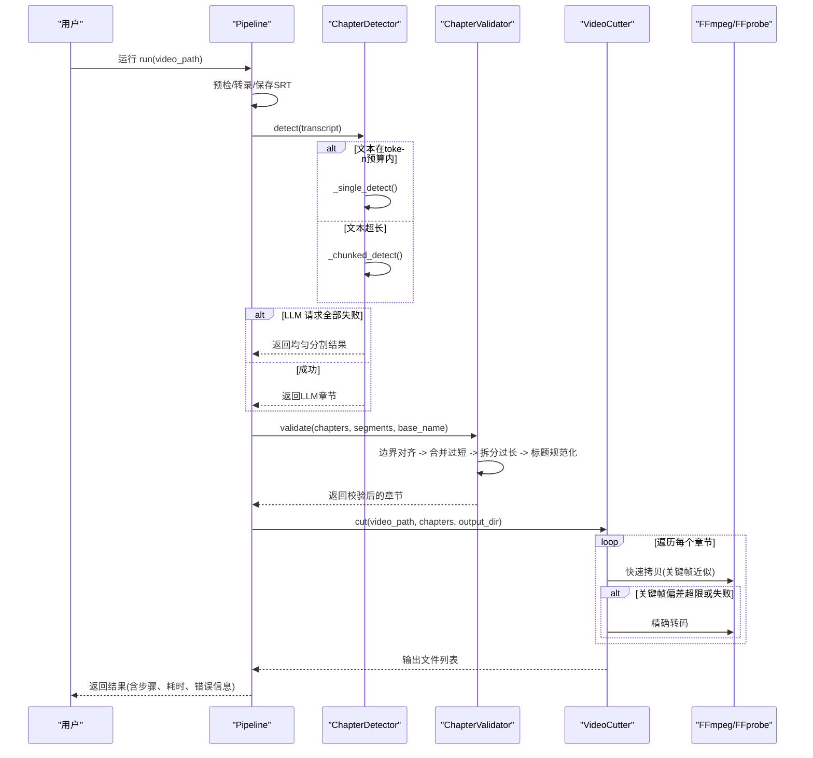
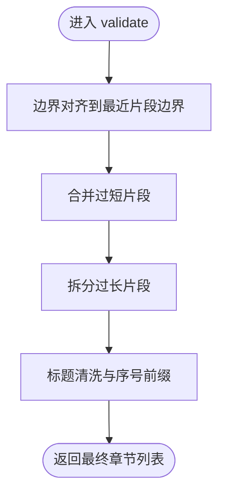
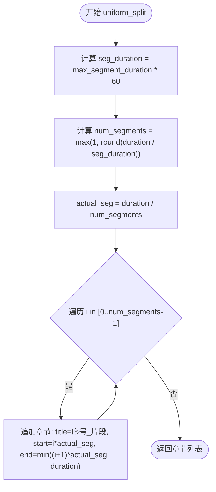
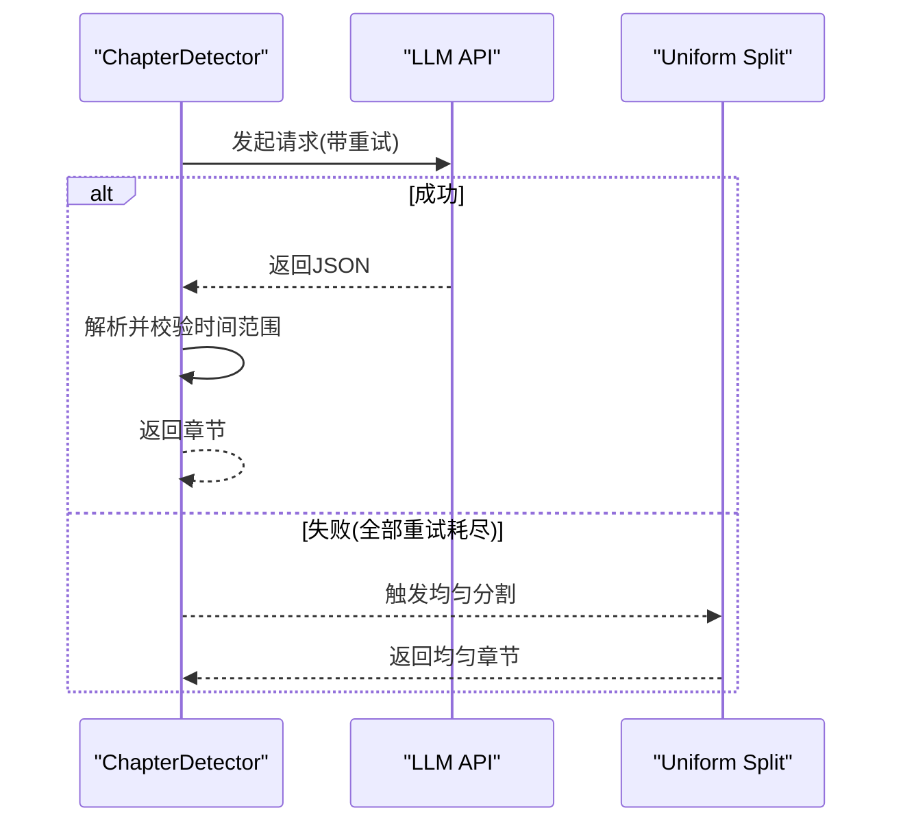
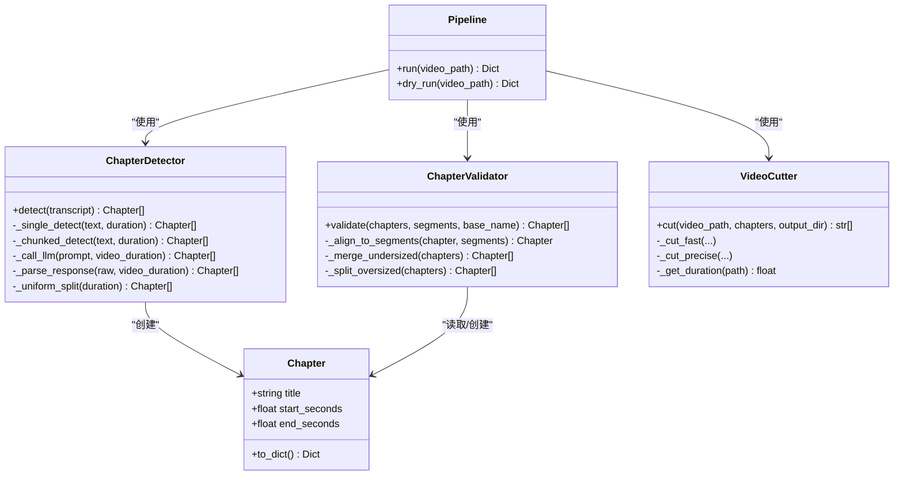

# 结果验证与降级

<cite>
**本文引用的文件**
- [video_splitter/analyzer/validator.py](file://video_splitter/analyzer/validator.py)
- [video_splitter/analyzer/chapter.py](file://video_splitter/analyzer/chapter.py)
- [video_splitter/splitter/cutter.py](file://video_splitter/splitter/cutter.py)
- [video_splitter/pipeline.py](file://video_splitter/pipeline.py)
- [video_splitter/config.py](file://video_splitter/config.py)
- [video_splitter/tests/test_validator.py](file://video_splitter/tests/test_validator.py)
- [video_splitter/tests/test_chapter.py](file://video_splitter/tests/test_chapter.py)
</cite>

## 目录
1. [简介](#简介)
2. [项目结构](#项目结构)
3. [核心组件](#核心组件)
4. [架构总览](#架构总览)
5. [详细组件分析](#详细组件分析)
6. [依赖关系分析](#依赖关系分析)
7. [性能考量](#性能考量)
8. [故障排查指南](#故障排查指南)
9. [结论](#结论)
10. [附录](#附录)

## 简介
本技术文档聚焦于“结果验证与降级机制”，围绕章节检测、边界对齐、时长约束校验、标题规范化，以及均匀分割降级策略展开。重点说明：
- ChapterValidator 的验证规则与检查逻辑（时间边界对齐、最小/最大时长合并与拆分、标题格式校验）
- 均匀分割降级策略的实现细节（分段大小计算、边界对齐算法）
- 异常处理流程与自动恢复机制（LLM 失败回退、FFmpeg 快速切片的精确回退）
- 验证规则的自定义扩展方法
- 性能监控与质量评估指标的收集与分析
- 故障排查指南与常见问题解决方案
- 如何添加新验证规则与优化现有验证逻辑

## 项目结构
与验证与降级相关的核心模块位于 analyzer、splitter 与 pipeline 层：
- analyzer/chapter.py：章节模型与基于 LLM 的章节检测器，包含滑动窗口分块、去重、JSON 解析与健壮性修复、以及均匀分割降级
- analyzer/validator.py：章节验证器，负责边界对齐、过短合并、过长拆分、标题命名规范
- splitter/cutter.py：视频切割器，支持快速拷贝与精确转码两种模式，具备关键帧容差判断与自动回退
- pipeline.py：编排整个流程，串联预检、转录、章节检测、验证、切割，并记录步骤与耗时
- config.py：统一配置项，包括时长阈值、LLM 参数、切割模式等

图表来源
- [video_splitter/pipeline.py:31-111](file://video_splitter/pipeline.py#L31-L111)
- [video_splitter/analyzer/chapter.py:77-96](file://video_splitter/analyzer/chapter.py#L77-L96)
- [video_splitter/analyzer/validator.py:22-53](file://video_splitter/analyzer/validator.py#L22-L53)
- [video_splitter/splitter/cutter.py:30-53](file://video_splitter/splitter/cutter.py#L30-L53)
- [video_splitter/config.py:19-37](file://video_splitter/config.py#L19-L37)

章节来源
- [video_splitter/pipeline.py:31-111](file://video_splitter/pipeline.py#L31-L111)
- [video_splitter/analyzer/chapter.py:77-96](file://video_splitter/analyzer/chapter.py#L77-L96)
- [video_splitter/analyzer/validator.py:22-53](file://video_splitter/analyzer/validator.py#L22-L53)
- [video_splitter/splitter/cutter.py:30-53](file://video_splitter/splitter/cutter.py#L30-L53)
- [video_splitter/config.py:19-37](file://video_splitter/config.py#L19-L37)

## 核心组件
- Chapter 数据模型：承载章节标题与起止秒数，提供序列化到字典的方法
- ChapterDetector：基于 LLM 的语义章节检测；当文本长度超过预算时采用滑动窗口分块；所有 LLM 调用失败时回退为均匀分割
- ChapterValidator：对检测结果进行边界对齐、时长约束修正与标题规范化
- VideoCutter：按章节切割视频，优先使用快速拷贝，若关键帧偏差过大则回退到精确转码
- Pipeline：编排全流程，记录步骤、输出路径、错误信息与耗时

章节来源
- [video_splitter/analyzer/chapter.py:18-41](file://video_splitter/analyzer/chapter.py#L18-L41)
- [video_splitter/analyzer/chapter.py:77-96](file://video_splitter/analyzer/chapter.py#L77-L96)
- [video_splitter/analyzer/validator.py:10-53](file://video_splitter/analyzer/validator.py#L10-L53)
- [video_splitter/splitter/cutter.py:22-53](file://video_splitter/splitter/cutter.py#L22-L53)
- [video_splitter/pipeline.py:21-111](file://video_splitter/pipeline.py#L21-L111)

## 架构总览
下图展示了从输入视频到最终切片输出的端到端流程，以及关键的降级点：

图表来源
- [video_splitter/pipeline.py:31-111](file://video_splitter/pipeline.py#L31-L111)
- [video_splitter/analyzer/chapter.py:77-96](file://video_splitter/analyzer/chapter.py#L77-L96)
- [video_splitter/analyzer/chapter.py:195-209](file://video_splitter/analyzer/chapter.py#L195-L209)
- [video_splitter/analyzer/chapter.py:303-322](file://video_splitter/analyzer/chapter.py#L303-L322)
- [video_splitter/analyzer/validator.py:22-53](file://video_splitter/analyzer/validator.py#L22-L53)
- [video_splitter/splitter/cutter.py:30-53](file://video_splitter/splitter/cutter.py#L30-L53)

## 详细组件分析

### ChapterValidator 验证规则与检查逻辑
ChapterValidator 执行三阶段处理：
- 边界对齐：将章节结束时间对齐到最近的转录片段边界，避免跨片段切割
- 过短合并：将小于最小持续时间的片段与其相邻片段合并
- 过长拆分：将大于最大持续时间的片段递归拆分为多个等长子段
- 标题规范化：清理非法字符并强制以两位序号前缀开头

图表来源
- [video_splitter/analyzer/validator.py:22-53](file://video_splitter/analyzer/validator.py#L22-L53)
- [video_splitter/analyzer/validator.py:55-74](file://video_splitter/analyzer/validator.py#L55-L74)
- [video_splitter/analyzer/validator.py:76-108](file://video_splitter/analyzer/validator.py#L76-L108)
- [video_splitter/analyzer/validator.py:110-132](file://video_splitter/analyzer/validator.py#L110-L132)

#### 时间边界验证与对齐
- 对齐目标：选择距离原章节结束时间最近的转录片段结束时间作为新的结束时间
- 空片段保护：若无可用片段，保持原边界不变
- 复杂度：线性扫描片段集合，时间复杂度 O(n)

章节来源
- [video_splitter/analyzer/validator.py:55-74](file://video_splitter/analyzer/validator.py#L55-L74)

#### 章节连续性检查与时长约束
- 过短合并：
  - 若当前片段时长小于最小阈值且存在下一片段，则与下一片段合并
  - 若为末尾片段且无下一片段，则与前一个已合并片段合并
- 过长拆分：
  - 计算需要拆分的份数 n = floor(dur/max_dur) + 1
  - 每份平均时长 part_dur = dur / n
  - 除最后一份外，其余份按 start + i*part_dur 至 start + (i+1)*part_dur 划分
  - 最后一份确保 end_seconds 等于原始结束时间，避免累积误差

章节来源
- [video_splitter/analyzer/validator.py:76-108](file://video_splitter/analyzer/validator.py#L76-L108)
- [video_splitter/analyzer/validator.py:110-132](file://video_splitter/analyzer/validator.py#L110-L132)

#### 标题格式校验与生成
- 非法字符清理：移除文件名不合法字符（如 /:*?"<>|）
- 序号前缀：确保标题以两位数字序号开头，不足补零
- 文件名模板：通过 generate_segment_filename 支持 {basename}、{seq}、{title} 占位符

章节来源
- [video_splitter/analyzer/validator.py:47-53](file://video_splitter/analyzer/validator.py#L47-L53)
- [video_splitter/analyzer/validator.py:135-152](file://video_splitter/analyzer/validator.py#L135-L152)

### 均匀分割降级策略实现
当 LLM 不可用或多次重试失败时，系统回退为均匀分割：
- 分段大小：基于 max_segment_duration（分钟）换算为秒
- 分段数量：num_segments = max(1, round(duration / seg_duration))
- 实际分段时长：actual_seg = duration / num_segments
- 边界对齐：每段起始为 i * actual_seg，结束为 min((i+1) * actual_seg, duration)，保证覆盖全片且不溢出

图表来源
- [video_splitter/analyzer/chapter.py:303-322](file://video_splitter/analyzer/chapter.py#L303-L322)

章节来源
- [video_splitter/analyzer/chapter.py:303-322](file://video_splitter/analyzer/chapter.py#L303-L322)

### 异常处理与自动恢复机制
- LLM 调用重试与回退：
  - 最多尝试 llm_max_retries + 1 次，指数退避等待
  - 解析响应时使用 JSON 修复库（可选），失败则抛出异常
  - 所有尝试均失败时，触发均匀分割降级
- 转录与 SRT 生成：
  - 转录过程可带进度回调，便于上层展示
  - SRT 转换失败不影响后续流程（由上层 try/except 捕获）
- 视频切割回退：
  - 优先快速拷贝（-c copy），若返回码非零或关键帧偏差超过 keyframe_tolerance，则回退到精确转码（libx264/aac）
  - 精确转码失败抛出 FFmpegError，供上层记录与上报

图表来源
- [video_splitter/analyzer/chapter.py:195-209](file://video_splitter/analyzer/chapter.py#L195-L209)
- [video_splitter/analyzer/chapter.py:243-301](file://video_splitter/analyzer/chapter.py#L243-L301)
- [video_splitter/analyzer/chapter.py:303-322](file://video_splitter/analyzer/chapter.py#L303-L322)

章节来源
- [video_splitter/analyzer/chapter.py:195-209](file://video_splitter/analyzer/chapter.py#L195-L209)
- [video_splitter/analyzer/chapter.py:243-301](file://video_splitter/analyzer/chapter.py#L243-L301)
- [video_splitter/analyzer/chapter.py:303-322](file://video_splitter/analyzer/chapter.py#L303-L322)
- [video_splitter/splitter/cutter.py:55-86](file://video_splitter/splitter/cutter.py#L55-L86)

### 验证规则的自定义扩展方法
- 新增验证阶段：可在 validate 中插入新的私有方法（例如 _check_continuity、_normalize_titles），并在主流程中调用
- 调整时长阈值：通过 SplitConfig.max/min_segment_duration 控制合并与拆分行为
- 自定义标题策略：修改标题清洗与序号前缀逻辑，或扩展 generate_segment_filename 的模板支持
- 边界对齐策略：可替换为更复杂的对齐算法（如考虑静音区间、场景切换点）

章节来源
- [video_splitter/analyzer/validator.py:22-53](file://video_splitter/analyzer/validator.py#L22-L53)
- [video_splitter/analyzer/validator.py:135-152](file://video_splitter/analyzer/validator.py#L135-L152)
- [video_splitter/config.py:24-37](file://video_splitter/config.py#L24-37)

### 性能监控与质量评估指标
- 耗时统计：Pipeline 在 finally 中记录 elapsed_seconds
- 步骤追踪：steps_completed 记录各阶段完成状态
- 成本估算：dry_run 根据 token 估算费用与 LLM 调用次数
- 质量指标建议：
  - 章节数量与平均时长分布
  - 过短/过长片段比例
  - 边界对齐误差（对齐前后结束时间差）
  - 关键帧偏差（快速拷贝后实际时长与期望时长差）
  - 回退率（均匀分割与精确转码触发频率）

章节来源
- [video_splitter/pipeline.py:108-111](file://video_splitter/pipeline.py#L108-L111)
- [video_splitter/pipeline.py:113-131](file://video_splitter/pipeline.py#L113-L131)
- [video_splitter/splitter/cutter.py:69-73](file://video_splitter/splitter/cutter.py#L69-L73)

## 依赖关系分析
- ChapterValidator 依赖 Chapter 模型与配置
- ChapterDetector 依赖配置与外部 LLM 客户端（openai）
- VideoCutter 依赖 ffmpeg-skill 与系统命令（ffmpeg、ffprobe）
- Pipeline 组合以上组件，并通过 SplitConfig 注入参数

图表来源
- [video_splitter/analyzer/chapter.py:18-41](file://video_splitter/analyzer/chapter.py#L18-L41)
- [video_splitter/analyzer/chapter.py:77-96](file://video_splitter/analyzer/chapter.py#L77-L96)
- [video_splitter/analyzer/validator.py:10-53](file://video_splitter/analyzer/validator.py#L10-L53)
- [video_splitter/splitter/cutter.py:22-53](file://video_splitter/splitter/cutter.py#L22-L53)
- [video_splitter/pipeline.py:21-30](file://video_splitter/pipeline.py#L21-L30)

章节来源
- [video_splitter/analyzer/chapter.py:18-41](file://video_splitter/analyzer/chapter.py#L18-L41)
- [video_splitter/analyzer/chapter.py:77-96](file://video_splitter/analyzer/chapter.py#L77-L96)
- [video_splitter/analyzer/validator.py:10-53](file://video_splitter/analyzer/validator.py#L10-L53)
- [video_splitter/splitter/cutter.py:22-53](file://video_splitter/splitter/cutter.py#L22-L53)
- [video_splitter/pipeline.py:21-30](file://video_splitter/pipeline.py#L21-L30)

## 性能考量
- 转录阶段：faster-whisper 支持 VAD 过滤与进度回调，适合长音频
- LLM 阶段：
  - 文本长度估计用于决定单次调用或分块调用
  - 分块调用采用 15 分钟窗口与 2 分钟重叠，减少上下文丢失
  - 去重逻辑在重叠 > 60s 时保留更长标题的章节，降低重复
- 切割阶段：
  - 快速拷贝显著降低 CPU 与时间开销
  - 关键帧偏差容忍度可调，避免不必要的精确转码
  - 精确转码设置 CRF 与预设平衡质量与速度

[本节为通用指导，无需特定文件引用]

## 故障排查指南
- LLM 不可用或返回非 JSON：
  - 现象：检测到异常或解析失败，自动回退均匀分割
  - 排查：确认 openai 包安装、API Key 与 Base URL 正确；查看日志中的错误信息
  - 参考：
    - [video_splitter/analyzer/chapter.py:195-209](file://video_splitter/analyzer/chapter.py#L195-L209)
    - [video_splitter/analyzer/chapter.py:243-301](file://video_splitter/analyzer/chapter.py#L243-L301)
- 章节时长不符合预期：
  - 现象：出现过多过短或过长片段
  - 排查：调整 SplitConfig.min/max_segment_duration；检查边界对齐是否生效
  - 参考：
    - [video_splitter/analyzer/validator.py:76-108](file://video_splitter/analyzer/validator.py#L76-L108)
    - [video_splitter/analyzer/validator.py:110-132](file://video_splitter/analyzer/validator.py#L110-L132)
- 标题包含非法字符或无前缀：
  - 现象：文件名生成失败或不符合命名规范
  - 排查：确认标题清洗与序号前缀逻辑；检查模板配置
  - 参考：
    - [video_splitter/analyzer/validator.py:47-53](file://video_splitter/analyzer/validator.py#L47-L53)
    - [video_splitter/analyzer/validator.py:135-152](file://video_splitter/analyzer/validator.py#L135-L152)
- 视频切割失败或时长偏差大：
  - 现象：快速拷贝失败或 ffprobe 测得时长与期望差异超过容忍度
  - 排查：提升 keyframe_tolerance 或强制精确转码；检查源视频关键帧密度
  - 参考：
    - [video_splitter/splitter/cutter.py:55-86](file://video_splitter/splitter/cutter.py#L55-L86)
- 流水线中断或步骤缺失：
  - 现象：steps_completed 不完整，status 为 error
  - 排查：查看 pipeline 日志与错误消息；确认前置步骤（转录、章节）是否成功
  - 参考：
    - [video_splitter/pipeline.py:102-111](file://video_splitter/pipeline.py#L102-L111)

章节来源
- [video_splitter/analyzer/chapter.py:195-209](file://video_splitter/analyzer/chapter.py#L195-L209)
- [video_splitter/analyzer/chapter.py:243-301](file://video_splitter/analyzer/chapter.py#L243-L301)
- [video_splitter/analyzer/validator.py:76-108](file://video_splitter/analyzer/validator.py#L76-L108)
- [video_splitter/analyzer/validator.py:110-132](file://video_splitter/analyzer/validator.py#L110-L132)
- [video_splitter/analyzer/validator.py:47-53](file://video_splitter/analyzer/validator.py#L47-L53)
- [video_splitter/analyzer/validator.py:135-152](file://video_splitter/analyzer/validator.py#L135-L152)
- [video_splitter/splitter/cutter.py:55-86](file://video_splitter/splitter/cutter.py#L55-L86)
- [video_splitter/pipeline.py:102-111](file://video_splitter/pipeline.py#L102-L111)

## 结论
本系统通过“检测—验证—切割”的分层设计，结合 LLM 智能识别与多层次的降级与回退机制，实现了高鲁棒性的视频章节化与切片能力。ChapterValidator 的边界对齐、时长约束与标题规范化确保了输出的一致性与可用性；均匀分割与精确转码回退保障了在异常条件下的稳定性。通过合理的配置与可扩展的验证规则，系统能够适应不同业务需求与资源约束。

[本节为总结性内容，无需特定文件引用]

## 附录

### 测试用例要点
- 验证器：
  - 过短合并与过长拆分的行为符合预期
  - 边界对齐选择最近片段边界
  - 文件名模板与非法字符清理有效
- 检测器：
  - 单段与分块检测路径均可工作
  - LLM 失败时回退均匀分割
  - JSON 解析支持 markdown 包裹与修复
  - 时间戳解析与格式化正确

章节来源
- [video_splitter/tests/test_validator.py:35-170](file://video_splitter/tests/test_validator.py#L35-L170)
- [video_splitter/tests/test_chapter.py:55-348](file://video_splitter/tests/test_chapter.py#L55-L348)