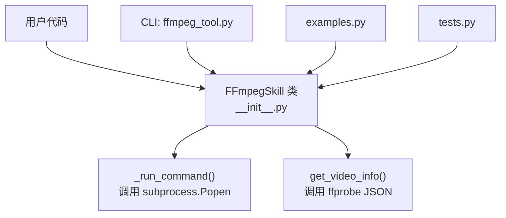
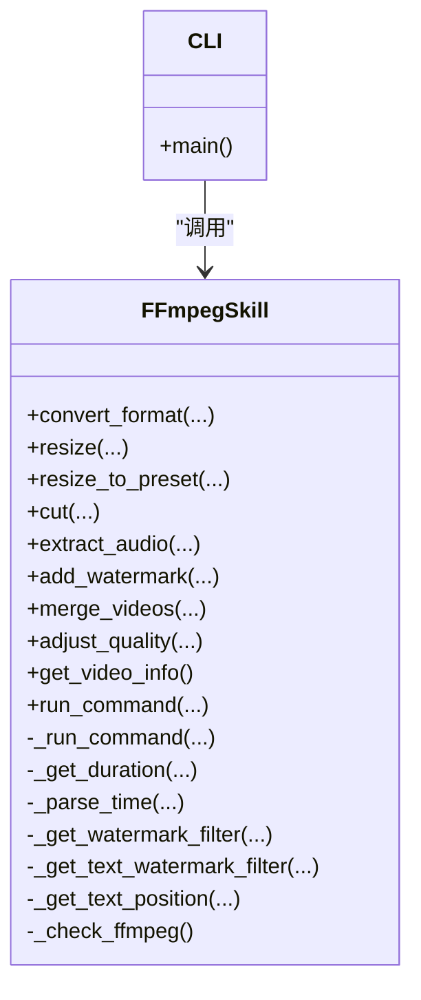
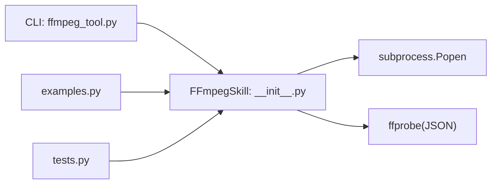

# FFmpeg技能库

<cite>
**本文引用的文件**
- [ffmpeg-skill/__init__.py](file://ffmpeg-skill/__init__.py)
- [ffmpeg-skill/ffmpeg_tool.py](file://ffmpeg-skill/ffmpeg_tool.py)
- [ffmpeg-skill/examples.py](file://ffmpeg-skill/examples.py)
- [ffmpeg-skill/tests.py](file://ffmpeg-skill/tests.py)
- [README.md](file://README.md)
</cite>

## 目录
1. [简介](#简介)
2. [项目结构](#项目结构)
3. [核心组件](#核心组件)
4. [架构总览](#架构总览)
5. [详细组件分析](#详细组件分析)
6. [依赖关系分析](#依赖关系分析)
7. [性能与优化](#性能与优化)
8. [故障排查指南](#故障排查指南)
9. [结论](#结论)
10. [附录：扩展自定义处理管道](#附录扩展自定义处理管道)

## 简介
本技术文档围绕 ffmpeg-skill 模块，系统化阐述 FFmpegSkill 类的设计理念、封装策略与能力边界。该模块提供面向 Python 的高层 API，覆盖格式转换、分辨率调整、视频切割、音频提取、水印添加（图像/文本）、视频合并、质量调节、媒体信息获取等常用音视频处理能力，并通过命令行工具 ffmpeg-tool 暴露统一入口。同时给出错误处理机制、与底层 FFmpeg/ffprobe 的集成方式、性能优化建议以及扩展自定义处理管道的指南。

## 项目结构
ffmpeg-skill 目录包含以下关键文件：
- __init__.py：FFmpegSkill 主类实现，所有高层方法定义与内部执行逻辑
- ffmpeg_tool.py：基于 argparse 的 CLI 入口，映射到 FFmpegSkill 的方法
- examples.py：示例脚本，演示常见用法
- tests.py：单元测试，覆盖参数校验、异常路径与时间解析等

图表来源
- [ffmpeg-skill/__init__.py](file://ffmpeg-skill/__init__.py)
- [ffmpeg-skill/ffmpeg_tool.py](file://ffmpeg-skill/ffmpeg_tool.py)
- [ffmpeg-skill/examples.py](file://ffmpeg-skill/examples.py)
- [ffmpeg-skill/tests.py](file://ffmpeg-skill/tests.py)

章节来源
- [README.md:1-50](file://README.md#L1-L50)
- [ffmpeg-skill/AGENTS.md:1-39](file://ffmpeg-skill/AGENTS.md#L1-L39)

## 核心组件
- FFmpegSkill 类
  - 负责构建并执行 FFmpeg/ffprobe 命令，提供高层方法封装
  - 内置分辨率预设、编解码器别名、进度回调接口、错误类型 FFmpegError
- CLI 工具 ffmpeg_tool.py
  - 将命令行子命令映射到 FFmpegSkill 对应方法
- 示例与测试
  - examples.py 展示典型用法
  - tests.py 验证参数校验、异常路径与时间解析

章节来源
- [ffmpeg-skill/__init__.py:22-673](file://ffmpeg-skill/__init__.py#L22-L673)
- [ffmpeg-skill/ffmpeg_tool.py:1-283](file://ffmpeg-skill/ffmpeg_tool.py#L1-L283)
- [ffmpeg-skill/examples.py:1-205](file://ffmpeg-skill/examples.py#L1-L205)
- [ffmpeg-skill/tests.py:1-196](file://ffmpeg-skill/tests.py#L1-L196)

## 架构总览
FFmpegSkill 作为中间层，屏蔽了底层 FFmpeg/ffprobe 的参数细节，通过统一的输入校验、命令拼装和进程执行流程，对外暴露简洁易用的方法。CLI 层通过 argparse 解析参数后直接调用 FFmpegSkill 方法；示例与测试则直接以编程方式使用该类。

图表来源
- [ffmpeg-skill/__init__.py:22-673](file://ffmpeg-skill/__init__.py#L22-L673)
- [ffmpeg-skill/ffmpeg_tool.py:20-243](file://ffmpeg-skill/ffmpeg_tool.py#L20-L243)

## 详细组件分析

### FFmpegSkill 设计与封装策略
- 初始化与环境检查
  - 构造函数接收 ffmpeg_path 与 ffprobe_path，默认使用系统 PATH 中的可执行名
  - _check_ffmpeg 通过运行版本命令检测可用性，失败抛出 FFmpegError
- 命令执行与进度回调
  - _run_command 统一封装 Popen 启动、stderr 读取、超时与返回码处理
  - progress_callback 为可选回调，当前实现仅做简单触发，未计算精确百分比
- 输入校验与错误模型
  - 缺失输入文件抛 FileNotFoundError
  - 非法参数抛 ValueError
  - FFmpeg/ffprobe 执行异常统一包装为 FFmpegError
- 辅助能力
  - _get_duration 使用 ffprobe 获取时长
  - _parse_time 支持 HH:MM:SS、MM:SS、秒三种格式
  - 水印位置与 drawtext 滤镜生成

章节来源
- [ffmpeg-skill/__init__.py:58-94](file://ffmpeg-skill/__init__.py#L58-L94)
- [ffmpeg-skill/__init__.py:95-143](file://ffmpeg-skill/__init__.py#L95-L143)
- [ffmpeg-skill/__init__.py:144-172](file://ffmpeg-skill/__init__.py#L144-L172)
- [ffmpeg-skill/__init__.py:315-333](file://ffmpeg-skill/__init__.py#L315-L333)
- [ffmpeg-skill/__init__.py:430-467](file://ffmpeg-skill/__init__.py#L430-L467)

### 支持的媒体处理功能与方法说明

- 格式转换 convert_format
  - 作用：将输入媒体转换为指定输出格式，可选择视频/音频编码与质量
  - 参数
    - input_path: str，输入文件路径
    - output_path: str，输出文件路径
    - video_codec: Optional[str]，视频编码器（如 libx264、libvpx-vp9）
    - audio_codec: Optional[str]，音频编码器（如 aac、libopus）
    - quality: Optional[int]，CRF 值（范围参考 adjust_quality）
    - progress_callback: Optional[Callable[[float], None]]，进度回调
  - 返回值：无
  - 异常：FileNotFoundError、FFmpegError
  - 参考路径
    - [ffmpeg-skill/__init__.py:173-206](file://ffmpeg-skill/__init__.py#L173-L206)

- 分辨率调整 resize / resize_to_preset
  - 作用：按目标宽高或预设进行缩放，保持或不保持纵横比
  - 参数
    - input_path, output_path: str
    - width, height: int
    - maintain_aspect: bool，是否保持纵横比
    - preset: str，预设名称（4k/1080p/720p/480p/360p/240p）
    - progress_callback: Optional[...]
  - 返回值：无
  - 异常：ValueError（无效预设）、FileNotFoundError、FFmpegError
  - 参考路径
    - [ffmpeg-skill/__init__.py:208-247](file://ffmpeg-skill/__init__.py#L208-L247)
    - [ffmpeg-skill/__init__.py:249-273](file://ffmpeg-skill/__init__.py#L249-L273)

- 视频切割 cut
  - 作用：从起始时间截取片段，支持 duration 或 end_time 二选一
  - 参数
    - start_time: str，HH:MM:SS 或秒
    - duration: Optional[str]，时长
    - end_time: Optional[str]，结束时间
    - progress_callback: Optional[...]
  - 返回值：无
  - 异常：ValueError（缺少 duration/end_time）、FileNotFoundError、FFmpegError
  - 参考路径
    - [ffmpeg-skill/__init__.py:275-313](file://ffmpeg-skill/__init__.py#L275-L313)
    - [ffmpeg-skill/__init__.py:315-333](file://ffmpeg-skill/__init__.py#L315-L333)

- 音频提取 extract_audio
  - 作用：从视频中提取音轨，可指定编码与比特率
  - 参数
    - codec: str，音频编码（默认 aac）
    - bitrate: str，比特率（默认 192k）
    - progress_callback: Optional[...]
  - 返回值：无
  - 异常：FileNotFoundError、FFmpegError
  - 参考路径
    - [ffmpeg-skill/__init__.py:335-368](file://ffmpeg-skill/__init__.py#L335-L368)

- 水印添加 add_watermark
  - 作用：叠加图像水印或文本水印，支持位置与透明度
  - 参数
    - watermark_path: Optional[str]，图像水印路径
    - text: Optional[str]，文本水印内容
    - position: str，位置（top-left/top-right/bottom-left/bottom-right/center）
    - opacity: float，透明度（0.0-1.0）
    - progress_callback: Optional[...]
  - 返回值：无
  - 异常：ValueError（未提供 text 或 image）、FileNotFoundError、FFmpegError
  - 参考路径
    - [ffmpeg-skill/__init__.py:370-428](file://ffmpeg-skill/__init__.py#L370-L428)
    - [ffmpeg-skill/__init__.py:430-467](file://ffmpeg-skill/__init__.py#L430-L467)

- 视频合并 merge_videos
  - 作用：将多个视频合并为一个，使用 concat 滤镜
  - 参数
    - input_paths: List[str]，至少两个输入
    - transition: Optional[str]，占位参数（当前未生效）
    - progress_callback: Optional[...]
  - 返回值：无
  - 异常：ValueError（少于两个输入）、FileNotFoundError、FFmpegError
  - 参考路径
    - [ffmpeg-skill/__init__.py:469-513](file://ffmpeg-skill/__init__.py#L469-L513)

- 质量调节 adjust_quality
  - 作用：调整视频质量，支持 CRF、目标码率与编码预设
  - 参数
    - crf: Optional[int]，0-51（越小质量越高）
    - bitrate: Optional[str]，目标码率（如 5M）
    - preset: str，编码预设（ultrafast...veryslow）
    - progress_callback: Optional[...]
  - 返回值：无
  - 异常：ValueError（preset 非法或 CRF 越界）、FileNotFoundError、FFmpegError
  - 参考路径
    - [ffmpeg-skill/__init__.py:515-564](file://ffmpeg-skill/__init__.py#L515-L564)

- 媒体信息获取 get_video_info
  - 作用：通过 ffprobe 获取媒体元数据与流信息
  - 参数
    - input_path: str
  - 返回值：Dict[str, Any]，包含文件名、格式、时长、大小、码率、视频/音频流信息等
  - 异常：FileNotFoundError、FFmpegError（含 JSON 解析与超时）
  - 参考路径
    - [ffmpeg-skill/__init__.py:566-635](file://ffmpeg-skill/__init__.py#L566-L635)

- 自定义命令 run_command
  - 作用：透传任意 FFmpeg 命令列表，便于扩展
  - 参数
    - command: List[str]
    - progress_callback: Optional[...]
  - 返回值：无
  - 异常：FFmpegError
  - 参考路径
    - [ffmpeg-skill/__init__.py:637-652](file://ffmpeg-skill/__init__.py#L637-L652)

- 便捷工厂 create_ffmpeg_skill
  - 作用：快速创建 FFmpegSkill 实例
  - 参考路径
    - [ffmpeg-skill/__init__.py:656-669](file://ffmpeg-skill/__init__.py#L656-L669)

章节来源
- [ffmpeg-skill/__init__.py:173-669](file://ffmpeg-skill/__init__.py#L173-L669)

### CLI 工具 ffmpeg_tool.py
- 提供子命令：convert、resize、cut、extract-audio、watermark、merge、quality、info
- 每个子命令均映射至 FFmpegSkill 对应方法，并在成功时打印结果
- 错误处理：捕获 FFmpegError、FileNotFoundError、ValueError、KeyboardInterrupt 等，返回非零退出码
- 参考路径
  - [ffmpeg-skill/ffmpeg_tool.py:20-243](file://ffmpeg-skill/ffmpeg_tool.py#L20-L243)
  - [ffmpeg-skill/ffmpeg_tool.py:245-283](file://ffmpeg-skill/ffmpeg_tool.py#L245-L283)

章节来源
- [ffmpeg-skill/ffmpeg_tool.py:1-283](file://ffmpeg-skill/ffmpeg_tool.py#L1-L283)

### 示例与测试
- examples.py 展示了各方法的典型调用方式，包括批量处理与进度回调
- tests.py 覆盖了：
  - 初始化有效性
  - 无效预设、缺失输入文件、水印参数缺失、切割参数缺失、合并文件数量不足
  - 质量预设非法、CRF 越界
  - 获取信息时缺失文件
  - 时间解析（HH:MM:SS、MM:SS、秒）
- 参考路径
  - [ffmpeg-skill/examples.py:1-205](file://ffmpeg-skill/examples.py#L1-L205)
  - [ffmpeg-skill/tests.py:1-196](file://ffmpeg-skill/tests.py#L1-L196)

章节来源
- [ffmpeg-skill/examples.py:1-205](file://ffmpeg-skill/examples.py#L1-L205)
- [ffmpeg-skill/tests.py:1-196](file://ffmpeg-skill/tests.py#L1-L196)

## 依赖关系分析
- 外部依赖
  - FFmpeg/ffprobe 可执行文件：通过路径或 PATH 查找
  - Python 标准库：subprocess、json、os、re、typing
- 内部耦合
  - CLI 依赖 FFmpegSkill 公共方法
  - 示例与测试直接依赖 FFmpegSkill
- 潜在循环依赖
  - 无循环导入，结构清晰

图表来源
- [ffmpeg-skill/ffmpeg_tool.py:1-283](file://ffmpeg-skill/ffmpeg_tool.py#L1-L283)
- [ffmpeg-skill/__init__.py:1-673](file://ffmpeg-skill/__init__.py#L1-L673)

章节来源
- [ffmpeg-skill/__init__.py:1-673](file://ffmpeg-skill/__init__.py#L1-L673)
- [ffmpeg-skill/ffmpeg_tool.py:1-283](file://ffmpeg-skill/ffmpeg_tool.py#L1-L283)

## 性能与优化
- 编码预设与质量
  - 使用 adjust_quality 的 preset 控制编码速度与质量权衡（ultrafast→veryslow）
  - CRF 控制视觉质量，数值越低质量越高但体积越大
- 转码 vs 拷贝
  - resize 默认复制音频流（-c:a copy），减少不必要的重编码
  - cut 使用 -c copy 进行无损分段，速度更快
- 并行与批处理
  - 可在上层对多文件任务进行并发调度（例如线程池/进程池），注意磁盘 I/O 与 CPU 占用
- 进度反馈
  - 当前进度回调为简化实现，如需精确进度需自行解析 ffprobe/ffmpeg 输出并计算百分比
- 资源管理
  - 避免在长时间任务中持有过多临时文件，及时清理中间产物

章节来源
- [ffmpeg-skill/__init__.py:208-247](file://ffmpeg-skill/__init__.py#L208-L247)
- [ffmpeg-skill/__init__.py:275-313](file://ffmpeg-skill/__init__.py#L275-L313)
- [ffmpeg-skill/__init__.py:515-564](file://ffmpeg-skill/__init__.py#L515-L564)

## 故障排查指南
- 环境检查
  - 初始化阶段会执行版本探测，若找不到或不可用将抛出 FFmpegError
  - 确认 ffmpeg/ffprobe 可执行文件路径正确或在 PATH 中
- 常见异常
  - FileNotFoundError：输入文件或水印图片不存在
  - ValueError：参数不合法（如预设无效、CRF 越界、缺少必要参数）
  - FFmpegError：底层命令执行失败、超时或 ffprobe 输出解析失败
- 调试建议
  - 使用 run_command 构造最小复现命令，直接在终端执行定位问题
  - 开启更详细的日志输出（在 _run_command 中可增强 stderr 记录）
  - 对于大文件任务，关注超时设置与进程生命周期管理

章节来源
- [ffmpeg-skill/__init__.py:73-94](file://ffmpeg-skill/__init__.py#L73-L94)
- [ffmpeg-skill/__init__.py:95-143](file://ffmpeg-skill/__init__.py#L95-L143)
- [ffmpeg-skill/__init__.py:566-635](file://ffmpeg-skill/__init__.py#L566-L635)
- [ffmpeg-skill/ffmpeg_tool.py:228-243](file://ffmpeg-skill/ffmpeg_tool.py#L228-L243)

## 结论
FFmpegSkill 通过统一封装与严格的参数校验，提供了易用且可扩展的音视频处理能力。其清晰的职责划分（高层 API、CLI、示例与测试）使得维护与扩展变得简单。结合合理的预设与质量策略，可在保证效果的同时兼顾性能。对于复杂场景，可通过 run_command 或直接继承扩展，构建自定义处理管道。

## 附录：扩展自定义处理管道
- 新增操作
  - 在 FFmpegSkill 中添加新方法，遵循现有约定：输入校验、命令拼装、调用 _run_command
  - 在 CLI 中新增子命令并映射到新方法
- 进度与日志
  - 如需精确进度，可在 _run_command 中解析 ffmpeg 输出并计算百分比
  - 增加结构化日志输出，便于追踪长任务
- 错误与重试
  - 在上层封装重试逻辑，针对网络或 I/O 不稳定场景提升鲁棒性
- 配置化
  - 将常用预设、编码器、滤镜组合抽象为配置对象，便于复用与切换
- 参考路径
  - [ffmpeg-skill/__init__.py:637-652](file://ffmpeg-skill/__init__.py#L637-L652)
  - [ffmpeg-skill/ffmpeg_tool.py:53-148](file://ffmpeg-skill/ffmpeg_tool.py#L53-L148)
