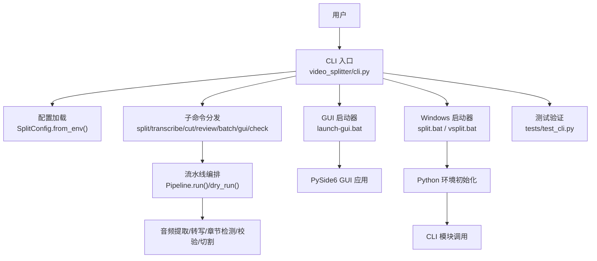
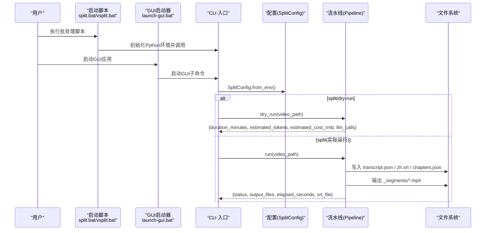

# 命令行界面

<cite>
**本文引用的文件**   
- [cli.py](file://video_splitter/cli.py)
- [config.py](file://video_splitter/config.py)
- [pipeline.py](file://video_splitter/pipeline.py)
- [split.bat](file://video_splitter/split.bat)
- [vsplit.bat](file://video_splitter/vsplit.bat)
- [launch-gui.bat](file://launch-gui.bat)
- [test.yml](file://.github/workflows/test.yml)
- [test_cli.py](file://video_splitter/tests/test_cli.py)
</cite>

## 更新摘要
**所做更改**   
- 新增批处理脚本支持章节，详细说明split.bat、vsplit.bat和launch-gui.bat的使用方法
- 扩展Windows启动器脚本的使用说明，包括路径配置和环境设置
- 添加GUI启动器的独立使用说明
- 完善批处理脚本与CLI命令的对应关系说明

## 目录
1. [简介](#简介)
2. [项目结构](#项目结构)
3. [核心组件](#核心组件)
4. [架构总览](#架构总览)
5. [详细命令参考](#详细命令参考)
6. [依赖与配置](#依赖与配置)
7. [批处理与目录扫描](#批处理与目录扫描)
8. [日志输出与调试](#日志输出与调试)
9. [与其他工具链集成](#与其他工具链集成)
10. [脚本自动化与CI/CD集成](#脚本自动化与cicd集成)
11. [批处理脚本使用指南](#批处理脚本使用指南)
12. [程序化使用与测试验证](#程序化使用与测试验证)
13. [故障排查](#故障排查)
14. [结论](#结论)

## 简介
本仓库提供一套面向视频处理的命令行工具，支持基于话题的智能分段、音频转写、章节生成、交互式校对以及批量处理等能力。CLI 入口位于 video_splitter.cli，通过子命令组织功能：split（完整流程）、transcribe（仅转写）、cut（按章节切割）、review（交互式校对）、batch（批量处理）等。

**更新** 新增完整的批处理脚本支持，提供简化的命令行访问方式，包括视频分割、快速分割和GUI启动脚本。

## 项目结构
与 CLI 直接相关的核心文件如下：
- cli.py：命令行解析与子命令实现
- config.py：配置数据类与环境变量注入
- pipeline.py：端到端流水线编排（预检→提取→转写→章节→校验→切割）
- split.bat / vsplit.bat：Windows 启动器脚本
- launch-gui.bat：GUI应用程序启动器
- .github/workflows/test.yml：CI 测试工作流示例
- tests/test_cli.py：CLI 功能测试套件



**图表来源**
- [cli.py:1-256](file://video_splitter/cli.py#L1-L256)
- [config.py:1-54](file://video_splitter/config.py#L1-L54)
- [pipeline.py:1-131](file://video_splitter/pipeline.py#L1-L131)
- [split.bat:1-11](file://video_splitter/split.bat#L1-L11)
- [vsplit.bat:1-10](file://video_splitter/vsplit.bat#L1-L10)
- [launch-gui.bat:1-10](file://launch-gui.bat#L1-L10)
- [test_cli.py:1-200](file://video_splitter/tests/test_cli.py#L1-L200)

## 核心组件
- CLI 入口与参数解析：定义所有子命令及参数，并将参数映射到具体处理函数。
- 配置管理：从环境变量注入模型、设备、切分策略、命名模板、恢复模式、转写引擎等。
- 流水线编排：串联音频提取、转写、章节检测、校验、切割，并记录步骤与耗时。
- 批处理脚本：提供简化的Windows命令行访问方式。
- GUI启动器：一键启动图形界面应用程序。

## 架构总览
下图展示 CLI 到 Pipeline 的调用关系与关键数据产物（转写 JSON、SRT、章节 JSON、分段视频）。



**图表来源**
- [cli.py:15-46](file://video_splitter/cli.py#L15-L46)
- [pipeline.py:31-111](file://video_splitter/pipeline.py#L31-L111)
- [split.bat:1-11](file://video_splitter/split.bat#L1-L11)
- [vsplit.bat:1-10](file://video_splitter/vsplit.bat#L1-L10)
- [launch-gui.bat:1-10](file://launch-gui.bat#L1-L10)

## 详细命令参考

### 通用说明
- 所有子命令均通过 Python 模块方式调用：python -m video_splitter.cli <command> [options]
- Windows 快捷启动器：
  - split.bat：将当前目录加入 PYTHONPATH 后调用 CLI
  - vsplit.bat：以项目根为 PYTHONPATH 调用 CLI
  - launch-gui.bat：启动图形界面应用程序
- 日志格式：默认 INFO 级别，格式包含时间戳、级别与消息。

### split：智能分段全流程
用途：对输入视频进行音频提取、转写、章节检测、校验与切割，输出分段视频与 SRT。

参数
- 位置参数
  - video：输入视频路径
- 可选参数
  - --max-duration：最大分段时长（分钟），默认 15
  - --model：Whisper 模型大小，可选 tiny/base/small/medium/large-v3
  - --cut-mode：切割精度模式，可选 fast/precise
  - --resume：若中间产物存在则跳过对应步骤
  - --dry-run：仅估算成本与 LLM 调用次数，不实际调用

典型用法
- 估算一次运行的成本与 LLM 调用次数：
  - python -m video_splitter.cli split your_video.mp4 --dry-run
- 使用 small 模型、精确切割、开启恢复模式：
  - python -m video_splitter.cli split your_video.mp4 --model small --cut-mode precise --resume
- 限制每段不超过 10 分钟：
  - python -m video_splitter.cli split your_video.mp4 --max-duration 10

输出
- 控制台打印：状态、分段数量、耗时、输出文件列表、SRT 路径
- 文件产出：
  - 同目录下的 transcript.json、zh.srt、chapters.json
  - 同级目录生成 <basename>_segments/ 文件夹，内含分段视频

### transcribe：仅音频转写
用途：从视频中提取音频并进行转写，保存为 JSON。

参数
- 位置参数
  - video：输入视频路径
- 可选参数
  - --model：Whisper 模型大小，可选 tiny/base/small/medium/large-v3

典型用法
- 对视频进行转写并保存 JSON：
  - python -m video_splitter.cli transcribe your_video.mp4
  - 指定 large-v3 模型：
    - python -m video_splitter.cli transcribe your_video.mp4 --model large-v3

输出
- 同目录下生成 <basename>.transcript.json
- 控制台打印：保存路径、时长、分段数

### cut：按章节切割
用途：读取已有章节文件，对原视频进行切割。

参数
- 位置参数
  - video：输入视频路径
- 必填参数
  - --chapters：章节 JSON 文件路径
- 可选参数
  - --cut-mode：fast/precise

典型用法
- 使用已生成的 chapters.json 进行切割：
  - python -m video_splitter.cli cut your_video.mp4 --chapters your_video.chapters.json
  - 使用精确切割：
    - python -m video_splitter.cli cut your_video.mp4 --chapters your_video.chapters.json --cut-mode precise

输出
- 在同级目录生成 <basename>_segments/ 文件夹，内含分段视频
- 控制台打印：分段数量与文件列表

### review：交互式转写校对
用途：打开交互界面，对照视频播放与字幕，人工修正转写内容。

参数
- 位置参数
  - video：输入视频路径
- 可选参数
  - --transcript：指定转写 JSON 路径（省略时自动推导）
  - --resume：从上次检查点继续
  - --no-save：仅预览，不保存修改

典型用法
- 打开校对界面（自动推导 transcript 路径）：
  - python -m video_splitter.cli review your_video.mp4
  - 指定 transcript 并开启恢复模式：
    - python -m video_splitter.cli review your_video.mp4 --transcript your_video.transcript.json --resume
  - 仅预览不保存：
    - python -m video_splitter.cli review your_video.mp4 --no-save

### batch：批量处理
用途：顺序处理目录中的所有 .mp4 文件，统计成功与失败情况。

参数
- 位置参数
  - dir：包含 .mp4 文件的目录
- 可选参数
  - --max-duration：最大分段时长（分钟），默认 15
  - --resume：是否启用恢复模式

典型用法
- 批量处理某目录下的所有 MP4：
  - python -m video_splitter.cli batch ./videos --max-duration 10
  - 开启恢复模式：
    - python -m video_splitter.cli batch ./videos --resume

输出
- 控制台打印：每个文件的状态、最终汇总（总数/成功/失败）

注意
- 当前实现仅匹配 *.mp4 扩展名；如需其他格式，可结合外部脚本或后续扩展。

### check：环境与健康检查
用途：检查 FFmpeg、faster-whisper、json-repair 与 LLM API 配置，并提供粗略性能估算。

参数
- 无位置参数

典型用法
- 运行环境检查：
  - python -m video_splitter.cli check

输出
- 逐项报告 OK/WARN/FAIL，并在最后汇总问题清单或通过信息

### gui：启动图形界面
用途：启动 PySide6 GUI 应用（需安装 GUI 依赖）。

参数
- 无位置参数

典型用法
- 启动 GUI：
  - python -m video_splitter.cli gui

## 依赖与配置

### 环境变量
以下环境变量会被 SplitConfig 读取并覆盖默认值：
- OPENAI_API_BASE：LLM API 基地址
- OPENAI_API_KEY / WHALECLOUD_API_KEY：LLM API 密钥（后者优先）
- VIDEO_SPLITTER_DEVICE：推理设备（auto/cpu/gpu 等）
- VIDEO_SPLITTER_RESUME：是否启用恢复模式（1/true/yes）
- VIDEO_SPLITTER_ENGINE：转写引擎名称（例如 funasr）

### 配置项概览
- 模型与计算：model_size、device、compute_type
- 分段控制：max_segment_duration、min_segment_duration、cut_mode、keyframe_tolerance
- LLM 相关：llm_api_base、llm_api_key、llm_model、llm_token_budget、llm_max_retries
- 输出设置：language、naming_template、resume
- 转写引擎：transcription_engine、engine_config

## 批处理与目录扫描
- 内置 batch 子命令会扫描指定目录中的 *.mp4 文件并逐个处理。
- 未找到任何匹配文件时会提示并返回。
- 单个文件处理失败不会中断整体流程，最终汇总成功/失败计数。

建议
- 在 CI 中先准备测试数据集，再调用 batch 子命令进行回归验证。
- 对于非 MP4 场景，可在外部脚本中统一转换后再交由 batch 处理。

## 日志输出与调试
- 默认日志级别：INFO
- 默认格式：时间戳 + 级别 + 消息
- 可通过标准 logging 机制调整级别与格式（例如在入口前配置）

常见调试手段
- 使用 --dry-run 预估成本与 LLM 调用次数，避免真实消耗
- 使用 --resume 跳过已完成步骤，加速迭代
- 使用 check 子命令快速定位缺失依赖或配置问题

## 与其他工具链集成
- 与 FFmpeg：底层音视频处理依赖 FFmpeg，请确保系统 PATH 中包含 ffmpeg 可执行文件。
- 与转写引擎：默认使用 funasr，可通过环境变量 VIDEO_SPLITTER_ENGINE 切换。
- 与 LLM：通过 OPENAI_API_BASE/OPENAI_API_KEY 或 WHALECLOUD_API_KEY 配置后端。
- 与 SRT：流水线会自动生成 zh.srt，便于播放器或字幕编辑工具使用。

最佳实践
- 在容器或 CI 环境中预先安装 FFmpeg 与 Python 依赖，减少运行时错误。
- 使用 --resume 与固定 naming_template 保证幂等性与可重复性。
- 使用 --dry-run 在提交前评估成本，避免意外开销。

## 脚本自动化与CI/CD集成

### Windows 本地快捷启动
- 在项目根目录使用 vsplit.bat 或直接进入 video_splitter 目录使用 split.bat，均可便捷调用 CLI。

示例
- 在 Windows 终端：
  - cd video_splitter
  - split.bat your_video.mp4 --max-duration 10 --model small

### Linux/macOS 一键脚本
- 可直接使用 python -m video_splitter.cli 调用，无需额外包装。

示例
- 单文件处理：
  - python -m video_splitter.cli split ./input.mp4 --max-duration 10
- 批量处理：
  - python -m video_splitter.cli batch ./videos --resume

### GitHub Actions 集成示例
- 工作流文件定义了安装 FFmpeg、Python 依赖与运行测试的步骤，可作为参考扩展到实际构建任务中。

参考
- 工作流文件：.github/workflows/test.yml

## 批处理脚本使用指南

### Windows 批处理脚本概览
项目提供了三个主要的Windows批处理脚本，用于简化命令行操作：

#### split.bat - 视频分割脚本
位置：video_splitter/split.bat
功能：将当前目录加入PYTHONPATH后调用CLI进行视频分割处理
使用方法：
- 进入video_splitter目录
- 双击运行split.bat
- 或在命令行中执行：split.bat [视频文件路径] [可选参数]

#### vsplit.bat - 快速分割脚本  
位置：video_splitter/vsplit.bat
功能：以项目根目录为PYTHONPATH调用CLI，提供更灵活的路径处理
使用方法：
- 在项目任意目录执行：vsplit.bat [视频文件路径] [可选参数]
- 适合需要跨目录操作的场景

#### launch-gui.bat - GUI启动脚本
位置：launch-gui.bat  
功能：一键启动图形界面应用程序
使用方法：
- 在项目根目录双击运行launch-gui.bat
- 或在命令行中执行：launch-gui.bat

### 脚本特性说明
- **路径自动配置**：脚本自动设置PYTHONPATH，无需手动配置Python环境
- **依赖检查**：启动前检查必要的Python包和依赖
- **错误处理**：提供友好的错误提示信息
- **兼容性**：支持不同Windows版本和Python环境

### 使用示例

#### 使用split.bat进行视频分割
```batch
cd video_splitter
split.bat input_video.mp4 --max-duration 10 --model small
```

#### 使用vsplit.bat进行批量处理
```batch
vsplit.bat ./videos --max-duration 15 --resume
```

#### 使用launch-gui.bat启动图形界面
```batch
launch-gui.bat
```

### 脚本自定义
如果需要修改脚本行为，可以编辑相应的.bat文件：
- 修改Python解释器路径
- 添加额外的环境变量
- 调整错误处理逻辑
- 添加日志输出选项

**章节来源**
- [split.bat:1-11](file://video_splitter/split.bat#L1-L11)
- [vsplit.bat:1-10](file://video_splitter/vsplit.bat#L1-L10)
- [launch-gui.bat:1-10](file://launch-gui.bat#L1-L10)

## 程序化使用与测试验证

### 测试覆盖范围
新增的135行测试代码提供了全面的CLI功能验证，涵盖以下关键领域：

#### 参数解析验证
- 位置参数和可选参数的正确解析
- 参数类型转换和默认值处理
- 无效参数的错误处理
- 参数组合的兼容性检查

#### 命令执行验证
- 各子命令的基本执行流程
- 命令间的数据传递和依赖关系
- 异步操作的回调处理
- 资源清理和状态管理

#### 错误处理验证
- 文件不存在和权限错误的处理
- 网络请求失败的容错机制
- 内存不足和超时异常的处理
- 配置文件损坏的恢复策略

#### 输出格式验证
- 控制台输出的格式和内容
- 文件产物的结构和完整性
- JSON数据的序列化和反序列化
- 日志信息的层次和详细程度

### 自动化测试最佳实践

#### 单元测试设计原则
- 使用模拟对象隔离外部依赖
- 测试边界条件和异常情况
- 验证输入输出的契约关系
- 保持测试的可重复性和独立性

#### 集成测试策略
- 端到端的命令执行流程测试
- 多命令组合的工作流验证
- 配置文件和环境变量的影响测试
- 不同平台兼容性验证

#### 持续集成配置
- 并行执行测试用例提高构建速度
- 缓存依赖包减少安装时间
- 测试覆盖率报告和质量门禁
- 失败时的详细错误信息收集

### 程序化API使用示例

#### 基础调用模式
```python
from video_splitter.cli import main
import sys

# 基本命令调用
sys.argv = ['video_splitter', 'split', 'video.mp4', '--dry-run']
main()

# 带参数的复杂调用
sys.argv = ['video_splitter', 'batch', './videos', '--max-duration', '10', '--resume']
main()
```

#### 错误处理模式
```python
try:
    result = subprocess.run(
        ['python', '-m', 'video_splitter.cli', 'split', 'invalid.mp4'],
        capture_output=True,
        text=True,
        timeout=300
    )
    if result.returncode != 0:
        print(f"命令执行失败: {result.stderr}")
except subprocess.TimeoutExpired:
    print("命令执行超时")
except FileNotFoundError:
    print("CLI模块未找到")
```

#### 输出解析模式
```python
import json
import os

def parse_cli_output(output_text):
    """解析CLI输出文本"""
    lines = output_text.strip().split('\n')
    result = {
        'status': None,
        'files': [],
        'errors': []
    }
    
    for line in lines:
        if line.startswith('状态:'):
            result['status'] = line.split(':')[1].strip()
        elif line.startswith('输出文件:'):
            files = line.split(':')[1].strip().split(', ')
            result['files'] = [f.strip() for f in files if f.strip()]
        elif '错误' in line or '失败' in line:
            result['errors'].append(line)
    
    return result
```

## 故障排查
常见问题与建议
- FFmpeg 未安装或不在 PATH：使用 check 子命令确认，或在系统 PATH 中添加 ffmpeg 所在目录。
- faster-whisper 不可用：根据报错安装对应依赖，或使用 CPU 模式与较小模型进行验证。
- json-repair 未安装：按提示安装该包。
- LLM API Key 未配置：设置 OPENAI_API_KEY 或 WHALECLOUD_API_KEY，并确保 OPENAI_API_BASE 正确。
- 内存不足或耗时过长：降低 --model 尺寸或缩短 --max-duration，必要时使用 --resume 断点续跑。
- 批处理脚本无法运行：检查Python环境是否正确安装，确认PYTHONPATH配置。
- GUI启动失败：确保安装了PySide6依赖，检查图形界面库是否正常。

**章节来源**
- [cli.py:1-256](file://video_splitter/cli.py#L1-L256)
- [config.py:1-54](file://video_splitter/config.py#L1-L54)
- [pipeline.py:1-131](file://video_splitter/pipeline.py#L1-L131)
- [split.bat:1-11](file://video_splitter/split.bat#L1-L11)
- [vsplit.bat:1-10](file://video_splitter/vsplit.bat#L1-L10)
- [launch-gui.bat:1-10](file://launch-gui.bat#L1-L10)

## 结论
本 CLI 提供了从单文件到批量的完整视频处理链路，配合灵活的配置与环境变量，能够适配多种部署与集成场景。新增的全面测试验证体系和批处理脚本支持确保了命令行接口在各种使用场景下的稳定性和可靠性。建议在自动化流程中结合 --dry-run、--resume 与 check 子命令，提升稳定性与可观测性。

通过新增的批处理脚本支持，用户现在可以使用更简便的方式访问核心功能，特别适合Windows环境下的日常使用和自动化任务。这些脚本不仅简化了命令行操作，还提供了更好的用户体验和错误处理能力。