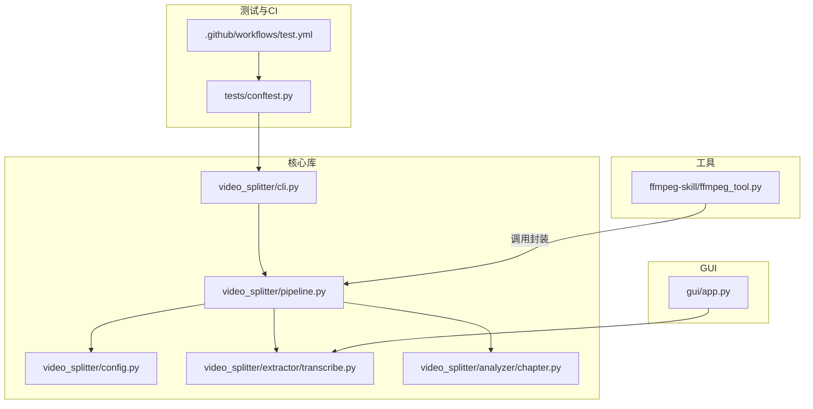
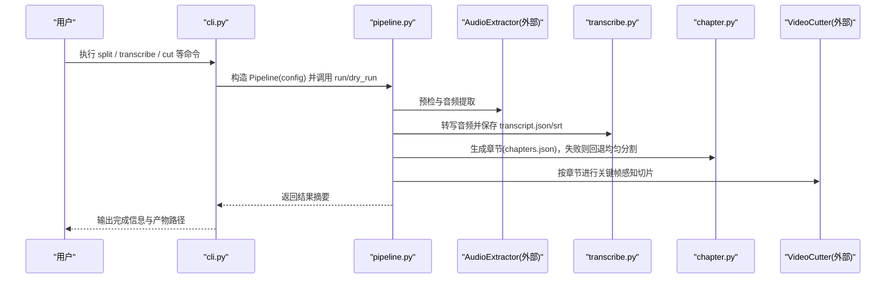
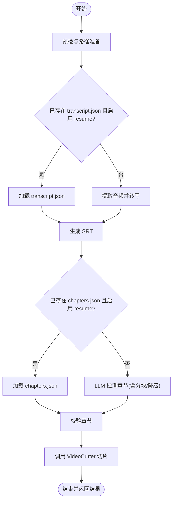
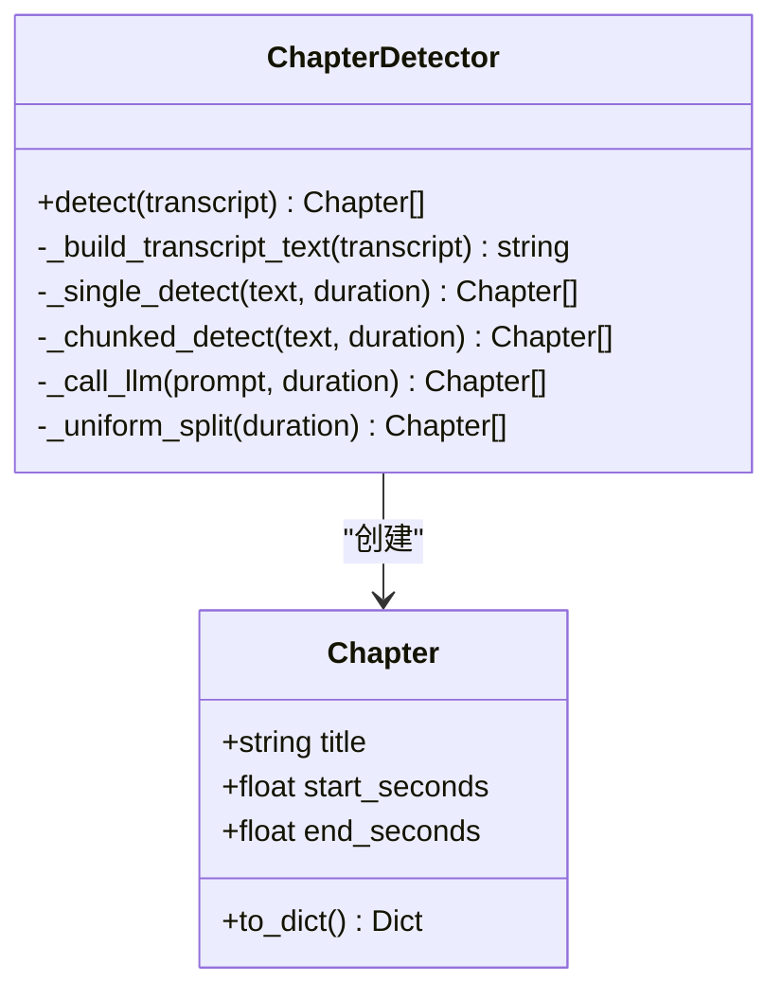
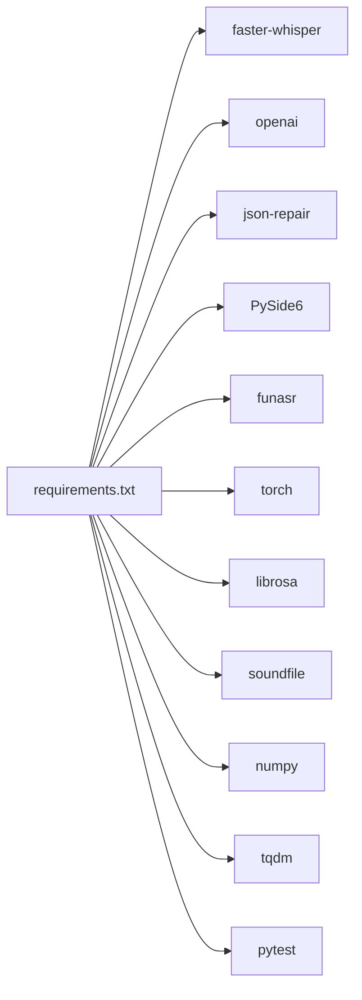

# 开发指南

<cite>
**本文引用的文件**   
- [README.md](file://README.md)
- [pyproject.toml](file://pyproject.toml)
- [requirements.txt](file://requirements.txt)
- [video_splitter/__init__.py](file://video_splitter/__init__.py)
- [video_splitter/cli.py](file://video_splitter/cli.py)
- [video_splitter/config.py](file://video_splitter/config.py)
- [video_splitter/pipeline.py](file://video_splitter/pipeline.py)
- [video_splitter/AGENTS.md](file://video_splitter/AGENTS.md)
- [video_splitter/extractor/transcribe.py](file://video_splitter/extractor/transcribe.py)
- [video_splitter/analyzer/chapter.py](file://video_splitter/analyzer/chapter.py)
- [gui/app.py](file://gui/app.py)
- [ffmpeg-skill/ffmpeg_tool.py](file://ffmpeg-skill/ffmpeg_tool.py)
- [tests/conftest.py](file://tests/conftest.py)
- [.github/workflows/test.yml](file://.github/workflows/test.yml)
- [install.sh](file://install.sh)
</cite>

## 目录
1. [简介](#简介)
2. [项目结构](#项目结构)
3. [核心组件](#核心组件)
4. [架构总览](#架构总览)
5. [详细组件分析](#详细组件分析)
6. [依赖关系分析](#依赖关系分析)
7. [性能与调试](#性能与调试)
8. [代码规范与约定](#代码规范与约定)
9. [新功能开发流程与最佳实践](#新功能开发流程与最佳实践)
10. [代码审查与提交规范](#代码审查与提交规范)
11. [贡献代码流程与注意事项](#贡献代码流程与注意事项)
12. [常见问题排查](#常见问题排查)
13. [结论](#结论)

## 简介
本项目是一个以“智能话题分段”为核心的视频处理工具，提供从音频提取、语音转写、LLM 章节识别、校验到 FFmpeg 切片的完整流水线；同时包含命令行界面（CLI）、交互式字幕校对 GUI 以及可复用的 FFmpeg 技能封装。目标是帮助开发者快速搭建环境、遵循规范、高效扩展功能并稳定交付。

## 项目结构
仓库采用“核心库 + 应用层 + 工具集”的分层组织：
- video_splitter：核心库，包含配置、流水线编排、ASR 转写、章节检测、校验与切片等模块
- gui：PySide6 前端，用于转录结果校对与播放联动
- ffmpeg-skill：FFmpeg 操作封装与独立 CLI 工具
- tests：测试套件与 pytest 配置
- .github/workflows：CI 工作流
- install.sh：跨平台安装脚本
- pyproject.toml：项目元数据、pytest 与覆盖率配置
- requirements.txt：运行时与可选依赖声明

图表来源
- [video_splitter/cli.py:1-256](file://video_splitter/cli.py#L1-L256)
- [video_splitter/pipeline.py:1-131](file://video_splitter/pipeline.py#L1-L131)
- [video_splitter/config.py:1-54](file://video_splitter/config.py#L1-L54)
- [video_splitter/extractor/transcribe.py:1-105](file://video_splitter/extractor/transcribe.py#L1-L105)
- [video_splitter/analyzer/chapter.py:1-343](file://video_splitter/analyzer/chapter.py#L1-L343)
- [gui/app.py:1-268](file://gui/app.py#L1-L268)
- [ffmpeg-skill/ffmpeg_tool.py:1-283](file://ffmpeg-skill/ffmpeg_tool.py#L1-L283)
- [tests/conftest.py:1-11](file://tests/conftest.py#L1-L11)
- [.github/workflows/test.yml:1-44](file://.github/workflows/test.yml#L1-L44)

章节来源
- [video_splitter/AGENTS.md:1-55](file://video_splitter/AGENTS.md#L1-L55)
- [pyproject.toml:1-28](file://pyproject.toml#L1-L28)
- [requirements.txt:1-26](file://requirements.txt#L1-L26)

## 核心组件
- 配置中心 SplitConfig：集中管理模型、设备、切分策略、LLM 参数、命名模板与环境变量覆盖
- 流水线 Pipeline：统一编排 precheck → extract → transcribe → chapter → validate → cut，支持断点续跑与 dry-run
- 转写模块 transcribe：基于 faster-whisper 的音频转写、SRT 导出与 token 估算
- 章节检测 ChapterDetector：LLM 驱动的主题划分，具备滑动窗口分块与容错降级为均匀分割
- CLI 入口 cli：提供 split、transcribe、cut、check、review、gui、batch 等子命令
- GUI 主程序 app：PySide6 界面，集成播放器、字幕面板、控制器与后台转写线程
- FFmpeg 技能 ffmpeg_tool：独立 CLI 封装，便于复用与自动化

章节来源
- [video_splitter/config.py:1-54](file://video_splitter/config.py#L1-L54)
- [video_splitter/pipeline.py:1-131](file://video_splitter/pipeline.py#L1-L131)
- [video_splitter/extractor/transcribe.py:1-105](file://video_splitter/extractor/transcribe.py#L1-L105)
- [video_splitter/analyzer/chapter.py:1-343](file://video_splitter/analyzer/chapter.py#L1-L343)
- [video_splitter/cli.py:1-256](file://video_splitter/cli.py#L1-L256)
- [gui/app.py:1-268](file://gui/app.py#L1-L268)
- [ffmpeg-skill/ffmpeg_tool.py:1-283](file://ffmpeg-skill/ffmpeg_tool.py#L1-L283)

## 架构总览
系统由“输入视频 → 音频提取 → 语音转写 → LLM 章节识别 → 校验 → FFmpeg 切片”的主链路构成，CLI/GUI 作为上层入口，config 贯穿全链路，test 与 CI 保障质量。

图表来源
- [video_splitter/cli.py:1-256](file://video_splitter/cli.py#L1-L256)
- [video_splitter/pipeline.py:1-131](file://video_splitter/pipeline.py#L1-L131)
- [video_splitter/extractor/transcribe.py:1-105](file://video_splitter/extractor/transcribe.py#L1-L105)
- [video_splitter/analyzer/chapter.py:1-343](file://video_splitter/analyzer/chapter.py#L1-L343)

## 详细组件分析

### 配置中心 SplitConfig
- 职责：定义所有可调参数并提供 from_env() 读取环境变量覆盖
- 关键点：
  - 模型与设备：model_size、device、compute_type
  - 切分策略：max_segment_duration、min_segment_duration、cut_mode、keyframe_tolerance
  - LLM 设置：llm_api_base、llm_api_key、llm_model、llm_token_budget、llm_max_retries
  - 输出与恢复：language、naming_template、resume
  - ASR 引擎选择：transcription_engine、engine_config
- 建议：新增字段时同步更新 from_env 与环境文档

章节来源
- [video_splitter/config.py:1-54](file://video_splitter/config.py#L1-L54)

### 流水线 Pipeline
- 职责：端到端编排，支持 resume 与 dry-run
- 关键流程：
  - 预检与路径准备
  - 若存在 transcript.json 且开启 resume，则跳过转写
  - 生成 SRT 与 chapters.json
  - 校验章节边界与大小
  - 调用 VideoCutter 切片
  - 统计耗时与状态
- 错误处理：捕获异常并记录日志，最终抛出以便上层处理

图表来源
- [video_splitter/pipeline.py:1-131](file://video_splitter/pipeline.py#L1-L131)

章节来源
- [video_splitter/pipeline.py:1-131](file://video_splitter/pipeline.py#L1-L131)

### 转写模块 transcribe
- 职责：使用 faster-whisper 进行转写，提供进度回调、token 估算与 SRT 转换
- 复杂度：
  - 转写时间取决于模型大小与硬件，通常为 O(T) 线性于音频时长
  - token 估算近似 O(N) 文本长度
- 注意：VAD 过滤与语言设置影响准确率与速度

章节来源
- [video_splitter/extractor/transcribe.py:1-105](file://video_splitter/extractor/transcribe.py#L1-L105)

### 章节检测 ChapterDetector
- 职责：将转录文本划分为语义章节，支持单请求与滑动窗口分块，失败回退为均匀分割
- 关键逻辑：
  - 预估 token 数决定单次或分块
  - 分块带重叠上下文，合并去重
  - JSON 解析容错（json-repair）与时间戳范围校验
  - 重试与指数退避
- 复杂度：分块次数与重叠策略相关，整体接近 O(N)

图表来源
- [video_splitter/analyzer/chapter.py:1-343](file://video_splitter/analyzer/chapter.py#L1-L343)

章节来源
- [video_splitter/analyzer/chapter.py:1-343](file://video_splitter/analyzer/chapter.py#L1-L343)

### CLI 入口 cli
- 职责：提供 split、transcribe、cut、check、review、gui、batch 等子命令
- 要点：
  - 通过 argparse 注册子命令与参数
  - 组合 Pipeline、AudioExtractor、VideoCutter 等组件
  - check 子命令对 FFmpeg、faster-whisper、json-repair、LLM API 做自检与基准
  - batch 批量处理目录下 mp4 文件

章节来源
- [video_splitter/cli.py:1-256](file://video_splitter/cli.py#L1-L256)

### GUI 主程序 app
- 职责：提供字幕校对界面，集成播放器、字幕面板、控制器与后台转写线程
- 要点：
  - 健康检查 FunASREngine
  - QThread 异步转写，信号槽连接 UI 与控制器
  - 快捷键与状态栏反馈

章节来源
- [gui/app.py:1-268](file://gui/app.py#L1-L268)

### FFmpeg 技能 ffmpeg_tool
- 职责：封装常见 FFmpeg 操作（格式转换、缩放、裁剪、水印、合并、质量调整、信息查看）
- 要点：
  - 独立 CLI，便于在 OpenCode 或其他工具中调用
  - 统一的错误处理与 JSON 输出选项

章节来源
- [ffmpeg-skill/ffmpeg_tool.py:1-283](file://ffmpeg-skill/ffmpeg_tool.py#L1-L283)

## 依赖关系分析
- 运行期依赖：
  - FFmpeg（系统级）
  - Python 包：faster-whisper、json-repair、pydantic、librosa、soundfile、openai、PySide6、funasr、torch 等
- 开发与测试依赖：
  - pytest、coverage、mock 等
- 外部服务：
  - OpenAI 兼容 LLM API（可通过环境变量切换 base_url 与 key）

图表来源
- [requirements.txt:1-26](file://requirements.txt#L1-L26)

章节来源
- [requirements.txt:1-26](file://requirements.txt#L1-L26)

## 性能与调试
- 性能特征
  - 转写阶段为主要瓶颈，受模型大小与硬件影响显著
  - LLM 调用受网络与配额限制，需合理设置 llm_token_budget 与 llm_max_retries
  - 切片阶段依赖 FFmpeg，fast 模式更快，precise 模式更准确
- 调试技巧
  - 使用 cli 的 check 子命令诊断环境与基准
  - 使用 dry-run 估算成本与 token 消耗
  - 利用 resume 避免重复计算
  - 在 GUI 中进行人工校对与修正
- 分析方法
  - 结合 pipeline 的 elapsed_seconds 与步骤标记定位慢点
  - 针对 Whisper 模型 size/device/compute_type 调优
  - 观察章节数量与时长分布，必要时调整 max/min segment duration

章节来源
- [video_splitter/cli.py:85-152](file://video_splitter/cli.py#L85-L152)
- [video_splitter/pipeline.py:31-131](file://video_splitter/pipeline.py#L31-L131)
- [video_splitter/extractor/transcribe.py:1-105](file://video_splitter/extractor/transcribe.py#L1-L105)

## 代码规范与约定
- 导入风格：使用绝对路径导入，禁止相对导入
- 配置：统一通过 SplitConfig.from_env() 获取，默认值在类体中定义
- 错误类型：领域错误使用 VideoSplitterError，输入校验使用 FileNotFoundError/ValueError
- 进度回调：长耗时操作支持可选 Callable[[float, str], None]
- 测试：单元测试位于 tests/ 与 video_splitter/tests/，IO 隔离使用 tmp_path，边界依赖用 mock
- 运行测试：python -m pytest tests/ video_splitter/tests/ -v
- 覆盖率：pyproject.toml 中 fail_under=50，报告目标包含 video_splitter 与 gui

章节来源
- [video_splitter/AGENTS.md:39-55](file://video_splitter/AGENTS.md#L39-L55)
- [video_splitter/__init__.py:1-7](file://video_splitter/__init__.py#L1-L7)
- [pyproject.toml:6-28](file://pyproject.toml#L6-L28)

## 新功能开发流程与最佳实践
- 需求分析与设计
  - 明确输入输出、是否涉及外部依赖（FFmpeg/LLM/ASR）
  - 评估是否需要新增配置项或环境变量
- 实现
  - 新增配置字段至 SplitConfig，并在 from_env 中读取
  - 在对应模块实现核心逻辑，保持单一职责
  - 如需对外暴露能力，优先通过 CLI 子命令或 GUI 动作接入
- 测试
  - 编写单元测试，覆盖正常路径与异常分支
  - 使用 conftest 确保项目根路径可用
  - 对 IO 与外部依赖进行 mock
- 文档与示例
  - 更新 AGENTS.md 中的“Where to look”表格
  - 在 README 或 docstring 中补充用法说明
- 提交与审查
  - 遵循提交规范（见后文），附带变更说明与影响面

章节来源
- [video_splitter/AGENTS.md:27-38](file://video_splitter/AGENTS.md#L27-L38)
- [tests/conftest.py:1-11](file://tests/conftest.py#L1-L11)

## 代码审查与提交规范
- 代码审查
  - 关注接口契约、错误处理、资源释放与并发安全
  - 确认新增配置项有默认值与环境覆盖
  - 验证测试覆盖与覆盖率阈值
- 提交规范
  - 提交信息清晰描述动机与变更点
  - 小步提交，避免大杂烩
  - 关联问题编号或需求链接
- 持续集成
  - 推送与 PR 触发 test.yml，自动安装依赖、运行测试与覆盖率上报

章节来源
- [.github/workflows/test.yml:1-44](file://.github/workflows/test.yml#L1-L44)
- [pyproject.toml:6-28](file://pyproject.toml#L6-L28)

## 贡献代码流程与注意事项
- 环境搭建
  - 安装系统级 FFmpeg
  - 使用 install.sh 或 pip 安装依赖
  - 配置 LLM API 密钥与基地址（OPENAI_API_KEY/WHALECLOUD_API_KEY/OPENAI_API_BASE）
- 本地运行
  - CLI：python -m video_splitter.cli <command> ...
  - GUI：python -m video_splitter.cli gui
  - FFmpeg 技能：ffmpeg-tool <subcommand> ...
- 注意事项
  - 不要从 core 库反向导入 gui
  - 谨慎处理 ASR 与 LLM 的错误，避免静默吞掉异常
  - 合理使用 resume 与 dry-run 提升迭代效率

章节来源
- [install.sh:1-152](file://install.sh#L1-L152)
- [video_splitter/AGENTS.md:50-55](file://video_splitter/AGENTS.md#L50-L55)
- [video_splitter/cli.py:198-205](file://video_splitter/cli.py#L198-L205)
- [ffmpeg-skill/ffmpeg_tool.py:1-283](file://ffmpeg-skill/ffmpeg_tool.py#L1-L283)

## 常见问题排查
- FFmpeg 未找到或未加入 PATH
  - 现象：precheck 失败或切片报错
  - 解决：安装 FFmpeg 并确保可执行文件在 PATH 中
- LLM API 不可用或配额不足
  - 现象：章节检测失败并回退为均匀分割
  - 解决：检查 OPENAI_API_KEY/OPENAI_API_BASE 或 WHALECLOUD_API_KEY，调整 llm_token_budget 与重试次数
- 转写速度慢或内存占用高
  - 现象：长时间无响应或 OOM
  - 解决：降低 model_size、切换 device/compute_type，或使用 tiny/base 模型
- GUI 无法启动或依赖缺失
  - 现象：ImportError 提示缺少 PySide6
  - 解决：安装 PySide6 并满足系统多媒体依赖
- 批量任务部分失败
  - 现象：batch 输出中有 error 条目
  - 解决：根据日志定位具体视频与错误原因，必要时单独运行 split 或 check

章节来源
- [video_splitter/cli.py:85-152](file://video_splitter/cli.py#L85-L152)
- [video_splitter/analyzer/chapter.py:195-210](file://video_splitter/analyzer/chapter.py#L195-L210)
- [video_splitter/extractor/transcribe.py:1-105](file://video_splitter/extractor/transcribe.py#L1-L105)
- [gui/app.py:143-156](file://gui/app.py#L143-L156)

## 结论
本指南围绕环境搭建、代码规范、模块结构与依赖、新特性开发流程、审查与提交、调试与性能、贡献流程等方面提供了系统化说明。建议在实际开发中严格遵循约定，充分利用 resume、dry-run 与 check 等能力，配合测试与 CI 保障质量与稳定性。