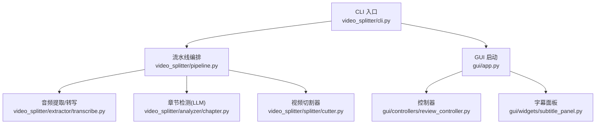
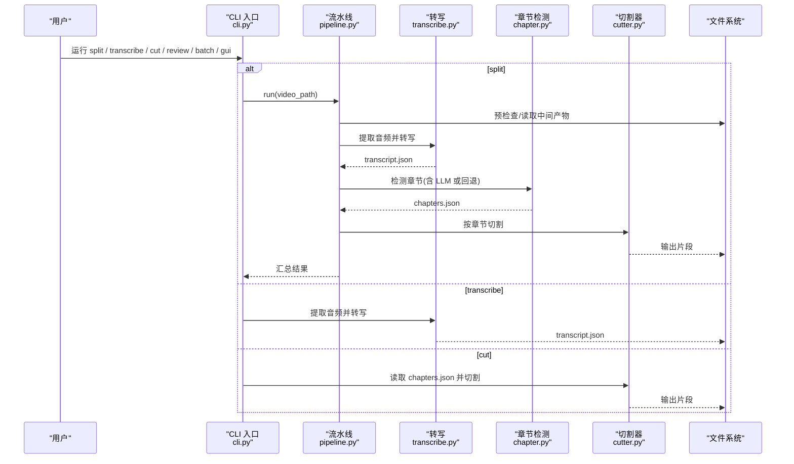
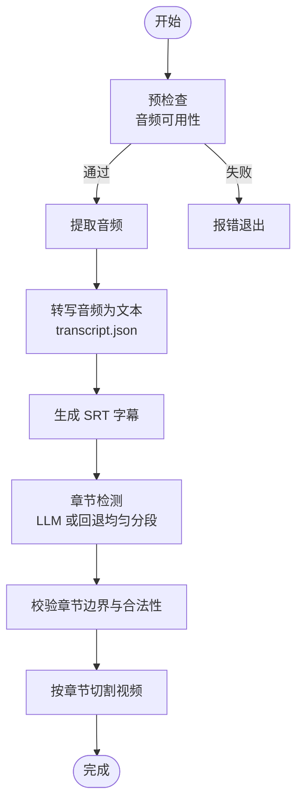
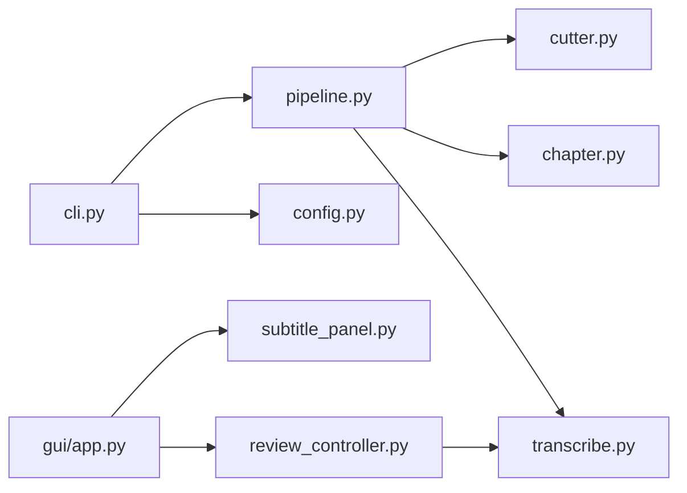

# 快速开始

<cite>
**本文引用的文件**   
- [README.md](file://README.md)
- [pyproject.toml](file://pyproject.toml)
- [requirements.txt](file://requirements.txt)
- [install.bat](file://install.bat)
- [install.sh](file://install.sh)
- [video_splitter/cli.py](file://video_splitter/cli.py)
- [video_splitter/pipeline.py](file://video_splitter/pipeline.py)
- [video_splitter/config.py](file://video_splitter/config.py)
- [video_splitter/extractor/transcribe.py](file://video_splitter/extractor/transcribe.py)
- [video_splitter/analyzer/chapter.py](file://video_splitter/analyzer/chapter.py)
- [gui/app.py](file://gui/app.py)
- [gui/controllers/review_controller.py](file://gui/controllers/review_controller.py)
- [gui/widgets/subtitle_panel.py](file://gui/widgets/subtitle_panel.py)
- [video_splitter/tests/test_cli.py](file://video_splitter/tests/test_cli.py)
</cite>

## 目录
1. [简介](#简介)
2. [项目结构](#项目结构)
3. [核心组件](#核心组件)
4. [架构总览](#架构总览)
5. [详细组件分析](#详细组件分析)
6. [依赖关系分析](#依赖关系分析)
7. [性能与耗时预估](#性能与耗时预估)
8. [故障排查指南](#故障排查指南)
9. [结论](#结论)
10. [附录：10分钟上手清单](#附录10分钟上手清单)

## 简介
本指南面向新用户，帮助你在10分钟内完成第一个视频分割任务。你将学会：
- 安装 FFmpeg、配置 Python 环境与依赖
- 使用命令行进行单视频处理、批量处理与字幕编辑
- 使用 GUI 界面进行转录与字幕校对
- 常见问题的定位与解决

## 项目结构
本项目包含以下关键部分：
- CLI 命令行入口与子命令（split、transcribe、cut、review、batch、check、gui）
- 核心流水线 Pipeline（预检查→音频提取→转写→章节检测→校验→切割）
- 配置管理 SplitConfig（模型、设备、LLM、切分策略等）
- GUI 应用（PySide6），支持打开视频、自动转录、逐段校对并导出 SRT
- 安装脚本（Windows/macOS/Linux）与环境检查

图表来源
- [video_splitter/cli.py:207-256](file://video_splitter/cli.py#L207-L256)
- [video_splitter/pipeline.py:21-131](file://video_splitter/pipeline.py#L21-L131)
- [video_splitter/extractor/transcribe.py:11-105](file://video_splitter/extractor/transcribe.py#L11-L105)
- [video_splitter/analyzer/chapter.py:43-343](file://video_splitter/analyzer/chapter.py#L43-L343)
- [gui/app.py:27-268](file://gui/app.py#L27-L268)
- [gui/controllers/review_controller.py:20-149](file://gui/controllers/review_controller.py#L20-L149)
- [gui/widgets/subtitle_panel.py:19-135](file://gui/widgets/subtitle_panel.py#L19-L135)

章节来源
- [README.md:1-50](file://README.md#L1-L50)
- [pyproject.toml:1-28](file://pyproject.toml#L1-L28)
- [requirements.txt:1-26](file://requirements.txt#L1-L26)

## 核心组件
- CLI 子命令
  - split：完整流程（转写→章节→校验→切割），支持 dry-run 估算成本
  - transcribe：仅转写音频为文本，输出 transcript.json
  - cut：基于已有 chapters.json 执行切割
  - review：交互式字幕校对（CLI 模式）
  - batch：批量处理目录下所有 .mp4
  - check：环境与健康检查（FFmpeg、Whisper、json-repair、LLM API Key）
  - gui：启动 PySide6 图形界面
- Pipeline 流水线
  - 预检查→音频提取→转写→生成 SRT→章节检测→校验→切割→汇总结果
- 配置 SplitConfig
  - 通过环境变量覆盖默认值（如 OPENAI_API_KEY、VIDEO_SPLITTER_DEVICE、VIDEO_SPLITTER_RESUME、VIDEO_SPLITTER_ENGINE）
- GUI 应用
  - 打开视频→后台线程调用 FunASR 引擎转录→加载 transcript.json→逐段校对→保存进度→导出 SRT

章节来源
- [video_splitter/cli.py:15-256](file://video_splitter/cli.py#L15-L256)
- [video_splitter/pipeline.py:21-131](file://video_splitter/pipeline.py#L21-L131)
- [video_splitter/config.py:19-54](file://video_splitter/config.py#L19-L54)
- [gui/app.py:27-268](file://gui/app.py#L27-L268)

## 架构总览
下图展示了从用户输入到最终输出的端到端流程，包括 CLI 与 GUI 两条路径。

图表来源
- [video_splitter/cli.py:15-256](file://video_splitter/cli.py#L15-L256)
- [video_splitter/pipeline.py:31-131](file://video_splitter/pipeline.py#L31-L131)
- [video_splitter/extractor/transcribe.py:11-105](file://video_splitter/extractor/transcribe.py#L11-L105)
- [video_splitter/analyzer/chapter.py:77-343](file://video_splitter/analyzer/chapter.py#L77-L343)

## 详细组件分析

### 安装与环境准备
- 系统要求
  - Python ≥ 3.12（见 pyproject 配置）
  - FFmpeg 已安装且可被系统 PATH 找到
- 依赖包
  - 基础与可选：numpy、tqdm、pytest
  - 核心功能：faster-whisper、json-repair、pydantic、librosa、soundfile、openai
  - GUI 与语音识别：PySide6、funasr、torch
- 一键安装脚本
  - Windows：install.bat（检查 Python/FFmpeg、安装依赖、创建快捷方式）
  - Linux/macOS：install.sh（检测 OS、安装依赖、添加 PATH、提示 OpenCode Skill）

建议步骤
1) 安装 FFmpeg 并确保在 PATH 中可用
2) 使用 install.bat 或 install.sh 初始化环境
3) 如需 GUI，确保已安装 PySide6；如需 LLM 章节检测，设置 OPENAI_API_KEY 或 WHALECLOUD_API_KEY

章节来源
- [pyproject.toml:1-28](file://pyproject.toml#L1-L28)
- [requirements.txt:1-26](file://requirements.txt#L1-L26)
- [install.bat:1-81](file://install.bat#L1-L81)
- [install.sh:1-152](file://install.sh#L1-L152)

### 命令行快速上手
常用命令示例（请替换为你的实际文件路径）
- 完整分割（自动转写+章节+切割）
  - video-splitter split <视频路径> --max-duration 15 --model tiny --cut-mode fast --resume --dry-run
- 仅转写
  - video-splitter transcribe <视频路径> --model base
- 仅切割（需先有 chapters.json）
  - video-splitter cut <视频路径> --chapters <chapters.json 路径> --cut-mode precise
- 交互式字幕校对（CLI）
  - video-splitter review <视频路径> --transcript <transcript.json 路径> --resume --no-save
- 批量处理
  - video-splitter batch <目录路径> --max-duration 10 --resume
- 环境检查
  - video-splitter check
- 启动 GUI
  - video-splitter gui

说明
- split 的 --dry-run 会估算时长、token 数与费用，不实际调用 LLM
- resume 可在存在中间产物时跳过已完成步骤
- model 支持 tiny/base/small/medium/large-v3

章节来源
- [video_splitter/cli.py:15-256](file://video_splitter/cli.py#L15-L256)
- [video_splitter/tests/test_cli.py:17-148](file://video_splitter/tests/test_cli.py#L17-L148)

### GUI 入门
- 启动方式
  - 命令行：video-splitter gui
- 界面布局
  - 顶部菜单：文件（打开视频、打开转录）、帮助（关于）
  - 中央区域：左侧视频播放器，右侧“Review”标签页（显示原文与修正框、导航按钮、跳转序号）
  - 底部状态栏：显示当前播放位置、转录进度、健康检查结果
- 基本操作流程
  1) 打开视频：菜单栏“文件 → 打开视频”，选择 mp4/avi/mkv/mov
  2) 自动转录：打开视频后会自动启动后台线程进行转录（FunASR）
  3) 打开转录：若已有 transcript.json，可通过“文件 → 打开转录”直接加载
  4) 逐段校对：在 Review 面板编辑修正文本，点击“保存并继续”或“保存”
  5) 导出 SRT：校对完成后，控制器会导出对应 SRT 文件
- 快捷键
  - 空格：播放/暂停
  - Ctrl+S：保存当前段
  - Ctrl+Return：保存并继续下一段
  - Ctrl+Left/Right：上一段/下一段
  - Ctrl+G：聚焦跳转输入框

章节来源
- [gui/app.py:27-268](file://gui/app.py#L27-L268)
- [gui/controllers/review_controller.py:20-149](file://gui/controllers/review_controller.py#L20-L149)
- [gui/widgets/subtitle_panel.py:19-135](file://gui/widgets/subtitle_panel.py#L19-L135)

### 核心工作流（Pipeline）

图表来源
- [video_splitter/pipeline.py:31-131](file://video_splitter/pipeline.py#L31-L131)
- [video_splitter/extractor/transcribe.py:11-105](file://video_splitter/extractor/transcribe.py#L11-L105)
- [video_splitter/analyzer/chapter.py:77-343](file://video_splitter/analyzer/chapter.py#L77-L343)

章节来源
- [video_splitter/pipeline.py:21-131](file://video_splitter/pipeline.py#L21-L131)

## 依赖关系分析
- 外部依赖
  - FFmpeg：用于音视频预处理与切割
  - faster-whisper：本地语音识别（CPU/GPU 均可）
  - openai：兼容 OpenAI 接口的 LLM 调用（用于章节检测）
  - json-repair：修复 LLM 返回的不规范 JSON
  - PySide6：GUI 框架
  - funasr/torch：GUI 内置的 FunASR 引擎（可选）
- 内部模块耦合
  - cli 依赖 pipeline、config、各子模块
  - pipeline 组合 audio、transcribe、chapter、validator、cutter
  - GUI 依赖 controller、widgets、workers 以及 video_splitter.review 工具

图表来源
- [video_splitter/cli.py:207-256](file://video_splitter/cli.py#L207-L256)
- [video_splitter/pipeline.py:21-131](file://video_splitter/pipeline.py#L21-L131)
- [video_splitter/config.py:19-54](file://video_splitter/config.py#L19-L54)
- [gui/app.py:27-268](file://gui/app.py#L27-L268)
- [gui/controllers/review_controller.py:20-149](file://gui/controllers/review_controller.py#L20-L149)
- [gui/widgets/subtitle_panel.py:19-135](file://gui/widgets/subtitle_panel.py#L19-L135)

章节来源
- [requirements.txt:1-26](file://requirements.txt#L1-L26)

## 性能与耗时预估
- 转写耗时
  - 使用 faster-whisper tiny 模型在 CPU 上对 10s 静音音频的基准测试可作为参考；大模型 large-v3 在 CPU 上的每小时耗时可按比例估算
- 章节检测
  - 短文本单次 LLM 调用；长文本采用滑动窗口分块（约15分钟一段，重叠2分钟）并去重
- 切割速度
  - 取决于 cut_mode（fast/precise）与 keyframe_tolerance，通常较快

章节来源
- [video_splitter/cli.py:85-152](file://video_splitter/cli.py#L85-L152)
- [video_splitter/analyzer/chapter.py:116-193](file://video_splitter/analyzer/chapter.py#L116-L193)

## 故障排查指南
常见问题与解决
- FFmpeg 未找到
  - 症状：check 命令或安装脚本提示找不到 ffmpeg
  - 解决：下载 FFmpeg 并将其 bin 目录加入系统 PATH，重启终端后重试
- Python 版本过低
  - 症状：安装失败或导入错误
  - 解决：升级至 Python ≥ 3.12（参见 pyproject 配置）
- 缺少依赖包
  - 症状：ImportError（如 openai、json-repair、PySide6、funasr、torch）
  - 解决：根据 requirements.txt 安装对应包；GUI 相关按需安装
- LLM API Key 未配置
  - 症状：章节检测失败或无法调用 LLM
  - 解决：设置 OPENAI_API_KEY 或 WHALECLOUD_API_KEY；也可通过 VIDEO_SPLITTER_* 环境变量调整设备与引擎
- 转录失败
  - 症状：转写时报错或无输出
  - 解决：确认 faster-whisper 可用；尝试更换 model_size（tiny/base/small）；检查音频是否可正常提取
- GUI 无法启动
  - 症状：启动 GUI 报 ImportError
  - 解决：安装 PySide6；若使用 FunASR，确保 funasr 与 torch 已安装

章节来源
- [video_splitter/cli.py:85-152](file://video_splitter/cli.py#L85-L152)
- [requirements.txt:1-26](file://requirements.txt#L1-L26)
- [install.bat:22-46](file://install.bat#L22-L46)
- [install.sh:51-86](file://install.sh#L51-L86)

## 结论
通过本指南，你已了解如何安装环境、使用 CLI 完成单视频与批量处理、使用 GUI 进行字幕校对，并能快速定位常见问题。建议在首次使用时先用 --dry-run 评估成本与耗时，再正式运行完整流程。

## 附录：10分钟上手清单
- 第1-3分钟：安装 FFmpeg 并验证 PATH
- 第4-6分钟：运行 install.bat 或 install.sh 安装依赖
- 第7-8分钟：执行一次 dry-run（split --dry-run）估算成本
- 第9-10分钟：运行 split 完成第一次分割，或在 GUI 中打开视频并导出 SRT