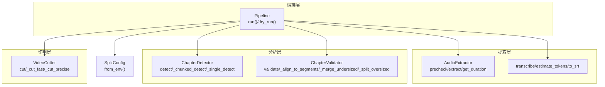
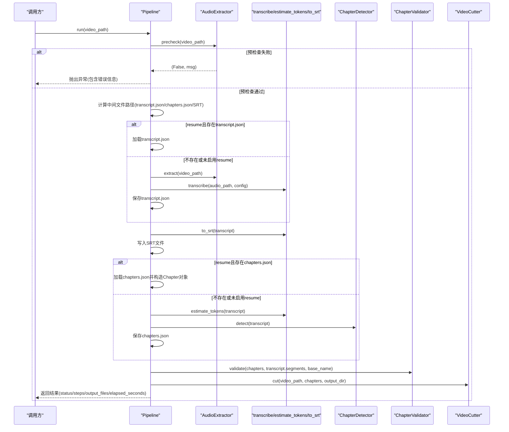
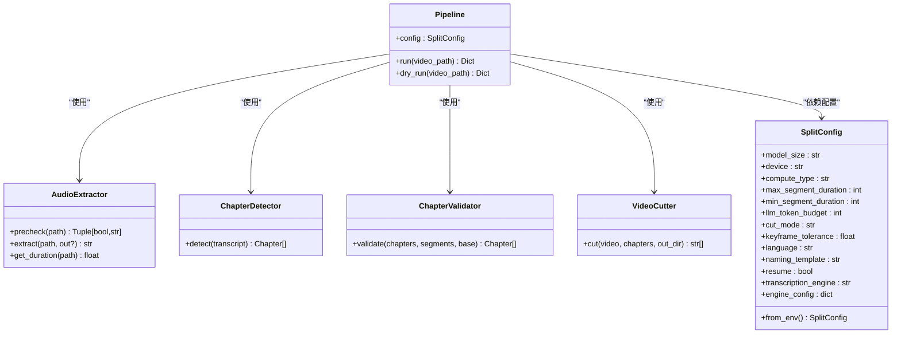
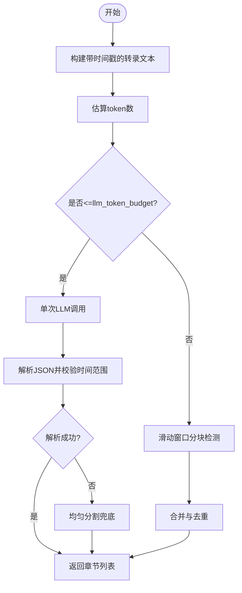
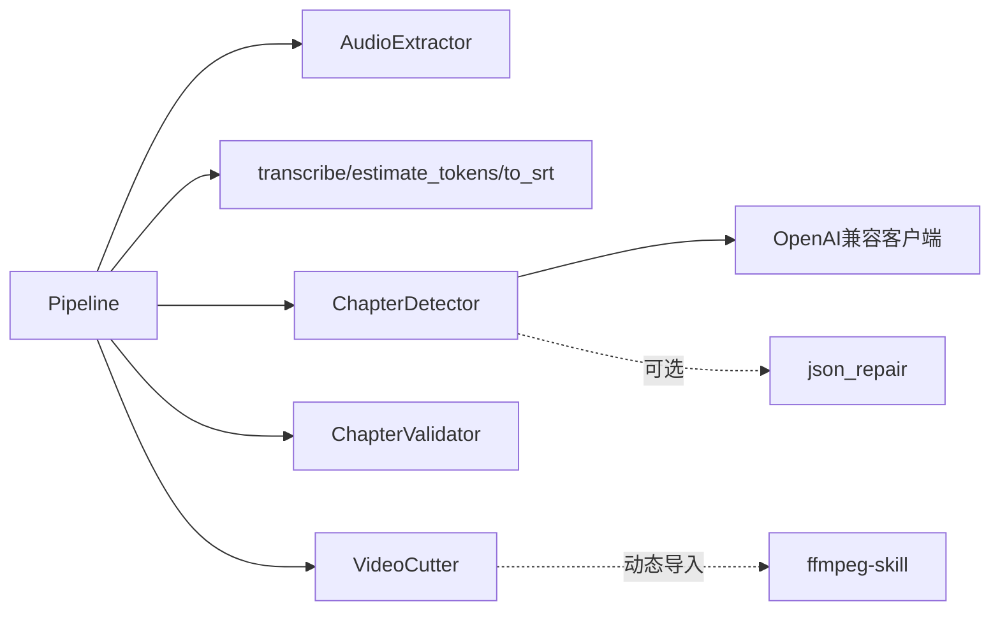

# Pipeline编排器

<cite>
**本文引用的文件**
- [pipeline.py](file://video_splitter/pipeline.py)
- [config.py](file://video_splitter/config.py)
- [audio.py](file://video_splitter/extractor/audio.py)
- [transcribe.py](file://video_splitter/extractor/transcribe.py)
- [chapter.py](file://video_splitter/analyzer/chapter.py)
- [validator.py](file://video_splitter/analyzer/validator.py)
- [cutter.py](file://video_splitter/splitter/cutter.py)
- [test_pipeline.py](file://video_splitter/tests/test_pipeline.py)
</cite>

## 目录
1. [简介](#简介)
2. [项目结构](#项目结构)
3. [核心组件](#核心组件)
4. [架构总览](#架构总览)
5. [详细组件分析](#详细组件分析)
6. [依赖关系分析](#依赖关系分析)
7. [性能与成本优化](#性能与成本优化)
8. [故障排查指南](#故障排查指南)
9. [结论](#结论)
10. [附录：API使用示例](#附录api使用示例)

## 简介
本技术文档聚焦于 VideoSplitter 的 Pipeline 编排器，系统性阐述其设计模式、实现细节与端到端视频处理流程。Pipeline 将“预检查→音频提取→语音转录→章节检测→结果验证→视频切割”串联为可恢复、可估算、可扩展的处理流水线，并提供 dry_run 模式用于快速评估耗时与成本。文档同时覆盖断点续传机制、中间文件持久化策略、错误处理与性能优化建议，并给出基于单元测试的 API 使用参考路径。

## 项目结构
围绕 Pipeline 的核心代码位于 video_splitter 包内，按职责分层组织：
- extractor：音频提取与转写（Whisper）
- analyzer：语义章节检测（LLM）与校验（时长/边界对齐）
- splitter：视频切割（FFmpeg）
- pipeline：编排器，统一调度各阶段并管理中间状态
- config：配置项与环境变量注入

图表来源
- [pipeline.py:21-131](file://video_splitter/pipeline.py#L21-L131)
- [audio.py:12-171](file://video_splitter/extractor/audio.py#L12-L171)
- [transcribe.py:11-105](file://video_splitter/extractor/transcribe.py#L11-L105)
- [chapter.py:18-343](file://video_splitter/analyzer/chapter.py#L18-L343)
- [validator.py:10-152](file://video_splitter/analyzer/validator.py#L10-L152)
- [cutter.py:22-98](file://video_splitter/splitter/cutter.py#L22-L98)
- [config.py:19-54](file://video_splitter/config.py#L19-L54)

章节来源
- [pipeline.py:21-131](file://video_splitter/pipeline.py#L21-L131)
- [config.py:19-54](file://video_splitter/config.py#L19-L54)

## 核心组件
- Pipeline：编排器，负责步骤顺序、中间文件读写、异常捕获、耗时统计与 dry_run 估算。
- AudioExtractor：调用 ffprobe/ffmpeg 进行质量预检与音频提取，支持可选 librosa 静音检测。
- transcribe：基于 faster-whisper 的语音转文本，输出带时间戳的 segments。
- ChapterDetector：基于 LLM 的语义章节检测，支持滑动窗口分块与均匀切分的兜底策略。
- ChapterValidator：对章节进行边界对齐、过短合并、过长拆分，并规范化命名。
- VideoCutter：基于 FFmpegSkill 的视频切割，支持 fast 与 precise 两种模式及关键帧容差回退。
- SplitConfig：集中配置，支持环境变量覆盖，控制模型、语言、LLM 预算、切割策略等。

章节来源
- [pipeline.py:21-131](file://video_splitter/pipeline.py#L21-L131)
- [audio.py:12-171](file://video_splitter/extractor/audio.py#L12-L171)
- [transcribe.py:11-105](file://video_splitter/extractor/transcribe.py#L11-L105)
- [chapter.py:18-343](file://video_splitter/analyzer/chapter.py#L18-L343)
- [validator.py:10-152](file://video_splitter/analyzer/validator.py#L10-L152)
- [cutter.py:22-98](file://video_splitter/splitter/cutter.py#L22-L98)
- [config.py:19-54](file://video_splitter/config.py#L19-L54)

## 架构总览
下图展示 Pipeline.run 的完整执行序列，包括断点续传与 SRT 生成、章节检测与校验、最终切割。

图表来源
- [pipeline.py:31-111](file://video_splitter/pipeline.py#L31-L111)
- [audio.py:26-171](file://video_splitter/extractor/audio.py#L26-L171)
- [transcribe.py:11-105](file://video_splitter/extractor/transcribe.py#L11-L105)
- [chapter.py:77-322](file://video_splitter/analyzer/chapter.py#L77-L322)
- [validator.py:22-133](file://video_splitter/analyzer/validator.py#L22-L133)
- [cutter.py:30-98](file://video_splitter/splitter/cutter.py#L30-L98)

## 详细组件分析

### Pipeline 类设计与数据流
- 初始化：从 SplitConfig.from_env() 读取配置，实例化 AudioExtractor、ChapterDetector、ChapterValidator、VideoCutter。
- run(video_path)：
  - 构建中间文件路径：同目录下的 .transcript.json、.chapters.json、.zh.srt，以及 {basename}_segments 输出目录。
  - 预检查：AudioExtractor.precheck；失败则记录 steps_completed 并抛出异常。
  - 转录与SRT：若启用 resume 且存在 transcript.json，直接加载；否则提取音频并调用 transcribe，随后保存 transcript.json，并生成 SRT。
  - 章节检测：若启用 resume 且存在 chapters.json，直接加载并反序列化为 Chapter 列表；否则估计 token 数并调用 ChapterDetector.detect，保存 chapters.json。
  - 校验：ChapterValidator.validate 对齐边界、合并过短、拆分过长，并规范化标题前缀。
  - 切割：VideoCutter.cut 批量生成片段文件，收集输出路径。
  - 异常与耗时：try/except 捕获异常，finally 记录 elapsed_seconds。
- dry_run(video_path)：
  - 仅执行预检查、音频提取与转写，估算 token 数与费用，并判断是否触发多段 LLM 调用。

图表来源
- [pipeline.py:21-131](file://video_splitter/pipeline.py#L21-L131)
- [audio.py:12-171](file://video_splitter/extractor/audio.py#L12-L171)
- [chapter.py:18-343](file://video_splitter/analyzer/chapter.py#L18-L343)
- [validator.py:10-152](file://video_splitter/analyzer/validator.py#L10-L152)
- [cutter.py:22-98](file://video_splitter/splitter/cutter.py#L22-L98)
- [config.py:19-54](file://video_splitter/config.py#L19-L54)

章节来源
- [pipeline.py:31-131](file://video_splitter/pipeline.py#L31-L131)

### 预检查与音频提取（AudioExtractor）
- 预检查：
  - 文件存在性检查。
  - 可选 librosa 静音检测：抽取短时音频片段，计算 RMS 与静音比例，给出警告或失败提示。
  - 通过 ffprobe 获取时长，限制长视频处理策略。
- 音频提取：
  - 统一输出 16kHz 单声道 PCM WAV，便于 ASR。
  - 根据视频时长选择不同 ffmpeg 参数组合，确保稳定性。
- 错误处理：
  - 缺失文件、ffprobe/ffmpeg 失败均抛出明确异常或返回结构化消息。

章节来源
- [audio.py:26-171](file://video_splitter/extractor/audio.py#L26-L171)

### 语音转录与SRT生成（transcribe）
- 使用 faster-whisper 进行转写，开启 VAD 过滤，输出 segments 列表（text/start/end）。
- estimate_tokens：保守估算 LLM token 数（中文约 1.5 字符/token）。
- to_srt：将 segments 转为标准 SRT 字幕格式，供后续查看或校对。

章节来源
- [transcribe.py:11-105](file://video_splitter/extractor/transcribe.py#L11-L105)

### 章节检测（ChapterDetector）
- 输入：transcript（含 duration 与 segments）。
- 策略：
  - 单次 LLM 调用：当预估 token 数不超过 llm_token_budget。
  - 滑动窗口分块：超过预算时，按约 15 分钟窗口、2 分钟重叠切分，分别检测后去重合并。
  - 兜底策略：所有 LLM 尝试失败时，按 max_segment_duration 均匀分段。
- 健壮性：
  - 重试与指数退避。
  - JSON 修复（json_repair）与严格的时间范围校验。
  - 标题清洗与序号前缀规范。

图表来源
- [chapter.py:77-322](file://video_splitter/analyzer/chapter.py#L77-L322)

章节来源
- [chapter.py:77-322](file://video_splitter/analyzer/chapter.py#L77-L322)

### 章节校验与命名（ChapterValidator）
- 边界对齐：将章节结束时间对齐到最近的转录 segment 边界，提升切割精度。
- 过短合并：小于 min_segment_duration 的片段与其相邻合并。
- 过长拆分：大于 max_segment_duration 的片段按最大时长等分。
- 命名规范：清理非法字符，强制添加序号前缀，保证文件名安全。

章节来源
- [validator.py:22-133](file://video_splitter/analyzer/validator.py#L22-L133)

### 视频切割（VideoCutter）
- 模式：
  - fast：copy 流复制，速度快但可能受关键帧影响；若实际时长偏差超过 keyframe_tolerance，自动回退到 precise。
  - precise：重新编码（libx264/aac），精度高但耗时较长。
- 输出：在 {basename}_segments 目录下生成多个 mp4 片段。
- 进度回调：可选 progress_callback 以支持外部 UI 更新。

章节来源
- [cutter.py:30-98](file://video_splitter/splitter/cutter.py#L30-L98)

### 配置与环境变量（SplitConfig）
- 关键配置项：
  - ASR：model_size、device、compute_type、language。
  - 章节：max_segment_duration、min_segment_duration、llm_token_budget、llm_max_retries。
  - 切割：cut_mode、keyframe_tolerance、naming_template。
  - 其他：resume、transcription_engine、engine_config。
- 环境变量覆盖：OPENAI_API_BASE、OPENAI_API_KEY、WHALECLOUD_API_KEY、VIDEO_SPLITTER_DEVICE、VIDEO_SPLITTER_RESUME、VIDEO_SPLITTER_ENGINE。

章节来源
- [config.py:19-54](file://video_splitter/config.py#L19-L54)

## 依赖关系分析
- Pipeline 强耦合于四个子组件，但通过接口方法解耦，便于替换实现或注入 mock。
- ChapterDetector 依赖 OpenAI 兼容客户端与 json_repair（可选），具备降级能力。
- VideoCutter 动态导入 ffmpeg-skill 模块，避免硬依赖导致启动失败。
- 中间文件（transcript.json、chapters.json、SRT）作为跨阶段契约，支撑断点续传与可观测性。

图表来源
- [pipeline.py:21-131](file://video_splitter/pipeline.py#L21-L131)
- [chapter.py:211-241](file://video_splitter/analyzer/chapter.py#L211-L241)
- [cutter.py:12-19](file://video_splitter/splitter/cutter.py#L12-L19)

章节来源
- [pipeline.py:21-131](file://video_splitter/pipeline.py#L21-L131)
- [chapter.py:211-241](file://video_splitter/analyzer/chapter.py#L211-L241)
- [cutter.py:12-19](file://video_splitter/splitter/cutter.py#L12-L19)

## 性能与成本优化
- 断点续传：
  - 启用 resume 后，优先加载 transcript.json 与 chapters.json，跳过昂贵的转录与 LLM 调用，显著缩短二次运行时间。
- 转录优化：
  - 合理设置 model_size/device/compute_type，在速度与精度间权衡。
  - 长视频可考虑先裁剪或分段转写（结合 CLI 或上层逻辑）。
- 章节检测：
  - 调整 llm_token_budget 与 max_segment_duration，减少不必要的分块与重复 LLM 调用。
  - 利用 json_repair 降低因 LLM 输出不规范导致的失败重试开销。
- 切割优化：
  - 默认 fast 模式配合 keyframe_tolerance 回退，兼顾速度与时长准确性。
  - 需要精确边界的场景再启用 precise 模式。
- dry_run 成本估算：
  - 基于 estimate_tokens 与固定单价（每百万 token 0.10 元）估算费用，帮助决策是否继续执行。

章节来源
- [pipeline.py:54-131](file://video_splitter/pipeline.py#L54-L131)
- [transcribe.py:62-76](file://video_splitter/extractor/transcribe.py#L62-L76)
- [chapter.py:116-193](file://video_splitter/analyzer/chapter.py#L116-L193)
- [cutter.py:55-86](file://video_splitter/splitter/cutter.py#L55-L86)

## 故障排查指南
- 预检查失败：
  - 常见原因：文件不存在、无音频轨道、静音过多。检查日志中的 precheck 消息。
- 转录失败：
  - 确认 faster-whisper 可用、设备与 compute_type 匹配硬件；检查音频路径与权限。
- 章节检测失败：
  - 若 LLM 不可用或返回非 JSON，会触发均匀分割兜底；检查网络、API Key 与模型名。
- 切割失败：
  - fast 模式回退到 precise 仍失败时，检查 ffmpeg 安装与编解码器可用性；查看 stderr 末尾信息。
- 断点续传不生效：
  - 确认同名 .transcript.json/.chapters.json 存在于视频同级目录，且 resume=True。

章节来源
- [audio.py:26-100](file://video_splitter/extractor/audio.py#L26-L100)
- [transcribe.py:11-59](file://video_splitter/extractor/transcribe.py#L11-L59)
- [chapter.py:195-322](file://video_splitter/analyzer/chapter.py#L195-L322)
- [cutter.py:55-98](file://video_splitter/splitter/cutter.py#L55-L98)
- [pipeline.py:54-111](file://video_splitter/pipeline.py#L54-L111)

## 结论
Pipeline 编排器以清晰的阶段划分与中间文件契约，实现了高可靠、可恢复、可估算的视频分割流程。通过断点续传与 dry_run 成本估算，用户可在投入昂贵资源前获得充分预期；通过 validator 与 cutter 的精细控制，保障输出片段的时长与边界质量。建议在大规模批处理中结合 CLI 与 GUI 工具链，配合合理的配置与环境变量，达到稳定高效的产出。

## 附录：API使用示例
以下示例来自单元测试，展示了如何构造 Pipeline 并调用 run/dry_run，以及断点续传与 dry_run 的行为断言。读者可据此编写自己的调用脚本。

- 完整流程成功路径与步骤记录
  - 参考：[test_pipeline.py:55-78](file://video_splitter/tests/test_pipeline.py#L55-L78)
- 预检查失败的异常行为
  - 参考：[test_pipeline.py:80-88](file://video_splitter/tests/test_pipeline.py#L80-L88)
- 断点续传：跳过转录
  - 参考：[test_pipeline.py:90-116](file://video_splitter/tests/test_pipeline.py#L90-L116)
- 断点续传：跳过章节检测
  - 参考：[test_pipeline.py:118-147](file://video_splitter/tests/test_pipeline.py#L118-L147)
- dry_run 成功与费用估算
  - 参考：[test_pipeline.py:163-185](file://video_splitter/tests/test_pipeline.py#L163-L185)
- dry_run 超预算时的多段 LLM 调用提示
  - 参考：[test_pipeline.py:187-207](file://video_splitter/tests/test_pipeline.py#L187-L207)
- dry_run 单次 LLM 调用提示
  - 参考：[test_pipeline.py:209-228](file://video_splitter/tests/test_pipeline.py#L209-L228)

章节来源
- [test_pipeline.py:55-228](file://video_splitter/tests/test_pipeline.py#L55-L228)
