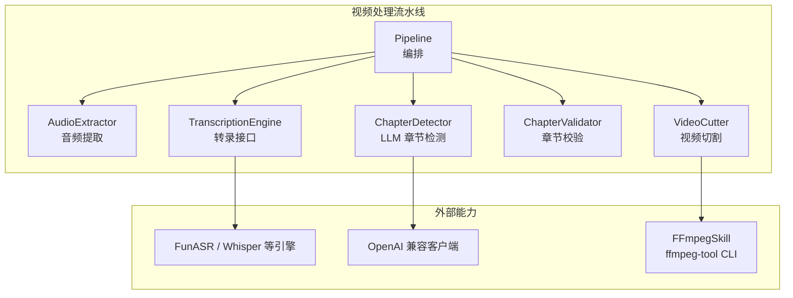
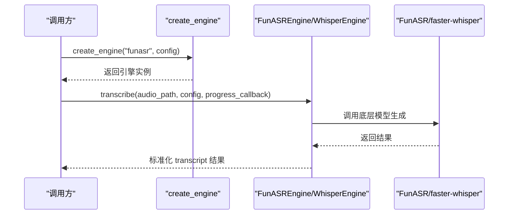
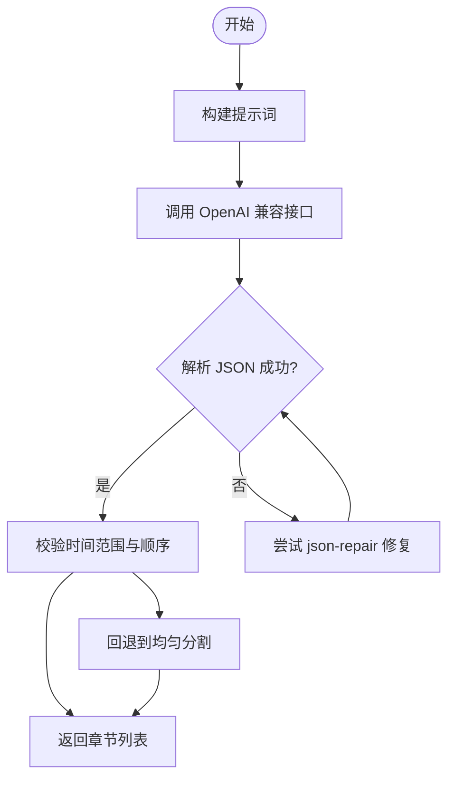
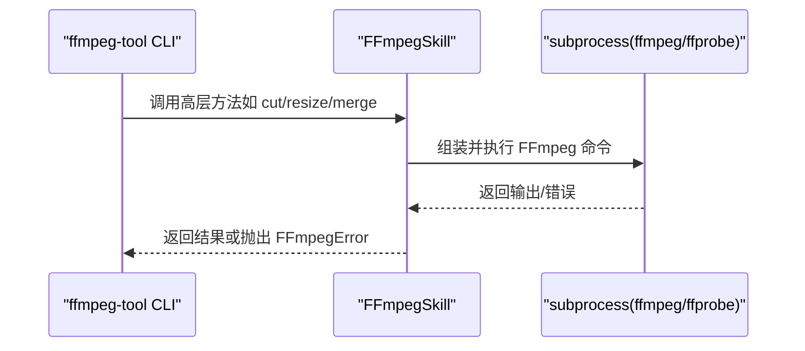
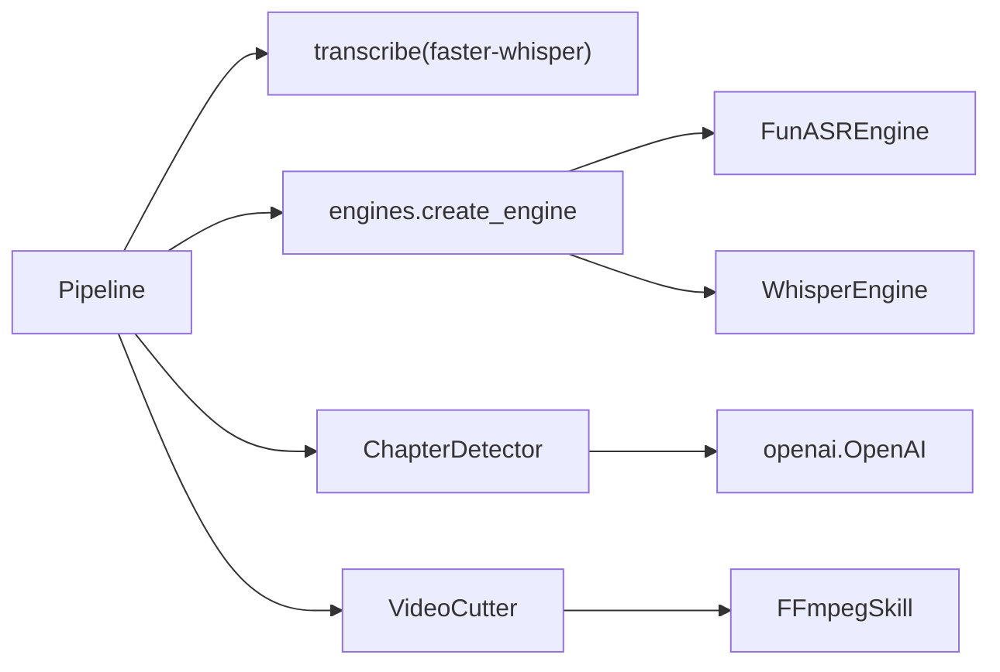

# 扩展点设计

<cite>
**本文引用的文件**   
- [video_splitter/extractor/engines.py](file://video_splitter/extractor/engines.py)
- [video_splitter/extractor/transcribe.py](file://video_splitter/extractor/transcribe.py)
- [video_splitter/analyzer/chapter.py](file://video_splitter/analyzer/chapter.py)
- [video_splitter/config.py](file://video_splitter/config.py)
- [video_splitter/pipeline.py](file://video_splitter/pipeline.py)
- [ffmpeg-skill/__init__.py](file://ffmpeg-skill/__init__.py)
- [ffmpeg-skill/ffmpeg_tool.py](file://ffmpeg-skill/ffmpeg_tool.py)
- [tests/test_workers.py](file://tests/test_workers.py)
</cite>

## 目录
1. [简介](#简介)
2. [项目结构](#项目结构)
3. [核心组件](#核心组件)
4. [架构总览](#架构总览)
5. [详细组件分析](#详细组件分析)
6. [依赖关系分析](#依赖关系分析)
7. [性能考虑](#性能考虑)
8. [故障排查指南](#故障排查指南)
9. [结论](#结论)
10. [附录：扩展示例与测试方法](#附录扩展示例与测试方法)

## 简介
本指南面向希望为 VideoSplitter 添加新能力的开发者，聚焦三大扩展点：
- 可扩展的转录引擎接口（ASR）
- LLM 提供商抽象（OpenAI 兼容）
- FFmpeg 技能封装（FFmpegSkill）

文档将解释如何新增语音识别引擎、自定义 LLM 提供商以及扩展 FFmpeg 技能，并提供完整的扩展示例路径与测试方法。

## 项目结构
VideoSplitter 采用“流水线编排 + 插件化能力”的设计：
- 流水线 Pipeline 负责整体流程编排（预检→提取→转录→章节→校验→切割）
- 转录引擎通过统一接口 TranscriptionEngine 实现可插拔
- LLM 调用基于 OpenAI 兼容客户端，便于替换不同提供商
- FFmpeg 操作通过 ffmpeg-skill 模块进行封装，提供高层 API 和 CLI



图表来源
- [video_splitter/pipeline.py:21-111](file://video_splitter/pipeline.py#L21-L111)
- [video_splitter/extractor/engines.py:17-45](file://video_splitter/extractor/engines.py#L17-L45)
- [video_splitter/analyzer/chapter.py:43-96](file://video_splitter/analyzer/chapter.py#L43-L96)
- [ffmpeg-skill/__init__.py:22-94](file://ffmpeg-skill/__init__.py#L22-L94)

章节来源
- [video_splitter/pipeline.py:21-111](file://video_splitter/pipeline.py#L21-L111)

## 核心组件
- 转录引擎抽象层
  - 定义统一的 TranscriptionEngine 接口，包含 transcribe 与 health_check 两个抽象方法
  - 内置 FunASREngine 与 WhisperEngine 两种实现
  - 提供 create_engine(name, config) 工厂函数，按名称从注册表创建实例
- LLM 提供商抽象
  - ChapterDetector 使用 OpenAI 兼容客户端发起请求，支持重试、JSON 修复与均匀分割回退
  - 配置项集中在 SplitConfig（llm_api_base、llm_api_key、llm_model、llm_token_budget、llm_max_retries）
- FFmpeg 技能封装
  - FFmpegSkill 提供格式转换、缩放、裁剪、水印、合并、质量调整、信息查询等高层 API
  - ffmpeg_tool.py 提供独立 CLI，便于在 OpenCode 或脚本中直接调用

章节来源
- [video_splitter/extractor/engines.py:17-45](file://video_splitter/extractor/engines.py#L17-L45)
- [video_splitter/extractor/engines.py:222-250](file://video_splitter/extractor/engines.py#L222-L250)
- [video_splitter/analyzer/chapter.py:211-241](file://video_splitter/analyzer/chapter.py#L211-L241)
- [video_splitter/config.py:19-54](file://video_splitter/config.py#L19-L54)
- [ffmpeg-skill/__init__.py:22-94](file://ffmpeg-skill/__init__.py#L22-L94)
- [ffmpeg-skill/ffmpeg_tool.py:20-51](file://ffmpeg-skill/ffmpeg_tool.py#L20-L51)

## 架构总览
下图展示了关键类与模块之间的关系，包括转录引擎抽象、LLM 调用与 FFmpeg 技能封装。

```mermaid
classDiagram
class TranscriptionEngine {
<<abstract>>
+transcribe(audio_path, config, progress_callback) Dict
+health_check() (bool, str)
}
class FunASREngine {
+transcribe(...)
+health_check()
}
class WhisperEngine {
+transcribe(...)
+health_check()
}
class ChapterDetector {
+detect(transcript) List[Chapter]
-_call_llm(prompt, duration) List[Chapter]
-_llm_request(prompt) str
}
class FFmpegSkill {
+convert_format(...)
+resize(...)
+cut(...)
+merge_videos(...)
+get_video_info(...)
+run_command(...)
}
TranscriptionEngine <|-- FunASREngine
TranscriptionEngine <|-- WhisperEngine
ChapterDetector --> "使用 OpenAI 兼容客户端" : "LLM 请求"
VideoCutter --> FFmpegSkill : "调用 FFmpeg 技能"
```

图表来源
- [video_splitter/extractor/engines.py:17-45](file://video_splitter/extractor/engines.py#L17-L45)
- [video_splitter/extractor/engines.py:85-172](file://video_splitter/extractor/engines.py#L85-L172)
- [video_splitter/extractor/engines.py:175-219](file://video_splitter/extractor/engines.py#L175-L219)
- [video_splitter/analyzer/chapter.py:43-96](file://video_splitter/analyzer/chapter.py#L43-L96)
- [video_splitter/analyzer/chapter.py:211-241](file://video_splitter/analyzer/chapter.py#L211-L241)
- [ffmpeg-skill/__init__.py:22-94](file://ffmpeg-skill/__init__.py#L22-L94)

## 详细组件分析

### 转录引擎扩展点（ASR）
- 接口规范
  - 必须实现 TranscriptionEngine 的两个抽象方法：
    - transcribe(audio_path, config, progress_callback=None) → Dict{language, duration, segments}
    - health_check() → (bool, str)
  - 返回的 segments 每个元素需包含 text、start、end（秒）
- 注册机制
  - 内部维护 _ENGINE_REGISTRY 字典，键为引擎名（如 funasr、whisper），值为引擎类
  - create_engine(name, config) 根据 name 查找并实例化对应引擎；未知名称会抛出 ValueError
- 配置方法
  - 可通过环境变量 VIDEO_SPLITTER_ENGINE 指定默认引擎
  - engine_config 字段可用于传递引擎特定参数（当前未强制使用，保留扩展空间）
- 进度回调约定
  - progress_callback 接收 (0.0-1.0, description) 元组，用于 UI 或日志更新



图表来源
- [video_splitter/extractor/engines.py:228-250](file://video_splitter/extractor/engines.py#L228-L250)
- [video_splitter/extractor/engines.py:85-172](file://video_splitter/extractor/engines.py#L85-L172)
- [video_splitter/extractor/engines.py:175-219](file://video_splitter/extractor/engines.py#L175-L219)

章节来源
- [video_splitter/extractor/engines.py:17-45](file://video_splitter/extractor/engines.py#L17-L45)
- [video_splitter/extractor/engines.py:222-250](file://video_splitter/extractor/engines.py#L222-L250)
- [video_splitter/config.py:36-54](file://video_splitter/config.py#L36-L54)

#### 新增语音识别引擎步骤
- 新建一个 Python 模块，定义新类 NewASREngine 继承自 TranscriptionEngine
- 实现 transcribe：
  - 加载模型（可从环境变量读取模型路径）
  - 调用模型生成结果
  - 将结果转换为标准 transcript 结构（segments 中的 start/end 单位为秒）
  - 可选：通过 progress_callback 上报进度
- 实现 health_check：
  - 检查依赖是否安装
  - 尝试一次轻量推理验证可用性
- 注册引擎：
  - 在 engines.py 的 _ENGINE_REGISTRY 中添加映射，例如 "new_asr": NewASREngine
  - 或通过 create_engine 动态导入并注册（推荐保持集中注册）
- 配置与选择：
  - 设置环境变量 VIDEO_SPLITTER_ENGINE=new_asr
  - 或在调用处显式传入 name="new_asr"

章节来源
- [video_splitter/extractor/engines.py:17-45](file://video_splitter/extractor/engines.py#L17-L45)
- [video_splitter/extractor/engines.py:222-250](file://video_splitter/extractor/engines.py#L222-L250)
- [video_splitter/config.py:36-54](file://video_splitter/config.py#L36-L54)

### LLM 提供商抽象（OpenAI 兼容）
- 当前实现
  - ChapterDetector._llm_request 使用 openai.OpenAI 客户端，通过 base_url 与 api_key 适配任意 OpenAI 兼容服务
  - 支持重试（指数退避）、JSON 修复（json-repair）、超时与网络异常回退到均匀分割
- 配置项
  - llm_api_base、llm_api_key、llm_model、llm_token_budget、llm_max_retries
  - 可通过环境变量 OPENAI_API_BASE、OPENAI_API_KEY、WHALECLOUD_API_KEY 覆盖
- 适配要求
  - 提供商需遵循 OpenAI Chat Completions 协议（model、messages、temperature、max_tokens 等）
  - 响应需为 JSON 数组，字段包含 title、start、end（时间戳 HH:MM:SS 或 MM:SS）



图表来源
- [video_splitter/analyzer/chapter.py:195-241](file://video_splitter/analyzer/chapter.py#L195-L241)
- [video_splitter/analyzer/chapter.py:243-301](file://video_splitter/analyzer/chapter.py#L243-L301)
- [video_splitter/analyzer/chapter.py:303-322](file://video_splitter/analyzer/chapter.py#L303-L322)
- [video_splitter/config.py:26-30](file://video_splitter/config.py#L26-L30)

章节来源
- [video_splitter/analyzer/chapter.py:211-241](file://video_splitter/analyzer/chapter.py#L211-L241)
- [video_splitter/config.py:26-30](file://video_splitter/config.py#L26-L30)

#### 自定义 LLM 提供商实现步骤
- 确保提供商遵循 OpenAI Chat Completions 协议
- 配置 llm_api_base 与 llm_api_key（或相应环境变量）
- 若需要自定义模型名映射，可在上层逻辑中做适配（当前实现直接使用 llm_model）
- 保证返回 JSON 数组且字段符合解析器预期（title、start、end）

章节来源
- [video_splitter/analyzer/chapter.py:211-241](file://video_splitter/analyzer/chapter.py#L211-L241)
- [video_splitter/config.py:26-30](file://video_splitter/config.py#L26-L30)

### FFmpeg 技能封装与扩展
- 现有能力
  - FFmpegSkill 提供高层 API：格式转换、缩放、裁剪、水印、合并、质量调整、信息查询、自定义命令执行
  - ffmpeg_tool.py 提供 CLI，支持 convert、resize、cut、extract-audio、watermark、merge、quality、info 等子命令
- 扩展方式
  - 在 FFmpegSkill 中新增方法，封装新的 FFmpeg 滤镜或组合命令
  - 在 ffmpeg_tool.py 中新增子命令，绑定到 FFmpegSkill 的新方法
  - 通过 run_command 可直接执行任意 FFmpeg 命令，适合快速集成第三方工具链



图表来源
- [ffmpeg-skill/ffmpeg_tool.py:20-51](file://ffmpeg-skill/ffmpeg_tool.py#L20-L51)
- [ffmpeg-skill/__init__.py:95-142](file://ffmpeg-skill/__init__.py#L95-L142)
- [ffmpeg-skill/__init__.py:566-635](file://ffmpeg-skill/__init__.py#L566-L635)

章节来源
- [ffmpeg-skill/__init__.py:22-94](file://ffmpeg-skill/__init__.py#L22-L94)
- [ffmpeg-skill/ffmpeg_tool.py:20-51](file://ffmpeg-skill/ffmpeg_tool.py#L20-L51)

## 依赖关系分析
- 转录引擎与流水线
  - Pipeline 默认使用 transcribe 函数（faster-whisper），但也可通过 engines.create_engine 切换具体引擎
- LLM 与章节检测
  - ChapterDetector 依赖 openai 客户端与可选 json-repair
- FFmpeg 与切割阶段
  - VideoCutter 通过 FFmpegSkill 执行实际媒体处理



图表来源
- [video_splitter/pipeline.py:21-111](file://video_splitter/pipeline.py#L21-L111)
- [video_splitter/extractor/engines.py:222-250](file://video_splitter/extractor/engines.py#L222-L250)
- [video_splitter/analyzer/chapter.py:211-241](file://video_splitter/analyzer/chapter.py#L211-L241)
- [ffmpeg-skill/__init__.py:22-94](file://ffmpeg-skill/__init__.py#L22-L94)

章节来源
- [video_splitter/pipeline.py:21-111](file://video_splitter/pipeline.py#L21-L111)
- [video_splitter/extractor/engines.py:222-250](file://video_splitter/extractor/engines.py#L222-L250)
- [video_splitter/analyzer/chapter.py:211-241](file://video_splitter/analyzer/chapter.py#L211-L241)
- [ffmpeg-skill/__init__.py:22-94](file://ffmpeg-skill/__init__.py#L22-L94)

## 性能考虑
- 转录阶段
  - faster-whisper 支持 device 与 compute_type 配置，建议根据硬件选择合适的设备与精度
  - FunASR 模型加载耗时较长，建议在健康检查或预热时缓存模型实例
- LLM 阶段
  - 长文本采用滑动窗口分块，避免单次请求过大；合理设置 llm_token_budget
  - 启用重试与指数退避，降低网络抖动影响
- FFmpeg 阶段
  - 使用 copy 模式进行无损裁剪可减少重编码开销
  - 批量任务注意进程管理与资源释放，避免长时间占用

## 故障排查指南
- 转录引擎不可用
  - 检查 health_check 返回值与错误信息
  - 确认依赖包已安装（funasr、faster_whisper）
- LLM 请求失败
  - 检查 llm_api_base 与 llm_api_key 是否正确
  - 观察重试次数与降级策略（均匀分割）
- FFmpeg 命令失败
  - 确认 ffmpeg 与 ffprobe 在 PATH 中
  - 查看 FFmpegError 的具体错误消息

章节来源
- [video_splitter/extractor/engines.py:154-172](file://video_splitter/extractor/engines.py#L154-L172)
- [video_splitter/extractor/engines.py:207-219](file://video_splitter/extractor/engines.py#L207-L219)
- [video_splitter/analyzer/chapter.py:195-241](file://video_splitter/analyzer/chapter.py#L195-L241)
- [ffmpeg-skill/__init__.py:73-94](file://ffmpeg-skill/__init__.py#L73-L94)

## 结论
VideoSplitter 通过清晰的抽象与工厂模式实现了高度可扩展的架构：
- 新增 ASR 引擎只需实现统一接口并注册
- LLM 提供商通过 OpenAI 兼容协议即可接入
- FFmpeg 技能封装提供了丰富的媒体处理能力与 CLI 入口

遵循本文档的步骤与最佳实践，可以高效地为系统添加新能力并保持向后兼容。

## 附录：扩展示例与测试方法

### 扩展示例代码路径
- 新增转录引擎示例
  - 参考 FunASREngine 与 WhisperEngine 的实现，新建 NewASREngine 并注册到 _ENGINE_REGISTRY
  - 参考路径：[video_splitter/extractor/engines.py:85-172](file://video_splitter/extractor/engines.py#L85-L172)、[video_splitter/extractor/engines.py:175-219](file://video_splitter/extractor/engines.py#L175-L219)、[video_splitter/extractor/engines.py:222-250](file://video_splitter/extractor/engines.py#L222-L250)
- 自定义 LLM 提供商
  - 配置 llm_api_base 与 llm_api_key，确保遵循 OpenAI Chat Completions 协议
  - 参考路径：[video_splitter/analyzer/chapter.py:211-241](file://video_splitter/analyzer/chapter.py#L211-L241)、[video_splitter/config.py:26-30](file://video_splitter/config.py#L26-L30)
- 扩展 FFmpeg 技能
  - 在 FFmpegSkill 中新增方法并在 ffmpeg_tool.py 中增加对应 CLI 子命令
  - 参考路径：[ffmpeg-skill/__init__.py:22-94](file://ffmpeg-skill/__init__.py#L22-L94)、[ffmpeg-skill/ffmpeg_tool.py:20-51](file://ffmpeg-skill/ffmpeg_tool.py#L20-L51)

### 测试方法
- GUI 工作线程对引擎的单元测试（信号发射、进度回调、错误处理）
  - 参考路径：[tests/test_workers.py:17-100](file://tests/test_workers.py#L17-L100)
- 转录引擎注册表与输出映射测试
  - 参考路径：[tests/test_transcribe_funasr.py:41-72](file://tests/test_transcribe_funasr.py#L41-L72)

章节来源
- [tests/test_workers.py:17-100](file://tests/test_workers.py#L17-L100)
- [tests/test_transcribe_funasr.py:41-72](file://tests/test_transcribe_funasr.py#L41-L72)
