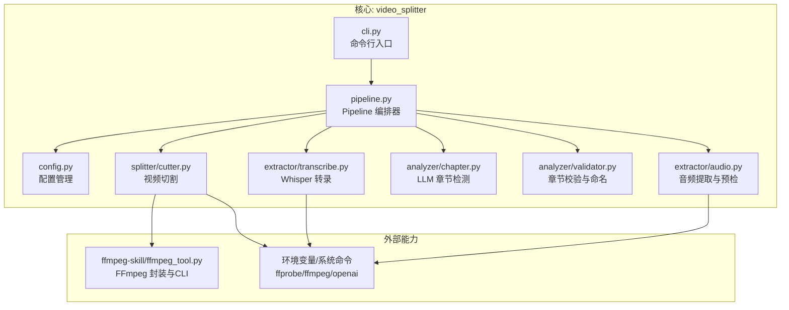
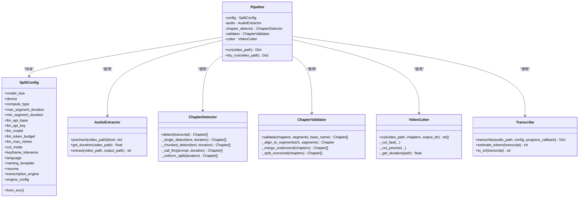
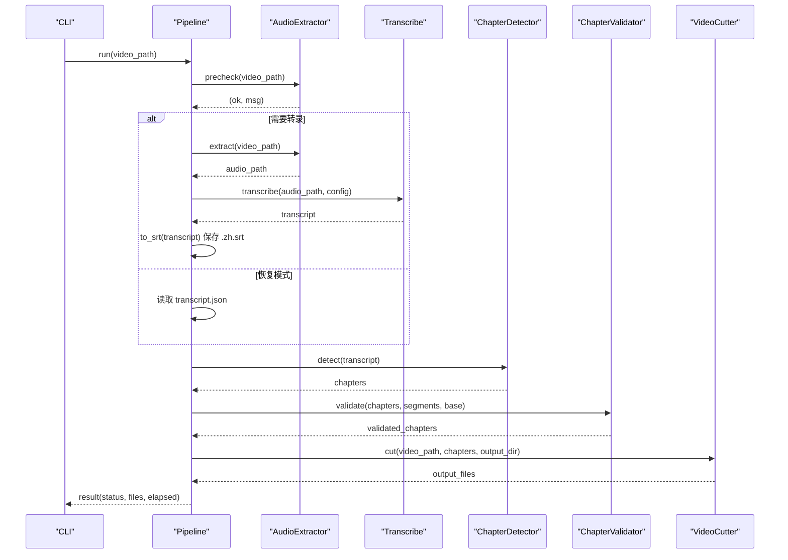
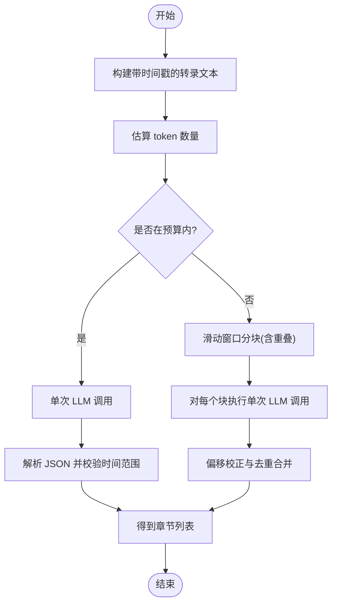
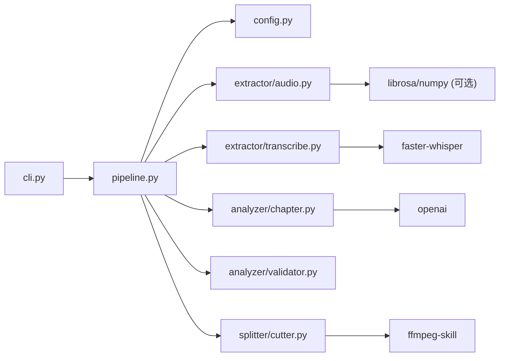

# 核心架构

<cite>
**本文引用的文件**   
- [pipeline.py](file://video_splitter/pipeline.py)
- [config.py](file://video_splitter/config.py)
- [audio.py](file://video_splitter/extractor/audio.py)
- [transcribe.py](file://video_splitter/extractor/transcribe.py)
- [chapter.py](file://video_splitter/analyzer/chapter.py)
- [validator.py](file://video_splitter/analyzer/validator.py)
- [cutter.py](file://video_splitter/splitter/cutter.py)
- [cli.py](file://video_splitter/cli.py)
- [ffmpeg_tool.py](file://ffmpeg-skill/ffmpeg_tool.py)
- [architecture.yaml](file://architecture.yaml)
</cite>

## 目录
1. [简介](#简介)
2. [项目结构](#项目结构)
3. [核心组件](#核心组件)
4. [架构总览](#架构总览)
5. [详细组件分析](#详细组件分析)
6. [依赖关系分析](#依赖关系分析)
7. [性能与可扩展性](#性能与可扩展性)
8. [故障排查指南](#故障排查指南)
9. [结论](#结论)
10. [附录：配置与环境变量](#附录配置与环境变量)

## 简介
本文件为 VideoSplitter 的核心架构文档，聚焦于 Pipeline 编排器的高层设计与处理流程，覆盖音频提取、语音转录、章节检测与视频切割的完整数据流。文档同时解释各组件之间的交互关系与数据传递机制，说明采用的架构模式（流水线模式、MVC、观察者模式、策略模式），并详细描述配置管理系统的设计（环境变量、配置文件与默认值）。最后给出系统边界定义与扩展点说明，配合架构图与数据流图帮助开发者理解整体设计思路。

## 项目结构
VideoSplitter 采用分层与按功能域组织相结合的结构：
- video_splitter：核心业务逻辑，包含配置、管线编排、音频提取、转录、章节分析与校验、视频切割等模块
- ffmpeg-skill：FFmpeg 工具封装与独立 CLI 工具
- gui：PySide6 图形界面（可选）
- tests：单元测试与集成测试
- architecture.yaml：架构约束声明（用于质量门禁）

图表来源
- [pipeline.py:1-131](file://video_splitter/pipeline.py#L1-L131)
- [config.py:1-54](file://video_splitter/config.py#L1-L54)
- [audio.py:1-171](file://video_splitter/extractor/audio.py#L1-L171)
- [transcribe.py:1-105](file://video_splitter/extractor/transcribe.py#L1-L105)
- [chapter.py:1-343](file://video_splitter/analyzer/chapter.py#L1-L343)
- [validator.py:1-152](file://video_splitter/analyzer/validator.py#L1-L152)
- [cutter.py:1-98](file://video_splitter/splitter/cutter.py#L1-L98)
- [cli.py:1-256](file://video_splitter/cli.py#L1-L256)
- [ffmpeg_tool.py:1-283](file://ffmpeg-skill/ffmpeg_tool.py#L1-L283)

章节来源
- [pipeline.py:1-131](file://video_splitter/pipeline.py#L1-L131)
- [config.py:1-54](file://video_splitter/config.py#L1-L54)
- [cli.py:1-256](file://video_splitter/cli.py#L1-L256)

## 核心组件
- 配置管理 SplitConfig：集中管理 Whisper 模型、设备、计算类型、分段时长限制、LLM 调用参数、切割策略、语言、命名模板、恢复模式与 ASR 引擎选择；支持从环境变量覆盖默认值。
- 音频提取 AudioExtractor：使用 ffprobe 获取时长，基于 FFmpeg 抽取 16kHz 单声道 WAV，并提供音频质量预检查（RMS、静音比例）。
- 语音转录 transcribe：基于 faster-whisper 进行 VAD 过滤与分段输出，提供 SRT 转换与 token 估算。
- 章节检测 ChapterDetector：通过 LLM（OpenAI 兼容接口）对转录文本进行语义分章，支持滑动窗口分块与失败回退到均匀分割。
- 章节校验 ChapterValidator：对齐到转录段边界、合并过短片段、拆分过长片段、规范化标题与序列号。
- 视频切割 VideoCutter：优先快速拷贝切割，若精度不满足则回退到重编码精确切割；支持进度回调。
- 编排器 Pipeline：串联 precheck → extract → transcribe → chapter → validate → cut，支持断点续跑与 dry-run 成本估算。
- CLI 入口 cli：提供 split、transcribe、cut、check、review、gui、batch 等子命令。

章节来源
- [config.py:1-54](file://video_splitter/config.py#L1-L54)
- [audio.py:1-171](file://video_splitter/extractor/audio.py#L1-L171)
- [transcribe.py:1-105](file://video_splitter/extractor/transcribe.py#L1-L105)
- [chapter.py:1-343](file://video_splitter/analyzer/chapter.py#L1-L343)
- [validator.py:1-152](file://video_splitter/analyzer/validator.py#L1-L152)
- [cutter.py:1-98](file://video_splitter/splitter/cutter.py#L1-L98)
- [pipeline.py:1-131](file://video_splitter/pipeline.py#L1-L131)
- [cli.py:1-256](file://video_splitter/cli.py#L1-L256)

## 架构总览
VideoSplitter 采用“流水线模式”作为核心编排方式，将复杂的多阶段任务拆分为可组合的阶段，并通过统一的配置对象驱动行为。在 GUI 侧引入 MVC 与观察者模式，实现视图与业务解耦以及跨线程通信。

图表来源
- [pipeline.py:1-131](file://video_splitter/pipeline.py#L1-L131)
- [config.py:1-54](file://video_splitter/config.py#L1-L54)
- [audio.py:1-171](file://video_splitter/extractor/audio.py#L1-L171)
- [transcribe.py:1-105](file://video_splitter/extractor/transcribe.py#L1-L105)
- [chapter.py:1-343](file://video_splitter/analyzer/chapter.py#L1-L343)
- [validator.py:1-152](file://video_splitter/analyzer/validator.py#L1-L152)
- [cutter.py:1-98](file://video_splitter/splitter/cutter.py#L1-L98)

## 详细组件分析

### Pipeline 编排器（流水线模式）
- 职责：统一调度 precheck → extract → transcribe → chapter → validate → cut，维护中间产物路径（transcript.json、chapters.json、srt），支持 resume 跳过已存在步骤，提供 dry_run 预估成本。
- 数据流：输入视频路径 → 预检 → 提取音频 → 转录 → 生成 SRT → 章节检测 → 校验与命名 → 切割输出。
- 错误处理：任一阶段异常会记录日志并将结果标记为 error，最终抛出异常以便上层捕获。
- 关键路径参考：[pipeline.py:31-111](file://video_splitter/pipeline.py#L31-L111)、[pipeline.py:113-131](file://video_splitter/pipeline.py#L113-L131)

图表来源
- [pipeline.py:31-111](file://video_splitter/pipeline.py#L31-L111)
- [audio.py:1-171](file://video_splitter/extractor/audio.py#L1-L171)
- [transcribe.py:1-105](file://video_splitter/extractor/transcribe.py#L1-L105)
- [chapter.py:1-343](file://video_splitter/analyzer/chapter.py#L1-L343)
- [validator.py:1-152](file://video_splitter/analyzer/validator.py#L1-L152)
- [cutter.py:1-98](file://video_splitter/splitter/cutter.py#L1-L98)

章节来源
- [pipeline.py:1-131](file://video_splitter/pipeline.py#L1-L131)

### 配置管理（环境变量与默认值）
- 默认值：SplitConfig 以 dataclass 形式提供所有字段默认值，涵盖模型大小、设备、计算类型、分段时长、LLM 参数、切割模式、语言、命名模板、恢复开关、ASR 引擎名及引擎配置。
- 环境变量覆盖：from_env() 方法根据环境变量覆盖默认值，包括 OPENAI_API_BASE、OPENAI_API_KEY、WHALECLOUD_API_KEY、VIDEO_SPLITTER_DEVICE、VIDEO_SPLITTER_RESUME、VIDEO_SPLITTER_ENGINE。
- 设计要点：集中式配置、易扩展、便于测试注入。

章节来源
- [config.py:1-54](file://video_splitter/config.py#L1-L54)

### 音频提取与质量预检
- 预检：使用 ffprobe 获取时长，截取前若干秒音频，借助 librosa/numpy 计算 RMS 与静音比例，返回是否合格或警告信息。
- 提取：根据时长选择不同 FFmpeg 参数，输出 16kHz 单声道 PCM WAV。
- 错误处理：缺失文件、ffprobe 失败、librosa 未安装等情况均有明确分支。

章节来源
- [audio.py:1-171](file://video_splitter/extractor/audio.py#L1-L171)

### 语音转录与字幕生成
- 转录：faster-whisper 加载模型，开启 VAD 过滤，逐段输出时间戳与文本，支持进度回调。
- 辅助：estimate_tokens 粗略估算 LLM token 数；to_srt 将转录转换为标准 SRT 格式。
- 复杂度：转录时间与音频长度和模型规模相关；token 估算为 O(N) 字符计数。

章节来源
- [transcribe.py:1-105](file://video_splitter/extractor/transcribe.py#L1-L105)

### 章节检测（LLM 驱动）
- 单次检测：当转录文本长度小于预算时，直接构造 prompt 调用 OpenAI 兼容接口，解析 JSON 响应并构建 Chapter 列表。
- 滑动窗口：超长文本按约 15 分钟切块，保留 2 分钟重叠上下文，分别检测后去重合并。
- 容错：JSON 修复（json-repair）、重试与指数退避、最终回退到均匀分割。
- 数据结构：Chapter(title, start_seconds, end_seconds)，提供 to_dict 序列化。

图表来源
- [chapter.py:77-193](file://video_splitter/analyzer/chapter.py#L77-L193)
- [chapter.py:195-322](file://video_splitter/analyzer/chapter.py#L195-L322)

章节来源
- [chapter.py:1-343](file://video_splitter/analyzer/chapter.py#L1-L343)

### 章节校验与命名
- 对齐：将章节边界对齐到最近的转录段边界，避免在句子中间切断。
- 合并：将低于最小持续时间的片段与其相邻片段合并。
- 拆分：将超过最大持续时间的片段递归均分为多段。
- 命名：清理非法字符，确保以序号前缀开头，符合命名模板。

章节来源
- [validator.py:1-152](file://video_splitter/analyzer/validator.py#L1-L152)

### 视频切割（策略模式）
- 策略：fast 模式优先使用流拷贝（copy）快速切割；precise 模式使用 libx264/aac 重编码保证精度。
- 自适应：fast 模式下若实际时长偏差超过容忍阈值，自动回退到 precise。
- 进度：支持进度回调，便于 GUI 显示。

章节来源
- [cutter.py:1-98](file://video_splitter/splitter/cutter.py#L1-L98)

### CLI 与 GUI 集成（MVC 与观察者）
- CLI：提供 split、transcribe、cut、check、review、gui、batch 等子命令，统一解析参数并调用 Pipeline。
- GUI：采用 MVC 与观察者模式，主窗口（View）通过控制器（Controller）协调工作线程（Worker）执行转录，信号槽机制实现跨线程通信与状态更新。

章节来源
- [cli.py:1-256](file://video_splitter/cli.py#L1-L256)

## 依赖关系分析
- 内部依赖方向：
  - cli → pipeline → config / extractor / analyzer / splitter
  - cutter 动态导入 ffmpeg-skill 模块
- 外部依赖：
  - FFmpeg/ffprobe：音频提取、时长查询、视频切割
  - faster-whisper：语音识别
  - openai：LLM 调用（章节检测）
  - json-repair：JSON 修复（可选）
  - librosa/numpy：音频质量预检（可选）

图表来源
- [cli.py:1-256](file://video_splitter/cli.py#L1-L256)
- [pipeline.py:1-131](file://video_splitter/pipeline.py#L1-L131)
- [cutter.py:1-98](file://video_splitter/splitter/cutter.py#L1-L98)
- [transcribe.py:1-105](file://video_splitter/extractor/transcribe.py#L1-L105)
- [chapter.py:1-343](file://video_splitter/analyzer/chapter.py#L1-L343)
- [audio.py:1-171](file://video_splitter/extractor/audio.py#L1-L171)

章节来源
- [architecture.yaml:1-11](file://architecture.yaml#L1-L11)

## 性能与可扩展性
- 性能特征
  - 转录阶段主导耗时，受模型规模与硬件影响显著；dry_run 可预估 token 与费用。
  - 切割阶段 fast 模式接近实时，precise 模式需重编码，耗时较长但精度高。
  - 章节检测可能触发多次 LLM 调用（长文本分块），需关注网络与配额。
- 优化建议
  - 合理设置 llm_token_budget 与 max_segment_duration，减少 LLM 调用次数。
  - 在 GPU 可用时调整 device 与 compute_type 提升转录速度。
  - 批量处理时使用 batch 命令顺序执行，结合 resume 避免重复工作。
- 扩展点
  - 新增 ASR 引擎：在 engines.py 中实现抽象基类并在工厂函数注册，通过 VIDEO_SPLITTER_ENGINE 切换。
  - 自定义章节检测策略：替换 ChapterDetector 的实现或增加新的分块策略。
  - 自定义切割策略：扩展 VideoCutter 的策略枚举与实现。
  - 自定义命名模板：通过 naming_template 控制输出文件名。

[本节为通用指导，无需特定文件引用]

## 故障排查指南
- 常见错误与定位
  - FFmpeg/ffprobe 不可用：检查 PATH 与安装；cli check 命令可自检。
  - 无音频或静音过高：AudioExtractor.precheck 会返回警告或失败；建议重新录制或降噪。
  - 转录失败：确认 faster-whisper 安装与模型下载；查看日志中的 stderr。
  - LLM 调用失败：检查 API Key 与 Base URL；ChapterDetector 会自动回退到均匀分割。
  - 切割失败：fast 模式失败会回退 precise；若仍失败，检查磁盘空间与权限。
- 调试技巧
  - 启用 --dry-run 预估成本与调用次数。
  - 使用 --resume 跳过已完成步骤，仅运行后续阶段。
  - 查看生成的 transcript.json、chapters.json、.zh.srt 中间文件定位问题。

章节来源
- [cli.py:85-152](file://video_splitter/cli.py#L85-L152)
- [audio.py:26-99](file://video_splitter/extractor/audio.py#L26-L99)
- [chapter.py:195-322](file://video_splitter/analyzer/chapter.py#L195-L322)
- [cutter.py:55-86](file://video_splitter/splitter/cutter.py#L55-L86)

## 结论
VideoSplitter 以 Pipeline 为核心编排器，将音视频处理链路模块化，结合配置管理与策略模式实现灵活可控的处理流程。通过 LLM 驱动的语义分章与严格的章节校验，系统在准确性与可用性之间取得平衡。GUI 侧采用 MVC 与观察者模式，保障良好的用户体验与可维护性。整体架构清晰、扩展点明确，适合进一步演进与集成更多智能处理能力。

[本节为总结，无需特定文件引用]

## 附录：配置与环境变量
- 环境变量
  - OPENAI_API_BASE：LLM 服务地址
  - OPENAI_API_KEY / WHALECLOUD_API_KEY：LLM 鉴权密钥
  - VIDEO_SPLITTER_DEVICE：推理设备（auto/cpu/gpu）
  - VIDEO_SPLITTER_RESUME：是否启用恢复模式（1/true/yes）
  - VIDEO_SPLITTER_ENGINE：ASR 引擎名称（如 funasr）
- 配置项（部分）
  - model_size、device、compute_type：Whisper 模型与计算设置
  - max_segment_duration、min_segment_duration：分段时长上下界
  - llm_*：LLM 调用相关参数
  - cut_mode、keyframe_tolerance：切割策略与精度容忍度
  - language、naming_template、resume：输出语言、命名模板与恢复开关
  - transcription_engine、engine_config：ASR 引擎与引擎级配置

章节来源
- [config.py:1-54](file://video_splitter/config.py#L1-L54)
