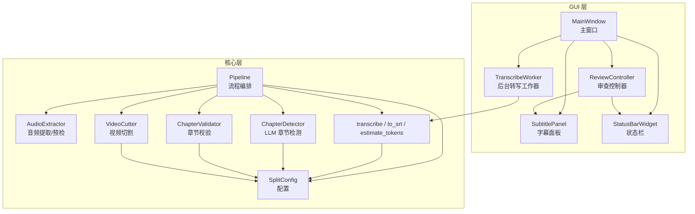
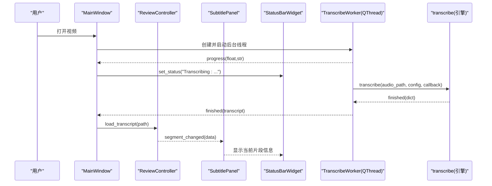
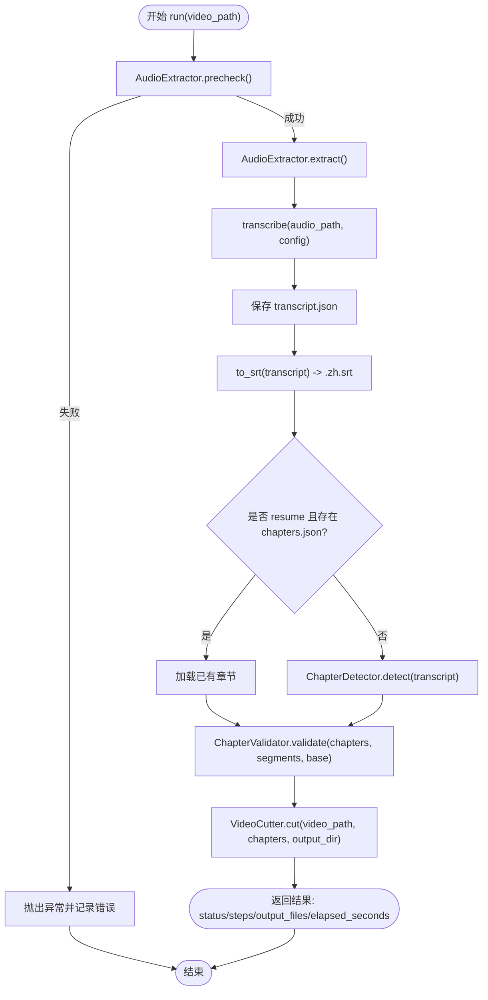
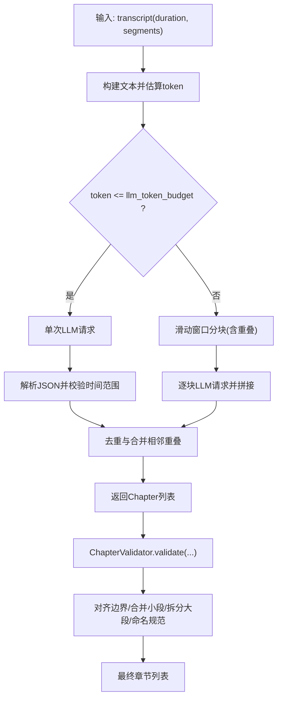
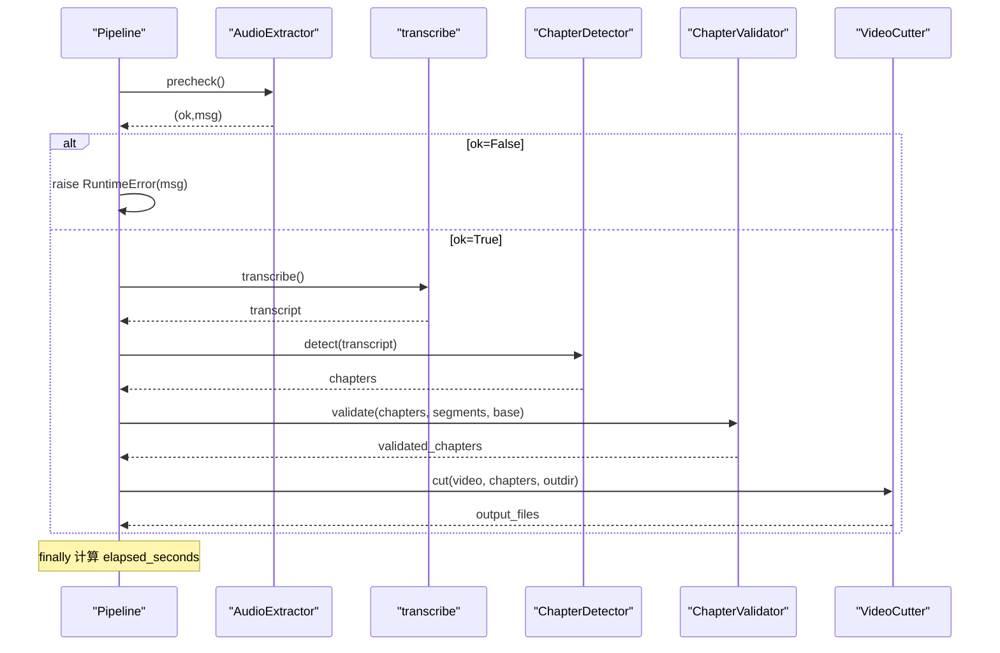
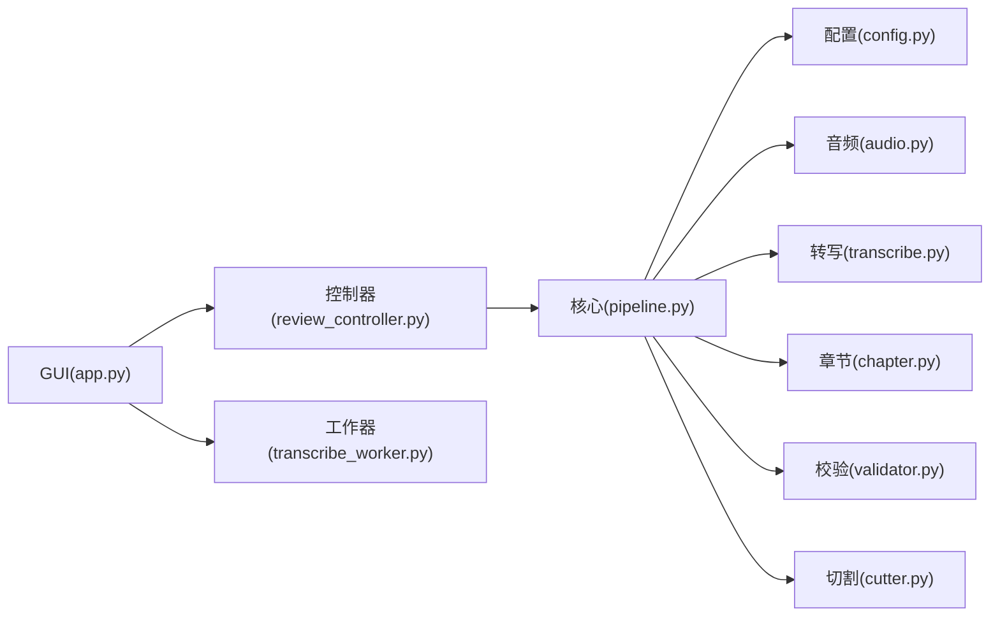

# 组件通信机制

<cite>
**本文引用的文件**   
- [pipeline.py](file://video_splitter/pipeline.py)
- [config.py](file://video_splitter/config.py)
- [audio.py](file://video_splitter/extractor/audio.py)
- [transcribe.py](file://video_splitter/extractor/transcribe.py)
- [chapter.py](file://video_splitter/analyzer/chapter.py)
- [validator.py](file://video_splitter/analyzer/validator.py)
- [cutter.py](file://video_splitter/splitter/cutter.py)
- [app.py](file://gui/app.py)
- [review_controller.py](file://gui/controllers/review_controller.py)
- [subtitle_panel.py](file://gui/widgets/subtitle_panel.py)
- [status_bar.py](file://gui/widgets/status_bar.py)
- [transcribe_worker.py](file://gui/workers/transcribe_worker.py)
</cite>

## 目录
1. [简介](#简介)
2. [项目结构](#项目结构)
3. [核心组件](#核心组件)
4. [架构总览](#架构总览)
5. [详细组件分析](#详细组件分析)
6. [依赖关系分析](#依赖关系分析)
7. [性能考虑](#性能考虑)
8. [故障排查指南](#故障排查指南)
9. [结论](#结论)
10. [附录](#附录)

## 简介
本文件聚焦于 VideoSplitter 的组件通信机制，系统性阐述：
- GUI 层与核心业务逻辑层的交互方式（Qt 信号槽、线程模型）
- Pipeline 与各子组件（AudioExtractor、ChapterDetector、Validator、VideoCutter）之间的数据传递接口
- 同步调用、异步消息传递与事件驱动通信模式
- 错误传播与异常处理策略
- 最佳实践与性能优化建议
- 调试与监控组件通信的方法

## 项目结构
本项目采用分层与按功能模块组织相结合的结构：
- gui：基于 PySide6 的图形界面，包含主窗口、控制器、工作线程与 UI 控件
- video_splitter：核心业务逻辑，包括配置、管线编排、音频提取、转写、章节检测、校验与视频切割
- ffmpeg-skill：外部工具封装（通过动态导入使用）



图表来源
- [app.py:27-100](file://gui/app.py#L27-L100)
- [review_controller.py:20-52](file://gui/controllers/review_controller.py#L20-L52)
- [subtitle_panel.py:19-28](file://gui/widgets/subtitle_panel.py#L19-L28)
- [status_bar.py:8-27](file://gui/widgets/status_bar.py#L8-L27)
- [transcribe_worker.py:16-49](file://gui/workers/transcribe_worker.py#L16-L49)
- [pipeline.py:21-30](file://video_splitter/pipeline.py#L21-L30)
- [config.py:19-38](file://video_splitter/config.py#L19-L38)

章节来源
- [app.py:27-100](file://gui/app.py#L27-L100)
- [pipeline.py:21-30](file://video_splitter/pipeline.py#L21-L30)
- [config.py:19-38](file://video_splitter/config.py#L19-L38)

## 核心组件
- 配置中心 SplitConfig：集中管理 ASR、LLM、切割策略等参数，支持环境变量覆盖。
- 管线编排 Pipeline：串联预检、音频提取、转写、SRT 导出、章节检测、校验、切割，并记录步骤与耗时。
- 音频提取 AudioExtractor：调用 ffprobe/ffmpeg 进行时长获取、质量预检与音频提取。
- 转写 transcribe：基于 faster-whisper 或 FunASR 引擎进行语音转文本，输出带时间戳的片段。
- 章节检测 ChapterDetector：基于 LLM 的语义章节划分，具备分块、去重与均匀分割回退能力。
- 章节校验 ChapterValidator：对齐到转录边界、合并过短段、拆分过长段，规范化命名。
- 视频切割 VideoCutter：优先快速拷贝切分，必要时精确重编码；支持进度回调。
- GUI 组件：MainWindow、ReviewController、SubtitlePanel、StatusBarWidget、TranscribeWorker，通过 Qt 信号槽实现解耦与跨线程通信。

章节来源
- [config.py:19-54](file://video_splitter/config.py#L19-L54)
- [pipeline.py:21-131](file://video_splitter/pipeline.py#L21-L131)
- [audio.py:12-171](file://video_splitter/extractor/audio.py#L12-L171)
- [transcribe.py:11-105](file://video_splitter/extractor/transcribe.py#L11-L105)
- [chapter.py:18-343](file://video_splitter/analyzer/chapter.py#L18-L343)
- [validator.py:10-152](file://video_splitter/analyzer/validator.py#L10-L152)
- [cutter.py:22-98](file://video_splitter/splitter/cutter.py#L22-L98)
- [app.py:27-100](file://gui/app.py#L27-L100)
- [review_controller.py:20-149](file://gui/controllers/review_controller.py#L20-L149)
- [subtitle_panel.py:19-135](file://gui/widgets/subtitle_panel.py#L19-L135)
- [status_bar.py:8-27](file://gui/widgets/status_bar.py#L8-L27)
- [transcribe_worker.py:16-49](file://gui/workers/transcribe_worker.py#L16-L49)

## 架构总览
系统采用“GUI 事件驱动 + 核心同步流水线”的混合架构：
- GUI 侧通过 Qt 信号槽将用户操作转化为对控制器的调用，控制器维护状态并通过信号更新 UI。
- 长耗时任务（如转写）在 QThread 中运行，通过信号向主线程汇报进度与结果。
- 核心 Pipeline 以同步顺序调用各子组件，内部通过函数返回值和异常进行数据与错误传播。



图表来源
- [app.py:157-178](file://gui/app.py#L157-L178)
- [transcribe_worker.py:33-49](file://gui/workers/transcribe_worker.py#L33-L49)
- [transcribe.py:11-59](file://video_splitter/extractor/transcribe.py#L11-L59)
- [review_controller.py:36-52](file://gui/controllers/review_controller.py#L36-L52)
- [subtitle_panel.py:97-114](file://gui/widgets/subtitle_panel.py#L97-L114)
- [status_bar.py:18-26](file://gui/widgets/status_bar.py#L18-L26)

## 详细组件分析

### GUI 层与核心业务逻辑的交互（Qt 信号槽）
- 主窗口 MainWindow 负责菜单、布局、快捷键与生命周期管理，持有控制器与工作线程引用。
- 控制器 ReviewController 作为状态机，暴露 segment_changed、progress_loaded、transcript_saved、error 等信号，供 UI 订阅。
- 字幕面板 SubtitlePanel 发出 prev_requested、save_next_requested、jump_requested、save_requested、editing_started 等信号，由控制器消费。
- 状态栏 StatusBarWidget 提供 set_status/set_progress 方法，用于展示进度与提示。
- 后台工作器 TranscribeWorker 在独立线程中执行转写，通过 progress、finished、error 信号与主线程通信。

```mermaid
classDiagram
class MainWindow {
-_controller : ReviewController
-_worker : TranscribeWorker
-_worker_thread : QThread
+_connect_signals()
+_on_open_video()
+_on_segment_changed(data)
+_on_transcribe_progress(frac, desc)
+_on_transcribe_finished(transcript)
+_on_transcribe_error(msg)
}
class ReviewController {
+segment_changed : Signal(dict)
+progress_loaded : Signal(dict)
+transcript_saved : Signal()
+error : Signal(str)
+load_transcript(path) list[dict]
+current_segment() dict|None
+save_correction(text, index) void
+next() dict|None
+prev() dict|None
+jump_to(n) dict|None
+export_srt() str
}
class SubtitlePanel {
+prev_requested : Signal()
+save_next_requested : Signal()
+jump_requested : Signal(int)
+save_requested : Signal()
+editing_started : Signal()
+set_segment(index,total,text,start,end)
+set_correction(text)
+get_correction() str
+set_modified(modified)
}
class StatusBarWidget {
+set_status(text)
+set_progress(fraction, description)
}
class TranscribeWorker {
+progress : Signal(float,str)
+finished : Signal(dict)
+error : Signal(str)
+run(audio_path)
}
MainWindow --> ReviewController : "持有"
MainWindow --> SubtitlePanel : "持有"
MainWindow --> StatusBarWidget : "持有"
MainWindow --> TranscribeWorker : "持有并调度"
ReviewController --> SubtitlePanel : "更新UI"
ReviewController --> StatusBarWidget : "更新状态"
SubtitlePanel --> ReviewController : "信号触发"
TranscribeWorker -->> MainWindow : "信号回调"
```

图表来源
- [app.py:27-100](file://gui/app.py#L27-L100)
- [review_controller.py:20-149](file://gui/controllers/review_controller.py#L20-L149)
- [subtitle_panel.py:19-135](file://gui/widgets/subtitle_panel.py#L19-L135)
- [status_bar.py:8-27](file://gui/widgets/status_bar.py#L8-L27)
- [transcribe_worker.py:16-49](file://gui/workers/transcribe_worker.py#L16-L49)

章节来源
- [app.py:96-141](file://gui/app.py#L96-L141)
- [review_controller.py:20-149](file://gui/controllers/review_controller.py#L20-L149)
- [subtitle_panel.py:19-135](file://gui/widgets/subtitle_panel.py#L19-L135)
- [status_bar.py:8-27](file://gui/widgets/status_bar.py#L8-L27)
- [transcribe_worker.py:16-49](file://gui/workers/transcribe_worker.py#L16-L49)

### Pipeline 与各子组件的数据传递接口
- 输入：视频路径、SplitConfig
- 中间产物：
  - 转录 JSON（segments、duration、language）
  - SRT 文本
  - 章节列表（Chapter 对象或兼容字典）
- 输出：分段视频文件路径列表、步骤完成标记、耗时统计



图表来源
- [pipeline.py:31-111](file://video_splitter/pipeline.py#L31-L111)
- [audio.py:26-100](file://video_splitter/extractor/audio.py#L26-L100)
- [transcribe.py:11-59](file://video_splitter/extractor/transcribe.py#L11-L59)
- [chapter.py:77-96](file://video_splitter/analyzer/chapter.py#L77-L96)
- [validator.py:22-53](file://video_splitter/analyzer/validator.py#L22-L53)
- [cutter.py:30-53](file://video_splitter/splitter/cutter.py#L30-L53)

章节来源
- [pipeline.py:31-111](file://video_splitter/pipeline.py#L31-L111)
- [audio.py:26-100](file://video_splitter/extractor/audio.py#L26-L100)
- [transcribe.py:11-59](file://video_splitter/extractor/transcribe.py#L11-L59)
- [chapter.py:77-96](file://video_splitter/analyzer/chapter.py#L77-L96)
- [validator.py:22-53](file://video_splitter/analyzer/validator.py#L22-L53)
- [cutter.py:30-53](file://video_splitter/splitter/cutter.py#L30-L53)

### 关键算法与处理逻辑（章节检测与校验）
- 章节检测：
  - 估算 token 数，决定单次 LLM 调用或滑动窗口分块
  - 解析 LLM 返回 JSON，修复与边界校验
  - 失败时回退为均匀分割
- 章节校验：
  - 将章节边界对齐到最近转录片段边界
  - 合并小于最小时长的片段
  - 拆分超过最大时长的片段
  - 规范化标题前缀与非法字符清理



图表来源
- [chapter.py:77-96](file://video_splitter/analyzer/chapter.py#L77-L96)
- [chapter.py:116-193](file://video_splitter/analyzer/chapter.py#L116-L193)
- [chapter.py:195-210](file://video_splitter/analyzer/chapter.py#L195-L210)
- [chapter.py:243-301](file://video_splitter/analyzer/chapter.py#L243-L301)
- [chapter.py:303-322](file://video_splitter/analyzer/chapter.py#L303-L322)
- [validator.py:22-53](file://video_splitter/analyzer/validator.py#L22-L53)
- [validator.py:55-132](file://video_splitter/analyzer/validator.py#L55-L132)

章节来源
- [chapter.py:77-96](file://video_splitter/analyzer/chapter.py#L77-L96)
- [chapter.py:116-193](file://video_splitter/analyzer/chapter.py#L116-L193)
- [chapter.py:195-210](file://video_splitter/analyzer/chapter.py#L195-L210)
- [chapter.py:243-301](file://video_splitter/analyzer/chapter.py#L243-L301)
- [chapter.py:303-322](file://video_splitter/analyzer/chapter.py#L303-L322)
- [validator.py:22-53](file://video_splitter/analyzer/validator.py#L22-L53)
- [validator.py:55-132](file://video_splitter/analyzer/validator.py#L55-L132)

### 错误传播与异常处理机制
- GUI 层：
  - 控制器通过 error 信号上报错误，主窗口弹出对话框并更新状态栏
  - 工作器捕获异常并通过 error 信号通知主线程，避免阻塞 UI
- 核心层：
  - Pipeline 统一 try/except 捕获异常，设置 result.status="error" 并记录日志，同时向上抛出
  - 子组件各自抛出具体异常（如 FFmpeg 失败、openai 缺失、时间戳越界等），由上层统一处理或回退



图表来源
- [pipeline.py:47-111](file://video_splitter/pipeline.py#L47-L111)
- [audio.py:26-100](file://video_splitter/extractor/audio.py#L26-L100)
- [transcribe.py:11-59](file://video_splitter/extractor/transcribe.py#L11-L59)
- [chapter.py:195-210](file://video_splitter/analyzer/chapter.py#L195-L210)
- [validator.py:22-53](file://video_splitter/analyzer/validator.py#L22-L53)
- [cutter.py:55-85](file://video_splitter/splitter/cutter.py#L55-L85)

章节来源
- [pipeline.py:47-111](file://video_splitter/pipeline.py#L47-L111)
- [transcribe_worker.py:33-49](file://gui/workers/transcribe_worker.py#L33-L49)
- [review_controller.py:65-84](file://gui/controllers/review_controller.py#L65-L84)

## 依赖关系分析
- 耦合与内聚：
  - Pipeline 聚合各子组件，职责清晰，内聚度高
  - GUI 层通过信号槽解耦，控制器与 UI 分离，便于测试与维护
- 直接/间接依赖：
  - GUI 依赖控制器与工作器；工作器依赖引擎工厂与配置
  - 核心层依赖配置与外部工具（ffprobe/ffmpeg/openai/faster-whisper）
- 潜在循环依赖：
  - 未发现循环导入；模块间依赖方向明确（GUI → 控制器 → 核心层）
- 外部集成点：
  - FFmpeg/ffprobe：音视频处理
  - OpenAI 兼容 API：章节检测
  - faster-whisper/FunASR：语音转文本



图表来源
- [app.py:27-100](file://gui/app.py#L27-L100)
- [review_controller.py:20-52](file://gui/controllers/review_controller.py#L20-L52)
- [transcribe_worker.py:16-49](file://gui/workers/transcribe_worker.py#L16-L49)
- [pipeline.py:21-30](file://video_splitter/pipeline.py#L21-L30)
- [config.py:19-38](file://video_splitter/config.py#L19-L38)

章节来源
- [app.py:27-100](file://gui/app.py#L27-L100)
- [pipeline.py:21-30](file://video_splitter/pipeline.py#L21-L30)
- [config.py:19-38](file://video_splitter/config.py#L19-L38)

## 性能考虑
- 异步与并发
  - GUI 长耗时任务（转写）在 QThread 中执行，避免阻塞 UI 主线程
  - 进度信号高频上报时，建议在 UI 端做节流或降采样显示
- 资源与 I/O
  - 音频提取与大文件切割使用 subprocess 调用外部工具，注意超时与错误码处理
  - 章节检测可能多次 LLM 调用，需合理设置重试与指数退避
- 内存与序列化
  - 长转录文本分块处理，避免一次性构造过大字符串
  - 中间产物（transcript.json、chapters.json）持久化，支持断点续跑
- 切割策略
  - 优先快速拷贝（copy），仅在精度不达标时回退到重编码，减少 CPU 占用

[本节为通用指导，无需源码引用]

## 故障排查指南
- GUI 层
  - 检查信号槽连接是否正确（例如 _connect_signals 中的绑定）
  - 监听 error 信号，确认错误消息来源（控制器或工作器）
  - 状态栏与进度条更新是否正常
- 核心层
  - Pipeline 的 steps_completed 与 elapsed_seconds 可帮助定位失败阶段
  - 子组件异常类型与日志输出有助于定位问题（FFmpeg、OpenAI、faster-whisper）
- 调试与监控
  - 启用 Python logging，观察 Pipeline 与各子组件的日志
  - 在 GUI 中增加临时日志打印，跟踪信号触发顺序与参数
  - 对于 LLM 调用，记录 prompt 与 raw response（脱敏后）以便复现

章节来源
- [app.py:96-141](file://gui/app.py#L96-L141)
- [review_controller.py:65-84](file://gui/controllers/review_controller.py#L65-L84)
- [pipeline.py:102-111](file://video_splitter/pipeline.py#L102-L111)
- [cutter.py:55-85](file://video_splitter/splitter/cutter.py#L55-L85)
- [chapter.py:195-210](file://video_splitter/analyzer/chapter.py#L195-L210)

## 结论
VideoSplitter 的组件通信机制以 Qt 信号槽为核心，结合线程与回调，实现了 GUI 与核心业务的松耦合协作。Pipeline 以同步顺序编排各子组件，通过返回值与异常进行数据与错误传播。整体设计具备良好的可扩展性与可观测性，适合后续引入更多分析与编辑能力。

[本节为总结，无需源码引用]

## 附录

### 最佳实践
- 使用信号槽进行跨线程通信，避免共享状态与锁竞争
- 对外部工具的调用统一封装，集中处理超时、错误码与日志
- 对 LLM 调用实施重试与回退策略，保证鲁棒性
- 中间产物持久化，支持断点续跑与离线分析
- 在 GUI 端对高频信号进行节流，降低 UI 刷新压力

[本节为通用指导，无需源码引用]

### 调试与监控清单
- 在 Pipeline.run 中记录每个阶段的开始/结束时间与异常堆栈
- 在工作器中记录引擎名称、模型信息与耗时
- 在章节检测中记录 token 估算、分块数量与 LLM 调用次数
- 在切割阶段记录实际时长与目标时长差异，评估 keyframe 容忍度

[本节为通用指导，无需源码引用]