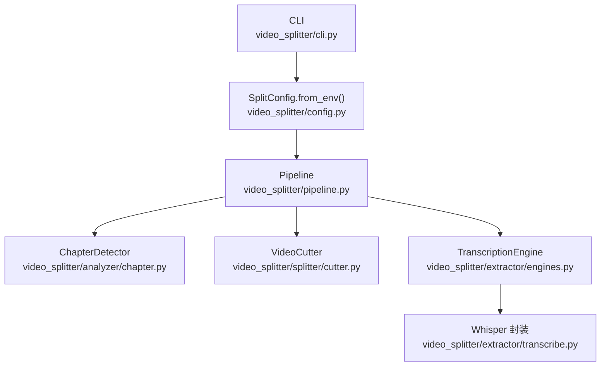
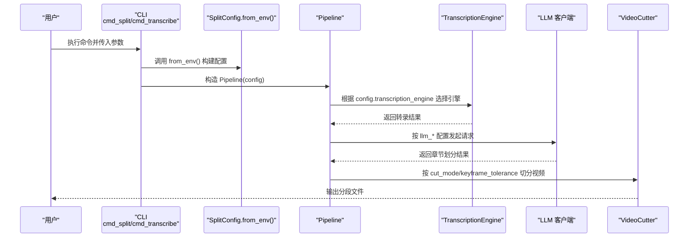
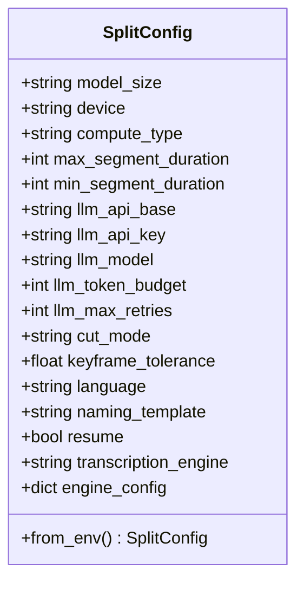
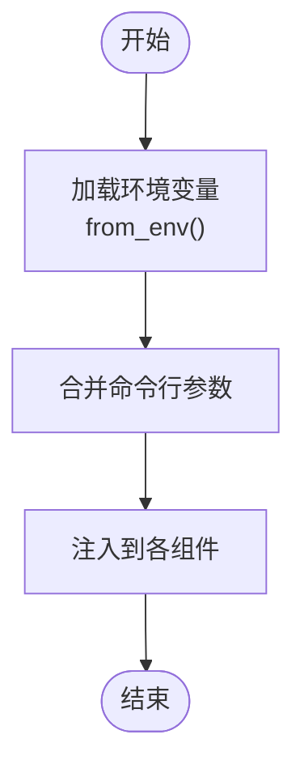
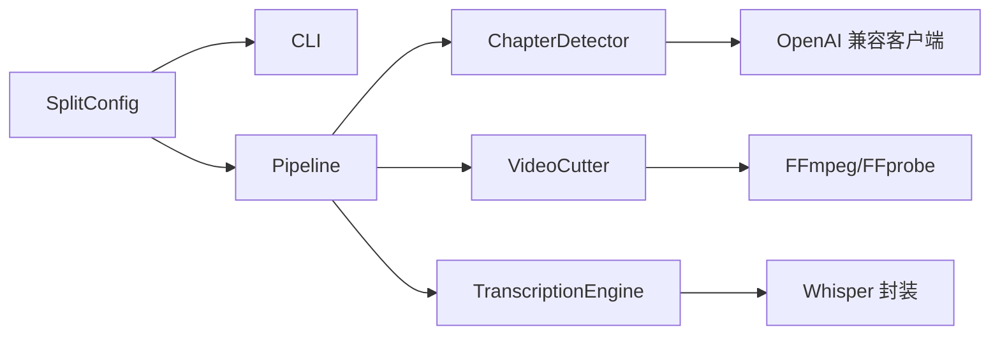

# 配置管理系统

<cite>
**本文引用的文件**   
- [config.py](file://video_splitter/config.py)
- [cli.py](file://video_splitter/cli.py)
- [pipeline.py](file://video_splitter/pipeline.py)
- [transcribe.py](file://video_splitter/extractor/transcribe.py)
- [engines.py](file://video_splitter/extractor/engines.py)
- [chapter.py](file://video_splitter/analyzer/chapter.py)
- [cutter.py](file://video_splitter/splitter/cutter.py)
- [test_chapter.py](file://video_splitter/tests/test_chapter.py)
</cite>

## 目录
1. [简介](#简介)
2. [项目结构](#项目结构)
3. [核心组件](#核心组件)
4. [架构总览](#架构总览)
5. [详细组件分析](#详细组件分析)
6. [依赖关系分析](#依赖关系分析)
7. [性能与可扩展性](#性能与可扩展性)
8. [故障排查指南](#故障排查指南)
9. [结论](#结论)
10. [附录：环境变量清单与示例](#附录环境变量清单与示例)

## 简介
本文件为 VideoSplitter 的配置管理系统提供全面架构文档，聚焦 SplitConfig 类的设计理念、实现方式与使用策略。内容涵盖：
- 环境变量配置、默认值管理
- 配置项分类与组织结构（ASR 引擎、LLM 提供商、路径与输出等）
- 配置验证规则与类型转换逻辑
- 完整的环境变量列表与使用示例
- 热重载机制现状与继承策略说明
- 最佳实践与常见问题解决方案

## 项目结构
配置相关代码集中在 video_splitter/config.py，并通过 CLI、Pipeline、各子模块消费。下图展示配置在系统中的位置与流向。

图表来源
- [cli.py:15-46](file://video_splitter/cli.py#L15-L46)
- [config.py:19-53](file://video_splitter/config.py#L19-L53)
- [pipeline.py:21-30](file://video_splitter/pipeline.py#L21-L30)
- [chapter.py:74-96](file://video_splitter/analyzer/chapter.py#L74-L96)
- [cutter.py:22-53](file://video_splitter/splitter/cutter.py#L22-L53)
- [engines.py:17-46](file://video_splitter/extractor/engines.py#L17-L46)
- [transcribe.py:11-59](file://video_splitter/extractor/transcribe.py#L11-L59)

章节来源
- [config.py:19-53](file://video_splitter/config.py#L19-L53)
- [cli.py:15-46](file://video_splitter/cli.py#L15-L46)
- [pipeline.py:21-30](file://video_splitter/pipeline.py#L21-L30)

## 核心组件
- SplitConfig：基于数据类的配置对象，集中定义所有可配置项及其默认值，并提供 from_env() 从环境变量覆盖默认值。
- 配置消费方：CLI、Pipeline、ChapterDetector、VideoCutter、TranscriptionEngine 等均通过传入 SplitConfig 实例读取配置。

设计要点
- 单一事实源：所有配置项在 SplitConfig 中声明，避免分散的常量与魔法字符串。
- 最小侵入式覆盖：from_env() 仅对必要字段进行覆盖，保持默认值稳定可预期。
- 类型安全：使用 dataclass 字段类型约束，便于静态检查与 IDE 提示。

章节来源
- [config.py:19-53](file://video_splitter/config.py#L19-L53)
- [cli.py:15-46](file://video_splitter/cli.py#L15-L46)
- [pipeline.py:24-29](file://video_splitter/pipeline.py#L24-L29)

## 架构总览
配置加载与使用流程如下：

图表来源
- [cli.py:15-46](file://video_splitter/cli.py#L15-L46)
- [config.py:39-53](file://video_splitter/config.py#L39-L53)
- [pipeline.py:21-30](file://video_splitter/pipeline.py#L21-L30)
- [engines.py:222-250](file://video_splitter/extractor/engines.py#L222-L250)
- [chapter.py:195-241](file://video_splitter/analyzer/chapter.py#L195-L241)
- [cutter.py:30-53](file://video_splitter/splitter/cutter.py#L30-L53)

## 详细组件分析

### SplitConfig 设计与实现
- 字段分组
  - ASR 模型与设备：model_size、device、compute_type、language
  - 分段时长边界：max_segment_duration、min_segment_duration
  - LLM 提供商设置：llm_api_base、llm_api_key、llm_model、llm_token_budget、llm_max_retries
  - 切割策略：cut_mode、keyframe_tolerance
  - 输出与命名：naming_template、resume
  - 引擎选择与扩展：transcription_engine、engine_config
- 默认值与覆盖
  - 所有字段具备合理默认值；from_env() 仅覆盖部分关键字段（如 OPENAI_API_BASE、OPENAI_API_KEY、WHALECLOUD_API_KEY、VIDEO_SPLITTER_DEVICE、VIDEO_SPLITTER_RESUME、VIDEO_SPLITTER_ENGINE）。
- 类型与校验
  - 使用 dataclass 字段类型约束；布尔型 resume 通过字符串到布尔的显式判断（"1"/"true"/"yes"）。
  - 当前未引入运行时强校验器（如 pydantic），但可通过单元测试保障行为正确性。
- 继承与组合
  - 无继承体系；采用组合模式在各组件中注入 SplitConfig 实例。
- 热重载
  - 当前实现不支持运行时热重载；每次进程启动时重新加载配置。

图表来源
- [config.py:19-53](file://video_splitter/config.py#L19-L53)

章节来源
- [config.py:19-53](file://video_splitter/config.py#L19-L53)
- [test_chapter.py:312-347](file://video_splitter/tests/test_chapter.py#L312-L347)

### 配置项分类与组织结构
- ASR 引擎配置
  - 通用：transcription_engine、engine_config（预留扩展）
  - Whisper 相关：model_size、device、compute_type、language
  - FunASR 相关：由 engines.py 内部通过环境变量 VIDEO_SPLITTER_FUNASR_MODEL_DIR 控制模型路径
- LLM 提供商设置
  - llm_api_base、llm_api_key、llm_model、llm_token_budget、llm_max_retries
- 文件路径与输出
  - naming_template、output_dir（由 Pipeline 推导）、resume（断点续跑）
- 切割策略
  - cut_mode（fast/precise）、keyframe_tolerance（秒）

章节来源
- [config.py:19-53](file://video_splitter/config.py#L19-L53)
- [engines.py:109-110](file://video_splitter/extractor/engines.py#L109-L110)
- [pipeline.py:31-38](file://video_splitter/pipeline.py#L31-L38)
- [cutter.py:43-72](file://video_splitter/splitter/cutter.py#L43-L72)

### 配置验证规则与类型转换逻辑
- 布尔解析：VIDEO_SPLITTER_RESUME 支持 "1"/"true"/"yes" 三种形式转为 True
- 键覆盖优先级：WHALECLOUD_API_KEY 会覆盖 OPENAI_API_KEY
- 设备与引擎：VIDEO_SPLITTER_DEVICE、VIDEO_SPLITTER_ENGINE 直接覆盖对应字段
- 缺失校验：当前未做严格范围或枚举校验（例如 cut_mode 取值、语言合法性等），建议后续引入集中校验层

章节来源
- [config.py:43-53](file://video_splitter/config.py#L43-L53)
- [test_chapter.py:312-347](file://video_splitter/tests/test_chapter.py#L312-L347)

### 配置的热重载机制与继承策略
- 热重载：当前未实现；如需支持，可在进程内维护全局配置缓存并在监听文件/环境变量变化后重建 SplitConfig 实例，再广播给已创建组件。
- 继承策略：当前无多环境继承；推荐通过分层覆盖（默认 → 配置文件 → 环境变量 → 命令行参数）实现，但本项目目前仅实现了“默认 + 环境变量 + 命令行”三层。

[本节为概念性说明，不直接分析具体文件]

### 配置在关键流程中的使用
- CLI 层：先加载 from_env()，再用命令行参数覆盖
- Pipeline 层：将 SplitConfig 注入到各子组件
- ChapterDetector：依据 llm_* 与 token 预算决定单次或分块调用
- VideoCutter：依据 cut_mode 与 keyframe_tolerance 选择快速或精确切割
- TranscriptionEngine：依据 transcription_engine 选择 FunASR 或 Whisper

图表来源
- [cli.py:15-46](file://video_splitter/cli.py#L15-L46)
- [pipeline.py:24-29](file://video_splitter/pipeline.py#L24-L29)
- [chapter.py:74-96](file://video_splitter/analyzer/chapter.py#L74-L96)
- [cutter.py:30-53](file://video_splitter/splitter/cutter.py#L30-L53)
- [engines.py:222-250](file://video_splitter/extractor/engines.py#L222-L250)

章节来源
- [cli.py:15-46](file://video_splitter/cli.py#L15-L46)
- [pipeline.py:24-29](file://video_splitter/pipeline.py#L24-L29)

## 依赖关系分析
- 低耦合：SplitConfig 作为纯数据载体，被多处消费但不反向依赖消费者
- 高内聚：配置项按领域分组，职责清晰
- 外部依赖：
  - LLM：openai 兼容客户端（在 chapter.py 中动态导入）
  - ASR：funasr 或 faster-whisper（在 engines.py 中动态导入）
  - FFmpeg/FFprobe：cutter.py 与 engines.py 中用于音视频处理与时长探测

图表来源
- [config.py:19-53](file://video_splitter/config.py#L19-L53)
- [cli.py:15-46](file://video_splitter/cli.py#L15-L46)
- [pipeline.py:21-30](file://video_splitter/pipeline.py#L21-L30)
- [chapter.py:195-241](file://video_splitter/analyzer/chapter.py#L195-L241)
- [cutter.py:22-53](file://video_splitter/splitter/cutter.py#L22-L53)
- [engines.py:17-46](file://video_splitter/extractor/engines.py#L17-L46)
- [transcribe.py:11-59](file://video_splitter/extractor/transcribe.py#L11-L59)

章节来源
- [config.py:19-53](file://video_splitter/config.py#L19-L53)
- [cli.py:15-46](file://video_splitter/cli.py#L15-L46)
- [pipeline.py:21-30](file://video_splitter/pipeline.py#L21-L30)
- [chapter.py:195-241](file://video_splitter/analyzer/chapter.py#L195-L241)
- [cutter.py:22-53](file://video_splitter/splitter/cutter.py#L22-L53)
- [engines.py:17-46](file://video_splitter/extractor/engines.py#L17-L46)
- [transcribe.py:11-59](file://video_splitter/extractor/transcribe.py#L11-L59)

## 性能与可扩展性
- 性能影响
  - device/compute_type 直接影响 ASR 推理速度与精度
  - llm_token_budget 控制是否触发分块策略，影响 LLM 调用次数与延迟
  - cut_mode=precise 会重编码视频，耗时显著高于 fast 拷贝模式
- 可扩展性
  - engine_config 预留了引擎特定参数的扩展点
  - create_engine(name, config) 工厂方法支持新增 ASR 引擎

[本节为通用指导，不直接分析具体文件]

## 故障排查指南
- LLM 不可用或未配置
  - 现象：章节检测失败回退为均匀分割
  - 排查：确认 llm_api_base、llm_api_key、llm_model 是否正确；网络可达性
  - 参考：chapter.py 的 _call_llm 重试与回退逻辑
- Whisper/FunASR 依赖缺失
  - 现象：健康检查失败或导入错误
  - 排查：安装对应依赖；FunASR 模型目录可通过 VIDEO_SPLITTER_FUNASR_MODEL_DIR 指定
- FFmpeg/FFprobe 不可用
  - 现象：切割失败或时长探测失败
  - 排查：确保 PATH 中包含 ffmpeg/ffprobe；权限与版本兼容性
- 断点续跑无效
  - 现象：仍重复转录或章节检测
  - 排查：确认 resume=True 且中间文件存在；注意文件名后缀约定

章节来源
- [chapter.py:195-241](file://video_splitter/analyzer/chapter.py#L195-L241)
- [engines.py:154-172](file://video_splitter/extractor/engines.py#L154-L172)
- [engines.py:207-219](file://video_splitter/extractor/engines.py#L207-L219)
- [cutter.py:74-98](file://video_splitter/splitter/cutter.py#L74-L98)
- [pipeline.py:54-86](file://video_splitter/pipeline.py#L54-L86)

## 结论
SplitConfig 以简洁的数据类形态承载系统全部配置，配合 from_env() 完成最小化覆盖，既保证默认值稳定，又满足灵活部署需求。通过 CLI 与 Pipeline 的组合注入，配置贯穿 ASR、LLM、切割等关键环节。建议在后续迭代中引入集中校验层与可选的配置文件加载，进一步提升健壮性与可维护性。

[本节为总结性内容，不直接分析具体文件]

## 附录：环境变量清单与示例
- 环境变量清单
  - OPENAI_API_BASE：LLM 服务基地址（覆盖 llm_api_base）
  - OPENAI_API_KEY：LLM API Key（可被 WHALECLOUD_API_KEY 覆盖）
  - WHALECLOUD_API_KEY：优先于 OPENAI_API_KEY 生效
  - VIDEO_SPLITTER_DEVICE：ASR 设备（如 cpu/gpu/auto）
  - VIDEO_SPLITTER_RESUME：是否启用断点续跑（"1"/"true"/"yes"）
  - VIDEO_SPLITTER_ENGINE：ASR 引擎名称（如 funasr/whisper）
  - VIDEO_SPLITTER_FUNASR_MODEL_DIR：FunASR 本地模型目录
- 使用示例
  - 设置 LLM 代理与密钥：export OPENAI_API_BASE="https://your-proxy" && export WHALECLOUD_API_KEY="sk-xxx"
  - 强制 CPU 运行：export VIDEO_SPLITTER_DEVICE="cpu"
  - 启用断点续跑：export VIDEO_SPLITTER_RESUME="true"
  - 切换 ASR 引擎：export VIDEO_SPLITTER_ENGINE="whisper"
  - 指定 FunASR 模型：export VIDEO_SPLITTER_FUNASR_MODEL_DIR="/path/to/model"

章节来源
- [config.py:43-53](file://video_splitter/config.py#L43-L53)
- [engines.py:109-110](file://video_splitter/extractor/engines.py#L109-L110)