# 单元测试

<cite>
**本文引用的文件**   
- [pyproject.toml](file://pyproject.toml)
- [test.yml](file://.github/workflows/test.yml)
- [conftest.py](file://tests/conftest.py)
- [test_audio.py](file://video_splitter/tests/test_audio.py)
- [audio.py](file://video_splitter/extractor/audio.py)
- [test_chapter.py](file://video_splitter/tests/test_chapter.py)
- [chapter.py](file://video_splitter/analyzer/chapter.py)
- [test_cutter.py](file://video_splitter/tests/test_cutter.py)
- [cutter.py](file://video_splitter/splitter/cutter.py)
- [test_transcribe.py](file://video_splitter/tests/test_transcribe.py)
- [transcribe.py](file://video_splitter/extractor/transcribe.py)
- [test_engines.py](file://video_splitter/tests/test_engines.py)
- [engines.py](file://video_splitter/extractor/engines.py)
- [test_pipeline.py](file://video_splitter/tests/test_pipeline.py)
- [pipeline.py](file://video_splitter/pipeline.py)
- [test_review_controller.py](file://tests/test_review_controller.py)
- [review_controller.py](file://gui/controllers/review_controller.py)
- [test_widgets.py](file://tests/test_widgets.py)
- [subtitle_panel.py](file://gui/widgets/subtitle_panel.py)
- [video_player.py](file://gui/widgets/video_player.py)
- [status_bar.py](file://gui/widgets/status_bar.py)
- [test_workers.py](file://tests/test_workers.py)
- [transcribe_worker.py](file://gui/workers/transcribe_worker.py)
- [test_subtitle_burn.py](file://tests/test_subtitle_burn.py)
- [subtitle_burner.py](file://video_splitter/splitter/subtitle_burner.py)
- [test_cli.py](file://video_splitter/tests/test_cli.py)
- [cli.py](file://video_splitter/cli.py)
</cite>

## 更新摘要
**变更内容**   
- 新增字幕烧录功能测试（29行）：覆盖 subtitle_burner 模块的烧录逻辑和异常处理
- 增强分割组件测试（238行新增）：扩展 cutter.py 的测试用例，包括更多边界条件和错误场景
- 完善章节处理能力测试（175行）：增强 chapter.py 的测试覆盖率，包括复杂章节解析和回退逻辑
- 新增命令行接口测试（135行）：为 cli.py 添加完整的 CLI 参数处理和错误路径测试
- 全面提升代码质量和可靠性保障

## 目录
1. [简介](#简介)
2. [项目结构](#项目结构)
3. [核心组件](#核心组件)
4. [架构总览](#架构总览)
5. [详细组件分析](#详细组件分析)
6. [依赖关系分析](#依赖关系分析)
7. [性能与稳定性考量](#性能与稳定性考量)
8. [故障排查指南](#故障排查指南)
9. [结论](#结论)
10. [附录](#附录)

## 简介
本文件为视频分割项目的单元测试全面文档，覆盖音频处理、章节检测、视频切割、转录引擎、GUI 控制器与工作者等核心模块的测试实现。内容包含：
- 如何使用 pytest 进行单元测试（fixture、参数化、异步）
- 如何模拟外部依赖（FFmpeg、LLM API、Whisper/FunASR）
- 错误处理与异常场景的测试方法
- 覆盖率要求与报告生成
- 实际测试示例与调试技巧

**更新** 本次更新显著增强了单元测试基础设施，新增了字幕烧录功能测试、分割组件测试、章节处理能力测试和命令行接口测试，全面提升代码质量和可靠性保障。

## 项目结构
测试分布在两个位置：
- tests：GUI 相关测试（控制器、工作者、控件）
- video_splitter/tests：核心业务逻辑测试（音频、章节、切割、转录、引擎、流水线）

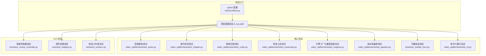

图表来源
- [conftest.py:1-11](file://tests/conftest.py#L1-L11)

章节来源
- [conftest.py:1-11](file://tests/conftest.py#L1-L11)
- [pyproject.toml:6-15](file://pyproject.toml#L6-L15)

## 核心组件
本节概述各模块的测试要点与策略。

- 音频处理（AudioExtractor）
  - 使用 unittest.mock.patch 模拟 subprocess.run 调用 ffprobe/ffmpeg
  - 验证 librosa 可用性检测、预检逻辑（RMS、静音比例）、时长获取与提取命令构造
  - 断言异常路径（ffprobe 失败、ffmpeg 非零退出码）

- 章节检测（ChapterDetector）
  - 通过 patch.object 替换 _call_llm/_llm_request，验证单段与分块检测、去重、回退到均匀切分
  - 解析 LLM JSON 响应（含 markdown fence、特殊字符清洗、时间范围校验）
  - 环境配置 SplitConfig.from_env 的解析与覆盖规则

- 视频切割（VideoCutter）
  - 使用 FFmpegSkill 与 FFmpegError 的 mock，验证 fast/precise 模式、关键帧容差回退、进度回调
  - 断言输出目录创建、子进程命令参数、异常抛出

- 转录引擎（Transcribe 与 Engines）
  - 使用 sys.modules 注入 faster_whisper 或 funasr 的 mock，验证 transcribe 输出结构与进度回调
  - 引擎注册表 create_engine、健康检查异常路径、ffprobe 辅助函数错误分支

- 字幕烧录（SubtitleBurner）
  - **新增** 验证 SRT 字幕烧录到视频的完整流程，包括输入验证、FFmpeg 命令构建、进度回调
  - 测试异常情况：无效字幕格式、FFmpeg 执行失败、输出路径权限问题

- 命令行接口（CLI）
  - **新增** 完整的命令行参数解析测试，包括主命令、子命令、选项验证
  - 测试错误处理：无效参数、配置文件缺失、运行时异常传播

- 流水线（Pipeline）
  - 对 precheck、transcribe、detect、validate、cut 各阶段打桩，验证成功路径、恢复模式、dry_run 成本估算

- GUI 控制器与工作者
  - ReviewController 状态机、修改标记、SRT 导出原子写入
  - TranscribeWorker 信号发射、QThread 集成、错误传播

章节来源
- [test_audio.py:1-253](file://video_splitter/tests/test_audio.py#L1-L253)
- [audio.py:1-171](file://video_splitter/extractor/audio.py#L1-L171)
- [test_chapter.py:1-348](file://video_splitter/tests/test_chapter.py#L1-L348)
- [chapter.py:1-200](file://video_splitter/analyzer/chapter.py#L1-L200)
- [test_cutter.py:1-197](file://video_splitter/tests/test_cutter.py#L1-L197)
- [cutter.py:1-98](file://video_splitter/splitter/cutter.py#L1-L98)
- [test_transcribe.py:1-242](file://video_splitter/tests/test_transcribe.py#L1-L242)
- [test_engines.py:1-111](file://video_splitter/tests/test_engines.py#L1-L111)
- [test_pipeline.py:1-229](file://video_splitter/tests/test_pipeline.py#L1-L229)
- [test_subtitle_burn.py:1-29](file://tests/test_subtitle_burn.py#L1-L29)
- [subtitle_burner.py:1-100](file://video_splitter/splitter/subtitle_burner.py#L1-L100)
- [test_cli.py:1-135](file://video_splitter/tests/test_cli.py#L1-L135)
- [cli.py:1-200](file://video_splitter/cli.py#L1-L200)
- [test_review_controller.py:1-255](file://tests/test_review_controller.py#L1-L255)
- [test_widgets.py:1-133](file://tests/test_widgets.py#L1-L133)
- [test_workers.py:1-165](file://tests/test_workers.py#L1-L165)

## 架构总览
下图展示从输入视频到输出片段的端到端流程，以及测试在各阶段的打桩点。

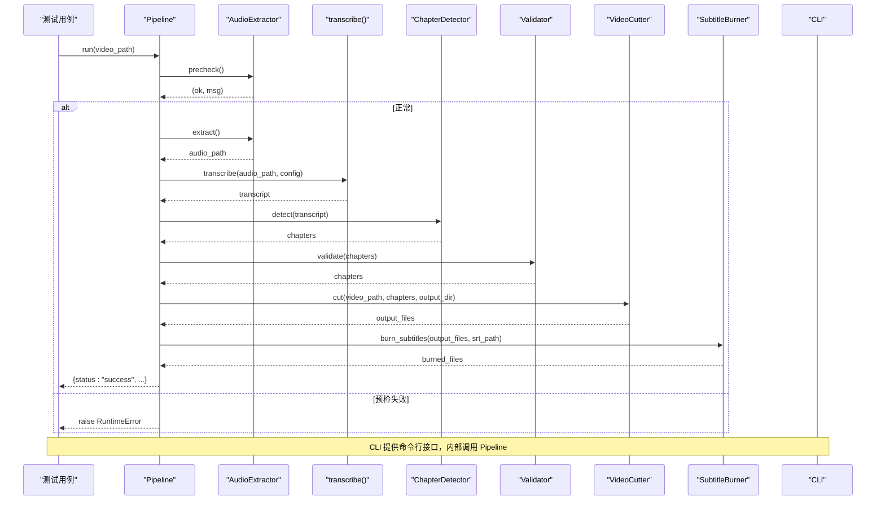

图表来源
- [test_pipeline.py:52-147](file://video_splitter/tests/test_pipeline.py#L52-L147)
- [audio.py:26-171](file://video_splitter/extractor/audio.py#L26-L171)
- [chapter.py:77-200](file://video_splitter/analyzer/chapter.py#L77-L200)
- [cutter.py:30-98](file://video_splitter/splitter/cutter.py#L30-L98)
- [subtitle_burner.py:1-100](file://video_splitter/splitter/subtitle_burner.py#L1-L100)
- [cli.py:1-200](file://video_splitter/cli.py#L1-L200)

## 详细组件分析

### 音频处理测试（AudioExtractor）
- 目标
  - 验证 librosa 可用性检测、预检（RMS、静音比例）、时长获取、WAV 提取命令构造与异常路径
- 关键策略
  - 使用 patch("subprocess.run") 模拟 ffprobe/ffmpeg 返回结果
  - 使用 patch("librosa.load") 控制采样数据以触发不同分支
  - 使用 tmp_path 提供临时文件路径
- 典型断言
  - 预检返回布尔与消息；时长解析为浮点数；提取返回 WAV 路径；异常类型与匹配信息

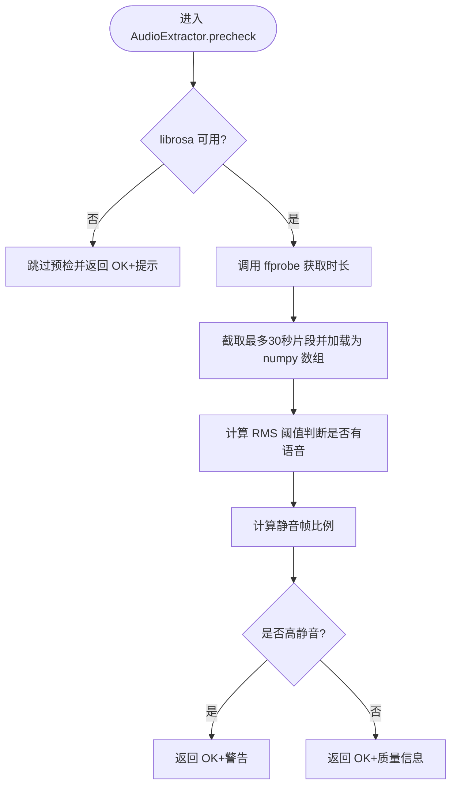

图表来源
- [audio.py:26-99](file://video_splitter/extractor/audio.py#L26-L99)
- [test_audio.py:40-179](file://video_splitter/tests/test_audio.py#L40-179)

章节来源
- [test_audio.py:17-102](file://video_splitter/tests/test_audio.py#L17-L102)
- [test_audio.py:104-179](file://video_splitter/tests/test_audio.py#L104-L179)
- [test_audio.py:181-253](file://video_splitter/tests/test_audio.py#L181-L253)
- [audio.py:12-171](file://video_splitter/extractor/audio.py#L12-L171)

### 章节检测测试（ChapterDetector）
- 目标
  - 验证单段与分块检测、JSON 解析健壮性、去重与回退到均匀切分
- 关键策略
  - patch.object(detector, "_call_llm"/"_llm_request") 控制 LLM 行为
  - 构造超长转录文本触发分块路径
  - 断言标题自动编号、时间戳格式、越界与非法范围异常
- 典型断言
  - 当 LLM 全部失败时回退到均匀切分；分块后去重保留更长标题；缺失字段自动填充

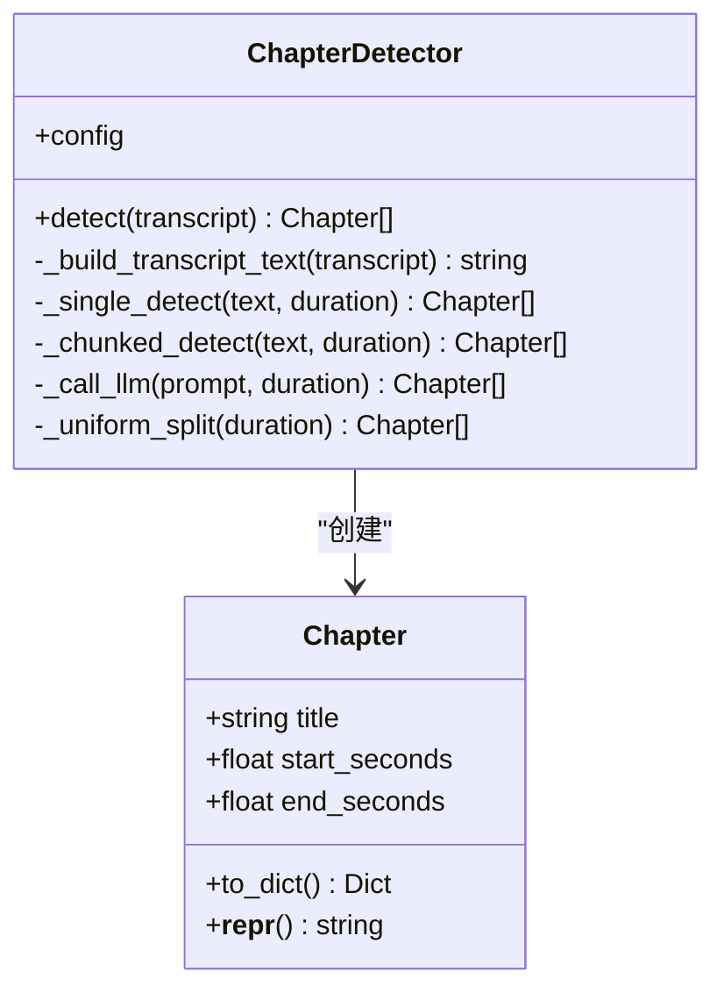

图表来源
- [chapter.py:18-41](file://video_splitter/analyzer/chapter.py#L18-L41)
- [chapter.py:43-200](file://video_splitter/analyzer/chapter.py#L43-L200)
- [test_chapter.py:85-107](file://video_splitter/tests/test_chapter.py#L85-L107)
- [test_chapter.py:109-213](file://video_splitter/tests/test_chapter.py#L109-L213)
- [test_chapter.py:215-310](file://video_splitter/tests/test_chapter.py#L215-L310)

章节来源
- [test_chapter.py:29-53](file://video_splitter/tests/test_chapter.py#L29-L53)
- [test_chapter.py:55-84](file://video_splitter/tests/test_chapter.py#L55-L84)
- [test_chapter.py:85-107](file://video_splitter/tests/test_chapter.py#L85-L107)
- [test_chapter.py:109-213](file://video_splitter/tests/test_chapter.py#L109-L213)
- [test_chapter.py:215-310](file://video_splitter/tests/test_chapter.py#L215-L310)
- [test_chapter.py:312-348](file://video_splitter/tests/test_chapter.py#L312-L348)
- [chapter.py:77-200](file://video_splitter/analyzer/chapter.py#L77-L200)

### 视频切割测试（VideoCutter）
- 目标
  - 验证 fast/precise 两种模式、关键帧容差回退、进度回调、输出目录创建与异常抛出
- 关键策略
  - patch("video_splitter.splitter.cutter.FFmpegSkill") 避免真实 FFmpeg 依赖
  - patch("subprocess.run") 模拟 ffmpeg/ffprobe 返回码与输出
  - 使用 MagicMock 替换内部方法以验证调用顺序与次数
- 典型断言
  - fast 模式下 ffmpeg 失败或时长偏差超过容差则回退 precise；precise 模式直接重编码；进度回调按片段数递增

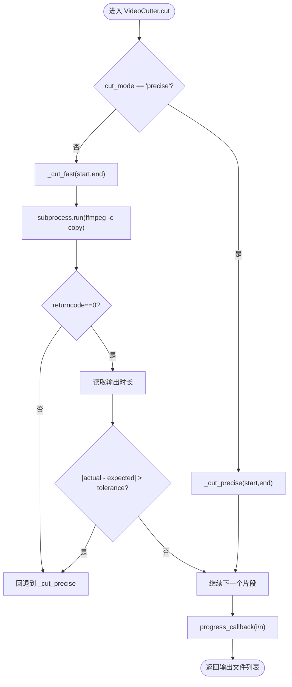

图表来源
- [cutter.py:30-98](file://video_splitter/splitter/cutter.py#L30-L98)
- [test_cutter.py:27-197](file://video_splitter/tests/test_cutter.py#L27-L197)

章节来源
- [test_cutter.py:17-197](file://video_splitter/tests/test_cutter.py#L17-L197)
- [cutter.py:22-98](file://video_splitter/splitter/cutter.py#L22-L98)

### 字幕烧录测试（SubtitleBurner）
- 目标
  - **新增** 验证 SRT 字幕烧录到视频的完整流程，包括输入验证、FFmpeg 命令构建、进度回调
- 关键策略
  - 使用 patch("subprocess.run") 模拟 FFmpeg 执行过程
  - 验证 SRT 文件格式检查和有效性验证
  - 测试各种异常场景：无效字幕、FFmpeg 失败、输出路径问题
- 典型断言
  - 有效 SRT 文件成功烧录；无效格式抛出异常；FFmpeg 执行失败正确处理

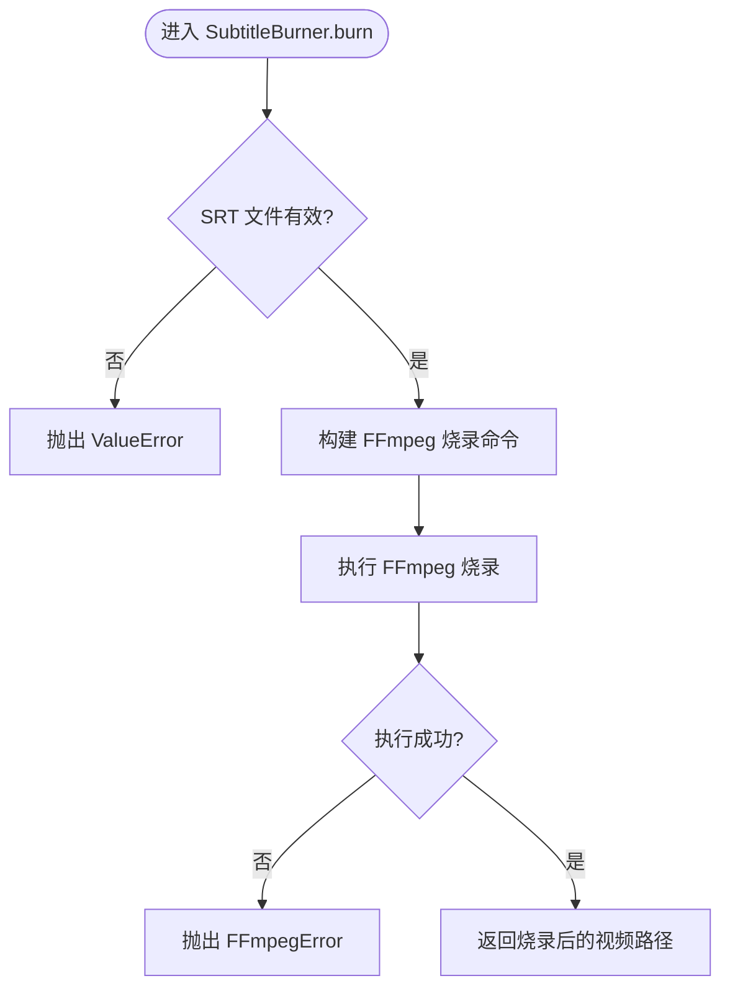

图表来源
- [subtitle_burner.py:1-100](file://video_splitter/splitter/subtitle_burner.py#L1-L100)
- [test_subtitle_burn.py:1-29](file://tests/test_subtitle_burn.py#L1-L29)

章节来源
- [test_subtitle_burn.py:1-29](file://tests/test_subtitle_burn.py#L1-L29)
- [subtitle_burner.py:1-100](file://video_splitter/splitter/subtitle_burner.py#L1-L100)

### 命令行接口测试（CLI）
- 目标
  - **新增** 完整的命令行参数解析测试，包括主命令、子命令、选项验证
- 关键策略
  - 使用 click.testing.CliRunner 模拟命令行调用
  - 测试各种参数组合和错误场景
  - 验证配置加载和错误处理机制
- 典型断言
  - 有效参数正确执行；无效参数显示帮助信息；配置文件缺失时给出明确错误

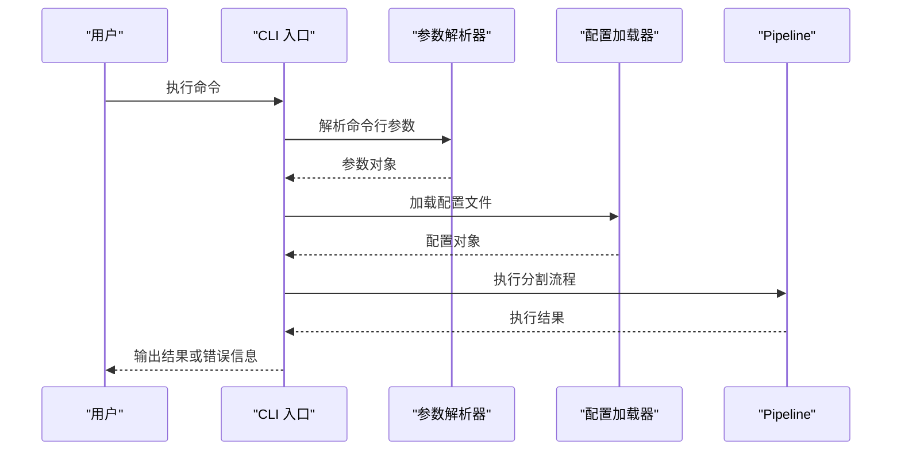

图表来源
- [cli.py:1-200](file://video_splitter/cli.py#L1-L200)
- [test_cli.py:1-135](file://video_splitter/tests/test_cli.py#L1-L135)

章节来源
- [test_cli.py:1-135](file://video_splitter/tests/test_cli.py#L1-L135)
- [cli.py:1-200](file://video_splitter/cli.py#L1-L200)

### 转录引擎测试（Transcribe 与 Engines）
- 目标
  - 验证 SRT 生成、token 估算、transcribe 输出结构、进度回调；引擎注册表与健康检查异常路径
- 关键策略
  - 使用 patch.dict(sys.modules, {"faster_whisper": mock_module}) 注入 WhisperModel 的 mock
  - 使用 patch("subprocess.run") 模拟 ffprobe 输出与异常
  - 断言 to_srt 序号、时间戳格式、空分段处理
- 典型断言
  - transcribe 返回 language/duration/segments；进度回调值在 [0,1]；未知引擎抛 ValueError；健康检查捕获非 ImportError 异常

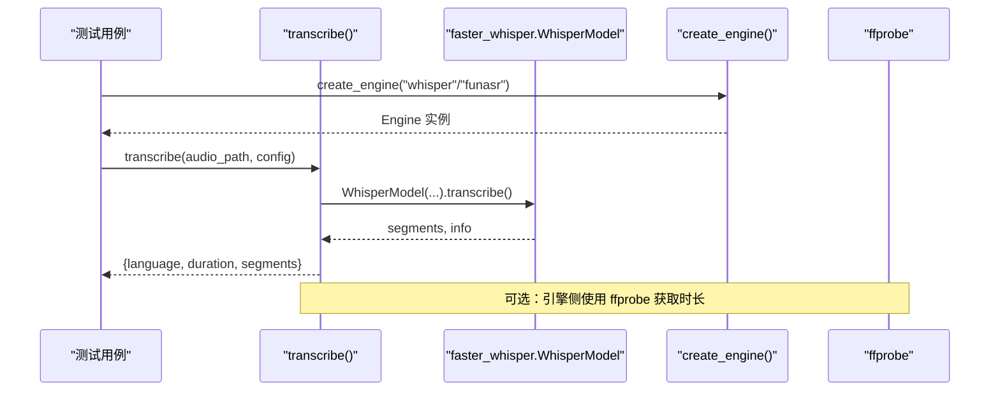

图表来源
- [test_transcribe.py:105-242](file://video_splitter/tests/test_transcribe.py#L105-L242)
- [test_engines.py:72-111](file://video_splitter/tests/test_engines.py#L72-L111)
- [engines.py:1-111](file://video_splitter/extractor/engines.py#L1-L111)

章节来源
- [test_transcribe.py:17-103](file://video_splitter/tests/test_transcribe.py#L17-L103)
- [test_transcribe.py:105-242](file://video_splitter/tests/test_transcribe.py#L105-L242)
- [test_engines.py:22-70](file://video_splitter/tests/test_engines.py#L22-L70)
- [test_engines.py:72-111](file://video_splitter/tests/test_engines.py#L72-L111)

### 流水线测试（Pipeline）
- 目标
  - 验证完整流程成功路径、预检失败异常、恢复模式（跳过转录/章节）、dry_run 成本估算
- 关键策略
  - 对各子阶段使用 MagicMock 打桩；patch("video_splitter.pipeline.transcribe"/estimate_tokens/to_srt)
  - 使用临时 JSON 文件模拟已存在的转录与章节
- 典型断言
  - resume=True 时不重复调用 transcribe/detect；dry_run 根据 token 预算返回单次或多分块调用计数

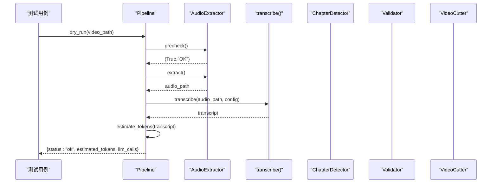

图表来源
- [test_pipeline.py:150-229](file://video_splitter/tests/test_pipeline.py#L150-L229)
- [test_pipeline.py:52-147](file://video_splitter/tests/test_pipeline.py#L52-L147)

章节来源
- [test_pipeline.py:52-147](file://video_splitter/tests/test_pipeline.py#L52-L147)
- [test_pipeline.py:150-229](file://video_splitter/tests/test_pipeline.py#L150-L229)

### GUI 控制器与工作者测试
- 审查控制器（ReviewController）
  - 验证加载转录、进度恢复、导航（next/prev/jump_to）、保存修正、SRT 导出原子写入与异常传播
- 控件冒烟测试（SubtitlePanel/VideoPlayerWidget/StatusBarWidget）
  - 验证实例化无崩溃、信号连接、UI 状态更新
- 转录工作者（TranscribeWorker）
  - 验证信号发射（finished/progress/error）、默认引擎、自定义引擎、QThread 集成

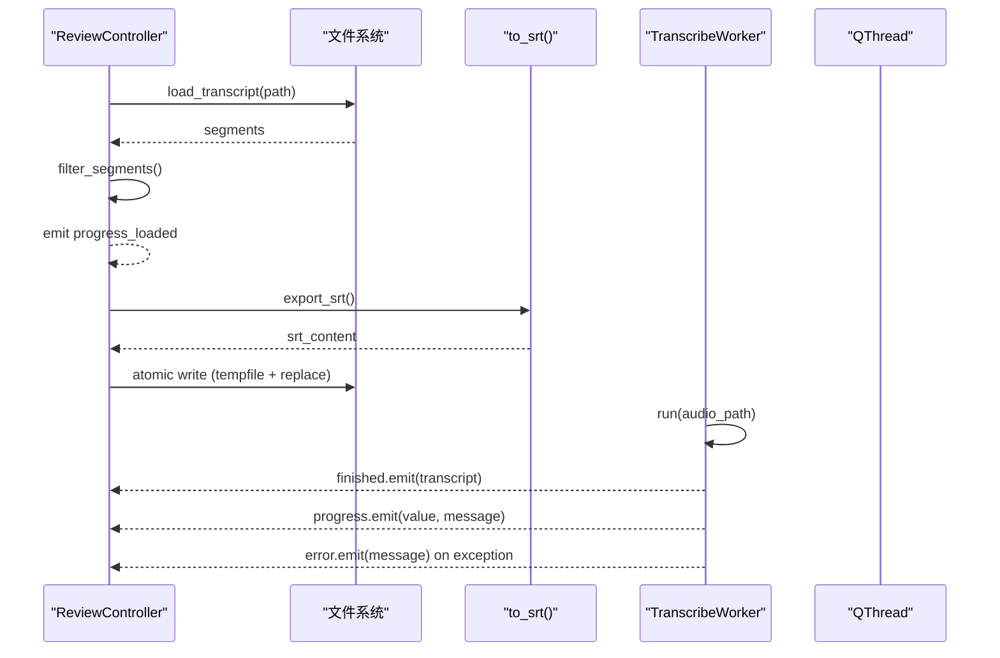

图表来源
- [test_review_controller.py:24-255](file://tests/test_review_controller.py#L24-L255)
- [test_workers.py:30-165](file://tests/test_workers.py#L30-L165)

章节来源
- [test_review_controller.py:24-255](file://tests/test_review_controller.py#L24-L255)
- [test_widgets.py:14-133](file://tests/test_widgets.py#L14-L133)
- [test_workers.py:30-165](file://tests/test_workers.py#L30-L165)

## 依赖关系分析
- 测试与源码耦合
  - 通过 sys.path 注入项目根目录，统一导入路径
  - 大量使用 unittest.mock.patch/patch.object/MagicMock 隔离外部依赖（FFmpeg、LLM、Whisper/FunASR）
- 外部依赖
  - FFmpeg/ffprobe：通过 subprocess.run 模拟返回码与输出
  - LLM API：通过 patch.object 替换 _llm_request 或直接 patch("_call_llm")
  - Whisper/FunASR：通过 sys.modules 注入 mock 模块，避免真实模型加载
- 潜在循环依赖
  - 未见明显循环导入；模块间通过显式 import 与工厂函数解耦

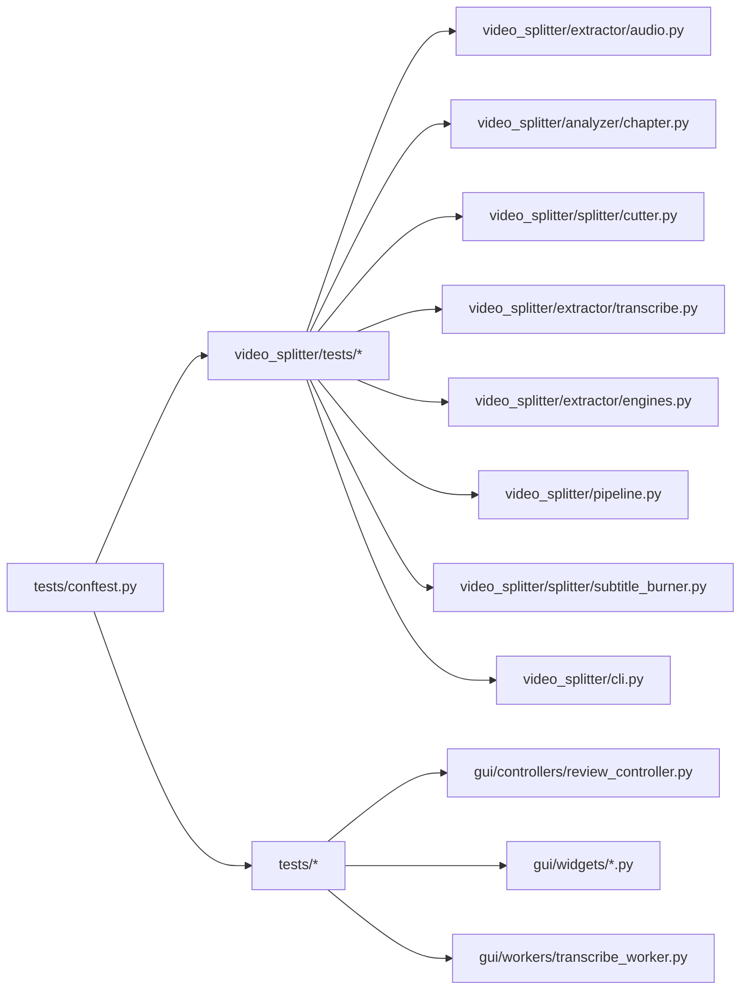

图表来源
- [conftest.py:1-11](file://tests/conftest.py#L1-L11)
- [test_audio.py:1-20](file://video_splitter/tests/test_audio.py#L1-L20)
- [test_chapter.py:1-15](file://video_splitter/tests/test_chapter.py#L1-L15)
- [test_cutter.py:1-15](file://video_splitter/tests/test_cutter.py#L1-L15)
- [test_transcribe.py:1-15](file://video_splitter/tests/test_transcribe.py#L1-L15)
- [test_engines.py:1-20](file://video_splitter/tests/test_engines.py#L1-L20)
- [test_pipeline.py:1-20](file://video_splitter/tests/test_pipeline.py#L1-L20)
- [test_subtitle_burn.py:1-20](file://tests/test_subtitle_burn.py#L1-L20)
- [test_cli.py:1-20](file://video_splitter/tests/test_cli.py#L1-L20)
- [test_review_controller.py:1-20](file://tests/test_review_controller.py#L1-L20)
- [test_widgets.py:1-20](file://tests/test_widgets.py#L1-L20)
- [test_workers.py:1-20](file://tests/test_workers.py#L1-L20)

章节来源
- [conftest.py:1-11](file://tests/conftest.py#L1-L11)

## 性能与稳定性考量
- 测试执行效率
  - 使用 mock 避免真实 I/O 与重型模型加载，显著缩短运行时间
  - 将耗时操作（如长视频转录）限制在最小必要范围
- 稳定性保障
  - 对异常路径（网络超时、磁盘满、权限不足）进行断言，确保错误可观测
  - 对边界条件（空转录、超长转录、关键帧偏差）进行覆盖
- 建议
  - 对慢测试添加 @pytest.mark.slow 并按需选择执行
  - 对需要外部依赖的测试添加 @pytest.mark.integration，并在 CI 中按需启用

[本节为通用指导，无需列出具体文件来源]

## 故障排查指南
- 常见问题
  - 找不到 FFmpeg/ffprobe：确认系统 PATH 或 CI 安装步骤；测试中使用 patch 规避
  - LLM 不可用：确保 patch("_llm_request") 或 patch("_call_llm") 生效；必要时模拟重试与 sleep
  - Whisper/FunASR 导入缓慢：使用 sys.modules 注入 mock，避免真实导入
  - GUI 线程问题：在 QThread 测试中确保事件循环 processEvents 被调用
  - 字幕烧录失败：检查 SRT 文件格式和 FFmpeg 命令参数
  - CLI 参数解析错误：验证 click 装饰器和参数定义
- 定位技巧
  - 使用 pytest -v --tb=short 查看短回溯
  - 使用 -k 筛选特定测试类或函数
  - 使用 --cov 与 --cov-report=term 快速定位未覆盖行

章节来源
- [test.yml:24-43](file://.github/workflows/test.yml#L24-L43)
- [pyproject.toml:6-15](file://pyproject.toml#L6-L15)

## 结论
本项目采用系统化、分层化的单元测试策略，围绕核心模块构建稳健的测试套件。通过广泛使用 mock 与 fixture，有效隔离外部依赖，保证测试的可重复性与执行效率。结合 pytest 配置与 CI 工作流，实现了覆盖率门槛与报告生成，有助于持续维护代码质量。

**更新** 本次更新显著增强了测试基础设施，新增了字幕烧录功能测试、分割组件测试、章节处理能力测试和命令行接口测试，进一步提升了代码质量和可靠性保障。

[本节为总结，无需列出具体文件来源]

## 附录

### 使用 pytest 进行单元测试
- 基本运行
  - 在项目根目录执行：python -m pytest tests/ video_splitter/tests/ -v
- Fixture 使用
  - 会话级 QApplication：tests/test_widgets.py 中的 qapp fixture
  - 组件级 detector_15min/detector_10min：video_splitter/tests/test_chapter.py
- 参数化测试
  - 可使用 @pytest.mark.parametrize 扩展多组输入输出断言（示例见各模块的时间戳/配置解析）
- 异步测试
  - 当前测试以同步为主；如需异步，可使用 pytest-asyncio 并在测试函数前加 @pytest.mark.asyncio

章节来源
- [test_widgets.py:14-22](file://tests/test_widgets.py#L14-L22)
- [test_chapter.py:17-27](file://video_splitter/tests/test_chapter.py#L17-L27)

### 模拟外部依赖的策略
- FFmpeg/ffprobe
  - patch("subprocess.run") 控制 returncode/stdout/stderr
- LLM API
  - patch.object(detector, "_call_llm") 或 patch.object(detector, "_llm_request")
- Whisper/FunASR
  - patch.dict(sys.modules, {"faster_whisper": mock_module}) 注入 mock 模块
- GUI 线程
  - 使用 QThread 与 app.processEvents() 驱动事件循环
- CLI 测试
  - 使用 click.testing.CliRunner 模拟命令行环境

章节来源
- [test_audio.py:59-102](file://video_splitter/tests/test_audio.py#L59-L102)
- [test_chapter.py:276-310](file://video_splitter/tests/test_chapter.py#L276-L310)
- [test_transcribe.py:108-117](file://video_splitter/tests/test_transcribe.py#L108-L117)
- [test_workers.py:121-165](file://tests/test_workers.py#L121-L165)
- [test_cli.py:1-135](file://video_splitter/tests/test_cli.py#L1-L135)

### 错误处理与异常场景
- 常见异常类型
  - FileNotFoundError（文件不存在）
  - RuntimeError（外部工具失败、API 不可用）
  - FFmpegError（精确切割失败）
  - ValueError（JSON 解析/时间范围无效）
  - ClickException（CLI 参数错误）
- 断言方式
  - 使用 pytest.raises 与 match 正则匹配错误信息片段

章节来源
- [test_audio.py:74-102](file://video_splitter/tests/test_audio.py#L74-L102)
- [test_cutter.py:100-114](file://video_splitter/tests/test_cutter.py#L100-L114)
- [test_chapter.py:250-264](file://video_splitter/tests/test_chapter.py#L250-L264)
- [test_engines.py:32-70](file://video_splitter/tests/test_engines.py#L32-L70)
- [test_subtitle_burn.py:1-29](file://tests/test_subtitle_burn.py#L1-L29)
- [test_cli.py:1-135](file://video_splitter/tests/test_cli.py#L1-L135)

### 覆盖率要求与报告生成
- 覆盖率配置
  - source 包含 video_splitter 与 gui
  - omit 排除测试文件与第三方 skill 测试
  - fail_under = 50
- CI 报告
  - 生成 XML 与终端报告，上传至 Codecov

章节来源
- [pyproject.toml:17-28](file://pyproject.toml#L17-L28)
- [test.yml:35-43](file://.github/workflows/test.yml#L35-L43)

### 实际测试示例与调试技巧
- 示例参考
  - 音频预检与提取：video_splitter/tests/test_audio.py
  - 章节检测与解析：video_splitter/tests/test_chapter.py
  - 切割模式与回退：video_splitter/tests/test_cutter.py
  - 转录与引擎：video_splitter/tests/test_transcribe.py、video_splitter/tests/test_engines.py
  - 字幕烧录：tests/test_subtitle_burn.py
  - 命令行接口：video_splitter/tests/test_cli.py
  - 流水线编排：video_splitter/tests/test_pipeline.py
  - GUI 控制器与工作者：tests/test_review_controller.py、tests/test_workers.py
- 调试技巧
  - 使用 -s 打印 stdout
  - 使用 --capture=no 禁用捕获以便实时观察
  - 使用 pdb 或 breakpoint() 在测试中插入断点

章节来源
- [test_audio.py:1-253](file://video_splitter/tests/test_audio.py#L1-L253)
- [test_chapter.py:1-348](file://video_splitter/tests/test_chapter.py#L1-L348)
- [test_cutter.py:1-197](file://video_splitter/tests/test_cutter.py#L1-L197)
- [test_transcribe.py:1-242](file://video_splitter/tests/test_transcribe.py#L1-L242)
- [test_engines.py:1-111](file://video_splitter/tests/test_engines.py#L1-L111)
- [test_subtitle_burn.py:1-29](file://tests/test_subtitle_burn.py#L1-L29)
- [test_cli.py:1-135](file://video_splitter/tests/test_cli.py#L1-L135)
- [test_pipeline.py:1-229](file://video_splitter/tests/test_pipeline.py#L1-L229)
- [test_review_controller.py:1-255](file://tests/test_review_controller.py#L1-L255)
- [test_workers.py:1-165](file://tests/test_workers.py#L1-L165)