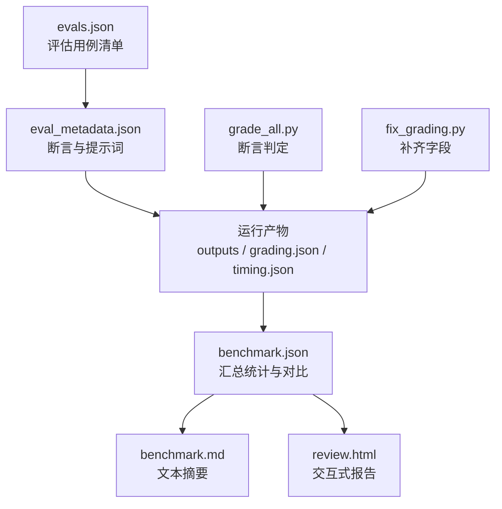
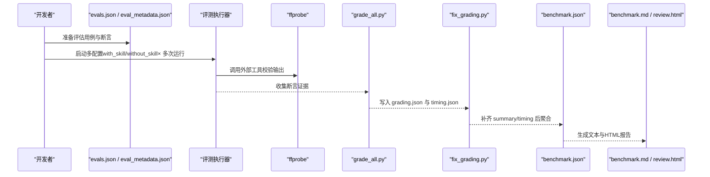
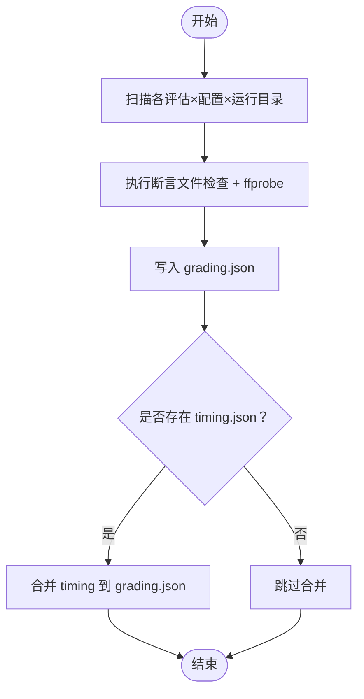
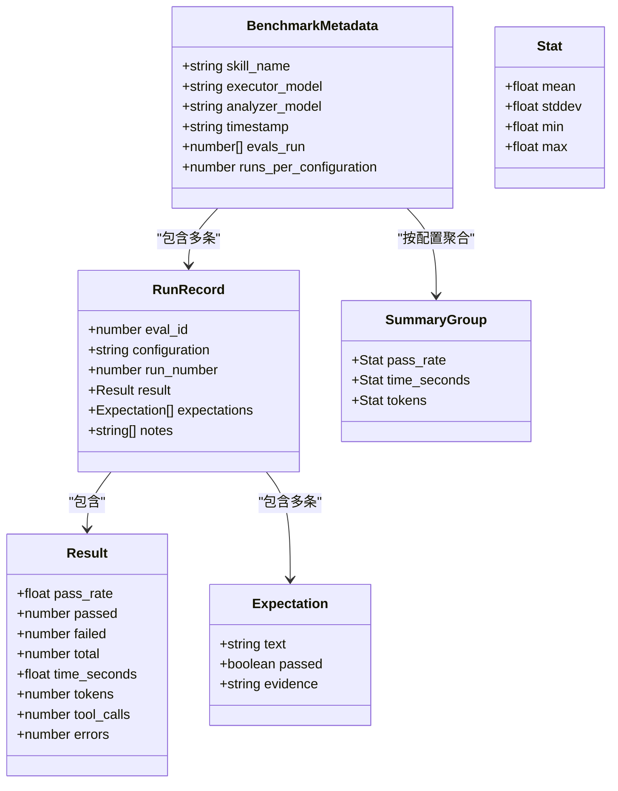
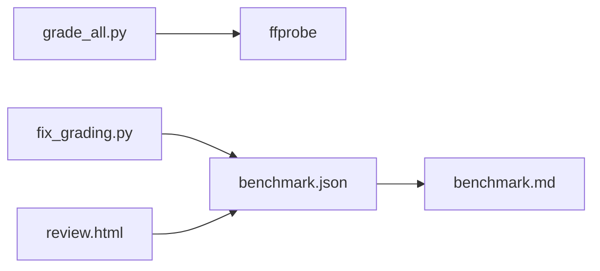

# 性能基准测试

<cite>
**本文引用的文件**   
- [benchmark.json](file://ffmpeg-video-workspace/iteration-1/benchmark.json)
- [evals.json](file://ffmpeg-video-workspace/evals.json)
- [benchmark.md](file://ffmpeg-video-workspace/iteration-1/benchmark.md)
- [grade_all.py](file://ffmpeg-video-workspace/grade_all.py)
- [fix_grading.py](file://ffmpeg-video-workspace/fix_grading.py)
- [review.html](file://ffmpeg-video-workspace/iteration-1/review.html)
- [eval_metadata.json（转换格式）](file://ffmpeg-video-workspace/iteration-1/eval-convert-format/eval_metadata.json)
- [eval_metadata.json（视频缩放）](file://ffmpeg-video-workspace/iteration-1/eval-resize-video/eval_metadata.json)
- [eval_metadata.json（视频信息）](file://ffmpeg-video-workspace/iteration-1/eval-video-info/eval_metadata.json)
- [grading.json（转换格式-with_skill-run-1）](file://ffmpeg-video-workspace/iteration-1/eval-convert-format/with_skill/run-1/grading.json)
- [timing.json（转换格式-with_skill-run-1）](file://ffmpeg-video-workspace/iteration-1/eval-convert-format/with_skill/run-1/timing.json)
- [grading.json（转换格式-without_skill-run-1）](file://ffmpeg-video-workspace/iteration-1/eval-convert-format/without_skill/run-1/grading.json)
- [timing.json（转换格式-without_skill-run-1）](file://ffmpeg-video-workspace/iteration-1/eval-convert-format/without_skill/run-1/timing.json)
- [grading.json（视频缩放-with_skill-run-1）](file://ffmpeg-video-workspace/iteration-1/eval-resize-video/with_skill/run-1/grading.json)
- [timing.json（视频缩放-with_skill-run-1）](file://ffmpeg-video-workspace/iteration-1/eval-resize-video/with_skill/run-1/timing.json)
- [grading.json（视频信息-with_skill-run-1）](file://ffmpeg-video-workspace/iteration-1/eval-video-info/with_skill/run-1/grading.json)
- [timing.json（视频信息-with_skill-run-1）](file://ffmpeg-video-workspace/iteration-1/eval-video-info/with_skill/run-1/timing.json)
</cite>

## 目录
1. [简介](#简介)
2. [项目结构](#项目结构)
3. [核心组件](#核心组件)
4. [架构总览](#架构总览)
5. [详细组件分析](#详细组件分析)
6. [依赖关系分析](#依赖关系分析)
7. [性能考量](#性能考量)
8. [故障排查指南](#故障排查指南)
9. [结论](#结论)
10. [附录](#附录)

## 简介
本文件面向“视频处理性能基准测试”，聚焦以下目标：
- 说明如何设计并执行视频处理性能测试，覆盖时间、内存等关键指标。
- 详解 benchmark.json 与 evals.json 的结构与用法。
- 展示不同算法/配置（如 with_skill 与 without_skill）的对比方法。
- 提供性能回归检测与监控策略。
- 指导结果分析与报告生成。
- 给出性能优化建议与最佳实践。

## 项目结构
与性能基准相关的核心目录与文件位于 ffmpeg-video-workspace 下，主要包括：
- 评估定义与元数据：evals.json、各 eval 的 eval_metadata.json
- 运行产物：每个 eval × 每种配置 × 每次运行的 outputs、grading.json、timing.json
- 汇总与可视化：benchmark.json、benchmark.md、review.html
- 批处理脚本：grade_all.py、fix_grading.py

图表来源
- [evals.json:1-24](file://ffmpeg-video-workspace/evals.json#L1-L24)
- [eval_metadata.json（转换格式）:1-24](file://ffmpeg-video-workspace/iteration-1/eval-convert-format/eval_metadata.json#L1-L24)
- [eval_metadata.json（视频缩放）:1-20](file://ffmpeg-video-workspace/iteration-1/eval-resize-video/eval_metadata.json#L1-L20)
- [eval_metadata.json（视频信息）:1-28](file://ffmpeg-video-workspace/iteration-1/eval-video-info/eval_metadata.json#L1-L28)
- [grading.json（转换格式-without_skill-run-1）:1-35](file://ffmpeg-video-workspace/iteration-1/eval-convert-format/without_skill/run-1/grading.json#L1-L35)
- [timing.json（转换格式-without_skill-run-1）:1-6](file://ffmpeg-video-workspace/iteration-1/eval-convert-format/without_skill/run-1/timing.json#L1-L6)
- [benchmark.json:1-293](file://ffmpeg-video-workspace/iteration-1/benchmark.json#L1-L293)
- [benchmark.md:1-13](file://ffmpeg-video-workspace/iteration-1/benchmark.md#L1-L13)
- [review.html:1151-1305](file://ffmpeg-video-workspace/iteration-1/review.html#L1151-L1305)
- [grade_all.py:1-179](file://ffmpeg-video-workspace/grade_all.py#L1-L179)
- [fix_grading.py:1-46](file://ffmpeg-video-workspace/fix_grading.py#L1-L46)

章节来源
- [evals.json:1-24](file://ffmpeg-video-workspace/evals.json#L1-L24)
- [eval_metadata.json（转换格式）:1-24](file://ffmpeg-video-workspace/iteration-1/eval-convert-format/eval_metadata.json#L1-L24)
- [eval_metadata.json（视频缩放）:1-20](file://ffmpeg-video-workspace/iteration-1/eval-resize-video/eval_metadata.json#L1-L20)
- [eval_metadata.json（视频信息）:1-28](file://ffmpeg-video-workspace/iteration-1/eval-video-info/eval_metadata.json#L1-L28)
- [benchmark.json:1-293](file://ffmpeg-video-workspace/iteration-1/benchmark.json#L1-L293)
- [benchmark.md:1-13](file://ffmpeg-video-workspace/iteration-1/benchmark.md#L1-L13)
- [review.html:1151-1305](file://ffmpeg-video-workspace/iteration-1/review.html#L1151-L1305)
- [grade_all.py:1-179](file://ffmpeg-video-workspace/grade_all.py#L1-L179)
- [fix_grading.py:1-46](file://ffmpeg-video-workspace/fix_grading.py#L1-L46)

## 核心组件
- 评估定义层
  - evals.json：声明技能名与评估用例列表（id、prompt、expected_output、files）。
  - eval_metadata.json：为每个评估用例补充断言清单与提示词，便于自动化执行与验证。
- 执行与度量层
  - 运行产物：每个 run 包含 outputs（实际输出文件）、grading.json（断言结果与摘要）、timing.json（耗时与 token 计数）。
  - grade_all.py：基于 ffprobe 与文件系统检查对输出进行断言判定，产出 grading.json。
  - fix_grading.py：补齐 grading.json 中 summary 与 timing 字段，确保后续聚合脚本可用。
- 汇总与可视化层
  - benchmark.json：按配置聚合 pass_rate、time_seconds、tokens 等指标，并计算 delta。
  - benchmark.md：生成简洁的文本摘要表格。
  - review.html：读取 benchmark.json，渲染交互式对比表与逐条断言明细。

章节来源
- [evals.json:1-24](file://ffmpeg-video-workspace/evals.json#L1-L24)
- [eval_metadata.json（转换格式）:1-24](file://ffmpeg-video-workspace/iteration-1/eval-convert-format/eval_metadata.json#L1-L24)
- [eval_metadata.json（视频缩放）:1-20](file://ffmpeg-video-workspace/iteration-1/eval-resize-video/eval_metadata.json#L1-L20)
- [eval_metadata.json（视频信息）:1-28](file://ffmpeg-video-workspace/iteration-1/eval-video-info/eval_metadata.json#L1-L28)
- [grade_all.py:1-179](file://ffmpeg-video-workspace/grade_all.py#L1-L179)
- [fix_grading.py:1-46](file://ffmpeg-video-workspace/fix_grading.py#L1-L46)
- [benchmark.json:1-293](file://ffmpeg-video-workspace/iteration-1/benchmark.json#L1-L293)
- [benchmark.md:1-13](file://ffmpeg-video-workspace/iteration-1/benchmark.md#L1-L13)
- [review.html:1151-1305](file://ffmpeg-video-workspace/iteration-1/review.html#L1151-L1305)

## 架构总览
下图展示了从评估定义到最终报告的端到端流程，以及关键数据文件的流转关系。

图表来源
- [evals.json:1-24](file://ffmpeg-video-workspace/evals.json#L1-L24)
- [eval_metadata.json（转换格式）:1-24](file://ffmpeg-video-workspace/iteration-1/eval-convert-format/eval_metadata.json#L1-L24)
- [eval_metadata.json（视频缩放）:1-20](file://ffmpeg-video-workspace/iteration-1/eval-resize-video/eval_metadata.json#L1-L20)
- [eval_metadata.json（视频信息）:1-28](file://ffmpeg-video-workspace/iteration-1/eval-video-info/eval_metadata.json#L1-L28)
- [grade_all.py:1-179](file://ffmpeg-video-workspace/grade_all.py#L1-L179)
- [fix_grading.py:1-46](file://ffmpeg-video-workspace/fix_grading.py#L1-L46)
- [benchmark.json:1-293](file://ffmpeg-video-workspace/iteration-1/benchmark.json#L1-L293)
- [benchmark.md:1-13](file://ffmpeg-video-workspace/iteration-1/benchmark.md#L1-L13)
- [review.html:1151-1305](file://ffmpeg-video-workspace/iteration-1/review.html#L1151-L1305)

## 详细组件分析

### 评估定义：evals.json 与 eval_metadata.json
- evals.json
  - 作用：集中管理评估用例的基本信息（id、prompt、expected_output、files），作为评测集入口。
  - 关键字段：skill_name、evals[].id、evals[].prompt、evals[].expected_output、evals[].files。
- eval_metadata.json（每个评估一个）
  - 作用：细化断言清单与提示词，驱动自动化执行与验证。
  - 关键字段：eval_id、eval_name、prompt、assertions[].name、assertions[].description。

章节来源
- [evals.json:1-24](file://ffmpeg-video-workspace/evals.json#L1-L24)
- [eval_metadata.json（转换格式）:1-24](file://ffmpeg-video-workspace/iteration-1/eval-convert-format/eval_metadata.json#L1-L24)
- [eval_metadata.json（视频缩放）:1-20](file://ffmpeg-video-workspace/iteration-1/eval-resize-video/eval_metadata.json#L1-L20)
- [eval_metadata.json（视频信息）:1-28](file://ffmpeg-video-workspace/iteration-1/eval-video-info/eval_metadata.json#L1-L28)

### 断言与评分：grade_all.py 与 fix_grading.py
- grade_all.py
  - 功能：遍历各评估与配置组合，调用 ffprobe 与文件系统检查，生成 grading.json。
  - 典型断言：输出文件存在性、有效性（可被 ffprobe 解析）、编码格式、分辨率、JSON 字段完整性等。
- fix_grading.py
  - 功能：为 grading.json 补齐 summary（pass_rate/passed/failed/total）与 timing 字段，保证后续聚合脚本稳定消费。

图表来源
- [grade_all.py:1-179](file://ffmpeg-video-workspace/grade_all.py#L1-L179)
- [fix_grading.py:1-46](file://ffmpeg-video-workspace/fix_grading.py#L1-L46)
- [grading.json（转换格式-without_skill-run-1）:1-35](file://ffmpeg-video-workspace/iteration-1/eval-convert-format/without_skill/run-1/grading.json#L1-L35)
- [timing.json（转换格式-without_skill-run-1）:1-6](file://ffmpeg-video-workspace/iteration-1/eval-convert-format/without_skill/run-1/timing.json#L1-L6)

章节来源
- [grade_all.py:1-179](file://ffmpeg-video-workspace/grade_all.py#L1-L179)
- [fix_grading.py:1-46](file://ffmpeg-video-workspace/fix_grading.py#L1-L46)
- [grading.json（转换格式-without_skill-run-1）:1-35](file://ffmpeg-video-workspace/iteration-1/eval-convert-format/without_skill/run-1/grading.json#L1-L35)
- [timing.json（转换格式-without_skill-run-1）:1-6](file://ffmpeg-video-workspace/iteration-1/eval-convert-format/without_skill/run-1/timing.json#L1-L6)

### 汇总与报告：benchmark.json、benchmark.md、review.html
- benchmark.json
  - 结构要点：
    - metadata：记录 skill_name、executor_model、analyzer_model、timestamp、evals_run、runs_per_configuration 等。
    - runs：每条记录对应一次运行，包含 eval_id、configuration、run_number、result（含 pass_rate/time_seconds/tokens/errors 等）、expectations、notes。
    - run_summary：按 configuration 聚合 pass_rate、time_seconds、tokens 的均值/标准差/极值，并提供 delta 对比。
  - 用途：作为统一的数据源，供文本与 HTML 报告消费。
- benchmark.md
  - 内容：以表格形式呈现 Pass Rate、Time、Tokens 的均值与标准差，以及 Delta。
- review.html
  - 能力：读取 benchmark.json，动态渲染对比表、逐评估明细、逐断言通过情况，并对正负变化着色。

图表来源
- [benchmark.json:1-293](file://ffmpeg-video-workspace/iteration-1/benchmark.json#L1-L293)
- [benchmark.md:1-13](file://ffmpeg-video-workspace/iteration-1/benchmark.md#L1-L13)
- [review.html:1151-1305](file://ffmpeg-video-workspace/iteration-1/review.html#L1151-L1305)

章节来源
- [benchmark.json:1-293](file://ffmpeg-video-workspace/iteration-1/benchmark.json#L1-L293)
- [benchmark.md:1-13](file://ffmpeg-video-workspace/iteration-1/benchmark.md#L1-L13)
- [review.html:1151-1305](file://ffmpeg-video-workspace/iteration-1/review.html#L1151-L1305)

### 时间、内存等性能指标的测量与处理
- 时间指标
  - 采集位置：timing.json（duration_ms、total_duration_seconds、total_tokens）。
  - 聚合方式：benchmark.json 的 run.result.time_seconds 与 run_summary.time_seconds 统计。
- 内存指标
  - 现状：当前仓库未内置内存采集逻辑；如需纳入，可在运行阶段注入系统级探针（例如在操作系统层面采样进程 RSS/VMS），并将结果追加至 timing.json 或新增 memory.json，随后扩展聚合逻辑。
- 其他指标
  - Tokens：由 timing.json 的 total_tokens 提供，用于衡量模型调用成本（若适用）。
  - 错误率：run.result.errors 可用于统计崩溃/异常次数。

章节来源
- [timing.json（转换格式-without_skill-run-1）:1-6](file://ffmpeg-video-workspace/iteration-1/eval-convert-format/without_skill/run-1/timing.json#L1-L6)
- [timing.json（转换格式-with_skill-run-1）:1-6](file://ffmpeg-video-workspace/iteration-1/eval-convert-format/with_skill/run-1/timing.json#L1-L6)
- [timing.json（视频缩放-with_skill-run-1）:1-6](file://ffmpeg-video-workspace/iteration-1/eval-resize-video/with_skill/run-1/timing.json#L1-L6)
- [timing.json（视频信息-with_skill-run-1）:1-6](file://ffmpeg-video-workspace/iteration-1/eval-video-info/with_skill/run-1/timing.json#L1-L6)
- [benchmark.json:1-293](file://ffmpeg-video-workspace/iteration-1/benchmark.json#L1-L293)

### 不同算法与配置的对比测试方法
- 配置维度
  - with_skill：使用封装好的 FFmpeg Skill 执行任务。
  - without_skill：直接调用底层工具链（如命令行）执行相同任务。
- 对比方式
  - 在 benchmark.json 的 run_summary 中，分别统计两种配置的 pass_rate、time_seconds、tokens，并在 delta 列显示差异。
  - 借助 review.html 的交互视图，快速定位某项评估在不同配置下的表现差异。

章节来源
- [benchmark.json:1-293](file://ffmpeg-video-workspace/iteration-1/benchmark.json#L1-L293)
- [review.html:1151-1305](file://ffmpeg-video-workspace/iteration-1/review.html#L1151-L1305)

### 性能回归检测与监控策略
- 基线保存
  - 将某次稳定版本的 benchmark.json 作为基线存档（例如提交到版本库或对象存储）。
- 阈值告警
  - 针对关键指标（如 time_seconds 均值、pass_rate）设定阈值，当新运行结果相对基线出现显著退化时触发告警。
- 持续集成
  - 在 CI 流水线中自动执行评估、生成 benchmark.json 并与基线比对，失败则阻断合并。
- 可视化追踪
  - 利用 review.html 定期生成报告，观察趋势与异常点。

[本节为通用策略说明，不直接分析具体文件]

### 基准测试结果的分析与报告生成
- 文本报告
  - benchmark.md 提供简洁的指标对比表，适合快速审阅。
- 交互式报告
  - review.html 支持按评估维度与断言维度查看细节，并对正负变化高亮显示。
- 自动化生成
  - 建议在 CI 中自动运行评估、生成 benchmark.json，并同步生成 benchmark.md 与 review.html 作为工件归档。

章节来源
- [benchmark.md:1-13](file://ffmpeg-video-workspace/iteration-1/benchmark.md#L1-L13)
- [review.html:1151-1305](file://ffmpeg-video-workspace/iteration-1/review.html#L1151-L1305)
- [benchmark.json:1-293](file://ffmpeg-video-workspace/iteration-1/benchmark.json#L1-L293)

### 性能优化建议与最佳实践
- 输入与缓存
  - 复用中间产物（如已提取的媒体流），避免重复解码/转码。
  - 对频繁访问的元数据建立本地缓存。
- 并行与批处理
  - 对独立评估用例进行并发执行，缩短整体时长。
  - 合理设置 I/O 并发度，避免磁盘瓶颈。
- 资源控制
  - 限制线程数与缓冲区大小，降低峰值内存占用。
  - 在长时间运行任务中引入心跳与检查点，提升鲁棒性。
- 观测与诊断
  - 增加更细粒度的计时点（如解码、滤镜、编码阶段），定位热点。
  - 结合系统级监控（CPU/GPU/IO/Mem）辅助定位瓶颈。
- 回归治理
  - 将关键指标纳入门禁，任何退化需附带解释与修复计划。

[本节为通用建议，不直接分析具体文件]

## 依赖关系分析
- 内部依赖
  - grade_all.py 依赖 ffprobe 与 Python 标准库。
  - fix_grading.py 依赖 JSON 读写与路径拼接。
  - review.html 依赖浏览器环境，读取 benchmark.json 渲染页面。
- 外部依赖
  - ffprobe：用于解析媒体文件并验证编码、分辨率等信息。
  - 可选：CI 平台（GitHub Actions 等）用于自动化执行与归档。

图表来源
- [grade_all.py:1-179](file://ffmpeg-video-workspace/grade_all.py#L1-L179)
- [fix_grading.py:1-46](file://ffmpeg-video-workspace/fix_grading.py#L1-L46)
- [benchmark.json:1-293](file://ffmpeg-video-workspace/iteration-1/benchmark.json#L1-L293)
- [benchmark.md:1-13](file://ffmpeg-video-workspace/iteration-1/benchmark.md#L1-L13)
- [review.html:1151-1305](file://ffmpeg-video-workspace/iteration-1/review.html#L1151-L1305)

章节来源
- [grade_all.py:1-179](file://ffmpeg-video-workspace/grade_all.py#L1-L179)
- [fix_grading.py:1-46](file://ffmpeg-video-workspace/fix_grading.py#L1-L46)
- [benchmark.json:1-293](file://ffmpeg-video-workspace/iteration-1/benchmark.json#L1-L293)
- [benchmark.md:1-13](file://ffmpeg-video-workspace/iteration-1/benchmark.md#L1-L13)
- [review.html:1151-1305](file://ffmpeg-video-workspace/iteration-1/review.html#L1151-L1305)

## 性能考量
- 稳定性优先：多次运行取均值与标准差，减少单次波动影响。
- 隔离环境：固定硬件与软件版本，避免环境噪声。
- 渐进式变更：小步提交，配合回归检测快速发现退化。
- 指标分层：区分端到端耗时与关键阶段耗时，便于定位瓶颈。

[本节为通用指导，不直接分析具体文件]

## 故障排查指南
- ffprobe 不可用或超时
  - 现象：断言无法解析输出文件。
  - 排查：确认 ffprobe 安装与 PATH；增大超时；检查输出文件是否损坏。
- grading.json 缺少 summary/timing
  - 现象：聚合脚本报错或报告缺失数据。
  - 处理：运行 fix_grading.py 补齐字段。
- 指标异常波动
  - 现象：time_seconds 方差过大。
  - 排查：关闭后台任务、固定 CPU 频率、禁用自动更新；增加运行次数取稳健统计。

章节来源
- [grade_all.py:1-179](file://ffmpeg-video-workspace/grade_all.py#L1-L179)
- [fix_grading.py:1-46](file://ffmpeg-video-workspace/fix_grading.py#L1-L46)

## 结论
本项目已具备完整的视频处理性能基准闭环：从评估定义、断言执行、结果聚合到可视化报告。通过 benchmark.json 的统一结构与 review.html 的交互能力，团队可以高效开展多配置对比、回归检测与持续改进。建议在此基础上逐步完善内存等更多维度的观测，并将基准纳入 CI 门禁，形成稳定的质量保障体系。

[本节为总结性内容，不直接分析具体文件]

## 附录
- 常用命令与工作流建议
  - 执行断言：python grade_all.py
  - 补齐字段：python fix_grading.py
  - 查看报告：打开 review.html 或阅读 benchmark.md
- 指标字典（节选）
  - pass_rate：通过率（0~1）
  - time_seconds：总耗时（秒）
  - tokens：令牌消耗（若适用）
  - errors：运行期错误数
  - duration_ms：毫秒级耗时（timing.json）
  - total_duration_seconds：秒级耗时（timing.json）

[本节为参考信息，不直接分析具体文件]
