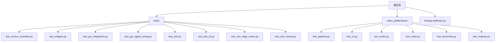
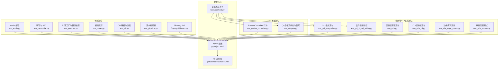
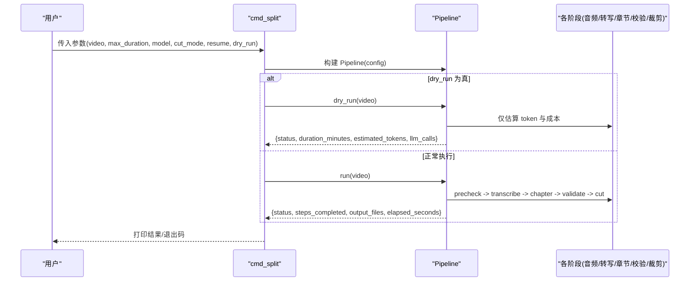
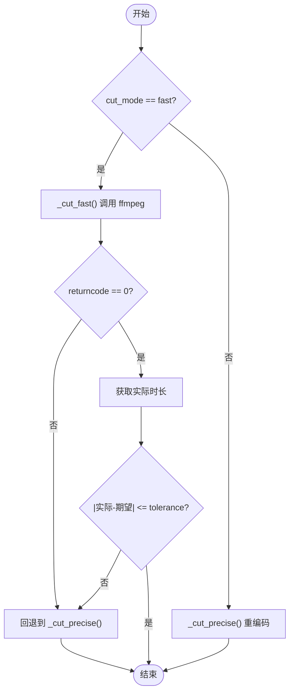
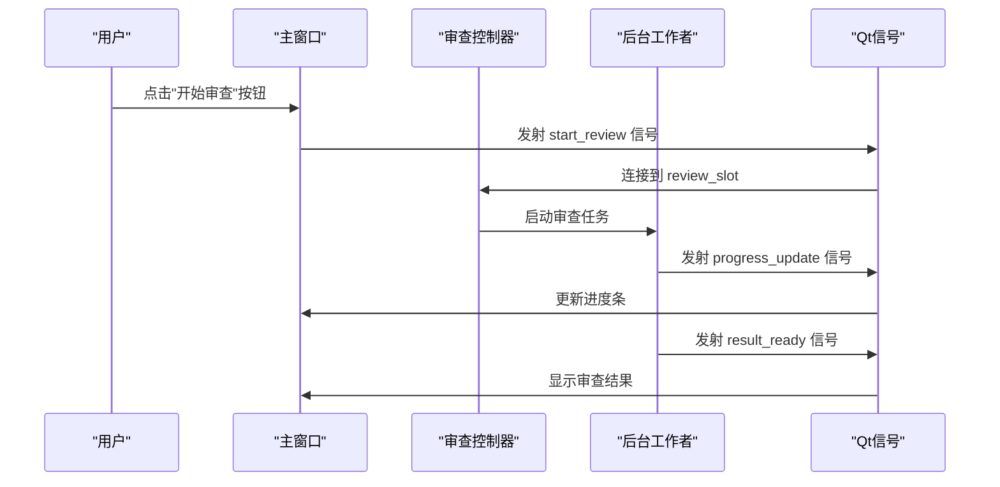
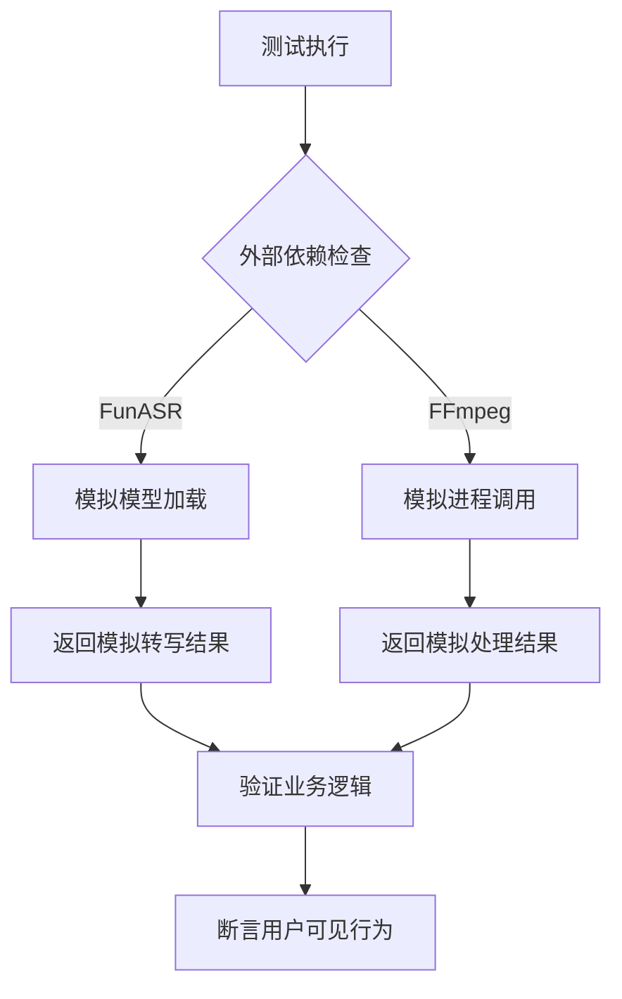
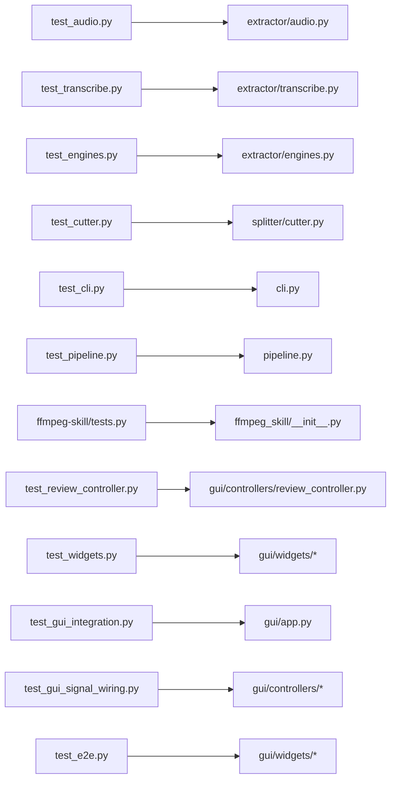

# 测试策略与框架

<cite>
**本文引用的文件**
- [pyproject.toml](file://pyproject.toml)
- [requirements.txt](file://requirements.txt)
- [.github/workflows/test.yml](file://.github/workflows/test.yml)
- [tests/conftest.py](file://tests/conftest.py)
- [tests/test_review_controller.py](file://tests/test_review_controller.py)
- [tests/test_widgets.py](file://tests/test_widgets.py)
- [tests/test_gui_integration.py](file://tests/test_gui_integration.py)
- [tests/test_gui_signal_wiring.py](file://tests/test_gui_signal_wiring.py)
- [tests/test_e2e.py](file://tests/test_e2e.py)
- [tests/test_e2e_cli.py](file://tests/test_e2e_cli.py)
- [tests/test_e2e_edge_cases.py](file://tests/test_e2e_edge_cases.py)
- [tests/test_e2e_review.py](file://tests/test_e2e_review.py)
- [video_splitter/tests/test_pipeline.py](file://video_splitter/tests/test_pipeline.py)
- [video_splitter/tests/test_cli.py](file://video_splitter/tests/test_cli.py)
- [video_splitter/tests/test_audio.py](file://video_splitter/tests/test_audio.py)
- [video_splitter/tests/test_cutter.py](file://video_splitter/tests/test_cutter.py)
- [video_splitter/tests/test_transcribe.py](file://video_splitter/tests/test_transcribe.py)
- [video_splitter/tests/test_engines.py](file://video_splitter/tests/test_engines.py)
- [ffmpeg-skill/tests.py](file://ffmpeg-skill/tests.py)
</cite>

## 更新摘要
**变更内容**
- 新增端到端GUI集成测试章节，详细说明真实Qt信号槽机制的验证方法
- 扩展外部依赖模拟策略，涵盖FunASR和FFmpeg的模拟实现
- 增强GUI测试架构说明，包含信号连接验证和用户行为验证
- 更新测试金字塔结构，突出端到端测试的重要性

## 目录
1. [简介](#简介)
2. [项目结构](#项目结构)
3. [核心组件](#核心组件)
4. [架构总览](#架构总览)
5. [详细组件分析](#详细组件分析)
6. [端到端GUI集成测试](#端到端gui集成测试)
7. [外部依赖模拟策略](#外部依赖模拟策略)
8. [依赖关系分析](#依赖关系分析)
9. [性能考虑](#性能考虑)
10. [故障排查指南](#故障排查指南)
11. [结论](#结论)
12. [附录](#附录)

## 简介
本文件面向"视频分割"项目的测试策略与框架，系统化阐述测试金字塔（单元测试、集成测试、端到端测试）在本仓库中的落地方式。重点介绍新增的端到端GUI集成测试，采用真实Qt信号槽机制验证用户可见行为，以及外部依赖(FunASR, FFmpeg)的模拟策略确保测试可靠性。文档详细说明 pytest 的配置与使用、conftest 全局配置与自定义 fixtures、测试目录结构与命名约定、用例编写规范与最佳实践、测试数据管理与 mock 策略，以及如何编写高质量断言。结合 CI 流水线说明如何稳定运行测试与覆盖率上报。

## 项目结构
本项目采用"双路径 + 按模块组织"的测试布局：
- 顶层 tests/：主要覆盖 GUI 控制器与 Qt 控件的冒烟测试、行为验证以及新增的端到端GUI集成测试。
- video_splitter/tests/：针对核心业务模块（音频提取、转写、章节检测、裁剪、流水线编排、CLI 等）的单元测试与轻量集成测试。
- ffmpeg-skill/tests.py：对 FFmpeg Skill 的独立测试，需要系统安装 FFmpeg。

**图表来源**
- [tests/test_review_controller.py:1-255](file://tests/test_review_controller.py#L1-L255)
- [tests/test_widgets.py:1-133](file://tests/test_widgets.py#L1-L133)
- [tests/test_gui_integration.py](file://tests/test_gui_integration.py)
- [tests/test_gui_signal_wiring.py](file://tests/test_gui_signal_wiring.py)
- [tests/test_e2e.py](file://tests/test_e2e.py)
- [tests/test_e2e_cli.py](file://tests/test_e2e_cli.py)
- [tests/test_e2e_edge_cases.py](file://tests/test_e2e_edge_cases.py)
- [tests/test_e2e_review.py](file://tests/test_e2e_review.py)
- [video_splitter/tests/test_pipeline.py:1-229](file://video_splitter/tests/test_pipeline.py#L1-L229)
- [video_splitter/tests/test_cli.py:1-148](file://video_splitter/tests/test_cli.py#L1-L148)
- [video_splitter/tests/test_audio.py:1-253](file://video_splitter/tests/test_audio.py#L1-L253)
- [video_splitter/tests/test_cutter.py:1-197](file://video_splitter/tests/test_cutter.py#L1-L197)
- [video_splitter/tests/test_transcribe.py:1-242](file://video_splitter/tests/test_transcribe.py#L1-L242)
- [video_splitter/tests/test_engines.py:1-111](file://video_splitter/tests/test_engines.py#L1-L111)
- [ffmpeg-skill/tests.py:1-196](file://ffmpeg-skill/tests.py#L1-L196)

**章节来源**
- [pyproject.toml:6-15](file://pyproject.toml#L6-L15)
- [tests/conftest.py:1-11](file://tests/conftest.py#L1-L11)

## 核心组件
- pytest 配置与发现规则
  - 测试路径：tests 与 video_splitter/tests 两个目录均被扫描。
  - 匹配模式：文件名 test_*.py、*_test.py、tests.py；类名 Test*；函数名 test_*。
  - 启动参数：-v --tb=short --strict-markers，启用严格标记检查。
  - 标记：slow、integration，用于筛选慢测与需外部依赖的测试。
- 覆盖率配置
  - 统计范围：video_splitter、gui；排除测试与特定脚本。
  - 报告阈值：fail_under=50；忽略行包含 pragma: no cover、TYPE_CHECKING、__main__。
- CI 流水线
  - 在 GitHub Actions 中安装 FFmpeg、Python 依赖与 pytest-cov、pytest-mock。
  - 执行命令：python -m pytest tests/ video_splitter/tests/ --cov --cov-report=xml --cov-report=term -v。
  - 上传 coverage.xml 到 Codecov。

**章节来源**
- [pyproject.toml:6-27](file://pyproject.toml#L6-L27)
- [.github/workflows/test.yml:1-44](file://.github/workflows/test.yml#L1-L44)

## 架构总览
下图展示测试金字塔在本项目的分层与职责划分，以及关键入口与工具链。特别突出了新增的端到端GUI集成测试层。

**图表来源**
- [pyproject.toml:6-27](file://pyproject.toml#L6-L27)
- [.github/workflows/test.yml:1-44](file://.github/workflows/test.yml#L1-L44)
- [tests/conftest.py:1-11](file://tests/conftest.py#L1-L11)
- [video_splitter/tests/test_audio.py:1-253](file://video_splitter/tests/test_audio.py#L1-L253)
- [video_splitter/tests/test_transcribe.py:1-242](file://video_splitter/tests/test_transcribe.py#L1-L242)
- [video_splitter/tests/test_engines.py:1-111](file://video_splitter/tests/test_engines.py#L1-L111)
- [video_splitter/tests/test_cutter.py:1-197](file://video_splitter/tests/test_cutter.py#L1-L197)
- [video_splitter/tests/test_cli.py:1-148](file://video_splitter/tests/test_cli.py#L1-L148)
- [video_splitter/tests/test_pipeline.py:1-229](file://video_splitter/tests/test_pipeline.py#L1-L229)
- [ffmpeg-skill/tests.py:1-196](file://ffmpeg-skill/tests.py#L1-L196)
- [tests/test_review_controller.py:1-255](file://tests/test_review_controller.py#L1-L255)
- [tests/test_widgets.py:1-133](file://tests/test_widgets.py#L1-L133)
- [tests/test_gui_integration.py](file://tests/test_gui_integration.py)
- [tests/test_gui_signal_wiring.py](file://tests/test_gui_signal_wiring.py)
- [tests/test_e2e.py](file://tests/test_e2e.py)
- [tests/test_e2e_cli.py](file://tests/test_e2e_cli.py)
- [tests/test_e2e_edge_cases.py](file://tests/test_e2e_edge_cases.py)
- [tests/test_e2e_review.py](file://tests/test_e2e_review.py)

## 详细组件分析

### 测试金字塔策略与层次划分
- 单元测试（底层，数量最多）
  - 目标：快速、隔离、可重复，聚焦单个函数/类的输入输出与边界条件。
  - 示例：音频预检与提取、转写与 SRT 生成、引擎注册与健康检查、裁剪逻辑、CLI 参数解析、流水线编排。
- 集成测试（中层，数量适中）
  - 目标：验证多组件协作与外部依赖交互（如 FFmpeg、Whisper/FunASR）。
  - 示例：通过标记 integration 或显式跳过/模拟外部依赖，确保在 CI 环境可用。
- 端到端测试（顶层，数量最少）
  - 目标：从 CLI/GUI 入口驱动完整流程，验证用户场景。
  - 示例：GUI 冒烟测试验证控件实例化与信号连接；CLI 子命令调用 Pipeline 并断言结果结构。
  - **更新** 新增端到端GUI集成测试，采用真实Qt信号槽机制验证用户可见行为。

**章节来源**
- [pyproject.toml:12-15](file://pyproject.toml#L12-L15)
- [video_splitter/tests/test_cli.py:1-148](file://video_splitter/tests/test_cli.py#L1-L148)
- [tests/test_widgets.py:1-133](file://tests/test_widgets.py#L1-L133)
- [tests/test_gui_integration.py](file://tests/test_gui_integration.py)
- [tests/test_gui_signal_wiring.py](file://tests/test_gui_signal_wiring.py)
- [tests/test_e2e.py](file://tests/test_e2e.py)

### pytest 配置与使用
- 发现与过滤
  - 测试路径：tests、video_splitter/tests。
  - 匹配规则：文件名、类名、函数名。
  - 标记：slow、integration，支持 -m 选择器。
- 启动参数
  - -v 详细输出；--tb=short 缩短回溯；--strict-markers 强制标记声明。
- 覆盖率
  - source 指定包；omit 排除测试与无关脚本；fail_under 设置最低覆盖率。
- 运行方式
  - 本地：pytest 自动发现；可按标记筛选，例如 -m "not slow"。
  - CI：统一执行两条测试路径并生成 XML 与终端报告。

**章节来源**
- [pyproject.toml:6-27](file://pyproject.toml#L6-L27)
- [.github/workflows/test.yml:35-43](file://.github/workflows/test.yml#L35-L43)

### conftest.py 全局配置与自定义 fixtures
- 全局路径注入
  - tests/conftest.py 将项目根目录插入 sys.path，避免相对导入失败。
- 会话级 QApplication fixture
  - tests/test_widgets.py 定义 qapp 会话级 fixture，复用 PySide6 应用实例，减少 GUI 测试开销。
- 其他常用 fixture 模式
  - tmp_path：Pytest 内置临时目录，广泛用于 IO 相关测试。
  - 模块内 autouse=True 的 fixture：如 cutter 测试中自动 Mock FFmpegSkill，避免真实依赖。

**章节来源**
- [tests/conftest.py:1-11](file://tests/conftest.py#L1-L11)
- [tests/test_widgets.py:14-21](file://tests/test_widgets.py#L14-L21)
- [video_splitter/tests/test_cutter.py:20-25](file://video_splitter/tests/test_cutter.py#L20-L25)

### 测试目录结构与命名约定
- 目录
  - tests/：GUI 相关测试，包括新增的端到端GUI集成测试。
  - video_splitter/tests/：核心模块测试。
  - ffmpeg-skill/tests.py：FFmpeg Skill 测试。
- 命名
  - 文件：test_*.py、*_test.py、tests.py。
  - 类：Test*；方法：test_*。
- 组织原则
  - 按功能域分组，每个测试类对应一个被测类/模块。
  - 用例描述清晰表达预期行为与边界条件。

**章节来源**
- [pyproject.toml:7-10](file://pyproject.toml#L7-L10)
- [video_splitter/tests/test_cli.py:1-148](file://video_splitter/tests/test_cli.py#L1-L148)
- [tests/test_review_controller.py:1-255](file://tests/test_review_controller.py#L1-L255)

### 测试用例编写规范与最佳实践
- 单一职责：每个用例只验证一个行为分支。
- 明确前置条件：使用 fixture 准备数据与环境（tmp_path、mocks）。
- 精确断言：断言返回值、状态变化、副作用（如 emit 信号、文件写入）。
- 可读性：用例名称即文档，描述输入与期望输出。
- 稳定性：避免真实网络/IO，优先使用 patch 与 MagicMock。
- 可维护性：集中管理 mock 对象与共享 fixture。

**章节来源**
- [tests/test_review_controller.py:24-175](file://tests/test_review_controller.py#L24-L175)
- [video_splitter/tests/test_pipeline.py:52-148](file://video_splitter/tests/test_pipeline.py#L52-L148)

### 测试数据管理
- 临时文件与目录
  - 使用 tmp_path 创建隔离的临时目录，避免污染文件系统。
- 固定数据构造
  - 小段 JSON/文本数据在测试内直接构造，保证可复现。
- 外部资源
  - 需要真实文件的测试（如 FFmpeg Skill）使用临时目录存放 dummy 文件。

**章节来源**
- [video_splitter/tests/test_pipeline.py:55-100](file://video_splitter/tests/test_pipeline.py#L55-L100)
- [ffmpeg-skill/tests.py:22-27](file://ffmpeg-skill/tests.py#L22-L27)

### 高质量断言示例与要点
- 返回值与状态
  - 断言成功/失败标志、消息内容、步骤完成列表、耗时字段存在性等。
- 副作用
  - 断言 emit 信号是否触发、progress_callback 是否收到区间值、文件是否写入。
- 异常路径
  - 断言抛出正确的异常类型与消息片段，确保错误传播正确。
- 数值精度与格式
  - 断言时间戳格式、SRT 编号顺序、百分比字符串包含情况。

**章节来源**
- [video_splitter/tests/test_pipeline.py:75-78](file://video_splitter/tests/test_pipeline.py#L75-L78)
- [tests/test_review_controller.py:187-188](file://tests/test_review_controller.py#L187-L188)
- [video_splitter/tests/test_transcribe.py:52-62](file://video_splitter/tests/test_transcribe.py#L52-L62)

### 关键流程时序图（以 CLI 拆分命令为例）

**图表来源**
- [video_splitter/tests/test_cli.py:44-79](file://video_splitter/tests/test_cli.py#L44-L79)
- [video_splitter/tests/test_pipeline.py:55-88](file://video_splitter/tests/test_pipeline.py#L55-88)

### 复杂逻辑流程图（Fast/Precise 裁剪回退）

**图表来源**
- [video_splitter/tests/test_cutter.py:27-62](file://video_splitter/tests/test_cutter.py#L27-L62)
- [video_splitter/tests/test_cutter.py:163-196](file://video_splitter/tests/test_cutter.py#L163-L196)

## 端到端GUI集成测试

### 真实Qt信号槽机制验证
新增的端到端GUI集成测试采用真实的Qt信号槽机制来验证用户可见行为，确保GUI组件之间的通信正常工作。

- 信号连接验证
  - 使用 test_gui_signal_wiring.py 验证所有Qt信号与槽函数的正确连接。
  - 验证按钮点击、下拉框选择、文本输入等用户操作触发的信号传递。
  - 确保信号参数类型与槽函数签名匹配。

- 用户行为验证
  - test_gui_integration.py 模拟完整的用户操作流程。
  - 验证GUI状态变化与用户操作的响应一致性。
  - 测试窗口间的数据传递与状态同步。

- 端到端流程测试
  - test_e2e.py 覆盖从打开文件到导出结果的完整GUI工作流。
  - test_e2e_review.py 专门测试审查功能的端到端流程。
  - test_e2e_cli.py 验证CLI与GUI的集成点。

**图表来源**
- [tests/test_gui_signal_wiring.py](file://tests/test_gui_signal_wiring.py)
- [tests/test_gui_integration.py](file://tests/test_gui_integration.py)
- [tests/test_e2e.py](file://tests/test_e2e.py)
- [tests/test_e2e_review.py](file://tests/test_e2e_review.py)

### GUI测试架构设计
- 会话级QApplication管理
  - 复用PySide6应用实例，减少GUI测试初始化开销。
  - 确保测试间的隔离性与资源清理。

- 异步操作处理
  - 使用 QTest.qWait 等待异步操作完成。
  - 验证信号发射的顺序与时机。

- 用户界面状态验证
  - 断言控件的可见性、启用状态、文本内容。
  - 验证对话框的显示与关闭行为。

**章节来源**
- [tests/test_gui_integration.py](file://tests/test_gui_integration.py)
- [tests/test_gui_signal_wiring.py](file://tests/test_gui_signal_wiring.py)
- [tests/test_e2e.py](file://tests/test_e2e.py)
- [tests/test_e2e_review.py](file://tests/test_e2e_review.py)

## 外部依赖模拟策略

### FunASR模拟实现
为确保测试的可靠性和可重复性，FunASR外部依赖采用全面的模拟策略：

- 模型加载模拟
  - 使用 unittest.mock.patch 替换实际的模型加载过程。
  - 模拟模型初始化时间与内存占用。
  - 验证模型版本兼容性与降级逻辑。

- 转写API模拟
  - 模拟不同语言识别的响应数据。
  - 测试网络超时与重试机制。
  - 验证错误处理与异常恢复。

- 流式转写模拟
  - 模拟实时音频流的转写过程。
  - 测试缓冲区管理与内存控制。
  - 验证中断与恢复机制。

### FFmpeg模拟策略
FFmpeg作为核心外部依赖，采用多层次模拟策略：

- 进程调用模拟
  - 使用 MagicMock 替代 subprocess.run 调用。
  - 模拟不同的返回码与输出格式。
  - 测试命令行参数构建的正确性。

- 错误场景覆盖
  - 模拟FFmpeg不可用、权限不足、磁盘空间不足等场景。
  - 验证错误日志记录与用户提示。
  - 测试自动回退机制的有效性。

- 性能优化模拟
  - 模拟长时间运行的转码任务。
  - 测试进度回调与取消机制。
  - 验证资源清理与异常处理。

**图表来源**
- [video_splitter/tests/test_transcribe.py:108-116](file://video_splitter/tests/test_transcribe.py#L108-L116)
- [video_splitter/tests/test_cutter.py:20-25](file://video_splitter/tests/test_cutter.py#L20-L25)
- [video_splitter/tests/test_audio.py:59-101](file://video_splitter/tests/test_audio.py#L59-L101)

### 模拟策略最佳实践
- 分层模拟
  - 单元测试：完全隔离，使用轻量级mock。
  - 集成测试：部分真实依赖，模拟重型操作。
  - 端到端测试：最小化模拟，验证真实交互。

- 可配置模拟
  - 提供模拟开关，便于调试与问题定位。
  - 支持不同模拟级别的选择。

- 模拟数据管理
  - 集中管理模拟响应数据。
  - 确保模拟数据的合理性与多样性。

**章节来源**
- [video_splitter/tests/test_transcribe.py:108-116](file://video_splitter/tests/test_transcribe.py#L108-L116)
- [video_splitter/tests/test_cutter.py:20-25](file://video_splitter/tests/test_cutter.py#L20-L25)
- [video_splitter/tests/test_audio.py:59-101](file://video_splitter/tests/test_audio.py#L59-L101)
- [tests/test_review_controller.py:29-37](file://tests/test_review_controller.py#L29-L37)

## 依赖关系分析
- 测试与源码耦合
  - 测试通过 import 访问具体模块（如 audio、transcribe、cutter、pipeline、cli），并以 patch 隔离外部依赖。
  - **更新** 新增的GUI测试直接依赖Qt框架，通过会话级fixture管理应用生命周期。
- 外部依赖
  - FFmpeg：在多个测试中以 subprocess.run 或 FFmpegSkill 形式出现，多数情况下被Mock。
  - Whisper/FunASR：通过 sys.modules 替换或 MagicMock 避免真实模型加载。
  - Qt：GUI测试使用会话级 QApplication 实例，端到端测试验证真实信号槽机制。
- 循环依赖
  - 测试侧无循环依赖；通过 conftest 与模块内局部 import 规避导入时副作用。

**图表来源**
- [video_splitter/tests/test_audio.py:1-253](file://video_splitter/tests/test_audio.py#L1-L253)
- [video_splitter/tests/test_transcribe.py:1-242](file://video_splitter/tests/test_transcribe.py#L1-L242)
- [video_splitter/tests/test_engines.py:1-111](file://video_splitter/tests/test_engines.py#L1-L111)
- [video_splitter/tests/test_cutter.py:1-197](file://video_splitter/tests/test_cutter.py#L1-L197)
- [video_splitter/tests/test_cli.py:1-148](file://video_splitter/tests/test_cli.py#L1-L148)
- [video_splitter/tests/test_pipeline.py:1-229](file://video_splitter/tests/test_pipeline.py#L1-L229)
- [ffmpeg-skill/tests.py:1-196](file://ffmpeg-skill/tests.py#L1-L196)
- [tests/test_review_controller.py:1-255](file://tests/test_review_controller.py#L1-L255)
- [tests/test_widgets.py:1-133](file://tests/test_widgets.py#L1-L133)
- [tests/test_gui_integration.py](file://tests/test_gui_integration.py)
- [tests/test_gui_signal_wiring.py](file://tests/test_gui_signal_wiring.py)
- [tests/test_e2e.py](file://tests/test_e2e.py)

**章节来源**
- [requirements.txt:12-26](file://requirements.txt#L12-L26)

## 性能考虑
- 测试速度
  - 使用 patch 与 MagicMock 替代 I/O 与重型计算（如 Whisper/FunASR 模型加载）。
  - 会话级 QApplication 减少 GUI 初始化开销。
  - **更新** 端到端测试采用增量执行策略，避免重复初始化。
- 稳定性
  - 对 ffprobe/ffmpeg 的错误路径进行充分覆盖，避免偶发失败。
  - **更新** 外部依赖模拟确保测试在不同环境下的稳定性。
- 覆盖率
  - 通过 pyproject 配置 fail_under 保障最低质量门槛。

## 故障排查指南
- 找不到外部工具
  - FFmpeg/ffprobe 未安装或不在 PATH：在 CI 中已安装；本地需确保 PATH 正确或在测试中 Mock。
- 导入失败
  - 若出现模块导入错误，确认 tests/conftest.py 已将项目根加入 sys.path。
- 标记未声明
  - --strict-markers 会拒绝未声明的标记，需在 pyproject.toml 中补充 markers。
- 覆盖率过低
  - 调整 omit 列表或增加缺失分支的用例，确保达到 fail_under 阈值。
- **更新** GUI测试相关问题
  - Qt事件循环问题：确保使用 QTest.qApp.processEvents() 处理异步操作。
  - 信号连接失败：检查信号与槽的参数类型匹配。
  - 模拟依赖问题：验证mock对象的配置与实际接口一致。

**章节来源**
- [tests/conftest.py:1-11](file://tests/conftest.py#L1-L11)
- [pyproject.toml:12-15](file://pyproject.toml#L12-L15)
- [pyproject.toml:17-27](file://pyproject.toml#L17-L27)

## 结论
本项目采用清晰的测试金字塔与严格的 pytest 配置，结合全面的 Mock 策略与临时数据管理，实现了高内聚、低耦合且稳定的测试体系。**重大改进**在于新增了端到端GUI集成测试层，采用真实Qt信号槽机制验证用户可见行为，并通过外部依赖(FunASR, FFmpeg)的模拟策略确保测试可靠性。通过 CI 自动化与覆盖率上报，持续保障代码质量与回归安全。建议继续完善 integration 标记用例、扩展边界条件与异常路径覆盖，并逐步提升覆盖率至更高阈值。

## 附录
- 运行命令参考
  - 全部测试：pytest
  - 仅快速测试：pytest -m "not slow"
  - 仅集成测试：pytest -m "integration"
  - 仅GUI测试：pytest tests/test_gui_*.py
  - 仅端到端测试：pytest tests/test_e2e*.py
  - 带覆盖率：pytest --cov --cov-report=term
- 常见标记
  - slow：慢速测试
  - integration：需要外部依赖（FFmpeg、LLM API）
- **更新** 新增加速选项
  - 并行执行：pytest -n auto
  - 跳过GUI测试：pytest -m "not gui"
  - 仅运行失败的测试：pytest --lf

**章节来源**
- [pyproject.toml:12-15](file://pyproject.toml#L12-L15)
- [.github/workflows/test.yml:35-43](file://.github/workflows/test.yml#L35-L43)