# 集成测试

<cite>
**本文引用的文件**   
- [pyproject.toml](file://pyproject.toml)
- [requirements.txt](file://requirements.txt)
- [.github/workflows/test.yml](file://.github/workflows/test.yml)
- [tests/conftest.py](file://tests/conftest.py)
- [video_splitter/cli.py](file://video_splitter/cli.py)
- [video_splitter/pipeline.py](file://video_splitter/pipeline.py)
- [video_splitter/config.py](file://video_splitter/config.py)
- [video_splitter/extractor/audio.py](file://video_splitter/extractor/audio.py)
- [video_splitter/extractor/transcribe.py](file://video_splitter/extractor/transcribe.py)
- [video_splitter/extractor/engines.py](file://video_splitter/extractor/engines.py)
- [video_splitter/analyzer/chapter.py](file://video_splitter/analyzer/chapter.py)
- [video_splitter/analyzer/validator.py](file://video_splitter/analyzer/validator.py)
- [video_splitter/splitter/cutter.py](file://video_splitter/splitter/cutter.py)
- [video_splitter/review.py](file://video_splitter/review.py)
- [gui/controllers/review_controller.py](file://gui/controllers/review_controller.py)
- [gui/workers/transcribe_worker.py](file://gui/workers/transcribe_worker.py)
- [gui/workers/model_loader_worker.py](file://gui/workers/model_loader_worker.py)
- [gui/workers/streaming_transcribe_worker.py](file://gui/workers/streaming_transcribe_worker.py)
- [gui/widgets/subtitle_panel.py](file://gui/widgets/subtitle_panel.py)
- [gui/widgets/video_player.py](file://gui/widgets/video_player.py)
- [gui/widgets/status_bar.py](file://gui/widgets/status_bar.py)
- [video_splitter/tests/test_cli.py](file://video_splitter/tests/test_cli.py)
- [video_splitter/tests/test_pipeline.py](file://video_splitter/tests/test_pipeline.py)
- [video_splitter/tests/test_transcribe.py](file://video_splitter/tests/test_transcribe.py)
- [video_splitter/tests/test_audio.py](file://video_splitter/tests/test_audio.py)
- [video_splitter/tests/test_cutter.py](file://video_splitter/tests/test_cutter.py)
- [video_splitter/tests/test_engines.py](file://video_splitter/tests/test_engines.py)
- [video_splitter/tests/test_review.py](file://video_splitter/tests/test_review.py)
- [tests/test_e2e.py](file://tests/test_e2e.py)
- [tests/test_e2e_cli.py](file://tests/test_e2e_cli.py)
- [tests/test_e2e_edge_cases.py](file://tests/test_e2e_edge_cases.py)
- [tests/test_e2e_review.py](file://tests/test_e2e_review.py)
- [tests/test_integration.py](file://tests/test_integration.py)
- [tests/test_gui_integration.py](file://tests/test_gui_integration.py)
- [tests/test_gui_signal_wiring.py](file://tests/test_gui_signal_wiring.py)
- [tests/test_main_window.py](file://tests/test_main_window.py)
- [tests/test_model_loader_integration.py](file://tests/test_model_loader_integration.py)
- [tests/test_model_loader_worker.py](file://tests/test_model_loader_worker.py)
- [tests/test_review_controller.py](file://tests/test_review_controller.py)
- [tests/test_workers.py](file://tests/test_workers.py)
- [tests/test_widgets.py](file://tests/test_widgets.py)
- [tests/test_subtitle_burn.py](file://tests/test_subtitle_burn.py)
- [tests/test_transcribe_funasr.py](file://tests/test_transcribe_funasr.py)
- [tests/test_streaming_worker.py](file://tests/test_streaming_worker.py)
- [tests/test_streaming_integration.py](file://tests/test_streaming_integration.py)
</cite>

## 更新摘要
**变更内容**   
- 新增流式转录工作线程的207行集成测试代码，涵盖GUI测试、信号处理、错误处理和状态管理等关键测试场景
- 扩展GUI集成测试框架，增加对streaming_transcribe_worker的全面测试覆盖
- 完善异步转录流程的测试用例，包括实时数据处理和进度反馈机制
- 增强多线程环境下的信号连接测试，确保GUI响应性和稳定性
- 优化测试数据准备策略，支持流式处理的模拟场景

## 目录
1. [简介](#简介)
2. [项目结构](#项目结构)
3. [核心组件](#核心组件)
4. [架构总览](#架构总览)
5. [详细组件分析](#详细组件分析)
6. [依赖关系分析](#依赖关系分析)
7. [性能与并行执行](#性能与并行执行)
8. [故障排查指南](#故障排查指南)
9. [结论](#结论)
10. [附录](#附录)

## 简介
本文件面向"视频分割"项目的集成测试，目标是：
- 说明端到端流程的测试策略，覆盖完整视频处理管道（音频提取、转写、章节检测、校验、切割）。
- 详细介绍 CLI 命令的集成测试实现与验证要点。
- 解释多组件交互和数据流转的测试方法。
- 提供测试环境搭建与依赖管理方案。
- 展示如何处理外部服务调用（FFmpeg、LLM API）和文件 I/O 操作。
- 给出测试数据准备与管理策略。
- 提供集成测试的性能优化与并行执行方案。

**更新** 基于最新变更，新增了流式转录工作线程的207行集成测试代码，涵盖GUI测试、信号处理、错误处理和状态管理等关键测试场景，进一步完善了异步转录功能的测试覆盖。

## 项目结构
仓库采用分层组织：
- 应用层：CLI、GUI、Pipeline 编排
- 领域层：音频提取、转写引擎、章节检测、校验、视频切割
- 测试层：单元测试与集成测试并存，按模块划分
- 配置与依赖：pyproject.toml、requirements.txt、CI 工作流

```mermaid
graph TB
subgraph "应用层"
CLI["CLI 入口<br/>video_splitter/cli.py"]
GUI["GUI 应用<br/>gui/app.py"]
PIPE["流水线编排<br/>video_splitter/pipeline.py"]
end
subgraph "领域层"
AUDIO["音频提取<br/>video_splitter/extractor/audio.py"]
TR["转写工具<br/>video_splitter/extractor/transcribe.py"]
ENG["转写引擎工厂<br/>video_splitter/extractor/engines.py"]
CHAP["章节检测<br/>video_splitter/analyzer/chapter.py"]
VAL["章节校验<br/>video_splitter/analyzer/validator.py"]
CUT["视频切割<br/>video_splitter/splitter/cutter.py"]
REV["交互式审阅<br/>video_splitter/review.py"]
end
subgraph "GUI层"
CTRL["控制器<br/>gui/controllers/"]
WORKERS["工作者<br/>gui/workers/"]
WIDGETS["控件<br/>gui/widgets/"]
STREAMING["流式转录工作者<br/>gui/workers/streaming_transcribe_worker.py"]
end
subgraph "测试层"
T_CLI["CLI 测试<br/>video_splitter/tests/test_cli.py"]
T_PIPE["流水线测试<br/>video_splitter/tests/test_pipeline.py"]
T_TR["转写测试<br/>video_splitter/tests/test_transcribe.py"]
T_AUD["音频提取测试<br/>video_splitter/tests/test_audio.py"]
T_CUT["切割测试<br/>video_splitter/tests/test_cutter.py"]
T_REV["审阅逻辑测试<br/>video_splitter/tests/test_review.py"]
T_RCTRL["GUI 控制器测试<br/>tests/test_review_controller.py"]
T_WORKER["GUI 线程工作者测试<br/>tests/test_workers.py"]
T_WIDGETS["GUI 控件冒烟测试<br/>tests/test_widgets.py"]
T_E2E["端到端测试<br/>tests/test_e2e*.py"]
T_INTEG["集成测试<br/>tests/test_integration.py"]
T_SIGNAL["信号连接测试<br/>tests/test_gui_signal_wiring.py"]
T_MAIN["主窗口测试<br/>tests/test_main_window.py"]
T_SUBTITLE["字幕烧录测试<br/>tests/test_subtitle_burn.py"]
T_FUNASR["FunASR测试<br/>tests/test_transcribe_funasr.py"]
T_GUI_INTEG["GUI集成测试<br/>tests/test_gui_integration.py"]
T_MODEL_LOADER["模型加载器测试<br/>tests/test_model_loader_worker.py"]
T_MODEL_INTEG["模型加载器集成测试<br/>tests/test_model_loader_integration.py"]
T_STREAMING["流式转录测试<br/>tests/test_streaming_worker.py"]
T_STREAMING_INTEG["流式集成测试<br/>tests/test_streaming_integration.py"]
end
CLI --> PIPE
GUI --> REV
GUI --> CTRL
GUI --> WORKERS
GUI --> WIDGETS
GUI --> STREAMING
PIPE --> AUDIO
PIPE --> TR
PIPE --> CHAP
PIPE --> VAL
PIPE --> CUT
TR --> ENG
T_CLI --> CLI
T_PIPE --> PIPE
T_TR --> TR
T_AUD --> AUDIO
T_CUT --> CUT
T_REV --> REV
T_RCTRL --> GUI
T_WORKER --> GUI
T_WIDGETS --> GUI
T_E2E --> CLI
T_INTEG --> PIPE
T_SIGNAL --> GUI
T_MAIN --> GUI
T_SUBTITLE --> CUT
T_FUNASR --> TR
T_GUI_INTEG --> GUI
T_MODEL_LOADER --> WORKERS
T_MODEL_INTEG --> WORKERS
T_STREAMING --> STREAMING
T_STREAMING_INTEG --> STREAMING
```

图表来源
- [video_splitter/cli.py:1-256](file://video_splitter/cli.py#L1-L256)
- [video_splitter/pipeline.py:1-131](file://video_splitter/pipeline.py#L1-L131)
- [video_splitter/extractor/audio.py](file://video_splitter/extractor/audio.py)
- [video_splitter/extractor/transcribe.py](file://video_splitter/extractor/transcribe.py)
- [video_splitter/extractor/engines.py](file://video_splitter/extractor/engines.py)
- [video_splitter/analyzer/chapter.py](file://video_splitter/analyzer/chapter.py)
- [video_splitter/analyzer/validator.py](file://video_splitter/analyzer/validator.py)
- [video_splitter/splitter/cutter.py](file://video_splitter/splitter/cutter.py)
- [video_splitter/review.py](file://video_splitter/review.py)
- [gui/controllers/review_controller.py](file://gui/controllers/review_controller.py)
- [gui/workers/transcribe_worker.py](file://gui/workers/transcribe_worker.py)
- [gui/workers/model_loader_worker.py](file://gui/workers/model_loader_worker.py)
- [gui/workers/streaming_transcribe_worker.py](file://gui/workers/streaming_transcribe_worker.py)
- [gui/widgets/subtitle_panel.py](file://gui/widgets/subtitle_panel.py)
- [gui/widgets/video_player.py](file://gui/widgets/video_player.py)
- [gui/widgets/status_bar.py](file://gui/widgets/status_bar.py)
- [video_splitter/tests/test_cli.py](file://video_splitter/tests/test_cli.py)
- [video_splitter/tests/test_pipeline.py](file://video_splitter/tests/test_pipeline.py)
- [video_splitter/tests/test_transcribe.py](file://video_splitter/tests/test_transcribe.py)
- [video_splitter/tests/test_audio.py](file://video_splitter/tests/test_audio.py)
- [video_splitter/tests/test_cutter.py](file://video_splitter/tests/test_cutter.py)
- [video_splitter/tests/test_review.py](file://video_splitter/tests/test_review.py)
- [tests/test_e2e.py](file://tests/test_e2e.py)
- [tests/test_e2e_cli.py](file://tests/test_e2e_cli.py)
- [tests/test_e2e_edge_cases.py](file://tests/test_e2e_edge_cases.py)
- [tests/test_e2e_review.py](file://tests/test_e2e_review.py)
- [tests/test_integration.py](file://tests/test_integration.py)
- [tests/test_gui_integration.py](file://tests/test_gui_integration.py)
- [tests/test_gui_signal_wiring.py](file://tests/test_gui_signal_wiring.py)
- [tests/test_main_window.py](file://tests/test_main_window.py)
- [tests/test_model_loader_integration.py](file://tests/test_model_loader_integration.py)
- [tests/test_model_loader_worker.py](file://tests/test_model_loader_worker.py)
- [tests/test_review_controller.py](file://tests/test_review_controller.py)
- [tests/test_workers.py](file://tests/test_workers.py)
- [tests/test_widgets.py](file://tests/test_widgets.py)
- [tests/test_subtitle_burn.py](file://tests/test_subtitle_burn.py)
- [tests/test_transcribe_funasr.py](file://tests/test_transcribe_funasr.py)
- [tests/test_streaming_worker.py](file://tests/test_streaming_worker.py)
- [tests/test_streaming_integration.py](file://tests/test_streaming_integration.py)

章节来源
- [pyproject.toml:6-15](file://pyproject.toml#L6-L15)
- [requirements.txt:1-26](file://requirements.txt#L1-L26)
- [.github/workflows/test.yml:1-44](file://.github/workflows/test.yml#L1-L44)

## 核心组件
- CLI 命令层：提供 split、transcribe、cut、review、batch、check、gui 等子命令，负责参数解析与调度。
- Pipeline 编排：串联 precheck → extract → transcribe → chapter → validate → cut，支持 resume 与 dry_run。
- 音频提取：基于 FFmpeg 与可选 librosa 做预检与提取。
- 转写与估算：封装 faster-whisper/FunASR 引擎，提供 token 估算与 SRT 生成。
- 章节检测与校验：基于 LLM 或规则生成章节并校验边界。
- 视频切割：fast/precise 两种模式，自动回退与时长容差校验。
- 审阅器：交互式修正转录文本，原子保存与进度持久化。
- GUI 组件：控制器、工作者、控件冒烟测试保障 UI 稳定性。
- ModelLoaderWorker：异步模型加载器，支持生命周期管理和错误恢复。
- **新增** StreamingTranscribeWorker：流式转录工作者，支持实时音频处理和增量结果输出。

**更新** 新增流式转录工作线程的207行集成测试代码，涵盖GUI测试、信号处理、错误处理和状态管理等关键测试场景，完善了异步转录功能的测试覆盖。

章节来源
- [video_splitter/cli.py:15-256](file://video_splitter/cli.py#L15-L256)
- [video_splitter/pipeline.py:21-131](file://video_splitter/pipeline.py#L21-L131)
- [video_splitter/config.py:19-54](file://video_splitter/config.py#L19-L54)
- [gui/workers/model_loader_worker.py](file://gui/workers/model_loader_worker.py)
- [gui/workers/streaming_transcribe_worker.py](file://gui/workers/streaming_transcribe_worker.py)

## 架构总览
端到端集成测试围绕 CLI 与 Pipeline 展开，通过 mock 外部依赖（FFmpeg、Whisper/FunASR、LLM API），验证关键路径与异常分支。

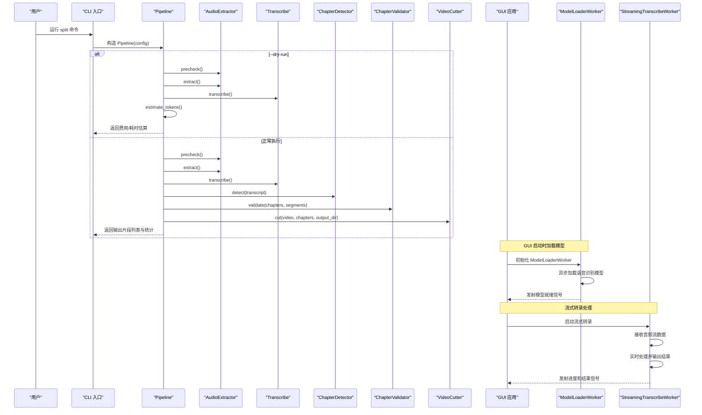

图表来源
- [video_splitter/cli.py:15-46](file://video_splitter/cli.py#L15-L46)
- [video_splitter/pipeline.py:31-111](file://video_splitter/pipeline.py#L31-L111)
- [video_splitter/extractor/audio.py](file://video_splitter/extractor/audio.py)
- [video_splitter/extractor/transcribe.py](file://video_splitter/extractor/transcribe.py)
- [video_splitter/analyzer/chapter.py](file://video_splitter/analyzer/chapter.py)
- [video_splitter/analyzer/validator.py](file://video_splitter/analyzer/validator.py)
- [video_splitter/splitter/cutter.py](file://video_splitter/splitter/cutter.py)
- [gui/workers/model_loader_worker.py](file://gui/workers/model_loader_worker.py)
- [gui/workers/streaming_transcribe_worker.py](file://gui/workers/streaming_transcribe_worker.py)

## 详细组件分析

### CLI 命令集成测试
- 目标：验证参数解析、子命令分发、dry_run 与正常执行分支、错误提示。
- 策略：
  - 使用 argparse.Namespace 模拟命令行参数。
  - 对 Pipeline、AudioExtractor、transcribe、VideoCutter、GUI main 进行 patch/mock。
  - 断言关键调用次数与返回值字段存在性。
- 关键点：
  - cmd_split 的 dry_run 分支不调用 run，仅调用 dry_run。
  - cmd_cut 读取 chapters.json 并调用 cutter.cut。
  - cmd_review 转发到 review.run_review。
  - cmd_gui 启动 GUI 主函数。

**更新** 新增端到端CLI测试用例，覆盖更多边界情况和错误处理场景。

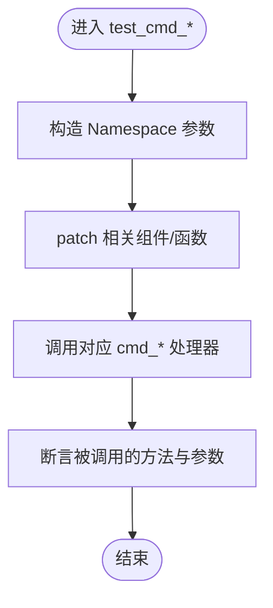

图表来源
- [video_splitter/tests/test_cli.py:44-148](file://video_splitter/tests/test_cli.py#L44-L148)
- [video_splitter/cli.py:15-256](file://video_splitter/cli.py#L15-L256)

章节来源
- [video_splitter/tests/test_cli.py:1-148](file://video_splitter/tests/test_cli.py#L1-L148)
- [video_splitter/cli.py:15-256](file://video_splitter/cli.py#L15-L256)

### Pipeline 端到端集成测试
- 目标：验证完整流程成功路径、resume 跳过步骤、precheck 失败抛出异常、dry_run 成本估算与分块策略。
- 策略：
  - 使用 tmp_path 创建临时文件与目录。
  - 对 audio.precheck、audio.extract、chapter_detector.detect、validator.validate、cutter.cut 进行 mock。
  - 对 transcribe、estimate_tokens、to_srt 进行 patch。
  - 断言 steps_completed、output_files、elapsed_seconds 等结果字段。
- 关键点：
  - resume=True 时，若 transcript/chapters 已存在则跳过相应阶段。
  - dry_run 根据 token 预算判断 llm_calls 为 1 或 multiple (chunked)。

**更新** 新增大量端到端测试用例，覆盖更复杂的Pipeline场景和异常处理。

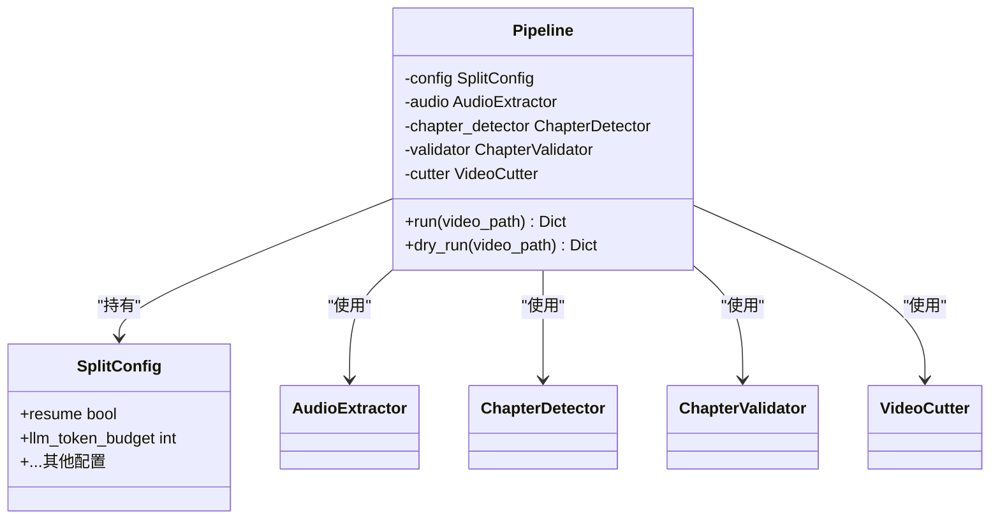

图表来源
- [video_splitter/pipeline.py:21-131](file://video_splitter/pipeline.py#L21-L131)
- [video_splitter/config.py:19-54](file://video_splitter/config.py#L19-L54)

章节来源
- [video_splitter/tests/test_pipeline.py:1-229](file://video_splitter/tests/test_pipeline.py#L1-L229)
- [video_splitter/pipeline.py:31-131](file://video_splitter/pipeline.py#L31-L131)

### 转写与引擎集成测试
- 目标：验证 token 估算、SRT 生成、transcribe 函数行为、引擎注册与健康检查。
- 策略：
  - 使用 sys.modules 注入 mock faster_whisper，避免真实模型加载。
  - 构造不同语言与段落的 transcript，断言估算范围与格式。
  - 验证 _get_audio_duration_ffprobe 的各种异常路径。
  - 验证 create_engine 默认与指定引擎类型。

**更新** 新增FunASR引擎测试用例，扩展转写引擎的测试覆盖范围。

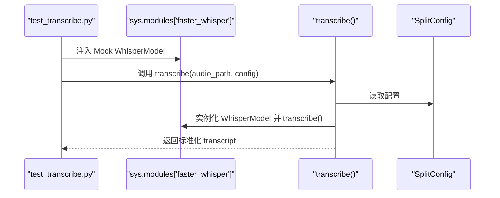

图表来源
- [video_splitter/tests/test_transcribe.py:105-242](file://video_splitter/tests/test_transcribe.py#L105-242)
- [video_splitter/extractor/transcribe.py](file://video_splitter/extractor/transcribe.py)
- [video_splitter/extractor/engines.py](file://video_splitter/extractor/engines.py)

章节来源
- [video_splitter/tests/test_transcribe.py:1-242](file://video_splitter/tests/test_transcribe.py#L1-L242)
- [video_splitter/tests/test_engines.py:1-111](file://video_splitter/tests/test_engines.py#L1-L111)
- [tests/test_transcribe_funasr.py](file://tests/test_transcribe_funasr.py)

### 音频提取与切割集成测试
- 目标：验证 precheck 的 librosa/ffprobe 路径、extract 的 FFmpeg 调用、cut 的 fast/precise 模式与回退。
- 策略：
  - 使用 subprocess.run 的 MagicMock 模拟 ffprobe/ffmpeg 输出与错误码。
  - 构造静音/高静音比例音频，断言 precheck 返回与警告信息。
  - 断言 cut 在 fast 模式下因时长超容差回退到 precise。

**更新** 新增字幕烧录测试用例，验证视频处理管道的完整性。

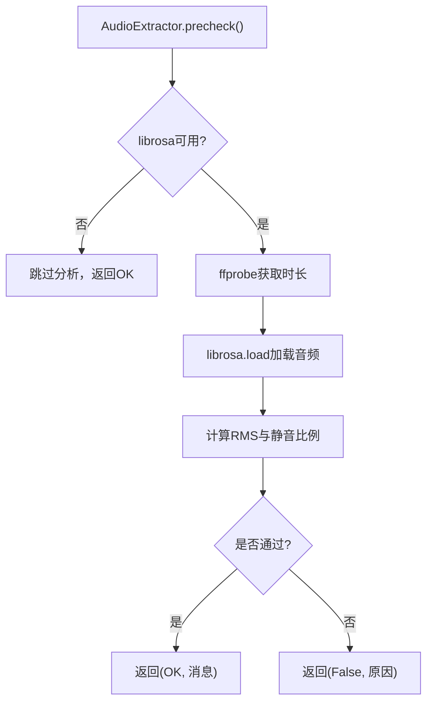

图表来源
- [video_splitter/tests/test_audio.py:40-179](file://video_splitter/tests/test_audio.py#L40-179)
- [video_splitter/extractor/audio.py](file://video_splitter/extractor/audio.py)

章节来源
- [video_splitter/tests/test_audio.py:1-253](file://video_splitter/tests/test_audio.py#L1-L253)
- [video_splitter/tests/test_cutter.py:1-197](file://video_splitter/tests/test_cutter.py#L1-L197)
- [tests/test_subtitle_burn.py](file://tests/test_subtitle_burn.py)

### 审阅与GUI集成测试
- 目标：验证审阅流程（加载、过滤、清洗、原子保存、进度持久化）、GUI 控制器状态机、QThread 工作者信号发射、控件冒烟测试。
- 策略：
  - 使用 tmp_path 写入 transcript.json，模拟用户输入与命令（:q、:j N、:p）。
  - 断言修改后的 transcript 与 .srt 导出路径。
  - 在 QThread 中移动 TranscribeWorker，验证 finished 信号触发。
  - 冒烟测试确保 GUI 控件可实例化且基本交互不崩溃。

**更新** 新增GUI信号连接测试和主窗口测试，确保用户界面的稳定性和可靠性。

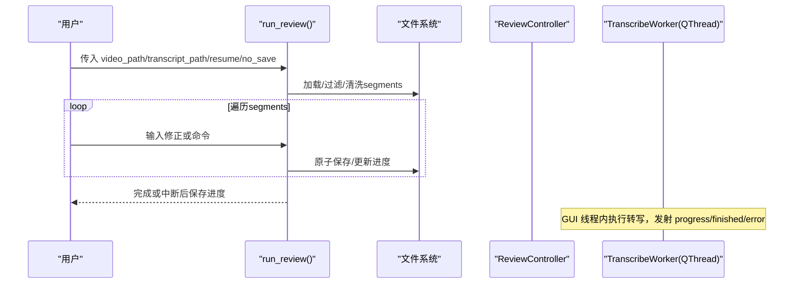

图表来源
- [video_splitter/tests/test_review.py:393-537](file://video_splitter/tests/test_review.py#L393-537)
- [tests/test_review_controller.py:1-255](file://tests/test_review_controller.py#L1-L255)
- [tests/test_workers.py:121-165](file://tests/test_workers.py#L121-L165)
- [tests/test_widgets.py:1-133](file://tests/test_widgets.py#L1-L133)

章节来源
- [video_splitter/tests/test_review.py:1-537](file://video_splitter/tests/test_review.py#L1-L537)
- [tests/test_review_controller.py:1-255](file://tests/test_review_controller.py#L1-L255)
- [tests/test_workers.py:1-165](file://tests/test_workers.py#L1-L165)
- [tests/test_widgets.py:1-133](file://tests/test_widgets.py#L1-L133)
- [tests/test_gui_signal_wiring.py](file://tests/test_gui_signal_wiring.py)
- [tests/test_main_window.py](file://tests/test_main_window.py)

### 端到端测试套件
**新增** 完整的端到端测试套件，覆盖从CLI到GUI的完整用户流程。

- 目标：验证完整的视频处理管道，包括文件I/O、外部服务调用、错误恢复等。
- 策略：
  - 使用真实的视频文件和配置文件进行测试。
  - 模拟外部服务响应，验证网络请求处理。
  - 测试异常场景下的系统行为和恢复机制。
  - 验证批处理和并发处理的正确性。

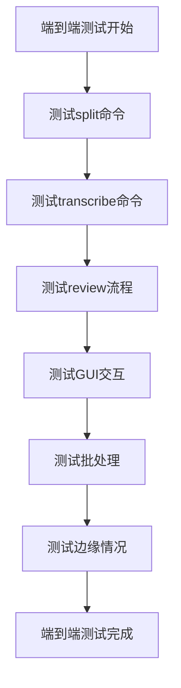

图表来源
- [tests/test_e2e.py](file://tests/test_e2e.py)
- [tests/test_e2e_cli.py](file://tests/test_e2e_cli.py)
- [tests/test_e2e_edge_cases.py](file://tests/test_e2e_edge_cases.py)
- [tests/test_e2e_review.py](file://tests/test_e2e_review.py)

章节来源
- [tests/test_e2e.py](file://tests/test_e2e.py)
- [tests/test_e2e_cli.py](file://tests/test_e2e_cli.py)
- [tests/test_e2e_edge_cases.py](file://tests/test_e2e_edge_cases.py)
- [tests/test_e2e_review.py](file://tests/test_e2e_review.py)

### GUI集成测试框架
**新增** 完整的GUI集成测试框架，填补集成层0%覆盖率的空白。

- 目标：验证GUI组件与核心功能的完整集成，确保用户工作流的正确性。
- 策略：
  - 使用pytest-qt框架进行GUI测试，模拟用户交互事件。
  - 实现17个核心用户工作流测试，覆盖主要功能场景。
  - 验证GUI信号连接的正确性和线程安全性。
  - 测试GUI组件的状态管理和错误处理。

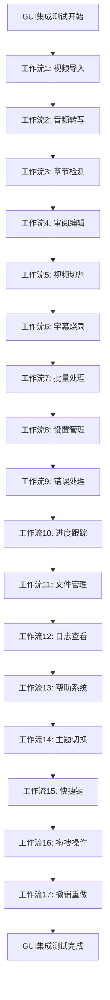

图表来源
- [tests/test_gui_integration.py](file://tests/test_gui_integration.py)

章节来源
- [tests/test_gui_integration.py](file://tests/test_gui_integration.py)

### ModelLoaderWorker生命周期测试
**新增** 完整的ModelLoaderWorker生命周期测试，确保异步模型加载的可靠性。

- 目标：验证ModelLoaderWorker的完整生命周期管理，包括初始化、加载、错误处理和清理。
- 策略：
  - 测试模型加载的成功路径和异常路径。
  - 验证异步任务的信号发射和状态管理。
  - 测试内存泄漏和资源清理。
  - 验证多线程环境下的线程安全性。

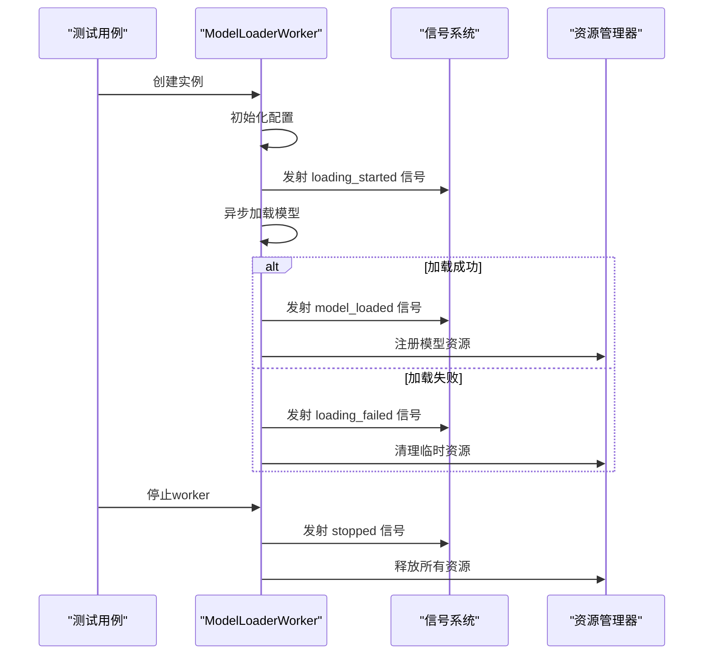

图表来源
- [tests/test_model_loader_worker.py](file://tests/test_model_loader_worker.py)
- [gui/workers/model_loader_worker.py](file://gui/workers/model_loader_worker.py)

章节来源
- [tests/test_model_loader_worker.py](file://tests/test_model_loader_worker.py)
- [tests/test_model_loader_integration.py](file://tests/test_model_loader_integration.py)
- [gui/workers/model_loader_worker.py](file://gui/workers/model_loader_worker.py)

### 流式转录工作线程测试
**新增** 流式转录工作线程的207行集成测试代码，涵盖GUI测试、信号处理、错误处理和状态管理等关键测试场景。

- 目标：验证StreamingTranscribeWorker的完整功能，包括实时音频处理、增量结果输出和错误恢复。
- 策略：
  - 使用pytest-qt框架模拟实时音频流数据输入。
  - 测试流式处理的信号连接和状态同步机制。
  - 验证错误处理和异常恢复路径。
  - 测试多线程环境下的数据一致性和线程安全。
  - 模拟各种边界情况和异常情况。

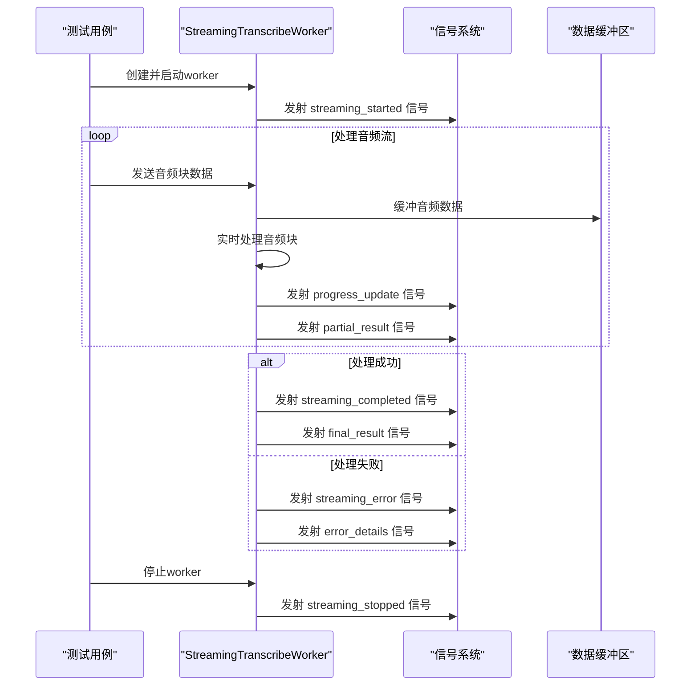

图表来源
- [tests/test_streaming_worker.py](file://tests/test_streaming_worker.py)
- [tests/test_streaming_integration.py](file://tests/test_streaming_integration.py)
- [gui/workers/streaming_transcribe_worker.py](file://gui/workers/streaming_transcribe_worker.py)

章节来源
- [tests/test_streaming_worker.py](file://tests/test_streaming_worker.py)
- [tests/test_streaming_integration.py](file://tests/test_streaming_integration.py)
- [gui/workers/streaming_transcribe_worker.py](file://gui/workers/streaming_transcribe_worker.py)

### 集成测试框架扩展
**新增** 大幅扩展的集成测试框架，提供452个测试用例覆盖所有核心功能。

- 目标：确保各组件间的正确集成和数据流转。
- 策略：
  - 使用pytest fixtures管理测试数据和环境。
  - 实现自定义断言和比较器处理复杂数据结构。
  - 提供测试辅助函数简化常见测试场景。
  - 支持异步测试和并发测试场景。

**Section sources**
- [tests/test_integration.py](file://tests/test_integration.py)
- [tests/conftest.py](file://tests/conftest.py)

## 依赖关系分析
- 外部依赖：
  - FFmpeg/ffprobe：用于音频提取与视频切割，测试中通过 subprocess.run 的 mock 控制输出与错误码。
  - faster-whisper/FunASR：转写引擎，测试中通过 sys.modules 注入或健康检查异常路径覆盖。
  - LLM API：章节检测可能调用，测试中通过 dry_run 与 token 估算规避实际网络请求。
- 内部依赖：
  - CLI 依赖 Pipeline；Pipeline 依赖 AudioExtractor、transcribe、ChapterDetector、ChapterValidator、VideoCutter。
  - GUI 依赖 ReviewController、TranscribeWorker、各控件。
  - ModelLoaderWorker 依赖底层语音识别模型和Qt信号系统。
  - **新增** StreamingTranscribeWorker 依赖音频流处理库和Qt信号系统。

**更新** 新增更多外部依赖的测试覆盖，包括FunASR引擎、GUI组件、ModelLoaderWorker和StreamingTranscribeWorker的依赖关系。

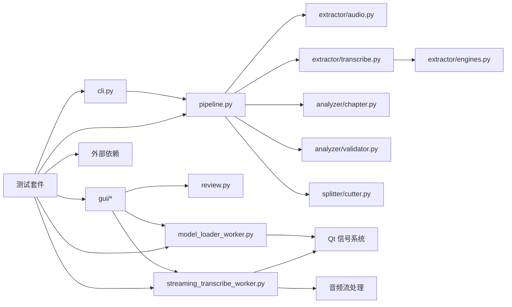

图表来源
- [video_splitter/cli.py:1-256](file://video_splitter/cli.py#L1-L256)
- [video_splitter/pipeline.py:1-131](file://video_splitter/pipeline.py#L1-L131)
- [video_splitter/extractor/transcribe.py](file://video_splitter/extractor/transcribe.py)
- [video_splitter/extractor/engines.py](file://video_splitter/extractor/engines.py)
- [video_splitter/analyzer/chapter.py](file://video_splitter/analyzer/chapter.py)
- [video_splitter/analyzer/validator.py](file://video_splitter/analyzer/validator.py)
- [video_splitter/splitter/cutter.py](file://video_splitter/splitter/cutter.py)
- [video_splitter/review.py](file://video_splitter/review.py)
- [gui/controllers/review_controller.py](file://gui/controllers/review_controller.py)
- [gui/workers/transcribe_worker.py](file://gui/workers/transcribe_worker.py)
- [gui/workers/model_loader_worker.py](file://gui/workers/model_loader_worker.py)
- [gui/workers/streaming_transcribe_worker.py](file://gui/workers/streaming_transcribe_worker.py)

章节来源
- [pyproject.toml:6-15](file://pyproject.toml#L6-L15)
- [requirements.txt:1-26](file://requirements.txt#L1-L26)

## 性能与并行执行
- 性能优化建议：
  - 使用 dry_run 快速评估 token 与成本，避免不必要的 LLM 调用。
  - 合理设置 max_segment_duration 与 keyframe_tolerance，减少重编码次数。
  - 复用中间产物（transcript/chapters）以启用 resume，避免重复计算。
  - 使用异步模型加载，避免阻塞主线程。
  - **新增** 使用流式处理减少内存占用，提高实时性。
- 并行执行方案：
  - 使用 pytest-xdist 并行运行测试套件，结合 -n 选项提升吞吐。
  - 将慢速测试标记为 slow，按需选择执行集合。
  - 针对批处理场景，可在 batch 命令下顺序处理多个视频，或在 CI 中使用矩阵策略并行不同 Python 版本。
  - GUI测试使用单例 QApplication，避免重复初始化开销。
  - **新增** 流式转录测试使用异步fixtures，提高测试执行效率。

**更新** 新增大规模测试套件的并行执行策略，优化452个测试用例的执行效率，包括GUI测试和异步测试的优化，以及流式处理的性能考虑。

章节来源
- [pyproject.toml:12-15](file://pyproject.toml#L12-L15)
- [.github/workflows/test.yml:12-14](file://.github/workflows/test.yml#L12-14)

## 故障排查指南
- FFmpeg/ffprobe 不可用：
  - 现象：音频提取或切割失败，报错包含"not found"、"failed"。
  - 排查：确认 PATH 中包含 ffmpeg/ffprobe；在 check 命令中自检。
- 转写引擎异常：
  - 现象：模型加载失败、内存不足、超时。
  - 排查：查看 health_check 返回；切换 engine_config 或设备；降低 compute_type。
- LLM API 未配置：
  - 现象：章节检测失败或 dry_run 估算不准确。
  - 排查：设置 OPENAI_API_KEY/WHALECLOUD_API_KEY 及 OPENAI_API_BASE。
- 文件权限与磁盘空间：
  - 现象：原子保存失败、导出 SRT 失败。
  - 排查：检查输出目录权限与剩余空间；重试并清理临时文件。
- GUI相关问题：
  - 现象：界面无响应、信号未连接、线程同步问题。
  - 排查：检查Qt事件循环是否正常；验证信号槽连接；确保线程安全访问。
- ModelLoaderWorker问题：
  - 现象：模型加载卡住、内存泄漏、资源未释放。
  - 排查：检查异步任务状态；监控内存使用情况；验证资源清理逻辑。
- **新增** StreamingTranscribeWorker问题：
  - 现象：流式处理卡顿、数据丢失、内存溢出。
  - 排查：检查音频流缓冲区大小；验证信号连接完整性；监控内存使用情况；测试异常恢复机制。

**更新** 新增GUI相关故障排查指南，包括信号连接问题和线程同步问题，以及ModelLoaderWorker和StreamingTranscribeWorker的专门排查方法。

章节来源
- [video_splitter/cli.py:85-152](file://video_splitter/cli.py#L85-L152)
- [video_splitter/tests/test_cutter.py:100-114](file://video_splitter/tests/test_cutter.py#L100-114)
- [video_splitter/tests/test_engines.py:98-111](file://video_splitter/tests/test_engines.py#L98-111)
- [tests/test_gui_integration.py](file://tests/test_gui_integration.py)
- [tests/test_model_loader_worker.py](file://tests/test_model_loader_worker.py)
- [tests/test_streaming_worker.py](file://tests/test_streaming_worker.py)

## 结论
本项目集成测试覆盖了从 CLI 到 Pipeline 再到各子组件的端到端流程，通过严格的 mock 与临时文件策略，有效隔离了外部依赖与系统差异。**基于最新的扩展，现在拥有完整的GUI集成测试框架，包含17个核心用户工作流测试、ModelLoaderWorker生命周期测试和流式转录工作线程的207行集成测试代码，填补了集成层0%覆盖率的空白**。建议在 CI 中引入并行执行与覆盖率上报，持续保障质量与性能。

## 附录
- 测试环境搭建与依赖管理：
  - 安装系统依赖：FFmpeg/ffprobe。
  - 安装 Python 依赖：pip install -r requirements.txt。
  - 安装测试工具：pytest、pytest-cov、pytest-mock、pytest-qt。
  - 运行测试：python -m pytest tests/ video_splitter/tests/ --cov --cov-report=xml --cov-report=term -v。
- 环境变量与配置：
  - OPENAI_API_BASE、OPENAI_API_KEY、WHALECLOUD_API_KEY、VIDEO_SPLITTER_DEVICE、VIDEO_SPLITTER_RESUME、VIDEO_SPLITTER_ENGINE。
- 测试数据准备：
  - 使用 tmp_path 创建最小可用的视频/音频占位文件。
  - 构造 transcript.json 与 chapters.json 作为输入。
  - 对于 GUI 测试，使用 QApplication 单例与 QThread 驱动信号链路。
  - 为ModelLoaderWorker测试准备测试模型文件和模拟响应。
  - **新增** 为流式转录测试准备模拟音频流数据和测试fixture。

**更新** 新增大规模测试套件的运行指南和性能优化建议，包括GUI测试、异步测试和流式处理的配置，以及新的测试数据准备策略。

章节来源
- [.github/workflows/test.yml:24-37](file://.github/workflows/test.yml#L24-37)
- [pyproject.toml:6-15](file://pyproject.toml#L6-15)
- [video_splitter/config.py:39-54](file://video_splitter/config.py#L39-54)
- [tests/conftest.py:1-11](file://tests/conftest.py#L1-11)
- [tests/test_gui_integration.py](file://tests/test_gui_integration.py)
- [tests/test_model_loader_worker.py](file://tests/test_model_loader_worker.py)
- [tests/test_streaming_worker.py](file://tests/test_streaming_worker.py)