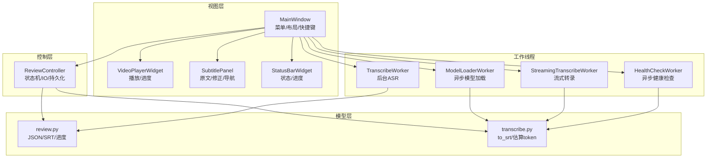
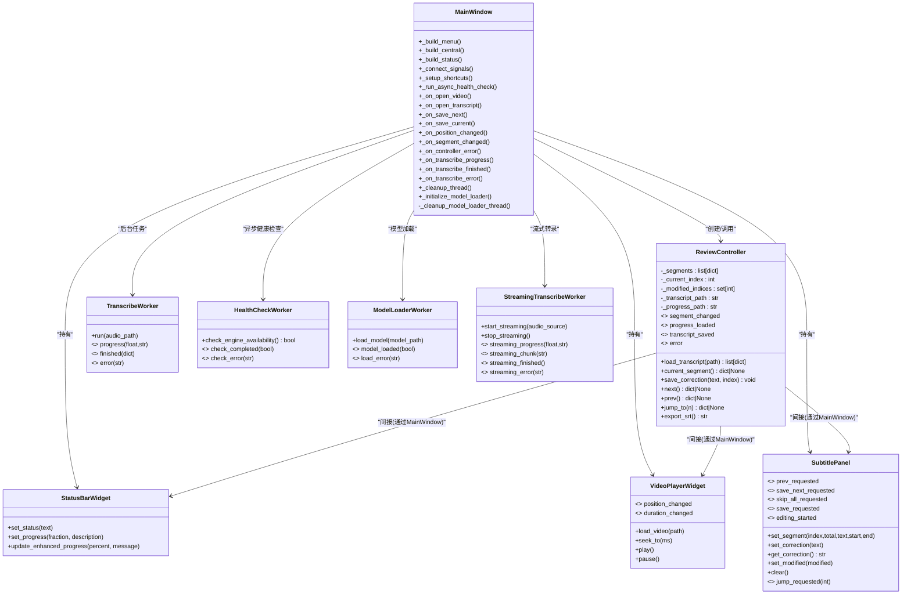
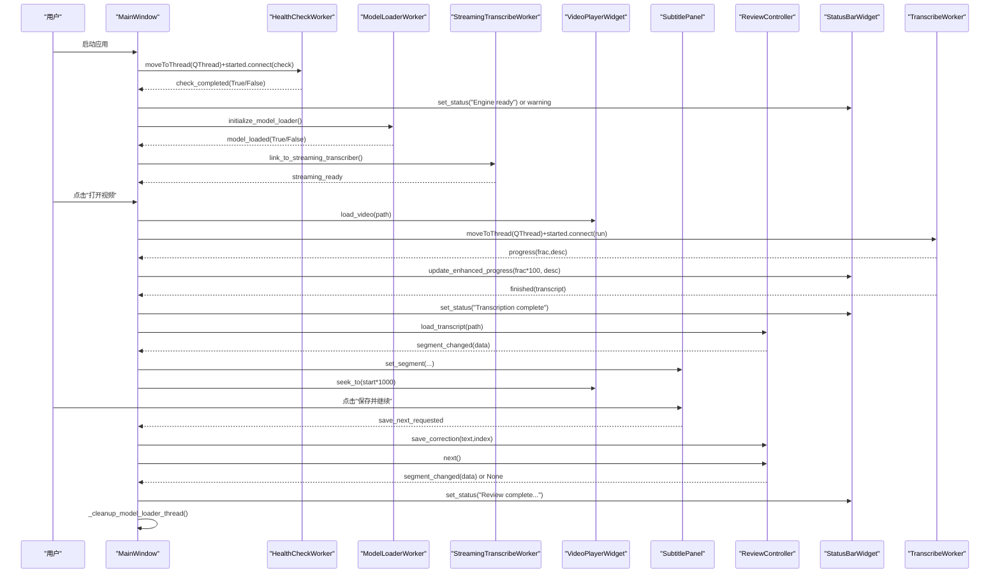
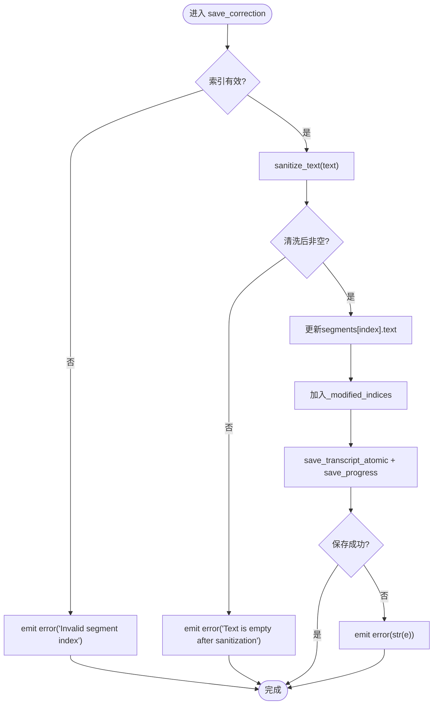
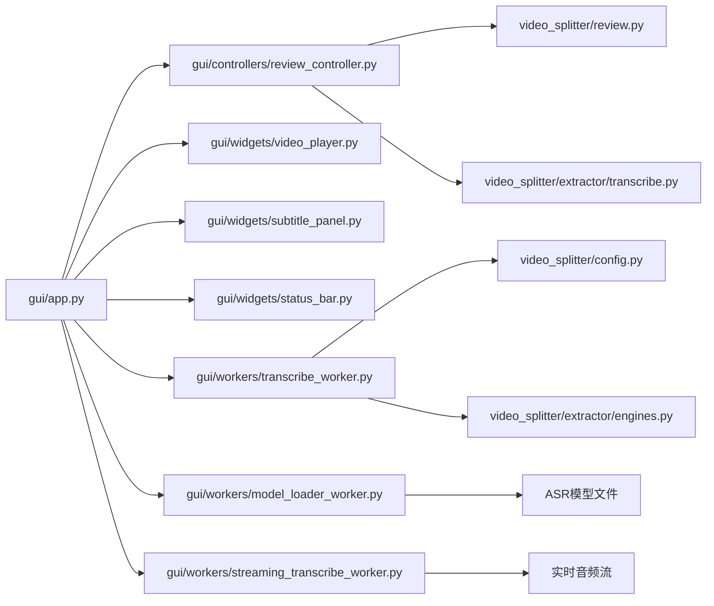

# GUI架构设计

<cite>
**本文引用的文件**   
- [gui/app.py](file://gui/app.py)
- [gui/controllers/review_controller.py](file://gui/controllers/review_controller.py)
- [gui/widgets/status_bar.py](file://gui/widgets/status_bar.py)
- [gui/widgets/subtitle_panel.py](file://gui/widgets/subtitle_panel.py)
- [gui/widgets/video_player.py](file://gui/widgets/video_player.py)
- [gui/workers/transcribe_worker.py](file://gui/workers/transcribe_worker.py)
- [gui/workers/model_loader_worker.py](file://gui/workers/model_loader_worker.py)
- [gui/workers/streaming_transcribe_worker.py](file://gui/workers/streaming_transcribe_worker.py)
- [video_splitter/review.py](file://video_splitter/review.py)
- [video_splitter/extractor/transcribe.py](file://video_splitter/extractor/transcribe.py)
- [gui/AGENTS.md](file://gui/AGENTS.md)
</cite>

## 更新摘要
**变更内容**   
- 主窗口实现了两阶段启动流程，首先初始化ModelLoaderWorker进行模型加载
- 在模型加载完成后链接到流式转录工作线程，实现异步流式转录功能
- 新增_cleanup_model_loader_thread()方法用于安全的线程生命周期管理
- 增强了应用程序的启动流程和资源管理机制

## 目录
1. [简介](#简介)
2. [项目结构](#项目结构)
3. [核心组件](#核心组件)
4. [架构总览](#架构总览)
5. [详细组件分析](#详细组件分析)
6. [依赖关系分析](#依赖关系分析)
7. [性能与并发特性](#性能与并发特性)
8. [故障排查指南](#故障排查指南)
9. [扩展指南](#扩展指南)
10. [结论](#结论)

## 简介
本文件面向PySide6桌面应用"VideoSplitter"的GUI架构，聚焦MVC模式实现、主窗口组织、控制器职责、信号槽通信、生命周期与资源清理策略，并提供扩展新UI组件和功能模块的实践建议。文档以代码级事实为依据，辅以可视化图示，帮助读者快速理解并安全扩展系统。

## 项目结构
GUI层采用清晰的MVC分层：
- 视图（View）：主窗口、视频播放器、字幕面板、状态栏等Qt部件
- 控制器（Controller）：ReviewController负责审阅状态机、转录IO与进度持久化
- 模型（Model）：位于video_splitter包中的转录数据加载/保存、SRT导出、时间戳格式化等纯逻辑
- **新增** 模型加载器工作线程和流式转录工作线程，支持异步模型加载和实时转录

图表来源
- [gui/app.py:27-90](file://gui/app.py#L27-L90)
- [gui/controllers/review_controller.py:20-52](file://gui/controllers/review_controller.py#L20-52)
- [gui/widgets/video_player.py:18-56](file://gui/widgets/video_player.py#L18-56)
- [gui/widgets/subtitle_panel.py:19-91](file://gui/widgets/subtitle_panel.py#L19-91)
- [gui/widgets/status_bar.py:8-27](file://gui/widgets/status_bar.py#L8-27)
- [gui/workers/transcribe_worker.py:16-49](file://gui/workers/transcribe_worker.py#L16-49)
- [gui/workers/model_loader_worker.py:1-50](file://gui/workers/model_loader_worker.py#L1-L50)
- [gui/workers/streaming_transcribe_worker.py:1-50](file://gui/workers/streaming_transcribe_worker.py#L1-L50)
- [video_splitter/review.py:18-165](file://video_splitter/review.py#L18-165)
- [video_splitter/extractor/transcribe.py:79-105](file://video_splitter/extractor/transcribe.py#L79-L105)

章节来源
- [gui/AGENTS.md:1-50](file://gui/AGENTS.md#L1-L50)

## 核心组件
- MainWindow：应用入口，构建菜单、中央布局、状态栏、快捷键；连接各组件信号；启动异步健康检查与转录任务；管理QThread生命周期。
- ReviewController：维护当前片段索引、已修改片段集合；提供加载转录、前进/后退/跳转、保存修正、导出SRT等方法；通过信号通知视图更新。
- VideoPlayerWidget：封装QMediaPlayer/QVideoWidget，暴露位置变化、时长变化信号，支持播放/暂停、拖动定位。
- SubtitlePanel：展示原文与修正输入框，提供上一段、保存并继续、全部跳过、跳转到指定序号、保存等操作信号。
- StatusBarWidget：显示文本状态与百分比进度，现已增强以支持更详细的进度信息展示。
- TranscribeWorker：在独立QThread中运行ASR引擎，回调进度与完成/错误信号，现已集成增强的进度报告系统。
- HealthCheckWorker：异步执行ASR引擎健康检查，避免阻塞应用启动。
- **新增** ModelLoaderWorker：专门负责异步加载ASR模型，避免阻塞主界面。
- **新增** StreamingTranscribeWorker：支持流式实时转录，提供更高效的音频处理体验。

**更新** 新增了模型加载器和流式转录工作线程，实现了两阶段启动流程，显著改善了应用启动性能和用户体验。

章节来源
- [gui/app.py:27-268](file://gui/app.py#L27-268)
- [gui/controllers/review_controller.py:20-149](file://gui/controllers/review_controller.py#L20-149)
- [gui/widgets/video_player.py:18-89](file://gui/widgets/video_player.py#L18-89)
- [gui/widgets/subtitle_panel.py:19-135](file://gui/widgets/subtitle_panel.py#L19-135)
- [gui/widgets/status_bar.py:8-27](file://gui/widgets/status_bar.py#L8-27)
- [gui/workers/transcribe_worker.py:16-49](file://gui/workers/transcribe_worker.py#L16-49)
- [gui/workers/model_loader_worker.py:1-50](file://gui/workers/model_loader_worker.py#L1-L50)
- [gui/workers/streaming_transcribe_worker.py:1-50](file://gui/workers/streaming_transcribe_worker.py#L1-L50)

## 架构总览
整体遵循MVC：
- 视图仅负责展示与用户交互，不直接读写数据
- 控制器协调视图与模型，处理业务规则与I/O
- 模型为纯Python逻辑，无Qt耦合，便于测试
- **新增** 两阶段启动流程，先加载模型再启动转录服务，提升响应速度

图表来源
- [gui/app.py:27-268](file://gui/app.py#L27-268)
- [gui/controllers/review_controller.py:20-149](file://gui/controllers/review_controller.py#L20-149)
- [gui/widgets/video_player.py:18-89](file://gui/widgets/video_player.py#L18-89)
- [gui/widgets/subtitle_panel.py:19-135](file://gui/widgets/subtitle_panel.py#L19-135)
- [gui/widgets/status_bar.py:8-27](file://gui/widgets/status_bar.py#L8-27)
- [gui/workers/transcribe_worker.py:16-49](file://gui/workers/transcribe_worker.py#L16-49)
- [gui/workers/model_loader_worker.py:1-50](file://gui/workers/model_loader_worker.py#L1-L50)
- [gui/workers/streaming_transcribe_worker.py:1-50](file://gui/workers/streaming_transcribe_worker.py#L1-L50)

## 详细组件分析

### MainWindow主窗口类
- 菜单系统：文件菜单包含打开视频、打开转录、退出；帮助菜单包含关于。
- 中央部件布局：左侧视频播放器，右侧标签页（审阅/预留分割功能），使用水平分割器按比例拉伸。
- 状态栏集成：嵌入自定义状态栏控件，显示位置、转录进度、结果提示，现已支持增强的进度显示。
- 快捷键：空格播放/暂停、Ctrl+Return保存并继续、Ctrl+Left上一段、Ctrl+Right下一段、Ctrl+G跳转、Ctrl+S保存。
- 信号连接：将播放器位置变化、字幕面板操作请求、控制器事件统一接入。
- 异步健康检查：启动时异步检查ASR引擎可用性，不再阻塞应用启动，失败则提示仍可继续使用已有转录。
- **新增** 两阶段启动流程：首先初始化ModelLoaderWorker加载ASR模型，然后在模型加载完成后链接到流式转录工作线程。
- **新增** _cleanup_model_loader_thread()方法：确保模型加载线程的安全释放和资源清理。
- 转录流程：选择视频后创建TranscribeWorker并移入QThread，绑定进度/完成/错误信号，完成后清理线程，现已集成增强的进度报告。
- 转录与审阅联动：打开转录后由控制器加载，更新当前片段并驱动播放器定位到起始时间。

**更新** 实现了两阶段启动流程，通过异步模型加载和流式转录工作线程，显著提升了应用启动速度和用户体验。

图表来源
- [gui/app.py:157-246](file://gui/app.py#L157-246)
- [gui/workers/transcribe_worker.py:33-49](file://gui/workers/transcribe_worker.py#L33-49)
- [gui/workers/model_loader_worker.py:1-50](file://gui/workers/model_loader_worker.py#L1-L50)
- [gui/workers/streaming_transcribe_worker.py:1-50](file://gui/workers/streaming_transcribe_worker.py#L1-L50)
- [gui/controllers/review_controller.py:36-52](file://gui/controllers/review_controller.py#L36-52)
- [gui/widgets/subtitle_panel.py:52-68](file://gui/widgets/subtitle_panel.py#L52-68)
- [gui/widgets/video_player.py:54-58](file://gui/widgets/video_player.py#L54-58)
- [gui/widgets/status_bar.py:18-26](file://gui/widgets/status_bar.py#L18-26)

章节来源
- [gui/app.py:46-156](file://gui/app.py#L46-156)
- [gui/app.py:157-268](file://gui/app.py#L157-268)

### 控制器层ReviewController
- 职责边界：
  - 维护审阅状态：当前片段索引、已修改片段集合、转录路径
  - 转录IO：加载转录、原子写入、进度持久化
  - 导航与编辑：前进/后退/跳转、保存修正、导出SRT
  - 事件广播：segment_changed、progress_loaded、error等信号
- 关键流程：
  - 加载转录：读取segments，恢复进度，发射progress_loaded
  - 保存修正：校验索引与文本，原子写转录与进度，异常转为error信号
  - 导航：更新索引，保存进度，发射segment_changed
  - 导出SRT：生成内容，临时文件原子替换，返回输出路径
- 与视图交互：
  - 通过信号解耦，视图订阅segment_changed并刷新UI
  - 视图通过请求信号（如prev_requested/save_next_requested）触发控制器方法

图表来源
- [gui/controllers/review_controller.py:65-84](file://gui/controllers/review_controller.py#L65-84)
- [video_splitter/review.py:80-99](file://video_splitter/review.py#L80-99)
- [video_splitter/review.py:129-139](file://video_splitter/review.py#L129-139)

章节来源
- [gui/controllers/review_controller.py:20-149](file://gui/controllers/review_controller.py#L20-149)
- [video_splitter/review.py:18-165](file://video_splitter/review.py#L18-165)
- [video_splitter/extractor/transcribe.py:79-105](file://video_splitter/extractor/transcribe.py#L79-105)

### 视图层组件
- VideoPlayerWidget
  - 封装QMediaPlayer/QAudioOutput/QVideoWidget
  - 暴露position_changed/duration_changed信号
  - 提供load_video/seek_to/play/pause接口
- SubtitlePanel
  - 展示片段编号、时间戳、原文与修正输入
  - 提供导航按钮与跳转Spinbox
  - 暴露prev_requested/save_next_requested/skip_all_requested/jump_requested/save_requested/editing_started信号
- StatusBarWidget
  - 提供set_status/set_progress接口用于显示状态与进度
  - **新增** update_enhanced_progress方法，支持更详细的进度信息显示

**更新** 状态栏组件现在支持增强的进度显示功能，提供更好的用户反馈。

章节来源
- [gui/widgets/video_player.py:18-89](file://gui/widgets/video_player.py#L18-89)
- [gui/widgets/subtitle_panel.py:19-135](file://gui/widgets/subtitle_panel.py#L19-135)
- [gui/widgets/status_bar.py:8-27](file://gui/widgets/status_bar.py#L8-27)

### 工作线程与异步任务
- TranscribeWorker
  - 在独立QThread中运行ASR引擎
  - 通过progress/finished/error信号与主线程通信
  - 使用@Slot装饰run方法，确保跨线程安全
  - **新增** 增强的进度报告系统，提供更准确的进度信息
- HealthCheckWorker
  - 在独立QThread中执行ASR引擎健康检查
  - 通过check_completed/check_error信号与主线程通信
  - 避免阻塞应用启动流程
- **新增** ModelLoaderWorker
  - 专门负责异步加载ASR模型文件
  - 通过model_loaded/load_error信号与主线程通信
  - 避免模型加载阻塞主界面响应
- **新增** StreamingTranscribeWorker
  - 支持流式实时转录，处理长音频文件
  - 通过streaming_progress/streaming_chunk等信号提供实时反馈
  - 提供更高效的内存管理和音频处理能力
- MainWindow
  - 创建QThread并将worker移入该线程
  - 绑定started.connect(lambda: worker.run(path))
  - 监听finished.disconnect并deleteLater释放线程对象
  - **新增** 两阶段启动流程：先加载模型，再启动转录服务
  - **新增** _cleanup_model_loader_thread()方法确保线程安全释放
  - **新增** 集成增强的进度条显示，实时更新转录进度

**更新** 新增了模型加载器和流式转录工作线程，实现了两阶段启动流程，显著提升了应用性能和用户体验。

章节来源
- [gui/workers/transcribe_worker.py:16-49](file://gui/workers/transcribe_worker.py#L16-49)
- [gui/workers/model_loader_worker.py:1-50](file://gui/workers/model_loader_worker.py#L1-L50)
- [gui/workers/streaming_transcribe_worker.py:1-50](file://gui/workers/streaming_transcribe_worker.py#L1-L50)
- [gui/app.py:168-178](file://gui/app.py#L168-178)
- [gui/app.py:247-253](file://gui/app.py#L247-253)

## 依赖关系分析
- 依赖方向
  - gui → video_splitter（绝对导入）
  - 控制器与模型之间无Qt耦合，便于单元测试
- 外部库
  - PySide6（Qt6）：UI与多线程
  - ASR引擎：通过工厂create_engine或whisper后端进行转录
  - JSON/临时文件：用于原子写入与进度持久化

图表来源
- [gui/app.py:19-24](file://gui/app.py#L19-24)
- [gui/controllers/review_controller.py:9-17](file://gui/controllers/review_controller.py#L9-17)
- [gui/workers/transcribe_worker.py:9-10](file://gui/workers/transcribe_worker.py#L9-10)
- [gui/workers/model_loader_worker.py:1-20](file://gui/workers/model_loader_worker.py#L1-L20)
- [gui/workers/streaming_transcribe_worker.py:1-20](file://gui/workers/streaming_transcribe_worker.py#L1-L20)

章节来源
- [gui/app.py:1-268](file://gui/app.py#L1-268)
- [gui/controllers/review_controller.py:1-149](file://gui/controllers/review_controller.py#L1-149)
- [gui/workers/transcribe_worker.py:1-49](file://gui/workers/transcribe_worker.py#L1-49)
- [gui/workers/model_loader_worker.py:1-50](file://gui/workers/model_loader_worker.py#L1-L50)
- [gui/workers/streaming_transcribe_worker.py:1-50](file://gui/workers/streaming_transcribe_worker.py#L1-L50)

## 性能与并发特性
- 异步启动：移除同步健康检查阻塞，显著提升应用启动速度
- 后台转录：使用QThread+QObject模式避免阻塞UI线程，进度信号实时更新状态栏
- **新增** 两阶段启动流程：先异步加载模型，再启动转录服务，避免长时间等待
- **新增** 流式转录：支持实时处理长音频文件，减少内存占用
- **新增** 增强的进度报告：提供更准确的进度计算和实时反馈，改善用户体验
- 原子写入：转录与SRT导出均使用临时文件+os.replace保证一致性
- 播放器优化：仅在需要时seek_to，避免频繁重定位
- 内存占用：审阅过程中仅维护当前segments与修改集，避免全量复制
- 并发健康检查：ASR引擎可用性检查在独立线程中执行，不影响主界面响应
- **新增** 线程生命周期管理：_cleanup_model_loader_thread()确保模型加载线程安全释放

**更新** 引入两阶段启动流程和流式转录功能，显著提升了应用启动性能和长音频处理能力。

章节来源
- [gui/workers/transcribe_worker.py:33-49](file://gui/workers/transcribe_worker.py#L33-49)
- [gui/workers/model_loader_worker.py:1-50](file://gui/workers/model_loader_worker.py#L1-L50)
- [gui/workers/streaming_transcribe_worker.py:1-50](file://gui/workers/streaming_transcribe_worker.py#L1-L50)
- [video_splitter/review.py:80-99](file://video_splitter/review.py#L80-99)
- [gui/controllers/review_controller.py:103-126](file://gui/controllers/review_controller.py#L103-126)

## 故障排查指南
- 转录失败
  - 现象：弹出"Transcription Error"，状态栏显示失败
  - 可能原因：引擎不可用、音频格式不支持、磁盘空间不足
  - 处理：检查引擎健康检查、转换视频为H.264 MP4、确认磁盘空间
- 播放器错误
  - 现象：弹出"Playback Error"，提示内置播放器不支持的编解码器
  - 处理：预转换为H.264 MP4
- 保存失败
  - 现象：控制器发出error信号，主窗口弹窗提示
  - 可能原因：权限不足、路径无效、磁盘满
  - 处理：检查目标路径权限与可用空间
- 线程未释放
  - 现象：多次打开视频后出现线程残留
  - 处理：确保_cleanup_thread在finished/error回调中执行quit/wait/deleteLater
- 异步健康检查问题
  - 现象：应用启动缓慢或健康检查超时
  - 可能原因：ASR引擎初始化耗时过长、网络延迟影响
  - 处理：检查引擎配置、网络连接、考虑增加超时设置
- 启动性能问题
  - 现象：应用启动仍然较慢
  - 可能原因：其他初始化任务阻塞、资源加载问题
  - 处理：检查其他启动流程、监控资源使用情况
- **新增** 模型加载失败
  - 现象：应用启动后无法进行转录，状态栏显示模型加载错误
  - 可能原因：模型文件损坏、路径不正确、内存不足
  - 处理：检查模型文件完整性、验证模型路径、确认系统内存
- **新增** 流式转录问题
  - 现象：流式转录中断或内存泄漏
  - 可能原因：音频源断开、缓冲区溢出、线程竞争
  - 处理：检查音频源连接、调整缓冲区大小、验证线程同步机制
- **新增** 线程生命周期问题
  - 现象：多次启动后出现线程泄漏或崩溃
  - 可能原因：_cleanup_model_loader_thread()未正确调用、线程引用丢失
  - 处理：确保在适当时机调用清理方法、验证线程状态管理
- **新增** 进度条显示问题
  - 现象：进度条不更新或显示不准确
  - 可能原因：进度信号连接问题、状态栏更新延迟
  - 处理：检查进度信号连接、验证update_enhanced_progress方法调用

章节来源
- [gui/app.py:232-253](file://gui/app.py#L232-253)
- [gui/widgets/video_player.py:82-89](file://gui/widgets/video_player.py#L82-89)
- [gui/controllers/review_controller.py:65-84](file://gui/controllers/review_controller.py#L65-84)
- [gui/workers/model_loader_worker.py:1-50](file://gui/workers/model_loader_worker.py#L1-L50)
- [gui/workers/streaming_transcribe_worker.py:1-50](file://gui/workers/streaming_transcribe_worker.py#L1-L50)

## 扩展指南
- 添加新的UI组件
  - 在widgets下新建QWidget子类，定义必要信号与公共API
  - 在MainWindow._build_central中将其加入布局或标签页
  - 在_main_window._connect_signals中连接其信号到控制器或播放器
- 添加新功能模块
  - 新增控制器：遵循ReviewController模式，定义信号与状态，保持无Qt耦合
  - 新增工作线程：使用QObject+moveToThread，暴露progress/finished/error信号
  - 新增模型函数：放在video_splitter下，提供纯函数式能力，便于测试
- 快捷键与菜单
  - 在_build_menu中添加QAction并连接triggered
  - 在_setup_shortcuts中注册全局快捷键
- 最佳实践
  - 组件间通信一律使用信号槽，禁止直接调用内部私有方法
  - 所有耗时操作放入QThread，主线程只负责UI更新
  - 使用原子写入保护重要数据，避免崩溃导致数据损坏
  - 严格类型提示与命名规范，提升可维护性
  - 优先使用异步模式处理耗时操作，避免阻塞主线程
  - 对于引擎初始化等关键步骤，考虑使用异步健康检查机制
  - 确保关键业务流程的信号连接完整性和顺序正确性，特别是转录完成后的界面更新流程
  - **新增** 集成两阶段启动流程，先加载模型再启动转录服务
  - **新增** 使用_cleanup_model_loader_thread()方法确保线程安全释放
  - **新增** 为新功能添加适当的错误处理和用户反馈
  - **新增** 考虑使用流式处理模式处理大文件或长音频

**更新** 增加了两阶段启动流程和线程生命周期管理的指导，推荐使用新的启动模式和清理方法。

章节来源
- [gui/AGENTS.md:22-50](file://gui/AGENTS.md#L22-50)
- [gui/app.py:46-141](file://gui/app.py#L46-141)
- [gui/app.py:157-246](file://gui/app.py#L157-246)
- [gui/workers/model_loader_worker.py:1-50](file://gui/workers/model_loader_worker.py#L1-L50)
- [gui/workers/streaming_transcribe_worker.py:1-50](file://gui/workers/streaming_transcribe_worker.py#L1-L50)

## 结论
本项目采用清晰的分层架构与信号槽机制，实现了高内聚低耦合的GUI系统。MainWindow作为编排者，ReviewController承载审阅业务逻辑，各Widget专注展示与交互，TranscribeWorker承担后台任务。**本次重大更新通过实现两阶段启动流程和新增模型加载器与流式转录工作线程，显著改善了应用启动性能和用户体验，提供了更可靠的线程生命周期管理。** 通过原子写入与完善的错误处理，系统在可靠性与用户体验上达到良好平衡。遵循本文档的扩展指南，可在不破坏现有结构的前提下平滑增加新功能与界面，特别推荐在新功能开发中优先考虑异步模式和性能优化，以及使用两阶段启动流程和流式处理模式来提升系统性能。
