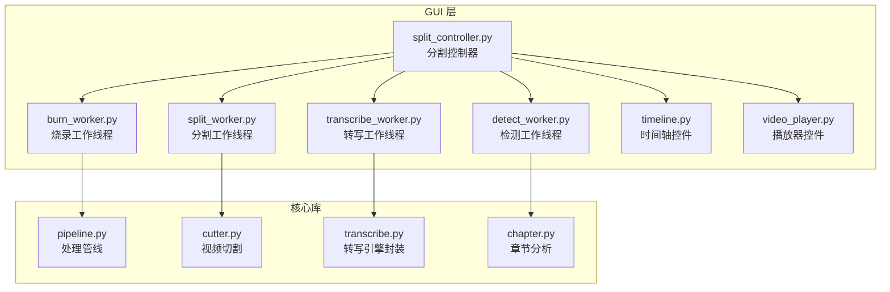
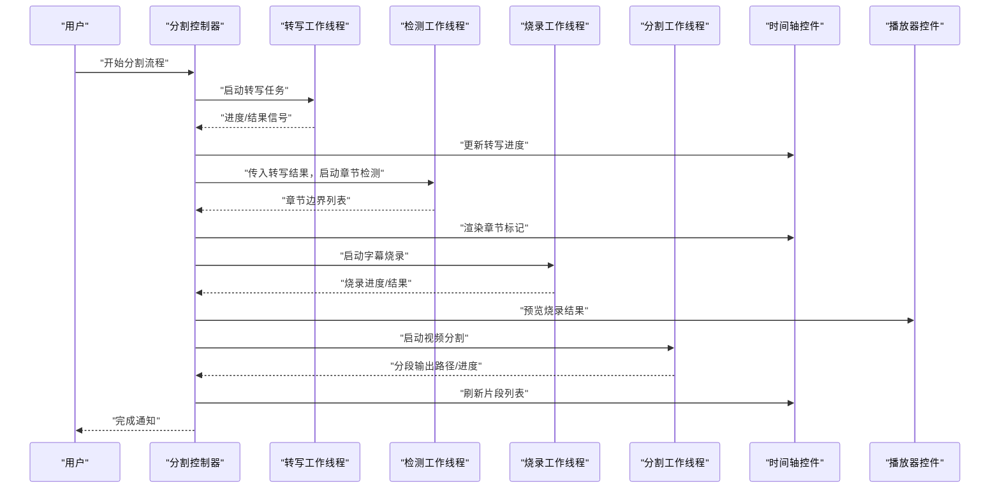
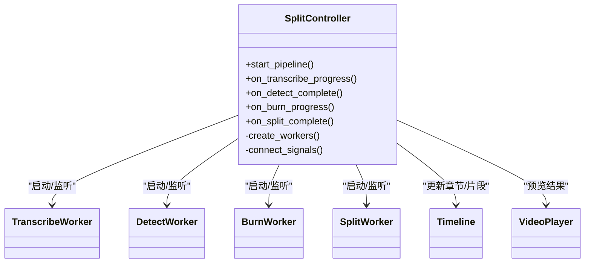
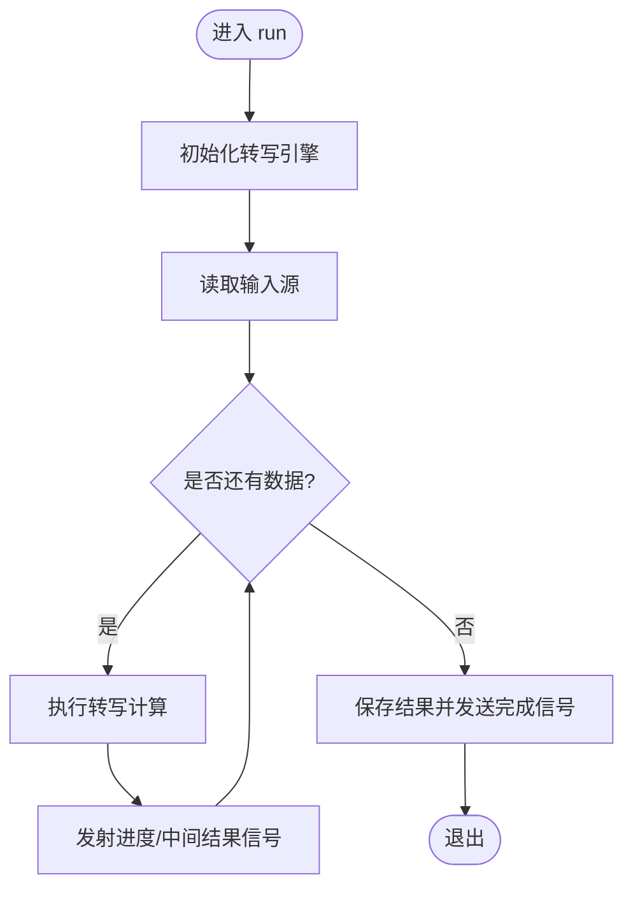
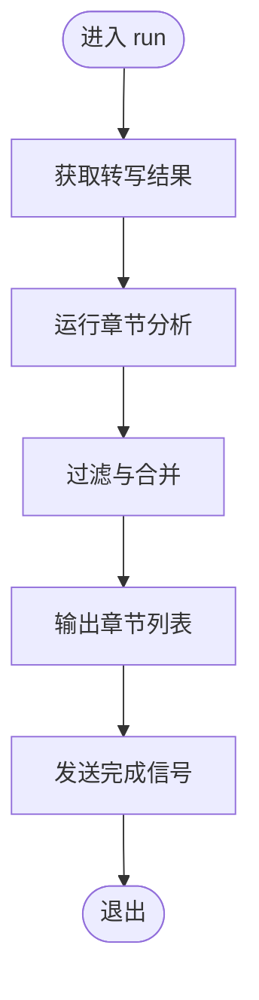
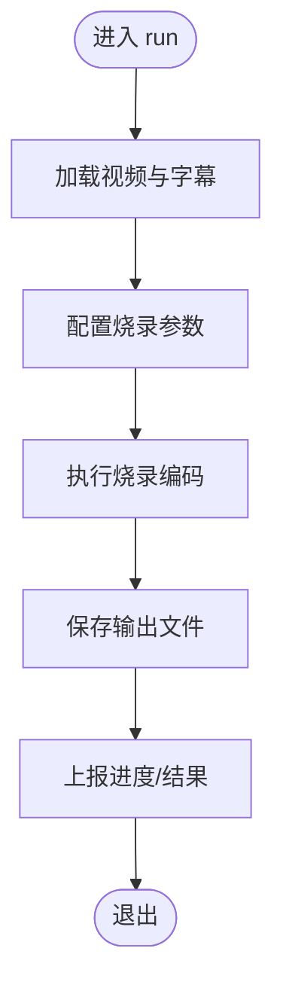
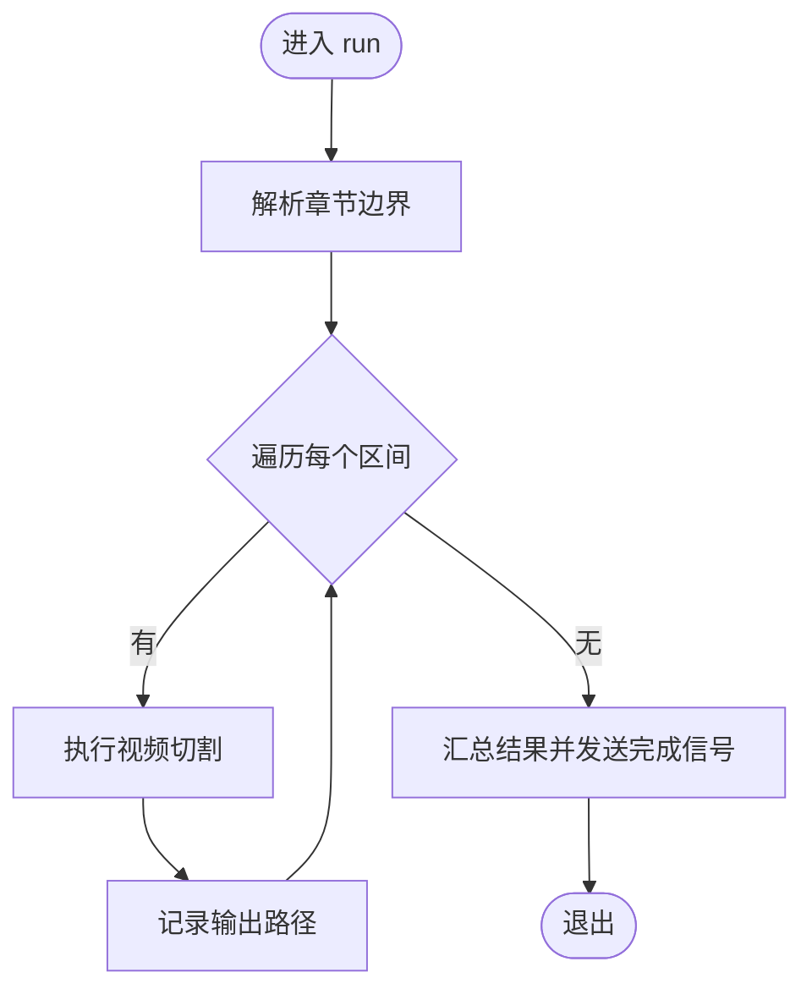
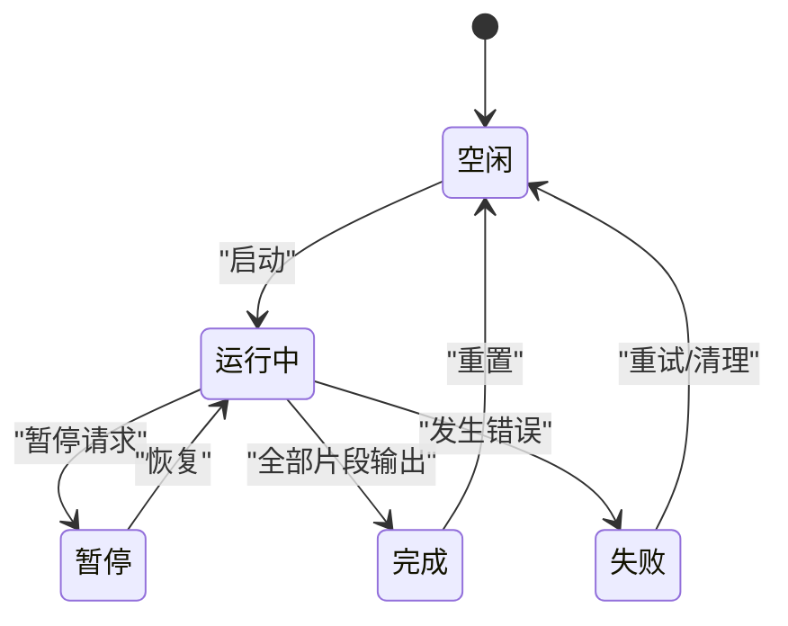
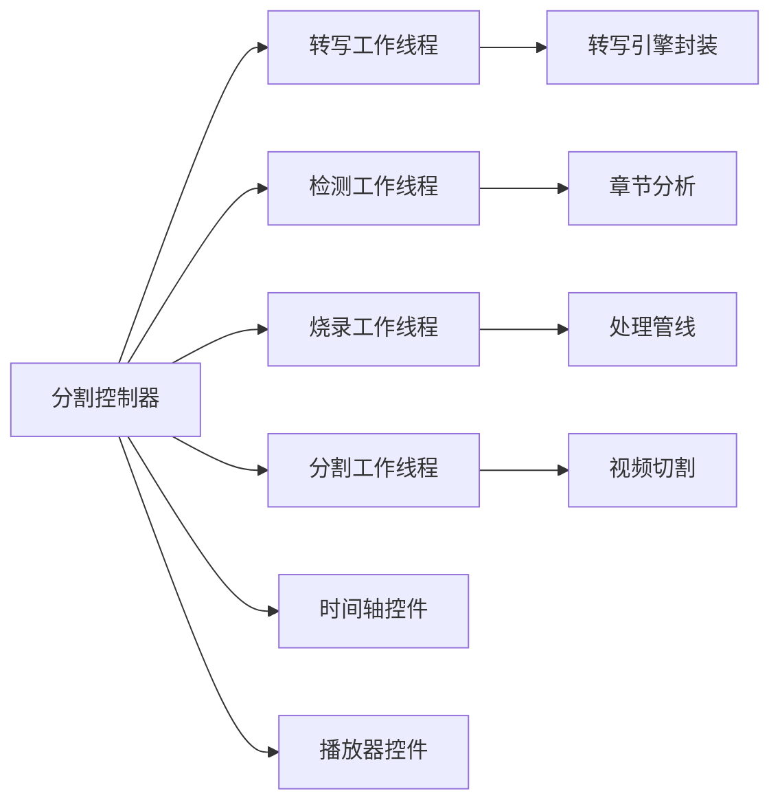

# 分割工作线程

<cite>
**本文引用的文件**   
- [gui/workers/split_worker.py](file://gui/workers/split_worker.py)
- [gui/workers/transcribe_worker.py](file://gui/workers/transcribe_worker.py)
- [gui/workers/detect_worker.py](file://gui/workers/detect_worker.py)
- [gui/workers/burn_worker.py](file://gui/workers/burn_worker.py)
- [gui/controllers/split_controller.py](file://gui/controllers/split_controller.py)
- [video_splitter/pipeline.py](file://video_splitter/pipeline.py)
- [video_splitter/splitter/cutter.py](file://video_splitter/splitter/cutter.py)
- [video_splitter/extractor/transcribe.py](file://video_splitter/extractor/transcribe.py)
- [video_splitter/analyzer/chapter.py](file://video_splitter/analyzer/chapter.py)
- [gui/widgets/timeline.py](file://gui/widgets/timeline.py)
- [gui/widgets/video_player.py](file://gui/widgets/video_player.py)
</cite>

## 目录
1. [简介](#简介)
2. [项目结构](#项目结构)
3. [核心组件](#核心组件)
4. [架构总览](#架构总览)
5. [详细组件分析](#详细组件分析)
6. [依赖关系分析](#依赖关系分析)
7. [性能考虑](#性能考虑)
8. [故障排查指南](#故障排查指南)
9. [结论](#结论)
10. [附录](#附录)

## 简介
本文件聚焦于“分割工作线程”的架构与实现，围绕 GUI 层的工作线程模型、控制器的编排逻辑以及底层视频处理管线进行系统性说明。文档旨在帮助读者理解：
- 如何将耗时任务（转写、章节检测、字幕烧录、视频切割）从主线程剥离到后台工作线程
- 控制器如何协调多个工作线程并驱动 UI 更新
- 底层管线如何被工作线程调用以完成实际的媒体处理

## 项目结构
本项目采用分层组织方式：
- gui/workers：GUI 侧的工作线程实现，负责将耗时任务放入后台执行并通过信号回调 UI
- gui/controllers：控制器负责业务流程编排与状态管理
- video_splitter：核心库，提供转写、章节分析、切割等能力
- gui/widgets：UI 控件，用于展示时间轴、播放器、进度等

图表来源
- [gui/controllers/split_controller.py](file://gui/controllers/split_controller.py)
- [gui/workers/transcribe_worker.py](file://gui/workers/transcribe_worker.py)
- [gui/workers/detect_worker.py](file://gui/workers/detect_worker.py)
- [gui/workers/burn_worker.py](file://gui/workers/burn_worker.py)
- [gui/workers/split_worker.py](file://gui/workers/split_worker.py)
- [video_splitter/pipeline.py](file://video_splitter/pipeline.py)
- [video_splitter/splitter/cutter.py](file://video_splitter/splitter/cutter.py)
- [video_splitter/extractor/transcribe.py](file://video_splitter/extractor/transcribe.py)
- [video_splitter/analyzer/chapter.py](file://video_splitter/analyzer/chapter.py)
- [gui/widgets/timeline.py](file://gui/widgets/timeline.py)
- [gui/widgets/video_player.py](file://gui/widgets/video_player.py)

章节来源
- [gui/controllers/split_controller.py](file://gui/controllers/split_controller.py)
- [gui/workers/split_worker.py](file://gui/workers/split_worker.py)
- [gui/workers/transcribe_worker.py](file://gui/workers/transcribe_worker.py)
- [gui/workers/detect_worker.py](file://gui/workers/detect_worker.py)
- [gui/workers/burn_worker.py](file://gui/workers/burn_worker.py)
- [video_splitter/pipeline.py](file://video_splitter/pipeline.py)
- [video_splitter/splitter/cutter.py](file://video_splitter/splitter/cutter.py)
- [video_splitter/extractor/transcribe.py](file://video_splitter/extractor/transcribe.py)
- [video_splitter/analyzer/chapter.py](file://video_splitter/analyzer/chapter.py)
- [gui/widgets/timeline.py](file://gui/widgets/timeline.py)
- [gui/widgets/video_player.py](file://gui/widgets/video_player.py)

## 核心组件
- 分割控制器：负责串联转写、检测、烧录、分割等步骤，管理工作线程生命周期与 UI 状态同步
- 转写工作线程：在后台执行音频转写，通过信号回传进度与结果
- 检测工作线程：基于转写文本或元数据生成章节边界，返回章节列表
- 烧录工作线程：将字幕烧入视频，输出带字幕的视频文件
- 分割工作线程：依据章节边界对视频进行切分，产出多段片段
- 核心管线与工具：提供转写、章节分析、视频切割等可复用能力

章节来源
- [gui/controllers/split_controller.py](file://gui/controllers/split_controller.py)
- [gui/workers/transcribe_worker.py](file://gui/workers/transcribe_worker.py)
- [gui/workers/detect_worker.py](file://gui/workers/detect_worker.py)
- [gui/workers/burn_worker.py](file://gui/workers/burn_worker.py)
- [gui/workers/split_worker.py](file://gui/workers/split_worker.py)
- [video_splitter/extractor/transcribe.py](file://video_splitter/extractor/transcribe.py)
- [video_splitter/analyzer/chapter.py](file://video_splitter/analyzer/chapter.py)
- [video_splitter/splitter/cutter.py](file://video_splitter/splitter/cutter.py)
- [video_splitter/pipeline.py](file://video_splitter/pipeline.py)

## 架构总览
下图展示了从用户触发到最终输出的端到端流程，包括控制器调度与工作线程协作。

图表来源
- [gui/controllers/split_controller.py](file://gui/controllers/split_controller.py)
- [gui/workers/transcribe_worker.py](file://gui/workers/transcribe_worker.py)
- [gui/workers/detect_worker.py](file://gui/workers/detect_worker.py)
- [gui/workers/burn_worker.py](file://gui/workers/burn_worker.py)
- [gui/workers/split_worker.py](file://gui/workers/split_worker.py)
- [gui/widgets/timeline.py](file://gui/widgets/timeline.py)
- [gui/widgets/video_player.py](file://gui/widgets/video_player.py)

## 详细组件分析

### 分割控制器
职责
- 编排转写、检测、烧录、分割四个阶段
- 管理工作线程的创建、启动、停止与异常恢复
- 将工作线程的信号映射为 UI 更新事件

交互要点
- 与转写、检测、烧录、分割工作线程通信
- 向时间轴和播放器推送中间结果与最终产物

图表来源
- [gui/controllers/split_controller.py](file://gui/controllers/split_controller.py)
- [gui/workers/transcribe_worker.py](file://gui/workers/transcribe_worker.py)
- [gui/workers/detect_worker.py](file://gui/workers/detect_worker.py)
- [gui/workers/burn_worker.py](file://gui/workers/burn_worker.py)
- [gui/workers/split_worker.py](file://gui/workers/split_worker.py)
- [gui/widgets/timeline.py](file://gui/widgets/timeline.py)
- [gui/widgets/video_player.py](file://gui/widgets/video_player.py)

章节来源
- [gui/controllers/split_controller.py](file://gui/controllers/split_controller.py)

### 转写工作线程
职责
- 在后台执行音频转写
- 周期性上报进度与阶段性结果
- 完成后发出完成信号，供控制器继续后续步骤

关键流程
- 初始化转写引擎
- 读取输入音频/视频流
- 增量写入转写结果
- 清理资源并返回结果

图表来源
- [gui/workers/transcribe_worker.py](file://gui/workers/transcribe_worker.py)
- [video_splitter/extractor/transcribe.py](file://video_splitter/extractor/transcribe.py)

章节来源
- [gui/workers/transcribe_worker.py](file://gui/workers/transcribe_worker.py)
- [video_splitter/extractor/transcribe.py](file://video_splitter/extractor/transcribe.py)

### 检测工作线程
职责
- 基于转写文本或媒体元数据生成章节边界
- 输出章节列表供时间轴渲染与后续烧录使用

关键流程
- 接收转写结果
- 运行章节分析算法
- 过滤/合并相邻章节
- 返回结构化章节数据

图表来源
- [gui/workers/detect_worker.py](file://gui/workers/detect_worker.py)
- [video_splitter/analyzer/chapter.py](file://video_splitter/analyzer/chapter.py)

章节来源
- [gui/workers/detect_worker.py](file://gui/workers/detect_worker.py)
- [video_splitter/analyzer/chapter.py](file://video_splitter/analyzer/chapter.py)

### 烧录工作线程
职责
- 将字幕轨道烧入视频
- 支持进度反馈与错误上报
- 输出带字幕的最终视频文件

关键流程
- 加载输入视频与字幕
- 配置烧录参数
- 执行编码并输出
- 返回输出路径与统计信息

图表来源
- [gui/workers/burn_worker.py](file://gui/workers/burn_worker.py)
- [video_splitter/pipeline.py](file://video_splitter/pipeline.py)

章节来源
- [gui/workers/burn_worker.py](file://gui/workers/burn_worker.py)
- [video_splitter/pipeline.py](file://video_splitter/pipeline.py)

### 分割工作线程
职责
- 根据章节边界对视频进行切分
- 批量输出片段文件
- 提供进度与错误信息

关键流程
- 解析章节边界
- 遍历每个区间执行切割
- 汇总输出路径与统计信息

图表来源
- [gui/workers/split_worker.py](file://gui/workers/split_worker.py)
- [video_splitter/splitter/cutter.py](file://video_splitter/splitter/cutter.py)

章节来源
- [gui/workers/split_worker.py](file://gui/workers/split_worker.py)
- [video_splitter/splitter/cutter.py](file://video_splitter/splitter/cutter.py)

### 概念性概览
以下流程图展示了“分割工作线程”的典型生命周期与外部交互，便于快速理解其角色定位。

[此图为概念性说明，不直接对应具体源码文件]

## 依赖关系分析
- 控制器对工作线程存在强耦合，需确保信号槽连接正确且生命周期可控
- 工作线程对核心库存在弱耦合，通过接口调用避免 GUI 侵入核心逻辑
- UI 控件仅消费控制器提供的数据，保持单向数据流

图表来源
- [gui/controllers/split_controller.py](file://gui/controllers/split_controller.py)
- [gui/workers/transcribe_worker.py](file://gui/workers/transcribe_worker.py)
- [gui/workers/detect_worker.py](file://gui/workers/detect_worker.py)
- [gui/workers/burn_worker.py](file://gui/workers/burn_worker.py)
- [gui/workers/split_worker.py](file://gui/workers/split_worker.py)
- [video_splitter/extractor/transcribe.py](file://video_splitter/extractor/transcribe.py)
- [video_splitter/analyzer/chapter.py](file://video_splitter/analyzer/chapter.py)
- [video_splitter/pipeline.py](file://video_splitter/pipeline.py)
- [video_splitter/splitter/cutter.py](file://video_splitter/splitter/cutter.py)
- [gui/widgets/timeline.py](file://gui/widgets/timeline.py)
- [gui/widgets/video_player.py](file://gui/widgets/video_player.py)

章节来源
- [gui/controllers/split_controller.py](file://gui/controllers/split_controller.py)
- [gui/workers/split_worker.py](file://gui/workers/split_worker.py)
- [gui/workers/transcribe_worker.py](file://gui/workers/transcribe_worker.py)
- [gui/workers/detect_worker.py](file://gui/workers/detect_worker.py)
- [gui/workers/burn_worker.py](file://gui/workers/burn_worker.py)
- [video_splitter/extractor/transcribe.py](file://video_splitter/extractor/transcribe.py)
- [video_splitter/analyzer/chapter.py](file://video_splitter/analyzer/chapter.py)
- [video_splitter/pipeline.py](file://video_splitter/pipeline.py)
- [video_splitter/splitter/cutter.py](file://video_splitter/splitter/cutter.py)
- [gui/widgets/timeline.py](file://gui/widgets/timeline.py)
- [gui/widgets/video_player.py](file://gui/widgets/video_player.py)

## 性能考虑
- 并行化策略：若各阶段相互独立（如多路转写或多路烧录），可在控制器内并发调度多个工作线程实例，但需注意 I/O 与 CPU 资源的竞争
- 进度上报频率：合理设置信号发射间隔，避免过多 UI 更新导致卡顿
- 内存占用：大文件处理时尽量流式读写，减少一次性加载
- 编码参数：根据目标设备与网络环境调整码率与分辨率，平衡质量与速度
- 错误恢复：对失败片段进行重试与隔离，避免单点失败影响整体流程

[本节为通用指导，不涉及具体源码分析]

## 故障排查指南
常见问题与定位建议
- 工作线程未响应
  - 检查控制器是否正确连接信号槽
  - 确认线程启动顺序与依赖数据是否就绪
- 进度不更新
  - 检查工作线程是否在循环中定期发射进度信号
  - 验证 UI 线程是否能安全接收跨线程信号
- 输出文件缺失或损坏
  - 核对烧录与切割的参数配置
  - 查看工作线程的错误日志与返回值
- 章节边界不准确
  - 调整章节分析阈值与合并策略
  - 校验转写结果的准确性与时间戳对齐

章节来源
- [gui/controllers/split_controller.py](file://gui/controllers/split_controller.py)
- [gui/workers/transcribe_worker.py](file://gui/workers/transcribe_worker.py)
- [gui/workers/detect_worker.py](file://gui/workers/detect_worker.py)
- [gui/workers/burn_worker.py](file://gui/workers/burn_worker.py)
- [gui/workers/split_worker.py](file://gui/workers/split_worker.py)

## 结论
通过将转写、检测、烧录、分割等耗时任务下沉至工作线程，系统实现了流畅的用户体验与清晰的职责分离。控制器作为编排中心，有效管理了线程生命周期与 UI 同步；核心库则提供了稳定可靠的媒体处理能力。未来可在并发调度、错误恢复与性能监控方面进一步演进。

[本节为总结性内容，不涉及具体源码分析]

## 附录
- 术语表
  - 转写：将语音转换为文本
  - 章节：按语义或时间划分的视频段落
  - 烧录：将字幕嵌入视频画面
  - 分割：按章节边界将视频切分为多段

[本节为补充说明，不涉及具体源码分析]
