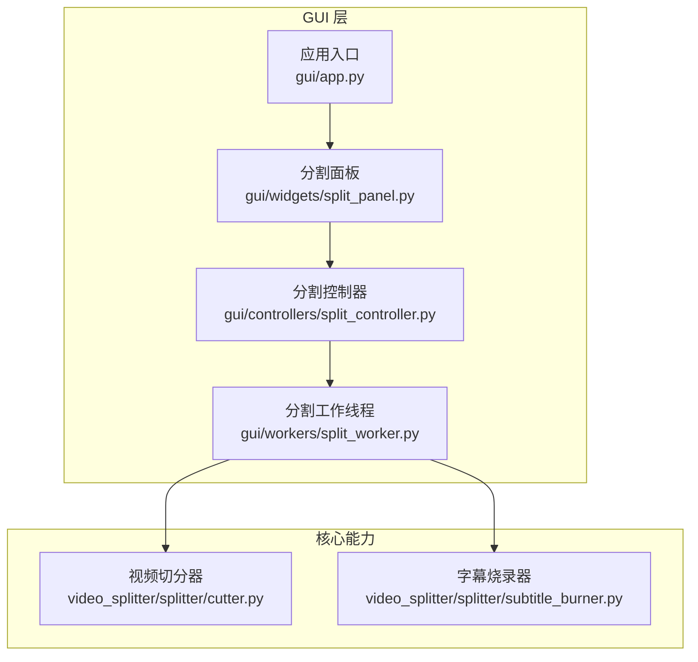
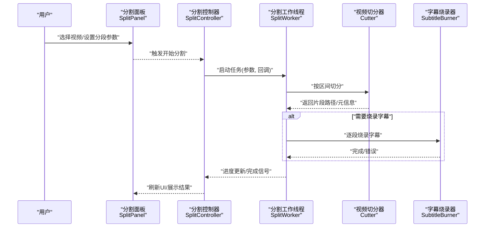
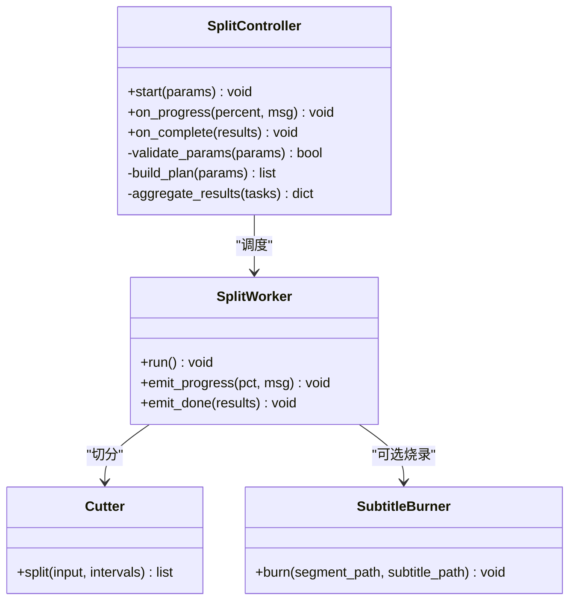
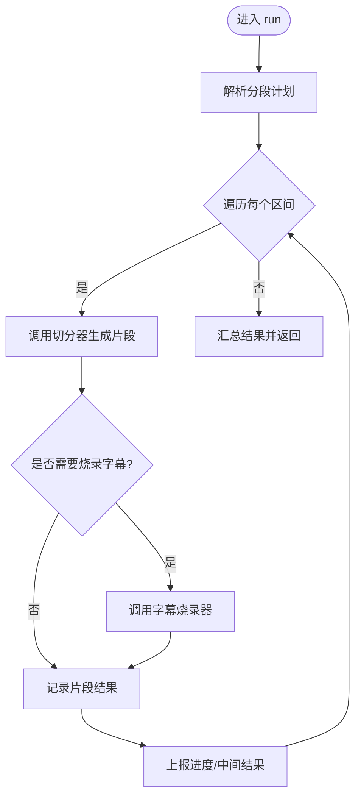
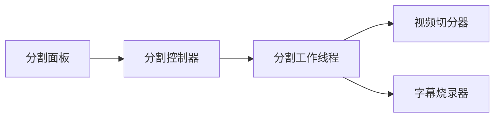

# 分割控制器

<cite>
**本文引用的文件**   
- [gui/controllers/split_controller.py](file://gui/controllers/split_controller.py)
- [gui/widgets/split_panel.py](file://gui/widgets/split_panel.py)
- [gui/workers/split_worker.py](file://gui/workers/split_worker.py)
- [video_splitter/splitter/cutter.py](file://video_splitter/splitter/cutter.py)
- [video_splitter/splitter/subtitle_burner.py](file://video_splitter/splitter/subtitle_burner.py)
- [gui/app.py](file://gui/app.py)
- [tests/test_split_controller.py](file://tests/test_split_controller.py)
</cite>

## 目录
1. [简介](#简介)
2. [项目结构](#项目结构)
3. [核心组件](#核心组件)
4. [架构总览](#架构总览)
5. [详细组件分析](#详细组件分析)
6. [依赖关系分析](#依赖关系分析)
7. [性能考虑](#性能考虑)
8. [故障排查指南](#故障排查指南)
9. [结论](#结论)
10. [附录](#附录)

## 简介
本文件聚焦于“分割控制器”子系统，围绕 GUI 层的分割控制流程、工作线程与底层视频切分/字幕烧录能力进行系统化说明。目标读者包括需要理解或扩展该功能的开发者与维护者。文档从系统架构、数据流、处理逻辑、集成点、错误处理与性能特征等维度展开，并提供可视化图示与可操作的排障建议。

## 项目结构
与“分割控制器”直接相关的代码主要分布在以下模块：
- GUI 控制器：负责用户交互到业务处理的编排
- GUI 组件：提供分割面板、时间轴、状态栏等界面元素
- 后台工作线程：执行耗时任务（如检测、转写、分割）
- 底层能力：视频切分与字幕烧录

图表来源
- [gui/app.py](file://gui/app.py)
- [gui/widgets/split_panel.py](file://gui/widgets/split_panel.py)
- [gui/controllers/split_controller.py](file://gui/controllers/split_controller.py)
- [gui/workers/split_worker.py](file://gui/workers/split_worker.py)
- [video_splitter/splitter/cutter.py](file://video_splitter/splitter/cutter.py)
- [video_splitter/splitter/subtitle_burner.py](file://video_splitter/splitter/subtitle_burner.py)

章节来源
- [gui/app.py](file://gui/app.py)
- [gui/widgets/split_panel.py](file://gui/widgets/split_panel.py)
- [gui/controllers/split_controller.py](file://gui/controllers/split_controller.py)
- [gui/workers/split_worker.py](file://gui/workers/split_worker.py)
- [video_splitter/splitter/cutter.py](file://video_splitter/splitter/cutter.py)
- [video_splitter/splitter/subtitle_burner.py](file://video_splitter/splitter/subtitle_burner.py)

## 核心组件
- 分割控制器：协调 UI 事件与工作线程，管理任务生命周期、进度回调与结果汇总。
- 分割面板：承载用户输入（起止时间、分段策略）、展示进度与结果摘要。
- 分割工作线程：封装耗时操作，避免阻塞 UI；与底层切分/烧录能力对接。
- 视频切分器：根据时间区间对媒体进行精确切分。
- 字幕烧录器：将 SRT/VTT 等字幕轨道以硬编码方式写入输出文件。

章节来源
- [gui/controllers/split_controller.py](file://gui/controllers/split_controller.py)
- [gui/widgets/split_panel.py](file://gui/widgets/split_panel.py)
- [gui/workers/split_worker.py](file://gui/workers/split_worker.py)
- [video_splitter/splitter/cutter.py](file://video_splitter/splitter/cutter.py)
- [video_splitter/splitter/subtitle_burner.py](file://video_splitter/splitter/subtitle_burner.py)

## 架构总览
下图展示了从用户点击“开始分割”到最终生成文件的端到端调用序列。

图表来源
- [gui/controllers/split_controller.py](file://gui/controllers/split_controller.py)
- [gui/widgets/split_panel.py](file://gui/widgets/split_panel.py)
- [gui/workers/split_worker.py](file://gui/workers/split_worker.py)
- [video_splitter/splitter/cutter.py](file://video_splitter/splitter/cutter.py)
- [video_splitter/splitter/subtitle_burner.py](file://video_splitter/splitter/subtitle_burner.py)

## 详细组件分析

### 分割控制器（SplitController）
职责
- 接收来自分割面板的分割请求，校验并组装参数。
- 创建并调度分割工作线程，绑定进度与完成回调。
- 聚合各片段的输出路径与统计信息，反馈给 UI。
- 统一异常捕获与错误提示，保证 UI 稳定。

关键流程
- 初始化：加载配置、准备临时目录、注册回调。
- 执行：将分段计划下发至工作线程，监听进度与结果。
- 收尾：清理资源、更新 UI、记录日志。

图表来源
- [gui/controllers/split_controller.py](file://gui/controllers/split_controller.py)
- [gui/workers/split_worker.py](file://gui/workers/split_worker.py)
- [video_splitter/splitter/cutter.py](file://video_splitter/splitter/cutter.py)
- [video_splitter/splitter/subtitle_burner.py](file://video_splitter/splitter/subtitle_burner.py)

章节来源
- [gui/controllers/split_controller.py](file://gui/controllers/split_controller.py)

### 分割面板（SplitPanel）
职责
- 提供输入控件：源视频、分段策略（固定时长/手动标记）、输出目录、是否烧录字幕等。
- 显示实时进度条与状态文本。
- 将用户意图转换为控制器可调用的参数对象。

交互要点
- 当用户点击“开始”，先做基础校验（如文件存在、时间范围合法），再调用控制器。
- 在任务进行中禁用重复提交，防止并发冲突。

章节来源
- [gui/widgets/split_panel.py](file://gui/widgets/split_panel.py)

### 分割工作线程（SplitWorker）
职责
- 在独立线程中执行耗时任务，避免阻塞主线程。
- 将切分与字幕烧录步骤串联，支持失败重试与中断。
- 通过回调上报进度与中间产物，供控制器汇总。

处理顺序
- 解析分段计划 -> 遍历每个区间 -> 调用切分器 -> 可选字幕烧录 -> 收集结果。

图表来源
- [gui/workers/split_worker.py](file://gui/workers/split_worker.py)
- [video_splitter/splitter/cutter.py](file://video_splitter/splitter/cutter.py)
- [video_splitter/splitter/subtitle_burner.py](file://video_splitter/splitter/subtitle_burner.py)

章节来源
- [gui/workers/split_worker.py](file://gui/workers/split_worker.py)

### 视频切分器（Cutter）
职责
- 依据输入时间与输出格式，调用底层工具链进行精准切分。
- 返回片段路径列表及必要元信息（时长、分辨率等）。

注意事项
- 边界对齐：尽量对齐关键帧以减少跳变。
- 并发安全：多线程调用时需确保输入/输出路径隔离。

章节来源
- [video_splitter/splitter/cutter.py](file://video_splitter/splitter/cutter.py)

### 字幕烧录器（SubtitleBurner）
职责
- 将外部字幕文件（SRT/VTT 等）以硬编码方式嵌入视频片段。
- 支持字体、样式与位置等渲染选项（由上层传入）。

章节来源
- [video_splitter/splitter/subtitle_burner.py](file://video_splitter/splitter/subtitle_burner.py)

## 依赖关系分析
- 耦合度
  - 控制器与工作线程为松耦合，通过回调接口通信，便于替换实现与单元测试。
  - 工作线程与底层能力（切分/烧录）通过明确方法签名解耦。
- 外部依赖
  - 底层切分与字幕烧录通常依赖系统级多媒体工具链（例如 FFmpeg），需确保环境可用。
- 潜在循环依赖
  - 当前分层清晰，未见循环导入风险。

图表来源
- [gui/widgets/split_panel.py](file://gui/widgets/split_panel.py)
- [gui/controllers/split_controller.py](file://gui/controllers/split_controller.py)
- [gui/workers/split_worker.py](file://gui/workers/split_worker.py)
- [video_splitter/splitter/cutter.py](file://video_splitter/splitter/cutter.py)
- [video_splitter/splitter/subtitle_burner.py](file://video_splitter/splitter/subtitle_burner.py)

章节来源
- [gui/controllers/split_controller.py](file://gui/controllers/split_controller.py)
- [gui/workers/split_worker.py](file://gui/workers/split_worker.py)

## 性能考虑
- 并行化
  - 多段切分可考虑并行执行，但需注意磁盘 I/O 与编码器负载上限。
- 内存占用
  - 大文件处理应避免一次性加载全部数据，采用流式读取与增量写入。
- 关键帧对齐
  - 切分起点尽量对齐关键帧，减少解码开销与首帧黑屏。
- 字幕烧录
  - 批量烧录时复用滤镜图与编码器上下文可降低启动开销。
- 进度上报
  - 合理频率上报进度，避免过多回调导致 UI 卡顿。

[本节为通用指导，不直接分析具体文件]

## 故障排查指南
常见问题与定位思路
- 无法找到媒体工具链
  - 现象：切分或烧录失败，报错提示找不到命令。
  - 排查：确认系统 PATH 包含所需工具，必要时在配置中指定绝对路径。
- 权限不足
  - 现象：写入输出目录失败。
  - 排查：检查输出目录权限与磁盘空间。
- 时间范围非法
  - 现象：起始时间大于结束时间，或超出媒体时长。
  - 排查：在控制器入口处增加边界校验与友好提示。
- 字幕格式不兼容
  - 现象：烧录后无字幕或乱码。
  - 排查：确认字幕编码（UTF-8）、样式标签与字体可用性。
- 任务中断
  - 现象：中途取消导致部分片段已生成。
  - 排查：提供原子性输出策略（先写临时文件，完成后重命名）。

章节来源
- [tests/test_split_controller.py](file://tests/test_split_controller.py)

## 结论
分割控制器通过清晰的层次划分与回调机制，将用户交互、任务调度与底层能力有效解耦。配合工作线程与明确的错误处理策略，能够在保证 UI 流畅的同时，稳定地完成大规模视频分割与字幕烧录任务。后续可在并行化、进度细粒度与资源回收方面进一步优化。

## 附录
- 相关测试用例参考
  - 控制器行为与边界条件验证：[tests/test_split_controller.py](file://tests/test_split_controller.py)
