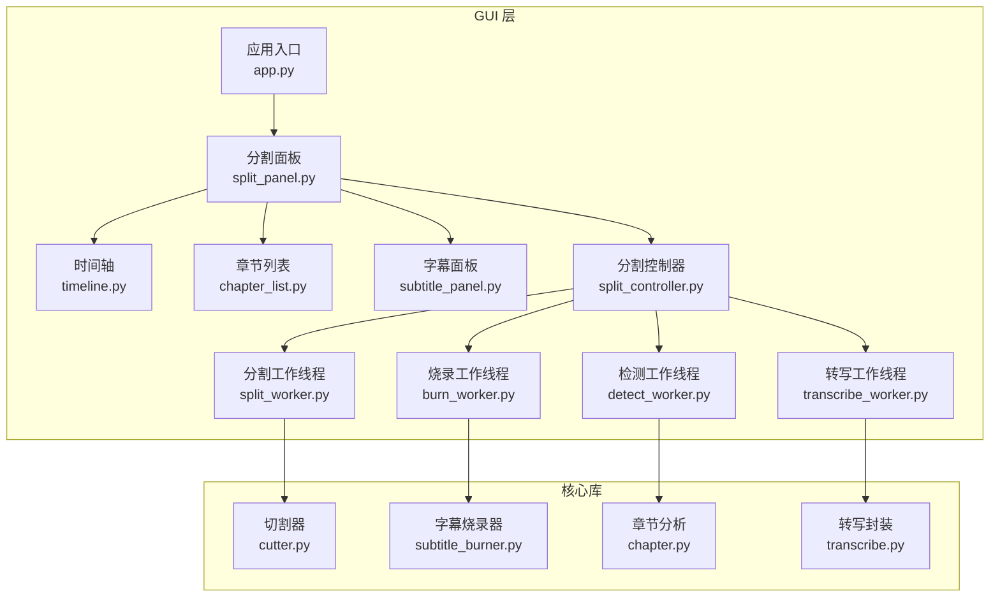
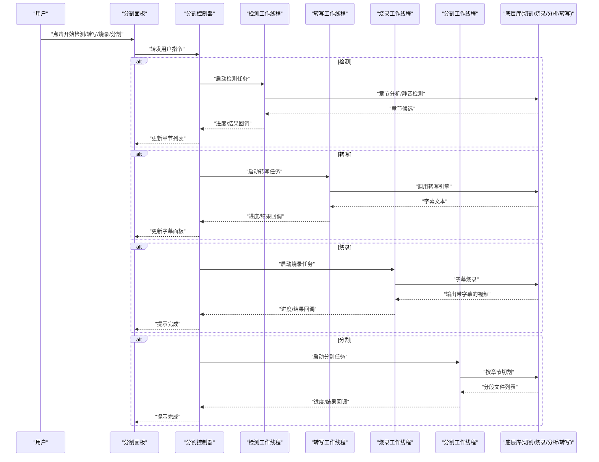
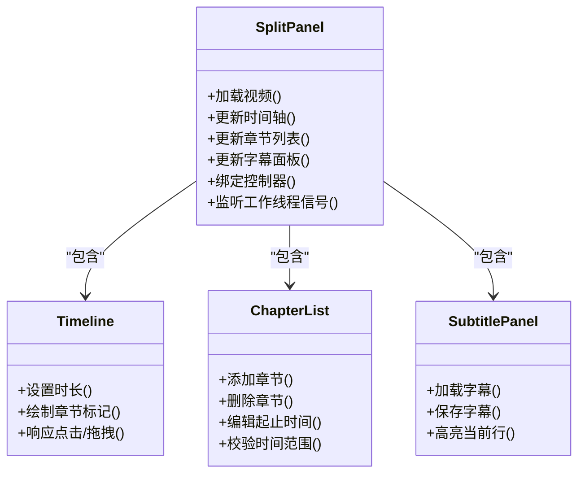
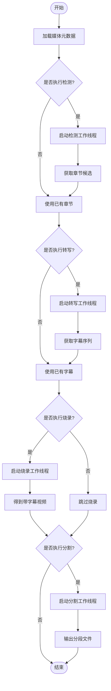
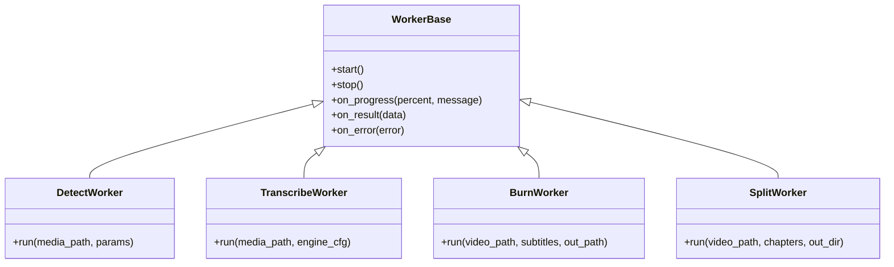
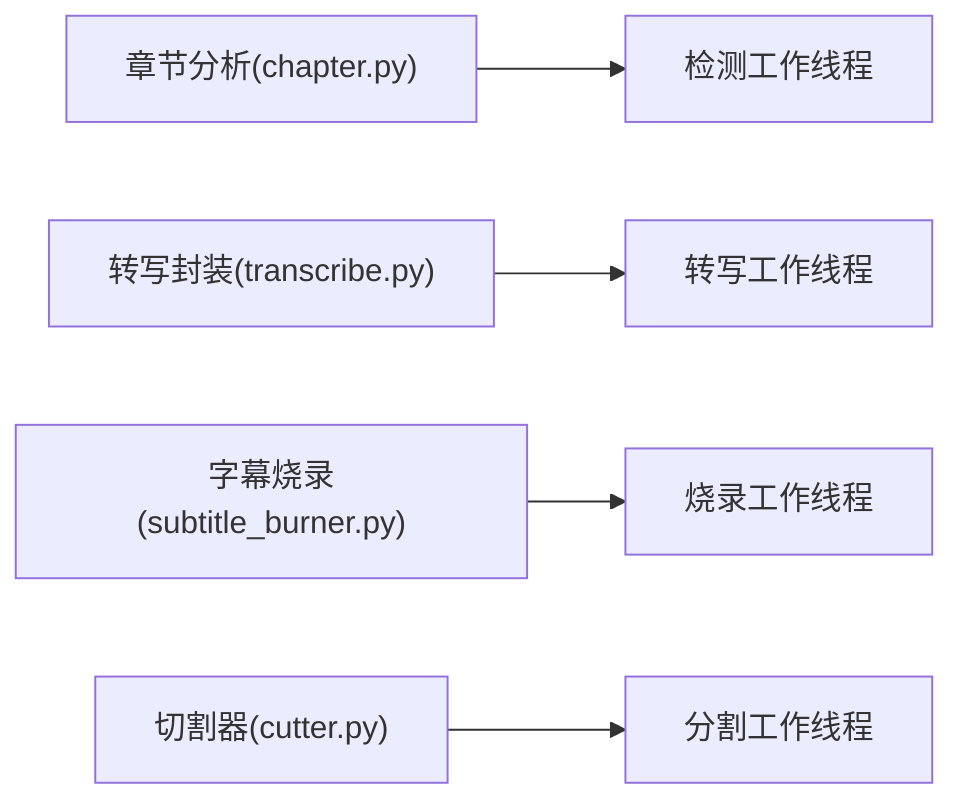
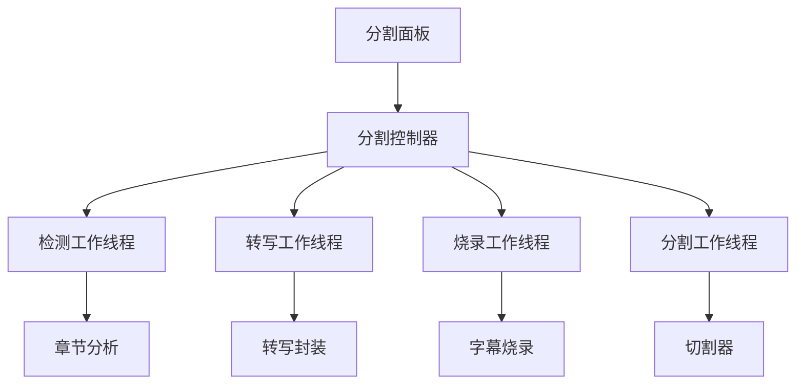

# 分割面板组件

<cite>
**本文引用的文件**   
- [gui/widgets/split_panel.py](file://gui/widgets/split_panel.py)
- [gui/controllers/split_controller.py](file://gui/controllers/split_controller.py)
- [gui/workers/split_worker.py](file://gui/workers/split_worker.py)
- [gui/workers/burn_worker.py](file://gui/workers/burn_worker.py)
- [gui/workers/detect_worker.py](file://gui/workers/detect_worker.py)
- [gui/workers/transcribe_worker.py](file://gui/workers/transcribe_worker.py)
- [gui/widgets/timeline.py](file://gui/widgets/timeline.py)
- [gui/widgets/chapter_list.py](file://gui/widgets/chapter_list.py)
- [gui/widgets/subtitle_panel.py](file://gui/widgets/subtitle_panel.py)
- [gui/app.py](file://gui/app.py)
- [video_splitter/splitter/cutter.py](file://video_splitter/splitter/cutter.py)
- [video_splitter/splitter/subtitle_burner.py](file://video_splitter/splitter/subtitle_burner.py)
- [video_splitter/analyzer/chapter.py](file://video_splitter/analyzer/chapter.py)
- [video_splitter/extractor/transcribe.py](file://video_splitter/extractor/transcribe.py)
- [tests/test_split_widgets.py](file://tests/test_split_widgets.py)
</cite>

## 目录
1. [简介](#简介)
2. [项目结构](#项目结构)
3. [核心组件](#核心组件)
4. [架构总览](#架构总览)
5. [详细组件分析](#详细组件分析)
6. [依赖关系分析](#依赖关系分析)
7. [性能考虑](#性能考虑)
8. [故障排查指南](#故障排查指南)
9. [结论](#结论)
10. [附录](#附录)

## 简介
本文件聚焦于“分割面板组件”的设计与实现，围绕 GUI 层中的分割面板、控制器、工作线程以及底层视频处理模块展开。文档旨在帮助读者理解：
- 分割面板如何组织用户交互（时间轴、章节列表、字幕编辑）
- 控制器如何协调 UI 与后台任务
- 工作线程如何执行检测、转写、烧录与切割等耗时操作
- 与底层 video_splitter 库的集成点与数据流

## 项目结构
本项目采用分层组织方式：
- gui 层：负责界面展示与用户交互
  - widgets：UI 控件（分割面板、时间轴、章节列表、字幕面板等）
  - controllers：业务编排（分割控制器）
  - workers：异步任务（检测、转写、烧录、分割）
- video_splitter 层：核心算法与工具（切割、字幕烧录、章节分析、转写引擎封装）
- tests 层：针对关键组件的测试用例

图表来源
- [gui/widgets/split_panel.py](file://gui/widgets/split_panel.py)
- [gui/controllers/split_controller.py](file://gui/controllers/split_controller.py)
- [gui/workers/split_worker.py](file://gui/workers/split_worker.py)
- [gui/workers/burn_worker.py](file://gui/workers/burn_worker.py)
- [gui/workers/detect_worker.py](file://gui/workers/detect_worker.py)
- [gui/workers/transcribe_worker.py](file://gui/workers/transcribe_worker.py)
- [gui/widgets/timeline.py](file://gui/widgets/timeline.py)
- [gui/widgets/chapter_list.py](file://gui/widgets/chapter_list.py)
- [gui/widgets/subtitle_panel.py](file://gui/widgets/subtitle_panel.py)
- [gui/app.py](file://gui/app.py)
- [video_splitter/splitter/cutter.py](file://video_splitter/splitter/cutter.py)
- [video_splitter/splitter/subtitle_burner.py](file://video_splitter/splitter/subtitle_burner.py)
- [video_splitter/analyzer/chapter.py](file://video_splitter/analyzer/chapter.py)
- [video_splitter/extractor/transcribe.py](file://video_splitter/extractor/transcribe.py)

章节来源
- [gui/app.py](file://gui/app.py)
- [gui/widgets/split_panel.py](file://gui/widgets/split_panel.py)
- [gui/controllers/split_controller.py](file://gui/controllers/split_controller.py)

## 核心组件
- 分割面板（SplitPanel）
  - 职责：承载时间轴、章节列表、字幕面板，提供用户交互入口（选择片段、添加/删除章节、编辑字幕等）
  - 交互：将用户操作委托给分割控制器；监听工作线程进度并更新 UI
- 分割控制器（SplitController）
  - 职责：编排检测、转写、烧录、分割流程；管理并发任务与状态；向 UI 推送事件
- 工作线程族
  - 检测工作线程：基于章节分析进行场景/静音检测，产出章节候选
  - 转写工作线程：调用转写引擎生成字幕
  - 烧录工作线程：将字幕烧录到视频
  - 分割工作线程：根据章节边界对视频进行切割
- 底层库
  - 切割器：按时间戳切分视频
  - 字幕烧录器：将字幕渲染至视频帧
  - 章节分析：从音频/视频特征推断章节
  - 转写封装：统一不同转写后端接口

章节来源
- [gui/widgets/split_panel.py](file://gui/widgets/split_panel.py)
- [gui/controllers/split_controller.py](file://gui/controllers/split_controller.py)
- [gui/workers/split_worker.py](file://gui/workers/split_worker.py)
- [gui/workers/burn_worker.py](file://gui/workers/burn_worker.py)
- [gui/workers/detect_worker.py](file://gui/workers/detect_worker.py)
- [gui/workers/transcribe_worker.py](file://gui/workers/transcribe_worker.py)
- [video_splitter/splitter/cutter.py](file://video_splitter/splitter/cutter.py)
- [video_splitter/splitter/subtitle_burner.py](file://video_splitter/splitter/subtitle_burner.py)
- [video_splitter/analyzer/chapter.py](file://video_splitter/analyzer/chapter.py)
- [video_splitter/extractor/transcribe.py](file://video_splitter/extractor/transcribe.py)

## 架构总览
下图展示了从用户操作到最终输出的端到端流程：用户在分割面板中配置参数并触发任务，控制器调度相应的工作线程，工作线程调用底层库完成具体处理，并通过信号回调更新 UI。

图表来源
- [gui/widgets/split_panel.py](file://gui/widgets/split_panel.py)
- [gui/controllers/split_controller.py](file://gui/controllers/split_controller.py)
- [gui/workers/detect_worker.py](file://gui/workers/detect_worker.py)
- [gui/workers/transcribe_worker.py](file://gui/workers/transcribe_worker.py)
- [gui/workers/burn_worker.py](file://gui/workers/burn_worker.py)
- [gui/workers/split_worker.py](file://gui/workers/split_worker.py)
- [video_splitter/analyzer/chapter.py](file://video_splitter/analyzer/chapter.py)
- [video_splitter/extractor/transcribe.py](file://video_splitter/extractor/transcribe.py)
- [video_splitter/splitter/subtitle_burner.py](file://video_splitter/splitter/subtitle_burner.py)
- [video_splitter/splitter/cutter.py](file://video_splitter/splitter/cutter.py)

## 详细组件分析

### 分割面板（SplitPanel）
- 组成
  - 时间轴：可视化播放位置与章节标记
  - 章节列表：显示/编辑章节起止时间
  - 字幕面板：显示/编辑转写结果
- 交互逻辑
  - 接收用户输入（拖拽时间轴、增删章节、修改字幕）
  - 将变更同步到控制器或本地模型
  - 监听工作线程进度信号，刷新 UI 状态
- 错误处理
  - 捕获无效时间范围、空字幕、文件路径异常等
  - 通过状态栏反馈错误信息

图表来源
- [gui/widgets/split_panel.py](file://gui/widgets/split_panel.py)
- [gui/widgets/timeline.py](file://gui/widgets/timeline.py)
- [gui/widgets/chapter_list.py](file://gui/widgets/chapter_list.py)
- [gui/widgets/subtitle_panel.py](file://gui/widgets/subtitle_panel.py)

章节来源
- [gui/widgets/split_panel.py](file://gui/widgets/split_panel.py)
- [gui/widgets/timeline.py](file://gui/widgets/timeline.py)
- [gui/widgets/chapter_list.py](file://gui/widgets/chapter_list.py)
- [gui/widgets/subtitle_panel.py](file://gui/widgets/subtitle_panel.py)

### 分割控制器（SplitController）
- 职责
  - 维护任务队列与运行状态
  - 协调各工作线程的生命周期
  - 聚合进度与结果，分发到 UI
- 关键流程
  - 检测：读取媒体元数据，调用章节分析，返回候选章节
  - 转写：调用转写封装，返回字幕序列
  - 烧录：将字幕写入视频
  - 分割：依据章节边界批量切割
- 并发与回退
  - 支持串行/并行策略（由配置决定）
  - 失败重试与断点续传（如适用）

图表来源
- [gui/controllers/split_controller.py](file://gui/controllers/split_controller.py)
- [gui/workers/detect_worker.py](file://gui/workers/detect_worker.py)
- [gui/workers/transcribe_worker.py](file://gui/workers/transcribe_worker.py)
- [gui/workers/burn_worker.py](file://gui/workers/burn_worker.py)
- [gui/workers/split_worker.py](file://gui/workers/split_worker.py)

章节来源
- [gui/controllers/split_controller.py](file://gui/controllers/split_controller.py)

### 工作线程族
- 检测工作线程
  - 输入：视频路径、检测参数
  - 输出：章节候选（起止时间）
  - 回调：进度百分比、中间结果
- 转写工作线程
  - 输入：视频路径、转写引擎配置
  - 输出：字幕序列（时间戳+文本）
  - 回调：进度、错误信息
- 烧录工作线程
  - 输入：视频路径、字幕序列、输出路径
  - 输出：带字幕视频
  - 回调：进度、错误信息
- 分割工作线程
  - 输入：视频路径、章节列表、输出目录
  - 输出：分段文件列表
  - 回调：进度、错误信息

图表来源
- [gui/workers/detect_worker.py](file://gui/workers/detect_worker.py)
- [gui/workers/transcribe_worker.py](file://gui/workers/transcribe_worker.py)
- [gui/workers/burn_worker.py](file://gui/workers/burn_worker.py)
- [gui/workers/split_worker.py](file://gui/workers/split_worker.py)

章节来源
- [gui/workers/detect_worker.py](file://gui/workers/detect_worker.py)
- [gui/workers/transcribe_worker.py](file://gui/workers/transcribe_worker.py)
- [gui/workers/burn_worker.py](file://gui/workers/burn_worker.py)
- [gui/workers/split_worker.py](file://gui/workers/split_worker.py)

### 底层库集成
- 章节分析
  - 功能：从音频能量/静音段或视频变化点推断章节
  - 接口：接受媒体路径与参数，返回章节列表
- 转写封装
  - 功能：统一多后端（如 FunASR）的转写接口
  - 接口：接受媒体路径与引擎配置，返回字幕序列
- 字幕烧录
  - 功能：将字幕渲染到视频帧
  - 接口：接受视频路径、字幕序列、输出路径
- 切割器
  - 功能：按时间戳精确切分视频
  - 接口：接受视频路径、章节列表、输出目录

图表来源
- [video_splitter/analyzer/chapter.py](file://video_splitter/analyzer/chapter.py)
- [video_splitter/extractor/transcribe.py](file://video_splitter/extractor/transcribe.py)
- [video_splitter/splitter/subtitle_burner.py](file://video_splitter/splitter/subtitle_burner.py)
- [video_splitter/splitter/cutter.py](file://video_splitter/splitter/cutter.py)
- [gui/workers/detect_worker.py](file://gui/workers/detect_worker.py)
- [gui/workers/transcribe_worker.py](file://gui/workers/transcribe_worker.py)
- [gui/workers/burn_worker.py](file://gui/workers/burn_worker.py)
- [gui/workers/split_worker.py](file://gui/workers/split_worker.py)

章节来源
- [video_splitter/analyzer/chapter.py](file://video_splitter/analyzer/chapter.py)
- [video_splitter/extractor/transcribe.py](file://video_splitter/extractor/transcribe.py)
- [video_splitter/splitter/subtitle_burner.py](file://video_splitter/splitter/subtitle_burner.py)
- [video_splitter/splitter/cutter.py](file://video_splitter/splitter/cutter.py)

## 依赖关系分析
- 耦合度
  - 分割面板仅依赖控制器与子控件，保持低耦合
  - 控制器集中编排，避免 UI 直接调用底层库
  - 工作线程与底层库通过明确接口通信，便于替换实现
- 外部依赖
  - 转写后端可插拔（通过转写封装）
  - 音视频处理依赖底层库（切割/烧录/分析）

图表来源
- [gui/widgets/split_panel.py](file://gui/widgets/split_panel.py)
- [gui/controllers/split_controller.py](file://gui/controllers/split_controller.py)
- [gui/workers/detect_worker.py](file://gui/workers/detect_worker.py)
- [gui/workers/transcribe_worker.py](file://gui/workers/transcribe_worker.py)
- [gui/workers/burn_worker.py](file://gui/workers/burn_worker.py)
- [gui/workers/split_worker.py](file://gui/workers/split_worker.py)
- [video_splitter/analyzer/chapter.py](file://video_splitter/analyzer/chapter.py)
- [video_splitter/extractor/transcribe.py](file://video_splitter/extractor/transcribe.py)
- [video_splitter/splitter/subtitle_burner.py](file://video_splitter/splitter/subtitle_burner.py)
- [video_splitter/splitter/cutter.py](file://video_splitter/splitter/cutter.py)

章节来源
- [gui/widgets/split_panel.py](file://gui/widgets/split_panel.py)
- [gui/controllers/split_controller.py](file://gui/controllers/split_controller.py)
- [gui/workers/detect_worker.py](file://gui/workers/detect_worker.py)
- [gui/workers/transcribe_worker.py](file://gui/workers/transcribe_worker.py)
- [gui/workers/burn_worker.py](file://gui/workers/burn_worker.py)
- [gui/workers/split_worker.py](file://gui/workers/split_worker.py)
- [video_splitter/analyzer/chapter.py](file://video_splitter/analyzer/chapter.py)
- [video_splitter/extractor/transcribe.py](file://video_splitter/extractor/transcribe.py)
- [video_splitter/splitter/subtitle_burner.py](file://video_splitter/splitter/subtitle_burner.py)
- [video_splitter/splitter/cutter.py](file://video_splitter/splitter/cutter.py)

## 性能考虑
- 长视频处理
  - 建议启用增量检测与缓存机制，避免重复计算
  - 转写阶段可采用流式处理以降低内存占用
- 并发控制
  - 合理限制同时运行的工作线程数量，避免 I/O 争用
- 资源释放
  - 确保在任务完成后及时释放临时文件与句柄
- UI 响应性
  - 所有耗时操作必须在工作线程中执行，避免阻塞主线程

[本节为通用指导，不直接分析具体文件]

## 故障排查指南
- 常见问题
  - 无法加载视频：检查路径权限与格式支持
  - 转写失败：确认转写后端可用性与网络连通性
  - 烧录失败：检查字幕编码与容器兼容性
  - 分割失败：验证章节时间戳是否在有效范围内
- 定位方法
  - 查看工作线程的错误回调消息
  - 检查日志输出与进度回调
  - 使用最小复现样本隔离问题

章节来源
- [gui/workers/detect_worker.py](file://gui/workers/detect_worker.py)
- [gui/workers/transcribe_worker.py](file://gui/workers/transcribe_worker.py)
- [gui/workers/burn_worker.py](file://gui/workers/burn_worker.py)
- [gui/workers/split_worker.py](file://gui/workers/split_worker.py)

## 结论
分割面板组件通过清晰的层次划分与明确的职责边界，实现了从用户交互到视频处理的完整链路。控制器作为中枢协调各工作线程，工作线程以稳定接口对接底层库，既保证了可扩展性，也提升了系统的稳定性与可维护性。建议在后续迭代中进一步完善错误恢复、进度持久化与性能监控能力。

[本节为总结性内容，不直接分析具体文件]

## 附录
- 相关测试
  - 分割面板与时间轴、章节列表、字幕面板的交互测试
  - 工作线程的任务执行与回调测试
  - 控制器流程编排与状态机测试

章节来源
- [tests/test_split_widgets.py](file://tests/test_split_widgets.py)
