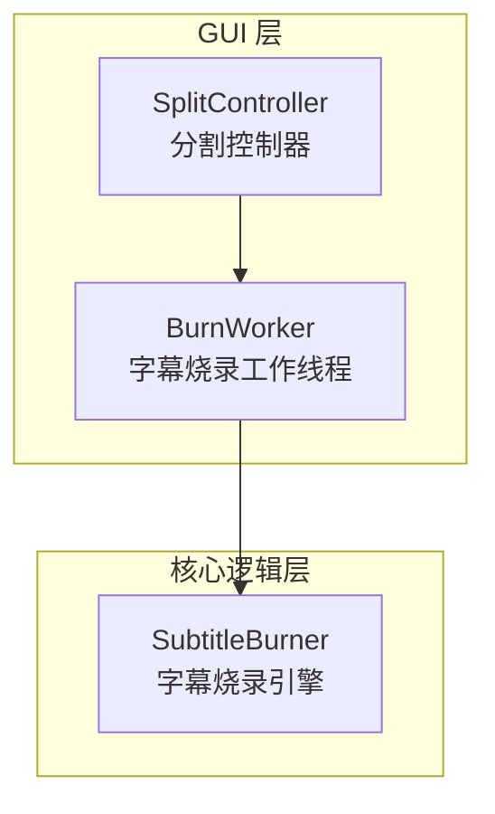
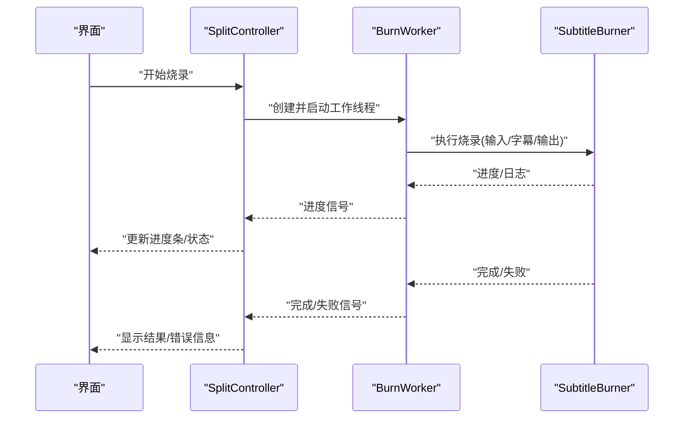
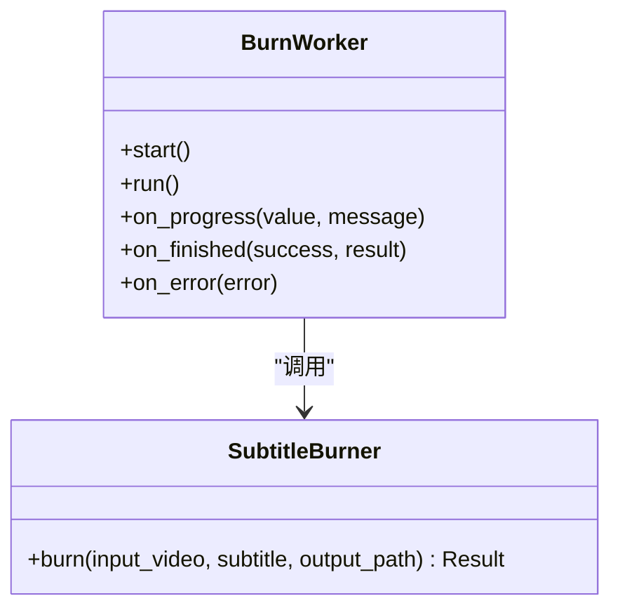
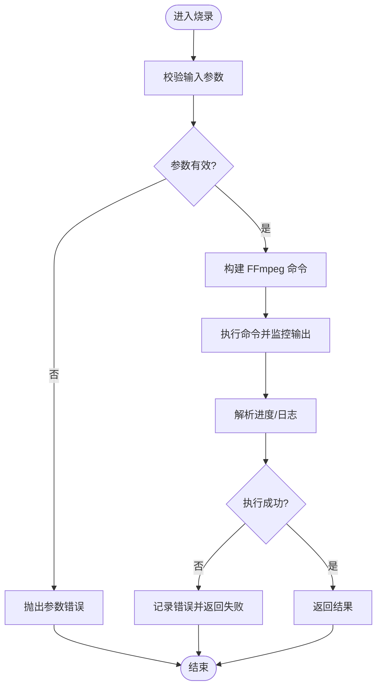
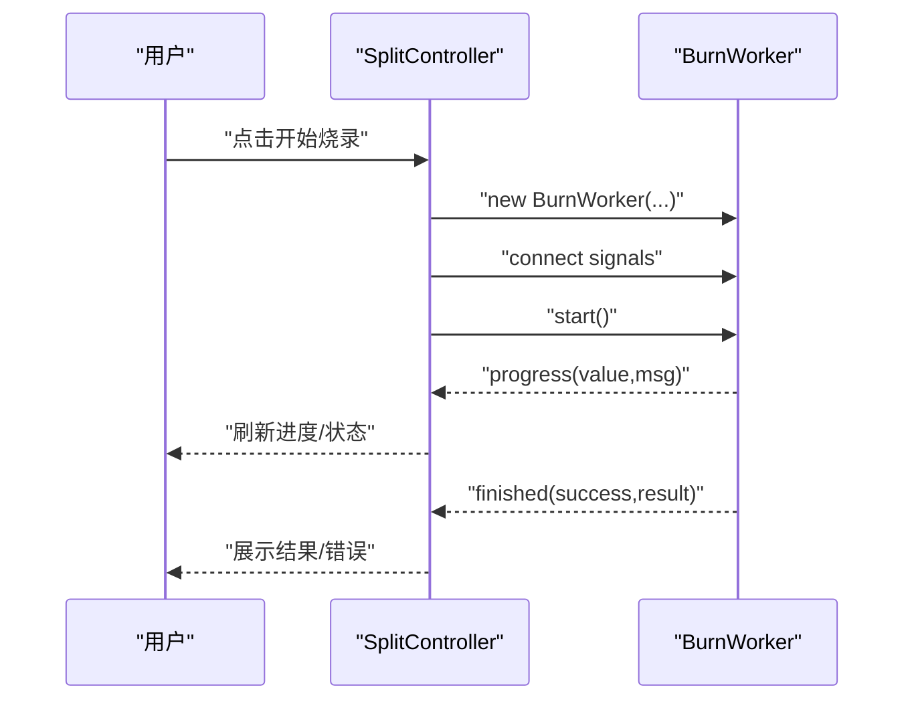

# 字幕烧录工作线程

<cite>
**本文引用的文件**   
- [gui/workers/burn_worker.py](file://gui/workers/burn_worker.py)
- [video_splitter/splitter/subtitle_burner.py](file://video_splitter/splitter/subtitle_burner.py)
- [gui/controllers/split_controller.py](file://gui/controllers/split_controller.py)
- [tests/test_subtitle_burn.py](file://tests/test_subtitle_burn.py)
</cite>

## 目录
1. [简介](#简介)
2. [项目结构](#项目结构)
3. [核心组件](#核心组件)
4. [架构总览](#架构总览)
5. [详细组件分析](#详细组件分析)
6. [依赖关系分析](#依赖关系分析)
7. [性能考虑](#性能考虑)
8. [故障排查指南](#故障排查指南)
9. [结论](#结论)
10. [附录](#附录)

## 简介
本文件聚焦于“字幕烧录工作线程”的实现与使用，围绕 GUI 层的工作线程与底层烧录引擎的协作展开。内容涵盖：
- 工作线程的职责边界、生命周期与信号/槽通信机制
- 烧录流程的关键步骤、错误处理与进度反馈
- 与控制器（Controller）的交互方式
- 测试覆盖要点与常见问题定位方法

## 项目结构
与字幕烧录相关的代码主要分布在以下位置：
- GUI 工作线程：负责在后台执行烧录任务，向 UI 报告进度与结果
- 烧录引擎：封装实际的 FFmpeg 调用与参数组装
- 控制器：协调用户操作与工作线程的启动、停止与状态更新
- 测试：验证烧录流程的正确性与健壮性

图表来源
- [gui/workers/burn_worker.py](file://gui/workers/burn_worker.py)
- [gui/controllers/split_controller.py](file://gui/controllers/split_controller.py)
- [video_splitter/splitter/subtitle_burner.py](file://video_splitter/splitter/subtitle_burner.py)

章节来源
- [gui/workers/burn_worker.py](file://gui/workers/burn_worker.py)
- [gui/controllers/split_controller.py](file://gui/controllers/split_controller.py)
- [video_splitter/splitter/subtitle_burner.py](file://video_splitter/splitter/subtitle_burner.py)

## 核心组件
- 字幕烧录工作线程（BurnWorker）
  - 职责：在独立线程中执行字幕烧录任务，周期性上报进度，完成后发出成功或失败信号
  - 关键能力：任务队列管理、异常捕获、进度回调、取消/中断支持
- 字幕烧录引擎（SubtitleBurner）
  - 职责：根据输入视频、字幕与输出路径，生成并执行 FFmpeg 命令，返回执行结果
  - 关键能力：参数拼装、命令执行、日志收集、错误码解析
- 分割控制器（SplitController）
  - 职责：接收用户操作，创建工作线程实例，连接信号槽，驱动 UI 状态更新

章节来源
- [gui/workers/burn_worker.py](file://gui/workers/burn_worker.py)
- [video_splitter/splitter/subtitle_burner.py](file://video_splitter/splitter/subtitle_burner.py)
- [gui/controllers/split_controller.py](file://gui/controllers/split_controller.py)

## 架构总览
下图展示了从控制器到工作线程再到烧录引擎的调用链路与数据流向。

图表来源
- [gui/controllers/split_controller.py](file://gui/controllers/split_controller.py)
- [gui/workers/burn_worker.py](file://gui/workers/burn_worker.py)
- [video_splitter/splitter/subtitle_burner.py](file://video_splitter/splitter/subtitle_burner.py)

## 详细组件分析

### 组件一：字幕烧录工作线程（BurnWorker）
- 设计要点
  - 作为 QThread 子类运行，避免阻塞主线程
  - 通过信号槽将进度与结果回传给控制器/UI
  - 对异常进行统一捕获，确保线程安全退出
- 关键流程
  - 初始化：接收输入视频、字幕、输出路径等参数
  - 执行：调用烧录引擎执行任务
  - 反馈：周期上报进度；结束时发送完成/失败信号
  - 清理：释放资源、重置状态

图表来源
- [gui/workers/burn_worker.py](file://gui/workers/burn_worker.py)
- [video_splitter/splitter/subtitle_burner.py](file://video_splitter/splitter/subtitle_burner.py)

章节来源
- [gui/workers/burn_worker.py](file://gui/workers/burn_worker.py)

### 组件二：字幕烧录引擎（SubtitleBurner）
- 设计要点
  - 封装 FFmpeg 调用细节，屏蔽外部工具差异
  - 提供统一的接口与返回值约定
  - 记录关键日志便于问题定位
- 关键流程
  - 参数校验：检查输入/字幕/输出合法性
  - 命令构建：组合滤镜、编码参数、字幕渲染选项
  - 执行与监控：执行命令、读取输出流、解析进度
  - 结果返回：成功返回元数据，失败抛出异常或错误码

图表来源
- [video_splitter/splitter/subtitle_burner.py](file://video_splitter/splitter/subtitle_burner.py)

章节来源
- [video_splitter/splitter/subtitle_burner.py](file://video_splitter/splitter/subtitle_burner.py)

### 组件三：分割控制器（SplitController）
- 设计要点
  - 负责创建与管理 BurnWorker 实例
  - 连接工作线程的信号槽，驱动 UI 状态更新
  - 对用户操作进行编排，保证线程安全
- 关键流程
  - 接收“开始烧录”指令
  - 构造工作线程参数并启动
  - 监听进度与完成信号，更新界面
  - 处理异常并提示用户

图表来源
- [gui/controllers/split_controller.py](file://gui/controllers/split_controller.py)
- [gui/workers/burn_worker.py](file://gui/workers/burn_worker.py)

章节来源
- [gui/controllers/split_controller.py](file://gui/controllers/split_controller.py)

## 依赖关系分析
- 耦合关系
  - BurnWorker 依赖 SubtitleBurner 提供的烧录能力
  - SplitController 依赖 BurnWorker 的线程化执行与信号通知
- 外部依赖
  - FFmpeg：实际的视频处理与字幕渲染工具
- 潜在风险
  - 外部命令不可用或版本不兼容
  - 大文件处理时的内存与 I/O 压力
  - 多线程并发下的共享资源竞争

图表来源
- [gui/controllers/split_controller.py](file://gui/controllers/split_controller.py)
- [gui/workers/burn_worker.py](file://gui/workers/burn_worker.py)
- [video_splitter/splitter/subtitle_burner.py](file://video_splitter/splitter/subtitle_burner.py)

章节来源
- [gui/controllers/split_controller.py](file://gui/controllers/split_controller.py)
- [gui/workers/burn_worker.py](file://gui/workers/burn_worker.py)
- [video_splitter/splitter/subtitle_burner.py](file://video_splitter/splitter/subtitle_burner.py)

## 性能考虑
- 并行与批处理
  - 多段视频可并行烧录，注意控制并发度以避免磁盘与 CPU 争用
- 资源管理
  - 及时释放临时文件与进程句柄，避免泄漏
- 进度反馈
  - 合理设置进度上报频率，平衡 UI 流畅度与开销
- 错误恢复
  - 对部分失败的任务实现重试与断点续烧策略（如适用）

[本节为通用指导，不涉及具体文件分析]

## 故障排查指南
- 常见问题
  - FFmpeg 未安装或不在 PATH：确认系统环境并检查命令可用性
  - 字幕格式不支持：核对字幕编码与容器兼容性
  - 输出路径无写入权限：检查目标目录权限与磁盘空间
  - 大文件导致超时：调整超时阈值或分片处理
- 定位方法
  - 查看工作线程日志与错误信号
  - 启用更详细的引擎日志以获取 FFmpeg 输出
  - 使用最小复现用例隔离问题

章节来源
- [tests/test_subtitle_burn.py](file://tests/test_subtitle_burn.py)

## 结论
字幕烧录工作线程通过将耗时任务移出主线程，结合清晰的信号/槽通信与稳定的烧录引擎封装，实现了高可用、可观测且易维护的烧录流程。配合合理的并发控制与完善的错误处理，可在复杂场景下保持良好体验与稳定性。

[本节为总结性内容，不涉及具体文件分析]

## 附录
- 术语
  - 烧录：将字幕轨道直接嵌入视频文件的过程
  - 工作线程：在后台执行任务的独立线程，避免阻塞 UI
- 参考
  - 相关测试用例用于验证烧录流程的正确性与鲁棒性

[本节为补充说明，不涉及具体文件分析]
