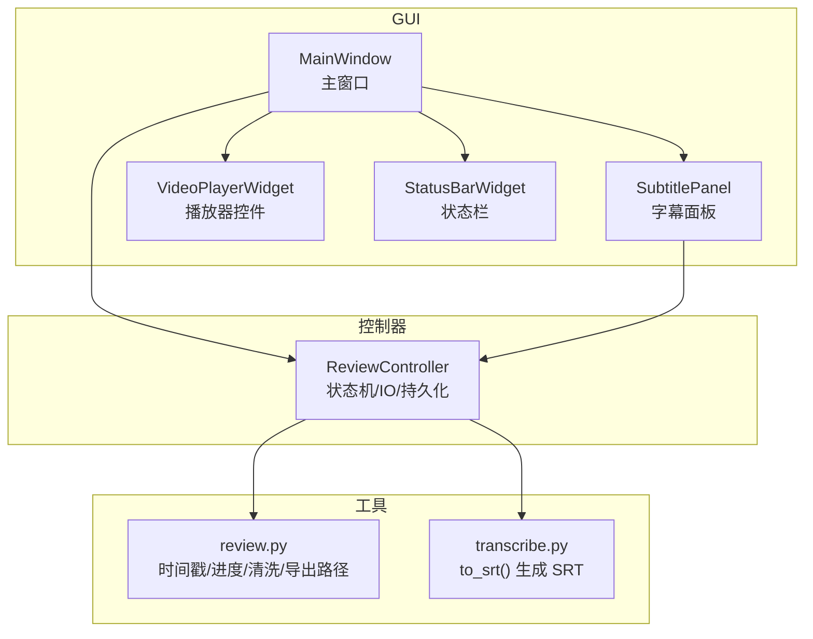
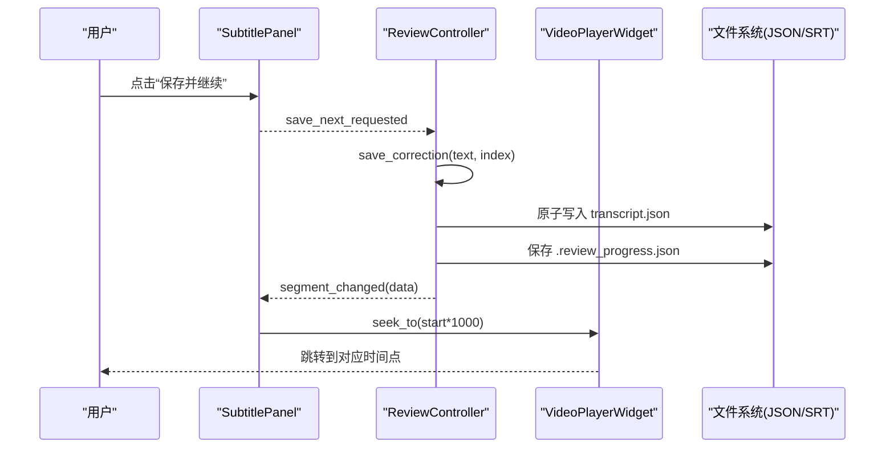
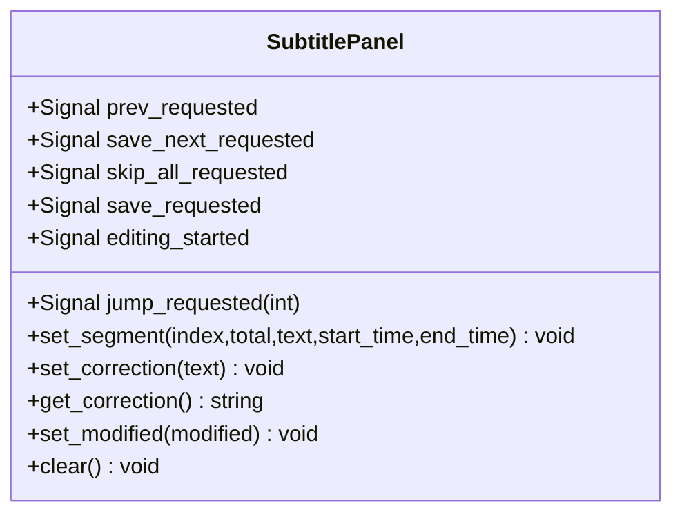
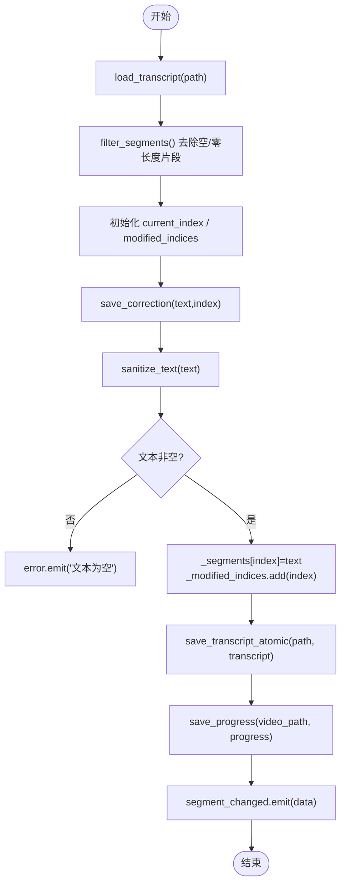
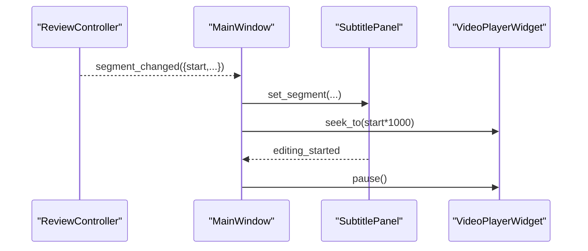
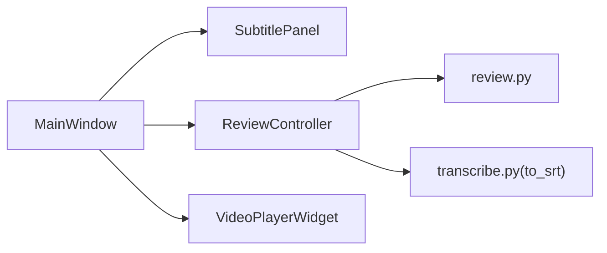

# 字幕编辑器

<cite>
**本文引用的文件**   
- [gui/widgets/subtitle_panel.py](file://gui/widgets/subtitle_panel.py)
- [gui/controllers/review_controller.py](file://gui/controllers/review_controller.py)
- [gui/app.py](file://gui/app.py)
- [gui/widgets/video_player.py](file://gui/widgets/video_player.py)
- [video_splitter/review.py](file://video_splitter/review.py)
- [video_splitter/extractor/transcribe.py](file://video_splitter/extractor/transcribe.py)
</cite>

## 目录
1. [简介](#简介)
2. [项目结构](#项目结构)
3. [核心组件](#核心组件)
4. [架构总览](#架构总览)
5. [详细组件分析](#详细组件分析)
6. [依赖关系分析](#依赖关系分析)
7. [性能与体验优化建议](#性能与体验优化建议)
8. [故障排查指南](#故障排查指南)
9. [结论](#结论)
10. [附录：扩展开发指南](#附录扩展开发指南)

## 简介
本技术文档围绕“字幕编辑器”的 GUI 实现，重点解析 SubtitlePanel 类的设计与实现，包括字幕片段的时间轴可视化、用户交互、文本编辑流程、数据验证与持久化、与视频播放器的时间同步和跳转机制，以及 SRT 导出能力。同时提供扩展开发指南（自定义验证规则、格式化选项）与性能调优建议，帮助开发者在现有基础上快速迭代与增强功能。

## 项目结构
本项目采用分层组织方式：
- GUI 层：PySide6 界面组件与主窗口
- 控制器层：状态机、进度持久化、转录 IO
- 工具层：时间戳格式、SRT 生成、原子写入等

图表来源
- [gui/app.py:72-90](file://gui/app.py#L72-L90)
- [gui/widgets/subtitle_panel.py:19-90](file://gui/widgets/subtitle_panel.py#L19-L90)
- [gui/controllers/review_controller.py:20-52](file://gui/controllers/review_controller.py#L20-L52)
- [video_splitter/review.py:152-165](file://video_splitter/review.py#L152-L165)
- [video_splitter/extractor/transcribe.py:79-105](file://video_splitter/extractor/transcribe.py#L79-L105)

章节来源
- [gui/app.py:72-90](file://gui/app.py#L72-L90)
- [gui/widgets/subtitle_panel.py:19-90](file://gui/widgets/subtitle_panel.py#L19-L90)
- [gui/controllers/review_controller.py:20-52](file://gui/controllers/review_controller.py#L20-L52)
- [video_splitter/review.py:152-165](file://video_splitter/review.py#L152-L165)
- [video_splitter/extractor/transcribe.py:79-105](file://video_splitter/extractor/transcribe.py#L79-L105)

## 核心组件
- SubtitlePanel：负责显示当前片段信息（序号、时间范围）、原文展示、修正输入框，以及导航按钮与跳转输入框；通过信号与控制器交互。
- ReviewController：维护片段列表、当前索引、已修改集合；处理保存、前后跳转、跳转指定片段、导出 SRT；负责进度持久化与错误上报。
- VideoPlayerWidget：封装 QMediaPlayer/QVideoWidget，提供加载、播放/暂停、跳转、位置变化信号。
- review.py：提供时间戳格式化、进度读写、文本清洗、SRT 输出路径计算等工具函数。
- transcribe.py：提供 to_srt() 将内部转录结构转换为标准 SRT 字符串。

章节来源
- [gui/widgets/subtitle_panel.py:19-135](file://gui/widgets/subtitle_panel.py#L19-L135)
- [gui/controllers/review_controller.py:20-149](file://gui/controllers/review_controller.py#L20-L149)
- [gui/widgets/video_player.py:18-89](file://gui/widgets/video_player.py#L18-L89)
- [video_splitter/review.py:18-165](file://video_splitter/review.py#L18-L165)
- [video_splitter/extractor/transcribe.py:79-105](file://video_splitter/extractor/transcribe.py#L79-L105)

## 架构总览
整体采用“视图-控制器-工具”的分层模式，通过 Qt 信号槽进行松耦合通信。

图表来源
- [gui/app.py:194-208](file://gui/app.py#L194-L208)
- [gui/controllers/review_controller.py:65-84](file://gui/controllers/review_controller.py#L65-L84)
- [gui/controllers/review_controller.py:128-140](file://gui/controllers/review_controller.py#L128-L140)
- [gui/app.py:220-230](file://gui/app.py#L220-L230)
- [gui/widgets/video_player.py:57-58](file://gui/widgets/video_player.py#L57-L58)

## 详细组件分析

### SubtitlePanel 设计与实现
- 界面元素
  - 片段序号标签、时间戳标签、原文只读标签、修正输入框
  - 上一段、保存并继续、全部跳过、跳到...、保存按钮
- 交互逻辑
  - 文本变更时触发 editing_started 信号，用于联动播放器暂停
  - 导航按钮发出相应请求信号，由主窗口转发到控制器
  - 跳转输入框支持按片段序号跳转
- 数据绑定
  - set_segment/set_correction/get_correction 提供与控制器数据的双向绑定
  - set_modified 控制片段标题是否加粗以提示已修改

图表来源
- [gui/widgets/subtitle_panel.py:19-135](file://gui/widgets/subtitle_panel.py#L19-L135)

章节来源
- [gui/widgets/subtitle_panel.py:19-135](file://gui/widgets/subtitle_panel.py#L19-L135)

### ReviewController 状态机与数据流
- 状态管理
  - _segments：片段列表
  - _current_index：当前片段索引
  - _modified_indices：已修改片段索引集合
- 关键方法
  - load_transcript：加载 JSON 转录与进度，过滤无效片段
  - current_segment：返回当前片段的数据视图
  - save_correction：清洗文本、更新片段、记录修改、原子写盘、保存进度
  - next/prev/jump_to：切换片段并广播 segment_changed
  - export_srt：调用 to_srt 生成 SRT，原子写入同名 .srt 文件
- 进度持久化
  - 基于视频路径附加 .review_progress.json，保存当前索引、总数、修改计数与索引集

图表来源
- [gui/controllers/review_controller.py:36-52](file://gui/controllers/review_controller.py#L36-L52)
- [gui/controllers/review_controller.py:65-84](file://gui/controllers/review_controller.py#L65-L84)
- [gui/controllers/review_controller.py:128-140](file://gui/controllers/review_controller.py#L128-L140)
- [video_splitter/review.py:39-54](file://video_splitter/review.py#L39-L54)
- [video_splitter/review.py:57-77](file://video_splitter/review.py#L57-L77)
- [video_splitter/review.py:80-99](file://video_splitter/review.py#L80-L99)
- [video_splitter/review.py:129-139](file://video_splitter/review.py#L129-L139)

章节来源
- [gui/controllers/review_controller.py:20-149](file://gui/controllers/review_controller.py#L20-L149)
- [video_splitter/review.py:39-77](file://video_splitter/review.py#L39-L77)
- [video_splitter/review.py:80-139](file://video_splitter/review.py#L80-L139)

### 与视频播放器的时间同步与跳转
- 当控制器广播 segment_changed 后，主窗口根据 start 时间调用播放器 seek_to，实现字幕与视频时间对齐。
- 用户在字幕面板编辑时，editing_started 信号触发播放器暂停，避免误操作期间视频继续播放。

图表来源
- [gui/app.py:220-230](file://gui/app.py#L220-L230)
- [gui/app.py:107](file://gui/app.py#L107)
- [gui/widgets/video_player.py:57-58](file://gui/widgets/video_player.py#L57-L58)

章节来源
- [gui/app.py:107](file://gui/app.py#L107)
- [gui/app.py:220-230](file://gui/app.py#L220-L230)
- [gui/widgets/video_player.py:57-58](file://gui/widgets/video_player.py#L57-L58)

### 字幕导入与导出
- 导入
  - 支持打开 JSON 转录文件（包含 segments 列表），自动加载进度并恢复上次编辑位置。
- 导出
  - 支持导出为 SRT：使用 to_srt() 生成内容，并通过临时文件+os.replace 原子写入同名 .srt 文件。
  - 未实现 ASS 直接导出；如需 ASS，可在现有 to_srt 基础上扩展新的转换器。

章节来源
- [gui/app.py:180-192](file://gui/app.py#L180-L192)
- [gui/controllers/review_controller.py:103-126](file://gui/controllers/review_controller.py#L103-L126)
- [video_splitter/extractor/transcribe.py:79-105](file://video_splitter/extractor/transcribe.py#L79-L105)
- [video_splitter/review.py:189-198](file://video_splitter/review.py#L189-L198)

### 文本编辑特性现状与建议
- 实时修改
  - 文本框 textChanged 事件触发 editing_started，用于联动播放器暂停。
- 撤销/重做
  - 当前未内置撤销/重做栈；可通过 QTextEdit 的 undo()/redo() 或自行维护历史栈实现。
- 语法检查
  - 当前仅做基础清洗（去控制字符、Unicode 规范化、空白修剪）。可扩展正则/词典校验规则，并在 UI 中给出高亮或提示。

章节来源
- [gui/widgets/subtitle_panel.py:92-96](file://gui/widgets/subtitle_panel.py#L92-L96)
- [video_splitter/review.py:57-77](file://video_splitter/review.py#L57-L77)

## 依赖关系分析
- 组件耦合
  - MainWindow 作为装配器，连接 SubtitlePanel、ReviewController、VideoPlayerWidget。
  - SubtitlePanel 与 ReviewController 通过信号解耦，职责清晰。
- 外部依赖
  - PySide6 提供 UI 与多媒体能力。
  - review.py 与 transcribe.py 提供通用工具与格式转换。

图表来源
- [gui/app.py:72-90](file://gui/app.py#L72-L90)
- [gui/controllers/review_controller.py:20-52](file://gui/controllers/review_controller.py#L20-L52)
- [video_splitter/review.py:18-36](file://video_splitter/review.py#L18-36)
- [video_splitter/extractor/transcribe.py:79-105](file://video_splitter/extractor/transcribe.py#L79-L105)

章节来源
- [gui/app.py:72-90](file://gui/app.py#L72-L90)
- [gui/controllers/review_controller.py:20-52](file://gui/controllers/review_controller.py#L20-L52)
- [video_splitter/review.py:18-36](file://video_splitter/review.py#L18-36)
- [video_splitter/extractor/transcribe.py:79-105](file://video_splitter/extractor/transcribe.py#L79-L105)

## 性能与体验优化建议
- 渲染与刷新
  - 批量更新 UI：在设置多个字段时使用 blockSignals 减少信号风暴（已在部分场景使用）。
  - 大文本优化：对超长原文可考虑分页或虚拟滚动。
- 文件 I/O
  - 保持原子写入策略（tempfile + os.replace），避免中断导致损坏。
  - 进度保存节流：高频保存可合并为定时落盘。
- 播放器同步
  - 跳转前判断是否在边界附近，避免频繁 seek 抖动。
- 用户体验
  - 增加快捷键提示与全局快捷键映射（已有部分）。
  - 提供“标记为待审/忽略”等元数据，辅助后续批处理。

[本节为通用建议，不直接分析具体文件]

## 故障排查指南
- 转录引擎健康检查失败
  - 现象：启动时弹出警告，提示引擎不可用。
  - 处理：确认环境依赖与模型可用；仍可加载已有转录进行校对。
- 播放器不支持的视频编码
  - 现象：弹出错误对话框，建议使用 H.264 MP4。
  - 处理：使用 FFmpeg 转码后再加载。
- 转录文件加载失败
  - 现象：打开转录时报错。
  - 处理：检查 JSON 结构与 segments 字段完整性。
- 进度文件损坏
  - 现象：进度文件被重命名为 .corrupted。
  - 处理：删除损坏文件或重新加载转录。

章节来源
- [gui/app.py:143-156](file://gui/app.py#L143-L156)
- [gui/widgets/video_player.py:82-88](file://gui/widgets/video_player.py#L82-L88)
- [gui/app.py:180-192](file://gui/app.py#L180-L192)
- [video_splitter/review.py:114-126](file://video_splitter/review.py#L114-L126)

## 结论
当前字幕编辑器实现了核心的“查看-编辑-保存-跳转-导出”闭环，具备稳健的状态管理与数据持久化机制。通过信号-槽的解耦设计，UI 与业务逻辑清晰分离。下一步可在撤销/重做、语法检查、多格式导出（如 ASS）等方面持续增强，并结合性能优化提升大规模字幕编辑体验。

[本节为总结性内容，不直接分析具体文件]

## 附录：扩展开发指南

### 自定义验证规则
- 切入点
  - 在 ReviewController.save_correction 之前插入自定义校验钩子，例如：
    - 最大长度限制
    - 禁止特定词汇或敏感词
    - 标点规范检查
- 实现建议
  - 新增 validate_text(text) -> list[str] 返回错误消息列表
  - 若存在错误，阻止保存并提示用户；否则进入 sanitize_text 与持久化流程

章节来源
- [gui/controllers/review_controller.py:65-84](file://gui/controllers/review_controller.py#L65-L84)
- [video_splitter/review.py:57-77](file://video_splitter/review.py#L57-L77)

### 格式化选项与多格式导出
- 现有能力
  - SRT：通过 to_srt() 生成，并以原子方式写入同名 .srt 文件。
- 扩展方向
  - 新增 to_ass(transcript) -> str，遵循 ASS 头部与样式约定
  - 在 ReviewController 中增加 export_ass() 方法，复用临时文件+替换策略
  - 在菜单中添加“导出 ASS...”动作，调用对应导出方法

章节来源
- [gui/controllers/review_controller.py:103-126](file://gui/controllers/review_controller.py#L103-L126)
- [video_splitter/extractor/transcribe.py:79-105](file://video_splitter/extractor/transcribe.py#L79-L105)

### 撤销/重做实现思路
- 方案一：利用 QTextEdit 内置 undo/redo
  - 优点：简单可靠
  - 注意：需与控制器保存状态保持一致，避免回退覆盖磁盘
- 方案二：自建历史栈
  - 在每次 save_correction 成功后压入快照（index, original_text, new_text）
  - 支持单步撤销/重做，并提供“恢复到上次保存版本”的能力

章节来源
- [gui/widgets/subtitle_panel.py:116-122](file://gui/widgets/subtitle_panel.py#L116-L122)
- [gui/controllers/review_controller.py:65-84](file://gui/controllers/review_controller.py#L65-L84)

### 与播放器更精细的时间同步
- 需求
  - 在拖动滑块或快进快退时，高亮当前时间对应的字幕片段
- 实现建议
  - 监听 position_changed，二分查找最近片段区间，更新 SubtitlePanel 的高亮状态
  - 避免每毫秒都触发 UI 更新，可降采样或节流

章节来源
- [gui/widgets/video_player.py:74-76](file://gui/widgets/video_player.py#L74-76)
- [gui/app.py:215-218](file://gui/app.py#L215-L218)