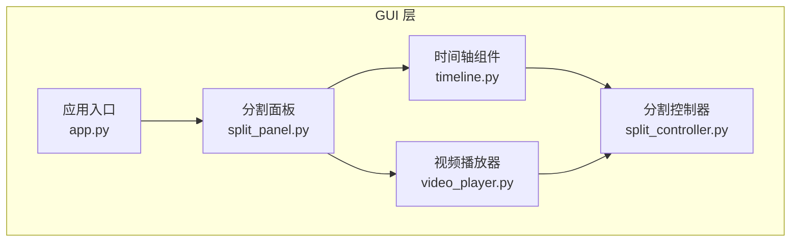
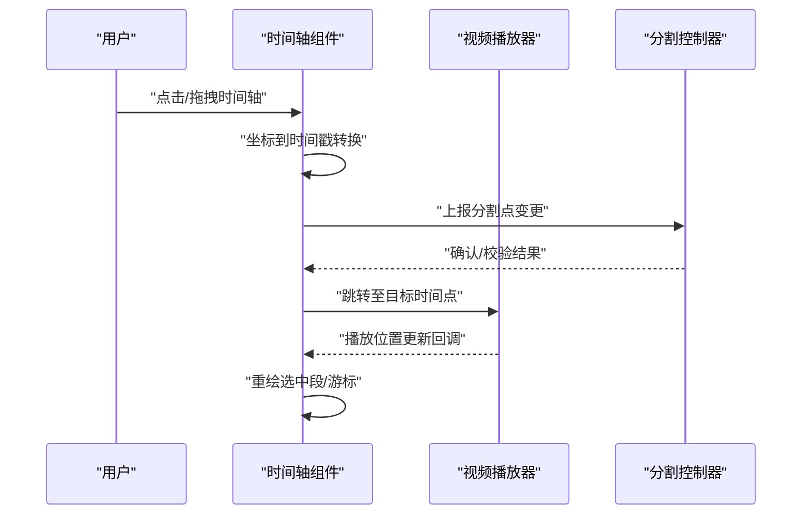
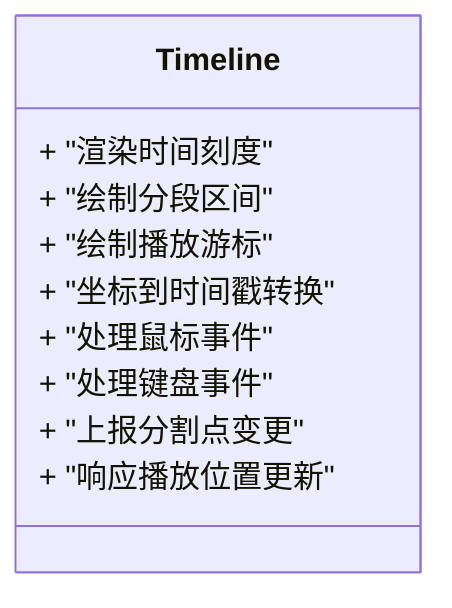
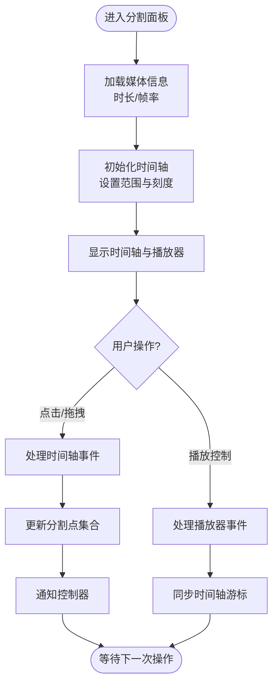
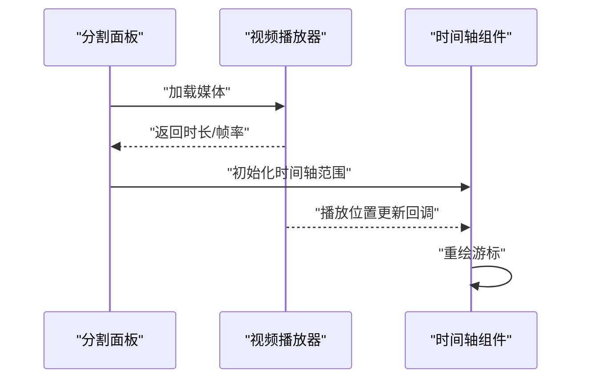
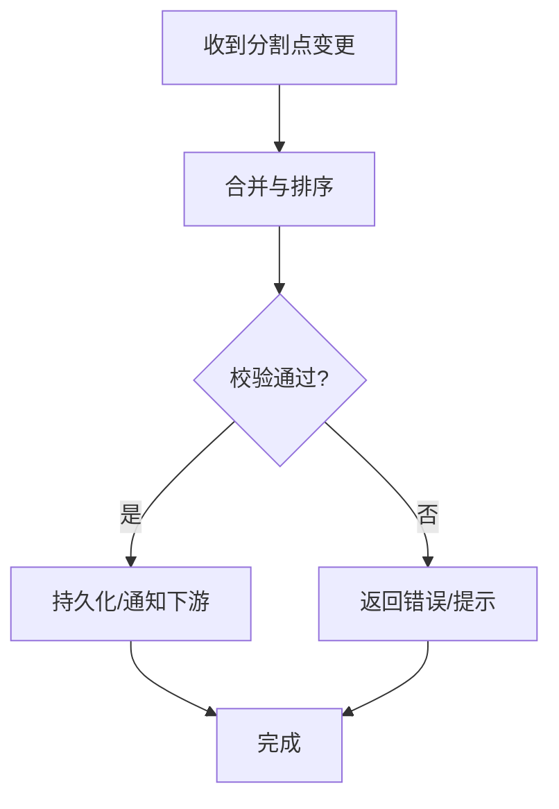
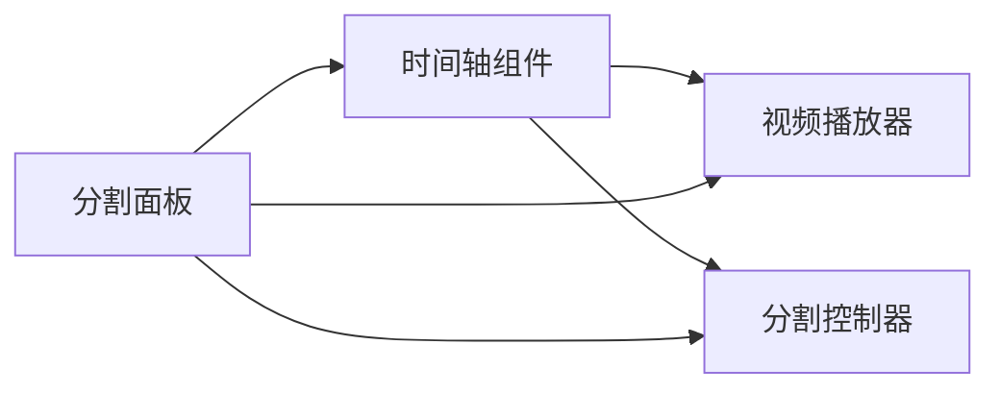

# 时间轴组件

<cite>
**本文引用的文件**   
- [timeline.py](file://gui/widgets/timeline.py)
- [split_panel.py](file://gui/widgets/split_panel.py)
- [video_player.py](file://gui/widgets/video_player.py)
- [app.py](file://gui/app.py)
- [split_controller.py](file://gui/controllers/split_controller.py)
</cite>

## 目录
1. [简介](#简介)
2. [项目结构](#项目结构)
3. [核心组件](#核心组件)
4. [架构总览](#架构总览)
5. [详细组件分析](#详细组件分析)
6. [依赖关系分析](#依赖关系分析)
7. [性能考虑](#性能考虑)
8. [故障排查指南](#故障排查指南)
9. [结论](#结论)
10. [附录](#附录)

## 简介
本文件聚焦于“时间轴组件”的设计与实现，围绕其在视频分割工作流中的职责、与其他模块的交互方式、数据流转与事件机制进行系统化说明。文档旨在帮助开发者快速理解时间轴的代码组织、关键流程与扩展点，并为后续优化与维护提供依据。

## 项目结构
时间轴组件位于 GUI 层，属于可视化编辑界面的一部分，主要承担以下职责：
- 展示视频的时长与分段信息
- 接收用户交互（点击、拖拽）并转换为时间戳
- 与播放器同步播放位置
- 向控制器上报分割点变更，驱动后续处理

图表来源
- [app.py](file://gui/app.py)
- [split_panel.py](file://gui/widgets/split_panel.py)
- [timeline.py](file://gui/widgets/timeline.py)
- [video_player.py](file://gui/widgets/video_player.py)
- [split_controller.py](file://gui/controllers/split_controller.py)

章节来源
- [app.py](file://gui/app.py)
- [split_panel.py](file://gui/widgets/split_panel.py)
- [timeline.py](file://gui/widgets/timeline.py)
- [video_player.py](file://gui/widgets/video_player.py)
- [split_controller.py](file://gui/controllers/split_controller.py)

## 核心组件
- 时间轴组件：负责渲染时间刻度、显示分段标记、响应鼠标/键盘事件，将像素坐标映射为时间戳，并向控制器广播分割点变更。
- 分割面板：组合时间轴与播放器，协调二者状态，承载用户操作的主视图。
- 视频播放器：负责媒体播放、帧率与时长获取、播放位置更新。
- 分割控制器：维护分割点集合、校验与持久化、触发下游任务（如切分、转写等）。

章节来源
- [timeline.py](file://gui/widgets/timeline.py)
- [split_panel.py](file://gui/widgets/split_panel.py)
- [video_player.py](file://gui/widgets/video_player.py)
- [split_controller.py](file://gui/controllers/split_controller.py)

## 架构总览
时间轴在整体架构中处于“视图-控制”边界，向上暴露事件接口，向下依赖控制器完成业务逻辑。播放器通过信号或回调与时间轴保持同步，确保视觉与播放进度一致。

图表来源
- [timeline.py](file://gui/widgets/timeline.py)
- [video_player.py](file://gui/widgets/video_player.py)
- [split_controller.py](file://gui/controllers/split_controller.py)

## 详细组件分析

### 时间轴组件（timeline.py）
- 渲染与布局
  - 绘制时间刻度、分段区间、当前播放游标
  - 支持缩放与滚动以适配长视频
- 交互处理
  - 鼠标按下/移动/释放用于创建或调整分割点
  - 键盘快捷键用于微调时间戳
- 数据模型
  - 内部维护分割点列表与选中状态
  - 将像素坐标映射为时间戳，考虑缩放因子与偏移
- 事件与通信
  - 对外暴露分割点变更事件
  - 与播放器联动，响应播放位置变化

图表来源
- [timeline.py](file://gui/widgets/timeline.py)

章节来源
- [timeline.py](file://gui/widgets/timeline.py)

### 分割面板（split_panel.py）
- 组合时间轴与播放器，统一布局
- 管理用户操作上下文（如是否正在拖拽）
- 转发时间轴与播放器的状态变化，保证 UI 一致性

图表来源
- [split_panel.py](file://gui/widgets/split_panel.py)
- [timeline.py](file://gui/widgets/timeline.py)
- [video_player.py](file://gui/widgets/video_player.py)
- [split_controller.py](file://gui/controllers/split_controller.py)

章节来源
- [split_panel.py](file://gui/widgets/split_panel.py)

### 视频播放器（video_player.py）
- 媒体加载与元数据读取（时长、分辨率、帧率）
- 播放控制（开始、暂停、跳转）
- 播放位置回调，供时间轴同步游标

图表来源
- [video_player.py](file://gui/widgets/video_player.py)
- [timeline.py](file://gui/widgets/timeline.py)
- [split_panel.py](file://gui/widgets/split_panel.py)

章节来源
- [video_player.py](file://gui/widgets/video_player.py)

### 分割控制器（split_controller.py）
- 维护分割点集合，提供增删改查接口
- 执行分割点校验（去重、排序、边界检查）
- 触发下游任务（如调用切分器、写入配置）

图表来源
- [split_controller.py](file://gui/controllers/split_controller.py)

章节来源
- [split_controller.py](file://gui/controllers/split_controller.py)

## 依赖关系分析
- 组件耦合
  - 时间轴依赖播放器获取媒体信息与播放位置
  - 时间轴与控制器解耦，通过事件/回调通信
  - 分割面板作为编排者，降低上层复杂度
- 外部依赖
  - 媒体解码与播放库（由播放器封装）
  - 可能的文件系统或配置存储（由控制器封装）

图表来源
- [timeline.py](file://gui/widgets/timeline.py)
- [video_player.py](file://gui/widgets/video_player.py)
- [split_controller.py](file://gui/controllers/split_controller.py)
- [split_panel.py](file://gui/widgets/split_panel.py)

章节来源
- [timeline.py](file://gui/widgets/timeline.py)
- [video_player.py](file://gui/widgets/video_player.py)
- [split_controller.py](file://gui/controllers/split_controller.py)
- [split_panel.py](file://gui/widgets/split_panel.py)

## 性能考虑
- 渲染优化
  - 仅在必要时重绘（如分割点变更、播放位置更新）
  - 使用增量绘制策略，避免整幅画布刷新
- 事件节流
  - 对高频事件（如拖拽）进行节流或防抖，减少控制器压力
- 数据量控制
  - 大视频场景下限制分段数量与刻度密度
  - 按需加载与懒渲染长条区域

## 故障排查指南
- 常见问题
  - 时间轴与播放器不同步：检查播放位置回调是否被正确注册与触发
  - 分割点未生效：确认控制器校验逻辑与持久化路径
  - 拖拽卡顿：评估事件节流策略与重绘频率
- 定位步骤
  - 在时间轴事件处理处添加日志，记录坐标到时间戳的转换结果
  - 在控制器入口处打印分割点集合变更前后对比
  - 验证播放器回调的时间戳精度与单位一致性

章节来源
- [timeline.py](file://gui/widgets/timeline.py)
- [split_controller.py](file://gui/controllers/split_controller.py)
- [video_player.py](file://gui/widgets/video_player.py)

## 结论
时间轴组件作为视频分割界面的核心可视化元素，承担了从用户交互到业务数据的桥梁作用。通过与播放器与控制器的清晰分工与松耦合设计，系统具备良好的可维护性与可扩展性。后续可在渲染性能、事件调度与错误提示方面持续优化，以提升用户体验与稳定性。

## 附录
- 术语
  - 分割点：用户在时间轴上标记的切分位置
  - 游标：表示当前播放位置的指示线
  - 缩放因子：像素到时间戳映射的比例系数
- 参考文件
  - [timeline.py](file://gui/widgets/timeline.py)
  - [split_panel.py](file://gui/widgets/split_panel.py)
  - [video_player.py](file://gui/widgets/video_player.py)
  - [split_controller.py](file://gui/controllers/split_controller.py)
  - [app.py](file://gui/app.py)
