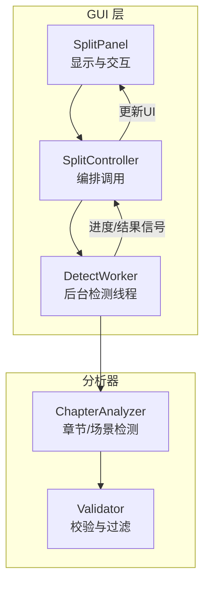
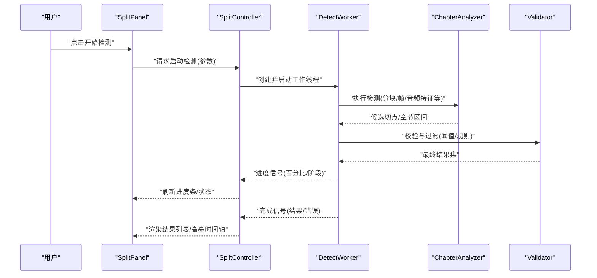
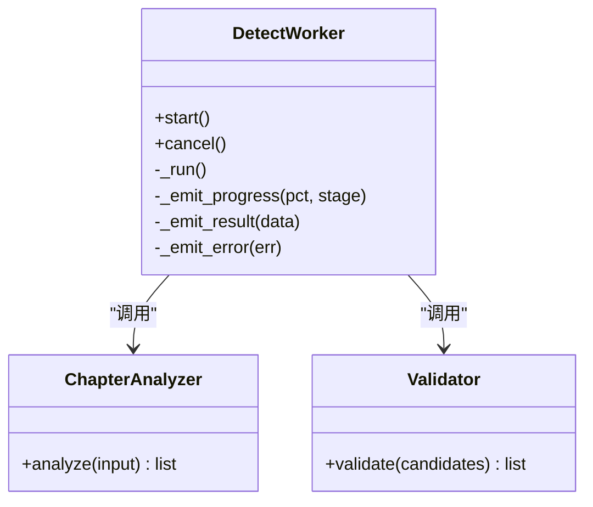
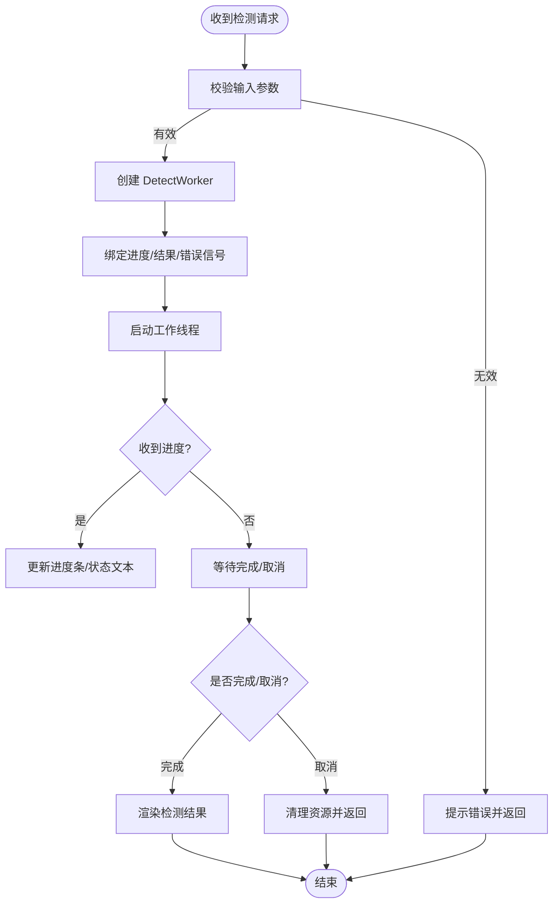
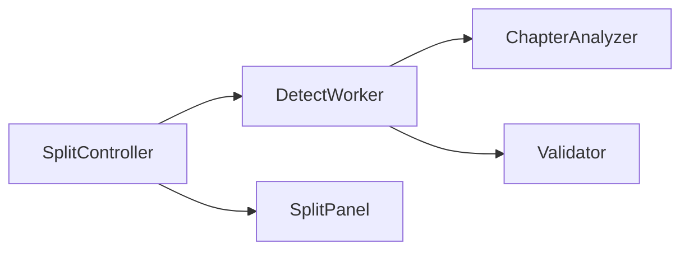

# 检测工作线程

<cite>
**本文引用的文件**   
- [gui/workers/detect_worker.py](file://gui/workers/detect_worker.py)
- [gui/workers/__init__.py](file://gui/workers/__init__.py)
- [gui/controllers/split_controller.py](file://gui/controllers/split_controller.py)
- [gui/widgets/split_panel.py](file://gui/widgets/split_panel.py)
- [video_splitter/analyzer/chapter.py](file://video_splitter/analyzer/chapter.py)
- [video_splitter/analyzer/validator.py](file://video_splitter/analyzer/validator.py)
- [tests/test_workers.py](file://tests/test_workers.py)
</cite>

## 目录
1. [简介](#简介)
2. [项目结构](#项目结构)
3. [核心组件](#核心组件)
4. [架构总览](#架构总览)
5. [详细组件分析](#详细组件分析)
6. [依赖分析](#依赖分析)
7. [性能考虑](#性能考虑)
8. [故障排查指南](#故障排查指南)
9. [结论](#结论)
10. [附录](#附录)

## 简介
本文件聚焦于“检测工作线程”的实现与使用，围绕 GUI 层的工作线程如何驱动视频章节/场景检测、与控制器和 UI 交互、以及错误处理与进度反馈机制进行系统化说明。目标是帮助开发者快速理解检测流程的入口、数据流、异常路径与扩展点，并提供可操作的排障建议。

## 项目结构
与“检测工作线程”直接相关的代码主要分布在以下位置：
- GUI 工作线程实现：gui/workers/detect_worker.py
- GUI 控制器（触发检测）：gui/controllers/split_controller.py
- GUI 面板（展示结果与交互）：gui/widgets/split_panel.py
- 检测算法与分析器：video_splitter/analyzer/chapter.py、video_splitter/analyzer/validator.py
- 测试用例：tests/test_workers.py

图表来源
- [gui/workers/detect_worker.py](file://gui/workers/detect_worker.py)
- [gui/controllers/split_controller.py](file://gui/controllers/split_controller.py)
- [gui/widgets/split_panel.py](file://gui/widgets/split_panel.py)
- [video_splitter/analyzer/chapter.py](file://video_splitter/analyzer/chapter.py)
- [video_splitter/analyzer/validator.py](file://video_splitter/analyzer/validator.py)

章节来源
- [gui/workers/detect_worker.py](file://gui/workers/detect_worker.py)
- [gui/controllers/split_controller.py](file://gui/controllers/split_controller.py)
- [gui/widgets/split_panel.py](file://gui/widgets/split_panel.py)
- [video_splitter/analyzer/chapter.py](file://video_splitter/analyzer/chapter.py)
- [video_splitter/analyzer/validator.py](file://video_splitter/analyzer/validator.py)

## 核心组件
- DetectWorker：在独立线程中执行检测任务，负责读取输入、调用分析器、产出检测结果、上报进度与异常。
- SplitController：作为协调者，接收用户操作，启动/停止检测，转发结果到 UI。
- SplitPanel：提供可视化界面，展示检测进度、结果列表与编辑能力。
- ChapterAnalyzer/Validator：封装检测算法与结果校验逻辑，供工作线程复用。

章节来源
- [gui/workers/detect_worker.py](file://gui/workers/detect_worker.py)
- [gui/controllers/split_controller.py](file://gui/controllers/split_controller.py)
- [gui/widgets/split_panel.py](file://gui/widgets/split_panel.py)
- [video_splitter/analyzer/chapter.py](file://video_splitter/analyzer/chapter.py)
- [video_splitter/analyzer/validator.py](file://video_splitter/analyzer/validator.py)

## 架构总览
下图展示了从用户点击“开始检测”到结果落地的完整时序。

图表来源
- [gui/controllers/split_controller.py](file://gui/controllers/split_controller.py)
- [gui/workers/detect_worker.py](file://gui/workers/detect_worker.py)
- [video_splitter/analyzer/chapter.py](file://video_splitter/analyzer/chapter.py)
- [video_splitter/analyzer/validator.py](file://video_splitter/analyzer/validator.py)
- [gui/widgets/split_panel.py](file://gui/widgets/split_panel.py)

## 详细组件分析

### 组件A：DetectWorker（检测工作线程）
职责
- 在后台线程中运行检测流程，避免阻塞 UI。
- 周期性上报进度，支持取消/中断。
- 将分析器产出的中间结果进行聚合与校验，输出最终结果或错误信息。

关键行为
- 初始化：加载配置、准备输入源（如视频路径/媒体句柄）。
- 执行：按帧/片段迭代，调用分析器计算指标，收集候选切点。
- 校验：应用阈值、最小间隔、平滑策略等规则。
- 回调：通过信号/回调向控制器报告进度与结果。
- 清理：释放资源、记录日志、统一异常包装。

图表来源
- [gui/workers/detect_worker.py](file://gui/workers/detect_worker.py)
- [video_splitter/analyzer/chapter.py](file://video_splitter/analyzer/chapter.py)
- [video_splitter/analyzer/validator.py](file://video_splitter/analyzer/validator.py)

章节来源
- [gui/workers/detect_worker.py](file://gui/workers/detect_worker.py)

### 组件B：SplitController（控制器）
职责
- 接收来自 UI 的检测请求，构造参数并调度工作线程。
- 订阅工作线程的信号，更新 UI 状态与结果。
- 管理并发与生命周期（启动、暂停、取消、销毁）。

关键行为
- 参数校验与默认值填充。
- 创建工作线程实例并绑定信号槽。
- 根据进度更新 UI；根据结果刷新列表与时间轴。
- 捕获异常并转换为友好的用户提示。

图表来源
- [gui/controllers/split_controller.py](file://gui/controllers/split_controller.py)
- [gui/workers/detect_worker.py](file://gui/workers/detect_worker.py)

章节来源
- [gui/controllers/split_controller.py](file://gui/controllers/split_controller.py)

### 组件C：SplitPanel（UI 面板）
职责
- 呈现检测进度、结果列表与时间轴高亮。
- 提供“开始/停止/重置”等操作按钮。
- 将用户选择的结果回传给控制器以便后续处理。

关键行为
- 监听控制器的更新事件，增量刷新视图。
- 对长列表进行虚拟化/分页渲染以提升性能。
- 对用户误操作进行防护（如重复点击）。

章节来源
- [gui/widgets/split_panel.py](file://gui/widgets/split_panel.py)

### 组件D：ChapterAnalyzer 与 Validator（分析器与校验器）
职责
- ChapterAnalyzer：基于视频/音频特征计算相似度、亮度变化、运动强度等，生成候选切点。
- Validator：对候选切点进行去重、合并、间隔约束、阈值过滤，得到稳定可用的章节区间。

复杂度与优化要点
- 分析阶段通常涉及逐帧或分块计算，应结合批处理与缓存减少重复 IO。
- 校验阶段为 O(n log n) 或近似线性，注意排序与滑动窗口策略。

章节来源
- [video_splitter/analyzer/chapter.py](file://video_splitter/analyzer/chapter.py)
- [video_splitter/analyzer/validator.py](file://video_splitter/analyzer/validator.py)

## 依赖分析
- 耦合关系
  - SplitController 强依赖 DetectWorker 接口（信号/方法契约）。
  - DetectWorker 依赖 ChapterAnalyzer 与 Validator 的 API。
  - SplitPanel 仅依赖 SplitController 的更新信号，保持松耦合。
- 外部依赖
  - 媒体解析库（用于读取视频帧/音频片段）。
  - 数值计算/图像处理库（用于特征提取）。
- 潜在循环依赖
  - 确保 Controller 不反向依赖 Panel，避免循环引用。

图表来源
- [gui/controllers/split_controller.py](file://gui/controllers/split_controller.py)
- [gui/workers/detect_worker.py](file://gui/workers/detect_worker.py)
- [gui/widgets/split_panel.py](file://gui/widgets/split_panel.py)
- [video_splitter/analyzer/chapter.py](file://video_splitter/analyzer/chapter.py)
- [video_splitter/analyzer/validator.py](file://video_splitter/analyzer/validator.py)

章节来源
- [gui/controllers/split_controller.py](file://gui/controllers/split_controller.py)
- [gui/workers/detect_worker.py](file://gui/workers/detect_worker.py)
- [gui/widgets/split_panel.py](file://gui/widgets/split_panel.py)
- [video_splitter/analyzer/chapter.py](file://video_splitter/analyzer/chapter.py)
- [video_splitter/analyzer/validator.py](file://video_splitter/analyzer/validator.py)

## 性能考虑
- 分块与并行
  - 将视频划分为固定时长片段并行分析，降低单帧开销与内存峰值。
- 特征降采样
  - 对高分辨率帧进行缩放或隔帧采样，平衡精度与速度。
- 缓存与复用
  - 对已计算的片段特征做缓存，避免重复解码与计算。
- 进度上报频率
  - 合理设置进度上报间隔，避免频繁跨线程通信导致 UI 卡顿。
- 结果后处理
  - 校验阶段采用滑动窗口与阈值合并，减少不必要的细粒度切点。

[本节为通用指导，无需源码引用]

## 故障排查指南
常见问题与定位步骤
- 无进度更新
  - 检查工作线程是否成功启动，确认进度信号是否被正确连接。
  - 查看控制器是否正确订阅进度事件。
- 结果为空或异常多
  - 调整分析器阈值与最小间隔参数。
  - 检查 Validator 的过滤规则是否过于严格。
- 长时间无响应
  - 确认是否存在大文件未分块导致的内存压力。
  - 检查是否有死锁或阻塞式 IO。
- 取消无效
  - 检查工作线程是否定期检查取消标志并在合适断点退出。
- 异常堆栈难以定位
  - 在工作线程内部统一捕获异常并附带上下文（输入路径、阶段、索引），便于追踪。

章节来源
- [gui/workers/detect_worker.py](file://gui/workers/detect_worker.py)
- [gui/controllers/split_controller.py](file://gui/controllers/split_controller.py)
- [tests/test_workers.py](file://tests/test_workers.py)

## 结论
检测工作线程通过将耗时分析移出主线程，显著提升了用户体验与系统稳定性。配合清晰的信号/回调契约与分层设计（控制器-工作线程-分析器-校验器），可在保证可维护性的同时灵活扩展新的检测策略与 UI 表现。建议在后续迭代中持续完善进度上报粒度、错误诊断信息与性能基准测试。

[本节为总结性内容，无需源码引用]

## 附录
- 相关测试
  - tests/test_workers.py：覆盖工作线程的启动、取消、异常路径与结果验证。
- 扩展建议
  - 增加可插拔的分析引擎接口，便于接入不同检测算法。
  - 引入配置中心统一管理阈值与策略，支持运行时热更新。

章节来源
- [tests/test_workers.py](file://tests/test_workers.py)
