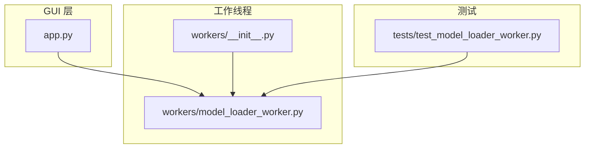
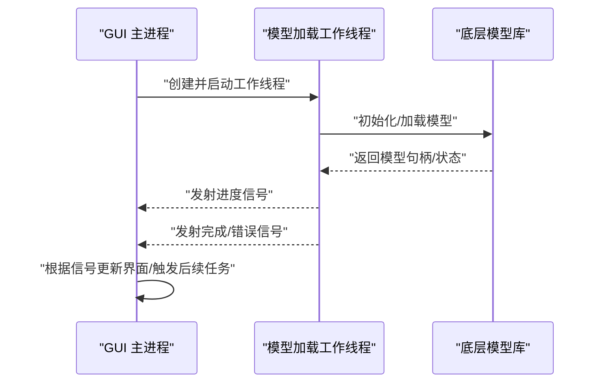
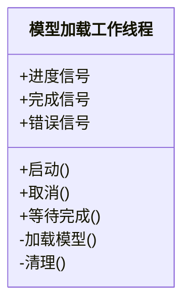

# 模型加载工作线程

<cite>
**本文引用的文件**   
- [gui/workers/model_loader_worker.py](file://gui/workers/model_loader_worker.py)
- [gui/workers/__init__.py](file://gui/workers/__init__.py)
- [gui/app.py](file://gui/app.py)
- [tests/test_model_loader_worker.py](file://tests/test_model_loader_worker.py)
</cite>

## 目录
1. [简介](#简介)
2. [项目结构](#项目结构)
3. [核心组件](#核心组件)
4. [架构总览](#架构总览)
5. [详细组件分析](#详细组件分析)
6. [依赖分析](#依赖分析)
7. [性能考虑](#性能考虑)
8. [故障排查指南](#故障排查指南)
9. [结论](#结论)
10. [附录](#附录)

## 简介
本文件聚焦于“模型加载工作线程”的实现与使用，围绕 gui/workers/model_loader_worker.py 中的工作线程类展开。该工作线程负责在独立线程中异步加载语音识别/转写所需的模型资源，避免阻塞主界面；通过信号槽机制向 GUI 层汇报进度、状态与错误，供上层控制器（如分割、转写等）协调调用。

## 项目结构
与模型加载相关的代码主要位于 gui/workers 子模块，并在测试与主应用中进行集成验证。

图表来源
- [gui/app.py](file://gui/app.py)
- [gui/workers/__init__.py](file://gui/workers/__init__.py)
- [gui/workers/model_loader_worker.py](file://gui/workers/model_loader_worker.py)
- [tests/test_model_loader_worker.py](file://tests/test_model_loader_worker.py)

章节来源
- [gui/workers/model_loader_worker.py](file://gui/workers/model_loader_worker.py)
- [gui/workers/__init__.py](file://gui/workers/__init__.py)
- [gui/app.py](file://gui/app.py)
- [tests/test_model_loader_worker.py](file://tests/test_model_loader_worker.py)

## 核心组件
- 模型加载工作线程：封装模型初始化、预热、缓存与异常上报流程，提供统一的进度与结果信号。
- 工作线程注册/导出：在 workers 包初始化中统一暴露工作线程类型，便于导入与测试。
- 应用集成：GUI 主进程在工作线程完成加载后订阅信号并更新 UI 或触发后续任务。
- 单元测试：对工作线程的启动、取消、错误路径进行断言与覆盖。

章节来源
- [gui/workers/model_loader_worker.py](file://gui/workers/model_loader_worker.py)
- [gui/workers/__init__.py](file://gui/workers/__init__.py)
- [gui/app.py](file://gui/app.py)
- [tests/test_model_loader_worker.py](file://tests/test_model_loader_worker.py)

## 架构总览
下图展示了从 GUI 发起模型加载到工作线程执行、再到结果回传的完整时序。

图表来源
- [gui/workers/model_loader_worker.py](file://gui/workers/model_loader_worker.py)
- [gui/app.py](file://gui/app.py)

## 详细组件分析

### 模型加载工作线程类
- 职责
  - 在后台线程中加载模型资源，支持进度回调与错误上报。
  - 对外暴露标准信号：开始、进度、完成、错误、取消等。
  - 提供可中断能力，确保长时间加载可被安全取消。
- 关键行为
  - 初始化阶段：校验参数、准备临时目录或缓存位置。
  - 加载阶段：按步骤下载/解压/构建模型，周期性发射进度信号。
  - 完成阶段：将模型句柄持久化或注入共享上下文，发射完成信号。
  - 错误处理：捕获异常并转换为结构化错误信号，包含错误码与消息。
  - 取消处理：响应取消请求，清理中间状态并退出。
- 并发与线程安全
  - 所有对外信号均通过事件循环安全发送。
  - 内部状态变更在临界区保护，避免竞态条件。
- 扩展点
  - 可通过策略接口替换具体模型实现（例如不同引擎或后端）。
  - 可插拔的进度计算与日志记录器。

图表来源
- [gui/workers/model_loader_worker.py](file://gui/workers/model_loader_worker.py)

章节来源
- [gui/workers/model_loader_worker.py](file://gui/workers/model_loader_worker.py)

### 工作线程注册与导出
- 作用
  - 在 workers 包的 __init__ 中集中导出工作线程类型，简化上层导入路径。
  - 为测试与外部模块提供稳定的入口。
- 设计要点
  - 单一职责：仅做导出与可选的默认配置。
  - 版本兼容：新增工作线程时在此处统一注册。

章节来源
- [gui/workers/__init__.py](file://gui/workers/__init__.py)

### GUI 集成与信号绑定
- 典型流程
  - 用户触发“加载模型”操作。
  - 主进程创建工作线程实例并连接信号槽。
  - 工作线程运行期间，UI 根据进度信号更新进度条/提示。
  - 完成后启用相关功能按钮；出错时显示错误信息并提供重试。
- 注意事项
  - 避免在主线程执行耗时 I/O。
  - 对重复加载进行去重与幂等处理。
  - 合理设置超时与重试策略。

章节来源
- [gui/app.py](file://gui/app.py)

### 单元测试要点
- 覆盖场景
  - 正常加载成功路径。
  - 网络/磁盘异常导致的失败路径。
  - 取消操作的及时性与资源清理。
  - 进度信号的频率与范围合理性。
- 常用技巧
  - 使用模拟对象替代真实模型库。
  - 利用事件循环驱动异步信号验证。
  - 断言信号发射次数与参数。

章节来源
- [tests/test_model_loader_worker.py](file://tests/test_model_loader_worker.py)

## 依赖分析
- 内部依赖
  - 工作线程依赖底层模型库（由具体实现决定），并通过信号与 GUI 解耦。
  - GUI 不直接持有模型句柄，而是通过工作线程的结果信号获取。
- 外部依赖
  - 可能涉及网络下载、磁盘读写、GPU/CPU 设备选择等。
- 耦合度
  - 通过信号槽降低耦合，便于替换实现与并行测试。

图表来源
- [gui/app.py](file://gui/app.py)
- [gui/workers/model_loader_worker.py](file://gui/workers/model_loader_worker.py)

章节来源
- [gui/app.py](file://gui/app.py)
- [gui/workers/model_loader_worker.py](file://gui/workers/model_loader_worker.py)

## 性能考虑
- 预加载与缓存
  - 首次加载较慢，建议将模型缓存至本地目录，后续启动快速复用。
- 并发控制
  - 限制同时运行的加载任务数量，避免争用 GPU/内存。
- 进度反馈
  - 合理设置进度粒度，避免过多信号导致 UI 卡顿。
- 资源释放
  - 取消或异常路径下确保中间文件与句柄被正确释放。

## 故障排查指南
- 常见问题
  - 模型下载失败：检查网络连通性、代理与镜像源。
  - 磁盘空间不足：确认缓存目录所在分区可用空间。
  - 权限问题：确保对缓存目录有读写权限。
  - 设备不可用：GPU/CPU 设备选择错误或驱动缺失。
- 定位方法
  - 查看错误信号携带的错误码与消息。
  - 开启调试日志，关注加载各阶段的耗时与异常堆栈。
  - 复现最小用例，隔离第三方依赖影响。
- 恢复策略
  - 清理损坏的缓存并重试。
  - 切换设备或降级精度以适配硬件。
  - 增加超时与重试次数。

章节来源
- [gui/workers/model_loader_worker.py](file://gui/workers/model_loader_worker.py)
- [tests/test_model_loader_worker.py](file://tests/test_model_loader_worker.py)

## 结论
模型加载工作线程将耗时的模型初始化过程从主线程剥离，通过信号槽与 GUI 解耦，提升了用户体验与系统稳定性。配合完善的错误处理、取消机制与单元测试，可在多环境下可靠运行。建议在部署时结合缓存与并发控制进一步优化性能。

## 附录
- 术语
  - 工作线程：在后台执行的独立线程，用于承担耗时任务。
  - 信号槽：跨线程通信机制，用于事件通知与数据传递。
  - 模型句柄：指向已加载模型的引用，供后续推理/转写使用。
