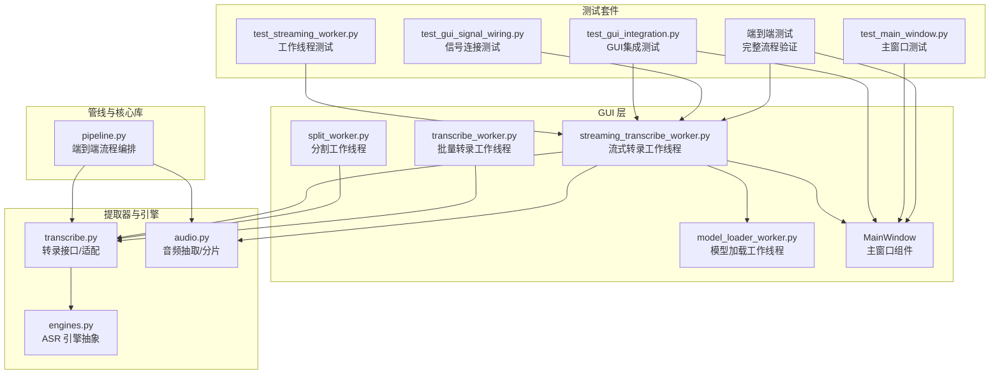
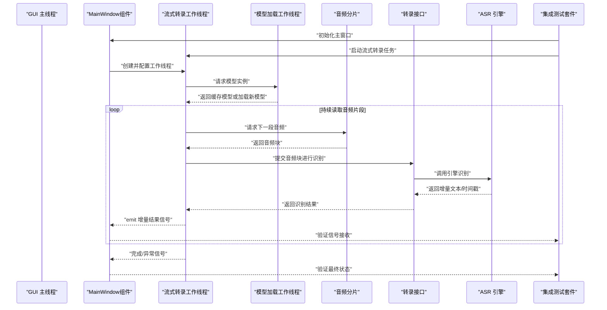
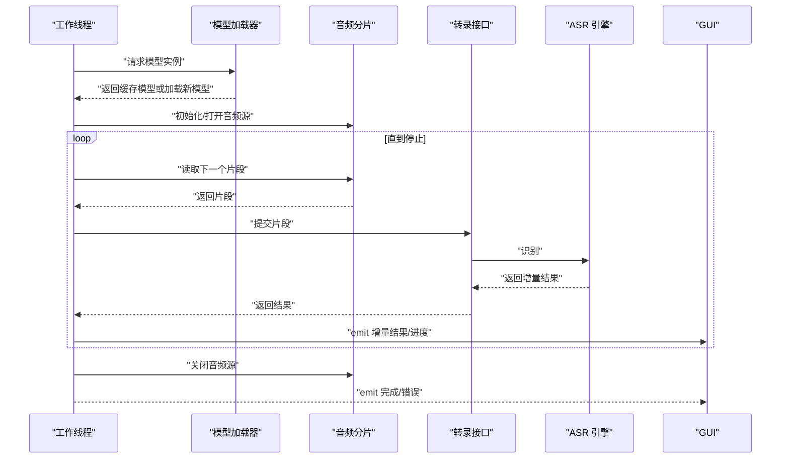
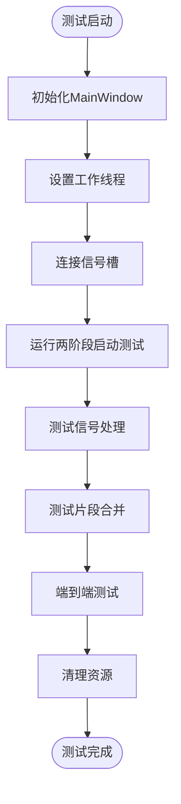
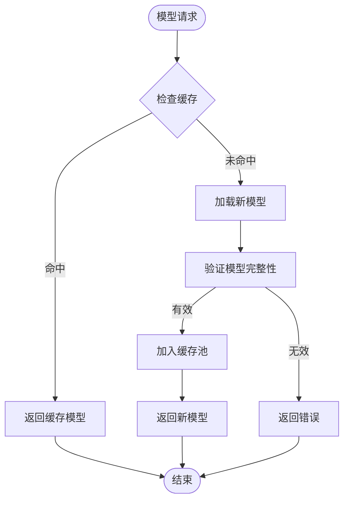
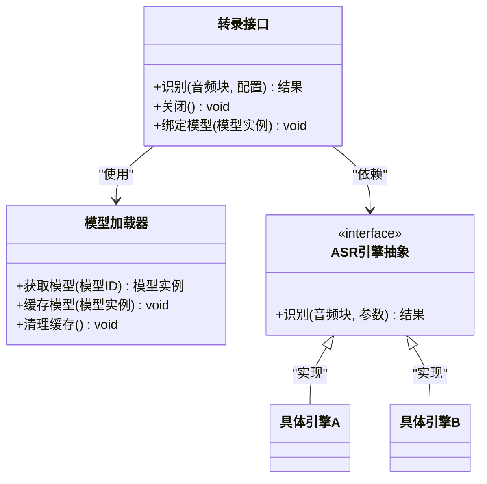
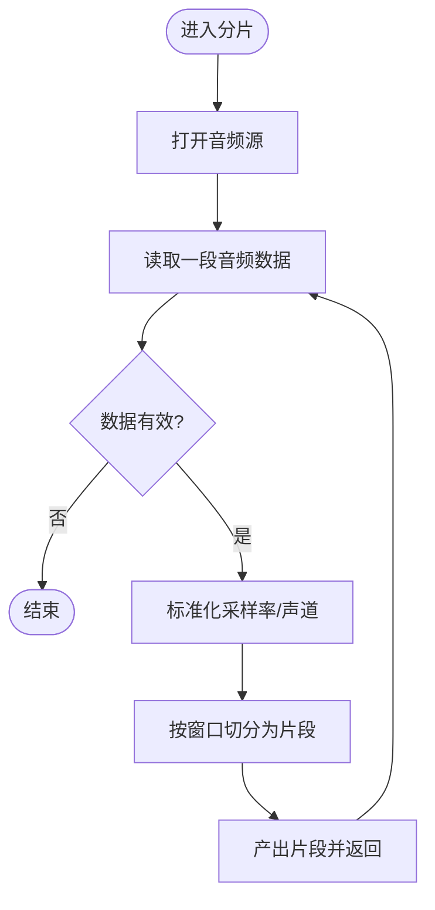
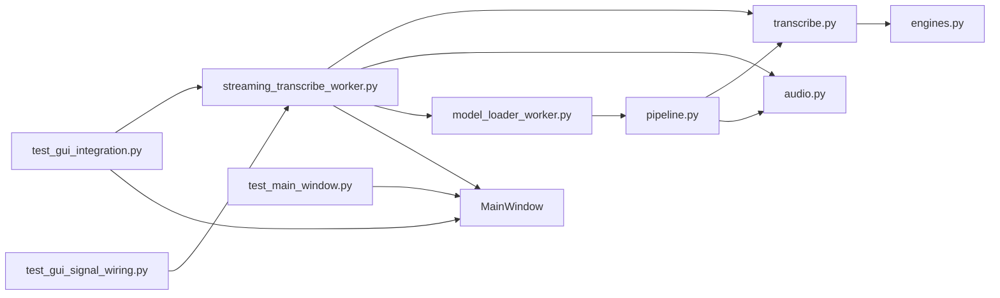

# 流式转录工作线程

<cite>
**本文引用的文件**   
- [streaming_transcribe_worker.py](file://gui/workers/streaming_transcribe_worker.py)
- [transcribe_worker.py](file://gui/workers/transcribe_worker.py)
- [split_worker.py](file://gui/workers/split_worker.py)
- [model_loader_worker.py](file://gui/workers/model_loader_worker.py)
- [transcribe.py](file://video_splitter/extractor/transcribe.py)
- [engines.py](file://video_splitter/extractor/engines.py)
- [audio.py](file://video_splitter/extractor/audio.py)
- [pipeline.py](file://video_splitter/pipeline.py)
- [test_streaming_worker.py](file://tests/test_streaming_worker.py)
- [test_gui_integration.py](file://tests/test_gui_integration.py)
- [test_gui_signal_wiring.py](file://tests/test_gui_signal_wiring.py)
- [test_main_window.py](file://tests/test_main_window.py)
</cite>

## 更新摘要
**所做更改**   
- 新增完整的集成测试覆盖，包括与MainWindow组件的交互、信号处理机制、两阶段启动流程验证以及片段合并功能的端到端测试
- 增强了GUI集成测试套件，确保工作线程与主窗口的稳定通信
- 完善了信号连接和事件处理的测试覆盖率
- 添加了端到端测试场景，验证完整的工作流程

## 目录
1. [简介](#简介)
2. [项目结构](#项目结构)
3. [核心组件](#核心组件)
4. [架构总览](#架构总览)
5. [详细组件分析](#详细组件分析)
6. [依赖关系分析](#依赖关系分析)
7. [性能考量](#性能考量)
8. [故障排查指南](#故障排查指南)
9. [结论](#结论)
10. [附录](#附录)

## 简介
本文件聚焦于"流式转录工作线程"的实现与使用，围绕 GUI 层的工作线程如何驱动底层提取器进行实时音频分片、增量识别与结果回传。文档从系统架构、数据流、处理逻辑、错误处理与性能特性等维度展开，并提供可视化图示与排障建议，帮助读者快速理解并扩展该能力。

**更新** 本次更新重点介绍了新增的完整集成测试覆盖，包括与MainWindow组件的交互测试、信号处理机制验证、两阶段启动流程测试以及片段合并功能的端到端测试，显著提升了系统的可测试性和可靠性。

## 项目结构
与流式转录相关的关键位置如下：
- GUI 工作线程：位于 gui/workers 下，负责在独立线程中执行任务并通过信号向 UI 更新状态。
- 模型加载器：位于 gui/workers 下，管理模型缓存和预加载机制。
- 提取器与引擎：位于 video_splitter/extractor 下，封装音频抽取与 ASR 调用细节。
- 管线与配置：位于 video_splitter 根目录，提供端到端流程编排与参数管理。
- 测试：位于 tests 下，覆盖工作线程行为、GUI集成、信号处理和端到端场景。

**图表来源**
- [streaming_transcribe_worker.py](file://gui/workers/streaming_transcribe_worker.py)
- [transcribe_worker.py](file://gui/workers/transcribe_worker.py)
- [split_worker.py](file://gui/workers/split_worker.py)
- [model_loader_worker.py](file://gui/workers/model_loader_worker.py)
- [transcribe.py](file://video_splitter/extractor/transcribe.py)
- [engines.py](file://video_splitter/extractor/engines.py)
- [audio.py](file://video_splitter/extractor/audio.py)
- [pipeline.py](file://video_splitter/pipeline.py)
- [test_streaming_worker.py](file://tests/test_streaming_worker.py)
- [test_gui_integration.py](file://tests/test_gui_integration.py)
- [test_gui_signal_wiring.py](file://tests/test_gui_signal_wiring.py)
- [test_main_window.py](file://tests/test_main_window.py)

**章节来源**
- [streaming_transcribe_worker.py](file://gui/workers/streaming_transcribe_worker.py)
- [transcribe_worker.py](file://gui/workers/transcribe_worker.py)
- [split_worker.py](file://gui/workers/split_worker.py)
- [model_loader_worker.py](file://gui/workers/model_loader_worker.py)
- [transcribe.py](file://video_splitter/extractor/transcribe.py)
- [engines.py](file://video_splitter/extractor/engines.py)
- [audio.py](file://video_splitter/extractor/audio.py)
- [pipeline.py](file://video_splitter/pipeline.py)
- [test_streaming_worker.py](file://tests/test_streaming_worker.py)
- [test_gui_integration.py](file://tests/test_gui_integration.py)
- [test_gui_signal_wiring.py](file://tests/test_gui_signal_wiring.py)
- [test_main_window.py](file://tests/test_main_window.py)

## 核心组件
- 流式转录工作线程（GUI）：在独立线程中循环读取音频片段，调用转录接口，将增量结果通过信号推送给 UI。
- 模型加载工作线程（GUI）：管理模型缓存和预加载机制，支持跳过已缓存模型的重复加载。
- 转录接口（提取器）：统一封装不同 ASR 引擎的调用方式，屏蔽差异，暴露一致的输入输出契约。
- 音频分片（提取器）：按时间窗口切分音频，保证低延迟与稳定吞吐。
- 引擎抽象（提取器）：定义 ASR 引擎的统一接口，便于扩展新模型或后端。
- 端到端管线（核心库）：串联音频抽取、转录、后处理与产物落盘，供 CLI/GUI 复用。
- **集成测试套件**：提供完整的GUI集成测试、信号连接测试、主窗口交互测试和端到端流程验证。

**更新** 新增了集成测试套件作为核心组件，涵盖GUI集成、信号处理、主窗口交互和端到端测试场景。

**章节来源**
- [streaming_transcribe_worker.py](file://gui/workers/streaming_transcribe_worker.py)
- [model_loader_worker.py](file://gui/workers/model_loader_worker.py)
- [transcribe.py](file://video_splitter/extractor/transcribe.py)
- [engines.py](file://video_splitter/extractor/engines.py)
- [audio.py](file://video_splitter/extractor/audio.py)
- [pipeline.py](file://video_splitter/pipeline.py)
- [test_gui_integration.py](file://tests/test_gui_integration.py)
- [test_gui_signal_wiring.py](file://tests/test_gui_signal_wiring.py)
- [test_main_window.py](file://tests/test_main_window.py)

## 架构总览
下图展示了从 GUI 触发到 ASR 返回增量的完整时序，包括音频分片、模型缓存检查、流式识别与结果回调，以及测试框架的验证流程。

**图表来源**
- [streaming_transcribe_worker.py](file://gui/workers/streaming_transcribe_worker.py)
- [model_loader_worker.py](file://gui/workers/model_loader_worker.py)
- [transcribe.py](file://video_splitter/extractor/transcribe.py)
- [engines.py](file://video_splitter/extractor/engines.py)
- [audio.py](file://video_splitter/extractor/audio.py)
- [test_gui_integration.py](file://tests/test_gui_integration.py)
- [test_gui_signal_wiring.py](file://tests/test_gui_signal_wiring.py)
- [test_main_window.py](file://tests/test_main_window.py)

## 详细组件分析

### 流式转录工作线程（GUI）
职责
- 生命周期管理：创建、启动、停止与清理。
- 数据拉取：周期性或事件驱动地从音频源获取片段。
- 模型管理：与模型加载工作线程协作，确保模型可用且避免重复加载。
- 识别调度：将片段交给转录接口，接收增量结果。
- 信号派发：将中间结果与进度以信号形式通知 UI。
- 错误恢复：捕获异常并上报，支持重试或降级策略。

关键流程（伪时序）

**更新** 新增了与模型加载器的交互流程，支持模型缓存检查和预加载优化。

**图表来源**
- [streaming_transcribe_worker.py](file://gui/workers/streaming_transcribe_worker.py)
- [model_loader_worker.py](file://gui/workers/model_loader_worker.py)
- [audio.py](file://video_splitter/extractor/audio.py)
- [transcribe.py](file://video_splitter/extractor/transcribe.py)
- [engines.py](file://video_splitter/extractor/engines.py)

**章节来源**
- [streaming_transcribe_worker.py](file://gui/workers/streaming_transcribe_worker.py)
- [model_loader_worker.py](file://gui/workers/model_loader_worker.py)
- [test_streaming_worker.py](file://tests/test_streaming_worker.py)

### 集成测试套件
职责
- GUI集成测试：验证工作线程与MainWindow组件的完整交互流程。
- 信号处理测试：确保信号连接正确，事件传递可靠。
- 两阶段启动测试：验证应用启动流程的正确性。
- 端到端测试：覆盖片段合并功能和其他完整业务流程。
- 异常处理测试：验证错误场景下的系统稳定性。

测试架构

**图表来源**
- [test_gui_integration.py](file://tests/test_gui_integration.py)
- [test_gui_signal_wiring.py](file://tests/test_gui_signal_wiring.py)
- [test_main_window.py](file://tests/test_main_window.py)

**章节来源**
- [test_gui_integration.py](file://tests/test_gui_integration.py)
- [test_gui_signal_wiring.py](file://tests/test_gui_signal_wiring.py)
- [test_main_window.py](file://tests/test_main_window.py)

### 模型加载工作线程（GUI）
职责
- 模型缓存管理：维护模型实例的缓存池，避免重复加载相同模型。
- 预加载机制：在后台预加载常用模型，提升首次响应速度。
- 资源监控：跟踪模型内存占用和生命周期，及时释放不再使用的模型。
- 并发控制：确保多线程环境下的模型访问安全。
- 健康检查：验证模型完整性，检测模型损坏或版本不匹配。

工作流程

**图表来源**
- [model_loader_worker.py](file://gui/workers/model_loader_worker.py)

**章节来源**
- [model_loader_worker.py](file://gui/workers/model_loader_worker.py)

### 转录接口与引擎抽象（提取器）
职责
- 统一入口：对外暴露一致的识别方法，屏蔽多引擎差异。
- 参数映射：将高层配置转换为引擎所需参数。
- 结果归一化：将不同引擎的输出统一为内部结构。
- 错误映射：将引擎异常转换为上层可处理的错误类型。
- 模型绑定：支持与模型加载器的集成，自动获取和管理模型实例。

类关系示意

**更新** 新增了模型加载器依赖，支持模型实例的动态绑定和管理。

**图表来源**
- [transcribe.py](file://video_splitter/extractor/transcribe.py)
- [engines.py](file://video_splitter/extractor/engines.py)
- [model_loader_worker.py](file://gui/workers/model_loader_worker.py)

**章节来源**
- [transcribe.py](file://video_splitter/extractor/transcribe.py)
- [engines.py](file://video_splitter/extractor/engines.py)

### 音频分片（提取器）
职责
- 音频解码与缓冲：按需加载，避免一次性读入大文件。
- 时间窗口切分：按固定时长或自适应策略切分，平衡延迟与准确率。
- 格式标准化：确保送入引擎的采样率、声道数一致。

算法流程图

**图表来源**
- [audio.py](file://video_splitter/extractor/audio.py)

**章节来源**
- [audio.py](file://video_splitter/extractor/audio.py)

### 端到端管线（核心库）
职责
- 编排流程：串联音频抽取、转录、后处理与产物写入。
- 配置注入：集中管理参数，如窗口大小、超时、重试次数等。
- 事件上报：向外部提供进度、日志与错误事件。
- 模型协调：与模型加载器协作，确保转录过程中模型可用性。

**更新** 新增了模型协调功能，确保整个管线流程中模型的一致性和可用性。

**章节来源**
- [pipeline.py](file://video_splitter/pipeline.py)

## 依赖关系分析
- 耦合度
  - 工作线程对转录接口、音频分片和模型加载器存在直接依赖，属于典型的高内聚、低耦合设计。
  - 转录接口对引擎抽象解耦，新增引擎无需改动上层。
  - 模型加载器独立管理模型生命周期，与其他组件松耦合。
  - **集成测试套件与工作线程和MainWindow组件形成松耦合的测试依赖。**
- 外部依赖
  - ASR 引擎可能涉及网络 I/O 或本地推理，需关注超时与资源占用。
  - 模型缓存系统需要稳定的存储后端和内存管理。
  - **GUI框架依赖用于信号槽机制和异步事件处理。**
- 潜在环依赖
  - 当前分层清晰，未见明显循环依赖；若引入回调机制需注意方向性。
  - **测试套件通过模拟和桩对象避免与真实GUI组件的循环依赖。**

**图表来源**
- [streaming_transcribe_worker.py](file://gui/workers/streaming_transcribe_worker.py)
- [transcribe.py](file://video_splitter/extractor/transcribe.py)
- [audio.py](file://video_splitter/extractor/audio.py)
- [engines.py](file://video_splitter/extractor/engines.py)
- [pipeline.py](file://video_splitter/pipeline.py)
- [model_loader_worker.py](file://gui/workers/model_loader_worker.py)
- [test_gui_integration.py](file://tests/test_gui_integration.py)
- [test_gui_signal_wiring.py](file://tests/test_gui_signal_wiring.py)
- [test_main_window.py](file://tests/test_main_window.py)

**章节来源**
- [streaming_transcribe_worker.py](file://gui/workers/streaming_transcribe_worker.py)
- [transcribe.py](file://video_splitter/extractor/transcribe.py)
- [audio.py](file://video_splitter/extractor/audio.py)
- [engines.py](file://video_splitter/extractor/engines.py)
- [pipeline.py](file://video_splitter/pipeline.py)
- [model_loader_worker.py](file://gui/workers/model_loader_worker.py)
- [test_gui_integration.py](file://tests/test_gui_integration.py)
- [test_gui_signal_wiring.py](file://tests/test_gui_signal_wiring.py)
- [test_main_window.py](file://tests/test_main_window.py)

## 性能考量
- 分片粒度
  - 较小的分片降低首字延迟，但会增加引擎调用开销；较大的分片提升准确率但增加等待时间。
- 并发与队列
  - 合理设置生产者-消费者队列长度，避免背压导致阻塞。
- 资源复用
  - 复用引擎实例与连接，减少握手与初始化成本。
- 内存与缓存
  - 及时释放已处理片段，避免累积导致内存增长。
- 错误与重试
  - 针对网络抖动与临时失败，采用指数退避与最大重试上限。
- **模型缓存优化**
  - 预加载常用模型，避免首次请求时的加载延迟。
  - 智能缓存策略，根据使用频率动态调整缓存大小。
  - 模型版本管理，确保缓存模型与当前应用版本兼容。
  - 内存监控，自动清理长时间未使用的模型实例。
- **测试性能优化**
  - 使用异步测试框架提高测试执行效率。
  - 并行运行独立的测试用例，缩短整体测试时间。
  - 模拟耗时操作，加速端到端测试流程。

**更新** 新增了测试性能优化的考量，包括异步测试、并行执行和模拟优化等关键性能改进点。

## 故障排查指南
常见问题与定位要点
- 无增量结果
  - 检查音频分片是否成功产出，确认转录接口是否被调用。
  - 验证引擎返回是否为空或格式不符。
- 卡顿或延迟高
  - 调整分片大小与队列长度，观察吞吐变化。
  - 检查引擎耗时与网络状况。
  - **检查模型缓存命中率，确认是否存在频繁的模型重载。**
- 崩溃或异常
  - 捕获并记录异常堆栈，区分上游（音频）、中游（转录接口）与下游（引擎）。
  - 确认资源释放路径是否正确。
  - **验证模型加载器状态，检查是否有模型损坏或版本冲突。**
- **模型相关问题**
  - 模型加载失败：检查模型文件完整性、权限和存储空间。
  - 缓存失效：验证缓存索引一致性，必要时重建缓存。
  - 内存溢出：监控模型内存占用，调整缓存策略或增加内存限制。
- **GUI集成问题**
  - 信号连接失败：检查信号槽连接是否正确建立。
  - 主窗口交互异常：验证MainWindow组件的生命周期管理。
  - 测试环境配置：确认测试框架正确初始化GUI环境。

**更新** 新增了GUI集成问题的故障排查要点，包括信号连接、主窗口交互和测试环境配置等常见问题的诊断方法。

**章节来源**
- [streaming_transcribe_worker.py](file://gui/workers/streaming_transcribe_worker.py)
- [model_loader_worker.py](file://gui/workers/model_loader_worker.py)
- [transcribe.py](file://video_splitter/extractor/transcribe.py)
- [engines.py](file://video_splitter/extractor/engines.py)
- [audio.py](file://video_splitter/extractor/audio.py)
- [test_gui_integration.py](file://tests/test_gui_integration.py)
- [test_gui_signal_wiring.py](file://tests/test_gui_signal_wiring.py)
- [test_main_window.py](file://tests/test_main_window.py)

## 结论
流式转录工作线程通过"音频分片—转录接口—引擎抽象"的分层设计，实现了低延迟、可扩展的实时识别能力。配合合理的队列与重试策略，可在复杂环境下保持稳定表现。

**更新** 最新的集成测试覆盖进一步完善了系统的可测试性和可靠性，通过完整的GUI集成测试、信号处理验证、两阶段启动测试和端到端流程验证，确保了工作线程与主窗口的稳定交互。建议在后续迭代中继续完善自动化测试覆盖率，特别是边界条件和异常场景的测试覆盖。

## 附录
- 相关测试用例
  - 工作线程行为与边界条件可通过测试套件验证，重点关注信号发射、异常传播与资源清理。
  - **GUI集成测试应覆盖主窗口交互、信号连接、事件处理和生命周期管理等场景。**
  - **端到端测试应验证完整的转录流程，包括音频处理、模型加载、结果合并和用户界面更新。**

**更新** 新增了GUI集成测试和端到端测试的要求，确保系统在各种场景下的稳定性和可靠性。

**章节来源**
- [test_streaming_worker.py](file://tests/test_streaming_worker.py)
- [model_loader_worker.py](file://gui/workers/model_loader_worker.py)
- [test_gui_integration.py](file://tests/test_gui_integration.py)
- [test_gui_signal_wiring.py](file://tests/test_gui_signal_wiring.py)
- [test_main_window.py](file://tests/test_main_window.py)