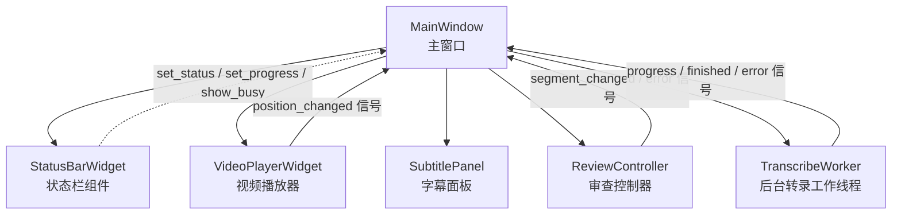
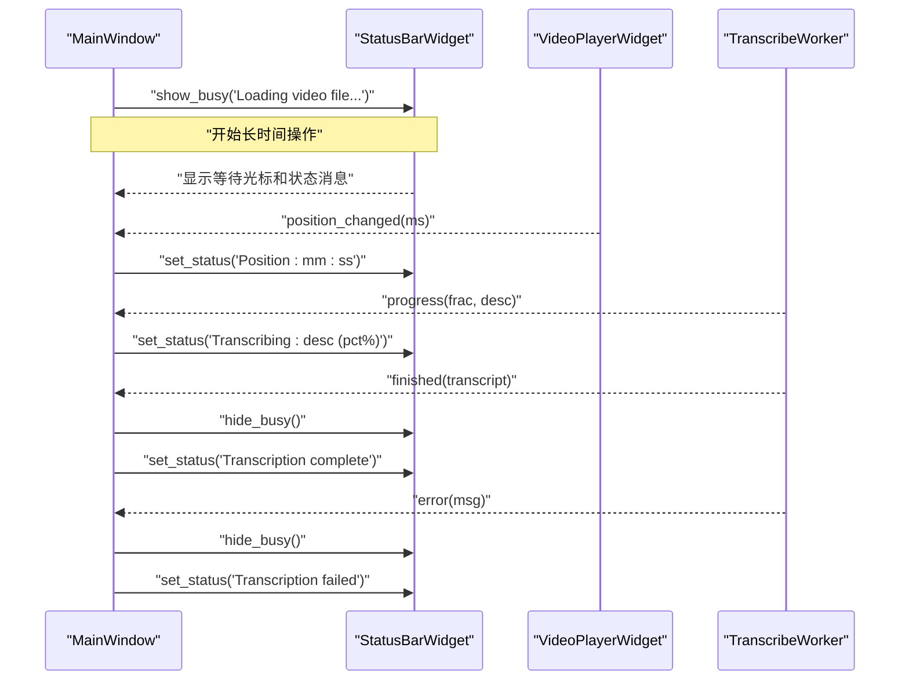
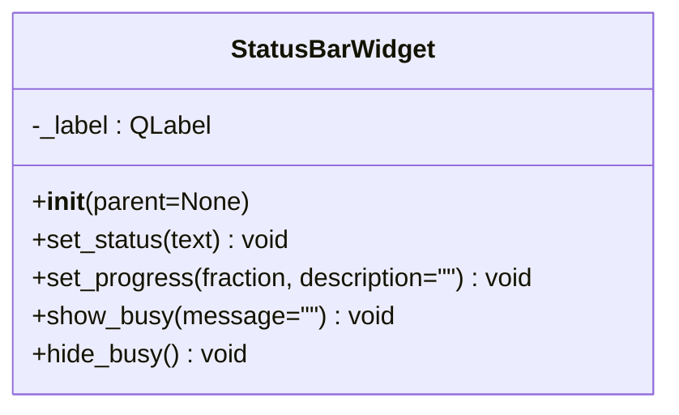
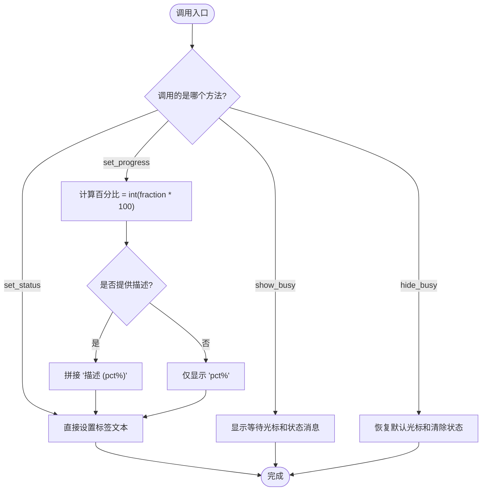
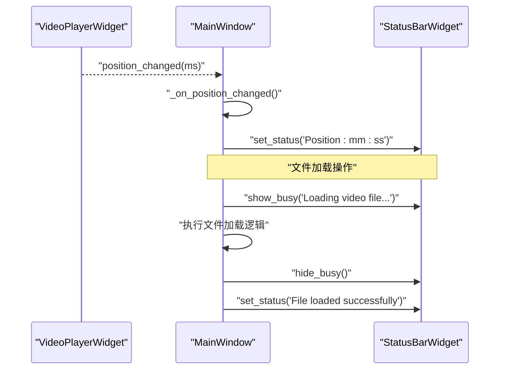
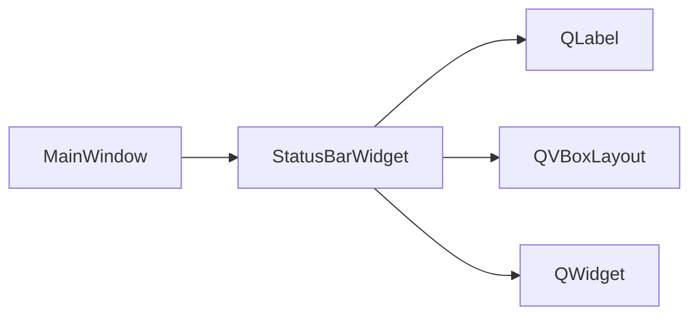

# 状态栏组件

<cite>
**本文引用的文件**   
- [gui/widgets/status_bar.py](file://gui/widgets/status_bar.py)
- [gui/app.py](file://gui/app.py)
- [tests/test_widgets.py](file://tests/test_widgets.py)
</cite>

## 更新摘要
**变更内容**   
- 增强了用户界面反馈机制，在视频文件加载操作期间显示等待光标和状态栏反馈
- 添加了新的方法用于控制光标状态和显示处理中的状态消息
- 改进了用户体验，为用户提供清晰的视觉指示表明应用程序正在处理输入

## 目录
1. [简介](#简介)
2. [项目结构](#项目结构)
3. [核心组件](#核心组件)
4. [架构总览](#架构总览)
5. [详细组件分析](#详细组件分析)
6. [依赖关系分析](#依赖关系分析)
7. [性能与可维护性](#性能与可维护性)
8. [故障排查指南](#故障排查指南)
9. [结论](#结论)
10. [附录：定制与扩展指南](#附录定制与扩展指南)

## 简介
本技术文档聚焦于状态栏组件 StatusBarWidget 的设计与实现，说明其在 PySide6 桌面应用中的职责、显示格式、更新机制以及与主窗口和其他组件的通信方式。同时提供多语言支持与可访问性的最佳实践建议，并给出主题化与定制化的开发指引。

**更新** 新增了视频文件加载期间的用户界面反馈机制，包括等待光标显示和状态栏反馈，显著改善了用户体验。

## 项目结构
StatusBarWidget 位于 gui/widgets 目录下，作为独立的可复用组件被 MainWindow 集成到应用底部状态栏区域。其职责单一：以文本形式展示运行状态与进度信息，并在长时间操作中提供视觉反馈。

图表来源
- [gui/app.py:92-94](file://gui/app.py#L92-L94)
- [gui/widgets/status_bar.py:8-26](file://gui/widgets/status_bar.py#L8-L26)

章节来源
- [gui/app.py:92-94](file://gui/app.py#L92-L94)
- [gui/widgets/status_bar.py:8-26](file://gui/widgets/status_bar.py#L8-L26)

## 核心组件
- StatusBarWidget：基于 QWidget 的状态/进度显示控件，内部使用 QLabel 展示文本，布局为垂直布局，左右留白用于视觉对齐。
- 对外接口：
  - set_status(text): 设置纯文本状态消息。
  - set_progress(fraction, description=""): 设置进度百分比与可选描述文本。
  - **新增** show_busy(message=""): 显示忙碌状态和等待光标，用于长时间操作。
  - **新增** hide_busy(): 隐藏忙碌状态和恢复默认光标。

当前实现要点
- 默认初始文本为"Ready"。
- 进度条以百分比文本呈现（例如"50%"或"Transcribing (50%)"），并非图形化进度条。
- 无内置样式或颜色区分，未暴露主题或状态类型枚举。
- **新增** 支持忙碌状态显示，提供更好的用户反馈。

章节来源
- [gui/widgets/status_bar.py:8-26](file://gui/widgets/status_bar.py#L8-L26)

## 架构总览
状态栏在应用中的角色是"只读输出"，由主窗口在不同业务事件发生时调用其 API 刷新显示。

图表来源
- [gui/app.py:143-156](file://gui/app.py#L143-156)
- [gui/app.py:215-218](file://gui/app.py#L215-218)
- [gui/app.py:235-245](file://gui/app.py#L235-245)
- [gui/widgets/status_bar.py:18-26](file://gui/widgets/status_bar.py#L18-L26)

## 详细组件分析

### StatusBarWidget 类设计
- 继承自 QWidget，内部包含一个 QLabel 用于文本渲染。
- 使用 QVBoxLayout 管理子控件，设置左右边距以适配系统状态栏风格。
- 提供三个公开方法：
  - set_status(text): 直接替换标签文本。
  - set_progress(fraction, description=""): 将 fraction 转换为整数百分比，并与可选描述拼接后显示。
  - **新增** show_busy(message=""): 显示忙碌状态消息并设置等待光标。
  - **新增** hide_busy(): 恢复默认光标并清除忙碌状态。

图表来源
- [gui/widgets/status_bar.py:8-26](file://gui/widgets/status_bar.py#L8-L26)

章节来源
- [gui/widgets/status_bar.py:8-26](file://gui/widgets/status_bar.py#L8-L26)

### 状态信息的显示格式与更新机制
- 文本状态：通过 set_status 直接写入标签文本，适用于瞬时提示、位置时间、完成/失败等。
- 进度信息：通过 set_progress 计算百分比并拼接描述，适合后台任务（如转录）的持续反馈。
- **新增** 忙碌状态：通过 show_busy/hide_busy 提供长时间操作的视觉反馈，包括等待光标和状态消息。
- 更新触发点（示例）：
  - 引擎健康检查成功/失败。
  - 视频播放位置变化。
  - 转录进度回调、完成与错误。
  - 保存操作完成、审查流程结束。
  - **新增** 视频文件加载、大文件处理等长时间操作。

图表来源
- [gui/widgets/status_bar.py:18-26](file://gui/widgets/status_bar.py#L18-L26)

章节来源
- [gui/app.py:143-156](file://gui/app.py#L143-156)
- [gui/app.py:215-218](file://gui/app.py#L215-218)
- [gui/app.py:235-245](file://gui/app.py#L235-245)
- [gui/widgets/status_bar.py:18-26](file://gui/widgets/status_bar.py#L18-L26)

### 不同状态类型的差异化显示
当前实现未内置成功/警告/错误等状态的视觉差异（如颜色、图标）。若需差异化显示，可在 StatusBarWidget 中引入样式策略或主题接口，并在上层根据状态类型选择样式。

**更新** 新增了忙碌状态的视觉反馈，通过等待光标和状态消息的组合提供更好的用户感知。

章节来源
- [gui/widgets/status_bar.py:8-26](file://gui/widgets/status_bar.py#L8-L26)

### 与应用程序其他组件的通信接口
- 主窗口 MainWindow 持有 StatusBarWidget 实例，并通过其公共 API 进行更新。
- 典型信号链路：
  - VideoPlayerWidget.position_changed → MainWindow._on_position_changed → StatusBarWidget.set_status
  - TranscribeWorker.progress/finished/error → MainWindow._on_transcribe_* → StatusBarWidget.set_status/set_progress
  - ReviewController.segment_changed/error → MainWindow._on_segment_changed/_on_controller_error → 可能间接影响状态栏（当前主要更新字幕面板与播放器）
  - **新增** 文件加载操作 → MainWindow.load_video_file → StatusBarWidget.show_busy/hide_busy

图表来源
- [gui/app.py:215-218](file://gui/app.py#L215-218)
- [gui/widgets/status_bar.py:18-20](file://gui/widgets/status_bar.py#L18-L20)

章节来源
- [gui/app.py:215-218](file://gui/app.py#L215-218)
- [gui/widgets/status_bar.py:18-20](file://gui/widgets/status_bar.py#L18-L20)

### 状态信息的持久化与恢复
- 当前 StatusBarWidget 不实现任何持久化逻辑，所有状态均为运行时内存显示。
- 审查进度与修改记录由 ReviewController 负责持久化（JSON 文件），与状态栏无关。
- 如需持久化状态栏内容（例如上次会话的最后一条消息），应在 StatusBarWidget 中新增存储/加载接口，并在应用启动时恢复。

章节来源
- [gui/controllers/review_controller.py:142-148](file://gui/controllers/review_controller.py#L142-148)
- [gui/widgets/status_bar.py:8-26](file://gui/widgets/status_bar.py#L8-L26)

## 依赖关系分析
- 外部依赖：PySide6.QtWidgets（QLabel、QVBoxLayout、QWidget）。
- 耦合度：低。StatusBarWidget 仅依赖 Qt 基础控件，不感知业务上下文。
- 被引用方：MainWindow 通过实例变量持有并调用其公共 API。

图表来源
- [gui/widgets/status_bar.py:5-16](file://gui/widgets/status_bar.py#L5-L16)
- [gui/app.py:92-94](file://gui/app.py#L92-L94)

章节来源
- [gui/widgets/status_bar.py:5-16](file://gui/widgets/status_bar.py#L5-L16)
- [gui/app.py:92-94](file://gui/app.py#L92-L94)

## 性能与可维护性
- 性能：每次更新仅设置 QLabel 文本，开销极低；高频更新（如播放位置）下仍保持流畅。
- 可维护性：API 简洁明确，便于测试与扩展。建议在需要复杂展示时引入样式/主题抽象，避免在主窗口中硬编码样式逻辑。
- **更新** 新增的忙碌状态功能保持了良好的性能特性，光标切换和状态更新都是轻量级操作。

## 故障排查指南
- 现象：状态栏不更新
  - 确认 MainWindow 是否正确调用 set_status/set_progress。
  - 检查信号连接是否生效（如 position_changed、worker progress/finished/error）。
- 现象：进度百分比异常
  - 确保传入 fraction 范围在 [0, 1]；否则可能出现负数或超过 100% 的显示。
- 现象：文本过长导致截断
  - 当前为单行文本，超长会被系统裁剪。必要时可扩展为多行或滚动提示。
- **新增** 现象：忙碌状态无法正常显示
  - 确认 show_busy 和 hide_busy 成对调用。
  - 检查是否在长时间操作完成后正确调用了 hide_busy。
  - 验证 QApplication.processEvents() 是否被适当调用以确保界面响应。

章节来源
- [gui/app.py:215-218](file://gui/app.py#L215-218)
- [gui/app.py:235-245](file://gui/app.py#L235-245)
- [gui/widgets/status_bar.py:22-26](file://gui/widgets/status_bar.py#L22-L26)

## 结论
StatusBarWidget 是一个轻量、专注的状态/进度文本展示组件，满足当前应用对状态反馈的基本需求。其设计简单清晰，易于测试与维护。后续可根据产品需求扩展主题、状态类型与可视化元素（如图标、颜色、动画），并保持与主窗口的松耦合。

**更新** 最新的改进增强了用户界面反馈机制，特别是在视频文件加载等长时间操作中提供了更好的用户体验。

## 附录：定制与扩展指南

### 主题与样式扩展
- 目标：支持成功/警告/错误等状态的颜色与图标差异。
- 建议方案：
  - 在 StatusBarWidget 中增加 set_state(state_type) 或样式表接口，按状态类型切换样式。
  - 将样式资源集中管理，便于全局主题切换。
- 注意：保持 set_status/set_progress 的向后兼容，新增样式能力不应破坏现有调用。

章节来源
- [gui/widgets/status_bar.py:8-26](file://gui/widgets/status_bar.py#L8-L26)

### 多语言支持（i18n）
- 现状：当前状态文案为硬编码字符串。
- 建议：
  - 在调用处统一使用翻译函数包裹文案（如 tr()），或在 StatusBarWidget 中提供 i18n 友好的接口。
  - 为常用状态定义键值映射，便于批量替换与测试。

章节来源
- [gui/app.py:143-156](file://gui/app.py#L143-156)
- [gui/app.py:215-218](file://gui/app.py#L215-218)
- [gui/app.py:235-245](file://gui/app.py#L235-245)

### 可访问性（a11y）
- 建议：
  - 为状态文本设置合适的 accessibleName/accessibleDescription，辅助工具可读取状态变更。
  - 对于重要状态（如错误），配合弹窗提示的同时，确保状态栏文本语义清晰。
  - **新增** 为忙碌状态提供适当的可访问性描述，帮助屏幕阅读器用户了解当前操作状态。
- 注意：Qt 的 QLabel 默认具备基本可访问性，但应确保文本表达准确且不含歧义。

章节来源
- [gui/widgets/status_bar.py:13-16](file://gui/widgets/status_bar.py#L13-L16)

### 单元测试参考
- 已有针对 StatusBarWidget 的基础用例，覆盖初始化、set_status 与 set_progress 的行为断言。
- 建议补充：
  - 边界条件（fraction=0/1、空描述、极长文本）。
  - 多语言与可访问性相关断言（若引入相应特性）。
  - **新增** 忙碌状态功能的测试用例，包括 show_busy/hide_busy 的正确行为。

章节来源
- [tests/test_widgets.py:115-132](file://tests/test_widgets.py#L115-132)