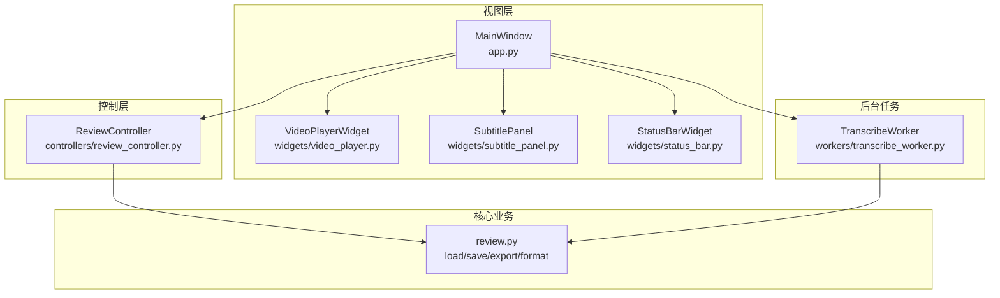
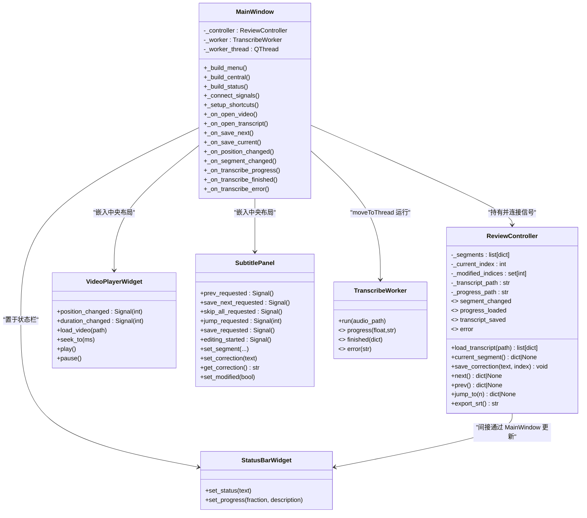
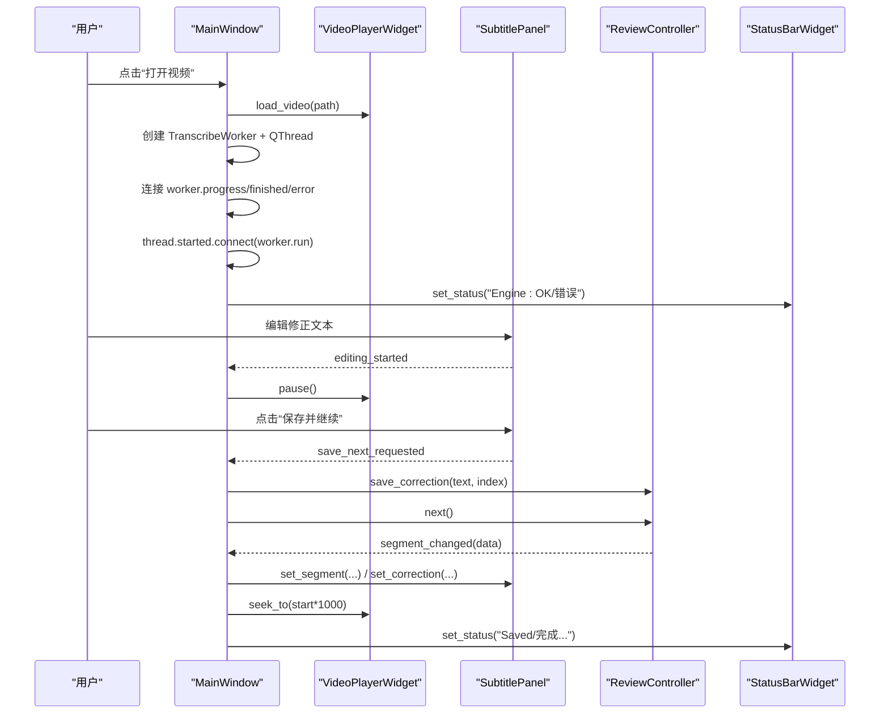
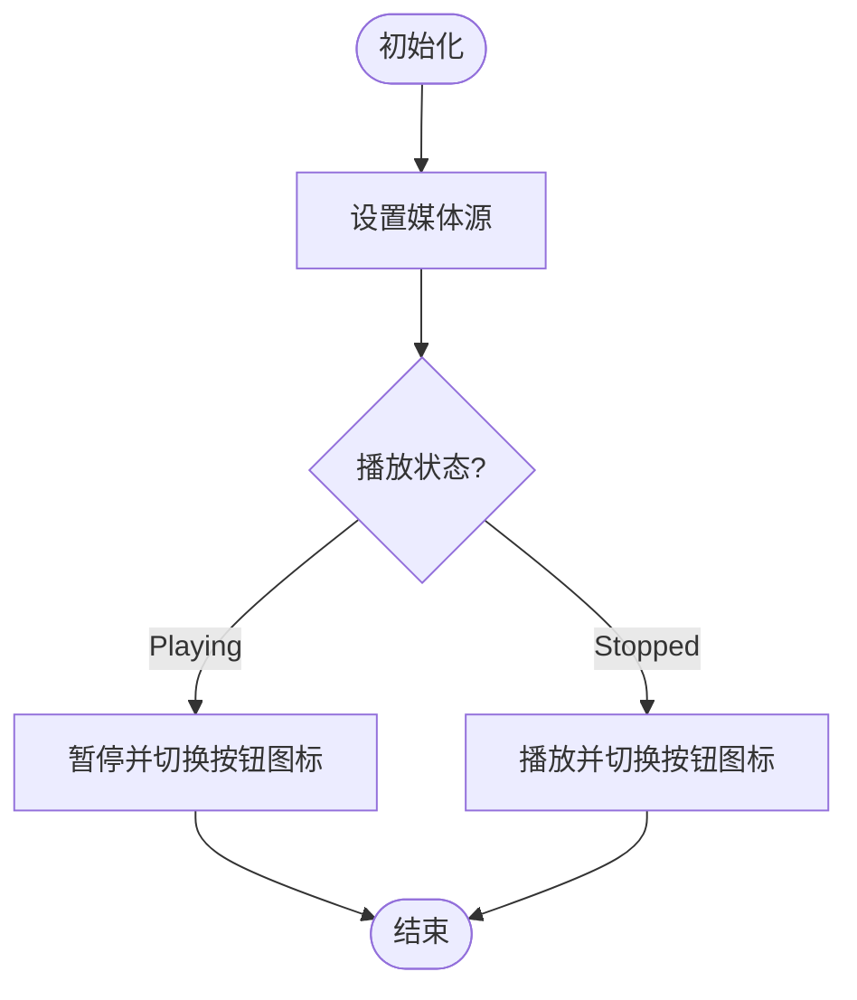
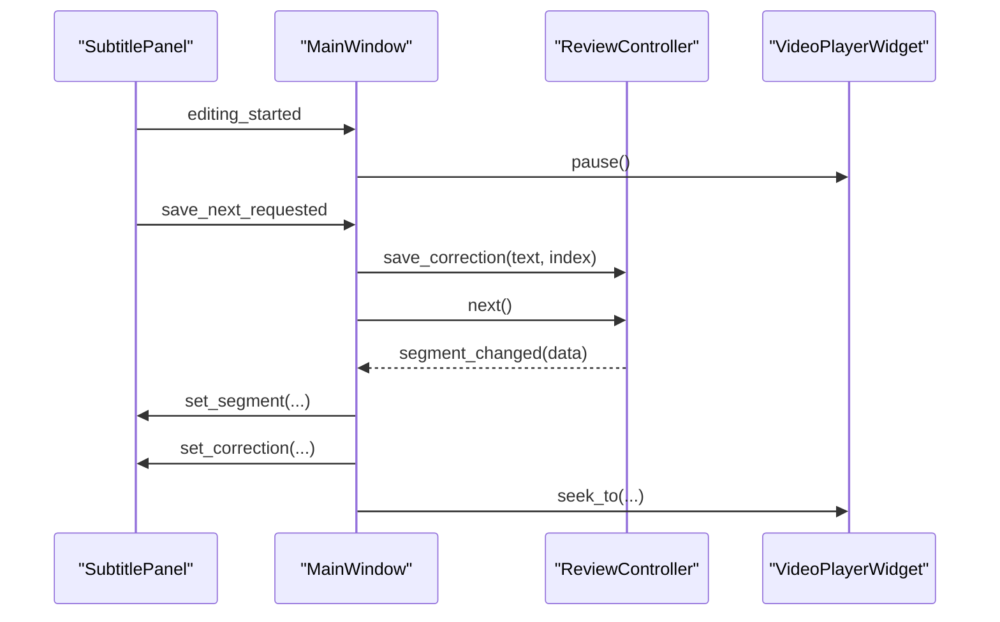
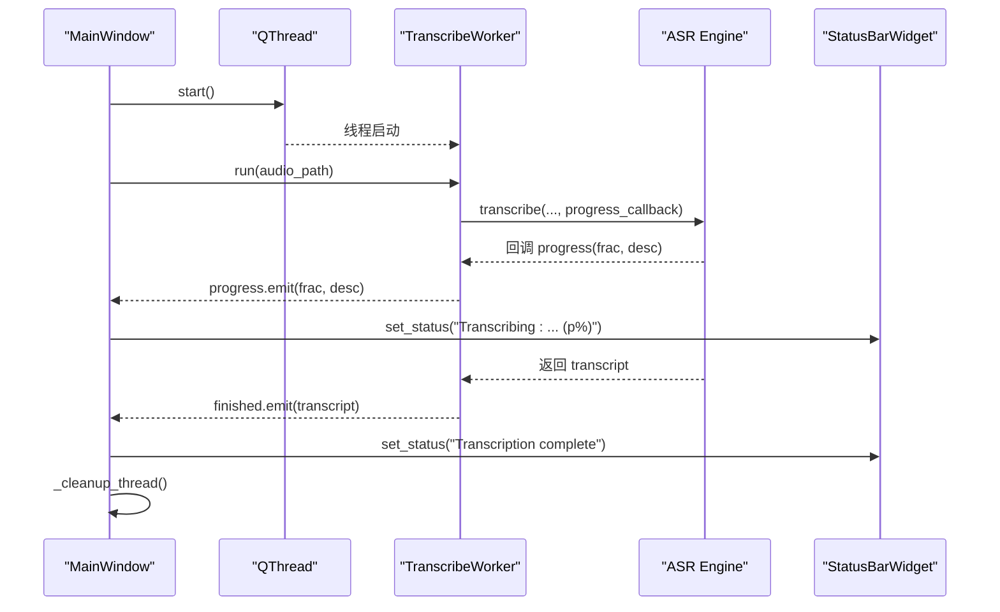
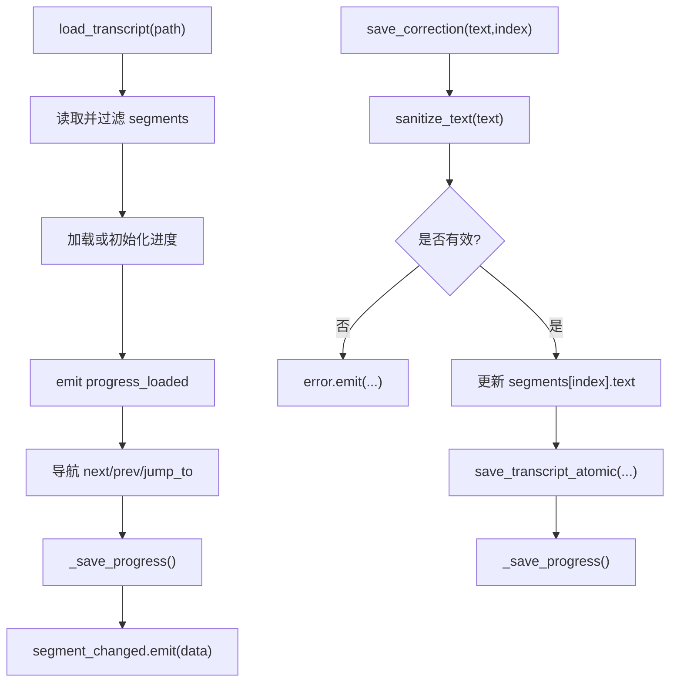
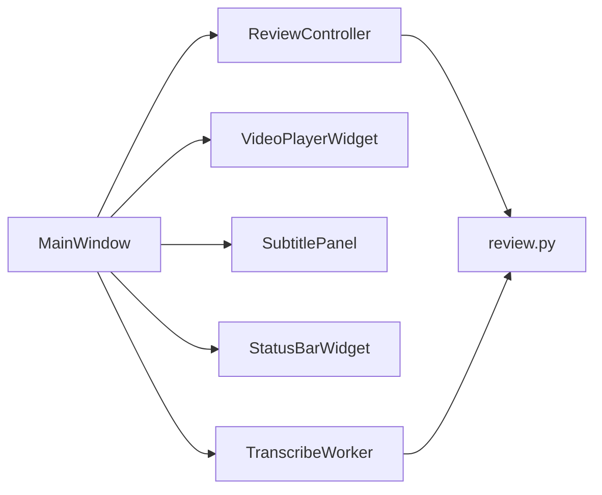

# 用户界面

<cite>
**本文引用的文件**   
- [gui/app.py](file://gui/app.py)
- [gui/controllers/review_controller.py](file://gui/controllers/review_controller.py)
- [gui/widgets/video_player.py](file://gui/widgets/video_player.py)
- [gui/widgets/subtitle_panel.py](file://gui/widgets/subtitle_panel.py)
- [gui/widgets/status_bar.py](file://gui/widgets/status_bar.py)
- [gui/workers/transcribe_worker.py](file://gui/workers/transcribe_worker.py)
- [video_splitter/review.py](file://video_splitter/review.py)
- [gui/AGENTS.md](file://gui/AGENTS.md)
- [tests/test_review_controller.py](file://tests/test_review_controller.py)
- [tests/test_widgets.py](file://tests/test_widgets.py)
</cite>

## 目录
1. [简介](#简介)
2. [项目结构](#项目结构)
3. [核心组件](#核心组件)
4. [架构总览](#架构总览)
5. [详细组件分析](#详细组件分析)
6. [依赖关系分析](#依赖关系分析)
7. [性能与线程模型](#性能与线程模型)
8. [故障排查指南](#故障排查指南)
9. [结论](#结论)
10. [附录：快捷键与交互最佳实践](#附录快捷键与交互最佳实践)

## 简介
本文件面向用户界面系统，聚焦 PySide6 GUI 的架构设计与实现细节。文档覆盖 MVC 模式在应用中的落地方式、组件间通信机制（基于 Qt 信号槽）、主窗口布局与导航、各 UI 组件的职责与交互逻辑（视频播放器、字幕面板、状态栏等）、后台工作线程的处理与进度更新策略，以及主题扩展、快捷键映射和事件处理的最佳实践。同时提供实际使用示例与调用序列图，帮助开发者快速理解并扩展该界面系统。

## 项目结构
GUI 模块采用分层组织：视图层（widgets）、控制层（controllers）、后台任务（workers），并通过 Qt 信号槽进行解耦通信。核心业务逻辑位于 video_splitter.review 中，负责转录数据加载、清洗、持久化与导出。

图表来源
- [gui/app.py:27-90](file://gui/app.py#L27-L90)
- [gui/controllers/review_controller.py:20-52](file://gui/controllers/review_controller.py#L20-L52)
- [gui/widgets/video_player.py:18-53](file://gui/widgets/video_player.py#L18-L53)
- [gui/widgets/subtitle_panel.py:19-90](file://gui/widgets/subtitle_panel.py#L19-L90)
- [gui/widgets/status_bar.py:8-27](file://gui/widgets/status_bar.py#L8-L27)
- [gui/workers/transcribe_worker.py:16-49](file://gui/workers/transcribe_worker.py#L16-L49)
- [video_splitter/review.py:18-139](file://video_splitter/review.py#L18-L139)

章节来源
- [gui/AGENTS.md:1-50](file://gui/AGENTS.md#L1-L50)
- [gui/app.py:27-90](file://gui/app.py#L27-L90)

## 核心组件
- MainWindow：应用入口，构建菜单、中央布局、状态栏、快捷键，连接各组件信号，协调打开视频/转录文件、启动后台转录、保存与跳转等流程。
- ReviewController：纯状态机，管理当前片段索引、修改集合、转录路径与进度持久化；对外暴露 segment_changed、progress_loaded、transcript_saved、error 信号。
- VideoPlayerWidget：封装 QMediaPlayer + QVideoWidget，提供播放/暂停、拖动定位、位置与时长变化信号。
- SubtitlePanel：展示原文与修正输入框，提供上一段、保存并继续、全部跳过、跳转到指定序号、保存等操作信号。
- StatusBarWidget：显示状态文本与百分比进度。
- TranscribeWorker：在独立 QThread 中运行 ASR 引擎，通过 progress/finished/error 信号向 UI 汇报。

章节来源
- [gui/app.py:27-156](file://gui/app.py#L27-L156)
- [gui/controllers/review_controller.py:20-149](file://gui/controllers/review_controller.py#L20-L149)
- [gui/widgets/video_player.py:18-89](file://gui/widgets/video_player.py#L18-L89)
- [gui/widgets/subtitle_panel.py:19-135](file://gui/widgets/subtitle_panel.py#L19-L135)
- [gui/widgets/status_bar.py:8-27](file://gui/widgets/status_bar.py#L8-L27)
- [gui/workers/transcribe_worker.py:16-49](file://gui/workers/transcribe_worker.py#L16-L49)

## 架构总览
整体遵循“视图—控制器—服务”的分层思想：
- 视图层（MainWindow + widgets）仅负责展示与用户交互，不直接操作数据。
- 控制层（ReviewController）维护状态、执行导航与持久化，并向视图发射信号。
- 后台任务（TranscribeWorker）在独立线程中执行耗时任务，通过信号回调 UI。

图表来源
- [gui/app.py:27-156](file://gui/app.py#L27-L156)
- [gui/controllers/review_controller.py:20-149](file://gui/controllers/review_controller.py#L20-L149)
- [gui/widgets/video_player.py:18-89](file://gui/widgets/video_player.py#L18-L89)
- [gui/widgets/subtitle_panel.py:19-135](file://gui/widgets/subtitle_panel.py#L19-L135)
- [gui/widgets/status_bar.py:8-27](file://gui/widgets/status_bar.py#L8-L27)
- [gui/workers/transcribe_worker.py:16-49](file://gui/workers/transcribe_worker.py#L16-L49)

## 详细组件分析

### 主窗口与布局导航
- 菜单栏：包含“文件”（打开视频、打开转录、退出）与“帮助”（关于）。
- 中央区域：左侧为视频播放器，右侧为标签页容器，包含“Review”与占位“Split”。
- 状态栏：自定义 StatusBarWidget 作为可伸缩控件显示状态与进度。
- 快捷键：空格播放/暂停、Ctrl+Return 保存并继续、Ctrl+Left 上一段、Ctrl+Right 下一段、Ctrl+G 跳转输入框聚焦、Ctrl+S 保存当前。

图表来源
- [gui/app.py:157-246](file://gui/app.py#L157-L246)
- [gui/widgets/subtitle_panel.py:92-135](file://gui/widgets/subtitle_panel.py#L92-L135)
- [gui/controllers/review_controller.py:65-149](file://gui/controllers/review_controller.py#L65-L149)
- [gui/widgets/video_player.py:54-89](file://gui/widgets/video_player.py#L54-L89)
- [gui/widgets/status_bar.py:18-27](file://gui/widgets/status_bar.py#L18-L27)

章节来源
- [gui/app.py:46-156](file://gui/app.py#L46-L156)

### 视频播放器组件
- 功能：加载本地视频、播放/暂停、拖动定位、显示当前位置与总时长。
- 信号：position_changed、duration_changed。
- 交互：当字幕面板进入编辑时自动暂停；支持外部 seek_to 精确跳转。

图表来源
- [gui/widgets/video_player.py:54-89](file://gui/widgets/video_player.py#L54-L89)

章节来源
- [gui/widgets/video_player.py:18-89](file://gui/widgets/video_player.py#L18-L89)

### 字幕面板组件
- 功能：显示当前片段编号与时间戳、原文只读区、修正输入区、导航与保存按钮、跳转数字框。
- 信号：prev_requested、save_next_requested、skip_all_requested、jump_requested、save_requested、editing_started。
- 交互：首次文本变更触发 editing_started，通知播放器暂停；set_segment 会重置编辑标记并更新跳转范围。

图表来源
- [gui/widgets/subtitle_panel.py:92-135](file://gui/widgets/subtitle_panel.py#L92-L135)
- [gui/app.py:220-231](file://gui/app.py#L220-L231)
- [gui/controllers/review_controller.py:128-149](file://gui/controllers/review_controller.py#L128-L149)

章节来源
- [gui/widgets/subtitle_panel.py:19-135](file://gui/widgets/subtitle_panel.py#L19-L135)

### 状态栏组件
- 功能：显示通用状态文本与带百分比的进度信息。
- 用法：由 MainWindow 在转录进度、保存成功、播放位置变化等场景更新。

章节来源
- [gui/widgets/status_bar.py:8-27](file://gui/widgets/status_bar.py#L8-L27)

### 后台转录工作线程
- 设计：TranscribeWorker 继承 QObject，通过 moveToThread 放入独立线程运行；使用 @Slot 装饰 run 方法以跨线程安全调用。
- 信号：progress(frac, desc)、finished(transcript)、error(msg)。
- 集成：MainWindow 在打开视频后创建 Worker 与 QThread，连接信号并在 started 时传入音频路径执行转录。

图表来源
- [gui/workers/transcribe_worker.py:33-49](file://gui/workers/transcribe_worker.py#L33-L49)
- [gui/app.py:168-178](file://gui/app.py#L168-L178)
- [gui/app.py:235-252](file://gui/app.py#L235-L252)

章节来源
- [gui/workers/transcribe_worker.py:16-49](file://gui/workers/transcribe_worker.py#L16-L49)
- [gui/app.py:168-178](file://gui/app.py#L168-L178)

### 控制器与数据持久化
- 状态机：维护 segments、current_index、modified_indices、transcript_path。
- 导航：next/prev/jump_to 均会保存进度并发射 segment_changed。
- 修正保存：sanitize_text 清理后写入转录 JSON（原子写），并更新进度。
- 进度文件：与视频同目录生成 .review_progress.json，记录 current_index、total、modified_count、modified_indices。
- SRT 导出：将当前 segments 转为 SRT，使用临时文件 + os.replace 保证原子性。

图表来源
- [gui/controllers/review_controller.py:36-149](file://gui/controllers/review_controller.py#L36-L149)
- [video_splitter/review.py:18-139](file://video_splitter/review.py#L18-L139)

章节来源
- [gui/controllers/review_controller.py:20-149](file://gui/controllers/review_controller.py#L20-L149)
- [video_splitter/review.py:18-139](file://video_splitter/review.py#L18-L139)

## 依赖关系分析
- 视图到控制：MainWindow 持有 ReviewController 实例，并将 SubtitlePanel 的请求信号转发给控制器。
- 控制到业务：ReviewController 依赖 video_splitter.review 提供的加载、清洗、保存、导出工具函数。
- 视图到后台：MainWindow 管理 TranscribeWorker 与 QThread 生命周期，通过信号桥接 UI 与后台。
- 组件内聚：各 widget 职责单一，通过公开 API 与信号交互，避免直接访问内部控件。

图表来源
- [gui/app.py:27-156](file://gui/app.py#L27-L156)
- [gui/controllers/review_controller.py:20-149](file://gui/controllers/review_controller.py#L20-L149)
- [gui/workers/transcribe_worker.py:16-49](file://gui/workers/transcribe_worker.py#L16-L49)
- [video_splitter/review.py:18-139](file://video_splitter/review.py#L18-L139)

章节来源
- [gui/AGENTS.md:34-50](file://gui/AGENTS.md#L34-L50)

## 性能与线程模型
- 线程模型：严格遵循 QObject + moveToThread(QThread) 模式，禁止子类化 QThread；所有跨线程通信通过信号槽。
- 进度更新：后台工作线程通过 progress 信号高频上报，UI 仅在状态栏更新文本，避免阻塞主线程。
- 文件写入：转录与 SRT 导出均采用临时文件 + os.replace 的原子写入策略，降低损坏风险。
- 资源释放：线程结束后 quit/wait 并 deleteLater，防止内存泄漏。

章节来源
- [gui/app.py:168-178](file://gui/app.py#L168-L178)
- [gui/app.py:247-252](file://gui/app.py#L247-L252)
- [gui/workers/transcribe_worker.py:33-49](file://gui/workers/transcribe_worker.py#L33-L49)
- [video_splitter/review.py:80-99](file://video_splitter/review.py#L80-L99)
- [gui/controllers/review_controller.py:103-126](file://gui/controllers/review_controller.py#L103-L126)

## 故障排查指南
- 转录引擎健康检查失败：启动时会检测 FunASREngine 可用性，若不可用则提示仍可继续使用已有转录。
- 转录失败：捕获异常并通过 error 信号弹出警告，状态栏显示失败信息，随后清理线程。
- 保存失败：save_transcript_atomic 抛出异常时，控制器发出 error 信号，由 MainWindow 弹窗提示。
- 视频解码不支持：内置播放器不支持某些编解码器，会弹出提示建议预转换为 H.264 MP4。
- 进度文件损坏：加载进度时如解析失败，会将原文件重命名为 .corrupted 并忽略，不影响后续使用。

章节来源
- [gui/app.py:143-156](file://gui/app.py#L143-L156)
- [gui/app.py:242-252](file://gui/app.py#L242-L252)
- [gui/controllers/review_controller.py:65-84](file://gui/controllers/review_controller.py#L65-L84)
- [gui/widgets/video_player.py:82-89](file://gui/widgets/video_player.py#L82-L89)
- [video_splitter/review.py:101-127](file://video_splitter/review.py#L101-L127)

## 结论
该 GUI 系统以清晰的 MVC 分层与 Qt 信号槽机制实现了高内聚、低耦合的界面架构。主窗口负责编排与装配，控制器专注状态与持久化，组件各司其职并通过信号通信。后台任务通过线程与信号安全地更新 UI，保证了响应性与稳定性。结合完善的测试与约定规范，系统具备良好的可扩展性与可维护性。

## 附录：快捷键与交互最佳实践
- 快捷键映射
  - 空格：播放/暂停
  - Ctrl+Return：保存并继续
  - Ctrl+Left：上一段
  - Ctrl+Right：下一段
  - Ctrl+G：跳转输入框聚焦
  - Ctrl+S：保存当前
- 交互最佳实践
  - 使用公开 API 与信号进行组件通信，避免直接访问内部控件。
  - 所有跨线程操作通过信号槽，不在工作线程中直接操作 UI。
  - 保持信号命名一致：动词过去式表示结果（如 position_changed），请求型信号以 _requested 结尾（如 prev_requested）。
  - 为可选父对象使用 QObject | None 类型提示，确保生命周期由 Qt 管理。
  - 在需要长时间运行的任务中使用 @Slot 装饰方法，配合 moveToThread 运行。

章节来源
- [gui/app.py:112-141](file://gui/app.py#L112-L141)
- [gui/AGENTS.md:34-50](file://gui/AGENTS.md#L34-L50)
- [tests/test_review_controller.py:24-175](file://tests/test_review_controller.py#L24-L175)
- [tests/test_widgets.py:24-133](file://tests/test_widgets.py#L24-L133)