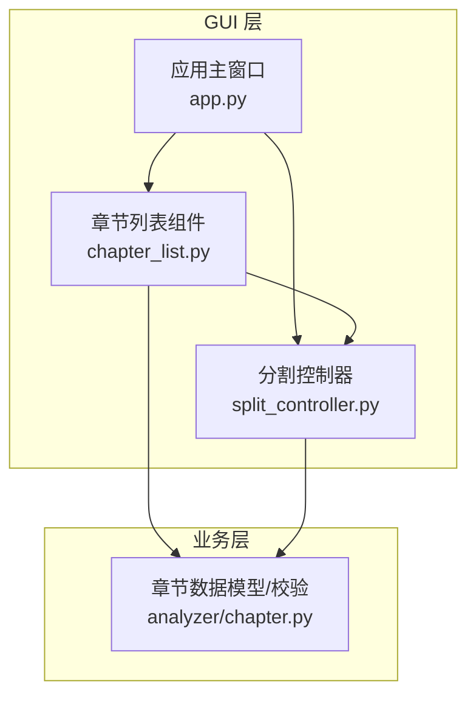
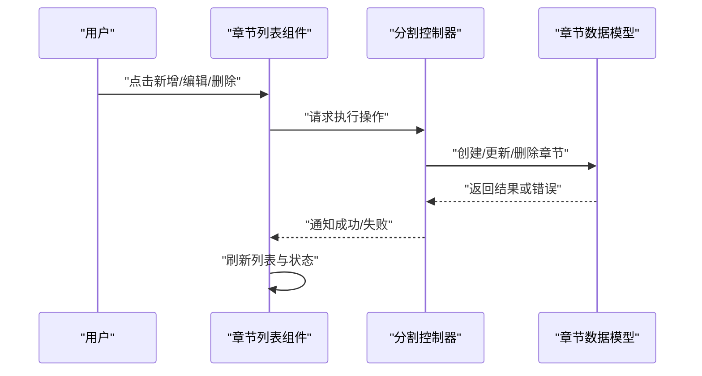
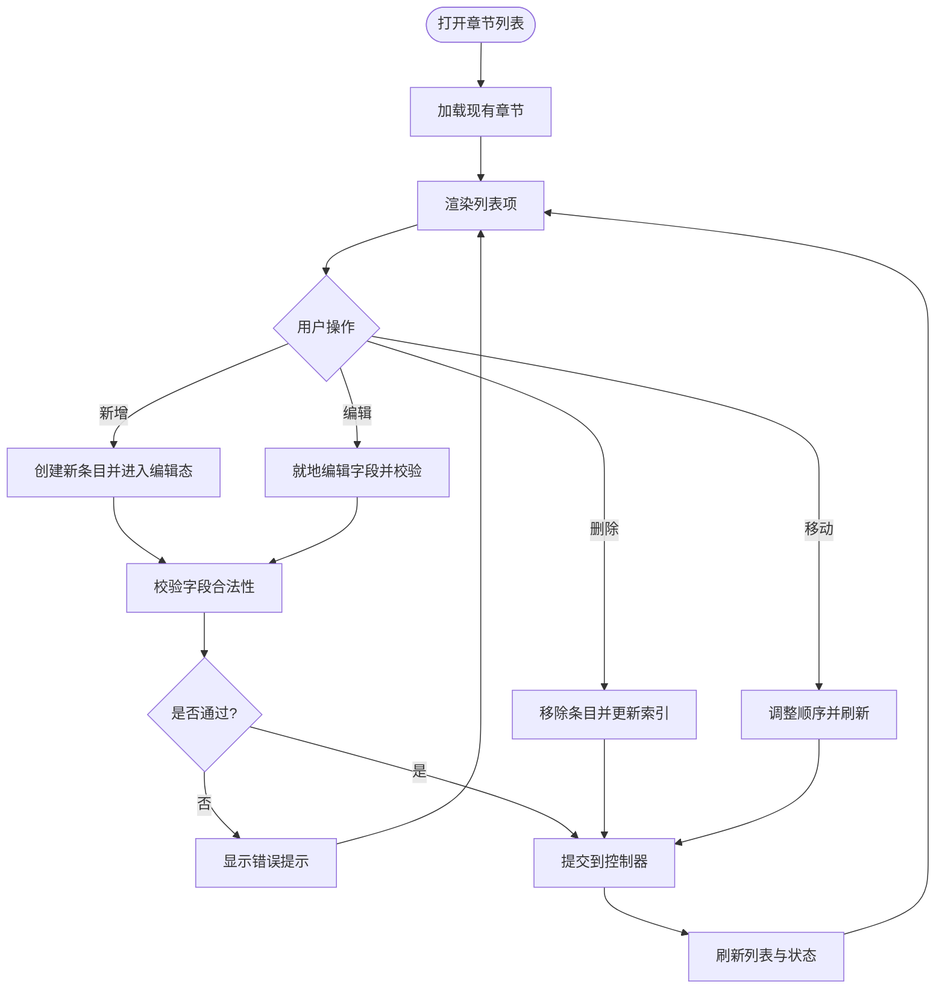
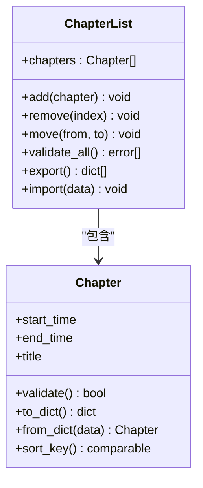
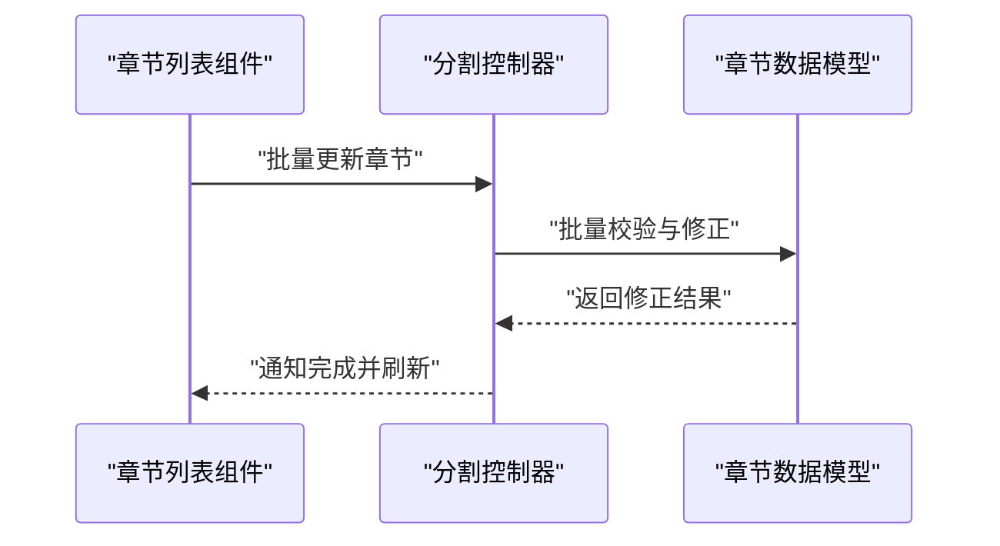
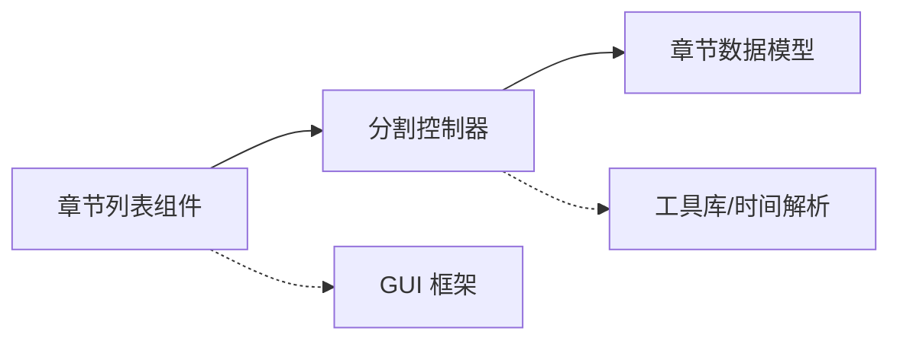

# 章节列表组件

<cite>
**本文引用的文件**   
- [gui/widgets/chapter_list.py](file://gui/widgets/chapter_list.py)
- [video_splitter/analyzer/chapter.py](file://video_splitter/analyzer/chapter.py)
- [gui/controllers/split_controller.py](file://gui/controllers/split_controller.py)
- [gui/app.py](file://gui/app.py)
</cite>

## 目录
1. [简介](#简介)
2. [项目结构](#项目结构)
3. [核心组件](#核心组件)
4. [架构总览](#架构总览)
5. [详细组件分析](#详细组件分析)
6. [依赖关系分析](#依赖关系分析)
7. [性能考虑](#性能考虑)
8. [故障排查指南](#故障排查指南)
9. [结论](#结论)
10. [附录](#附录)

## 简介
本文件聚焦于“章节列表组件”，该组件负责在图形界面中展示、编辑与管理视频章节。它向上与控制器交互，向下与章节数据模型协作，提供增删改查、排序、校验与批量操作等能力，是视频剪辑工作流中的关键可视化入口。

## 项目结构
围绕章节列表组件的相关代码分布在以下位置：
- GUI 层：章节列表的视图与交互逻辑位于 gui/widgets/chapter_list.py
- 业务层：章节数据结构与校验规则位于 video_splitter/analyzer/chapter.py
- 控制层：控制器协调 UI 与业务逻辑，位于 gui/controllers/split_controller.py
- 应用入口：主窗口组装各部件，位于 gui/app.py

图表来源
- [gui/widgets/chapter_list.py](file://gui/widgets/chapter_list.py)
- [gui/controllers/split_controller.py](file://gui/controllers/split_controller.py)
- [video_splitter/analyzer/chapter.py](file://video_splitter/analyzer/chapter.py)
- [gui/app.py](file://gui/app.py)

章节来源
- [gui/widgets/chapter_list.py](file://gui/widgets/chapter_list.py)
- [video_splitter/analyzer/chapter.py](file://video_splitter/analyzer/chapter.py)
- [gui/controllers/split_controller.py](file://gui/controllers/split_controller.py)
- [gui/app.py](file://gui/app.py)

## 核心组件
- 章节列表组件（GUI）
  - 职责：渲染章节条目、处理用户交互（新增、删除、移动、重命名）、触发校验与保存、同步时间轴与播放器状态。
  - 典型行为：
    - 初始化时加载已有章节并构建列表项
    - 监听用户输入变更，进行实时校验与提示
    - 将修改后的章节集合回传给控制器或持久化模块
- 章节数据模型（业务）
  - 职责：定义章节的数据结构、边界约束（如起止时间合法性、顺序性、去重）、序列化/反序列化与基础校验。
  - 典型行为：
    - 构造章节对象并进行参数校验
    - 提供比较、排序、合并、裁剪等工具方法
    - 输出标准格式供上层使用

章节来源
- [gui/widgets/chapter_list.py](file://gui/widgets/chapter_list.py)
- [video_splitter/analyzer/chapter.py](file://video_splitter/analyzer/chapter.py)

## 架构总览
章节列表组件采用典型的 MVC/MVP 分层：
- 视图层（章节列表组件）：负责展示与交互
- 控制层（分割控制器）：编排流程、调用业务层、更新视图
- 业务层（章节数据模型）：封装领域规则与数据一致性

图表来源
- [gui/widgets/chapter_list.py](file://gui/widgets/chapter_list.py)
- [gui/controllers/split_controller.py](file://gui/controllers/split_controller.py)
- [video_splitter/analyzer/chapter.py](file://video_splitter/analyzer/chapter.py)

## 详细组件分析

### 章节列表组件（GUI）
- 设计要点
  - 列表项与数据绑定：每个列表项对应一个章节对象，保持双向同步
  - 交互事件：双击编辑、拖拽排序、快捷键操作
  - 校验反馈：即时显示错误信息，阻止非法提交
  - 批量操作：全选、批量删除、批量移动
- 关键流程
  - 新增章节：从当前播放位置或默认时间生成初始值，进入编辑态
  - 删除章节：二次确认，更新索引与选中状态
  - 移动章节：交换相邻项或按目标位置插入，重新计算序号
  - 保存/提交：触发控制器，由控制器统一落盘或传递给后续流程

图表来源
- [gui/widgets/chapter_list.py](file://gui/widgets/chapter_list.py)
- [gui/controllers/split_controller.py](file://gui/controllers/split_controller.py)

章节来源
- [gui/widgets/chapter_list.py](file://gui/widgets/chapter_list.py)
- [gui/controllers/split_controller.py](file://gui/controllers/split_controller.py)

### 章节数据模型（业务）
- 设计要点
  - 数据结构：包含起始时间、结束时间、标题等字段
  - 约束规则：起止时间非负、开始小于结束、不重叠、顺序递增
  - 工具方法：排序、合并相邻、裁剪至视频时长范围
- 关键流程
  - 构造与校验：在创建/更新时执行严格校验，抛出明确错误
  - 序列化和反序列化：支持导入导出与持久化
  - 一致性维护：在批量变更后自动修复冲突（如重叠、越界）

图表来源
- [video_splitter/analyzer/chapter.py](file://video_splitter/analyzer/chapter.py)

章节来源
- [video_splitter/analyzer/chapter.py](file://video_splitter/analyzer/chapter.py)

### 控制器集成（分割控制器）
- 职责
  - 接收来自章节列表组件的操作请求
  - 调用章节数据模型进行变更与校验
  - 管理撤销/重做历史（若实现）
  - 向其他组件广播状态变化（如时间轴、播放器）
- 交互时序
  - 新增/编辑/删除：控制器执行业务逻辑后回调视图刷新
  - 批量操作：控制器聚合变更，统一提交，减少重复校验

图表来源
- [gui/controllers/split_controller.py](file://gui/controllers/split_controller.py)
- [video_splitter/analyzer/chapter.py](file://video_splitter/analyzer/chapter.py)

章节来源
- [gui/controllers/split_controller.py](file://gui/controllers/split_controller.py)
- [video_splitter/analyzer/chapter.py](file://video_splitter/analyzer/chapter.py)

## 依赖关系分析
- 组件耦合
  - 章节列表组件依赖控制器以解耦业务逻辑
  - 控制器依赖章节数据模型以封装领域规则
  - 视图与模型之间无直接耦合，降低变更风险
- 外部依赖
  - 可能依赖 GUI 框架（如 PyQt/PySide）用于列表控件与事件处理
  - 可能依赖时间解析库用于时间字符串与秒级数值转换

图表来源
- [gui/widgets/chapter_list.py](file://gui/widgets/chapter_list.py)
- [gui/controllers/split_controller.py](file://gui/controllers/split_controller.py)
- [video_splitter/analyzer/chapter.py](file://video_splitter/analyzer/chapter.py)

章节来源
- [gui/widgets/chapter_list.py](file://gui/widgets/chapter_list.py)
- [gui/controllers/split_controller.py](file://gui/controllers/split_controller.py)
- [video_splitter/analyzer/chapter.py](file://video_splitter/analyzer/chapter.py)

## 性能考虑
- 列表渲染优化
  - 对大量章节采用懒加载或分页渲染，避免一次性构建过多控件
  - 使用增量更新策略，仅刷新受影响行
- 校验与计算
  - 将耗时校验延迟到提交阶段，编辑时只做轻量检查
  - 对排序与冲突检测进行缓存，仅在必要时重算
- 内存占用
  - 及时释放不再使用的临时对象
  - 避免在事件回调中创建大对象

[本节为通用指导，无需源码引用]

## 故障排查指南
- 常见问题
  - 新增章节后未显示：检查控制器回调是否触发刷新；确认列表项绑定是否正确
  - 删除后索引错乱：确保删除后重新计算序号与选中项
  - 时间校验失败：核对起止时间大小关系与边界条件
  - 批量操作异常：查看控制器聚合逻辑与模型批量校验返回值
- 定位步骤
  - 在控制器与模型的关键路径添加日志，记录输入与输出
  - 复现最小用例，逐步缩小问题范围
  - 使用断点调试事件处理函数，观察状态变化

章节来源
- [gui/widgets/chapter_list.py](file://gui/widgets/chapter_list.py)
- [gui/controllers/split_controller.py](file://gui/controllers/split_controller.py)
- [video_splitter/analyzer/chapter.py](file://video_splitter/analyzer/chapter.py)

## 结论
章节列表组件通过清晰的层次划分与职责分离，提供了稳定且易扩展的章节管理能力。结合控制器与数据模型的协作，既能保证用户体验流畅，又能确保数据一致性与可维护性。建议持续优化渲染与校验性能，完善错误提示与恢复机制，以提升整体健壮性。

[本节为总结性内容，无需源码引用]

## 附录
- 相关入口
  - 应用主窗口装配章节列表组件与控制器的入口参考：[gui/app.py](file://gui/app.py)

章节来源
- [gui/app.py](file://gui/app.py)