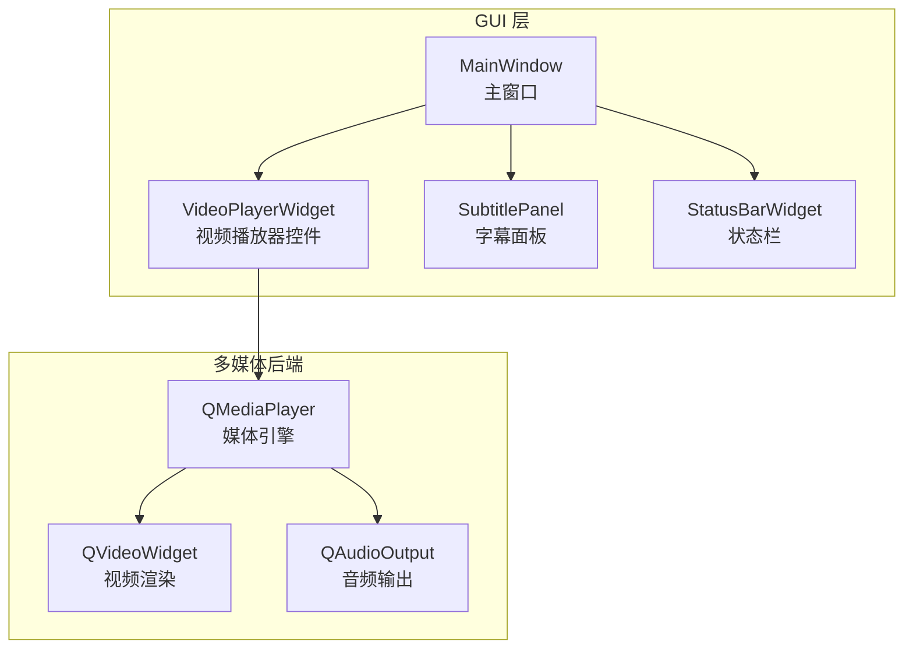
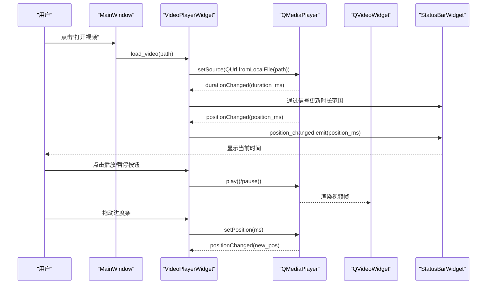
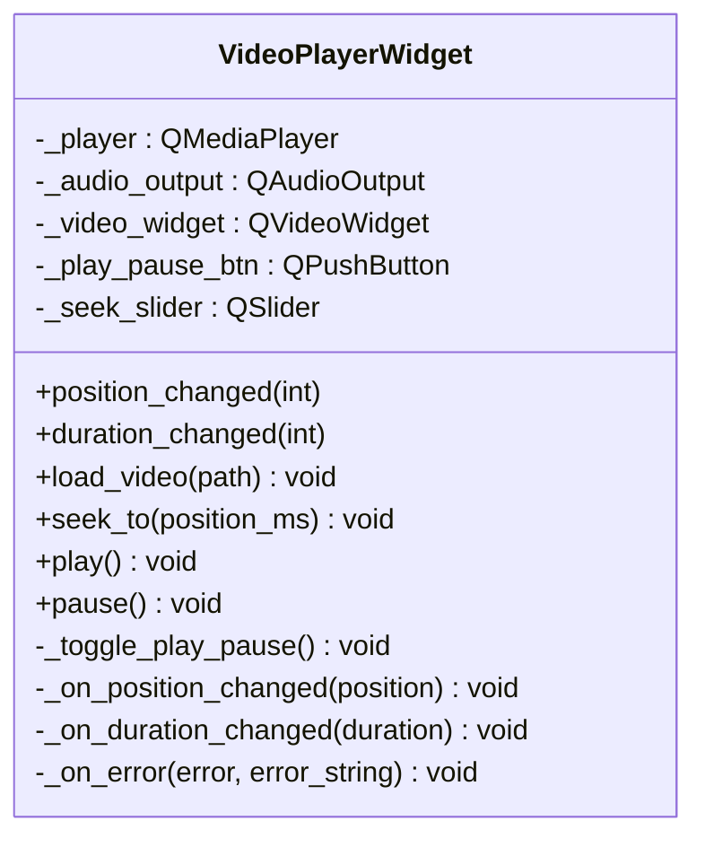
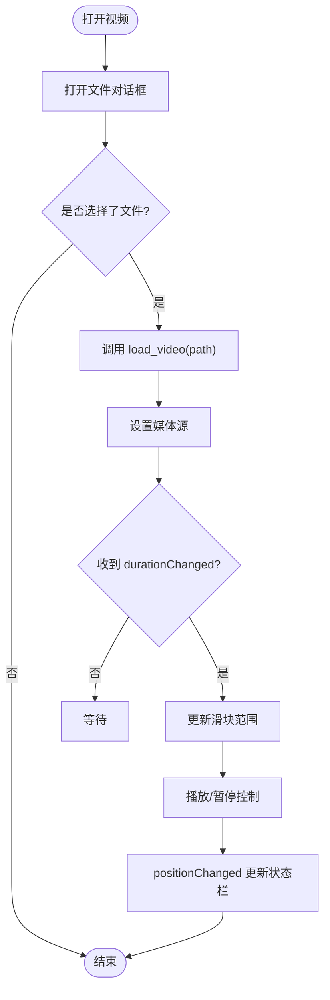
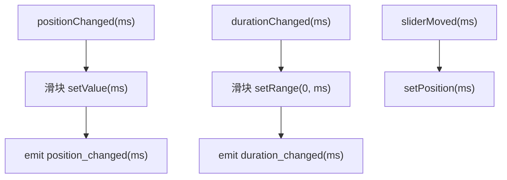
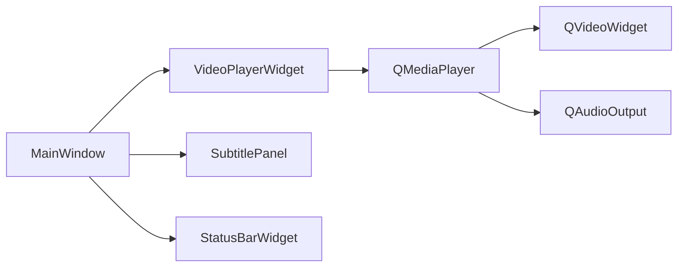

# 视频播放器组件

<cite>
**本文引用的文件**
- [gui/widgets/video_player.py](file://gui/widgets/video_player.py)
- [gui/app.py](file://gui/app.py)
- [tests/test_widgets.py](file://tests/test_widgets.py)
</cite>

## 目录
1. [简介](#简介)
2. [项目结构](#项目结构)
3. [核心组件](#核心组件)
4. [架构总览](#架构总览)
5. [详细组件分析](#详细组件分析)
6. [依赖关系分析](#依赖关系分析)
7. [性能考虑](#性能考虑)
8. [故障排查指南](#故障排查指南)
9. [结论](#结论)
10. [附录](#附录)

## 简介
本技术文档围绕视频播放器组件展开，重点说明 VideoPlayerWidget 类的实现原理与使用方式。该组件基于 PySide6 的多媒体框架，封装了 QMediaPlayer、QVideoWidget 和 QAudioOutput，提供视频加载、播放/暂停、停止、时间轴拖动等基础能力，并通过信号机制将播放状态暴露给上层界面（主窗口）进行联动展示。文档同时涵盖事件处理、用户交互响应、格式兼容性提示、扩展与定制建议以及性能优化与常见问题解决方案。

## 项目结构
本项目采用分层组织：GUI 层包含主窗口、控制器、工作线程与控件；视频播放器作为独立控件位于 widgets 目录下，被主窗口集成并与其状态栏、字幕面板等进行信号连接。

图表来源
- [gui/app.py:72-90](file://gui/app.py#L72-L90)
- [gui/widgets/video_player.py:24-52](file://gui/widgets/video_player.py#L24-L52)

章节来源
- [gui/app.py:72-90](file://gui/app.py#L72-L90)
- [gui/widgets/video_player.py:24-52](file://gui/widgets/video_player.py#L24-L52)

## 核心组件
- VideoPlayerWidget：封装 QMediaPlayer/QVideoWidget/QAudioOutput，提供 load_video、play、pause、seek_to 等接口，并通过 position_changed、duration_changed 信号对外暴露时间与时长变化。
- MainWindow：创建并布局 VideoPlayerWidget，建立快捷键与信号连接，将播放器位置信息同步到状态栏，并在打开视频时触发转录工作线程。

章节来源
- [gui/widgets/video_player.py:18-88](file://gui/widgets/video_player.py#L18-L88)
- [gui/app.py:72-116](file://gui/app.py#L72-L116)

## 架构总览
下图展示了从用户操作到播放器控制的核心调用链路与数据流。

图表来源
- [gui/app.py:157-166](file://gui/app.py#L157-L166)
- [gui/app.py:215-218](file://gui/app.py#L215-L218)
- [gui/widgets/video_player.py:54-80](file://gui/widgets/video_player.py#L54-L80)

## 详细组件分析

### VideoPlayerWidget 类设计
- 职责边界
  - 负责媒体源设置、播放控制、时间轴同步、错误提示。
  - 通过信号将内部状态暴露给外部（如主窗口）。
- 关键成员与行为
  - 初始化阶段：创建 QMediaPlayer、QAudioOutput、QVideoWidget，构建播放/暂停按钮与水平滑块，完成布局与信号绑定。
  - 媒体加载：load_video 将本地路径转换为 URL 并设置到播放器。
  - 播放控制：play/pause/_toggle_play_pause 驱动底层播放状态，并更新按钮图标。
  - 时间轴：_on_position_changed 更新滑块值并广播 position_changed；_on_duration_changed 设置滑块范围并广播 duration_changed。
  - 错误处理：_on_error 弹出对话框提示编码不支持，建议预转码为 H.264 MP4。
- 复杂度与性能
  - 时间更新回调在高频触发下仅执行简单的赋值与信号发射，开销较低。
  - 避免在回调中执行重计算或阻塞 IO，确保 UI 流畅。

图表来源
- [gui/widgets/video_player.py:18-88](file://gui/widgets/video_player.py#L18-L88)

章节来源
- [gui/widgets/video_player.py:24-88](file://gui/widgets/video_player.py#L24-L88)

### 主窗口集成与交互
- 布局与组合
  - 主窗口创建 VideoPlayerWidget 并将其放入分割器左侧，右侧放置字幕面板与占位标签页。
- 信号连接
  - 将 VideoPlayerWidget 的 position_changed 连接到主窗口的 _on_position_changed，用于状态栏显示“Position: mm:ss”。
  - 字幕面板编辑开始时暂停播放器，避免干扰编辑。
- 快捷键
  - 空格键直接调用播放器的切换播放/暂停逻辑。
- 打开视频流程
  - 通过文件对话框选择视频后，调用 VideoPlayerWidget.load_video 设置媒体源，并启动转录工作线程。

图表来源
- [gui/app.py:157-166](file://gui/app.py#L157-L166)
- [gui/app.py:215-218](file://gui/app.py#L215-L218)
- [gui/widgets/video_player.py:74-80](file://gui/widgets/video_player.py#L74-L80)

章节来源
- [gui/app.py:72-116](file://gui/app.py#L72-L116)
- [gui/app.py:157-166](file://gui/app.py#L157-L166)
- [gui/app.py:215-218](file://gui/app.py#L215-L218)

### 时间轴控制与毫秒级精度
- 时间单位
  - 播放器内部以毫秒为单位维护当前位置与总时长，VideoPlayerWidget 直接使用整数毫秒进行设置与广播。
- 同步机制
  - 当播放器发出 positionChanged 信号时，控件将滑块设置为当前毫秒值，并向外广播 position_changed。
  - 当播放器发出 durationChanged 信号时，控件将滑块范围设置为 0 到总时长，并广播 duration_changed。
- 用户交互
  - 拖动滑块时，控件将 sliderMoved 事件转发给播放器 setPosition，实现精确跳转。

图表来源
- [gui/widgets/video_player.py:74-80](file://gui/widgets/video_player.py#L74-L80)
- [gui/widgets/video_player.py:52](file://gui/widgets/video_player.py#L52)

章节来源
- [gui/widgets/video_player.py:74-80](file://gui/widgets/video_player.py#L74-L80)
- [gui/widgets/video_player.py:52](file://gui/widgets/video_player.py#L52)

### 播放控制与用户交互
- 播放/暂停
  - 播放按钮点击触发 _toggle_play_pause，根据当前播放状态切换 play/pause，并更新按钮图标。
- 快捷键
  - 主窗口将空格键映射到播放器的切换方法，便于快速控制。
- 状态反馈
  - 主窗口监听 position_changed，将毫秒转换为“mm:ss”格式显示在状态栏。

章节来源
- [gui/widgets/video_player.py:60-72](file://gui/widgets/video_player.py#L60-L72)
- [gui/app.py:112-116](file://gui/app.py#L112-L116)
- [gui/app.py:215-218](file://gui/app.py#L215-L218)

### 错误处理与兼容性提示
- 错误捕获
  - 当底层播放器发生错误时，控件弹出警告框，提示内置播放器不支持该编码，建议使用 FFmpeg 预转为 H.264 MP4。
- 兼容性说明
  - 由于依赖系统多媒体后端，不同平台对编解码支持存在差异。若遇到无法播放的情况，优先检查编码是否为广泛支持的 H.264/AAC，必要时进行转码。

章节来源
- [gui/widgets/video_player.py:82-88](file://gui/widgets/video_player.py#L82-L88)

## 依赖关系分析
- 组件耦合
  - VideoPlayerWidget 强依赖 PySide6 多媒体模块（QMediaPlayer、QVideoWidget、QAudioOutput），并通过 Qt 信号槽与主窗口松耦合。
- 外部依赖
  - 主窗口依赖 ReviewController、TranscribeWorker 等组件，但播放器本身不直接依赖这些业务组件，保持良好内聚性。
- 潜在循环依赖
  - 当前设计中无循环依赖迹象，播放器仅向上广播信号，不反向持有主窗口引用。

图表来源
- [gui/widgets/video_player.py:24-52](file://gui/widgets/video_player.py#L24-L52)
- [gui/app.py:72-90](file://gui/app.py#L72-L90)

章节来源
- [gui/widgets/video_player.py:24-52](file://gui/widgets/video_player.py#L24-L52)
- [gui/app.py:72-90](file://gui/app.py#L72-L90)

## 性能考虑
- 高频回调优化
  - positionChanged 回调频繁触发，应避免在其中执行耗时操作，仅做必要的 UI 更新与信号发射。
- 资源管理
  - 切换视频前可考虑释放旧资源（例如停止播放、清空源），减少内存占用与潜在的资源竞争。
- 渲染与解码
  - 高码率或高分辨率视频可能带来解码压力，建议在应用侧提供分辨率缩放或硬件加速开关（需扩展播放器实现）。
- 事件节流
  - 若需要更精细的 UI 表现（如自定义进度条动画），可在外层对 positionChanged 进行节流，降低绘制频率。

[本节为通用指导，不涉及具体文件分析]

## 故障排查指南
- 无法播放或报错
  - 现象：弹出“内置播放器不支持该编码”的提示。
  - 原因：系统多媒体后端缺少对应编解码器。
  - 解决：使用 FFmpeg 将视频转码为 H.264/AAC 的 MP4 容器后再试。
- 进度条不更新
  - 现象：拖动无效或播放过程中进度条不动。
  - 排查：确认 sliderMoved 已正确连接到 setPosition，且 positionChanged 信号未被屏蔽。
- 播放/暂停按钮状态不一致
  - 现象：按钮图标与实际播放状态不符。
  - 排查：检查 _toggle_play_pause 中对 playbackState 的判断逻辑，确保每次切换都更新按钮文本。
- 快捷键无效
  - 现象：空格键无法切换播放。
  - 排查：确认主窗口已将空格动作连接到播放器的切换方法，且焦点未落在其他控件上。

章节来源
- [gui/widgets/video_player.py:82-88](file://gui/widgets/video_player.py#L82-L88)
- [gui/widgets/video_player.py:68-72](file://gui/widgets/video_player.py#L68-L72)
- [gui/app.py:112-116](file://gui/app.py#L112-L116)

## 结论
VideoPlayerWidget 以简洁的方式封装了 PySide6 多媒体能力，提供了稳定的播放控制与时间轴同步机制，并通过信号与主窗口解耦，便于扩展与测试。针对编解码兼容性问题，组件给出了明确的错误提示与转码建议。在实际使用中，建议遵循性能优化原则，避免在高频回调中进行重计算，并根据需求逐步扩展播放器功能（如音量控制、全屏、字幕叠加等）。

[本节为总结性内容，不涉及具体文件分析]

## 附录

### 开发指南：定制与扩展
- 自定义控件
  - 在 VideoPlayerWidget 基础上添加音量滑块、静音按钮、全屏切换等控件，并将它们与 QMediaPlayer 的相应属性或方法连接。
- 样式设置
  - 使用 Qt 样式表对按钮、滑块、布局进行主题化，提升用户体验。
- 事件扩展
  - 新增自定义信号（如 volume_changed、fullscreen_toggled），在主窗口或其他组件中订阅以实现联动。
- 集成策略
  - 保持播放器与业务逻辑分离，通过信号/槽通信，避免紧耦合。

[本节为概念性指导，不涉及具体文件分析]

### 单元测试参考
- 用例覆盖
  - 实例化不崩溃、初始状态为停止、播放/暂停改变按钮文本、seek_to 调用 setPosition、load_video 设置媒体源等。
- 断言要点
  - 验证播放状态枚举、方法调用次数与参数是否正确。

章节来源
- [tests/test_widgets.py:63-104](file://tests/test_widgets.py#L63-L104)