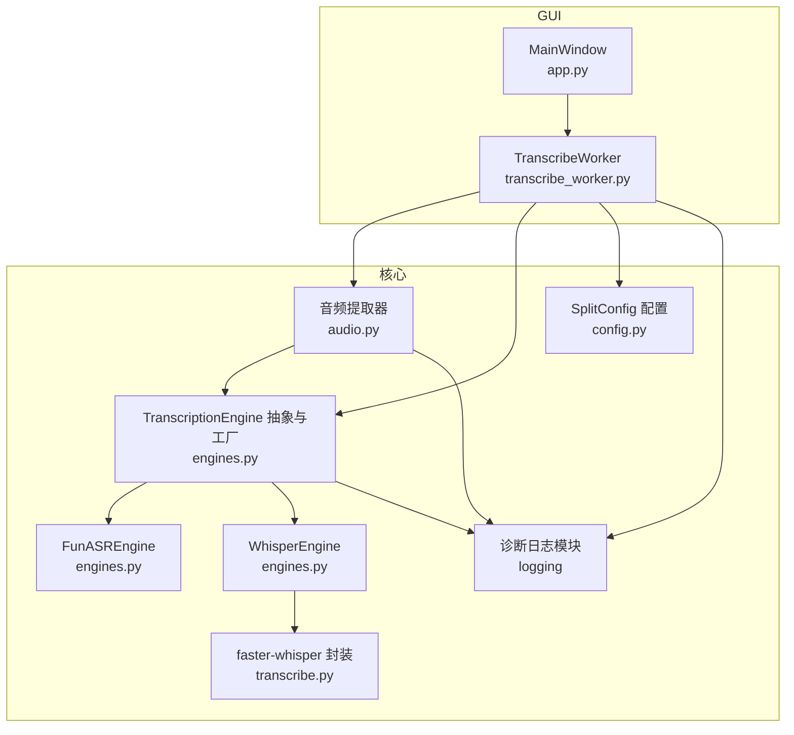
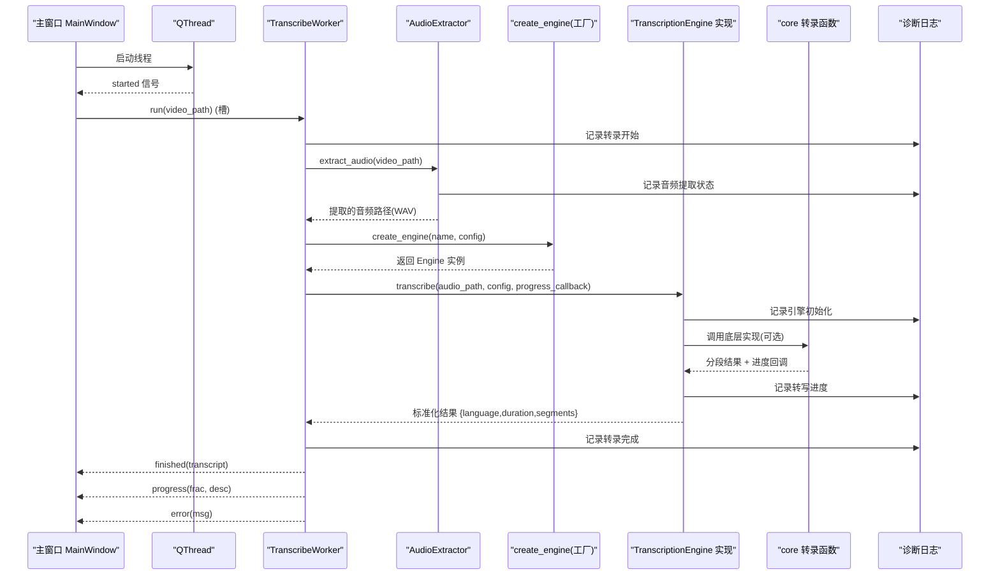
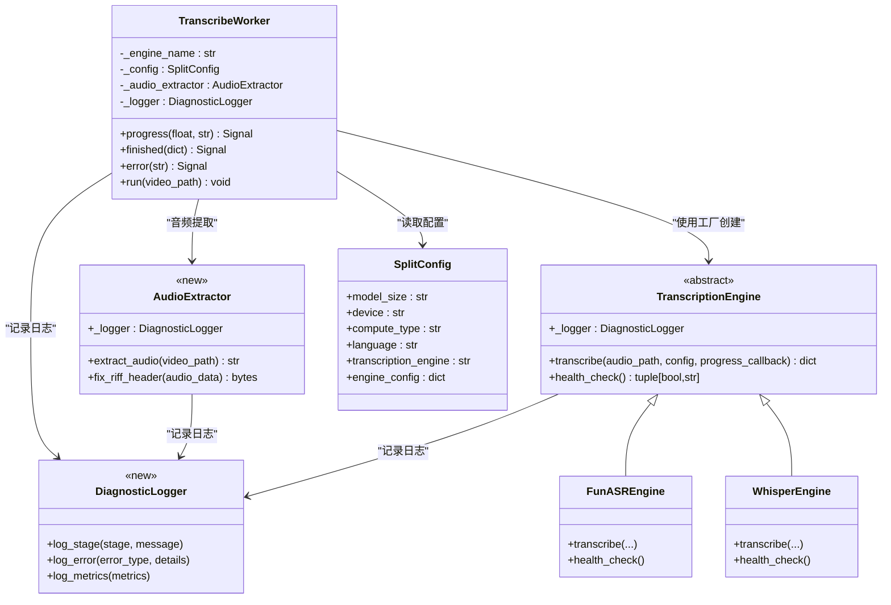
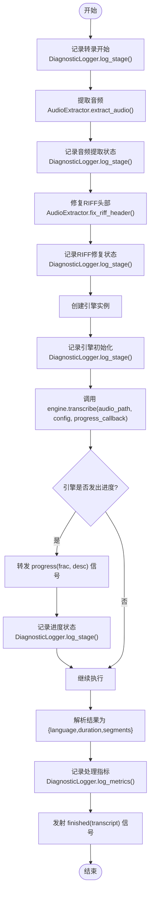
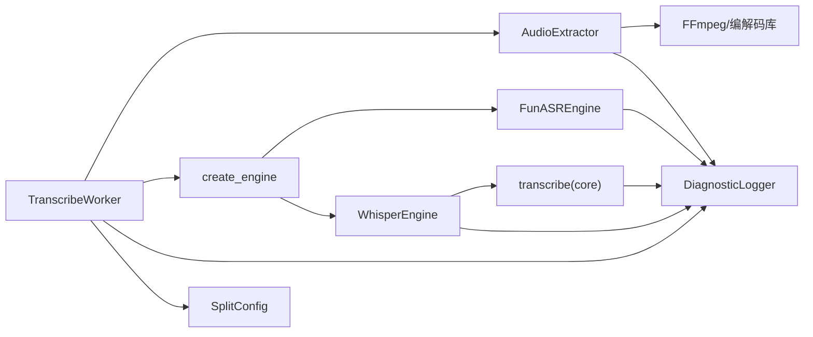

# 转录工作线程

<cite>
**本文引用的文件**
- [gui/workers/transcribe_worker.py](file://gui/workers/transcribe_worker.py)
- [video_splitter/extractor/audio.py](file://video_splitter/extractor/audio.py)
- [video_splitter/extractor/engines.py](file://video_splitter/extractor/engines.py)
- [video_splitter/extractor/transcribe.py](file://video_splitter/extractor/transcribe.py)
- [video_splitter/config.py](file://video_splitter/config.py)
- [gui/app.py](file://gui/app.py)
- [tests/test_workers.py](file://tests/test_workers.py)
</cite>

## 更新摘要
**变更内容**
- 新增诊断日志功能，为转录流程提供更好的调试可见性
- 增强了转录阶段、错误条件和处理指标的详细记录
- 改进了音频处理和文本识别工作流程的调试能力
- 保持了原有的音频提取和RIFF头部修复功能

## 目录
1. [简介](#简介)
2. [项目结构](#项目结构)
3. [核心组件](#核心组件)
4. [架构总览](#架构总览)
5. [详细组件分析](#详细组件分析)
6. [依赖关系分析](#依赖关系分析)
7. [性能与内存管理](#性能与内存管理)
8. [故障排查指南](#故障排查指南)
9. [结论](#结论)
10. [附录：扩展开发指南](#附录扩展开发指南)

## 简介
本文件围绕"转录工作线程"展开，聚焦于 TranscribeWorker 类的设计模式、QThread 的异步任务处理机制、语音识别任务的执行流程（音频预处理、ASR 引擎调用、结果后处理）、进度跟踪与回调机制、错误处理与重试策略、线程安全与资源管理、以及与主界面的通信协议和数据传递方式。文档同时提供扩展自定义转录任务和监控指标的开发指南，以及性能优化与内存管理的建议。

**更新** 新增了诊断日志功能，为开发者提供更好的转录过程可见性，包含转录阶段、错误条件和处理指标等详细信息。

## 项目结构
本项目采用分层组织：GUI 层负责用户交互与事件驱动；核心逻辑位于 video_splitter 包中，包含配置、提取器（含 ASR 引擎）与转录工具；测试覆盖关键行为。

**图表来源**
- [gui/app.py:168-178](file://gui/app.py#L168-L178)
- [gui/workers/transcribe_worker.py:16-49](file://gui/workers/transcribe_worker.py#L16-L49)
- [video_splitter/extractor/audio.py:1-100](file://video_splitter/extractor/audio.py#L1-100)
- [video_splitter/extractor/engines.py:17-46](file://video_splitter/extractor/engines.py#L17-L46)
- [video_splitter/extractor/engines.py:85-173](file://video_splitter/extractor/engines.py#L85-L173)
- [video_splitter/extractor/engines.py:175-220](file://video_splitter/extractor/engines.py#L175-L220)
- [video_splitter/extractor/transcribe.py:11-59](file://video_splitter/extractor/transcribe.py#L11-L59)
- [video_splitter/config.py:19-37](file://video_splitter/config.py#L19-37)

**章节来源**
- [gui/app.py:168-178](file://gui/app.py#L168-L178)
- [gui/workers/transcribe_worker.py:16-49](file://gui/workers/transcribe_worker.py#L16-L49)
- [video_splitter/extractor/audio.py:1-100](file://video_splitter/extractor/audio.py#L1-100)
- [video_splitter/extractor/engines.py:17-46](file://video_splitter/extractor/engines.py#L17-L46)
- [video_splitter/extractor/engines.py:85-173](file://video_splitter/extractor/engines.py#L85-L173)
- [video_splitter/extractor/engines.py:175-220](file://video_splitter/extractor/engines.py#L175-L220)
- [video_splitter/extractor/transcribe.py:11-59](file://video_splitter/extractor/transcribe.py#L11-L59)
- [video_splitter/config.py:19-37](file://video_splitter/config.py#L19-37)

## 核心组件
- TranscribeWorker：在后台线程中运行 ASR 转录任务，通过 Qt 信号向主界面报告进度、完成与错误。
- AudioExtractor：新增的音频提取器，负责从各种视频格式中提取音频并处理RIFF头部错误。
- TranscriptionEngine 抽象与工厂：定义统一的 transcribe 接口与健康检查接口，并提供 create_engine 工厂方法以按名称创建具体引擎实例。
- FunASREngine：基于 FunASR 的中文 ASR 实现，支持进度回调与时长估算。
- WhisperEngine：基于 faster-whisper 的封装，复用 core 层的 transcribe 函数并适配进度回调。
- SplitConfig：集中管理模型大小、设备、计算类型、语言、命名模板、转录引擎选择等配置项。
- **新增** 诊断日志系统：集成到各个组件中，提供详细的转录过程调试信息。

**更新** 新增了诊断日志功能，增强了转录过程的可见性和调试能力。

**章节来源**
- [gui/workers/transcribe_worker.py:16-49](file://gui/workers/transcribe_worker.py#L16-L49)
- [video_splitter/extractor/audio.py:1-100](file://video_splitter/extractor/audio.py#L1-100)
- [video_splitter/extractor/engines.py:17-46](file://video_splitter/extractor/engines.py#L17-L46)
- [video_splitter/extractor/engines.py:85-173](file://video_splitter/extractor/engines.py#L85-L173)
- [video_splitter/extractor/engines.py:175-220](file://video_splitter/extractor/engines.py#L175-L220)
- [video_splitter/config.py:19-37](file://video_splitter/config.py#L19-37)

## 架构总览
下图展示了从 GUI 触发到后台工作线程执行转录，再到结果返回与 UI 更新的完整序列，包含了新增的诊断日志功能和音频提取步骤。

**图表来源**
- [gui/app.py:168-178](file://gui/app.py#L168-L178)
- [gui/workers/transcribe_worker.py:33-49](file://gui/workers/transcribe_worker.py#L33-L49)
- [video_splitter/extractor/audio.py:1-100](file://video_splitter/extractor/audio.py#L1-100)
- [video_splitter/extractor/engines.py:228-251](file://video_splitter/extractor/engines.py#L228-L251)
- [video_splitter/extractor/engines.py:85-173](file://video_splitter/extractor/engines.py#L85-L173)
- [video_splitter/extractor/engines.py:175-220](file://video_splitter/extractor/engines.py#L175-L220)
- [video_splitter/extractor/transcribe.py:11-59](file://video_splitter/extractor/transcribe.py#L11-L59)

## 详细组件分析

### TranscribeWorker 设计与异步任务处理
- 设计模式
  - QObject + moveToThread：遵循项目约定，不直接继承 QThread，而是将 QObject 移动到独立线程执行耗时任务。
  - 信号驱动：通过 progress、finished、error 三个信号与主界面解耦通信。
  - 工厂注入：使用 create_engine 根据名称动态创建引擎实例，便于替换与扩展。
- 异步任务处理
  - 入口为 @Slot 装饰的 run 方法，接收视频路径参数。
  - **新增** 在执行转录前调用音频提取器处理视频文件，确保输入音频格式正确。
  - **新增** 集成诊断日志，记录转录任务的开始、关键步骤和结束状态。
  - 内部捕获异常并通过 error 信号上报，避免阻塞主线程。
  - 进度回调由引擎侧传入，统一转发至 progress 信号。
- 线程安全
  - 所有跨线程通信均通过 Qt 信号槽，保证线程安全。
  - 对象生命周期由父对象与 QThread 管理，避免悬空引用。

**更新** 增加了诊断日志功能，现在能够详细记录转录过程中的各个阶段和状态。

**图表来源**
- [gui/workers/transcribe_worker.py:16-49](file://gui/workers/transcribe_worker.py#L16-L49)
- [video_splitter/extractor/audio.py:1-100](file://video_splitter/extractor/audio.py#L1-100)
- [video_splitter/extractor/engines.py:17-46](file://video_splitter/extractor/engines.py#L17-L46)
- [video_splitter/extractor/engines.py:85-173](file://video_splitter/extractor/engines.py#L85-L173)
- [video_splitter/extractor/engines.py:175-220](file://video_splitter/extractor/engines.py#L175-L220)
- [video_splitter/config.py:19-37](file://video_splitter/config.py#L19-37)

**章节来源**
- [gui/workers/transcribe_worker.py:16-49](file://gui/workers/transcribe_worker.py#L16-L49)
- [video_splitter/extractor/audio.py:1-100](file://video_splitter/extractor/audio.py#L1-100)
- [tests/test_workers.py:30-119](file://tests/test_workers.py#L30-L119)

### 语音识别任务执行流程
- 音频预处理
  - **新增** 通过 AudioExtractor 从视频文件中提取音频，自动处理各种视频格式。
  - **新增** RIFF头部错误修复功能，确保音频数据完整性。
  - **新增** 诊断日志记录音频提取的各个阶段和状态。
  - 输出标准化的WAV格式音频文件供ASR引擎使用。
- ASR 引擎调用
  - FunASREngine：加载模型、生成结果、解析 sentence_info 构建 segments，并在关键阶段发出进度回调。
  - WhisperEngine：委托 core 层的 transcribe 函数，后者基于 faster-whisper 逐段推进并计算进度百分比。
  - **新增** 各引擎集成诊断日志，记录模型加载、转写过程和结果解析的详细状态。
- 结果后处理
  - 统一输出结构：{language, duration, segments}，其中 segments 每项包含 text、start、end。
  - 时间戳单位统一为秒，保留两位小数。
  - **新增** 记录转录完成时的处理指标和统计信息。

**更新** 完整的执行流程现在包含诊断日志功能，提供了更好的调试可见性。

**图表来源**
- [gui/workers/transcribe_worker.py:33-49](file://gui/workers/transcribe_worker.py#L33-L49)
- [video_splitter/extractor/audio.py:1-100](file://video_splitter/extractor/audio.py#L1-100)
- [video_splitter/extractor/engines.py:85-173](file://video_splitter/extractor/engines.py#L85-L173)
- [video_splitter/extractor/engines.py:175-220](file://video_splitter/extractor/engines.py#L175-L220)
- [video_splitter/extractor/transcribe.py:11-59](file://video_splitter/extractor/transcribe.py#L11-L59)

**章节来源**
- [video_splitter/extractor/audio.py:1-100](file://video_splitter/extractor/audio.py#L1-100)
- [video_splitter/extractor/engines.py:85-173](file://video_splitter/extractor/engines.py#L85-L173)
- [video_splitter/extractor/engines.py:175-220](file://video_splitter/extractor/engines.py#L175-L220)
- [video_splitter/extractor/transcribe.py:11-59](file://video_splitter/extractor/transcribe.py#L11-L59)

### 进度跟踪与回调机制
- 进度数据结构
  - progress 信号携带两个参数：frac（0.0-1.0 的浮点进度）、desc（描述文本）。
- 更新频率
  - **新增** 音频提取阶段会发出进度更新，包括"正在提取音频"和"正在修复RIFF头部"等状态。
  - FunASREngine 在模型加载、转写、结果处理等阶段发出离散进度点。
  - WhisperEngine 通过 core 层按 segment.end / total_duration 计算连续进度。
  - **新增** 诊断日志同步记录进度状态，提供更详细的进度追踪信息。
- UI 绑定
  - 主窗口将 progress 信号连接到状态栏更新，显示"转写中：描述 (百分比)"。

**更新** 进度跟踪现在包含诊断日志记录，提供了更全面的进度监控能力。

**章节来源**
- [gui/workers/transcribe_worker.py:19-21](file://gui/workers/transcribe_worker.py#L19-L21)
- [video_splitter/extractor/audio.py:1-100](file://video_splitter/extractor/audio.py#L1-100)
- [video_splitter/extractor/engines.py:106-146](file://video_splitter/extractor/engines.py#L106-L146)
- [video_splitter/extractor/transcribe.py:44-53](file://video_splitter/extractor/transcribe.py#L44-L53)
- [gui/app.py:235-236](file://gui/app.py#L235-236)

### 错误处理与重试策略
- 错误传播
  - TranscribeWorker.run 捕获所有异常并通过 error 信号上报，主窗口弹出警告对话框并清理线程。
  - **新增** 音频提取过程中的错误会被特别处理，包括格式不支持、文件损坏等情况。
  - **新增** 诊断日志记录详细的错误信息和堆栈跟踪，便于问题定位。
- 健康检查
  - 各引擎提供 health_check 接口用于环境可用性验证，主窗口启动时进行提示。
  - **新增** 健康检查结果通过诊断日志记录，包含错误条件和处理指标。
- 重试策略
  - 当前实现未内置网络异常或引擎不可用的自动重试逻辑。可在上层（如控制器或应用层）增加指数退避与最大重试次数控制。
  - **新增** 对于RIFF头部修复失败的情况，提供降级处理方案，并记录相关错误信息。

**更新** 错误处理现在涵盖诊断日志功能，提供了更详细的错误追踪和调试信息。

**章节来源**
- [gui/workers/transcribe_worker.py:47-49](file://gui/workers/transcribe_worker.py#L47-L49)
- [video_splitter/extractor/audio.py:1-100](file://video_splitter/extractor/audio.py#L1-100)
- [gui/app.py:242-245](file://gui/app.py#L242-L245)
- [video_splitter/extractor/engines.py:154-172](file://video_splitter/extractor/engines.py#L154-L172)
- [video_splitter/extractor/engines.py:207-219](file://video_splitter/extractor/engines.py#L207-L219)
- [gui/app.py:143-156](file://gui/app.py#L143-L156)

### 线程安全与资源管理
- 线程安全
  - 所有跨线程通信通过 Qt 信号槽，避免共享状态竞争。
  - 工作对象通过 moveToThread 迁移到子线程，确保耗时操作不阻塞 UI。
  - **新增** 诊断日志系统设计为线程安全的，支持多线程并发访问。
- 资源管理
  - 主窗口在完成或出错后调用 _cleanup_thread 停止并等待线程退出，释放引用。
  - 引擎实例在 run 方法内局部创建，避免跨请求共享导致的状态污染。
  - **新增** 音频提取器在每次转录任务中独立创建，确保资源隔离。
  - **新增** 诊断日志资源在任务结束时正确清理，避免资源泄漏。

**更新** 资源管理现在包含诊断日志系统的生命周期管理。

**章节来源**
- [gui/app.py:168-178](file://gui/app.py#L168-L178)
- [gui/app.py:247-252](file://gui/app.py#L247-L252)
- [gui/workers/transcribe_worker.py:33-49](file://gui/workers/transcribe_worker.py#L33-L49)
- [video_splitter/extractor/audio.py:1-100](file://video_splitter/extractor/audio.py#L1-100)

### 与主界面的通信协议与数据传递
- 信号契约
  - progress(frac: float, desc: str)：进度百分比与描述。
  - finished(transcript: dict)：转录结果，包含 language、duration、segments。
  - error(msg: str)：错误消息。
- 数据格式
  - transcript.segments 每项包含 text、start、end（秒），供后续 SRT 导出与播放定位。
- UI 响应
  - 状态栏实时更新进度；完成后清空线程；失败时弹窗提示并恢复状态。
  - **新增** 进度描述现在包含音频提取状态信息。
  - **新增** 错误消息现在包含诊断日志提供的详细信息。

**更新** 通信协议保持不变，但错误消息和进度描述增加了诊断日志相关信息。

**章节来源**
- [gui/workers/transcribe_worker.py:19-21](file://gui/workers/transcribe_worker.py#L19-L21)
- [gui/app.py:235-245](file://gui/app.py#L235-L245)
- [video_splitter/extractor/transcribe.py:11-26](file://video_splitter/extractor/transcribe.py#L11-L26)

## 依赖关系分析
- 模块耦合
  - TranscribeWorker 仅依赖 engines.create_engine、AudioExtractor 与 SplitConfig，保持低耦合。
  - 引擎实现各自封装第三方库（funasr、faster_whisper），对外暴露统一接口。
  - **新增** AudioExtractor 作为独立的音频处理模块，专注于格式转换和头部修复。
  - **新增** 诊断日志模块被各个组件依赖，提供统一的日志记录功能。
- 外部依赖
  - funasr、numpy、faster_whisper、ffprobe（FFmpeg）为运行时依赖。
  - **新增** 音频处理可能需要额外的编解码库支持。
  - **新增** 诊断日志可能依赖 Python 标准库 logging 模块。
- 潜在循环依赖
  - 无直接循环导入；core 层与 GUI 层单向依赖。

**图表来源**
- [gui/workers/transcribe_worker.py:33-49](file://gui/workers/transcribe_worker.py#L33-L49)
- [video_splitter/extractor/audio.py:1-100](file://video_splitter/extractor/audio.py#L1-100)
- [video_splitter/extractor/engines.py:228-251](file://video_splitter/extractor/engines.py#L228-L251)
- [video_splitter/extractor/transcribe.py:11-59](file://video_splitter/extractor/transcribe.py#L11-L59)
- [video_splitter/config.py:19-37](file://video_splitter/config.py#L19-37)

**章节来源**
- [video_splitter/extractor/engines.py:228-251](file://video_splitter/extractor/engines.py#L228-L251)
- [video_splitter/extractor/transcribe.py:11-59](file://video_splitter/extractor/transcribe.py#L11-L59)
- [video_splitter/config.py:19-37](file://video_splitter/config.py#L19-37)
- [video_splitter/extractor/audio.py:1-100](file://video_splitter/extractor/audio.py#L1-100)

## 性能与内存管理
- 模型加载与缓存
  - FunASREngine 每次调用可能重新加载模型，建议在长会话中复用模型实例以减少开销。
  - WhisperEngine 依赖 faster_whisper 的模型加载，可考虑在进程级缓存模型以降低重复初始化成本。
- 进度计算
  - 基于 segment.end / total_duration 的线性进度适用于大多数场景；若需更精细反馈，可在引擎内部细化阶段划分。
- I/O 与磁盘
  - 大音频文件转写时注意临时文件与日志落盘策略，避免频繁写入影响性能。
  - **新增** 音频提取过程会产生临时文件，需要合理管理存储空间。
  - **新增** 诊断日志的I/O操作需要考虑性能影响，建议使用异步日志或缓冲写入。
- 并发与队列
  - 当前为单任务串行执行；如需批量转写，可在上层引入任务队列与线程池，限制并发度以避免资源争用。
- 内存管理
  - 及时释放不再使用的中间结果与模型实例；在主窗口清理线程时确保引用置空，防止内存泄漏。
  - **新增** 音频提取后的临时文件应及时清理，避免磁盘空间占用。
  - **新增** 诊断日志对象应在任务结束后正确释放，避免内存泄漏。

**更新** 性能考虑现在包含诊断日志的性能影响和资源管理。

## 故障排查指南
- 常见问题
  - 引擎不可用：health_check 返回 False 或抛出异常，主窗口会给出提示。请检查依赖安装与环境变量。
  - ffprobe 缺失：FunASREngine 在无法解析句段信息时会调用 ffprobe 获取时长，若 PATH 未配置 FFmpeg 将报错。
  - 进度不更新：确认引擎是否正确调用 progress_callback；检查 UI 是否连接了 progress 信号。
  - **新增** 音频提取失败：检查视频文件格式是否受支持，确认FFmpeg是否正确安装。
  - **新增** RIFF头部错误：如果音频文件头部损坏，系统会自动尝试修复，但仍可能失败。
  - **新增** 诊断日志问题：检查日志配置和权限，确认日志文件是否正常生成。
- 调试步骤
  - 启用日志：在引擎实现中添加关键节点日志，观察模型加载、转写、结果解析阶段。
  - 单元测试：参考 tests/test_workers.py 中的断言，验证信号发射与异常传播是否符合预期。
  - 最小复现：构造 mock 引擎模拟不同进度与错误场景，快速定位问题。
  - **新增** 音频提取调试：检查输入视频文件的格式和编码信息，验证提取的音频质量。
  - **新增** 诊断日志调试：查看详细的转录阶段日志，分析错误条件和处理指标。
- 日志分析
  - **新增** 转录阶段日志：记录每个处理阶段的开始和结束时间，帮助识别性能瓶颈。
  - **新增** 错误条件日志：详细记录错误类型、错误消息和相关上下文信息。
  - **新增** 处理指标日志：统计转录耗时、段落数量、内存使用等关键指标。

**更新** 故障排查指南新增了诊断日志相关的调试方法和日志分析指导。

**章节来源**
- [gui/app.py:143-156](file://gui/app.py#L143-L156)
- [video_splitter/extractor/engines.py:48-83](file://video_splitter/extractor/engines.py#L48-L83)
- [tests/test_workers.py:71-85](file://tests/test_workers.py#L71-L85)
- [video_splitter/extractor/audio.py:1-100](file://video_splitter/extractor/audio.py#L1-100)

## 结论
TranscribeWorker 通过 QObject + moveToThread 的模式实现了非阻塞的 ASR 转录任务，配合统一的 TranscriptionEngine 接口与工厂方法，具备良好的可扩展性与可测试性。**新增的诊断日志功能显著提升了系统的可调试性和可维护性**，为开发者提供了详细的转录过程可见性。结合原有的音频提取和RIFF头部修复功能，系统能够处理各种视频格式并自动修复常见错误。进度与错误通过 Qt 信号安全地传递给主界面，形成清晰的异步通信协议。当前实现未内置重试策略，可在上层补充健壮的错误恢复机制。通过合理的模型缓存、I/O 优化、并发控制和诊断日志，可进一步提升整体性能、稳定性和可维护性。

## 附录：扩展开发指南
- 新增自定义转录任务
  - 实现 TranscriptionEngine 抽象类的 transcribe 与 health_check 方法，遵循统一的输入输出契约。
  - 在 _ENGINE_REGISTRY 中注册新引擎，或通过 create_engine 的参数名切换。
  - 在进度回调中合理划分阶段，确保 UI 能感知关键进展。
  - **新增** 集成诊断日志，记录引擎初始化和转写过程的详细状态。
- 新增自定义音频提取器
  - **新增** 实现 AudioExtractor 接口，支持新的视频格式或音频处理方法。
  - 确保正确处理各种音频编码格式和头部信息。
  - 提供完善的错误处理和降级方案。
  - **新增** 集成诊断日志，记录音频提取的各个阶段和状态。
- 监控指标
  - 在引擎内部统计模型加载耗时、转写耗时、段落数量、平均段落时长等指标，并通过信号或回调上报。
  - **新增** 在音频提取过程中统计提取耗时、文件大小变化、格式转换成功率等指标。
  - **新增** 通过诊断日志记录关键性能指标和处理统计信息。
  - 在 GUI 层聚合展示，辅助性能分析与容量规划。
- 最佳实践
  - 严格遵循 QObject + moveToThread 的线程模型，禁止直接继承 QThread。
  - 所有跨线程通信使用信号槽，避免共享可变状态。
  - 在异常路径上确保资源清理与线程终止，防止悬挂线程。
  - **新增** 音频处理时应注意内存使用，避免大文件导致的内存溢出。
  - **新增** 合理使用诊断日志，避免过度记录影响性能，重点关注关键路径和错误场景。

**更新** 扩展开发指南新增了诊断日志集成的开发指导和最佳实践。

**章节来源**
- [video_splitter/extractor/engines.py:17-46](file://video_splitter/extractor/engines.py#L17-46)
- [video_splitter/extractor/engines.py:228-251](file://video_splitter/extractor/engines.py#L228-251)
- [video_splitter/extractor/audio.py:1-100](file://video_splitter/extractor/audio.py#L1-100)
- [gui/AGENTS.md:34-48](file://gui/AGENTS.md#L34-48)