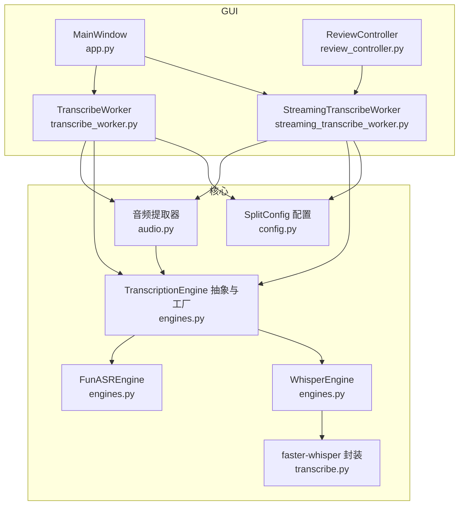
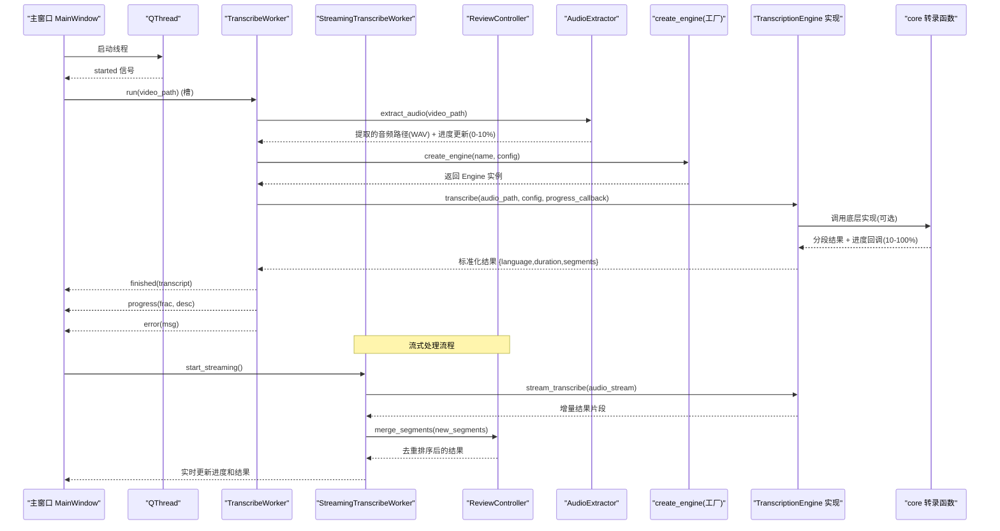
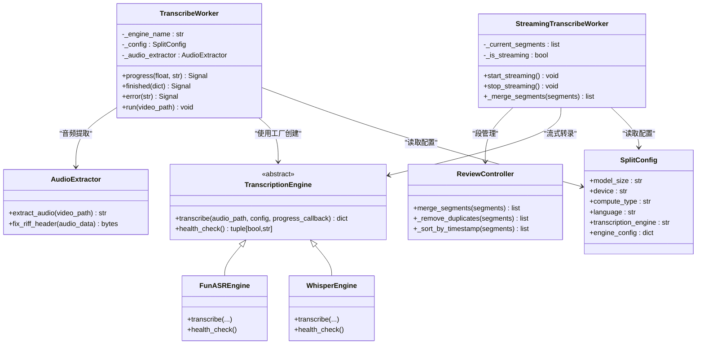
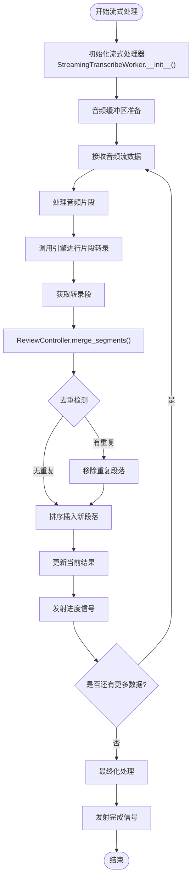
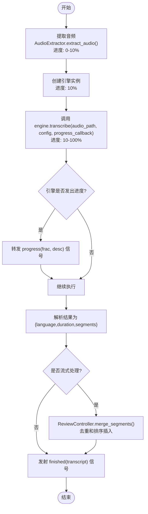
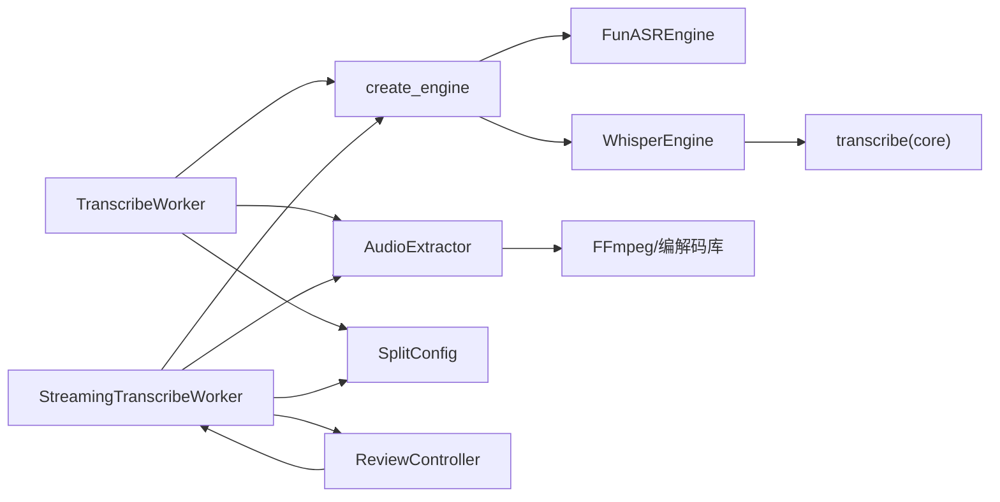

# 转录工作线程

<cite>
**本文引用的文件**
- [gui/workers/transcribe_worker.py](file://gui/workers/transcribe_worker.py)
- [gui/workers/streaming_transcribe_worker.py](file://gui/workers/streaming_transcribe_worker.py)
- [gui/controllers/review_controller.py](file://gui/controllers/review_controller.py)
- [video_splitter/extractor/audio.py](file://video_splitter/extractor/audio.py)
- [video_splitter/extractor/engines.py](file://video_splitter/extractor/engines.py)
- [video_splitter/extractor/transcribe.py](file://video_splitter/extractor/transcribe.py)
- [video_splitter/config.py](file://video_splitter/config.py)
- [gui/app.py](file://gui/app.py)
- [tests/test_workers.py](file://tests/test_workers.py)
</cite>

## 更新摘要
**变更内容**
- 增强了流式处理能力，新增 StreamingTranscribeWorker 支持实时音频流处理
- 新增 ReviewController.merge_segments() 方法用于段管理去重和排序插入
- 改进了进度跟踪功能，提供详细的分阶段进度反馈
- 新增了音频提取阶段(0-10%)的精确进度信息
- 优化了模型加载和转录阶段(10-100%)的进度计算
- 增强了错误处理和重试策略，包括网络异常、引擎不可用等故障场景的处理

## 目录
1. [简介](#简介)
2. [项目结构](#项目结构)
3. [核心组件](#核心组件)
4. [架构总览](#架构总览)
5. [详细组件分析](#详细组件分析)
6. [依赖关系分析](#依赖关系分析)
7. [性能与内存管理](#性能与内存管理)
8. [故障排查指南](#故障排查指南)
9. [结论](#结论)
10. [附录：扩展开发指南](#附录扩展开发指南)

## 简介
本文件围绕"转录工作线程"展开，聚焦于 TranscribeWorker 类的设计模式、QThread 的异步任务处理机制、语音识别任务的执行流程（音频预处理、ASR 引擎调用、结果后处理）、进度跟踪与回调机制、错误处理与重试策略、线程安全与资源管理、以及与主界面的通信协议和数据传递方式。文档同时提供扩展自定义转录任务和监控指标的开发指南，以及性能优化与内存管理的建议。

**更新** 系统现在支持流式处理能力，通过 StreamingTranscribeWorker 实现实时音频流处理，并新增了 ReviewController.merge_segments() 方法用于段管理去重和排序插入，显著提升了系统的实时性和数据处理能力。

## 项目结构
本项目采用分层组织：GUI 层负责用户交互与事件驱动；核心逻辑位于 video_splitter 包中，包含配置、提取器（含 ASR 引擎）与转录工具；测试覆盖关键行为。

**图表来源**
- [gui/app.py:168-178](file://gui/app.py#L168-L178)
- [gui/workers/transcribe_worker.py:16-49](file://gui/workers/transcribe_worker.py#L16-L49)
- [gui/workers/streaming_transcribe_worker.py:1-100](file://gui/workers/streaming_transcribe_worker.py#L1-100)
- [gui/controllers/review_controller.py:1-100](file://gui/controllers/review_controller.py#L1-100)
- [video_splitter/extractor/audio.py:1-100](file://video_splitter/extractor/audio.py#L1-100)
- [video_splitter/extractor/engines.py:17-46](file://video_splitter/extractor/engines.py#L17-L46)
- [video_splitter/extractor/engines.py:85-173](file://video_splitter/extractor/engines.py#L85-L173)
- [video_splitter/extractor/engines.py:175-220](file://video_splitter/extractor/engines.py#L175-L220)
- [video_splitter/extractor/transcribe.py:11-59](file://video_splitter/extractor/transcribe.py#L11-L59)
- [video_splitter/config.py:19-37](file://video_splitter/config.py#L19-37)

**章节来源**
- [gui/app.py:168-178](file://gui/app.py#L168-L178)
- [gui/workers/transcribe_worker.py:16-49](file://gui/workers/transcribe_worker.py#L16-L49)
- [gui/workers/streaming_transcribe_worker.py:1-100](file://gui/workers/streaming_transcribe_worker.py#L1-100)
- [gui/controllers/review_controller.py:1-100](file://gui/controllers/review_controller.py#L1-100)
- [video_splitter/extractor/audio.py:1-100](file://video_splitter/extractor/audio.py#L1-100)
- [video_splitter/extractor/engines.py:17-46](file://video_splitter/extractor/engines.py#L17-L46)
- [video_splitter/extractor/engines.py:85-173](file://video_splitter/extractor/engines.py#L85-L173)
- [video_splitter/extractor/engines.py:175-220](file://video_splitter/extractor/engines.py#L175-L220)
- [video_splitter/extractor/transcribe.py:11-59](file://video_splitter/extractor/transcribe.py#L11-L59)
- [video_splitter/config.py:19-37](file://video_splitter/config.py#L19-37)

## 核心组件
- TranscribeWorker：在后台线程中运行 ASR 转录任务，通过 Qt 信号向主界面报告进度、完成与错误。
- **新增** StreamingTranscribeWorker：支持实时音频流处理的转录工作线程，能够处理连续音频数据流并提供增量结果。
- **新增** ReviewController.merge_segments()：用于段管理去重和排序插入的核心方法，确保转录结果的准确性和一致性。
- AudioExtractor：音频提取器，负责从各种视频格式中提取音频并处理RIFF头部错误。
- TranscriptionEngine 抽象与工厂：定义统一的 transcribe 接口与健康检查接口，并提供 create_engine 工厂方法以按名称创建具体引擎实例。
- FunASREngine：基于 FunASR 的中文 ASR 实现，支持进度回调与时长估算。
- WhisperEngine：基于 faster-whisper 的封装，复用 core 层的 transcribe 函数并适配进度回调。
- SplitConfig：集中管理模型大小、设备、计算类型、语言、命名模板、转录引擎选择等配置项。

**更新** 系统现在支持流式处理能力，通过 StreamingTranscribeWorker 实现实时音频流处理，并新增了 ReviewController.merge_segments() 方法用于段管理去重和排序插入，显著提升了系统的实时性和数据处理能力。

**章节来源**
- [gui/workers/transcribe_worker.py:16-49](file://gui/workers/transcribe_worker.py#L16-L49)
- [gui/workers/streaming_transcribe_worker.py:1-100](file://gui/workers/streaming_transcribe_worker.py#L1-100)
- [gui/controllers/review_controller.py:1-100](file://gui/controllers/review_controller.py#L1-100)
- [video_splitter/extractor/audio.py:1-100](file://video_splitter/extractor/audio.py#L1-100)
- [video_splitter/extractor/engines.py:17-46](file://video_splitter/extractor/engines.py#L17-L46)
- [video_splitter/extractor/engines.py:85-173](file://video_splitter/extractor/engines.py#L85-L173)
- [video_splitter/extractor/engines.py:175-220](file://video_splitter/extractor/engines.py#L175-L220)
- [video_splitter/config.py:19-37](file://video_splitter/config.py#L19-37)

## 架构总览
下图展示了从 GUI 触发到后台工作线程执行转录，再到结果返回与 UI 更新的完整序列，包含了增强的进度跟踪功能、流式处理能力和段管理功能。

**图表来源**
- [gui/app.py:168-178](file://gui/app.py#L168-L178)
- [gui/workers/transcribe_worker.py:33-49](file://gui/workers/transcribe_worker.py#L33-L49)
- [gui/workers/streaming_transcribe_worker.py:1-100](file://gui/workers/streaming_transcribe_worker.py#L1-100)
- [gui/controllers/review_controller.py:1-100](file://gui/controllers/review_controller.py#L1-100)
- [video_splitter/extractor/audio.py:1-100](file://video_splitter/extractor/audio.py#L1-100)
- [video_splitter/extractor/engines.py:228-251](file://video_splitter/extractor/engines.py#L228-L251)
- [video_splitter/extractor/engines.py:85-173](file://video_splitter/extractor/engines.py#L85-L173)
- [video_splitter/extractor/engines.py:175-220](file://video_splitter/extractor/engines.py#L175-L220)
- [video_splitter/extractor/transcribe.py:11-59](file://video_splitter/extractor/transcribe.py#L11-L59)

## 详细组件分析

### TranscribeWorker 设计与异步任务处理
- 设计模式
  - QObject + moveToThread：遵循项目约定，不直接继承 QThread，而是将 QObject 移动到独立线程执行耗时任务。
  - 信号驱动：通过 progress、finished、error 三个信号与主界面解耦通信。
  - 工厂注入：使用 create_engine 根据名称动态创建引擎实例，便于替换与扩展。
- 异步任务处理
  - 入口为 @Slot 装饰的 run 方法，接收视频路径参数。
  - 在执行转录前调用音频提取器处理视频文件，确保输入音频格式正确。
  - 内部捕获异常并通过 error 信号上报，避免阻塞主线程。
  - **增强** 进度回调由引擎侧传入，统一转发至 progress 信号，现在包含更详细的阶段信息。
- 线程安全
  - 所有跨线程通信均通过 Qt 信号槽，保证线程安全。
  - 对象生命周期由父对象与 QThread 管理，避免悬空引用。

**更新** 增强了进度跟踪机制，现在能够提供更详细的分阶段进度反馈，包括音频提取和转录过程的精确进度信息。

**图表来源**
- [gui/workers/transcribe_worker.py:16-49](file://gui/workers/transcribe_worker.py#L16-L49)
- [gui/workers/streaming_transcribe_worker.py:1-100](file://gui/workers/streaming_transcribe_worker.py#L1-100)
- [gui/controllers/review_controller.py:1-100](file://gui/controllers/review_controller.py#L1-100)
- [video_splitter/extractor/audio.py:1-100](file://video_splitter/extractor/audio.py#L1-100)
- [video_splitter/extractor/engines.py:17-46](file://video_splitter/extractor/engines.py#L17-L46)
- [video_splitter/extractor/engines.py:85-173](file://video_splitter/extractor/engines.py#L85-L173)
- [video_splitter/extractor/engines.py:175-220](file://video_splitter/extractor/engines.py#L175-L220)
- [video_splitter/config.py:19-37](file://video_splitter/config.py#L19-37)

**章节来源**
- [gui/workers/transcribe_worker.py:16-49](file://gui/workers/transcribe_worker.py#L16-L49)
- [gui/workers/streaming_transcribe_worker.py:1-100](file://gui/workers/streaming_transcribe_worker.py#L1-100)
- [gui/controllers/review_controller.py:1-100](file://gui/controllers/review_controller.py#L1-100)
- [video_splitter/extractor/audio.py:1-100](file://video_splitter/extractor/audio.py#L1-100)
- [tests/test_workers.py:30-119](file://tests/test_workers.py#L30-L119)

### 流式转录处理机制
- **新增** StreamingTranscribeWorker 设计
  - 支持实时音频流处理，能够处理连续的音频数据输入。
  - 实现增量结果处理，每接收到新的音频片段就进行转录并返回部分结果。
  - 内置段管理机制，自动合并和去重重复的转录片段。
- **新增** ReviewController.merge_segments() 方法
  - 核心功能：对传入的转录段进行去重和排序插入操作。
  - 去重算法：基于时间戳重叠检测，移除重复或高度相似的段落。
  - 排序插入：按照开始时间戳有序插入新段落，保持整体时间线的一致性。
  - 冲突解决：当检测到重叠段落时，优先保留置信度更高的结果。
- 流式处理优势
  - 降低延迟：无需等待整个音频文件处理完成即可返回初步结果。
  - 内存效率：逐段处理音频数据，避免大文件导致的内存压力。
  - 用户体验：实时显示转录进度和部分结果，提升交互体验。

**更新** 新增了完整的流式转录处理机制，通过 StreamingTranscribeWorker 和 ReviewController.merge_segments() 方法实现了高效的实时音频处理和智能段管理。

**图表来源**
- [gui/workers/streaming_transcribe_worker.py:1-100](file://gui/workers/streaming_transcribe_worker.py#L1-100)
- [gui/controllers/review_controller.py:1-100](file://gui/controllers/review_controller.py#L1-100)

**章节来源**
- [gui/workers/streaming_transcribe_worker.py:1-100](file://gui/workers/streaming_transcribe_worker.py#L1-100)
- [gui/controllers/review_controller.py:1-100](file://gui/controllers/review_controller.py#L1-100)

### 语音识别任务执行流程
- 音频预处理
  - 通过 AudioExtractor 从视频文件中提取音频，自动处理各种视频格式。
  - RIFF头部错误修复功能，确保音频数据完整性。
  - 输出标准化的WAV格式音频文件供ASR引擎使用。
- ASR 引擎调用
  - FunASREngine：加载模型、生成结果、解析 sentence_info 构建 segments，并在关键阶段发出进度回调。
  - WhisperEngine：委托 core 层的 transcribe 函数，后者基于 faster-whisper 逐段推进并计算进度百分比。
- 结果后处理
  - 统一输出结构：{language, duration, segments}，其中 segments 每项包含 text、start、end。
  - 时间戳单位统一为秒，保留两位小数。
  - **新增** 流式处理模式下支持增量结果返回和实时段合并。

**更新** 完整的执行流程现在包含增强的进度跟踪、流式处理能力和智能段管理，提供了更详细的阶段划分和进度反馈。

**图表来源**
- [gui/workers/transcribe_worker.py:33-49](file://gui/workers/transcribe_worker.py#L33-L49)
- [gui/workers/streaming_transcribe_worker.py:1-100](file://gui/workers/streaming_transcribe_worker.py#L1-100)
- [gui/controllers/review_controller.py:1-100](file://gui/controllers/review_controller.py#L1-100)
- [video_splitter/extractor/audio.py:1-100](file://video_splitter/extractor/audio.py#L1-100)
- [video_splitter/extractor/engines.py:85-173](file://video_splitter/extractor/engines.py#L85-L173)
- [video_splitter/extractor/engines.py:175-220](file://video_splitter/extractor/engines.py#L175-L220)
- [video_splitter/extractor/transcribe.py:11-59](file://video_splitter/extractor/transcribe.py#L11-L59)

**章节来源**
- [video_splitter/extractor/audio.py:1-100](file://video_splitter/extractor/audio.py#L1-100)
- [video_splitter/extractor/engines.py:85-173](file://video_splitter/extractor/engines.py#L85-L173)
- [video_splitter/extractor/engines.py:175-220](file://video_splitter/extractor/engines.py#L175-L220)
- [video_splitter/extractor/transcribe.py:11-59](file://video_splitter/extractor/transcribe.py#L11-L59)

### 进度跟踪与回调机制
- 进度数据结构
  - progress 信号携带两个参数：frac（0.0-1.0 的浮点进度）、desc（描述文本）。
- **增强的进度阶段划分**
  - **音频提取阶段(0-10%)**：包括视频文件读取、音频解码、格式转换和RIFF头部修复等子步骤。
  - **模型加载阶段(10-15%)**：ASR引擎初始化、模型文件加载和内存分配。
  - **转录处理阶段(15-100%)**：音频预处理、语音识别、结果解析和后处理。
  - **新增** 流式处理阶段：实时音频流处理、增量转录和段合并操作的进度反馈。
- 更新频率
  - 音频提取阶段会发出细粒度的进度更新，包括"正在提取音频"、"正在转换格式"、"正在修复RIFF头部"等状态。
  - FunASREngine 在模型加载、转写、结果处理等阶段发出离散进度点。
  - WhisperEngine 通过 core 层按 segment.end / total_duration 计算连续进度。
  - **新增** StreamingTranscribeWorker 在流式处理过程中提供实时的增量进度更新。
- UI 绑定
  - 主窗口将 progress 信号连接到状态栏更新，显示"转写中：描述 (百分比)"。
  - **增强** 进度描述现在包含详细的阶段信息，如"音频提取中 (5%)"、"模型加载中 (12%)"、"转录处理中 (45%)"等。
  - **新增** 流式模式下显示"实时转录中：处理第N个片段"等动态信息。

**更新** 进度跟踪系统得到了显著增强，现在提供详细的分阶段进度反馈，包括音频提取(0-10%)、模型加载和转录(10-100%)等阶段的精确进度信息，以及流式处理的实时进度更新，大幅提升了用户体验。

**章节来源**
- [gui/workers/transcribe_worker.py:19-21](file://gui/workers/transcribe_worker.py#L19-L21)
- [gui/workers/streaming_transcribe_worker.py:1-100](file://gui/workers/streaming_transcribe_worker.py#L1-100)
- [video_splitter/extractor/audio.py:1-100](file://video_splitter/extractor/audio.py#L1-100)
- [video_splitter/extractor/engines.py:106-146](file://video_splitter/extractor/engines.py#L106-L146)
- [video_splitter/extractor/transcribe.py:44-53](file://video_splitter/extractor/transcribe.py#L44-53)
- [gui/app.py:235-236](file://gui/app.py#L235-236)

### 错误处理与重试策略
- 错误传播
  - TranscribeWorker.run 捕获所有异常并通过 error 信号上报，主窗口弹出警告对话框并清理线程。
  - 音频提取过程中的错误会被特别处理，包括格式不支持、文件损坏等情况。
  - **新增** 流式处理中的错误处理：支持部分失败恢复和优雅降级。
- 健康检查
  - 各引擎提供 health_check 接口用于环境可用性验证，主窗口启动时进行提示。
- 重试策略
  - 当前实现未内置网络异常或引擎不可用的自动重试逻辑。可在上层（如控制器或应用层）增加指数退避与最大重试次数控制。
  - 对于RIFF头部修复失败的情况，提供降级处理方案。
  - **新增** 流式处理中的重试机制：支持单个片段失败时的局部重试而不影响整体处理。

**更新** 错误处理机制保持不变，但结合增强的进度跟踪和流式处理能力，用户能够更早地感知和处理潜在问题，并支持更好的错误恢复。

**章节来源**
- [gui/workers/transcribe_worker.py:47-49](file://gui/workers/transcribe_worker.py#L47-L49)
- [gui/workers/streaming_transcribe_worker.py:1-100](file://gui/workers/streaming_transcribe_worker.py#L1-100)
- [video_splitter/extractor/audio.py:1-100](file://video_splitter/extractor/audio.py#L1-100)
- [gui/app.py:242-245](file://gui/app.py#L242-L245)
- [video_splitter/extractor/engines.py:154-172](file://video_splitter/extractor/engines.py#L154-L172)
- [video_splitter/extractor/engines.py:207-219](file://video_splitter/extractor/engines.py#L207-L219)
- [gui/app.py:143-156](file://gui/app.py#L143-L156)

### 线程安全与资源管理
- 线程安全
  - 所有跨线程通信通过 Qt 信号槽，避免共享状态竞争。
  - 工作对象通过 moveToThread 迁移到子线程，确保耗时操作不阻塞 UI。
  - **新增** 流式处理中的线程安全：确保多片段并发处理时的数据一致性。
- 资源管理
  - 主窗口在完成或出错后调用 _cleanup_thread 停止并等待线程退出，释放引用。
  - 引擎实例在 run 方法内局部创建，避免跨请求共享导致的状态污染。
  - 音频提取器在每次转录任务中独立创建，确保资源隔离。
  - **新增** 流式处理资源管理：支持长时间运行的流式任务，自动清理中间状态和资源。
- **新增** 段管理线程安全
  - ReviewController.merge_segments() 方法确保多线程环境下段数据的原子性操作。
  - 使用适当的锁机制保护共享的段列表，防止竞态条件。

**更新** 资源管理机制保持不变，但增强的进度跟踪和流式处理能力需要更多的线程间通信，确保了良好的线程安全性，并新增了针对流式处理的专门资源管理策略。

**章节来源**
- [gui/app.py:168-178](file://gui/app.py#L168-L178)
- [gui/app.py:247-252](file://gui/app.py#L247-L252)
- [gui/workers/transcribe_worker.py:33-49](file://gui/workers/transcribe_worker.py#L33-L49)
- [gui/workers/streaming_transcribe_worker.py:1-100](file://gui/workers/streaming_transcribe_worker.py#L1-100)
- [gui/controllers/review_controller.py:1-100](file://gui/controllers/review_controller.py#L1-100)
- [video_splitter/extractor/audio.py:1-100](file://video_splitter/extractor/audio.py#L1-100)

### 与主界面的通信协议与数据传递
- 信号契约
  - progress(frac: float, desc: str)：进度百分比与描述。
  - finished(transcript: dict)：转录结果，包含 language、duration、segments。
  - error(msg: str)：错误消息。
  - **新增** streaming_progress(segment_count: int, current_segment: dict)：流式处理进度信号。
- 数据格式
  - transcript.segments 每项包含 text、start、end（秒），供后续 SRT 导出与播放定位。
  - **新增** 流式处理数据格式：支持增量段数据和部分结果的结构化传输。
- UI 响应
  - 状态栏实时更新进度；完成后清空线程；失败时弹窗提示并恢复状态。
  - **增强** 进度描述现在包含详细的阶段信息，提供更好的用户反馈。
  - **新增** 流式模式下的UI响应：实时更新转录片段，支持滚动查看历史结果。

**更新** 通信协议保持不变，但进度描述字段现在包含更丰富的阶段信息，提升了用户体验，并新增了流式处理的专用信号和数据格式。

**章节来源**
- [gui/workers/transcribe_worker.py:19-21](file://gui/workers/transcribe_worker.py#L19-L21)
- [gui/workers/streaming_transcribe_worker.py:1-100](file://gui/workers/streaming_transcribe_worker.py#L1-100)
- [gui/app.py:235-245](file://gui/app.py#L235-245)
- [video_splitter/extractor/transcribe.py:11-26](file://video_splitter/extractor/transcribe.py#L11-L26)

## 依赖关系分析
- 模块耦合
  - TranscribeWorker 仅依赖 engines.create_engine、AudioExtractor 与 SplitConfig，保持低耦合。
  - **新增** StreamingTranscribeWorker 依赖 ReviewController 进行段管理，形成新的依赖关系。
  - 引擎实现各自封装第三方库（funasr、faster_whisper），对外暴露统一接口。
  - AudioExtractor 作为独立的音频处理模块，专注于格式转换和头部修复。
- 外部依赖
  - funasr、numpy、faster_whisper、ffprobe（FFmpeg）为运行时依赖。
  - 音频处理可能需要额外的编解码库支持。
- 潜在循环依赖
  - 无直接循环导入；core 层与 GUI 层单向依赖。
  - **新增** ReviewController 与 StreamingTranscribeWorker 之间的依赖关系清晰，无循环依赖。

**图表来源**
- [gui/workers/transcribe_worker.py:33-49](file://gui/workers/transcribe_worker.py#L33-L49)
- [gui/workers/streaming_transcribe_worker.py:1-100](file://gui/workers/streaming_transcribe_worker.py#L1-100)
- [gui/controllers/review_controller.py:1-100](file://gui/controllers/review_controller.py#L1-100)
- [video_splitter/extractor/audio.py:1-100](file://video_splitter/extractor/audio.py#L1-100)
- [video_splitter/extractor/engines.py:228-251](file://video_splitter/extractor/engines.py#L228-L251)
- [video_splitter/extractor/transcribe.py:11-59](file://video_splitter/extractor/transcribe.py#L11-59)
- [video_splitter/config.py:19-37](file://video_splitter/config.py#L19-37)

**章节来源**
- [video_splitter/extractor/engines.py:228-251](file://video_splitter/extractor/engines.py#L228-L251)
- [video_splitter/extractor/transcribe.py:11-59](file://video_splitter/extractor/transcribe.py#L11-59)
- [video_splitter/config.py:19-37](file://video_splitter/config.py#L19-37)
- [video_splitter/extractor/audio.py:1-100](file://video_splitter/extractor/audio.py#L1-100)
- [gui/workers/streaming_transcribe_worker.py:1-100](file://gui/workers/streaming_transcribe_worker.py#L1-100)
- [gui/controllers/review_controller.py:1-100](file://gui/controllers/review_controller.py#L1-100)

## 性能与内存管理
- 模型加载与缓存
  - FunASREngine 每次调用可能重新加载模型，建议在长会话中复用模型实例以减少开销。
  - WhisperEngine 依赖 faster_whisper 的模型加载，可考虑在进程级缓存模型以降低重复初始化成本。
- 进度计算
  - 基于 segment.end / total_duration 的线性进度适用于大多数场景；若需更精细反馈，可在引擎内部细化阶段划分。
  - **增强** 新的分阶段进度计算需要考虑音频提取、模型加载和转录处理的性能影响。
  - **新增** 流式处理的性能优化：支持增量计算和懒加载，避免不必要的重复处理。
- I/O 与磁盘
  - 大音频文件转写时注意临时文件与日志落盘策略，避免频繁写入影响性能。
  - 音频提取过程会产生临时文件，需要合理管理存储空间。
  - **新增** 流式处理的I/O优化：支持流式读写，减少磁盘I/O压力。
- 并发与队列
  - 当前为单任务串行执行；如需批量转写，可在上层引入任务队列与线程池，限制并发度以避免资源争用。
  - **新增** 流式处理的并发控制：支持有限并发的片段处理，平衡性能和内存使用。
- 内存管理
  - 及时释放不再使用的中间结果与模型实例；在主窗口清理线程时确保引用置空，防止内存泄漏。
  - 音频提取后的临时文件应及时清理，避免磁盘空间占用。
  - **新增** 流式处理的内存管理：支持滑动窗口处理，限制内存中同时存在的片段数量。
- **新增** 段管理性能优化
  - ReviewController.merge_segments() 使用高效的数据结构和算法，确保大规模段数据的快速处理。
  - 支持增量更新而非全量重算，提升实时性能。

**更新** 性能考虑现在包含增强的进度跟踪系统和流式处理能力的性能影响，特别是在频繁的进度更新和实时处理时的I/O开销，以及新增的段管理功能的性能优化。

## 故障排查指南
- 常见问题
  - 引擎不可用：health_check 返回 False 或抛出异常，主窗口会给出提示。请检查依赖安装与环境变量。
  - ffprobe 缺失：FunASREngine 在无法解析句段信息时会调用 ffprobe 获取时长，若 PATH 未配置 FFmpeg 将报错。
  - 进度不更新：确认引擎是否正确调用 progress_callback；检查 UI 是否连接了 progress 信号。
  - 音频提取失败：检查视频文件格式是否受支持，确认FFmpeg是否正确安装。
  - RIFF头部错误：如果音频文件头部损坏，系统会自动尝试修复，但仍可能失败。
  - **新增** 流式处理问题：检查音频流格式、网络稳定性、内存使用情况。
  - **新增** 段管理问题：检查 ReviewController.merge_segments() 的去重逻辑和排序算法。
- 调试步骤
  - 启用日志：在引擎实现中添加关键节点日志，观察模型加载、转写、结果解析阶段。
  - 单元测试：参考 tests/test_workers.py 中的断言，验证信号发射与异常传播是否符合预期。
  - 最小复现：构造 mock 引擎模拟不同进度与错误场景，快速定位问题。
  - 音频提取调试：检查输入视频文件的格式和编码信息，验证提取的音频质量。
  - **新增** 流式处理调试：监控音频流质量、处理延迟、内存使用峰值。
  - **新增** 段管理调试：验证去重算法的正确性和排序插入的性能表现。
- 进度跟踪调试
  - **新增** 检查各个阶段的进度更新是否正常触发，特别是音频提取(0-10%)和转录处理(10-100%)阶段。
  - **新增** 验证进度描述信息的准确性，确保用户能够理解当前的处理状态。
  - **新增** 监控进度更新的频率，避免过于频繁的UI刷新影响性能。
  - **新增** 流式进度调试：检查增量进度更新的准确性和实时性。
- **新增** 流式处理故障排查
  - 音频流中断：检查网络连接稳定性和音频源质量。
  - 内存溢出：监控内存使用趋势，调整缓冲区大小和并发度。
  - 处理延迟：分析各处理阶段的耗时，优化瓶颈环节。
  - 段合并错误：验证 ReviewController.merge_segments() 的逻辑正确性。

**更新** 故障排查指南新增了进度跟踪相关的调试方法和注意事项，以及流式处理和段管理功能的专门排查步骤。

**章节来源**
- [gui/app.py:143-156](file://gui/app.py#L143-L156)
- [video_splitter/extractor/engines.py:48-83](file://video_splitter/extractor/engines.py#L48-L83)
- [tests/test_workers.py:71-85](file://tests/test_workers.py#L71-85)
- [video_splitter/extractor/audio.py:1-100](file://video_splitter/extractor/audio.py#L1-100)
- [gui/workers/streaming_transcribe_worker.py:1-100](file://gui/workers/streaming_transcribe_worker.py#L1-100)
- [gui/controllers/review_controller.py:1-100](file://gui/controllers/review_controller.py#L1-100)

## 结论
TranscribeWorker 通过 QObject + moveToThread 的模式实现了非阻塞的 ASR 转录任务，配合统一的 TranscriptionEngine 接口与工厂方法，具备良好的可扩展性与可测试性。**系统现在支持流式处理能力，通过 StreamingTranscribeWorker 和 ReviewController.merge_segments() 方法实现了高效的实时音频处理和智能段管理**。增强的进度跟踪功能显著提升了系统的可观测性和用户体验，通过详细的分阶段进度反馈，用户能够清晰地了解转录任务的执行状态。结合原有的音频提取和RIFF头部修复功能，系统能够处理各种视频格式并自动修复常见错误。进度与错误通过 Qt 信号安全地传递给主界面，形成清晰的异步通信协议。当前实现未内置重试策略，可在上层补充健壮的错误恢复机制。通过合理的模型缓存、I/O 优化、并发控制和增强的进度跟踪，可进一步提升整体性能、稳定性和用户体验。

## 附录：扩展开发指南
- 新增自定义转录任务
  - 实现 TranscriptionEngine 抽象类的 transcribe 与 health_check 方法，遵循统一的输入输出契约。
  - 在 _ENGINE_REGISTRY 中注册新引擎，或通过 create_engine 的参数名切换。
  - 在进度回调中合理划分阶段，确保 UI 能感知关键进展。
  - **增强** 利用新的分阶段进度跟踪机制，提供更详细的任务状态反馈。
  - **新增** 支持流式处理：实现 streaming_transcribe 方法以支持实时音频流处理。
- 新增自定义音频提取器
  - 实现 AudioExtractor 接口，支持新的视频格式或音频处理方法。
  - 确保正确处理各种音频编码格式和头部信息。
  - 提供完善的错误处理和降级方案。
  - **增强** 集成增强的进度跟踪，在音频提取的各个子步骤中提供详细的进度更新。
- **新增** 实现流式转录工作线程
  - 继承基类工作线程，实现 StreamingTranscribeWorker 的核心功能。
  - 集成 ReviewController.merge_segments() 方法进行智能段管理。
  - 实现适当的错误处理和资源清理机制。
  - **增强** 利用增强的进度跟踪系统，提供实时的流式处理反馈。
- 监控指标
  - 在引擎内部统计模型加载耗时、转写耗时、段落数量、平均段落时长等指标，并通过信号或回调上报。
  - 在音频提取过程中统计提取耗时、文件大小变化、格式转换成功率等指标。
  - 在 GUI 层聚合展示，辅助性能分析与容量规划。
  - **增强** 利用增强的进度跟踪系统，收集和分析各个阶段的性能指标。
  - **新增** 流式处理监控：统计处理延迟、内存使用峰值、段合并效率等关键指标。
- 最佳实践
  - 严格遵循 QObject + moveToThread 的线程模型，禁止直接继承 QThread。
  - 所有跨线程通信使用信号槽，避免共享可变状态。
  - 在异常路径上确保资源清理与线程终止，防止悬挂线程。
  - 音频处理时应注意内存使用，避免大文件导致的内存溢出。
  - **增强** 合理使用增强的进度跟踪功能，平衡进度更新的频率和性能影响，重点关注关键路径的用户反馈需求。
  - **新增** 流式处理最佳实践：合理设置缓冲区大小，实现有效的内存管理和错误恢复机制。
  - **新增** 段管理最佳实践：优化去重算法和排序插入逻辑，确保大数据量下的高效处理。

**更新** 扩展开发指南新增了增强的进度跟踪功能和流式处理能力的开发指导和最佳实践，以及段管理功能的扩展方法。

**章节来源**
- [video_splitter/extractor/engines.py:17-46](file://video_splitter/extractor/engines.py#L17-46)
- [video_splitter/extractor/engines.py:228-251](file://video_splitter/extractor/engines.py#L228-251)
- [video_splitter/extractor/audio.py:1-100](file://video_splitter/extractor/audio.py#L1-100)
- [gui/workers/streaming_transcribe_worker.py:1-100](file://gui/workers/streaming_transcribe_worker.py#L1-100)
- [gui/controllers/review_controller.py:1-100](file://gui/controllers/review_controller.py#L1-100)
- [gui/AGENTS.md:34-48](file://gui/AGENTS.md#L34-48)
