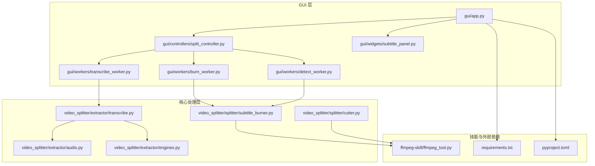
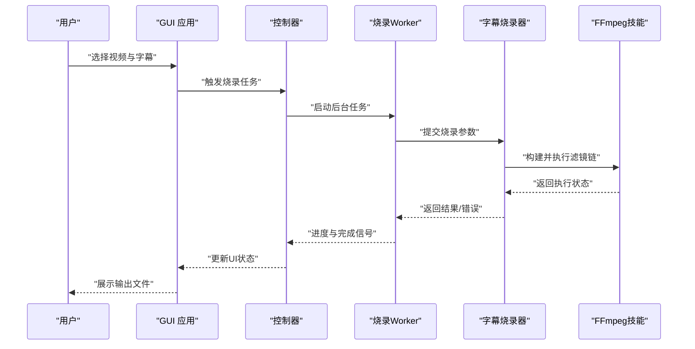
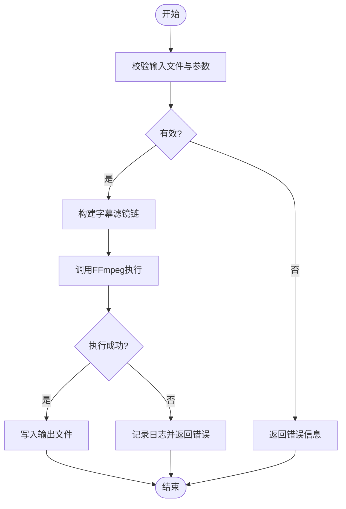
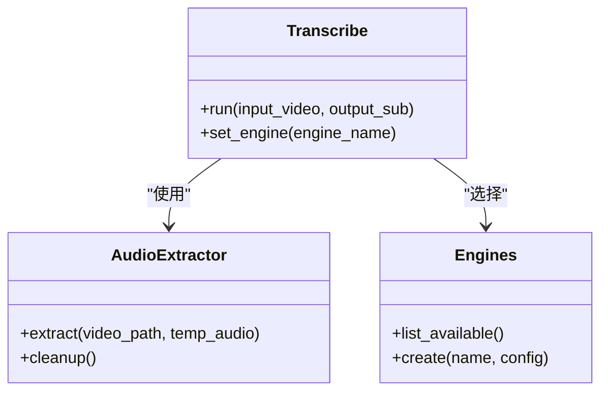
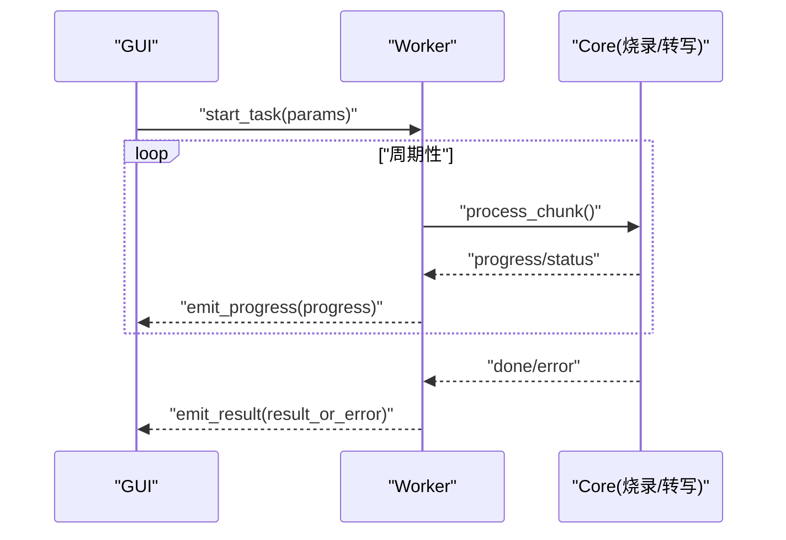
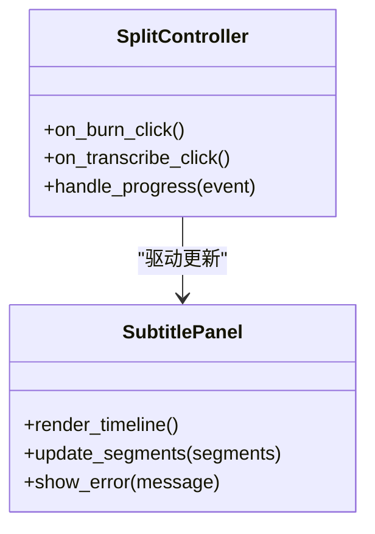
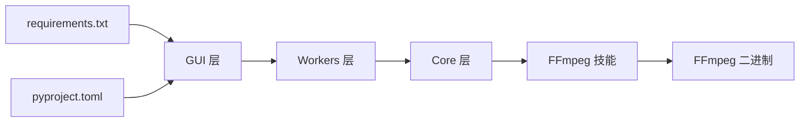

# 字幕烧录系统

<cite>
**本文引用的文件**   
- [README.md](file://README.md)
- [pyproject.toml](file://pyproject.toml)
- [requirements.txt](file://requirements.txt)
- [video_splitter/splitter/subtitle_burner.py](file://video_splitter/splitter/subtitle_burner.py)
- [video_splitter/splitter/cutter.py](file://video_splitter/splitter/cutter.py)
- [video_splitter/extractor/transcribe.py](file://video_splitter/extractor/transcribe.py)
- [video_splitter/extractor/audio.py](file://video_splitter/extractor/audio.py)
- [video_splitter/extractor/engines.py](file://video_splitter/extractor/engines.py)
- [gui/workers/burn_worker.py](file://gui/workers/burn_worker.py)
- [gui/workers/detect_worker.py](file://gui/workers/detect_worker.py)
- [gui/workers/transcribe_worker.py](file://gui/workers/transcribe_worker.py)
- [gui/widgets/subtitle_panel.py](file://gui/widgets/subtitle_panel.py)
- [gui/controllers/split_controller.py](file://gui/controllers/split_controller.py)
- [gui/app.py](file://gui/app.py)
- [ffmpeg-skill/ffmpeg_tool.py](file://ffmpeg-skill/ffmpeg_tool.py)
- [tests/test_subtitle_burn.py](file://tests/test_subtitle_burn.py)
</cite>

## 目录
1. [简介](#简介)
2. [项目结构](#项目结构)
3. [核心组件](#核心组件)
4. [架构总览](#架构总览)
5. [详细组件分析](#详细组件分析)
6. [依赖关系分析](#依赖关系分析)
7. [性能考虑](#性能考虑)
8. [故障排查指南](#故障排查指南)
9. [结论](#结论)
10. [附录](#附录)

## 简介
本仓库实现了一个“字幕烧录系统”，围绕视频处理与字幕合成，提供从音频转写、字幕生成到将字幕烧录进视频的完整能力。系统采用分层设计：GUI 层负责交互与任务编排，workers 层负责异步执行，core 层封装 FFmpeg 调用与媒体处理逻辑，skill 层提供可复用的工具函数。整体目标是在保证稳定性的前提下，为视频编辑与审阅流程提供高效的字幕烧录体验。

## 项目结构
- GUI 应用入口位于 gui/app.py，组织控制器、工作线程与 UI 控件。
- 核心处理逻辑集中在 video_splitter 包内，其中 splitter 子包包含字幕烧录与视频裁剪等能力。
- 提取与转写逻辑在 extractor 子包中，支持多种引擎与音频抽取。
- ffmpeg-skill 提供对 FFmpeg 的封装与示例。
- tests 目录覆盖关键路径的单元测试。

图表来源
- [gui/app.py](file://gui/app.py)
- [gui/controllers/split_controller.py](file://gui/controllers/split_controller.py)
- [gui/workers/burn_worker.py](file://gui/workers/burn_worker.py)
- [gui/workers/detect_worker.py](file://gui/workers/detect_worker.py)
- [gui/workers/transcribe_worker.py](file://gui/workers/transcribe_worker.py)
- [gui/widgets/subtitle_panel.py](file://gui/widgets/subtitle_panel.py)
- [video_splitter/splitter/subtitle_burner.py](file://video_splitter/splitter/subtitle_burner.py)
- [video_splitter/splitter/cutter.py](file://video_splitter/splitter/cutter.py)
- [video_splitter/extractor/transcribe.py](file://video_splitter/extractor/transcribe.py)
- [video_splitter/extractor/audio.py](file://video_splitter/extractor/audio.py)
- [video_splitter/extractor/engines.py](file://video_splitter/extractor/engines.py)
- [ffmpeg-skill/ffmpeg_tool.py](file://ffmpeg-skill/ffmpeg_tool.py)
- [requirements.txt](file://requirements.txt)
- [pyproject.toml](file://pyproject.toml)

章节来源
- [README.md](file://README.md)
- [pyproject.toml](file://pyproject.toml)
- [requirements.txt](file://requirements.txt)

## 核心组件
- 字幕烧录器（subtitle_burner）：封装字幕格式解析、滤镜链构建与输出渲染，是烧录能力的核心。
- 转写器（transcribe）：统一调度不同转写引擎，完成语音到文本的时间戳对齐与字幕片段生成。
- 音频抽取（audio）：从视频中提取音频流，供转写使用。
- 引擎适配（engines）：抽象转写后端接口，便于扩展新的识别服务。
- GUI 工作线程（burn_worker/detect_worker/transcribe_worker）：在后台执行耗时任务，避免阻塞界面。
- FFmpeg 技能（ffmpeg_tool）：对 FFmpeg 命令进行封装，提供统一的调用方式。

章节来源
- [video_splitter/splitter/subtitle_burner.py](file://video_splitter/splitter/subtitle_burner.py)
- [video_splitter/extractor/transcribe.py](file://video_splitter/extractor/transcribe.py)
- [video_splitter/extractor/audio.py](file://video_splitter/extractor/audio.py)
- [video_splitter/extractor/engines.py](file://video_splitter/extractor/engines.py)
- [gui/workers/burn_worker.py](file://gui/workers/burn_worker.py)
- [gui/workers/detect_worker.py](file://gui/workers/detect_worker.py)
- [gui/workers/transcribe_worker.py](file://gui/workers/transcribe_worker.py)
- [ffmpeg-skill/ffmpeg_tool.py](file://ffmpeg-skill/ffmpeg_tool.py)

## 架构总览
系统采用“GUI 控制 + 异步 Worker + 核心处理 + 外部工具”的分层架构。GUI 通过控制器协调各 worker，worker 调用 core 层的烧录与转写模块，最终通过 FFmpeg 技能完成音视频处理。

图表来源
- [gui/app.py](file://gui/app.py)
- [gui/controllers/split_controller.py](file://gui/controllers/split_controller.py)
- [gui/workers/burn_worker.py](file://gui/workers/burn_worker.py)
- [video_splitter/splitter/subtitle_burner.py](file://video_splitter/splitter/subtitle_burner.py)
- [ffmpeg-skill/ffmpeg_tool.py](file://ffmpeg-skill/ffmpeg_tool.py)

## 详细组件分析

### 字幕烧录器（subtitle_burner）
- 职责：解析输入字幕（如 SRT/ASS），构建 FFmpeg 字幕滤镜链，合并至视频轨道并输出。
- 关键点：
  - 输入校验：检查视频与字幕路径、编码兼容性。
  - 滤镜构建：根据字体、样式、位置等参数组装滤镜字符串。
  - 输出策略：支持覆盖或另存为新文件，保留原音轨或重新编码。
  - 错误处理：捕获 FFmpeg 异常并转换为结构化错误信息。

图表来源
- [video_splitter/splitter/subtitle_burner.py](file://video_splitter/splitter/subtitle_burner.py)
- [ffmpeg-skill/ffmpeg_tool.py](file://ffmpeg-skill/ffmpeg_tool.py)

章节来源
- [video_splitter/splitter/subtitle_burner.py](file://video_splitter/splitter/subtitle_burner.py)
- [ffmpeg-skill/ffmpeg_tool.py](file://ffmpeg-skill/ffmpeg_tool.py)

### 转写与音频抽取（transcribe / audio / engines）
- 职责：从视频中抽取音频，调用转写引擎生成带时间戳的字幕片段。
- 关键点：
  - 音频抽取：确保采样率与声道配置满足引擎要求。
  - 引擎适配：定义统一接口，支持多后端切换。
  - 结果聚合：合并分段结果，去重与对齐。

图表来源
- [video_splitter/extractor/transcribe.py](file://video_splitter/extractor/transcribe.py)
- [video_splitter/extractor/audio.py](file://video_splitter/extractor/audio.py)
- [video_splitter/extractor/engines.py](file://video_splitter/extractor/engines.py)

章节来源
- [video_splitter/extractor/transcribe.py](file://video_splitter/extractor/transcribe.py)
- [video_splitter/extractor/audio.py](file://video_splitter/extractor/audio.py)
- [video_splitter/extractor/engines.py](file://video_splitter/extractor/engines.py)

### GUI 工作线程（burn_worker / detect_worker / transcribe_worker）
- 职责：在独立线程中执行耗时任务，向主线程发送进度与结果事件。
- 关键点：
  - 任务队列：避免重复启动相同任务。
  - 进度上报：定期回调以更新 UI。
  - 异常传播：将底层错误包装后通知上层。

图表来源
- [gui/workers/burn_worker.py](file://gui/workers/burn_worker.py)
- [gui/workers/detect_worker.py](file://gui/workers/detect_worker.py)
- [gui/workers/transcribe_worker.py](file://gui/workers/transcribe_worker.py)

章节来源
- [gui/workers/burn_worker.py](file://gui/workers/burn_worker.py)
- [gui/workers/detect_worker.py](file://gui/workers/detect_worker.py)
- [gui/workers/transcribe_worker.py](file://gui/workers/transcribe_worker.py)

### 控制器与 UI 面板（split_controller / subtitle_panel）
- 职责：控制器协调任务生命周期；字幕面板提供可视化编辑与预览。
- 关键点：
  - 事件绑定：将 UI 操作映射到控制器方法。
  - 数据同步：保持字幕列表与当前播放时间轴一致。
  - 反馈机制：显示任务状态与错误提示。

图表来源
- [gui/controllers/split_controller.py](file://gui/controllers/split_controller.py)
- [gui/widgets/subtitle_panel.py](file://gui/widgets/subtitle_panel.py)

章节来源
- [gui/controllers/split_controller.py](file://gui/controllers/split_controller.py)
- [gui/widgets/subtitle_panel.py](file://gui/widgets/subtitle_panel.py)

### FFmpeg 技能（ffmpeg_tool）
- 职责：封装 FFmpeg 命令行构建与执行，提供错误码解析与日志输出。
- 关键点：
  - 参数拼装：根据输入输出与滤镜动态生成命令。
  - 进程管理：超时与中断支持。
  - 结果解析：将标准输出/错误转换为结构化信息。

章节来源
- [ffmpeg-skill/ffmpeg_tool.py](file://ffmpeg-skill/ffmpeg_tool.py)

## 依赖关系分析
- 外部依赖：
  - Python 运行时与第三方库由 requirements.txt 与 pyproject.toml 声明。
  - FFmpeg 作为外部二进制被 ffmpeg_tool 调用。
- 内部依赖：
  - GUI 层依赖 workers 与 controllers。
  - workers 依赖 core 层的烧录与转写模块。
  - core 层依赖 ffmpeg_tool 与音频/引擎适配。

图表来源
- [requirements.txt](file://requirements.txt)
- [pyproject.toml](file://pyproject.toml)
- [gui/app.py](file://gui/app.py)
- [ffmpeg-skill/ffmpeg_tool.py](file://ffmpeg-skill/ffmpeg_tool.py)

章节来源
- [requirements.txt](file://requirements.txt)
- [pyproject.toml](file://pyproject.toml)

## 性能考虑
- 并行与异步：
  - 使用独立线程执行烧录与转写，避免阻塞 UI。
  - 大文件处理时建议分块处理与增量进度上报。
- I/O 优化：
  - 合理设置临时目录与缓存，减少磁盘抖动。
  - 复用已解码帧与中间结果，避免重复计算。
- 资源控制：
  - 限制并发任务数，防止 CPU/GPU 过载。
  - 监控内存占用，及时释放中间对象。
- 编码选择：
  - 根据目标平台选择合适的编码器与参数，平衡质量与速度。

[本节为通用指导，不直接分析具体文件]

## 故障排查指南
- 常见问题定位：
  - 输入文件不可用：检查路径权限与格式支持。
  - 转写失败：确认引擎配置与网络连通性。
  - 烧录失败：核对滤镜链参数与字体可用性。
- 日志与调试：
  - 启用详细日志输出，记录 FFmpeg 命令与错误码。
  - 使用测试用例验证关键路径，参考测试脚本。
- 恢复策略：
  - 断点续传：保存中间状态以便重试。
  - 降级模式：关闭高级滤镜或降低分辨率。

章节来源
- [tests/test_subtitle_burn.py](file://tests/test_subtitle_burn.py)

## 结论
本系统通过清晰的层次划分与模块化设计，实现了稳定的字幕烧录与转写能力。GUI 与后台任务的解耦提升了用户体验，FFmpeg 技能的封装简化了复杂滤镜链的构建。建议在后续迭代中增强错误诊断与性能监控，进一步完善多引擎支持与跨平台兼容性。

[本节为总结性内容，不直接分析具体文件]

## 附录
- 安装与运行：
  - 参考 README 中的说明与环境准备步骤。
  - 使用提供的批处理脚本快速启动。
- 扩展指南：
  - 新增转写引擎：遵循 engines 定义的接口。
  - 自定义滤镜：在 subtitle_burner 中扩展滤镜模板。

章节来源
- [README.md](file://README.md)
