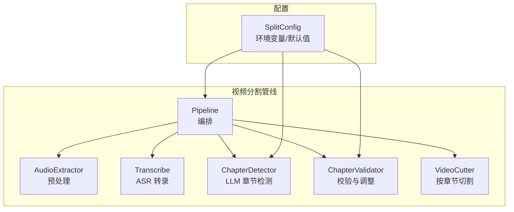
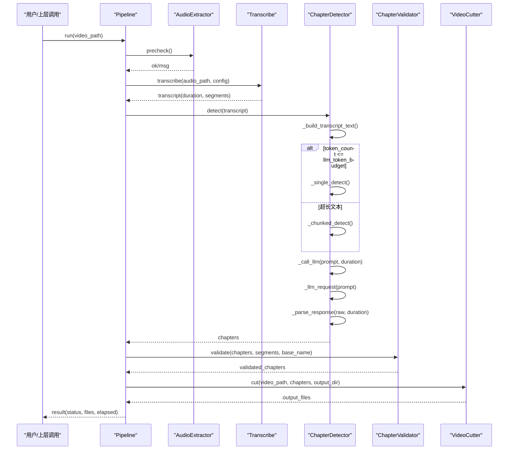
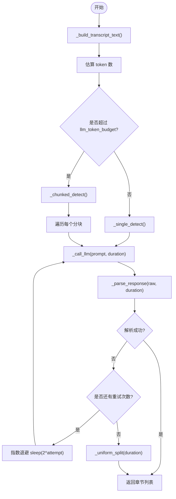
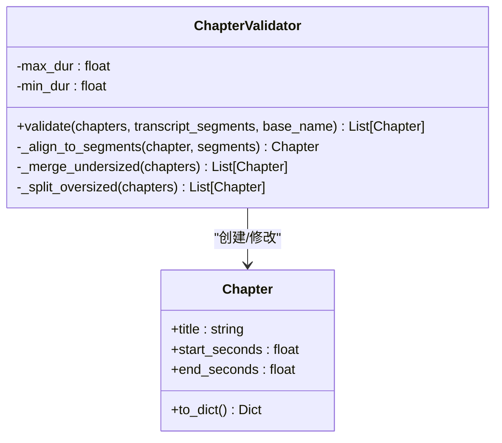
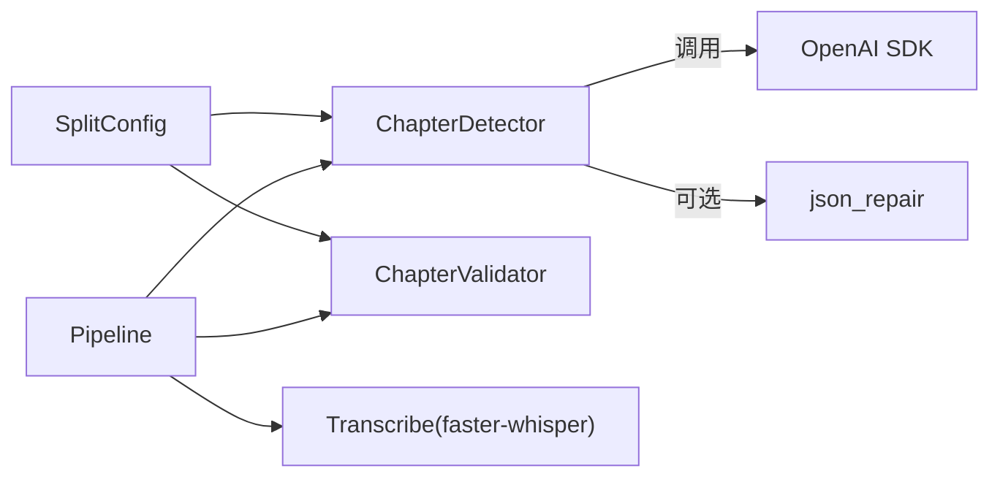

# 智能章节检测

<cite>
**本文引用的文件**   
- [chapter.py](file://video_splitter/analyzer/chapter.py)
- [validator.py](file://video_splitter/analyzer/validator.py)
- [config.py](file://video_splitter/config.py)
- [pipeline.py](file://video_splitter/pipeline.py)
- [transcribe.py](file://video_splitter/extractor/transcribe.py)
- [test_chapter.py](file://video_splitter/tests/test_chapter.py)
- [test_validator.py](file://video_splitter/tests/test_validator.py)
</cite>

## 目录
1. [简介](#简介)
2. [项目结构](#项目结构)
3. [核心组件](#核心组件)
4. [架构总览](#架构总览)
5. [详细组件分析](#详细组件分析)
6. [依赖关系分析](#依赖关系分析)
7. [性能与并发](#性能与并发)
8. [故障排查指南](#故障排查指南)
9. [结论](#结论)
10. [附录：配置与扩展指南](#附录配置与扩展指南)

## 简介
本技术文档聚焦于“智能章节检测系统”，围绕以下目标展开：
- 深入解析 ChapterDetector 的 LLM 集成架构，包括提示词工程、分块处理策略与重试机制。
- 详细说明 Chapter 数据模型的设计与字段含义（时间边界、标题生成等）。
- 解释 ChapterValidator 的验证算法（合理性检查、边界对齐、时长约束、命名规范）。
- 描述大语言模型的调用策略（token 预算控制、降级方案；并发处理在现有实现中的现状与建议）。
- 提供自定义提示词模板与验证规则的配置指南，并给出可扩展章节检测逻辑的实践路径。

## 项目结构
与智能章节检测相关的核心代码位于 video_splitter 包内：
- analyzer/chapter.py：LLM 驱动的语义章节检测器与基础数据模型。
- analyzer/validator.py：章节结果校验、边界对齐、时长合并/拆分与文件名生成。
- config.py：统一配置（含 LLM 参数、分段时长、命名模板等）。
- pipeline.py：端到端流水线编排（预处理→转录→章节→校验→切割）。
- extractor/transcribe.py：语音转文本与 SRT 导出、token 估算。
- tests/*：覆盖关键路径的单元测试。

图表来源
- [pipeline.py:21-30](file://video_splitter/pipeline.py#L21-L30)
- [config.py:19-37](file://video_splitter/config.py#L19-L37)

章节来源
- [pipeline.py:21-30](file://video_splitter/pipeline.py#L21-L30)
- [config.py:19-37](file://video_splitter/config.py#L19-L37)

## 核心组件
- Chapter：章节数据模型，包含标题与起止秒数，并提供序列化方法。
- ChapterDetector：基于 LLM 的语义章节检测器，支持单段与滑动窗口分块、JSON 修复、指数退避重试与均匀切分的兜底策略。
- ChapterValidator：对检测结果进行边界对齐、过短合并、过长拆分、命名规范化。
- SplitConfig：集中管理 LLM 与分段策略相关配置项。
- Pipeline：串联音频提取、转录、章节检测、校验与切割的完整流程。

章节来源
- [chapter.py:18-41](file://video_splitter/analyzer/chapter.py#L18-L41)
- [chapter.py:43-322](file://video_splitter/analyzer/chapter.py#L43-L322)
- [validator.py:10-152](file://video_splitter/analyzer/validator.py#L10-L152)
- [config.py:19-54](file://video_splitter/config.py#L19-L54)
- [pipeline.py:21-131](file://video_splitter/pipeline.py#L21-L131)

## 架构总览
下图展示了从输入视频到输出片段的整体流程，以及各模块间的交互关系。

图表来源
- [pipeline.py:31-111](file://video_splitter/pipeline.py#L31-L111)
- [chapter.py:77-322](file://video_splitter/analyzer/chapter.py#L77-L322)
- [validator.py:22-53](file://video_splitter/analyzer/validator.py#L22-L53)

## 详细组件分析

### Chapter 数据模型
- 字段
  - title：章节标题（字符串）
  - start_seconds：起始时间（秒，浮点）
  - end_seconds：结束时间（秒，浮点）
- 行为
  - to_dict：将内部秒级时间转换为 HH:MM:SS.sss/MM:SS.sss 格式，便于持久化与下游使用。
  - __repr__：调试友好的字符串表示。

设计要点
- 以秒为最小时间单位，避免多格式混用导致的精度问题。
- 对外暴露的时间戳格式由工具函数统一转换，保证一致性。

章节来源
- [chapter.py:18-41](file://video_splitter/analyzer/chapter.py#L18-L41)
- [chapter.py:325-343](file://video_splitter/analyzer/chapter.py#L325-L343)

### ChapterDetector：LLM 集成架构
- 提示词工程
  - PROMPT_TEMPLATE：面向中文培训视频的专家角色设定，明确任务、输出 JSON 结构与约束（序号、时间范围、相邻段落衔接、标题长度与字符限制等）。
  - system_prompt：在 _llm_request 中注入系统提示，强调只输出纯 JSON 数组，降低格式噪声。
- 分块处理策略
  - 当转录文本估计 token 数超过 llm_token_budget 时，采用滑动窗口分块：每块约 15 分钟，重叠 2 分钟，跨边界保留上下文片段，逐块检测后去重合并。
  - 去重策略：若两段重叠超过阈值且标题长度不同，优先保留更长标题的段落，减少重复。
- 重试与降级
  - _call_llm：指数退避重试（sleep(2^attempt)），失败则回退至均匀切分。
  - _parse_response：支持去除 markdown 围栏、可选 json_repair 修复、严格校验时间范围与顺序。
  - _uniform_split：兜底策略，按 max_segment_duration 均分视频。

图表来源
- [chapter.py:77-322](file://video_splitter/analyzer/chapter.py#L77-L322)

章节来源
- [chapter.py:43-322](file://video_splitter/analyzer/chapter.py#L43-L322)
- [chapter.py:51-72](file://video_splitter/analyzer/chapter.py#L51-L72)
- [chapter.py:195-241](file://video_splitter/analyzer/chapter.py#L195-L241)
- [chapter.py:243-301](file://video_splitter/analyzer/chapter.py#L243-L301)
- [chapter.py:303-322](file://video_splitter/analyzer/chapter.py#L303-L322)

### ChapterValidator：验证与优化算法
- 边界对齐
  - _align_to_segments：将章节结束时间对齐到最近的转录片段边界，提升与 ASR 输出的契合度。
- 时长约束
  - _merge_undersized：将小于 min_segment_duration 的片段与其相邻片段合并。
  - _split_oversized：将大于 max_segment_duration 的片段递归拆分为多个子段，并在标题追加 _partN 后缀。
- 命名规范
  - 自动添加两位数字序号前缀，清理非法字符，确保文件名安全。
- 文件名生成
  - generate_segment_filename：基于模板 {basename}_{seq:02d}_{title} 生成最终输出文件名，并再次清理非法字符。

图表来源
- [validator.py:10-152](file://video_splitter/analyzer/validator.py#L10-L152)
- [chapter.py:18-41](file://video_splitter/analyzer/chapter.py#L18-L41)

章节来源
- [validator.py:22-53](file://video_splitter/analyzer/validator.py#L22-L53)
- [validator.py:55-74](file://video_splitter/analyzer/validator.py#L55-L74)
- [validator.py:76-108](file://video_splitter/analyzer/validator.py#L76-L108)
- [validator.py:110-132](file://video_splitter/analyzer/validator.py#L110-L132)
- [validator.py:135-152](file://video_splitter/analyzer/validator.py#L135-L152)

### Pipeline：端到端编排
- 步骤
  - 预检：确认输入视频可用。
  - 转录：提取音频并执行 ASR，保存 .transcript.json 与 .zh.srt。
  - 章节检测：估算 token 数，选择单次或分块检测，保存 .chapters.json。
  - 校验：对齐边界、合并/拆分、命名规范化。
  - 切割：按章节生成输出片段。
- 可恢复性
  - resume 模式：若已存在转录或章节文件，直接复用，跳过对应步骤。
- 成本预估
  - dry_run：根据 token 估算与单价计算预估费用，并提示是否需要分块。

章节来源
- [pipeline.py:21-131](file://video_splitter/pipeline.py#L21-L131)
- [transcribe.py:11-59](file://video_splitter/extractor/transcribe.py#L11-L59)
- [transcribe.py:62-76](file://video_splitter/extractor/transcribe.py#L62-L76)
- [transcribe.py:79-105](file://video_splitter/extractor/transcribe.py#L79-L105)

## 依赖关系分析
- 模块耦合
  - Pipeline 依赖 AudioExtractor、Transcribe、ChapterDetector、ChapterValidator、VideoCutter。
  - ChapterDetector 依赖 SplitConfig 与外部 OpenAI 兼容 API（通过 openai 包）。
  - ChapterValidator 依赖 Chapter 模型与 SplitConfig。
- 外部依赖
  - OpenAI SDK：用于 LLM 请求。
  - json_repair（可选）：增强 JSON 容错。
  - faster-whisper：用于 ASR 转录。
- 潜在循环依赖
  - 当前结构无循环依赖，职责清晰。

图表来源
- [chapter.py:211-241](file://video_splitter/analyzer/chapter.py#L211-L241)
- [chapter.py:9-15](file://video_splitter/analyzer/chapter.py#L9-L15)
- [transcribe.py:27-41](file://video_splitter/extractor/transcribe.py#L27-L41)
- [config.py:19-37](file://video_splitter/config.py#L19-L37)

章节来源
- [chapter.py:9-15](file://video_splitter/analyzer/chapter.py#L9-L15)
- [chapter.py:211-241](file://video_splitter/analyzer/chapter.py#L211-L241)
- [transcribe.py:27-41](file://video_splitter/extractor/transcribe.py#L27-L41)
- [config.py:19-37](file://video_splitter/config.py#L19-L37)

## 性能与并发
- Token 预算控制
  - estimate_tokens 使用保守估算（约 1.5 字符=1 token），结合 llm_token_budget 决定单次或分块检测。
- 重试与延迟
  - 指数退避重试，避免瞬时抖动导致失败。
- 并发处理现状与建议
  - 当前实现未显式并发调用 LLM；分块检测串行处理各块。
  - 建议：在 _chunked_detect 中对各分块并行调用 LLM（需考虑速率限制与错误聚合），以提升吞吐。
- 资源与稳定性
  - 启用 json_repair 可降低 LLM 输出格式异常的影响。
  - 兜底均匀切分保障可用性。

章节来源
- [transcribe.py:62-76](file://video_splitter/extractor/transcribe.py#L62-L76)
- [chapter.py:195-209](file://video_splitter/analyzer/chapter.py#L195-L209)
- [chapter.py:116-193](file://video_splitter/analyzer/chapter.py#L116-L193)

## 故障排查指南
- LLM 不可用或未安装 openai
  - 现象：抛出运行时错误，提示需要 openai 包。
  - 处理：安装依赖或配置正确的 API Key/Base URL。
- JSON 解析失败
  - 现象：非数组、时间越界、start>=end 等 ValueError。
  - 处理：检查 LLM 输出是否符合模板；启用 json_repair；必要时调整提示词。
- 超时或网络抖动
  - 现象：多次重试仍失败。
  - 处理：增大 llm_max_retries；检查网络；确认服务状态。
- 章节不合理
  - 现象：过短/过长、边界不贴合 ASR 片段。
  - 处理：调整 min/max 分段时长；检查对齐逻辑；查看 validator 日志。
- 文件名非法字符
  - 现象：生成文件名包含非法字符。
  - 处理：确保模板与标题清洗逻辑生效；参考测试用例。

章节来源
- [chapter.py:211-241](file://video_splitter/analyzer/chapter.py#L211-L241)
- [chapter.py:243-301](file://video_splitter/analyzer/chapter.py#L243-L301)
- [validator.py:135-152](file://video_splitter/analyzer/validator.py#L135-L152)
- [test_chapter.py:305-310](file://video_splitter/tests/test_chapter.py#L305-L310)
- [test_validator.py:104-126](file://video_splitter/tests/test_validator.py#L104-L126)

## 结论
本章检测系统以 LLM 为核心，结合稳健的分块、重试与降级策略，能够在复杂场景下稳定产出高质量章节。配合严格的校验与命名规范，可直接驱动后续的视频切割流程。建议在后续迭代中引入并发调用与更细粒度的监控指标，进一步提升吞吐与可观测性。

## 附录：配置与扩展指南

### 配置项说明（节选）
- 分段时长
  - max_segment_duration：最大分段时长（分钟）
  - min_segment_duration：最小区间时长（分钟）
- LLM 相关
  - llm_api_base：API 基地址
  - llm_api_key：API 密钥
  - llm_model：模型名称
  - llm_token_budget：单次请求 token 预算
  - llm_max_retries：最大重试次数
- 其他
  - naming_template：输出文件名模板
  - resume：是否启用断点续跑
  - transcription_engine：ASR 引擎名（如 funasr）
  - engine_config：引擎特定参数

章节来源
- [config.py:19-54](file://video_splitter/config.py#L19-L54)

### 自定义提示词模板
- 位置：ChapterDetector.PROMPT_TEMPLATE
- 建议
  - 保持 JSON 结构不变，仅调整任务描述、约束与示例。
  - 针对领域内容（如技术讲座、产品演示）细化“话题划分”标准。
  - 严格控制标题长度与字符集，减少解析歧义。

章节来源
- [chapter.py:51-72](file://video_splitter/analyzer/chapter.py#L51-L72)

### 自定义验证规则
- 位置：ChapterValidator.validate 及其内部方法
- 建议
  - 新增阶段：例如“语义连贯性评分”、“主题一致性检查”。
  - 调整合并/拆分阈值：依据业务需求动态设置 min/max 时长。
  - 扩展命名策略：增加分类标签或元数据前缀。

章节来源
- [validator.py:22-53](file://video_splitter/analyzer/validator.py#L22-L53)
- [validator.py:76-132](file://video_splitter/analyzer/validator.py#L76-L132)

### 扩展章节检测逻辑（实践路径）
- 替换 LLM 客户端
  - 在 _llm_request 中封装不同的 OpenAI 兼容客户端或本地推理后端。
- 增强分块策略
  - 基于内容相似度或停顿检测动态确定分块边界，而非固定时长。
- 增加并发
  - 在 _chunked_detect 中使用线程池或异步任务并行调用 LLM，并聚合结果与错误。
- 强化解析与校验
  - 引入结构化输出（如 Pydantic）与更严格的 schema 校验。
  - 增加“相邻段落间隙/重叠”二次修正。

章节来源
- [chapter.py:195-241](file://video_splitter/analyzer/chapter.py#L195-L241)
- [chapter.py:116-193](file://video_splitter/analyzer/chapter.py#L116-L193)

### 实际代码示例（路径引用）
- 构建 Transcript 并触发检测
  - 参考：[pipeline.py:73-87](file://video_splitter/pipeline.py#L73-L87)
- 自定义命名模板
  - 参考：[validator.py:135-152](file://video_splitter/analyzer/validator.py#L135-L152)
- 环境覆盖配置
  - 参考：[config.py:39-54](file://video_splitter/config.py#L39-L54)
