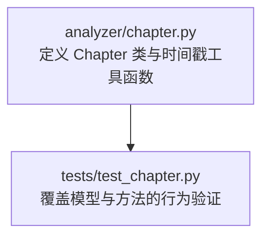
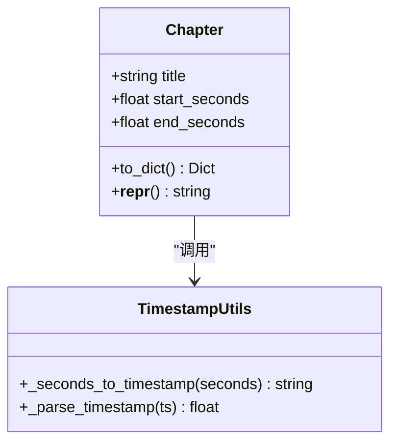
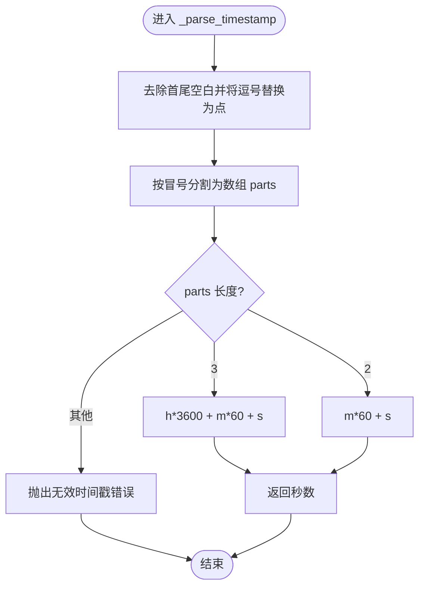
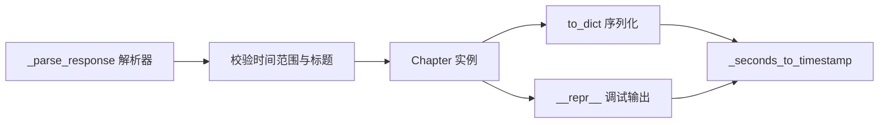

# 章节数据模型

<cite>
**本文引用的文件**
- [video_splitter/analyzer/chapter.py](file://video_splitter/analyzer/chapter.py)
- [video_splitter/tests/test_chapter.py](file://video_splitter/tests/test_chapter.py)
</cite>

## 目录
1. [简介](#简介)
2. [项目结构](#项目结构)
3. [核心组件](#核心组件)
4. [架构总览](#架构总览)
5. [详细组件分析](#详细组件分析)
6. [依赖关系分析](#依赖关系分析)
7. [性能考量](#性能考量)
8. [故障排查指南](#故障排查指南)
9. [结论](#结论)
10. [附录：使用示例与最佳实践](#附录使用示例与最佳实践)

## 简介
本技术文档聚焦于 Chapter 数据模型，系统阐述其设计目标、字段语义、约束条件、序列化与调试输出格式，并深入解析时间戳处理函数 _seconds_to_timestamp 与 _parse_timestamp 的实现原理与应用场景。同时提供基于测试用例的使用示例路径，帮助开发者快速上手与排障。

## 项目结构
Chapter 数据模型位于 analyzer 模块中，配套单元测试位于 tests 目录。该模型用于表示视频“章节”的标题与起止时间边界，并提供序列化和调试输出能力。

图表来源
- [video_splitter/analyzer/chapter.py:18-40](file://video_splitter/analyzer/chapter.py#L18-L40)
- [video_splitter/tests/test_chapter.py:85-107](file://video_splitter/tests/test_chapter.py#L85-L107)

章节来源
- [video_splitter/analyzer/chapter.py:18-40](file://video_splitter/analyzer/chapter.py#L18-L40)
- [video_splitter/tests/test_chapter.py:85-107](file://video_splitter/tests/test_chapter.py#L85-L107)

## 核心组件
- Chapter 类：承载单个章节的标题与起止秒数，并提供 to_dict 序列化与 __repr__ 调试输出。
- 时间戳工具函数：_seconds_to_timestamp（秒转 HH:MM:SS.sss/MM:SS.sss）、_parse_timestamp（字符串解析为秒）。

章节来源
- [video_splitter/analyzer/chapter.py:18-40](file://video_splitter/analyzer/chapter.py#L18-L40)
- [video_splitter/analyzer/chapter.py:325-342](file://video_splitter/analyzer/chapter.py#L325-L342)

## 架构总览
下图展示 Chapter 与其相关方法/函数的关系，以及时间戳转换在序列化与调试输出中的使用位置。

图表来源
- [video_splitter/analyzer/chapter.py:18-40](file://video_splitter/analyzer/chapter.py#L18-L40)
- [video_splitter/analyzer/chapter.py:325-342](file://video_splitter/analyzer/chapter.py#L325-L342)

## 详细组件分析

### Chapter 类设计与字段含义
- title：章节标题，字符串类型。由上层逻辑生成或清洗后赋值。
- start_seconds：起始时间（秒），浮点数类型。
- end_seconds：结束时间（秒），浮点数类型。

约束与约定（来自解析与校验流程）：
- 时间范围合法性：start_seconds < end_seconds。
- 时间边界范围：start_seconds >= 0；end_seconds <= 视频总时长 + 容差（解析阶段对超出范围的输入会抛出异常）。
- 标题特殊字符清理：解析阶段会移除非法字符，保证标题安全。

章节来源
- [video_splitter/analyzer/chapter.py:18-40](file://video_splitter/analyzer/chapter.py#L18-L40)
- [video_splitter/analyzer/chapter.py:274-301](file://video_splitter/analyzer/chapter.py#L274-L301)

### to_dict 序列化逻辑
- 输出键值：
  - title：原始标题字符串。
  - start：将 start_seconds 通过 _seconds_to_timestamp 转换为时间字符串。
  - end：将 end_seconds 通过 _seconds_to_timestamp 转换为时间字符串。
  - start_seconds：原始秒数。
  - end_seconds：原始秒数。
- 时间字符串格式：
  - 当小时部分大于 0 时，采用 HH:MM:SS.sss。
  - 否则采用 MM:SS.sss。
  - 毫秒精度保留三位小数。

章节来源
- [video_splitter/analyzer/chapter.py:26-33](file://video_splitter/analyzer/chapter.py#L26-L33)
- [video_splitter/analyzer/chapter.py:325-332](file://video_splitter/analyzer/chapter.py#L325-L332)

### __repr__ 调试输出格式
- 返回形如：Chapter(title=..., start=..., end=...)。
- start 与 end 同样使用 _seconds_to_timestamp 格式化，便于日志中直观查看时间边界。
- 适合在开发调试、日志记录与问题排查中使用。

章节来源
- [video_splitter/analyzer/chapter.py:35-40](file://video_splitter/analyzer/chapter.py#L35-L40)

### 时间戳处理函数实现原理与使用场景
- _seconds_to_timestamp(seconds: float) -> str
  - 计算小时、分钟、秒，并按是否超过一小时选择 HH:MM:SS.sss 或 MM:SS.sss 格式。
  - 使用场景：to_dict 序列化、构建提示词、统一时间显示等。
- _parse_timestamp(ts: str) -> float
  - 支持 HH:MM:SS 与 MM:SS 两种格式，兼容逗号作为小数分隔符（替换为点）。
  - 若格式不合法，抛出 ValueError。
  - 使用场景：解析 LLM 返回的时间字符串、从转录片段提取时间戳等。

图表来源
- [video_splitter/analyzer/chapter.py:335-342](file://video_splitter/analyzer/chapter.py#L335-L342)

章节来源
- [video_splitter/analyzer/chapter.py:325-342](file://video_splitter/analyzer/chapter.py#L325-L342)

## 依赖关系分析
- Chapter 仅依赖两个纯函数进行时间戳转换，无外部状态，耦合度低、内聚度高。
- 上层解析器在构造 Chapter 实例前会对时间范围与标题进行校验与清洗，确保模型处于有效状态。

图表来源
- [video_splitter/analyzer/chapter.py:243-301](file://video_splitter/analyzer/chapter.py#L243-L301)
- [video_splitter/analyzer/chapter.py:26-40](file://video_splitter/analyzer/chapter.py#L26-L40)
- [video_splitter/analyzer/chapter.py:325-342](file://video_splitter/analyzer/chapter.py#L325-L342)

章节来源
- [video_splitter/analyzer/chapter.py:243-301](file://video_splitter/analyzer/chapter.py#L243-L301)
- [video_splitter/analyzer/chapter.py:26-40](file://video_splitter/analyzer/chapter.py#L26-L40)
- [video_splitter/analyzer/chapter.py:325-342](file://video_splitter/analyzer/chapter.py#L325-L342)

## 性能考量
- Chapter 对象轻量，序列化与 repr 均为 O(1) 操作。
- 时间戳转换涉及少量算术与字符串格式化，开销极低。
- 建议在批量处理大量章节时复用格式化结果，避免重复转换。

## 故障排查指南
- 时间戳解析失败：检查传入字符串是否为 HH:MM:SS 或 MM:SS，且不含非法字符；注意逗号小数分隔符会被自动替换为点。
- 时间范围越界：确保 start_seconds >= 0 且 end_seconds 不超过视频总时长（含容差）；否则解析阶段会抛出异常。
- 标题包含非法字符：解析阶段会自动清理，但若需自定义规则，可在上层预处理。
- 序列化输出不符合预期：确认 to_dict 输出的时间字符串是否符合 HH:MM:SS.sss 或 MM:SS.sss 格式。

章节来源
- [video_splitter/analyzer/chapter.py:274-301](file://video_splitter/analyzer/chapter.py#L274-L301)
- [video_splitter/analyzer/chapter.py:335-342](file://video_splitter/analyzer/chapter.py#L335-L342)

## 结论
Chapter 数据模型以最小必要接口提供章节数据的结构化表达，配合严格的时间戳解析与校验，保证了数据的一致性与可追溯性。to_dict 与 __repr__ 分别服务于持久化与调试场景，时间戳工具函数则贯穿整个解析与输出链路。

## 附录：使用示例与最佳实践
以下为基于测试用例的实操示例路径，涵盖创建章节对象、序列化与反序列化、时间戳解析与格式化等常见用法。请根据路径定位到对应断言与构造逻辑，参考其参数与返回值。

- 创建章节对象
  - 参考路径：[video_splitter/tests/test_chapter.py:86-93](file://video_splitter/tests/test_chapter.py#L86-L93)
- 序列化 to_dict（含小时与毫秒精度）
  - 参考路径：[video_splitter/tests/test_chapter.py:86-99](file://video_splitter/tests/test_chapter.py#L86-L99)
- 调试输出 __repr__
  - 参考路径：[video_splitter/tests/test_chapter.py:101-106](file://video_splitter/tests/test_chapter.py#L101-L106)
- 时间戳解析 _parse_timestamp（MM:SS、HH:MM:SS、逗号小数）
  - 参考路径：[video_splitter/tests/test_chapter.py:30-42](file://video_splitter/tests/test_chapter.py#L30-L42)
- 时间戳格式化 _seconds_to_timestamp（零秒、毫秒精度）
  - 参考路径：[video_splitter/tests/test_chapter.py:44-52](file://video_splitter/tests/test_chapter.py#L44-L52)
- 反序列化与校验（JSON 列表、缺失字段默认值、非法字符清理、范围校验）
  - 参考路径：[video_splitter/tests/test_chapter.py:218-273](file://video_splitter/tests/test_chapter.py#L218-L273)

章节来源
- [video_splitter/tests/test_chapter.py:30-52](file://video_splitter/tests/test_chapter.py#L30-L52)
- [video_splitter/tests/test_chapter.py:86-106](file://video_splitter/tests/test_chapter.py#L86-L106)
- [video_splitter/tests/test_chapter.py:218-273](file://video_splitter/tests/test_chapter.py#L218-L273)
