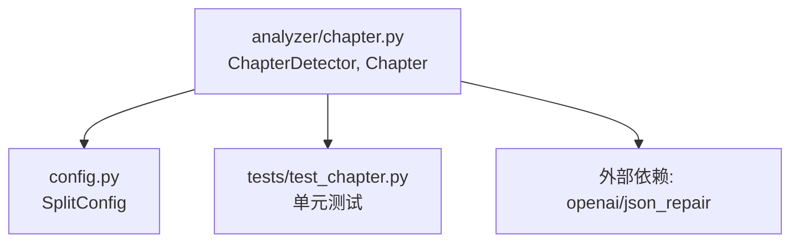
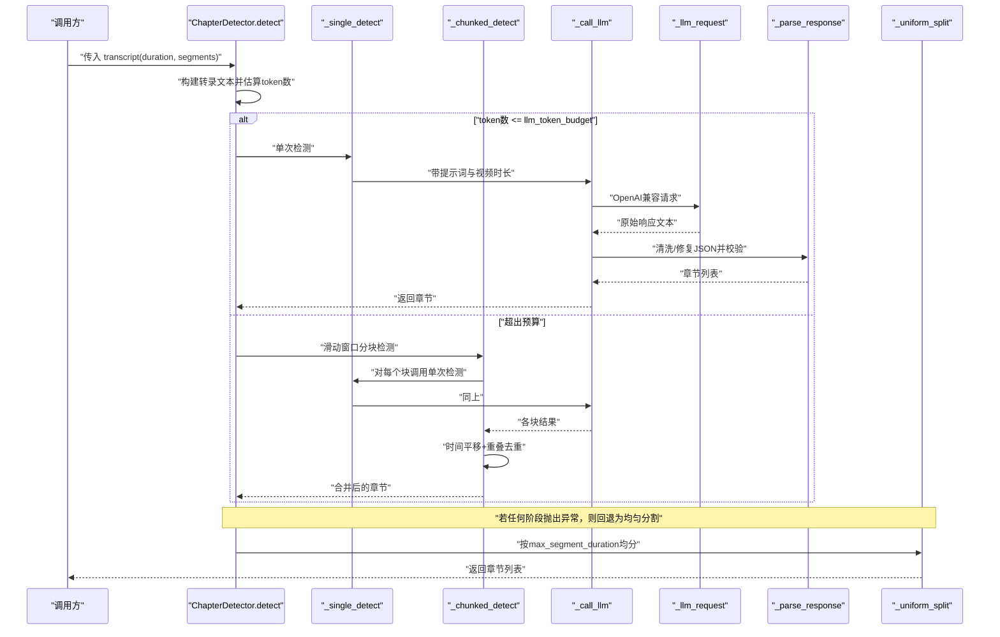
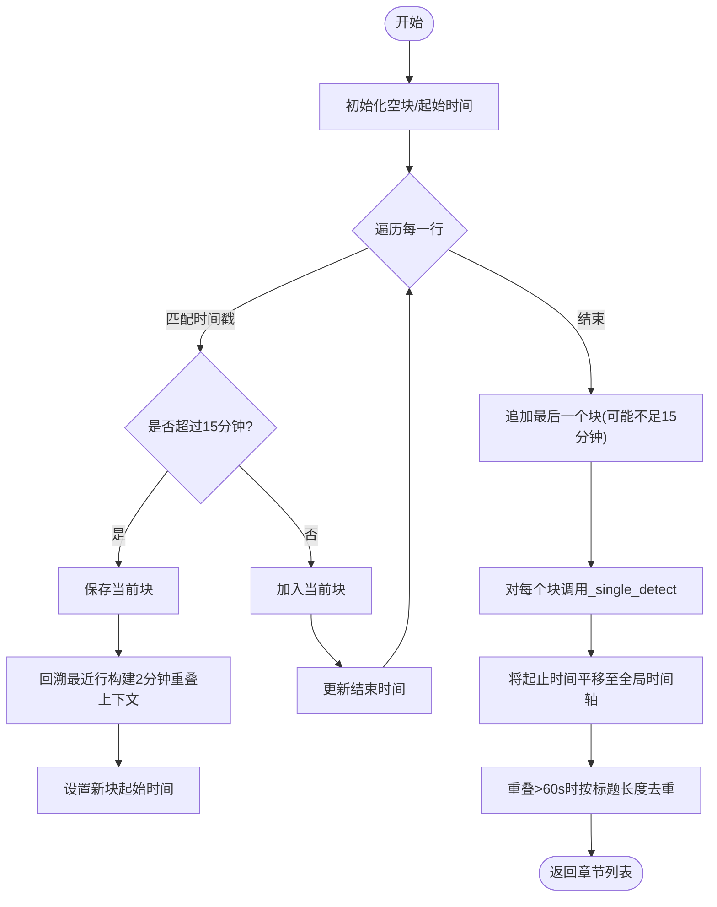
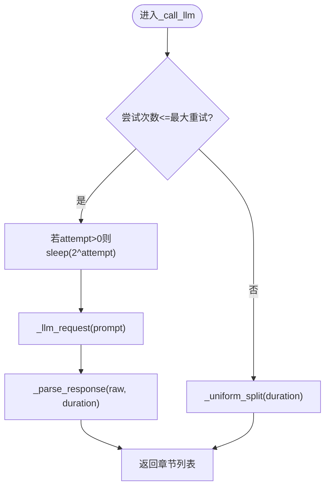
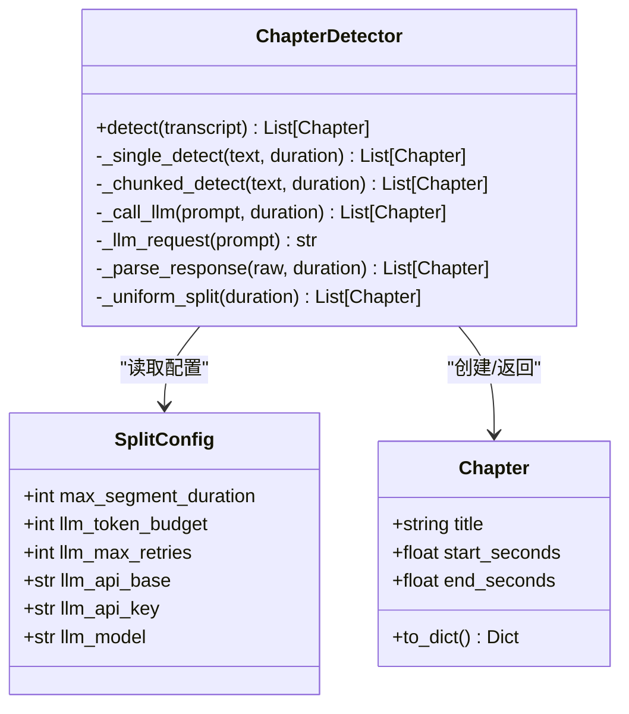

# 章节检测器

<cite>
**本文引用的文件**
- [chapter.py](file://video_splitter/analyzer/chapter.py)
- [config.py](file://video_splitter/config.py)
- [test_chapter.py](file://video_splitter/tests/test_chapter.py)
</cite>

## 目录
1. [简介](#简介)
2. [项目结构](#项目结构)
3. [核心组件](#核心组件)
4. [架构总览](#架构总览)
5. [详细组件分析](#详细组件分析)
6. [依赖关系分析](#依赖关系分析)
7. [性能考量](#性能考量)
8. [故障排查指南](#故障排查指南)
9. [结论](#结论)
10. [附录：自定义提示词与扩展指南](#附录自定义提示词与扩展指南)

## 简介
本技术文档围绕 ChapterDetector 类，系统化阐述其基于大语言模型（LLM）的语义章节检测能力。重点覆盖以下方面：
- 提示词模板设计与输入构造
- 分块处理策略（滑动窗口、重叠上下文）
- 重试机制与降级策略（指数退避、均匀分割回退）
- _single_detect 与 _chunked_detect 的实现逻辑（token预算控制、时间对齐、去重）
- _call_llm 的错误处理流程
- 如何自定义提示词模板并优化 LLM 调用性能

## 项目结构
ChapterDetector 位于 analyzer 模块中，负责将转录文本切分为语义章节；配置由 SplitConfig 提供；测试用例覆盖关键路径与边界情况。

图表来源
- [chapter.py:43-343](file://video_splitter/analyzer/chapter.py#L43-L343)
- [config.py:19-37](file://video_splitter/config.py#L19-L37)
- [test_chapter.py:1-348](file://video_splitter/tests/test_chapter.py#L1-L348)

章节来源
- [chapter.py:1-343](file://video_splitter/analyzer/chapter.py#L1-L343)
- [config.py:1-54](file://video_splitter/config.py#L1-L54)
- [test_chapter.py:1-348](file://video_splitter/tests/test_chapter.py#L1-L348)

## 核心组件
- Chapter：表示一个章节片段，包含标题与起止秒数，并提供序列化方法。
- ChapterDetector：核心检测器，封装从转录到章节输出的完整流程，包括单段/分块检测、LLM 调用、解析与容错。
- SplitConfig：集中管理 LLM 与分段相关参数，如 token 预算、最大重试次数、最大分段时长等。

章节来源
- [chapter.py:18-41](file://video_splitter/analyzer/chapter.py#L18-L41)
- [chapter.py:43-343](file://video_splitter/analyzer/chapter.py#L43-L343)
- [config.py:19-37](file://video_splitter/config.py#L19-L37)

## 架构总览
下图展示了从 detect 入口到最终章节列表的关键调用链与分支：

图表来源
- [chapter.py:77-95](file://video_splitter/analyzer/chapter.py#L77-L95)
- [chapter.py:105-114](file://video_splitter/analyzer/chapter.py#L105-L114)
- [chapter.py:116-193](file://video_splitter/analyzer/chapter.py#L116-L193)
- [chapter.py:195-209](file://video_splitter/analyzer/chapter.py#L195-L209)
- [chapter.py:211-241](file://video_splitter/analyzer/chapter.py#L211-L241)
- [chapter.py:243-301](file://video_splitter/analyzer/chapter.py#L243-L301)
- [chapter.py:303-322](file://video_splitter/analyzer/chapter.py#L303-L322)

## 详细组件分析

### 提示词模板与输入构造
- PROMPT_TEMPLATE：中文指令式模板，要求输出纯 JSON 数组，字段包含 title、start、end，并对序号、长度范围、相邻段落衔接等给出约束。
- _build_transcript_text：将 segments 转换为带时间戳的行文本，便于 LLM 定位话题边界。
- _single_detect：根据 duration 生成时间戳占位，填充模板后交由 _call_llm。

章节来源
- [chapter.py:51-72](file://video_splitter/analyzer/chapter.py#L51-L72)
- [chapter.py:97-103](file://video_splitter/analyzer/chapter.py#L97-L103)
- [chapter.py:105-114](file://video_splitter/analyzer/chapter.py#L105-L114)

### 分块处理策略（_chunked_detect）
- 目标：当转录过长时，使用滑动窗口将文本切分为约 15 分钟块，并保留 2 分钟重叠以维持跨边界上下文。
- 实现要点：
  - 逐行扫描，遇到时间戳时判断是否超过 chunk_duration（15*60 秒）。
  - 触发新块时，回溯最近若干行，提取时间戳落在 overlap_start 之后的行作为重叠上下文。
  - 每块调用 _single_detect，并将返回的起止时间统一加上当前块的起始偏移。
  - 合并后进行重叠去重：若与前一段重叠超过 60 秒，保留标题更长的一段；否则追加。
- 复杂度：线性扫描 O(N)，去重过程近似 O(M)（M 为合并后的候选章节数）。

图表来源
- [chapter.py:116-193](file://video_splitter/analyzer/chapter.py#L116-L193)

章节来源
- [chapter.py:116-193](file://video_splitter/analyzer/chapter.py#L116-L193)

### 单次检测（_single_detect）
- 作用：在 token 预算内一次性向 LLM 发起请求，得到整段视频的章节划分。
- 流程：组装提示词 → 调用 _call_llm → 解析响应 → 返回章节列表。

章节来源
- [chapter.py:105-114](file://video_splitter/analyzer/chapter.py#L105-L114)

### LLM 调用与错误处理（_call_llm）
- 重试策略：最多尝试 llm_max_retries + 1 次；首次失败后每次等待 2^attempt 秒（指数退避）。
- 降级策略：所有重试均失败时，回退为均匀分割（_uniform_split），保证系统可用性。
- 实际请求：通过 OpenAI 兼容接口发送 system/user 消息，temperature 较低以提升稳定性。

图表来源
- [chapter.py:195-209](file://video_splitter/analyzer/chapter.py#L195-L209)
- [chapter.py:303-322](file://video_splitter/analyzer/chapter.py#L303-L322)

章节来源
- [chapter.py:195-209](file://video_splitter/analyzer/chapter.py#L195-L209)
- [chapter.py:303-322](file://video_splitter/analyzer/chapter.py#L303-L322)

### 响应解析与校验（_parse_response）
- 预处理：去除可能的 markdown 代码块包裹（支持 json 标签）。
- 修复：可选使用 json_repair 进行不合法 JSON 的修复。
- 校验：
  - 必须为数组类型
  - 时间戳必须在合理范围内（不超过视频总时长一定余量）
  - start < end
- 默认值：缺失 title 或 start 时使用默认规则生成。

章节来源
- [chapter.py:243-301](file://video_splitter/analyzer/chapter.py#L243-L301)

### 均匀分割回退（_uniform_split）
- 依据 max_segment_duration（分钟）计算分段数量与每段实际时长，生成等长章节。
- 用于 LLM 不可用或解析失败的兜底方案。

章节来源
- [chapter.py:303-322](file://video_splitter/config.py#L19-L37)

### 数据模型（Chapter）
- 字段：title、start_seconds、end_seconds
- 方法：to_dict 输出标准字典，__repr__ 便于调试显示

章节来源
- [chapter.py:18-41](file://video_splitter/analyzer/chapter.py#L18-L41)

## 依赖关系分析
- 内部依赖：
  - SplitConfig：提供 llm_token_budget、llm_max_retries、max_segment_duration 等关键参数。
- 外部依赖：
  - openai：用于发起聊天补全请求（未安装时会抛出运行时错误）。
  - json_repair：可选依赖，用于修复非严格 JSON 的响应。

图表来源
- [chapter.py:43-343](file://video_splitter/analyzer/chapter.py#L43-L343)
- [config.py:19-37](file://video_splitter/config.py#L19-L37)

章节来源
- [chapter.py:43-343](file://video_splitter/analyzer/chapter.py#L43-L343)
- [config.py:19-37](file://video_splitter/config.py#L19-L37)

## 性能考量
- Token 预算控制：
  - 估算方式：按字符数除以 1.5 粗略估计 token 数，与 llm_token_budget 比较决定单段或分块。
  - 建议：对于超长转录，适当降低 llm_token_budget 以更早触发分块，减少单次请求压力。
- 分块大小与重叠：
  - 默认块时长 15 分钟，重叠 2 分钟，兼顾上下文连贯性与成本。
  - 可根据业务场景调整块大小与重叠比例，平衡精度与开销。
- 重试与退避：
  - 指数退避可有效缓解瞬时拥塞，但会增加端到端延迟。
  - 建议结合监控指标动态调整 llm_max_retries。
- 解析鲁棒性：
  - 启用 json_repair 可提升对不稳定模型的容错率，但会引入额外 CPU 开销。
  - 建议在资源受限环境下评估是否启用。

[本节为通用指导，无需具体文件引用]

## 故障排查指南
- LLM 不可用或未安装 openai：
  - 现象：_llm_request 抛出运行时错误，随后触发均匀分割回退。
  - 排查：确认 openai 已安装且网络可达；检查 API Key 与 Base URL。
- 响应格式异常：
  - 现象：_parse_response 抛出 ValueError（非数组、时间越界、start>=end）。
  - 排查：检查 PROMPT_TEMPLATE 约束是否被遵守；必要时开启 json_repair 修复。
- 长时间无响应或超时：
  - 现象：多次重试后仍失败，最终回退均匀分割。
  - 排查：观察日志中的 sleep 间隔与重试次数；适当调低 llm_max_retries 或增大超时阈值（取决于上层封装）。
- 分块结果重复或重叠过多：
  - 现象：去重后章节数量仍偏多。
  - 排查：调整 _chunked_detect 的重叠阈值与去重判定条件；验证块时长与重叠设置是否符合预期。

章节来源
- [chapter.py:211-241](file://video_splitter/analyzer/chapter.py#L211-L241)
- [chapter.py:243-301](file://video_splitter/analyzer/chapter.py#L243-L301)
- [chapter.py:195-209](file://video_splitter/analyzer/chapter.py#L195-L209)
- [chapter.py:303-322](file://video_splitter/analyzer/chapter.py#L303-L322)

## 结论
ChapterDetector 通过“预算感知 + 滑动窗口 + 指数退避 + 均匀分割回退”的组合策略，在保证可用性的同时尽可能利用 LLM 的语义理解能力产出高质量章节。其模块化设计便于替换提示词模板、调整分块策略与重试参数，从而适配不同模型与服务的质量与成本特性。

[本节为总结性内容，无需具体文件引用]

## 附录：自定义提示词与扩展指南

### 自定义提示词模板
- 修改位置：PROMPT_TEMPLATE 常量。
- 建议：
  - 明确输出格式与字段约束，避免多余解释文本。
  - 针对领域术语与命名规范增加示例，提高一致性。
  - 限制标题长度与字符集，降低后续清洗成本。
- 参考路径：
  - [chapter.py:51-72](file://video_splitter/analyzer/chapter.py#L51-L72)

### 调整分块与重叠策略
- 修改点：
  - chunk_duration、overlap 变量（单位秒）。
  - 去重阈值（当前为 60 秒）与选择策略（标题长度）。
- 参考路径：
  - [chapter.py:116-193](file://video_splitter/analyzer/chapter.py#L116-L193)

### 优化 LLM 调用性能
- 参数建议：
  - llm_token_budget：根据模型上下文窗口与成本权衡设置。
  - llm_max_retries：在网络不稳或服务限流时适度提高。
  - temperature/max_tokens：在 _llm_request 中调整，确保稳定与可控输出。
- 参考路径：
  - [config.py:26-30](file://video_splitter/config.py#L26-L30)
  - [chapter.py:211-241](file://video_splitter/analyzer/chapter.py#L211-L241)

### 扩展检测逻辑
- 新增后处理：
  - 可在 _chunked_detect 的去重阶段插入领域特定的合并/拆分规则。
  - 可在 _parse_response 中增加更严格的字段校验或默认值策略。
- 参考路径：
  - [chapter.py:179-193](file://video_splitter/analyzer/chapter.py#L179-L193)
  - [chapter.py:243-301](file://video_splitter/analyzer/chapter.py#L243-L301)

### 测试与验证
- 使用现有测试套件快速验证改动：
  - 单段路径、分块路径、解析边界、重试与回退等。
- 参考路径：
  - [test_chapter.py:109-213](file://video_splitter/tests/test_chapter.py#L109-L213)
  - [test_chapter.py:276-310](file://video_splitter/tests/test_chapter.py#L276-L310)