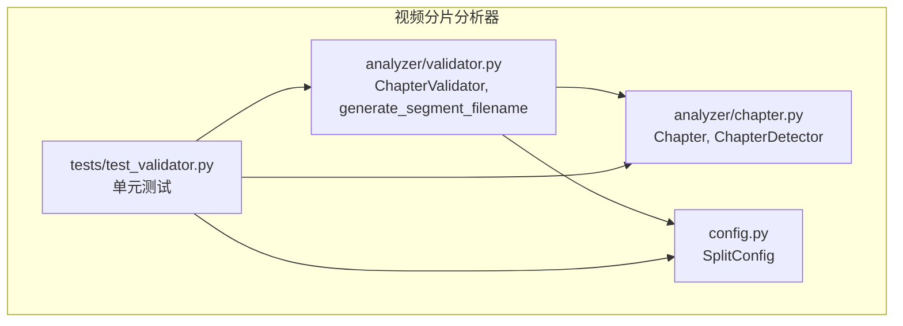
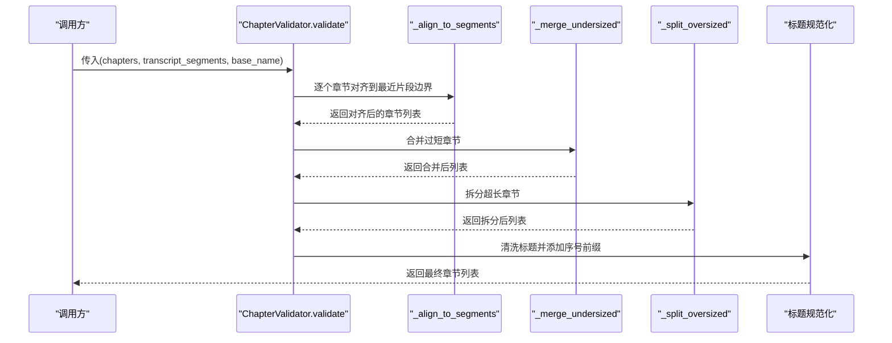
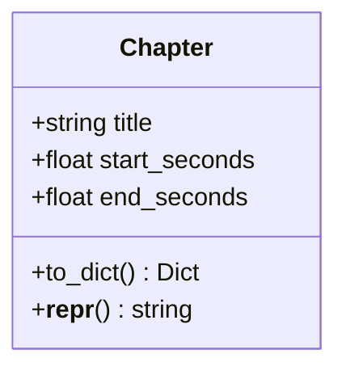
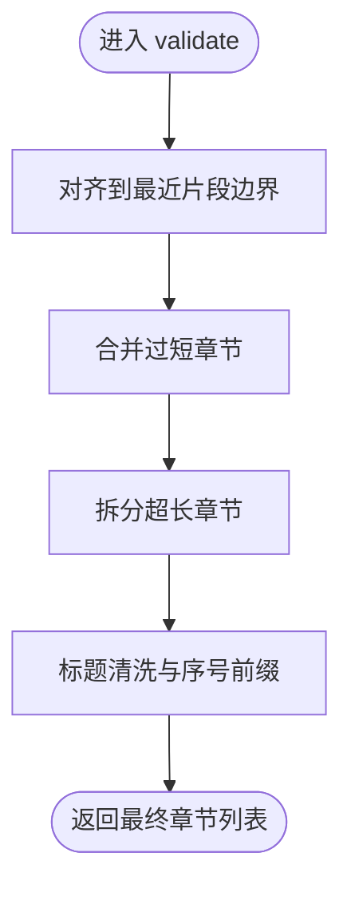
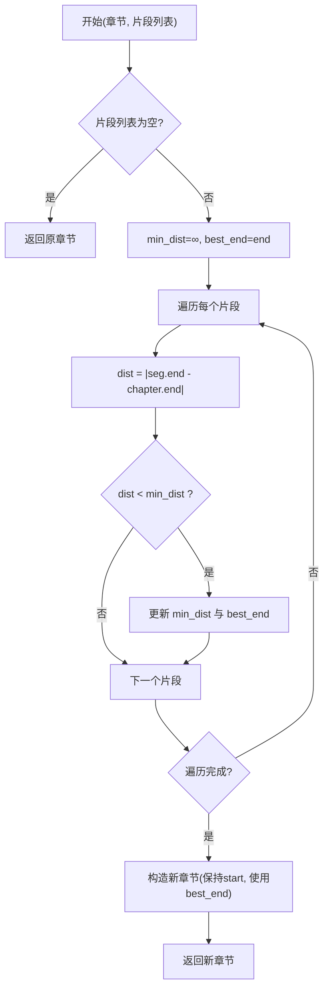
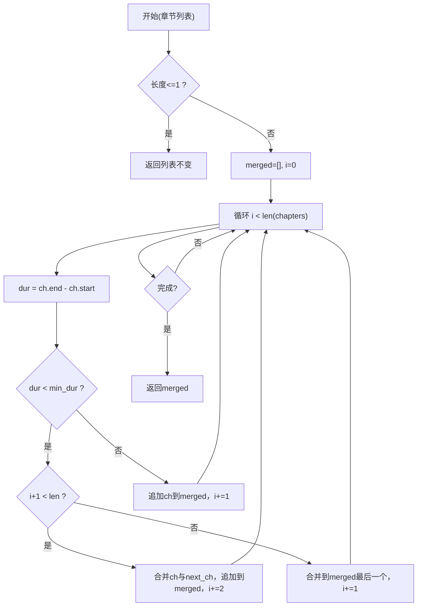
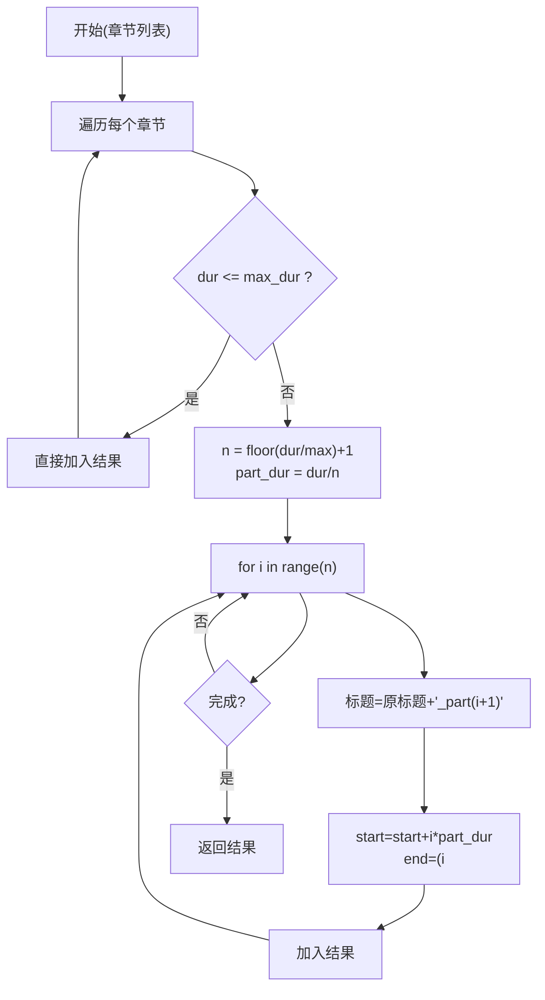
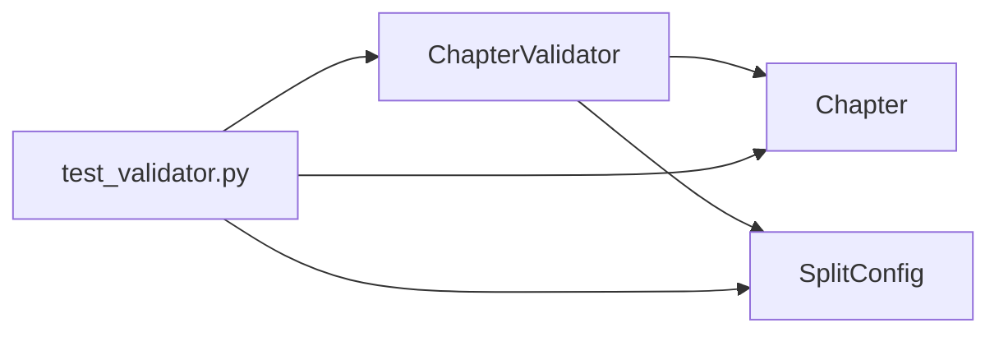

# 章节验证器

<cite>
**本文引用的文件**
- [validator.py](file://video_splitter/analyzer/validator.py)
- [chapter.py](file://video_splitter/analyzer/chapter.py)
- [config.py](file://video_splitter/config.py)
- [test_validator.py](file://video_splitter/tests/test_validator.py)
</cite>

## 目录
1. [简介](#简介)
2. [项目结构](#项目结构)
3. [核心组件](#核心组件)
4. [架构总览](#架构总览)
5. [详细组件分析](#详细组件分析)
6. [依赖关系分析](#依赖关系分析)
7. [性能考量](#性能考量)
8. [故障排查指南](#故障排查指南)
9. [结论](#结论)
10. [附录：自定义验证规则扩展指南](#附录自定义验证规则扩展指南)

## 简介
本章文档聚焦于 ChapterValidator 类，系统性阐述其“章节合理性检查”算法与实现细节。内容涵盖：
- 时间边界对齐、重叠检测与连续性检查
- 时长范围校验（最小/最大分段时长）
- 标题格式清洗与序号前缀规范化
- 边界优化策略（相邻章节无缝衔接、时间调整）
- 可扩展的自定义验证规则配置与异常处理建议

该验证器在 LLM 语义分章或均匀切分的上游结果基础上，进行二次校验与修正，确保输出章节满足业务约束并具备可分割性。

## 项目结构
与 ChapterValidator 直接相关的代码位于 analyzer 子包中，并与 chapter 模块共享 Chapter 数据模型；配置由 SplitConfig 提供；测试用例覆盖关键路径与边界条件。

图表来源
- [validator.py:1-152](file://video_splitter/analyzer/validator.py#L1-L152)
- [chapter.py:18-343](file://video_splitter/analyzer/chapter.py#L18-L343)
- [config.py:19-37](file://video_splitter/config.py#L19-L37)
- [test_validator.py:1-170](file://video_splitter/tests/test_validator.py#L1-L170)

章节来源
- [validator.py:1-152](file://video_splitter/analyzer/validator.py#L1-L152)
- [chapter.py:18-343](file://video_splitter/analyzer/chapter.py#L18-L343)
- [config.py:19-37](file://video_splitter/config.py#L19-L37)
- [test_validator.py:1-170](file://video_splitter/tests/test_validator.py#L1-L170)

## 核心组件
- ChapterValidator：负责章节列表的校验与调整，包括边界对齐、过短合并、过长拆分、标题规范化等。
- Chapter：章节数据模型，包含标题与起止秒数，并提供序列化方法。
- SplitConfig：配置项，定义最大/最小分段时长（分钟），以及其它与 LLM、切割策略等相关的参数。
- generate_segment_filename：根据模板生成输出文件名，同时清理非法字符。

章节来源
- [validator.py:10-152](file://video_splitter/analyzer/validator.py#L10-L152)
- [chapter.py:18-41](file://video_splitter/analyzer/chapter.py#L18-L41)
- [config.py:19-37](file://video_splitter/config.py#L19-L37)

## 架构总览
ChapterValidator 的工作流分为三个阶段：
1. 边界对齐：将章节结束时间对齐到最近的转录片段边界，提升与语音识别结果的契合度。
2. 过短合并：对小于最小时长的章节进行合并，避免碎片化。
3. 过长拆分：对超过最大时长的章节进行均分，保证每个子段不超过上限。
4. 标题规范化：去除非法字符并添加序号前缀，确保命名规范。

图表来源
- [validator.py:22-53](file://video_splitter/analyzer/validator.py#L22-L53)
- [validator.py:55-74](file://video_splitter/analyzer/validator.py#L55-L74)
- [validator.py:76-108](file://video_splitter/analyzer/validator.py#L76-L108)
- [validator.py:110-132](file://video_splitter/analyzer/validator.py#L110-L132)

## 详细组件分析

### 数据模型：Chapter
- 字段：title、start_seconds、end_seconds
- 行为：to_dict() 将秒级时间转换为 HH:MM:SS.sss 或 MM:SS.sss 字符串，便于外部序列化与展示。

图表来源
- [chapter.py:18-41](file://video_splitter/analyzer/chapter.py#L18-L41)

章节来源
- [chapter.py:18-41](file://video_splitter/analyzer/chapter.py#L18-L41)

### 验证器：ChapterValidator
- 初始化：从 SplitConfig 读取 max/min 分段时长（分钟），内部统一为秒。
- validate：主流程，依次执行对齐、合并、拆分、标题规范化。
- _align_to_segments：将章节结束时间对齐到离它最近的转录片段 end 值。
- _merge_undersized：当某章节时长小于最小阈值时，优先与下一章节合并；若无下一章节则与前一个已合并结果合并。
- _split_oversized：当某章节时长大于最大阈值时，按 n = floor(dur/max)+1 计算份数，平均切分，最后一份补齐至原结束时间。
- 标题规范化：去除非法字符（如 /:*?"<>|），并在必要时添加“序号_”前缀。

图表来源
- [validator.py:22-53](file://video_splitter/analyzer/validator.py#L22-L53)
- [validator.py:55-74](file://video_splitter/analyzer/validator.py#L55-L74)
- [validator.py:76-108](file://video_splitter/analyzer/validator.py#L76-L108)
- [validator.py:110-132](file://video_splitter/analyzer/validator.py#L110-L132)
- [validator.py:47-53](file://video_splitter/analyzer/validator.py#L47-L53)

章节来源
- [validator.py:10-152](file://video_splitter/analyzer/validator.py#L10-L152)

### 边界对齐算法：_align_to_segments
- 输入：单个 Chapter 与转录片段列表（每个片段含 start/end 秒）。
- 逻辑：遍历所有片段，选择使 |seg.end - chapter.end| 最小的 seg.end 作为新结束时间。
- 目的：让章节边界尽量贴合语音识别片段边界，减少跨句切割带来的不自然。

图表来源
- [validator.py:55-74](file://video_splitter/analyzer/validator.py#L55-L74)

章节来源
- [validator.py:55-74](file://video_splitter/analyzer/validator.py#L55-L74)

### 过短合并算法：_merge_undersized
- 目标：消除过短片段，避免过多碎片。
- 策略：
  - 若当前章节时长小于最小阈值且有下一章节，则将当前与下一章节合并。
  - 若当前章节时长小于最小阈值且无下一章节，但已有合并结果，则将当前并入上一个合并结果。
  - 否则保留当前章节。
- 复杂度：单次线性扫描 O(n)。

图表来源
- [validator.py:76-108](file://video_splitter/analyzer/validator.py#L76-L108)

章节来源
- [validator.py:76-108](file://video_splitter/analyzer/validator.py#L76-L108)

### 过长拆分算法：_split_oversized
- 目标：确保每个子段不超过最大时长。
- 策略：
  - 若章节时长不超过最大阈值，直接保留。
  - 否则计算 n = floor(dur/max)+1，按平均时长 part_dur = dur/n 切分，最后一份补齐到原结束时间。
  - 子段标题在原标题后追加 “_partN”，保证唯一性。
- 复杂度：O(m)，m 为拆分后子段数量。

图表来源
- [validator.py:110-132](file://video_splitter/analyzer/validator.py#L110-L132)

章节来源
- [validator.py:110-132](file://video_splitter/analyzer/validator.py#L110-L132)

### 标题规范化与文件名生成
- 标题清洗：移除非法字符（如 /:*?"<>|），并在必要时添加“序号_”前缀，确保顺序可读性与文件系统兼容。
- 文件名生成：支持模板占位符 {basename}、{seq}、{title}，并对生成的文件名再次进行非法字符清理。

章节来源
- [validator.py:47-53](file://video_splitter/analyzer/validator.py#L47-L53)
- [validator.py:135-152](file://video_splitter/analyzer/validator.py#L135-L152)

### 时间戳解析与转换
- 解析：支持 HH:MM:SS 与 MM:SS 两种格式，逗号会被替换为点以兼容浮点小数。
- 转换：将秒数转为 HH:MM:SS.sss 或 MM:SS.sss。
- 注意：这些工具函数被 Chapter 与 ChapterDetector 使用，用于与上层系统交互。

章节来源
- [chapter.py:325-343](file://video_splitter/analyzer/chapter.py#L325-L343)

## 依赖关系分析
- ChapterValidator 依赖：
  - Chapter：章节数据模型
  - SplitConfig：配置项（max/min 分段时长）
- 测试依赖：
  - test_validator.py 通过 SplitConfig 构造不同场景的验证器实例，覆盖合并、拆分、对齐、命名等路径。

图表来源
- [validator.py:10-21](file://video_splitter/analyzer/validator.py#L10-L21)
- [chapter.py:18-41](file://video_splitter/analyzer/chapter.py#L18-L41)
- [config.py:19-37](file://video_splitter/config.py#L19-L37)
- [test_validator.py:17-33](file://video_splitter/tests/test_validator.py#L17-L33)

章节来源
- [validator.py:10-21](file://video_splitter/analyzer/validator.py#L10-L21)
- [chapter.py:18-41](file://video_splitter/analyzer/chapter.py#L18-L41)
- [config.py:19-37](file://video_splitter/config.py#L19-L37)
- [test_validator.py:17-33](file://video_splitter/tests/test_validator.py#L17-L33)

## 性能考量
- 对齐阶段：对每个章节遍历所有片段，时间复杂度 O(n*m)，其中 n 为章节数，m 为片段数。可通过提前构建片段端点索引或二分查找优化。
- 合并阶段：单次线性扫描 O(n)。
- 拆分阶段：总体 O(k)，k 为拆分后子段总数。
- 内存占用：主要在于中间列表与新建 Chapter 对象，整体线性增长。
- 建议：
  - 若片段数量极大，可对片段 end 集合排序并使用二分搜索定位最近边界。
  - 对于超长视频，可在对齐前先过滤无关片段以减少比较次数。

[本节为通用性能讨论，无需具体文件引用]

## 故障排查指南
- 标题非法字符导致文件名失败：
  - 现象：生成文件名包含非法字符，操作系统拒绝创建。
  - 排查：确认 validate 流程是否执行了标题清洗与序号前缀添加。
  - 参考：标题清洗与序号前缀逻辑。
- 对齐未生效：
  - 现象：章节边界仍停留在非片段边界处。
  - 排查：确认传入的 transcript_segments 是否为空；若为空，对齐会跳过。
- 合并未按预期：
  - 现象：过短章节未被合并或合并错误。
  - 排查：检查 min_segment_duration 配置是否正确；确认章节顺序与边界是否连续。
- 拆分后标题重复：
  - 现象：拆分产生的子段标题冲突。
  - 排查：确认拆分逻辑是否追加了 “_partN” 后缀；检查原始标题是否已包含相同后缀。

章节来源
- [validator.py:47-53](file://video_splitter/analyzer/validator.py#L47-L53)
- [validator.py:55-74](file://video_splitter/analyzer/validator.py#L55-L74)
- [validator.py:76-108](file://video_splitter/analyzer/validator.py#L76-L108)
- [validator.py:110-132](file://video_splitter/analyzer/validator.py#L110-L132)

## 结论
ChapterValidator 提供了稳健的章节合理性检查与优化能力，通过边界对齐、过短合并、过长拆分与标题规范化四个步骤，确保输出章节既符合业务时长约束，又具备良好的连续性与可读性。配合 SplitConfig 的配置项，用户可灵活控制最小/最大分段时长，从而适配不同视频内容与下游处理需求。

[本节为总结性内容，无需具体文件引用]

## 附录：自定义验证规则扩展指南
以下提供基于现有实现的扩展思路与示例路径，帮助你在不破坏既有流程的前提下增加新的验证与调整逻辑。

- 新增验证阶段
  - 在 validate 中添加新的私有方法，例如 _check_continuity 或 _detect_overlaps，并在主流程中插入调用位置。
  - 参考路径：validate 主流程与各阶段方法的位置。
- 连续性检查
  - 遍历相邻章节，判断前一章 end 是否等于下一章 start；若不满足，可选择：
    - 将下一章 start 调整为前一章 end（向前推）
    - 或将前一章 end 调整为下一章 start（向后拉）
  - 参考路径：合并与拆分逻辑中的边界处理模式。
- 重叠检测
  - 计算相邻章节的重叠区间长度，若超过阈值则触发修复策略（如缩短前者或推迟后者）。
  - 参考路径：对齐逻辑中对边界的微调方式。
- 时长范围增强
  - 在合并/拆分之前增加“软约束”检查，记录警告但不中断流程；或在合并后再次校验是否仍违反约束。
  - 参考路径：_merge_undersized 与 _split_oversized 的实现模式。
- 异常处理
  - 建议在新增逻辑中使用 try/except 捕获异常并降级为保守策略（如跳过调整或回退到原值），以保证整体流程稳定。
  - 参考路径：ChapterDetector 的容错与回退机制（可作为风格参考）。
- 配置项扩展
  - 在 SplitConfig 中增加新字段（如 continuity_tolerance、overlap_threshold），并在 ChapterValidator.__init__ 中读取。
  - 参考路径：SplitConfig 的数据结构与 from_env 的环境变量注入方式。
- 单元测试补充
  - 为新规则编写对应测试用例，覆盖正常路径与边界情况。
  - 参考路径：test_validator.py 中的测试组织与断言风格。

章节来源
- [validator.py:22-53](file://video_splitter/analyzer/validator.py#L22-L53)
- [validator.py:76-108](file://video_splitter/analyzer/validator.py#L76-L108)
- [validator.py:110-132](file://video_splitter/analyzer/validator.py#L110-L132)
- [config.py:19-37](file://video_splitter/config.py#L19-L37)
- [test_validator.py:35-170](file://video_splitter/tests/test_validator.py#L35-L170)
