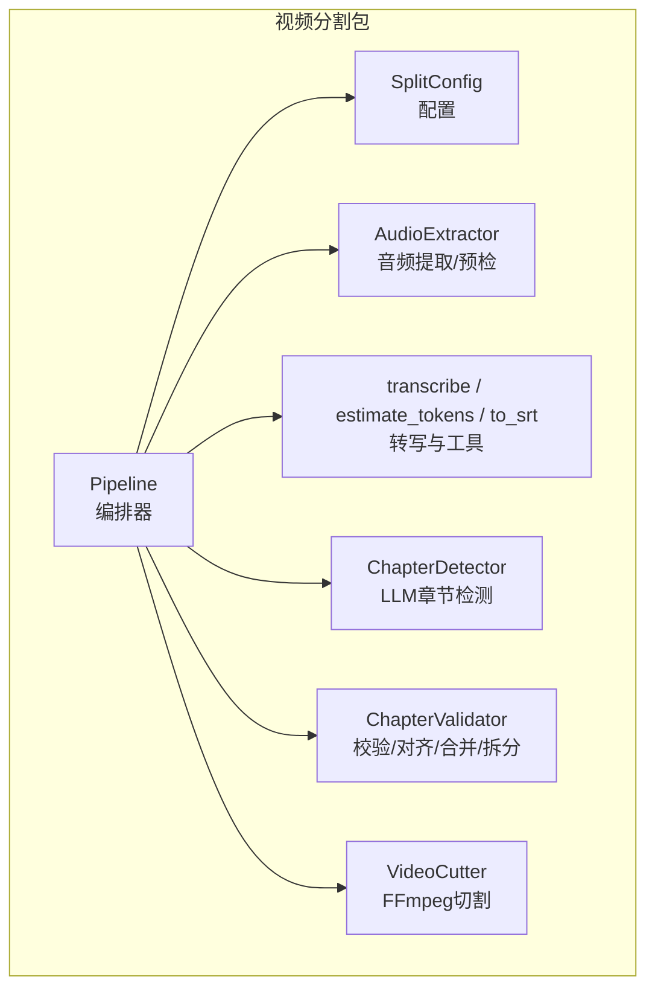
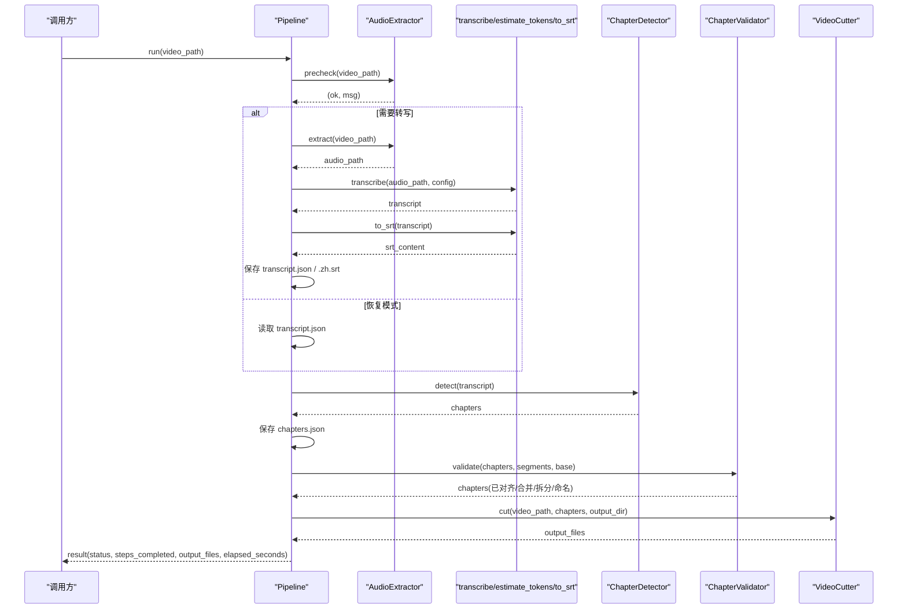
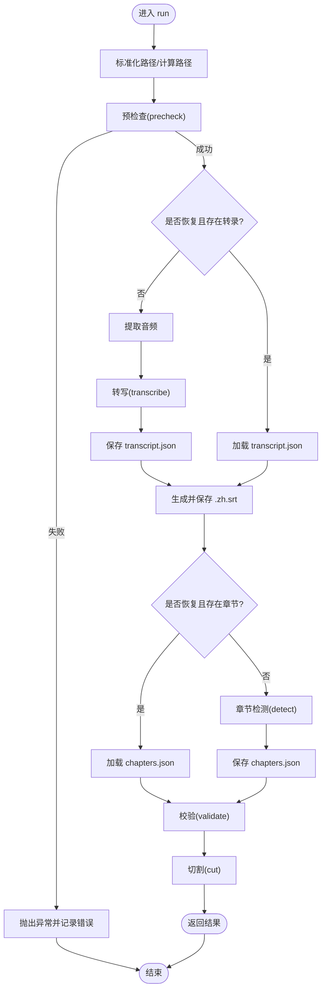
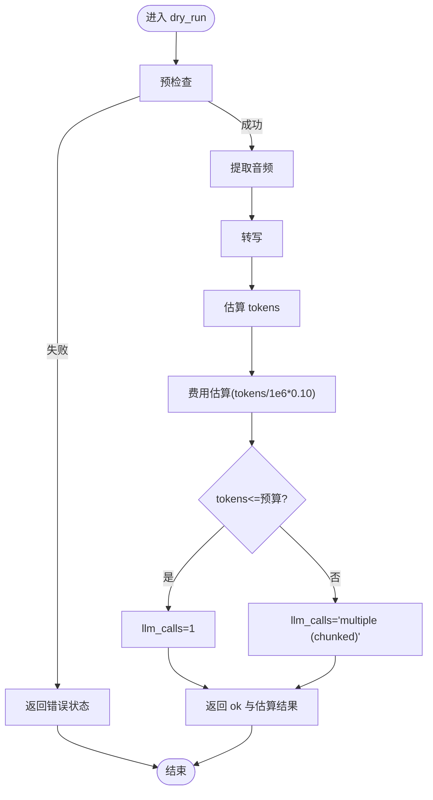
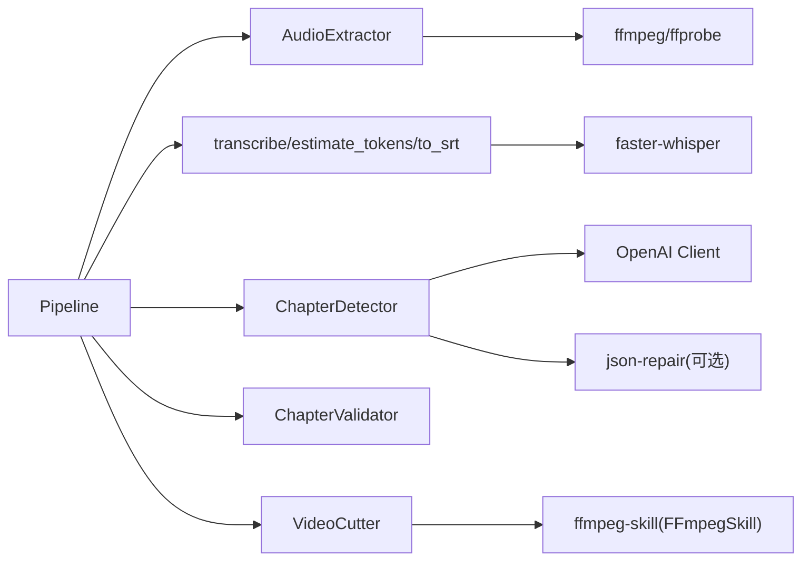

# 管道编排器

<cite>
**本文引用的文件**
- [pipeline.py](file://video_splitter/pipeline.py)
- [config.py](file://video_splitter/config.py)
- [audio.py](file://video_splitter/extractor/audio.py)
- [transcribe.py](file://video_splitter/extractor/transcribe.py)
- [chapter.py](file://video_splitter/analyzer/chapter.py)
- [validator.py](file://video_splitter/analyzer/validator.py)
- [cutter.py](file://video_splitter/splitter/cutter.py)
- [test_pipeline.py](file://video_splitter/tests/test_pipeline.py)
</cite>

## 目录
1. [简介](#简介)
2. [项目结构](#项目结构)
3. [核心组件](#核心组件)
4. [架构总览](#架构总览)
5. [详细组件分析](#详细组件分析)
6. [依赖关系分析](#依赖关系分析)
7. [性能考量](#性能考量)
8. [故障排查指南](#故障排查指南)
9. [结论](#结论)
10. [附录：API使用与最佳实践](#附录api使用与最佳实践)

## 简介
本文件围绕 Pipeline 类（视频分割管道编排器）提供深入的技术文档。内容涵盖初始化过程、配置管理、状态跟踪、错误处理机制，以及 run() 和 dry_run() 的完整执行流程；同时解释中间文件管理机制（transcript.json、chapters.json、SRT字幕），并提供基于测试用例的实际使用示例与异常处理、结果解析的最佳实践。

## 项目结构
Pipeline 位于 video_splitter 包中，负责编排以下子阶段：预检查 → 音频提取与转写 → 章节检测 → 校验与对齐 → 视频切割。各子阶段由独立模块实现，并通过 SplitConfig 进行统一配置注入。

图表来源
- [pipeline.py:21-30](file://video_splitter/pipeline.py#L21-L30)
- [config.py:19-37](file://video_splitter/config.py#L19-L37)
- [audio.py:12-25](file://video_splitter/extractor/audio.py#L12-L25)
- [transcribe.py:11-59](file://video_splitter/extractor/transcribe.py#L11-L59)
- [chapter.py:43-96](file://video_splitter/analyzer/chapter.py#L43-L96)
- [validator.py:10-53](file://video_splitter/analyzer/validator.py#L10-L53)
- [cutter.py:22-53](file://video_splitter/splitter/cutter.py#L22-L53)

章节来源
- [pipeline.py:1-131](file://video_splitter/pipeline.py#L1-L131)
- [config.py:1-54](file://video_splitter/config.py#L1-L54)

## 核心组件
- Pipeline：编排入口，维护运行状态、中间文件路径、耗时统计与错误信息。
- SplitConfig：集中式配置，支持环境变量覆盖，控制模型、设备、切分策略、命名模板、恢复模式等。
- AudioExtractor：调用 ffprobe/ffmpeg 做时长获取、质量预检与音频提取。
- transcribe/estimate_tokens/to_srt：基于 faster-whisper 的转写、Token估算与SRT生成。
- ChapterDetector：LLM驱动的语义章节检测，支持滑动窗口分块与均匀切分回退。
- ChapterValidator：边界对齐、过短合并、过长拆分、标题规范化。
- VideoCutter：基于 FFmpegSkill 的快速拷贝或精确重编码切割。

章节来源
- [pipeline.py:21-30](file://video_splitter/pipeline.py#L21-L30)
- [config.py:19-37](file://video_splitter/config.py#L19-L37)
- [audio.py:12-25](file://video_splitter/extractor/audio.py#L12-L25)
- [transcribe.py:11-59](file://video_splitter/extractor/transcribe.py#L11-L59)
- [chapter.py:43-96](file://video_splitter/analyzer/chapter.py#L43-L96)
- [validator.py:10-53](file://video_splitter/analyzer/validator.py#L10-L53)
- [cutter.py:22-53](file://video_splitter/splitter/cutter.py#L22-L53)

## 架构总览
下图展示了 Pipeline 在单次 run() 中的关键交互与数据流。

图表来源
- [pipeline.py:31-111](file://video_splitter/pipeline.py#L31-L111)
- [audio.py:26-171](file://video_splitter/extractor/audio.py#L26-L171)
- [transcribe.py:11-105](file://video_splitter/extractor/transcribe.py#L11-L105)
- [chapter.py:77-322](file://video_splitter/analyzer/chapter.py#L77-L322)
- [validator.py:22-132](file://video_splitter/analyzer/validator.py#L22-L132)
- [cutter.py:30-98](file://video_splitter/splitter/cutter.py#L30-L98)

## 详细组件分析

### Pipeline 类设计与实现原理
- 初始化
  - 加载配置：若未显式传入 SplitConfig，则从环境变量构建默认配置。
  - 实例化子组件：AudioExtractor、ChapterDetector、ChapterValidator、VideoCutter，并注入配置。
- 状态跟踪
  - 通过 steps_completed 记录已完成阶段。
  - 通过 status 标记 success/error。
  - 通过 elapsed_seconds 记录总耗时。
  - 通过 error 字段记录异常信息（失败时）。
- 中间文件路径约定
  - transcript.json：与输入视频同目录，同名后缀为 .transcript.json。
  - chapters.json：与输入视频同目录，同名后缀为 .chapters.json。
  - SRT字幕：与输入视频同目录，同名后缀为 .zh.srt。
  - 输出片段目录：与输入视频同级目录，命名为 {basename}_segments。
- 错误处理
  - 捕获任意异常，设置 status="error" 与 error 消息，记录日志后重新抛出。
  - 预检查失败直接抛出 RuntimeError，中断后续步骤。
- 恢复模式（resume）
  - 若启用且存在 transcript.json，则跳过转写，直接读取。
  - 若启用且存在 chapters.json，则跳过 LLM 检测，直接读取并反序列化为 Chapter 对象。

章节来源
- [pipeline.py:21-30](file://video_splitter/pipeline.py#L21-L30)
- [pipeline.py:31-111](file://video_splitter/pipeline.py#L31-L111)

#### run() 方法执行流程
- 输入验证
  - 绝对路径标准化。
  - 计算基础名、中间文件路径与输出目录。
  - 初始化结果字典，包含 status、steps_completed、output_files。
- 预检查
  - 调用 AudioExtractor.precheck，失败则抛出异常。
- 转写与SRT
  - 若 resume 且 transcript.json 存在：直接加载。
  - 否则：提取音频 → 转写 → 保存 transcript.json → 生成 SRT 并保存 .zh.srt。
- 章节检测
  - 若 resume 且 chapters.json 存在：直接加载并构造 Chapter 列表。
  - 否则：估算 token 数 → 调用 ChapterDetector.detect → 保存 chapters.json。
- 校验与对齐
  - 调用 ChapterValidator.validate，完成边界对齐、过短合并、过长拆分、标题规范化。
- 切割
  - 调用 VideoCutter.cut，生成片段文件列表。
- 收尾
  - 记录 elapsed_seconds，返回结果。

图表来源
- [pipeline.py:31-111](file://video_splitter/pipeline.py#L31-L111)
- [audio.py:26-171](file://video_splitter/extractor/audio.py#L26-L171)
- [transcribe.py:11-105](file://video_splitter/extractor/transcribe.py#L11-L105)
- [chapter.py:77-322](file://video_splitter/analyzer/chapter.py#L77-L322)
- [validator.py:22-132](file://video_splitter/analyzer/validator.py#L22-L132)
- [cutter.py:30-98](file://video_splitter/splitter/cutter.py#L30-L98)

章节来源
- [pipeline.py:31-111](file://video_splitter/pipeline.py#L31-L111)

#### dry_run() 方法与成本估算逻辑
- 目的：在不执行完整管道的情况下，评估转写时长、Token 数量与预估费用，并提示是否需要分块调用 LLM。
- 流程
  - 预检查：失败返回 {"status":"error","message":...}。
  - 提取音频并转写。
  - 估算 Token 数：estimate_tokens(transcript)。
  - 费用估算：按每百万 Token 0.10 RMB 线性估算。
  - 判断 LLM 调用次数：若 token_est <= llm_token_budget，则为 1 次；否则为“multiple (chunked)”。
  - 返回 duration_minutes、estimated_tokens、estimated_cost_rmb、llm_calls。

图表来源
- [pipeline.py:113-131](file://video_splitter/pipeline.py#L113-L131)
- [transcribe.py:62-76](file://video_splitter/extractor/transcribe.py#L62-L76)

章节来源
- [pipeline.py:113-131](file://video_splitter/pipeline.py#L113-L131)

### 配置管理（SplitConfig）
- 关键字段
  - Whisper 模型：model_size、device、compute_type。
  - 分段约束：max_segment_duration、min_segment_duration。
  - LLM 参数：llm_api_base、llm_api_key、llm_model、llm_token_budget、llm_max_retries。
  - 切割策略：cut_mode、keyframe_tolerance。
  - 输出设置：language、naming_template、resume。
  - 转写引擎：transcription_engine、engine_config。
- 环境变量覆盖
  - OPENAI_API_BASE、OPENAI_API_KEY、WHALECLOUD_API_KEY、VIDEO_SPLITTER_DEVICE、VIDEO_SPLITTER_RESUME、VIDEO_SPLITTER_ENGINE。

章节来源
- [config.py:19-54](file://video_splitter/config.py#L19-L54)

### 中间文件管理机制
- transcript.json
  - 位置：与输入视频同目录，文件名 {basename}.transcript.json。
  - 内容：包含 language、duration、segments（每个 segment 含 text、start、end）。
  - 写入时机：首次转写完成后立即持久化；resume 模式下优先读取。
- chapters.json
  - 位置：与输入视频同目录，文件名 {basename}.chapters.json。
  - 内容：章节数组，每项包含 title、start、end、start_seconds、end_seconds。
  - 写入时机：章节检测完成后立即持久化；resume 模式下优先读取。
- SRT字幕
  - 位置：与输入视频同目录，文件名 {basename}.zh.srt。
  - 格式：标准 SRT，时间戳 HH:MM:SS,mmm。
  - 生成时机：每次转写后生成（无论是否 resume）。
- 输出片段目录
  - 位置：与输入视频同级目录，名为 {basename}_segments。
  - 内容：按章节生成的 MP4 片段。

章节来源
- [pipeline.py:31-111](file://video_splitter/pipeline.py#L31-L111)
- [transcribe.py:79-105](file://video_splitter/extractor/transcribe.py#L79-L105)
- [chapter.py:18-41](file://video_splitter/analyzer/chapter.py#L18-L41)

### 章节检测与校验
- ChapterDetector
  - 单调用：当 transcript 文本长度估算不超过 llm_token_budget 时，一次 LLM 调用完成。
  - 分块检测：超长文本采用滑动窗口（约15分钟一段，重叠2分钟），逐段检测后去重合并。
  - 健壮性：JSON 修复（json-repair）、重试指数退避、最终回退到均匀切分。
- ChapterValidator
  - 边界对齐：将章节边界对齐到最近的转写段落边界。
  - 过短合并：小于 min_segment_duration 的相邻段合并。
  - 过长拆分：大于 max_segment_duration 的段递归均分。
  - 命名规范：确保标题以两位序号开头，并清理非法字符。

章节来源
- [chapter.py:43-322](file://video_splitter/analyzer/chapter.py#L43-L322)
- [validator.py:10-132](file://video_splitter/analyzer/validator.py#L10-L132)

### 视频切割（VideoCutter）
- 快速模式（copy）：优先尝试无损拷贝，若实际时长偏差超过 keyframe_tolerance，自动回退到精确模式。
- 精确模式（re-encode）：使用 libx264/aac 重编码，保证时间精度。
- 进度回调：可选 progress_callback，用于外部 UI 更新。

章节来源
- [cutter.py:22-98](file://video_splitter/splitter/cutter.py#L22-L98)

## 依赖关系分析
- 内部依赖
  - Pipeline 依赖 AudioExtractor、transcribe/estimate_tokens/to_srt、ChapterDetector、ChapterValidator、VideoCutter。
  - ChapterDetector 依赖 OpenAI 兼容客户端（openai）与 json-repair（可选）。
  - VideoCutter 动态导入 ffmpeg-skill 模块并使用其 FFmpegSkill/FFmpegError。
- 外部依赖
  - faster-whisper：语音识别。
  - ffmpeg/ffprobe：媒体处理与元数据查询。
  - openai：LLM 调用。
  - librosa/numpy：音频质量预检（可选）。

图表来源
- [pipeline.py:11-16](file://video_splitter/pipeline.py#L11-L16)
- [chapter.py:211-241](file://video_splitter/analyzer/chapter.py#L211-L241)
- [cutter.py:12-19](file://video_splitter/splitter/cutter.py#L12-L19)
- [audio.py:42-69](file://video_splitter/extractor/audio.py#L42-L69)
- [transcribe.py:27-41](file://video_splitter/extractor/transcribe.py#L27-L41)

章节来源
- [pipeline.py:11-16](file://video_splitter/pipeline.py#L11-L16)
- [chapter.py:211-241](file://video_splitter/analyzer/chapter.py#L211-L241)
- [cutter.py:12-19](file://video_splitter/splitter/cutter.py#L12-L19)
- [audio.py:42-69](file://video_splitter/extractor/audio.py#L42-L69)
- [transcribe.py:27-41](file://video_splitter/extractor/transcribe.py#L27-L41)

## 性能考量
- 转写与分块
  - 长视频建议开启 resume，避免重复转写与 LLM 调用。
  - 合理设置 llm_token_budget，减少不必要的分块与多次 LLM 调用。
- 切割策略
  - 快速模式优先，仅在偏差较大时回退到精确模式，平衡速度与精度。
- 资源占用
  - 大视频转写可能消耗较多内存/CPU/GPU，建议根据硬件选择 compute_type 与 device。
- I/O 优化
  - 中间文件落盘可提升断点续跑能力，但会占用磁盘空间，需权衡。

[本节为通用指导，不直接分析具体文件]

## 故障排查指南
- 常见错误与定位
  - 预检查失败：检查视频是否存在、是否有音轨、librosa 是否可用。
  - FFmpeg 失败：确认 ffmpeg/ffprobe 在 PATH 中，权限与解码器支持正常。
  - LLM 不可用：检查 openai 包安装、网络连通性与 API Key/Base URL。
  - JSON 解析失败：ChapterDetector 内置 json-repair 与重试，仍失败将回退均匀切分。
- 日志与诊断
  - 查看 Pipeline 记录的 steps_completed 与 elapsed_seconds，定位卡点。
  - 检查 transcript.json、chapters.json 与 .zh.srt 是否按预期生成。
- 恢复模式
  - 设置 VIDEO_SPLITTER_RESUME=true 或 SplitConfig(resume=True)，跳过重复步骤。

章节来源
- [pipeline.py:102-111](file://video_splitter/pipeline.py#L102-L111)
- [audio.py:26-99](file://video_splitter/extractor/audio.py#L26-L99)
- [chapter.py:195-210](file://video_splitter/analyzer/chapter.py#L195-L210)

## 结论
Pipeline 通过清晰的分层与职责分离，实现了从音频预处理、转写、语义章节检测到视频切割的端到端自动化。其设计强调健壮性（重试、回退、恢复模式）、可观测性（步骤追踪、耗时统计）与可扩展性（配置驱动、组件解耦）。dry_run() 提供了低成本的成本估算与容量规划能力，便于在生产环境中进行前置评估。

[本节为总结，不直接分析具体文件]

## 附录：API使用与最佳实践

### 基本用法（参考测试用例）
- 初始化
  - 使用 SplitConfig(resume=False) 创建配置，或直接使用默认配置。
- 运行管道
  - 调用 pipeline.run(video_path)，返回包含 status、steps_completed、output_files、elapsed_seconds 的结果字典。
- 干跑估算
  - 调用 pipeline.dry_run(video_path)，返回 duration_minutes、estimated_tokens、estimated_cost_rmb、llm_calls。

章节来源
- [test_pipeline.py:55-78](file://video_splitter/tests/test_pipeline.py#L55-L78)
- [test_pipeline.py:163-185](file://video_splitter/tests/test_pipeline.py#L163-L185)

### 异常处理与结果解析最佳实践
- 捕获异常
  - 对 run() 使用 try/except，捕获 RuntimeError（如预检查失败）或其他异常，结合 result["status"] 与 result["error"] 进行用户提示。
- 结果解析
  - 成功时检查 steps_completed 是否包含 ["precheck","transcribe","chapter","validate","cut"]。
  - 输出文件列表 result["output_files"] 即为最终片段路径集合。
- 恢复模式
  - 在长时间任务中启用 resume，避免重复转写与 LLM 调用，提高稳定性与效率。
- 成本估算
  - 使用 dry_run() 提前评估费用与 LLM 调用次数，必要时调整 llm_token_budget 或分段策略。

章节来源
- [test_pipeline.py:80-88](file://video_splitter/tests/test_pipeline.py#L80-L88)
- [test_pipeline.py:90-116](file://video_splitter/tests/test_pipeline.py#L90-L116)
- [test_pipeline.py:118-147](file://video_splitter/tests/test_pipeline.py#L118-L147)
- [test_pipeline.py:187-207](file://video_splitter/tests/test_pipeline.py#L187-L207)
- [test_pipeline.py:209-228](file://video_splitter/tests/test_pipeline.py#L209-L228)
