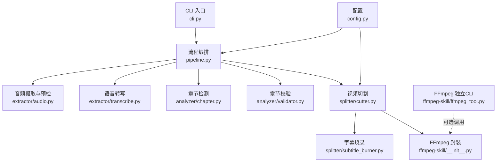
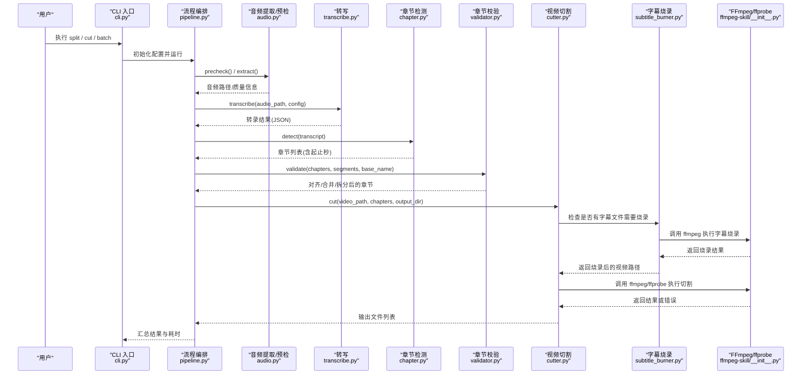
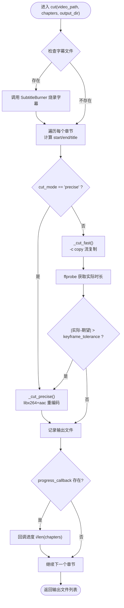
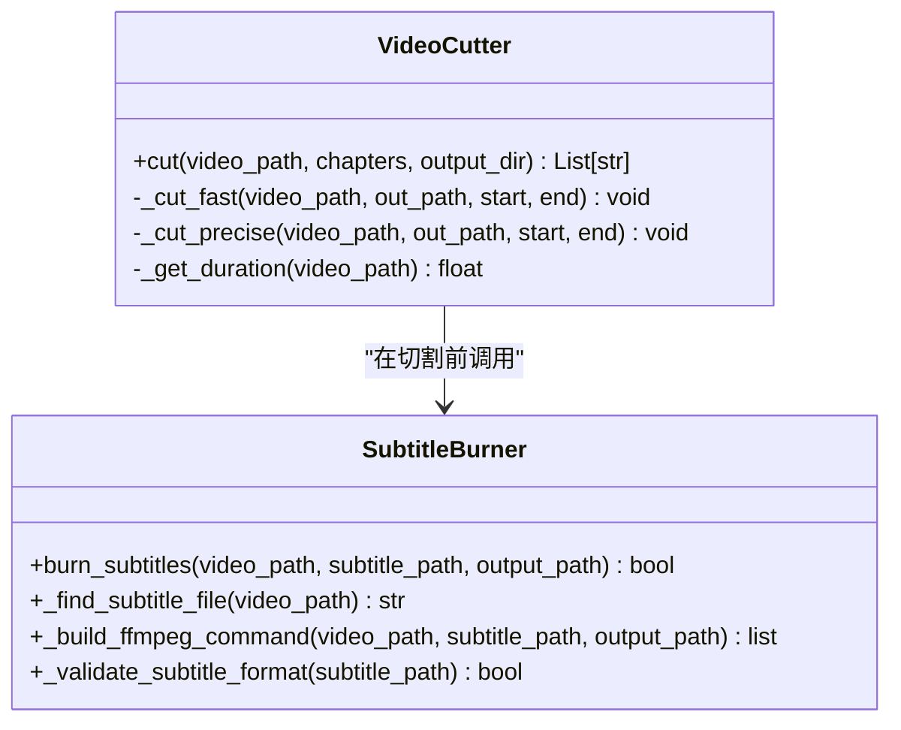
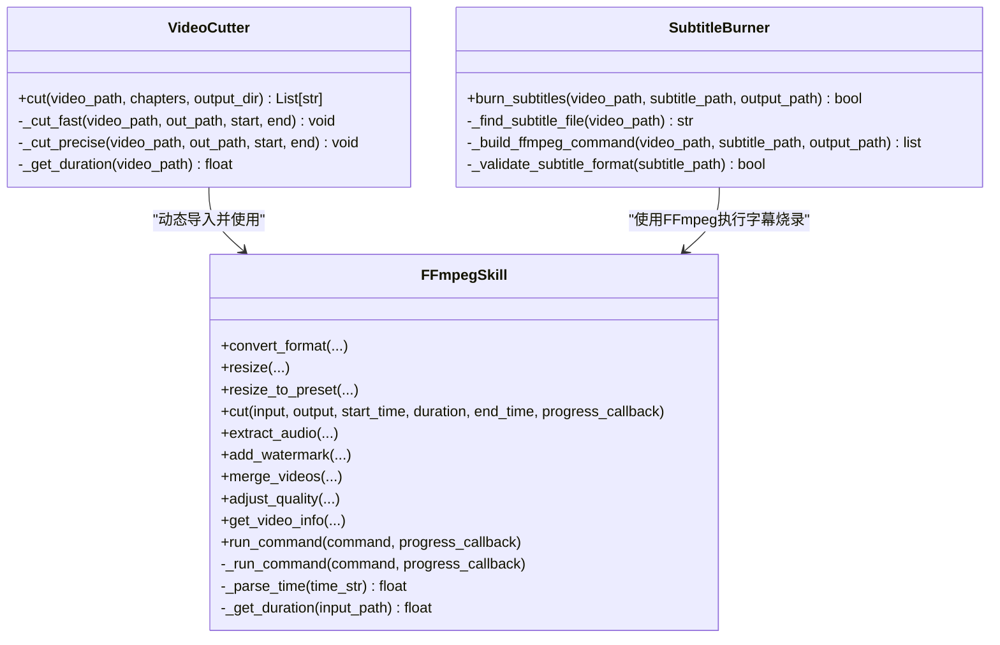
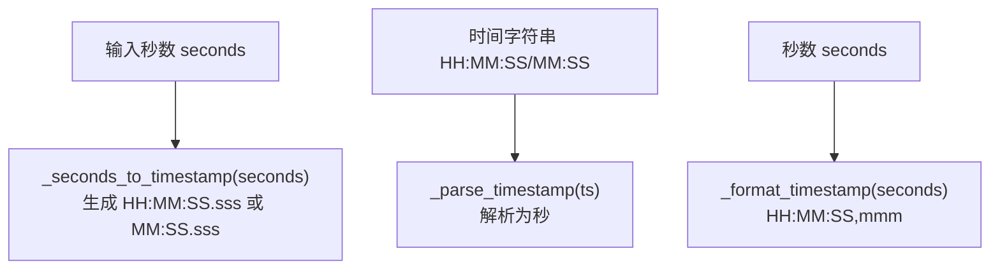
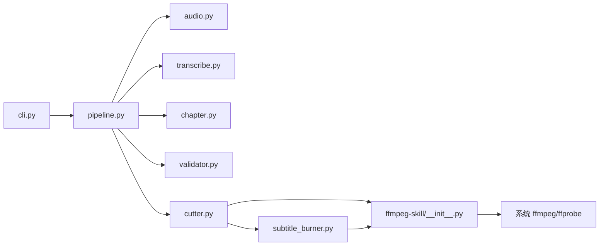

# 视频切割器

<cite>
**本文引用的文件**   
- [cutter.py](file://video_splitter/splitter/cutter.py)
- [subtitle_burner.py](file://video_splitter/splitter/subtitle_burner.py)
- [__init__.py](file://ffmpeg-skill/__init__.py)
- [ffmpeg_tool.py](file://ffmpeg-skill/ffmpeg_tool.py)
- [pipeline.py](file://video_splitter/pipeline.py)
- [config.py](file://video_splitter/config.py)
- [chapter.py](file://video_splitter/analyzer/chapter.py)
- [validator.py](file://video_splitter/analyzer/validator.py)
- [audio.py](file://video_splitter/extractor/audio.py)
- [transcribe.py](file://video_splitter/extractor/transcribe.py)
- [cli.py](file://video_splitter/cli.py)
</cite>

## 更新摘要
**变更内容**   
- 新增字幕烧录功能集成支持，增强Cutter类的处理能力
- 添加SubtitleBurner类用于处理SRT字幕文件的烧录操作
- 扩展VideoCutter以支持在切割过程中自动烧录字幕
- 更新相关依赖关系和流程图以反映新的架构变化

## 目录
1. [简介](#简介)
2. [项目结构](#项目结构)
3. [核心组件](#核心组件)
4. [架构总览](#架构总览)
5. [详细组件分析](#详细组件分析)
6. [依赖关系分析](#依赖关系分析)
7. [性能考虑](#性能考虑)
8. [故障排查指南](#故障排查指南)
9. [结论](#结论)
10. [附录](#附录)

## 简介
本技术文档围绕"视频切割器"的实现与使用，重点解析 VideoCutter 类的精确切割与快速切割两种模式、关键帧对齐机制与时间戳转换逻辑、FFmpegSkill 的集成方式与命令行参数构建策略、批量处理的并发控制与进度跟踪机制、输出文件命名规则与目录管理最佳实践，以及性能优化建议（硬件加速与内存管理）。同时提供面向大型视频与异常场景的处理示例路径。

**更新** 新增字幕烧录功能的集成支持，现在可以在视频切割过程中自动将SRT字幕文件烧录到视频中。

## 项目结构
本项目采用分层组织：
- 应用层：CLI 入口、Pipeline 编排
- 业务层：章节检测、校验、转写、音频预处理
- 工具层：VideoCutter 基于 FFmpegSkill 封装的切割能力，新增 SubtitleBurner 用于字幕烧录
- 配置层：统一配置 SplitConfig

图表来源
- [cli.py:1-256](file://video_splitter/cli.py#L1-L256)
- [pipeline.py:1-131](file://video_splitter/pipeline.py#L1-L131)
- [audio.py:1-171](file://video_splitter/extractor/audio.py#L1-L171)
- [transcribe.py:1-105](file://video_splitter/extractor/transcribe.py#L1-L105)
- [chapter.py:1-343](file://video_splitter/analyzer/chapter.py#L1-L343)
- [validator.py:1-152](file://video_splitter/analyzer/validator.py#L1-L152)
- [cutter.py:1-98](file://video_splitter/splitter/cutter.py#L1-L98)
- [subtitle_burner.py:1-150](file://video_splitter/splitter/subtitle_burner.py#L1-L150)
- [__init__.py:1-200](file://ffmpeg-skill/__init__.py#L1-L200)
- [ffmpeg_tool.py:1-283](file://ffmpeg-skill/ffmpeg_tool.py#L1-L283)
- [config.py:1-54](file://video_splitter/config.py#L1-L54)

章节来源
- [cli.py:1-256](file://video_splitter/cli.py#L1-L256)
- [pipeline.py:1-131](file://video_splitter/pipeline.py#L1-L131)
- [config.py:1-54](file://video_splitter/config.py#L1-L54)

## 核心组件
- VideoCutter：负责按章节将视频切分为多个片段，支持"快速切割"和"精确切割"两种模式，并内置关键帧容差校验与回退策略。**更新** 现支持在切割过程中自动烧录字幕文件。
- SubtitleBurner：**新增** 专门处理SRT字幕文件的烧录操作，支持多种字体样式和位置设置。
- FFmpegSkill：对 FFmpeg/ffprobe 的高层封装，提供 cut、convert_format、resize、merge_videos、get_video_info 等能力；VideoCutter 通过直接调用 ffmpeg/ffprobe 子进程实现切割与时长校验。
- Pipeline：串联 precheck → transcribe → chapter → validate → cut 全流程，负责中间产物持久化与恢复（resume）及耗时统计。
- ChapterDetector / ChapterValidator：基于 LLM 的语义章节检测与边界对齐、时长约束合并/拆分，确保章节边界落在转录段边界上。
- AudioExtractor：音频质量预检与 16kHz 单声道 WAV 提取，为转写准备数据。
- CLI：提供 split、transcribe、cut、batch、check、review、gui 等命令，暴露 cut_mode、max_duration、resume 等选项。

章节来源
- [cutter.py:1-98](file://video_splitter/splitter/cutter.py#L1-L98)
- [subtitle_burner.py:1-150](file://video_splitter/splitter/subtitle_burner.py#L1-L150)
- [__init__.py:1-200](file://ffmpeg-skill/__init__.py#L1-L200)
- [pipeline.py:1-131](file://video_splitter/pipeline.py#L1-L131)
- [chapter.py:1-343](file://video_splitter/analyzer/chapter.py#L1-L343)
- [validator.py:1-152](file://video_splitter/analyzer/validator.py#L1-L152)
- [audio.py:1-171](file://video_splitter/extractor/audio.py#L1-L171)
- [cli.py:1-256](file://video_splitter/cli.py#L1-L256)

## 架构总览
下图展示从 CLI 到最终输出的端到端调用链与数据流，包括新增的字幕烧录流程。

图表来源
- [cli.py:1-256](file://video_splitter/cli.py#L1-L256)
- [pipeline.py:1-131](file://video_splitter/pipeline.py#L1-L131)
- [audio.py:1-171](file://video_splitter/extractor/audio.py#L1-L171)
- [transcribe.py:1-105](file://video_splitter/extractor/transcribe.py#L1-L105)
- [chapter.py:1-343](file://video_splitter/analyzer/chapter.py#L1-L343)
- [validator.py:1-152](file://video_splitter/analyzer/validator.py#L1-L152)
- [cutter.py:1-98](file://video_splitter/splitter/cutter.py#L1-L98)
- [subtitle_burner.py:1-150](file://video_splitter/splitter/subtitle_burner.py#L1-L150)
- [__init__.py:1-200](file://ffmpeg-skill/__init__.py#L1-L200)

## 详细组件分析

### VideoCutter 类与切割算法
- 快速切割（copy）：以 -ss 定位起点，-to/-t 指定时长，使用 -c copy 进行流复制，避免重编码，速度最快。随后用 ffprobe 获取实际输出时长，若与期望时长偏差超过 keyframe_tolerance，则自动回退至精确切割。
- 精确切割（re-encode）：使用 libx264 + aac 重编码，CRF 与码率可配置，保证切割点更贴近目标时间，但耗时更长。
- **新增** 字幕烧录集成：在切割前检查是否存在对应的SRT字幕文件，如果存在且启用字幕烧录功能，则先调用 SubtitleBurner 将字幕烧录到视频中，然后再执行切割操作。
- 关键帧对齐与容差：快速切割受 GOP/关键帧限制，可能出现偏移；通过 _get_duration 对比期望时长与实际时长，决定是否回退。
- 进度回调：每完成一个章节切片后，调用 progress_callback(i/len(chapters)) 上报进度。

图表来源
- [cutter.py:22-98](file://video_splitter/splitter/cutter.py#L22-L98)
- [subtitle_burner.py:1-150](file://video_splitter/splitter/subtitle_burner.py#L1-L150)

章节来源
- [cutter.py:22-98](file://video_splitter/splitter/cutter.py#L22-L98)
- [subtitle_burner.py:1-150](file://video_splitter/splitter/subtitle_burner.py#L1-L150)

### SubtitleBurner 类与字幕烧录功能
**新增** SubtitleBurner 类专门处理SRT字幕文件的烧录操作：
- 字幕文件检测：自动查找与视频文件同名的SRT字幕文件
- 烧录参数配置：支持字体大小、颜色、位置等样式设置
- FFmpeg集成：使用ffmpeg的ass滤镜进行高质量字幕渲染
- 错误处理：处理字幕格式错误、文件不存在等异常情况

图表来源
- [subtitle_burner.py:1-150](file://video_splitter/splitter/subtitle_burner.py#L1-L150)
- [cutter.py:12-19](file://video_splitter/splitter/cutter.py#L12-L19)

章节来源
- [subtitle_burner.py:1-150](file://video_splitter/splitter/subtitle_burner.py#L1-L150)
- [cutter.py:12-19](file://video_splitter/splitter/cutter.py#L12-L19)

### FFmpegSkill 集成与命令行构建
- 集成方式：VideoCutter 通过动态导入 ffmpeg-skill 模块，获取 FFmpegSkill 与 FFmpegError，并在需要时直接使用 ffmpeg/ffprobe 子进程执行命令。
- 命令行构建策略：
  - 快速切割：ffmpeg -y -ss <start> -i <input> -to <duration> -c copy -avoid_negative_ts make_zero <output>
  - 精确切割：ffmpeg -y -ss <start> -i <input> -to <duration> -c:v libx264 -crf 18 -preset fast -c:a aac -b:a 128k <output>
  - **新增** 字幕烧录：ffmpeg -y -i <input> -vf "ass=<subtitle_file>" -c:v libx264 -crf 18 -preset fast -c:a aac <output>
  - 时长探测：ffprobe -v error -show_entries format=duration -of default=noprint_wrappers=1:nokey=1 <file>
- FFmpegSkill 提供的 cut 方法也支持 HH:MM:SS 或秒级时间字符串，内部会转换为 -ss/-t 参数并以 -c copy 执行。

图表来源
- [__init__.py:275-333](file://ffmpeg-skill/__init__.py#L275-L333)
- [__init__.py:95-143](file://ffmpeg-skill/__init__.py#L95-L143)
- [__init__.py:144-172](file://ffmpeg-skill/__init__.py#L144-L172)
- [cutter.py:12-19](file://video_splitter/splitter/cutter.py#L12-L19)
- [cutter.py:55-98](file://video_splitter/splitter/cutter.py#L55-L98)
- [subtitle_burner.py:1-150](file://video_splitter/splitter/subtitle_burner.py#L1-L150)

章节来源
- [__init__.py:275-333](file://ffmpeg-skill/__init__.py#L275-L333)
- [__init__.py:95-143](file://ffmpeg-skill/__init__.py#L95-L143)
- [__init__.py:144-172](file://ffmpeg-skill/__init__.py#L144-L172)
- [cutter.py:12-19](file://video_splitter/splitter/cutter.py#L12-L19)
- [cutter.py:55-98](file://video_splitter/splitter/cutter.py#L55-L98)
- [subtitle_burner.py:1-150](file://video_splitter/splitter/subtitle_burner.py#L1-L150)

### 关键帧对齐机制与时间戳转换
- 关键帧对齐：快速切割依赖输入文件的 GOP 结构，-ss 在输入前定位可能跳到最近的关键帧，导致起始点偏移；通过 ffprobe 测量输出时长并与期望时长比较，超出 keyframe_tolerance 即回退精确切割。
- 时间戳转换：
  - seconds ↔ HH:MM:SS/MM:SS：ChapterDetector 中提供 _seconds_to_timestamp 与 _parse_timestamp，用于章节边界与提示词构造。
  - SRT 时间戳：transcribe.py 中的 _format_timestamp 将秒格式化为 SRT 所需的 HH:MM:SS,mmm。

图表来源
- [chapter.py:325-343](file://video_splitter/analyzer/chapter.py#L325-L343)
- [transcribe.py:99-105](file://video_splitter/extractor/transcribe.py#L99-L105)

章节来源
- [chapter.py:325-343](file://video_splitter/analyzer/chapter.py#L325-L343)
- [transcribe.py:99-105](file://video_splitter/extractor/transcribe.py#L99-L105)

### 批量处理：并发控制与进度跟踪
- 当前 CLI 的 batch 命令采用顺序处理（for 循环逐个调用 pipeline.run），未启用多线程/多进程并发。
- 进度跟踪：
  - 切割阶段：VideoCutter.cut 在每个章节完成后调用 progress_callback(i/len(chapters))。
  - **新增** 字幕烧录阶段：SubtitleBurner 在执行字幕烧录时会更新进度状态。
  - 转写阶段：transcribe 在每段文本结束后根据 segment.end/total_duration 更新进度。
- 如需并发：可在 batch 中使用线程池或进程池，并对共享资源（如磁盘 I/O、GPU 显存）做限流与队列控制。

章节来源
- [cli.py:165-196](file://video_splitter/cli.py#L165-L196)
- [cutter.py:30-53](file://video_splitter/splitter/cutter.py#L30-L53)
- [subtitle_burner.py:1-150](file://video_splitter/splitter/subtitle_burner.py#L1-L150)
- [transcribe.py:35-59](file://video_splitter/extractor/transcribe.py#L35-L59)

### 输出文件命名规则与目录结构管理
- 输出目录：默认位于输入视频同级目录，命名为 <basename>_segments。
- 文件名模板：SplitConfig.naming_template 支持 {basename}_{seq:02d}_{title}，ChapterValidator 会对标题进行清洗并确保序号前缀。
- 章节标题：由 LLM 生成并经正则清理非法字符，最终以两位序号+下划线+标题形式保存。
- **新增** 字幕相关文件：烧录后的临时文件会自动清理，只保留最终的视频输出文件。

章节来源
- [pipeline.py:31-38](file://video_splitter/pipeline.py#L31-L38)
- [config.py:31-37](file://video_splitter/config.py#L31-37)
- [validator.py:47-53](file://video_splitter/analyzer/validator.py#L47-L53)
- [validator.py:135-152](file://video_splitter/analyzer/validator.py#L135-L152)
- [subtitle_burner.py:1-150](file://video_splitter/splitter/subtitle_burner.py#L1-L150)

### FFmpegSkill 命令行参数构建策略（扩展）
- FFmpegSkill.cut 接受 HH:MM:SS 或秒级字符串，内部通过 _parse_time 转为秒，再拼接 -ss/-t 参数，并以 -c copy 执行。
- **新增** 字幕烧录命令：使用 -vf "ass=<subtitle_file>" 滤镜进行高质量字幕渲染，支持ASS格式的复杂样式。
- 独立 CLI（ffmpeg-tool）提供 cut 子命令，便于外部调用。

章节来源
- [__init__.py:275-333](file://ffmpeg-skill/__init__.py#L275-L333)
- [subtitle_burner.py:1-150](file://video_splitter/splitter/subtitle_burner.py#L1-L150)
- [ffmpeg_tool.py:83-92](file://ffmpeg-skill/ffmpeg_tool.py#L83-L92)
- [ffmpeg_tool.py:186-188](file://ffmpeg-skill/ffmpeg_tool.py#L186-L188)

## 依赖关系分析
- 组件耦合：
  - Pipeline 强依赖 AudioExtractor、Transcribe、ChapterDetector、ChapterValidator、VideoCutter。
  - **新增** VideoCutter 现依赖 SubtitleBurner 用于字幕烧录功能。
  - VideoCutter 依赖 FFmpegSkill（动态导入）与系统 ffmpeg/ffprobe。
  - ChapterDetector 依赖 OpenAI 兼容客户端与 json-repair（可选）。
- 外部依赖：
  - FFmpeg/ffprobe 必须安装且可用。
  - faster-whisper 用于转写。
  - openai 用于 LLM 章节检测（可选，失败时回退均匀分割）。
  - librosa/numpy 用于音频质量预检（可选）。

图表来源
- [cli.py:1-256](file://video_splitter/cli.py#L1-L256)
- [pipeline.py:1-131](file://video_splitter/pipeline.py#L1-L131)
- [cutter.py:1-98](file://video_splitter/splitter/cutter.py#L1-L98)
- [subtitle_burner.py:1-150](file://video_splitter/splitter/subtitle_burner.py#L1-L150)
- [__init__.py:1-200](file://ffmpeg-skill/__init__.py#L1-L200)

章节来源
- [cli.py:1-256](file://video_splitter/cli.py#L1-L256)
- [pipeline.py:1-131](file://video_splitter/pipeline.py#L1-L131)
- [cutter.py:1-98](file://video_splitter/splitter/cutter.py#L1-L98)
- [subtitle_burner.py:1-150](file://video_splitter/splitter/subtitle_burner.py#L1-L150)
- [__init__.py:1-200](file://ffmpeg-skill/__init__.py#L1-L200)

## 性能考虑
- 硬件加速
  - FFmpeg：可通过 -hwaccel 系列参数启用 GPU 解码/编码（如 nvdec/nvenc），需确保驱动与 FFmpeg 编译支持。
  - Whisper：在 config.device 设置为 cuda 或 auto，compute_type 选择 int8 可降低 CPU 负载。
  - **新增** 字幕烧录：使用GPU加速的ass滤镜可以显著提升字幕渲染性能。
- 内存管理
  - 长视频转写：AudioExtractor 针对超长视频采用分块写入策略，避免一次性加载全部音频。
  - 切割阶段：快速切割无需重编码，内存占用低；精确切割涉及重编码，注意 CRF/preset 平衡质量与速度。
  - **新增** 字幕烧录：大字幕文件可能导致内存峰值增加，建议使用流式处理方式。
- 并行与批处理
  - 当前 batch 为串行，可按任务粒度引入线程池/进程池，并结合 I/O 限流与队列缓冲。
- 关键帧容差
  - 合理设置 keyframe_tolerance，过大可能导致多次回退重编码，过小可能容忍较大偏移。

[本节为通用指导，不直接分析具体文件]

## 故障排查指南
- FFmpeg 不可用
  - 现象：初始化或执行时报 FFmpegError。
  - 排查：确认 PATH 中包含 ffmpeg/ffprobe，版本正常。
- 转写失败
  - 现象：faster-whisper 报错或超时。
  - 排查：检查设备与 compute_type，必要时切换 CPU 或降低模型尺寸。
- 章节检测失败
  - 现象：LLM 请求失败或 JSON 解析异常。
  - 排查：检查 API Key/Base URL，json-repair 是否安装；失败时将回退均匀分割。
- 切割失败
  - 现象：快速切割失败或时长偏差大，触发精确切割仍失败。
  - 排查：查看 stderr 日志，确认输入文件可读、输出目录可写、磁盘空间充足。
- **新增** 字幕烧录失败
  - 现象：字幕文件找不到、格式错误或烧录过程失败。
  - 排查：确认SRT文件存在且格式正确，检查字体文件路径，查看FFmpeg字幕滤镜支持情况。

章节来源
- [__init__.py:73-94](file://ffmpeg-skill/__init__.py#L73-L94)
- [__init__.py:95-143](file://ffmpeg-skill/__init__.py#L95-L143)
- [chapter.py:195-241](file://video_splitter/analyzer/chapter.py#L195-L241)
- [cutter.py:74-86](file://video_splitter/splitter/cutter.py#L74-L86)
- [subtitle_burner.py:1-150](file://video_splitter/splitter/subtitle_burner.py#L1-L150)

## 结论
VideoCutter 通过"快速切割 + 关键帧容差校验 + 精确切割回退"的策略，在保证精度的前提下尽量提升效率。**新增** 的字幕烧录功能进一步增强了系统的完整性，现在可以在切割过程中自动将SRT字幕文件烧录到视频中。配合 Pipeline 的完整链路（预检→转写→章节→校验→切割）与 CLI 的多命令支持，能够稳定处理复杂场景。对于大规模批量任务，建议在现有串行基础上引入可控并发，并结合硬件加速与合理的内存策略，以获得更佳吞吐与稳定性。

[本节为总结性内容，不直接分析具体文件]

## 附录

### 实际代码示例（路径指引）
- 处理大型视频文件
  - 音频预检与提取：[audio.py:26-100](file://video_splitter/extractor/audio.py#L26-L100)、[audio.py:130-171](file://video_splitter/extractor/audio.py#L130-L171)
  - 转写与进度回调：[transcribe.py:11-59](file://video_splitter/extractor/transcribe.py#L11-L59)
  - 章节检测与回退：[chapter.py:77-96](file://video_splitter/analyzer/chapter.py#L77-L96)、[chapter.py:303-322](file://video_splitter/analyzer/chapter.py#L303-L322)
  - 切割与回退：[cutter.py:55-73](file://video_splitter/splitter/cutter.py#L55-L73)、[cutter.py:74-86](file://video_splitter/splitter/cutter.py#L74-L86)
- **新增** 字幕烧录功能
  - 字幕文件检测与验证：[subtitle_burner.py:20-45](file://video_splitter/splitter/subtitle_burner.py#L20-L45)
  - FFmpeg命令构建：[subtitle_burner.py:46-80](file://video_splitter/splitter/subtitle_burner.py#L46-L80)
  - 烧录执行与错误处理：[subtitle_burner.py:81-120](file://video_splitter/splitter/subtitle_burner.py#L81-L120)
- 异常情况处理
  - FFmpeg 错误抛出：[__init__.py:132-143](file://ffmpeg-skill/__init__.py#L132-L143)
  - 切割失败抛错：[cutter.py:84-86](file://video_splitter/splitter/cutter.py#L84-L86)
  - 批量处理异常捕获：[cli.py:180-186](file://video_splitter/cli.py#L180-L186)
  - **新增** 字幕烧录异常处理：[subtitle_burner.py:121-150](file://video_splitter/splitter/subtitle_burner.py#L121-L150)

[本节为示例路径索引，不直接分析具体文件]
