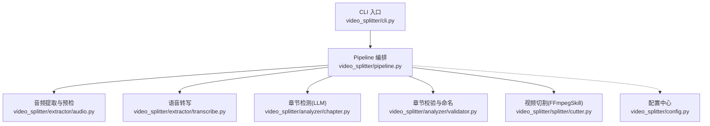
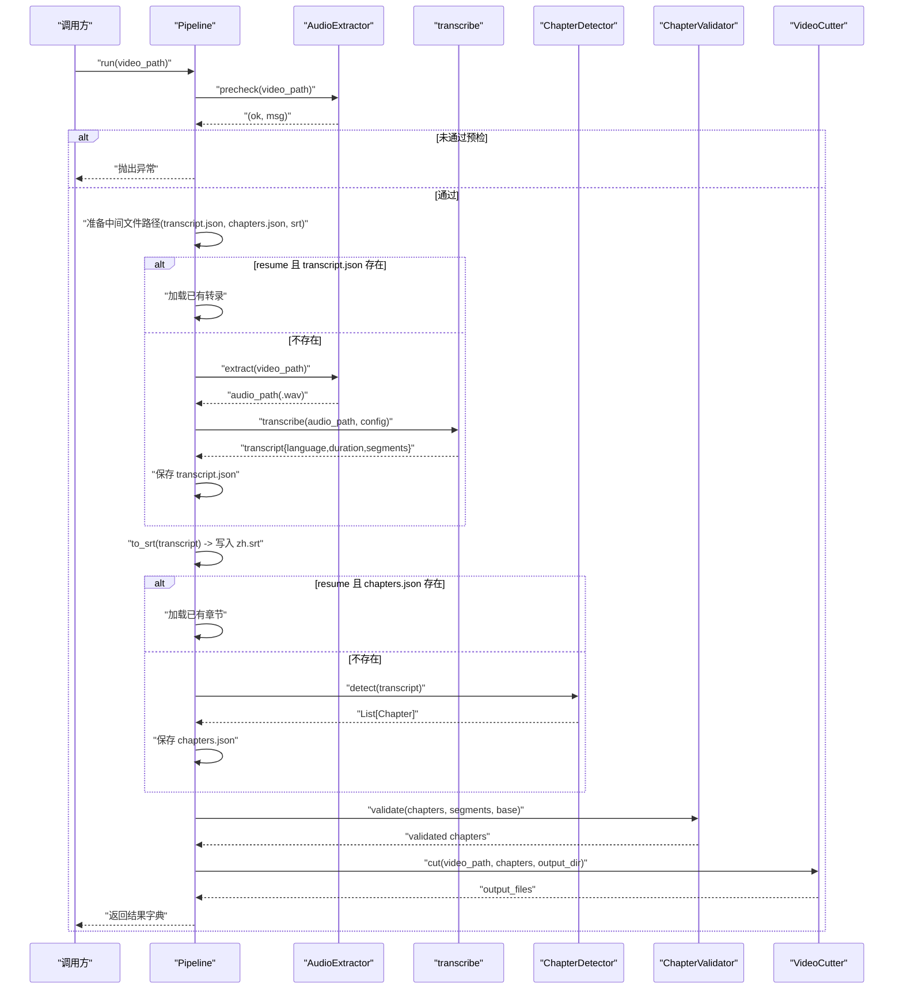
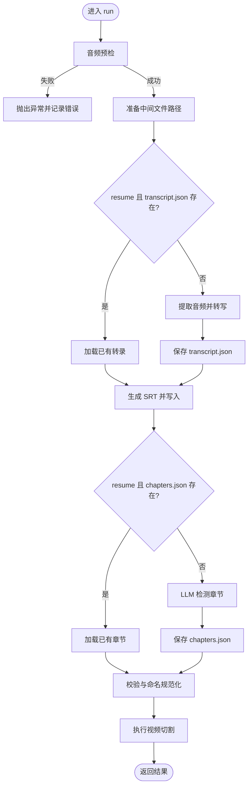
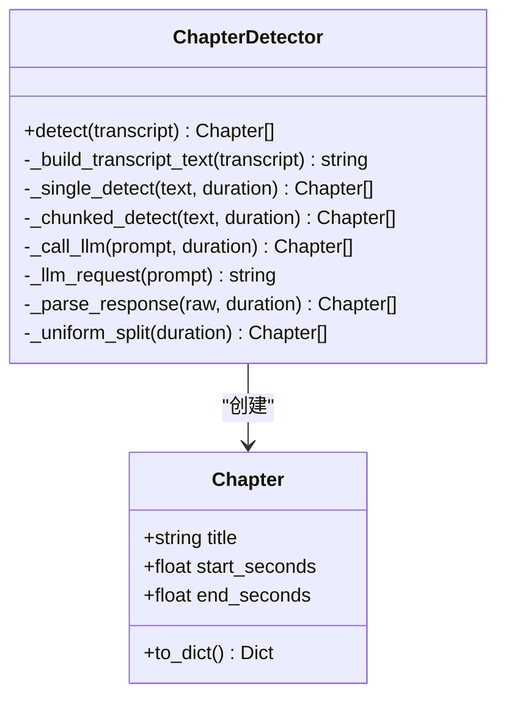
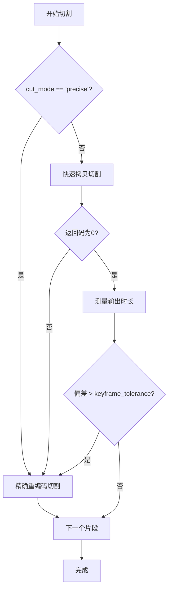
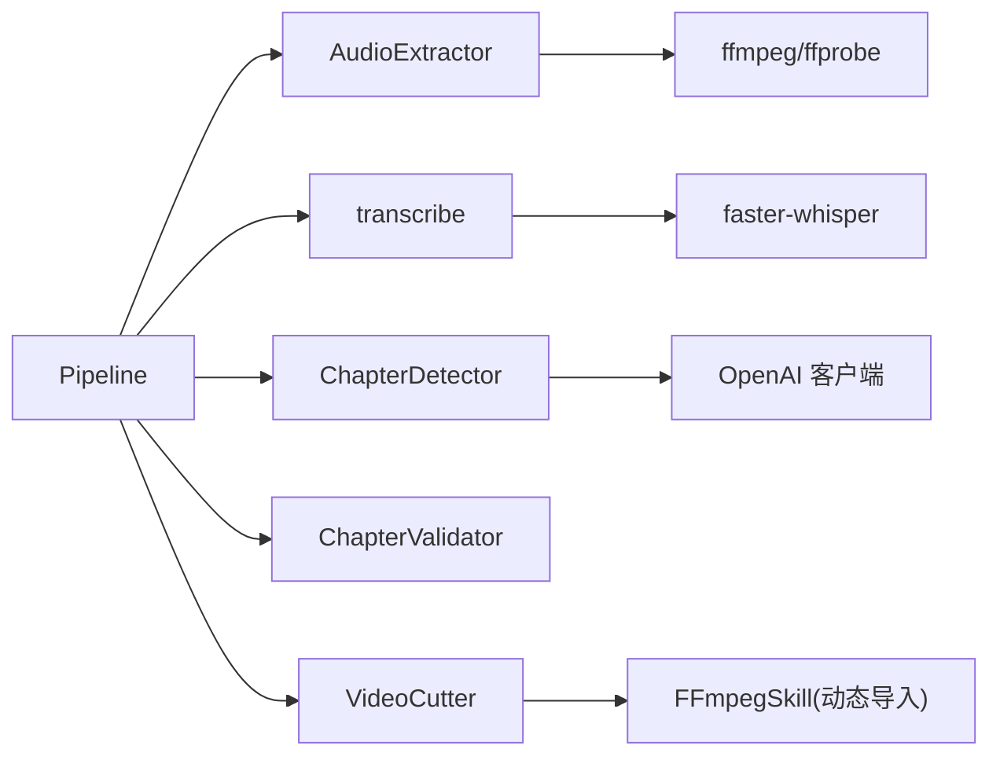

# 视频处理管道

<cite>
**本文引用的文件**   
- [pipeline.py](file://video_splitter/pipeline.py)
- [config.py](file://video_splitter/config.py)
- [audio.py](file://video_splitter/extractor/audio.py)
- [transcribe.py](file://video_splitter/extractor/transcribe.py)
- [chapter.py](file://video_splitter/analyzer/chapter.py)
- [validator.py](file://video_splitter/analyzer/validator.py)
- [cutter.py](file://video_splitter/splitter/cutter.py)
- [cli.py](file://video_splitter/cli.py)
- [test_pipeline.py](file://video_splitter/tests/test_pipeline.py)
</cite>

## 目录
1. [简介](#简介)
2. [项目结构](#项目结构)
3. [核心组件](#核心组件)
4. [架构总览](#架构总览)
5. [详细组件分析](#详细组件分析)
6. [依赖关系分析](#依赖关系分析)
7. [性能与内存管理](#性能与内存管理)
8. [故障排查指南](#故障排查指南)
9. [扩展与最佳实践](#扩展与最佳实践)
10. [结论](#结论)
11. [附录：API 使用示例](#附录api-使用示例)

## 简介
本技术文档围绕视频处理管道的核心编排类 Pipeline，系统阐述其实现原理、处理步骤、输入验证、错误处理、进度跟踪、中间文件管理与输出格式。从音频提取到最终视频切割的完整流程均被覆盖，并给出异步处理机制与并发控制策略建议、自定义处理步骤的扩展指南、性能优化与内存管理策略，以及基于现有代码的实际使用示例路径。

## 项目结构
本项目采用分层模块化组织：
- 配置层：SplitConfig 集中管理模型、切分策略、LLM 参数、命名模板等
- 提取层：AudioExtractor 负责音频提取与质量预检；transcribe 调用 ASR 引擎生成带时间戳的文本片段
- 分析层：ChapterDetector 基于 LLM 进行语义章节检测（支持滑动窗口与降级）；ChapterValidator 做边界对齐、时长约束与命名规范化
- 分割层：VideoCutter 基于 FFmpegSkill 或原生 ffmpeg 命令执行快速/精确切割
- 编排层：Pipeline 串联上述阶段，提供 run/dry_run 接口，统一错误处理与结果汇总
- CLI：命令行入口，封装常用工作流

图表来源
- [cli.py:1-256](file://video_splitter/cli.py#L1-L256)
- [pipeline.py:1-131](file://video_splitter/pipeline.py#L1-L131)
- [audio.py:1-171](file://video_splitter/extractor/audio.py#L1-L171)
- [transcribe.py:1-105](file://video_splitter/extractor/transcribe.py#L1-L105)
- [chapter.py:1-343](file://video_splitter/analyzer/chapter.py#L1-L343)
- [validator.py:1-152](file://video_splitter/analyzer/validator.py#L1-L152)
- [cutter.py:1-98](file://video_splitter/splitter/cutter.py#L1-L98)
- [config.py:1-54](file://video_splitter/config.py#L1-L54)

章节来源
- [cli.py:1-256](file://video_splitter/cli.py#L1-L256)
- [pipeline.py:1-131](file://video_splitter/pipeline.py#L1-L131)
- [config.py:1-54](file://video_splitter/config.py#L1-L54)

## 核心组件
- Pipeline：主编排器，负责输入校验、中间文件管理、阶段调度、错误捕获与耗时统计
- AudioExtractor：音频提取与质量预检（ffprobe + ffmpeg + librosa/Numpy）
- transcribe：基于 faster-whisper 的语音转写，返回带时间戳的 segments
- ChapterDetector：LLM 驱动的语义章节检测，支持单轮/滑动窗口与均匀分割降级
- ChapterValidator：边界对齐、合并过短段、拆分过长段、标题规范化
- VideoCutter：快速拷贝或精确重编码切割，自动回退与精度校验
- SplitConfig：集中配置项与环境变量注入

章节来源
- [pipeline.py:1-131](file://video_splitter/pipeline.py#L1-L131)
- [audio.py:1-171](file://video_splitter/extractor/audio.py#L1-L171)
- [transcribe.py:1-105](file://video_splitter/extractor/transcribe.py#L1-L105)
- [chapter.py:1-343](file://video_splitter/analyzer/chapter.py#L1-L343)
- [validator.py:1-152](file://video_splitter/analyzer/validator.py#L1-L152)
- [cutter.py:1-98](file://video_splitter/splitter/cutter.py#L1-L98)
- [config.py:1-54](file://video_splitter/config.py#L1-L54)

## 架构总览
下图展示了 Pipeline.run 的端到端时序，包括中间文件读写、LLM 调用与视频切割。

图表来源
- [pipeline.py:31-111](file://video_splitter/pipeline.py#L31-L111)
- [audio.py:26-171](file://video_splitter/extractor/audio.py#L26-L171)
- [transcribe.py:11-59](file://video_splitter/extractor/transcribe.py#L11-L59)
- [chapter.py:77-322](file://video_splitter/analyzer/chapter.py#L77-L322)
- [validator.py:22-53](file://video_splitter/analyzer/validator.py#L22-L53)
- [cutter.py:30-53](file://video_splitter/splitter/cutter.py#L30-L53)

## 详细组件分析

### Pipeline 类：编排与状态机
- 职责
  - 初始化各子组件与配置
  - 解析输入路径、计算中间文件路径（transcript.json、chapters.json、zh.srt、_segments 目录）
  - 按顺序执行：预检 → 转录 → SRT 导出 → 章节检测 → 校验 → 切割
  - 支持 resume 模式：若中间文件存在则跳过对应阶段
  - 统一异常捕获与耗时统计，返回结构化结果
- 关键行为
  - 预检失败直接抛出异常
  - 转录与章节检测可恢复，避免重复计算
  - 将 SRT 与章节 JSON 持久化，便于调试与复用
  - dry_run 仅估算成本与 token 数，不触发 LLM 实际调用

图表来源
- [pipeline.py:31-111](file://video_splitter/pipeline.py#L31-L111)

章节来源
- [pipeline.py:1-131](file://video_splitter/pipeline.py#L1-L131)
- [test_pipeline.py:52-148](file://video_splitter/tests/test_pipeline.py#L52-L148)

### AudioExtractor：音频提取与质量预检
- 功能
  - precheck：检查文件存在性、可选 librosa 质量评估（RMS、静音比例），返回 (ok, msg)
  - get_duration：通过 ffprobe 获取时长
  - extract：ffmpeg 抽取 16kHz 单声道 PCM WAV，长视频走无容器直出，短时走 wav 容器
- 错误处理
  - 缺失文件、ffprobe/ffmpeg 失败时抛出明确异常
  - librosa 不可用时跳过质量检查并返回警告信息
- 复杂度与性能
  - 预检对前 N 秒采样进行 RMS 与静音帧统计，时间复杂度 O(N)，空间复杂度 O(N)
  - 大文件避免额外容器开销，降低 I/O

章节来源
- [audio.py:1-171](file://video_splitter/extractor/audio.py#L1-L171)

### transcribe：语音转写与 SRT 导出
- 功能
  - transcribe：基于 faster-whisper 的 WhisperModel 转写，返回 language、duration、segments
  - estimate_tokens：粗略估计中文/英文混合文本的 token 数
  - to_srt：将 segments 转为标准 SRT 字幕字符串
- 进度回调
  - 支持 progress_callback，按 segment.end / total_duration 上报进度
- 错误处理
  - 底层库导入失败或转写失败由上层捕获

章节来源
- [transcribe.py:1-105](file://video_splitter/extractor/transcribe.py#L1-L105)

### ChapterDetector：LLM 语义章节检测
- 功能
  - detect：根据 token 预算选择单次调用或滑动窗口分块
  - _single_detect/_chunked_detect：构造提示词、调用 LLM、解析响应
  - _uniform_split：当 LLM 不可用时，按最大分段时长均匀切分作为降级
- 鲁棒性
  - 重试与指数退避
  - json-repair 修复非法 JSON
  - 时间戳范围与起止合法性校验
- 滑动窗口
  - 每约 15 分钟一个窗口，保留 2 分钟重叠上下文，跨窗去重

图表来源
- [chapter.py:18-322](file://video_splitter/analyzer/chapter.py#L18-L322)

章节来源
- [chapter.py:1-343](file://video_splitter/analyzer/chapter.py#L1-L343)

### ChapterValidator：边界对齐与时长约束
- 三阶段处理
  - 边界对齐：将章节边界对齐到最近的转录片段边界
  - 合并过短段：小于最小时长则与相邻段合并
  - 拆分过长段：大于最大时长则等分为多段
- 命名规范：确保序号前缀与非法字符清理

章节来源
- [validator.py:1-152](file://video_splitter/analyzer/validator.py#L1-L152)

### VideoCutter：快速/精确切割
- 模式
  - fast：-ss/-to + -c copy，速度快但可能受关键帧影响
  - precise：libx264/aac 重编码，精度高但耗时
- 自适应回退
  - 先尝试 fast，若返回码非零或实际时长偏差超过容忍阈值，则回退 precise
- 进度回调
  - 支持 per-segment 进度上报

图表来源
- [cutter.py:30-98](file://video_splitter/splitter/cutter.py#L30-L98)

章节来源
- [cutter.py:1-98](file://video_splitter/splitter/cutter.py#L1-L98)

### CLI 与批量处理
- 提供 split、transcribe、cut、check、review、gui、batch 等子命令
- batch 串行处理目录下所有 .mp4，逐条捕获异常并汇总结果

章节来源
- [cli.py:1-256](file://video_splitter/cli.py#L1-L256)

## 依赖关系分析
- 外部工具
  - ffmpeg、ffprobe：音视频处理与元数据查询
  - faster-whisper：本地语音识别
  - openai：LLM API 客户端（兼容 OpenAI 协议）
  - json-repair：JSON 容错修复（可选）
  - librosa、numpy：音频质量预检（可选）
- 内部模块耦合
  - Pipeline 强依赖 AudioExtractor、transcribe、ChapterDetector、ChapterValidator、VideoCutter
  - Cutter 动态导入 ffmpeg-skill 模块以复用能力

图表来源
- [pipeline.py:1-131](file://video_splitter/pipeline.py#L1-L131)
- [cutter.py:12-19](file://video_splitter/splitter/cutter.py#L12-L19)
- [chapter.py:211-241](file://video_splitter/analyzer/chapter.py#L211-L241)
- [audio.py:42-72](file://video_splitter/extractor/audio.py#L42-L72)
- [transcribe.py:27-41](file://video_splitter/extractor/transcribe.py#L27-L41)

章节来源
- [cutter.py:12-19](file://video_splitter/splitter/cutter.py#L12-L19)
- [chapter.py:211-241](file://video_splitter/analyzer/chapter.py#L211-L241)
- [audio.py:42-72](file://video_splitter/extractor/audio.py#L42-L72)
- [transcribe.py:27-41](file://video_splitter/extractor/transcribe.py#L27-L41)

## 性能与内存管理
- 转录阶段
  - 使用 VAD 过滤静音，减少无效片段
  - 支持 compute_type 与 device 切换，CPU/GPU 下权衡速度与显存占用
  - 建议：在 CPU 上优先 int8 量化，GPU 上 float16/bfloat16
- 章节检测
  - 长文本采用滑动窗口，避免单次超长 prompt 导致超时或截断
  - 合理设置 llm_token_budget，平衡质量与成本
- 切割阶段
  - 默认 fast 模式，必要时回退 precise；keyframe_tolerance 控制回退阈值
  - 精确模式使用 libx264/aac 重编码，CRF 与预设可调
- 中间文件
  - transcript.json、chapters.json、zh.srt 与 _segments 目录需妥善管理，避免磁盘膨胀
  - resume 模式可减少重复计算
- 内存
  - 避免一次性加载超大音频到内存；当前实现通过临时文件与流式读取
  - 长视频转写时注意 GPU 显存峰值，必要时减小 batch 或使用更小模型

[本节为通用指导，无需特定文件引用]

## 故障排查指南
- 常见错误
  - 预检失败：文件不存在或无有效音频（RMS 过低/静音过高）
  - FFmpeg/ffprobe 不可用：PATH 未配置或版本不兼容
  - LLM 调用失败：网络/鉴权问题，已内置重试与降级
  - 切割失败：关键帧偏移过大或编码器不支持，自动回退精确模式
- 定位方法
  - 查看日志中的阶段标记与错误消息
  - 检查中间文件是否生成（transcript.json、chapters.json、zh.srt）
  - 使用 check 子命令诊断依赖与基准测试

章节来源
- [pipeline.py:102-111](file://video_splitter/pipeline.py#L102-L111)
- [audio.py:98-100](file://video_splitter/extractor/audio.py#L98-L100)
- [cutter.py:65-85](file://video_splitter/splitter/cutter.py#L65-L85)
- [chapter.py:195-210](file://video_splitter/analyzer/chapter.py#L195-L210)

## 扩展与最佳实践
- 自定义处理步骤
  - 在 Pipeline 中新增阶段：插入新的组件调用，更新 steps_completed 列表，并在 finally 中保持耗时统计
  - 遵循幂等与可恢复原则：每个阶段应能检测中间产物并跳过
- 进度跟踪
  - 在各阶段暴露 progress_callback，按相对进度上报，便于 UI 展示
- 并发控制
  - 当前 CLI 的 batch 为串行处理，适合稳定可控的资源占用
  - 如需并发：建议使用线程池/进程池限制并发度，并为每个任务隔离中间目录与配置
- 错误处理
  - 统一捕获异常并记录上下文（视频路径、阶段名、错误类型）
  - 对外抛出明确的异常类型，便于上层区分处理
- 配置管理
  - 通过环境变量覆盖默认值，便于不同环境部署
  - 命名模板支持 {basename}/{seq}/{title}，保证输出一致性

[本节为通用指导，无需特定文件引用]

## 结论
Pipeline 提供了从音频提取、转写、章节检测到视频切割的一体化解决方案，具备可恢复、可观测、可扩展的特性。通过合理的配置与资源管理，可在多种硬件环境下稳定运行，并支持大规模批处理与交互式审查。

[本节为总结性内容，无需特定文件引用]

## 附录：API 使用示例
以下示例路径可直接参考仓库中的测试与 CLI 用法，演示如何使用 Pipeline API 进行视频处理。

- 基本使用（完整流水线）
  - 参考：[test_pipeline.py:55-78](file://video_splitter/tests/test_pipeline.py#L55-L78)
- Dry Run（成本估算）
  - 参考：[test_pipeline.py:163-186](file://video_splitter/tests/test_pipeline.py#L163-L186)
- 仅转录
  - 参考：[cli.py:48-65](file://video_splitter/cli.py#L48-L65)
- 仅切割（已有章节）
  - 参考：[cli.py:67-83](file://video_splitter/cli.py#L67-L83)
- 批量处理
  - 参考：[cli.py:165-196](file://video_splitter/cli.py#L165-L196)

章节来源
- [test_pipeline.py:55-78](file://video_splitter/tests/test_pipeline.py#L55-L78)
- [test_pipeline.py:163-186](file://video_splitter/tests/test_pipeline.py#L163-L186)
- [cli.py:48-83](file://video_splitter/cli.py#L48-L83)
- [cli.py:165-196](file://video_splitter/cli.py#L165-L196)