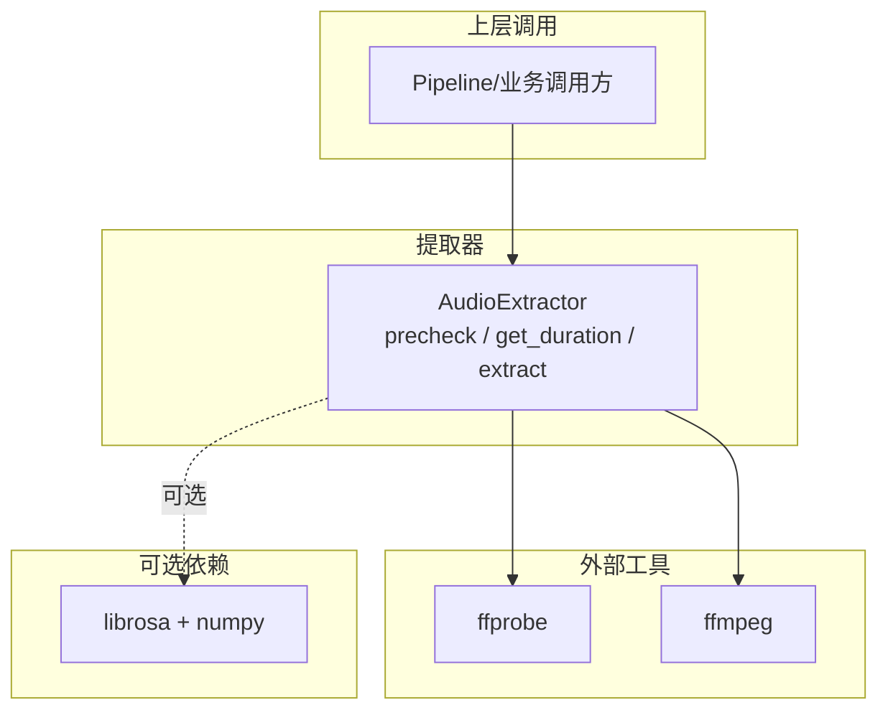
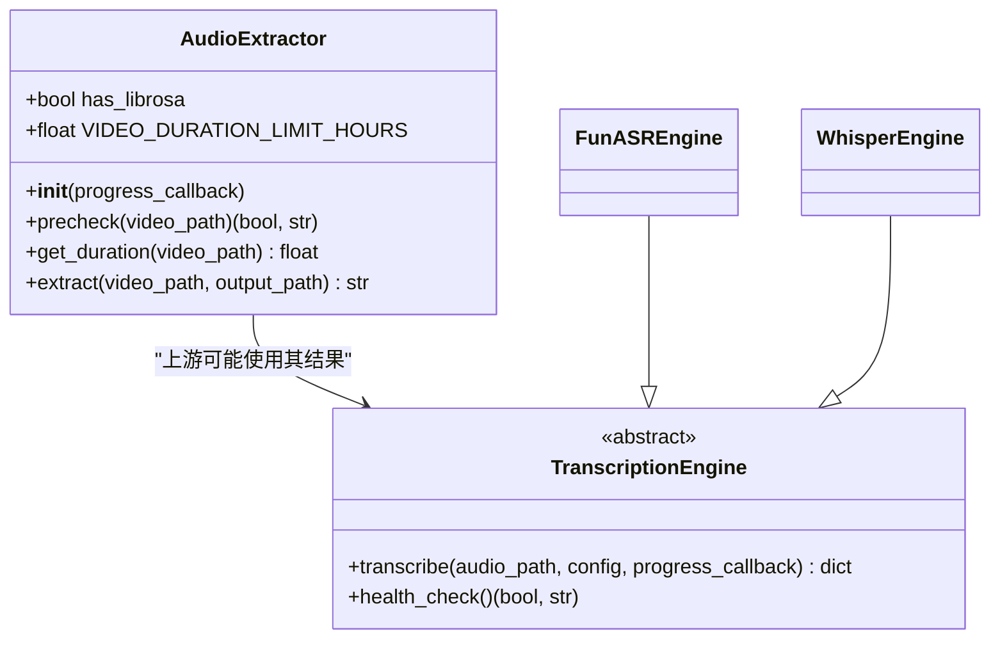
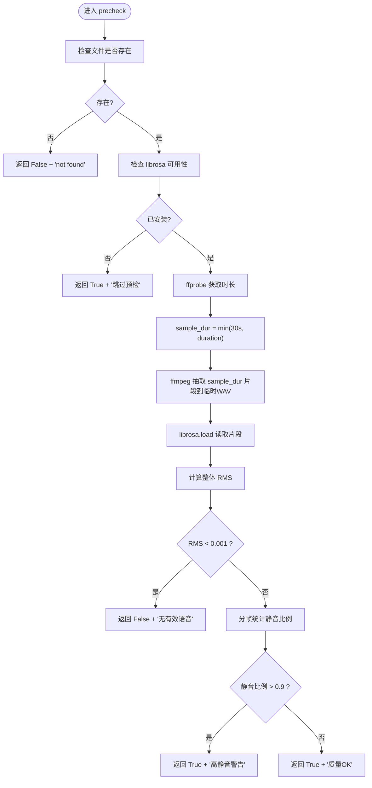
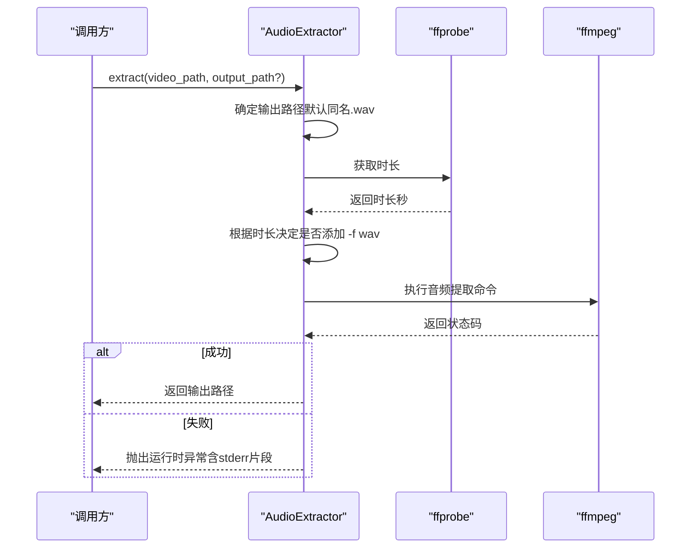
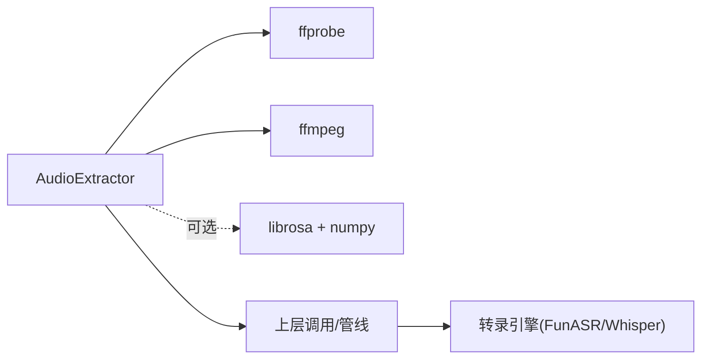

# 音频提取与预处理

<cite>
**本文引用的文件**
- [audio.py](file://video_splitter/extractor/audio.py)
- [engines.py](file://video_splitter/extractor/engines.py)
- [config.py](file://video_splitter/config.py)
- [test_audio.py](file://video_splitter/tests/test_audio.py)
</cite>

## 目录
1. [简介](#简介)
2. [项目结构](#项目结构)
3. [核心组件](#核心组件)
4. [架构总览](#架构总览)
5. [详细组件分析](#详细组件分析)
6. [依赖关系分析](#依赖关系分析)
7. [性能考量](#性能考量)
8. [故障排查指南](#故障排查指南)
9. [结论](#结论)
10. [附录：使用示例与最佳实践](#附录使用示例与最佳实践)

## 简介
本技术文档聚焦于音频提取模块，围绕 AudioExtractor 类的实现原理展开，涵盖视频格式验证、音频流提取、质量检查与格式转换。重点说明 precheck() 的预检逻辑（包含文件格式检查、时长估算、静音与响度评估）、extract() 的 FFmpeg 集成与编码参数配置，以及输出格式选择策略。同时提供阈值与配置项说明、常见问题定位方法与实际使用示例，帮助读者快速上手并稳定集成到业务管线中。

## 项目结构
音频提取相关代码位于 video_splitter/extractor 包内，核心类 AudioExtractor 定义在 audio.py；转录引擎与工具函数位于 engines.py；全局配置在 config.py；单元测试覆盖主要路径与异常分支，位于 tests/test_audio.py。

图表来源
- [audio.py:12-171](file://video_splitter/extractor/audio.py#L12-L171)
- [engines.py:48-83](file://video_splitter/extractor/engines.py#L48-L83)

章节来源
- [audio.py:12-171](file://video_splitter/extractor/audio.py#L12-L171)
- [engines.py:48-83](file://video_splitter/extractor/engines.py#L48-L83)

## 核心组件
- AudioExtractor：封装了音频预检、时长获取与音频提取能力，内部通过子进程调用 ffprobe 与 ffmpeg，并在可用时借助 librosa 进行轻量级音频质量评估。
- 关键方法
  - precheck(video_path): 返回 (is_ok, message)，用于快速判断是否具备可识别语音内容或存在明显问题。
  - get_duration(video_path): 基于 ffprobe 获取视频时长（秒）。
  - extract(video_path, output_path=None): 将视频中的音频以 16kHz 单声道 PCM WAV 形式提取出来，并根据时长动态调整输出参数。

章节来源
- [audio.py:12-171](file://video_splitter/extractor/audio.py#L12-L171)

## 架构总览
AudioExtractor 作为独立工具类，向上层提供统一接口；对外部工具 ffprobe 和 ffmpeg 的调用通过 subprocess 完成；可选依赖 librosa 仅在预检阶段参与计算。

图表来源
- [audio.py:12-171](file://video_splitter/extractor/audio.py#L12-L171)
- [engines.py:17-251](file://video_splitter/extractor/engines.py#L17-L251)

## 详细组件分析

### AudioExtractor 类设计要点
- 初始化
  - 检测可选依赖 librosa/numpy，设置 has_librosa 标志，以便在预检阶段按需启用质量分析。
- 预检流程 precheck()
  - 文件存在性校验
  - 若未安装 librosa，直接返回“跳过预检”的提示
  - 通过 ffprobe 获取时长，取 min(30s, 实际时长) 作为采样窗口
  - 使用 ffmpeg 抽取该窗口的 16kHz 单声道 PCM 片段至临时文件
  - 使用 librosa 加载片段，计算整体 RMS 与分帧静音比例
  - 根据阈值判定：RMS 过低视为无有效语音；静音比例过高给出警告
- 时长获取 get_duration()
  - 调用 ffprobe 解析 format.duration，失败时抛出异常
- 音频提取 extract()
  - 默认输出为输入同名 .wav
  - 先获取时长，按是否超过 2 小时决定命令参数差异（长视频省略 -f wav）
  - 统一采用 pcm_s16le、16kHz、单声道
  - 执行 ffmpeg 并处理错误码，失败抛错

图表来源
- [audio.py:26-99](file://video_splitter/extractor/audio.py#L26-L99)

章节来源
- [audio.py:26-99](file://video_splitter/extractor/audio.py#L26-L99)

### 预检算法与阈值说明
- 采样策略
  - 使用 ffprobe 获取总时长，采样窗口不超过 30 秒，兼顾效率与代表性。
- 信号质量指标
  - RMS（均方根能量）：衡量整体响度，低于阈值表示几乎无声。
  - 静音比例：以 0.1 秒为帧长，比较每帧能量与整体 RMS 的相对大小，统计静音帧占比。
- 阈值与行为
  - RMS < 0.001：判定为无有效语音，返回失败。
  - 静音比例 > 0.9：返回成功但附带警告，提示 ASR 可能不准确。
  - 其他情况：返回成功且报告 RMS 与静音比例。

章节来源
- [audio.py:26-99](file://video_splitter/extractor/audio.py#L26-L99)

### 提取流程 extract() 与 FFmpeg 集成
- 输出格式与编码
  - 固定输出为 16kHz、单声道、PCM 16bit（pcm_s16le），便于后续 ASR 处理。
- 时长自适应
  - 当视频时长超过 2 小时，省略 -f wav 参数以避免某些容器/编码器组合下的兼容性问题。
- 错误处理
  - 对 ffmpeg 非零退出码捕获 stderr 后抛出运行时异常，便于上层诊断。

图表来源
- [audio.py:130-171](file://video_splitter/extractor/audio.py#L130-L171)

章节来源
- [audio.py:130-171](file://video_splitter/extractor/audio.py#L130-L171)

### 时长获取 get_duration()
- 通过 ffprobe 的 JSON 或文本输出解析 duration
- 不存在文件或解析失败时抛出相应异常

章节来源
- [audio.py:101-129](file://video_splitter/extractor/audio.py#L101-L129)
- [engines.py:48-83](file://video_splitter/extractor/engines.py#L48-L83)

## 依赖关系分析
- 外部工具
  - ffprobe：用于获取媒体时长等元信息
  - ffmpeg：用于音视频转码与流提取
- Python 依赖
  - librosa、numpy：可选，仅用于预检阶段的音频质量分析
- 上层集成
  - 转录引擎（FunASR/Whisper）通常消费由 AudioExtractor 输出的 16kHz 单声道 WAV

图表来源
- [audio.py:12-171](file://video_splitter/extractor/audio.py#L12-L171)
- [engines.py:85-251](file://video_splitter/extractor/engines.py#L85-L251)

章节来源
- [audio.py:12-171](file://video_splitter/extractor/audio.py#L12-L171)
- [engines.py:85-251](file://video_splitter/extractor/engines.py#L85-L251)

## 性能考量
- 预检阶段
  - 采样窗口上限 30 秒，避免长视频带来的额外开销
  - 仅对短片段做 librosa 分析，降低 CPU 占用
- 提取阶段
  - 统一使用低采样率与单声道，显著减少 I/O 与内存占用
  - 长视频省略 -f wav 以降低容器写入开销
- 超时控制
  - 对 ffprobe/ffmpeg 调用设置了合理的超时时间，防止阻塞

[本节为通用指导，不直接分析具体文件]

## 故障排查指南
- 常见错误与定位
  - 文件不存在：precheck/get_duration 会明确提示或抛出 FileNotFoundError
  - ffprobe 不可用或超时：get_duration 抛出 RuntimeError，需检查 PATH 与系统环境
  - ffmpeg 提取失败：extract 抛出 RuntimeError，并附带 stderr 片段，建议查看最后 500 字符的错误信息
  - 缺少 librosa：precheck 自动降级为“跳过预检”，不影响后续提取
- 建议步骤
  - 确认 ffmpeg 与 ffprobe 已在系统 PATH 中
  - 对于长视频，优先使用 extract() 的默认路径，避免自定义输出路径权限问题
  - 若预检告警静音比例过高，考虑重新采集或降噪后再处理

章节来源
- [audio.py:26-171](file://video_splitter/extractor/audio.py#L26-L171)
- [test_audio.py:40-102](file://video_splitter/tests/test_audio.py#L40-L102)

## 结论
AudioExtractor 提供了稳健的视频音频提取与轻量预检能力：通过 ffprobe/ffmpeg 完成元信息与转码，结合 librosa 进行短时音频质量评估，并以统一的 16kHz 单声道 PCM WAV 输出对接下游 ASR。其设计简洁、容错良好，适合嵌入到视频处理流水线中。

[本节为总结性内容，不直接分析具体文件]

## 附录：使用示例与最佳实践

- 基本用法
  - 初始化：创建 AudioExtractor 实例，可选择传入进度回调（当前实现预留）
  - 预检：调用 precheck 快速判断音频是否具备可识别语音
  - 提取：调用 extract 得到 16kHz 单声道 WAV 文件
- 不同视频类型处理
  - 短视频（小于 2 小时）：默认添加 -f wav 输出
  - 长视频（大于 2 小时）：省略 -f wav 以提升兼容性
- 异常情况处理
  - 文件缺失：捕获 FileNotFoundError 或 precheck 返回的失败消息
  - 工具链缺失：确保 ffmpeg/ffprobe 可用；若无需预检，可忽略 librosa 缺失
  - 提取失败：捕获 RuntimeError 并记录 stderr 片段
- 参考测试用例
  - 预检路径、时长获取、提取路径及异常分支均有完整测试覆盖，可作为集成参考

章节来源
- [test_audio.py:17-253](file://video_splitter/tests/test_audio.py#L17-L253)
