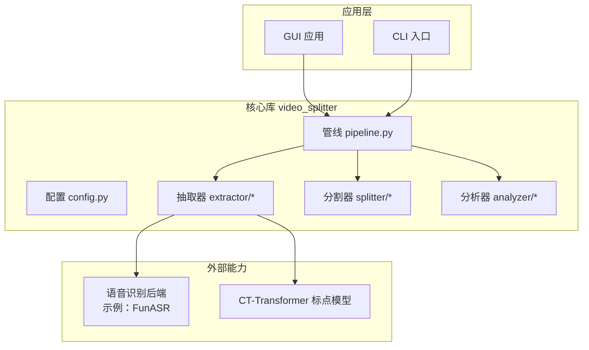
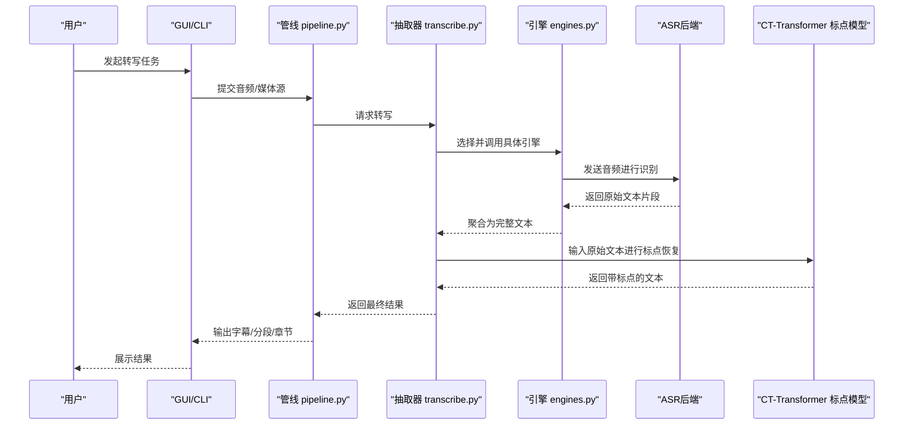
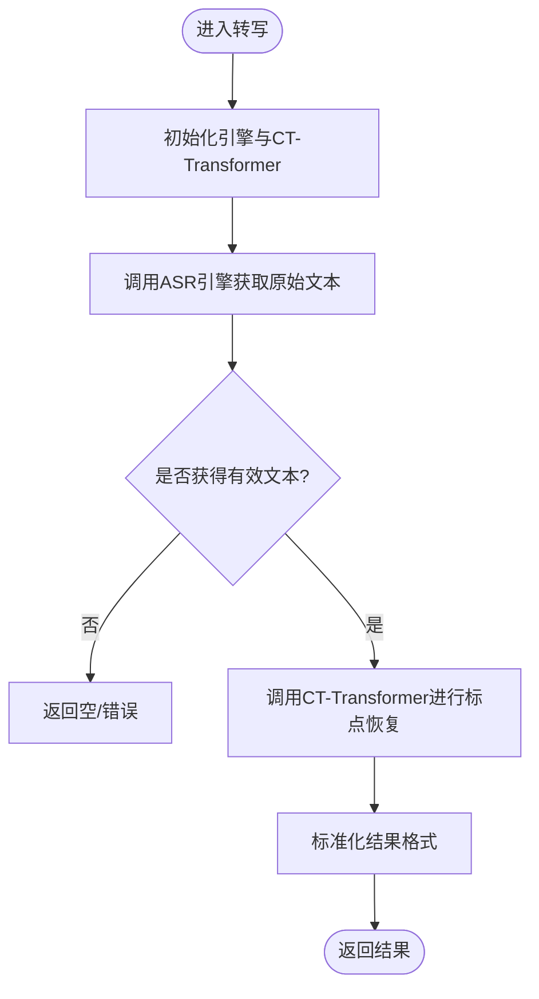
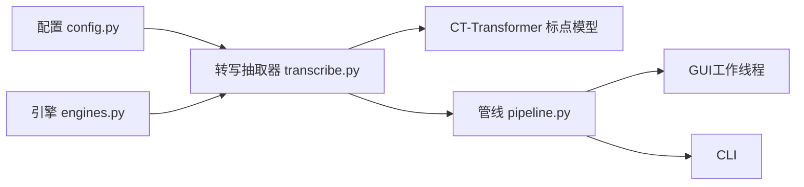

# CT-Transformer标点模型

<cite>
**本文引用的文件**   
- [README.md](file://README.md)
- [architecture.yaml](file://architecture.yaml)
- [video_splitter/config.py](file://video_splitter/config.py)
- [video_splitter/extractor/transcribe.py](file://video_splitter/extractor/transcribe.py)
- [video_splitter/extractor/engines.py](file://video_splitter/extractor/engines.py)
- [video_splitter/pipeline.py](file://video_splitter/pipeline.py)
- [gui/workers/transcribe_worker.py](file://gui/workers/transcribe_worker.py)
- [gui/workers/streaming_transcribe_worker.py](file://gui/workers/streaming_transcribe_worker.py)
- [tests/test_transcribe_funasr.py](file://tests/test_transcribe_funasr.py)
</cite>

## 目录
1. [简介](#简介)
2. [项目结构](#项目结构)
3. [核心组件](#核心组件)
4. [架构总览](#架构总览)
5. [详细组件分析](#详细组件分析)
6. [依赖关系分析](#依赖关系分析)
7. [性能考量](#性能考量)
8. [故障排查指南](#故障排查指南)
9. [结论](#结论)
10. [附录](#附录)

## 简介
本项目围绕“CT-Transformer标点模型”在语音转写与字幕处理流程中的集成与应用展开，重点覆盖以下方面：
- 将CT-Transformer作为标点恢复（Punctuation Restoration）能力嵌入到语音转写管线中
- 提供可插拔的转写引擎抽象，便于接入不同后端（如FunASR等）
- 在GUI与CLI两条路径上统一暴露转写与标点恢复能力
- 通过配置与测试保障工程化落地与稳定性

本仓库同时包含视频分割、章节提取、字幕烧录等周边能力，但本文聚焦于CT-Transformer标点模型的集成点、数据流与调用链。

## 项目结构
从代码组织看，项目采用分层+按功能域划分的方式：
- video_splitter：核心业务逻辑（配置、管线、抽取器、分割器等）
- gui：图形界面控制器、工作线程、控件
- tests：端到端与单元测试
- docs：设计文档与迁移方案
- 根级配置文件：requirements、pyproject、安装脚本等

图表来源
- [video_splitter/pipeline.py](file://video_splitter/pipeline.py)
- [video_spliter/extractor/transcribe.py](file://video_splitter/extractor/transcribe.py)
- [video_splitter/extractor/engines.py](file://video_splitter/extractor/engines.py)
- [video_splitter/config.py](file://video_splitter/config.py)

章节来源
- [README.md](file://README.md)
- [architecture.yaml](file://architecture.yaml)

## 核心组件
- 配置模块：集中管理CT-Transformer与转写后处理的参数（如是否启用标点恢复、模型路径、阈值等）
- 转写抽取器：封装对底层ASR后端的调用，并在返回结果上执行标点恢复
- 引擎抽象：定义统一的转写接口，支持多后端切换
- 管线编排：串联音频抽取、转写、标点恢复、章节/分割等步骤
- GUI工作线程：在UI线程外异步执行转写与标点恢复，避免界面卡顿
- 测试用例：验证CT-Transformer与FunASR等后端的集成正确性

章节来源
- [video_splitter/config.py](file://video_splitter/config.py)
- [video_splitter/extractor/transcribe.py](file://video_splitter/extractor/transcribe.py)
- [video_splitter/extractor/engines.py](file://video_splitter/extractor/engines.py)
- [video_splitter/pipeline.py](file://video_splitter/pipeline.py)
- [gui/workers/transcribe_worker.py](file://gui/workers/transcribe_worker.py)
- [gui/workers/streaming_transcribe_worker.py](file://gui/workers/streaming_transcribe_worker.py)
- [tests/test_transcribe_funasr.py](file://tests/test_transcribe_funasr.py)

## 架构总览
下图展示了CT-Transformer标点模型在整体系统中的位置与交互关系。

图表来源
- [video_splitter/pipeline.py](file://video_splitter/pipeline.py)
- [video_splitter/extractor/transcribe.py](file://video_splitter/extractor/transcribe.py)
- [video_splitter/extractor/engines.py](file://video_splitter/extractor/engines.py)

## 详细组件分析

### 配置模块（config.py）
职责
- 集中管理CT-Transformer相关开关与参数（例如是否启用标点恢复、模型加载路径、设备选择、批大小等）
- 为抽取器与管线提供默认值与校验

关键点
- 提供结构化配置对象，便于扩展新字段
- 与GUI/CLI共享同一份配置，保证行为一致

章节来源
- [video_splitter/config.py](file://video_splitter/config.py)

### 转写抽取器（transcribe.py）
职责
- 封装对底层ASR后端的调用
- 在得到原始文本后，调用CT-Transformer进行标点恢复
- 将结果标准化为统一的数据结构供上层使用

关键流程
- 初始化引擎与CT-Transformer实例
- 接收音频或已解码文本
- 调用引擎获取原始文本
- 调用CT-Transformer进行标点恢复
- 返回规范化后的结果

图表来源
- [video_splitter/extractor/transcribe.py](file://video_splitter/extractor/transcribe.py)

章节来源
- [video_splitter/extractor/transcribe.py](file://video_splitter/extractor/transcribe.py)

### 引擎抽象（engines.py）
职责
- 定义统一的转写接口（如方法签名、异常类型、进度回调等）
- 提供具体引擎实现（例如基于FunASR的实现），屏蔽后端差异

要点
- 新增后端只需实现统一接口
- 抽取器无需关心具体后端细节

章节来源
- [video_splitter/extractor/engines.py](file://video_splitter/extractor/engines.py)

### 管线编排（pipeline.py）
职责
- 串联音频抽取、转写、标点恢复、章节/分割等步骤
- 协调各阶段状态与错误传播
- 对外暴露统一的API供GUI/CLI调用

章节来源
- [video_splitter/pipeline.py](file://video_splitter/pipeline.py)

### GUI工作线程（transcribe_worker.py / streaming_transcribe_worker.py）
职责
- 在独立线程中执行转写与标点恢复，避免阻塞UI
- 向主线程回传进度与结果事件
- 支持流式与非流式两种模式

章节来源
- [gui/workers/transcribe_worker.py](file://gui/workers/transcribe_worker.py)
- [gui/workers/streaming_transcribe_worker.py](file://gui/workers/streaming_transcribe_worker.py)

### 测试（test_transcribe_funasr.py）
职责
- 验证FunASR等后端与抽取器的集成
- 覆盖常见边界条件与错误场景
- 确保CT-Transformer在集成链路中的可用性

章节来源
- [tests/test_transcribe_funasr.py](file://tests/test_transcribe_funasr.py)

## 依赖关系分析
- 低耦合：抽取器通过引擎抽象与ASR后端解耦；CT-Transformer仅作为可选的后处理模块
- 高内聚：每个模块职责清晰，配置集中在单一位置
- 可扩展：新增ASR后端或标点模型仅需实现相应接口

图表来源
- [video_splitter/config.py](file://video_splitter/config.py)
- [video_splitter/extractor/transcribe.py](file://video_splitter/extractor/transcribe.py)
- [video_splitter/extractor/engines.py](file://video_splitter/extractor/engines.py)
- [video_splitter/pipeline.py](file://video_splitter/pipeline.py)
- [gui/workers/transcribe_worker.py](file://gui/workers/transcribe_worker.py)

章节来源
- [video_splitter/config.py](file://video_splitter/config.py)
- [video_splitter/extractor/transcribe.py](file://video_splitter/extractor/transcribe.py)
- [video_splitter/extractor/engines.py](file://video_splitter/extractor/engines.py)
- [video_splitter/pipeline.py](file://video_splitter/pipeline.py)
- [gui/workers/transcribe_worker.py](file://gui/workers/transcribe_worker.py)

## 性能考量
- 批处理与缓存：对长文本进行分块标点恢复时，合理设置批次大小与缓存策略可降低延迟
- 设备选择：根据可用GPU/CPU资源选择合适的运行设备，避免内存溢出
- 并发控制：GUI侧限制并发任务数，防止资源争用导致卡顿
- 流式优化：对于实时场景，优先使用流式工作线程以减少首字延迟

[本节为通用指导，不直接分析具体文件]

## 故障排查指南
常见问题与定位建议
- 无法加载CT-Transformer模型
  - 检查配置中的模型路径与设备设置是否正确
  - 确认依赖库版本兼容
- 转写结果为空或乱码
  - 检查ASR后端日志与网络连通性
  - 确认音频格式与采样率是否符合要求
- 界面卡死或响应缓慢
  - 检查是否在主线程执行耗时操作
  - 调整并发度与批大小
- 标点恢复效果不佳
  - 调整CT-Transformer相关阈值与分句策略
  - 检查上游ASR文本质量与噪声水平

章节来源
- [video_splitter/config.py](file://video_splitter/config.py)
- [video_splitter/extractor/transcribe.py](file://video_splitter/extractor/transcribe.py)
- [gui/workers/transcribe_worker.py](file://gui/workers/transcribe_worker.py)
- [gui/workers/streaming_transcribe_worker.py](file://gui/workers/streaming_transcribe_worker.py)

## 结论
通过将CT-Transformer标点模型以可插拔方式集成到转写管线中，项目在保持良好扩展性的同时提升了可读性与可用性。配合统一的引擎抽象与完善的测试，能够在多种ASR后端上稳定复用标点恢复能力。后续可在批处理策略、流式优化与监控指标方面继续完善。

[本节为总结性内容，不直接分析具体文件]

## 附录
- 如需快速上手，请参考根级说明与安装脚本
- 更多架构与设计细节可参考架构文档与迁移设计

[本节为补充信息，不直接分析具体文件]
