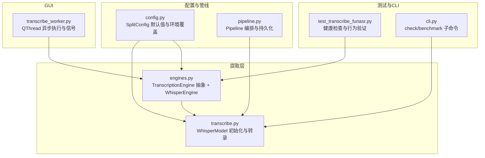
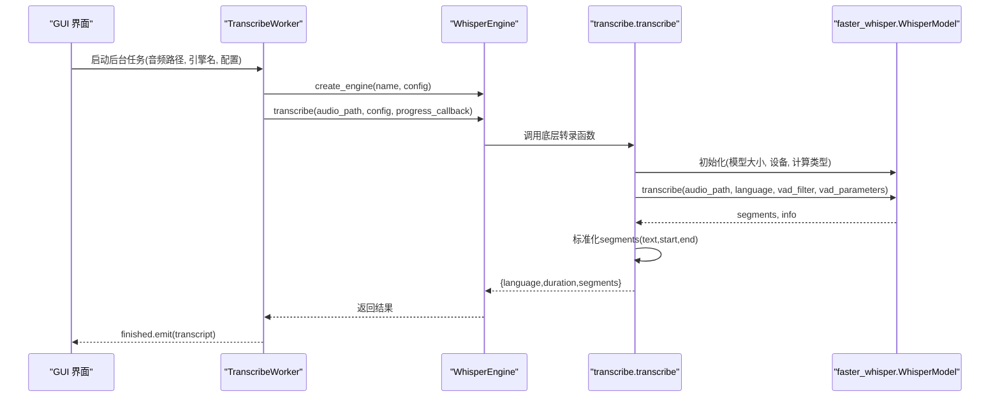
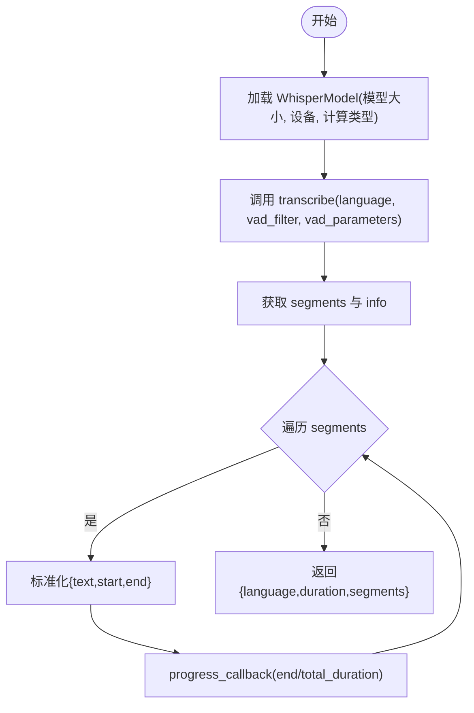
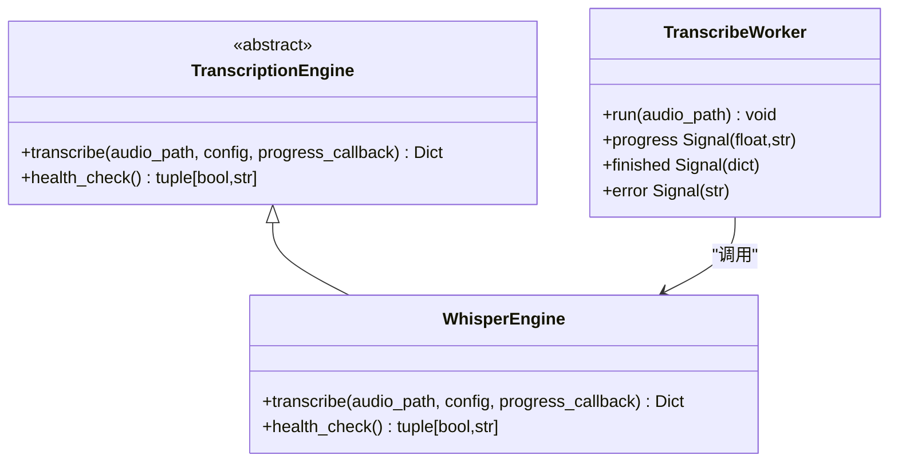
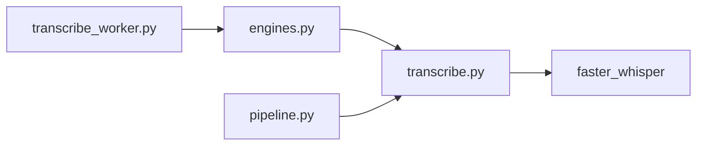

# Faster-Whisper集成

<cite>
**本文引用的文件**
- [video_splitter/extractor/transcribe.py](file://video_splitter/extractor/transcribe.py)
- [video_splitter/extractor/engines.py](file://video_splitter/extractor/engines.py)
- [video_splitter/config.py](file://video_splitter/config.py)
- [video_splitter/pipeline.py](file://video_splitter/pipeline.py)
- [gui/workers/transcribe_worker.py](file://gui/workers/transcribe_worker.py)
- [tests/test_transcribe_funasr.py](file://tests/test_transcribe_funasr.py)
- [video_splitter/cli.py](file://video_splitter/cli.py)
</cite>

## 目录
1. [简介](#简介)
2. [项目结构](#项目结构)
3. [核心组件](#核心组件)
4. [架构总览](#架构总览)
5. [详细组件分析](#详细组件分析)
6. [依赖关系分析](#依赖关系分析)
7. [性能与内存考量](#性能与内存考量)
8. [故障排查指南](#故障排查指南)
9. [结论](#结论)
10. [附录：API调用示例与最佳实践](#附录api调用示例与最佳实践)

## 简介
本技术文档聚焦于项目中 Faster-Whisper 引擎的集成实现，围绕 WhisperModel 的初始化配置、转录流程参数（语言检测、VAD过滤、静音处理）、进度回调机制、结果数据结构转换、错误处理模式与重试策略、以及不同模型的性能对比与内存使用进行分析。同时提供面向开发者的 API 调用示例与最佳实践建议，帮助读者快速理解并正确使用该集成。

## 项目结构
Faster-Whisper 集成主要位于提取器模块中，并通过可插拔引擎抽象与 GUI 工作线程进行协作。关键文件如下：
- 转录核心逻辑：video_splitter/extractor/transcribe.py
- 引擎抽象与工厂：video_splitter/extractor/engines.py
- 配置数据类：video_splitter/config.py
- 管线编排：video_splitter/pipeline.py
- GUI 后台工作线程：gui/workers/transcribe_worker.py
- 单元测试：tests/test_transcribe_funasr.py
- CLI 检查与基准：video_splitter/cli.py

图表来源
- [video_splitter/extractor/transcribe.py:1-105](file://video_splitter/extractor/transcribe.py#L1-L105)
- [video_splitter/extractor/engines.py:175-220](file://video_splitter/extractor/engines.py#L175-L220)
- [video_splitter/config.py:19-37](file://video_splitter/config.py#L19-L37)
- [video_splitter/pipeline.py:21-111](file://video_splitter/pipeline.py#L21-L111)
- [gui/workers/transcribe_worker.py:16-49](file://gui/workers/transcribe_worker.py#L16-L49)
- [tests/test_transcribe_funasr.py:199-222](file://tests/test_transcribe_funasr.py#L199-L222)
- [video_splitter/cli.py:85-152](file://video_splitter/cli.py#L85-L152)

章节来源
- [video_splitter/extractor/transcribe.py:1-105](file://video_splitter/extractor/transcribe.py#L1-L105)
- [video_splitter/extractor/engines.py:175-220](file://video_splitter/extractor/engines.py#L175-L220)
- [video_splitter/config.py:19-37](file://video_splitter/config.py#L19-L37)
- [video_splitter/pipeline.py:21-111](file://video_splitter/pipeline.py#L21-L111)
- [gui/workers/transcribe_worker.py:16-49](file://gui/workers/transcribe_worker.py#L16-L49)
- [tests/test_transcribe_funasr.py:199-222](file://tests/test_transcribe_funasr.py#L199-L222)
- [video_splitter/cli.py:85-152](file://video_splitter/cli.py#L85-L152)

## 核心组件
- WhisperModel 初始化与转录
  - 通过 SplitConfig 传入 model_size、device、compute_type 等参数，实例化 WhisperModel 并调用 transcribe。
  - 启用 VAD 过滤，设置最小静音时长阈值，自动识别语言字段。
  - 将原生 segment 对象映射为标准化字典列表，包含 text、start、end。
- 引擎抽象与工厂
  - TranscriptionEngine 定义统一接口；WhisperEngine 作为 faster-whisper 的具体实现，负责转发进度回调与健康检查。
  - create_engine 根据名称创建具体引擎实例。
- 配置管理
  - SplitConfig 提供默认值与环境变量覆盖，包括设备选择、计算类型、语言、引擎名等。
- 管线编排
  - Pipeline 在转录后生成 SRT、估计 token 数、章节检测与切割，支持断点续跑与中间结果持久化。
- GUI 工作线程
  - TranscribeWorker 在 QThread 中运行，封装进度信号与完成/错误信号，便于 UI 更新。

章节来源
- [video_splitter/extractor/transcribe.py:11-59](file://video_splitter/extractor/transcribe.py#L11-L59)
- [video_splitter/extractor/engines.py:175-220](file://video_splitter/extractor/engines.py#L175-L220)
- [video_splitter/config.py:19-37](file://video_splitter/config.py#L19-L37)
- [video_splitter/pipeline.py:21-111](file://video_splitter/pipeline.py#L21-L111)
- [gui/workers/transcribe_worker.py:16-49](file://gui/workers/transcribe_worker.py#L16-L49)

## 架构总览
下图展示了从 GUI 到 Faster-Whisper 的完整调用链与数据流。

图表来源
- [gui/workers/transcribe_worker.py:33-49](file://gui/workers/transcribe_worker.py#L33-L49)
- [video_splitter/extractor/engines.py:175-205](file://video_splitter/extractor/engines.py#L175-L205)
- [video_splitter/extractor/transcribe.py:27-59](file://video_splitter/extractor/transcribe.py#L27-L59)

## 详细组件分析

### WhisperModel 初始化与配置
- 模型大小选择
  - 由 SplitConfig.model_size 指定，默认值为 large-v3。
  - CLI 支持 --model 参数覆盖，可选 tiny/base/small/medium/large-v3。
- 设备分配
  - 由 SplitConfig.device 指定，默认 auto，可通过环境变量 VIDEO_SPLITTER_DEVICE 覆盖。
- 计算类型设置
  - 由 SplitConfig.compute_type 指定，默认 auto，用于控制量化或半精度推理。
- 初始化位置
  - 在转录函数内动态导入 WhisperModel 并构造实例，避免未安装时的启动失败。

章节来源
- [video_splitter/config.py:20-23](file://video_splitter/config.py#L20-L23)
- [video_splitter/config.py:47-52](file://video_splitter/config.py#L47-L52)
- [video_splitter/extractor/transcribe.py:27-33](file://video_splitter/extractor/transcribe.py#L27-L33)
- [video_splitter/cli.py:214](file://video_splitter/cli.py#L214)

### 转录过程核心参数
- 语言检测
  - 使用 config.language 传入，Whisper 会返回 info.language 作为最终语言字段。
- VAD 过滤与静音处理
  - 开启 vad_filter=True，vad_parameters 中 min_silence_duration_ms=500，用于过滤长段静音。
- 进度回调
  - 基于每个 segment 的 end 时间除以 total_duration 计算进度比例，逐段触发回调。

图表来源
- [video_splitter/extractor/transcribe.py:29-59](file://video_splitter/extractor/transcribe.py#L29-L59)

章节来源
- [video_splitter/extractor/transcribe.py:35-59](file://video_splitter/extractor/transcribe.py#L35-L59)

### 进度回调机制
- 内部实现
  - 每处理一个 segment，按 end/total_duration 计算进度，并调用 progress_callback(frac)。
- 引擎包装
  - WhisperEngine 将内部单参回调转换为双参回调 (frac, description)，以便 GUI 显示描述信息。
- GUI 集成
  - TranscribeWorker 将进度信号发射给 UI，并在完成后发射 finished 信号。

图表来源
- [video_splitter/extractor/engines.py:17-46](file://video_splitter/extractor/engines.py#L17-L46)
- [video_splitter/extractor/engines.py:175-220](file://video_splitter/extractor/engines.py#L175-L220)
- [gui/workers/transcribe_worker.py:16-49](file://gui/workers/transcribe_worker.py#L16-L49)

章节来源
- [video_splitter/extractor/transcribe.py:44-54](file://video_splitter/extractor/transcribe.py#L44-L54)
- [video_splitter/extractor/engines.py:194-205](file://video_splitter/extractor/engines.py#L194-L205)
- [gui/workers/transcribe_worker.py:33-49](file://gui/workers/transcribe_worker.py#L33-L49)

### 转录结果的数据结构转换
- 原生格式
  - Whisper 返回 segments 迭代器与 info 对象，包含 duration、language 等元信息。
- 标准化输出
  - 将每个 segment 的 text、start、end 转为浮点秒级时间戳，保留两位小数。
  - 返回统一结构：{language, duration, segments}，其中 segments 为列表。
- 工具函数
  - estimate_tokens：粗略估算文本 token 数量，用于成本预估。
  - to_srt：将标准化 transcript 转换为 SRT 字幕字符串。

章节来源
- [video_splitter/extractor/transcribe.py:44-59](file://video_splitter/extractor/transcribe.py#L44-L59)
- [video_splitter/extractor/transcribe.py:62-105](file://video_splitter/extractor/transcribe.py#L62-L105)

### 错误处理与重试机制
- 健康检查
  - WhisperEngine.health_check 尝试导入 faster_whisper，若缺失则返回失败消息。
- 异常捕获
  - TranscribeWorker.run 捕获异常并发出 error 信号，避免阻塞 UI。
- 重试策略
  - 当前代码未实现针对 Whisper 的重试逻辑；可在上层（如 GUI 或批量处理）增加指数退避与最大重试次数。

章节来源
- [video_splitter/extractor/engines.py:207-220](file://video_splitter/extractor/engines.py#L207-L220)
- [gui/workers/transcribe_worker.py:47-49](file://gui/workers/transcribe_worker.py#L47-L49)

### 实际 API 调用示例与最佳实践
- 命令行方式
  - 仅转录：使用 cli 的 transcribe 子命令，支持 --model 选择模型大小。
  - 环境检查与基准：使用 check 子命令，内置 tiny/cpu 的快速基准。
- 程序化调用
  - 通过 create_engine("whisper") 获取引擎实例，再调用 transcribe(audio_path, config, progress_callback)。
- 最佳实践
  - 合理选择 compute_type（如 int8 或 float16）以平衡速度与精度。
  - 在长音频场景下，结合 VAD 过滤减少无效片段。
  - 使用进度回调更新 UI，提升用户体验。
  - 对网络或外部依赖进行健康检查，提前发现环境问题。

章节来源
- [video_splitter/cli.py:48-65](file://video_splitter/cli.py#L48-L65)
- [video_splitter/cli.py:85-152](file://video_splitter/cli.py#L85-L152)
- [video_splitter/extractor/engines.py:228-251](file://video_splitter/extractor/engines.py#L228-L251)

## 依赖关系分析
- 模块耦合
  - engines.py 依赖 transcribe.py 的核心实现；transcribe.py 依赖 faster_whisper 库。
  - pipeline.py 直接调用 transcribe.py 的工具函数（estimate_tokens、to_srt）。
  - gui/workers/transcribe_worker.py 通过 create_engine 动态选择引擎。
- 外部依赖
  - faster_whisper：语音识别核心库。
  - PySide6：GUI 框架（仅在 GUI 路径中使用）。
  - FFmpeg/ffprobe：用于音频提取与时长探测（FunASR 引擎也使用）。

图表来源
- [video_splitter/extractor/engines.py:175-205](file://video_splitter/extractor/engines.py#L175-L205)
- [video_splitter/extractor/transcribe.py:27-33](file://video_splitter/extractor/transcribe.py#L27-L33)
- [video_splitter/pipeline.py:13](file://video_splitter/pipeline.py#L13)
- [gui/workers/transcribe_worker.py:10](file://gui/workers/transcribe_worker.py#L10)

章节来源
- [video_splitter/extractor/engines.py:175-251](file://video_splitter/extractor/engines.py#L175-L251)
- [video_splitter/extractor/transcribe.py:1-105](file://video_splitter/extractor/transcribe.py#L1-L105)
- [video_splitter/pipeline.py:1-131](file://video_splitter/pipeline.py#L1-L131)
- [gui/workers/transcribe_worker.py:1-49](file://gui/workers/transcribe_worker.py#L1-L49)

## 性能与内存考量
- 模型大小与速度
  - CLI 的 check 子命令使用 tiny 模型在 CPU 上进行快速基准，并提供 large-v3 的粗略时延估算。
  - 大模型（large-v3）在 CPU 上耗时显著增加，建议在可用 GPU 环境下运行以获得更好吞吐。
- 计算类型与内存占用
  - compute_type 影响显存与内存占用；int8 可降低资源消耗但可能影响精度。
  - 在长音频处理中，建议结合 VAD 过滤以减少无效片段，降低整体处理量。
- 基准参考
  - CLI 提供“10s 音频”的基准计时，可用于横向比较不同设备与模型组合。

章节来源
- [video_splitter/cli.py:101-128](file://video_splitter/cli.py#L101-L128)
- [video_splitter/extractor/transcribe.py:39-41](file://video_splitter/extractor/transcribe.py#L39-L41)

## 故障排查指南
- 依赖缺失
  - health_check 会检测 faster_whisper 是否安装，若缺失将返回明确提示。
- 进度无更新
  - 确认 progress_callback 是否正确传递至引擎与 worker；确保 total_duration > 0 以避免除零。
- 结果异常
  - 检查 vad_parameters 中的静音阈值是否过大导致片段丢失；适当调整 min_silence_duration_ms。
- 环境兼容
  - 使用 CLI 的 check 子命令验证依赖与基准；必要时切换 compute_type 或 device。

章节来源
- [video_splitter/extractor/engines.py:207-220](file://video_splitter/extractor/engines.py#L207-L220)
- [video_splitter/extractor/transcribe.py:50-54](file://video_splitter/extractor/transcribe.py#L50-L54)
- [video_splitter/cli.py:85-152](file://video_splitter/cli.py#L85-L152)

## 结论
本项目对 Faster-Whisper 的集成采用清晰的抽象与分层设计：引擎抽象统一接口，核心转录逻辑集中在独立模块，GUI 通过工作线程安全地消费进度与结果。配置项覆盖模型大小、设备与计算类型，满足多场景需求。进度回调与结果标准化提升了可观测性与易用性。尽管当前未内置重试机制，但可在上层扩展以实现更强的鲁棒性。

## 附录：API调用示例与最佳实践
- 命令行示例
  - 转录：video_splitter transcribe <视频路径> --model large-v3
  - 检查：video_splitter check
- 程序化示例
  - 创建引擎：engine = create_engine("whisper", config)
  - 调用转录：result = engine.transcribe(audio_path, config, progress_callback=lambda f, d: print(f"{d}: {f:.2%}"))
- 最佳实践
  - 在 GPU 可用时使用 device="cuda"，compute_type 选择 float16 或 int8 以优化性能。
  - 长音频建议使用 VAD 过滤，并根据内容调整静音阈值。
  - 在 GUI 中绑定进度信号，实时更新用户界面。
  - 对关键步骤添加健康检查与日志记录，便于问题定位。

章节来源
- [video_splitter/cli.py:48-65](file://video_splitter/cli.py#L48-L65)
- [video_splitter/cli.py:85-152](file://video_splitter/cli.py#L85-L152)
- [video_splitter/extractor/engines.py:228-251](file://video_splitter/extractor/engines.py#L228-L251)
- [gui/workers/transcribe_worker.py:33-49](file://gui/workers/transcribe_worker.py#L33-L49)
