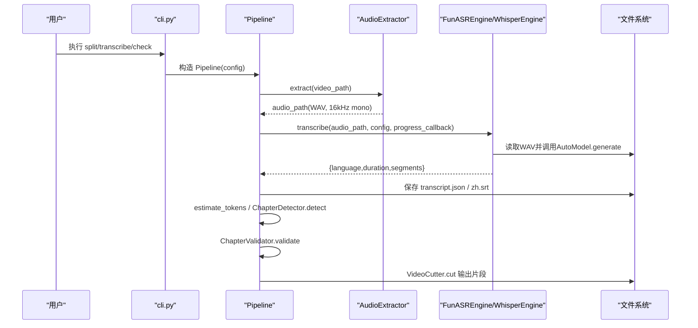
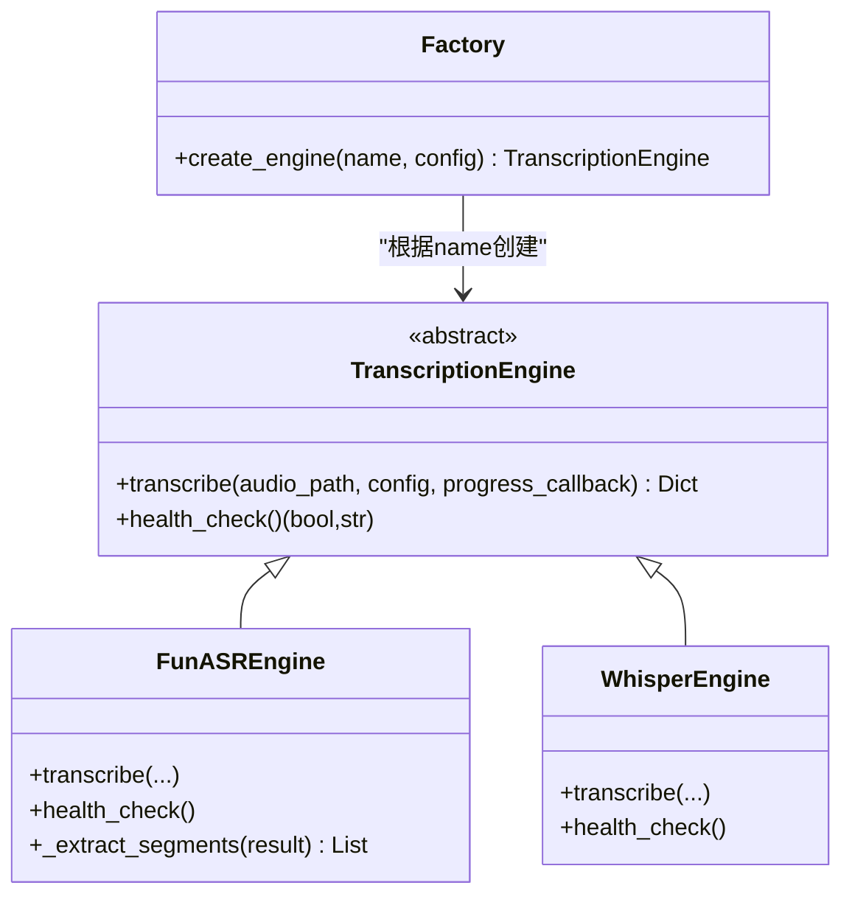
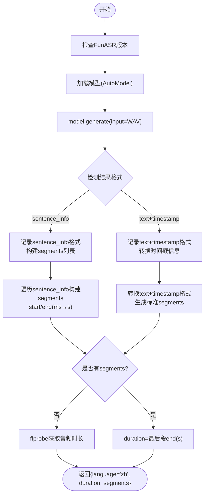
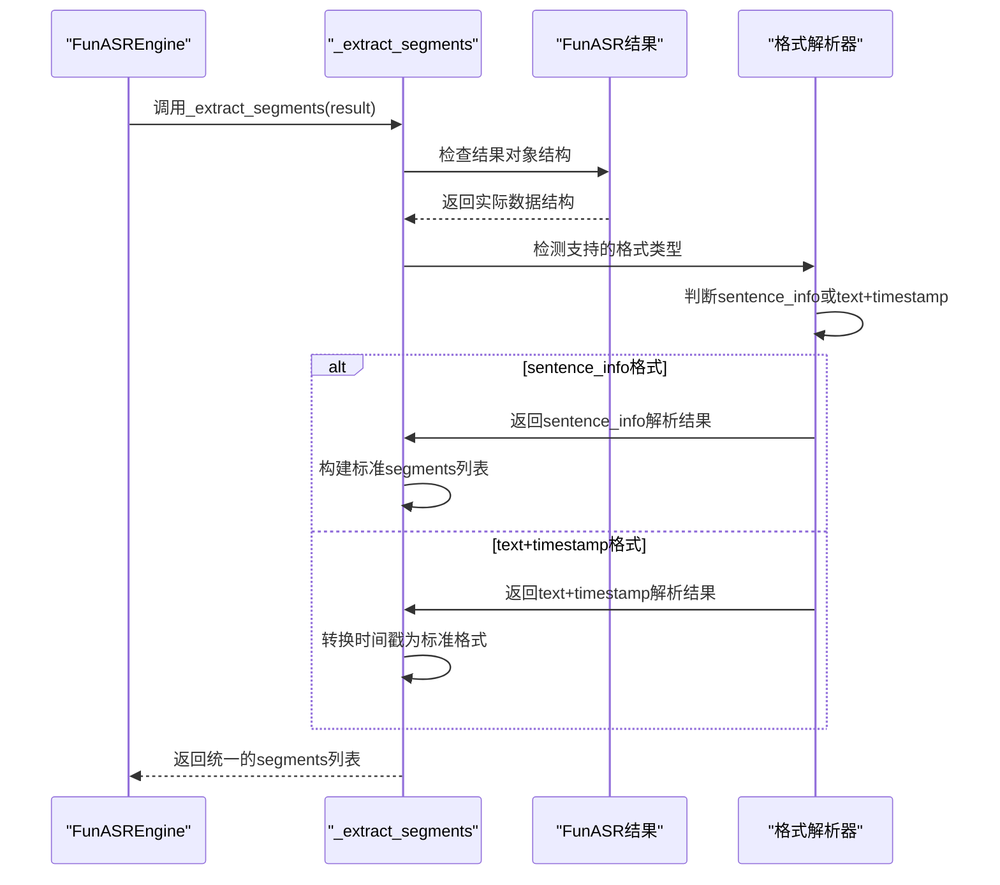
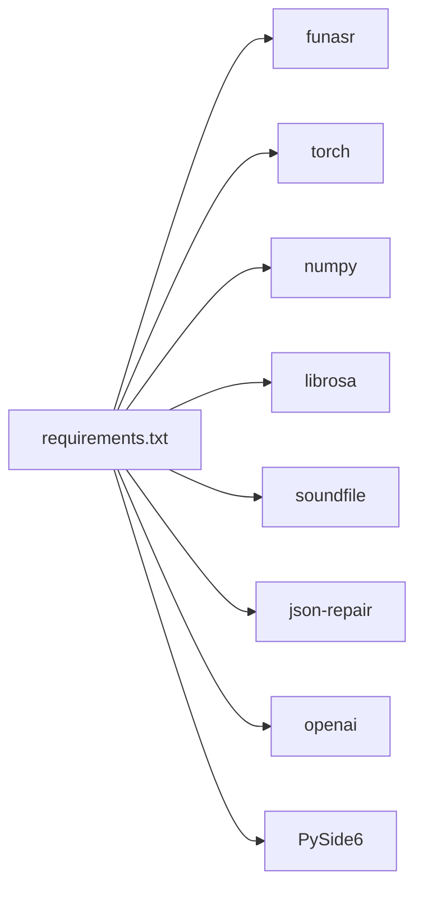

# FunASR集成

<cite>
**本文引用的文件**   
- [迁移设计文档](file://docs/funasr-migration-design.md)
- [转写模块（旧实现）](file://video_splitter/extractor/transcribe.py)
- [可插拔引擎与FunASR实现](file://video_splitter/extractor/engines.py)
- [配置管理](file://video_splitter/config.py)
- [主流程编排](file://video_splitter/pipeline.py)
- [命令行入口](file://video_splitter/cli.py)
- [单元测试（FunASR）](file://tests/test_transcribe_funasr.py)
- [依赖清单](file://requirements.txt)
</cite>

## 更新摘要
**变更内容**   
- 修复了FunASR 1.3.x Paraformer模型的段提取兼容性，实现了双格式支持（sentence_info和text+timestamp）
- 增强了_extract_segments方法的健壮性，改进了字幕生成的可靠性
- 优化了不同FunASR版本间的API差异处理，提升了系统稳定性
- 完善了错误处理和降级机制，确保在各种环境下的稳定运行

## 目录
1. [简介](#简介)
2. [项目结构](#项目结构)
3. [核心组件](#核心组件)
4. [架构总览](#架构总览)
5. [详细组件分析](#详细组件分析)
6. [依赖关系分析](#依赖关系分析)
7. [性能考量](#性能考量)
8. [故障排查指南](#故障排查指南)
9. [结论](#结论)
10. [附录：迁移与使用示例](#附录迁移与使用示例)

## 简介
本技术文档围绕将语音识别引擎从 faster-whisper 迁移到 FunASR 的集成方案，系统阐述整体架构、模型加载与配置、与 faster-whisper 的差异对比、FunASR 特性说明、迁移步骤与参数映射、性能基准与优化建议，以及完整集成示例和故障排查方法。目标是帮助开发者快速理解并落地 FunASR 在视频切分流水线中的集成方式。

**更新** 本次更新重点修复了FunASR 1.3.x Paraformer模型的段提取兼容性问题，实现了双格式支持（sentence_info和text+timestamp），显著提升了字幕生成的可靠性和系统稳定性。

## 项目结构
本项目采用"可插拔引擎"的设计，将 ASR 引擎抽象为统一接口，默认使用 FunASR，同时保留 Whisper 引擎作为兼容选项。关键路径如下：
- 配置层：SplitConfig 提供统一的配置项与环境变量覆盖
- 引擎层：TranscriptionEngine 抽象 + FunASREngine / WhisperEngine 具体实现
- 流程层：Pipeline 编排音频提取、转写、章节检测、校验与切割
- CLI 层：命令行工具暴露 split、transcribe、check 等子命令

```mermaid
graph TB
subgraph "配置"
CFG["SplitConfig"]
end
subgraph "引擎"
IFace["TranscriptionEngine(抽象)"]
FASR["FunASREngine"]
WHISPER["WhisperEngine"]
end
subgraph "流程"
PIPE["Pipeline"]
TRANS["transcribe() 旧实现"]
end
subgraph "CLI"
CLI["cli.py"]
end
CFG --> PIPE
IFace --> FASR
IFace --> WHISPER
PIPE --> FASR
PIPE -.可选.-> WHISPER
CLI --> PIPE
TRANS -.兼容/旧路径.-> WHISPER
```

图表来源
- [配置管理:1-54](file://video_splitter/config.py#L1-L54)
- [可插拔引擎与FunASR实现:1-251](file://video_splitter/extractor/engines.py#L1-L251)
- [主流程编排:1-131](file://video_splitter/pipeline.py#L1-L131)
- [命令行入口:1-256](file://video_splitter/cli.py#L1-L256)
- [转写模块（旧实现）:1-105](file://video_splitter/extractor/transcribe.py#L1-L105)

章节来源
- [配置管理:1-54](file://video_splitter/config.py#L1-L54)
- [可插拔引擎与FunASR实现:1-251](file://video_splitter/extractor/engines.py#L1-L251)
- [主流程编排:1-131](file://video_splitter/pipeline.py#L1-L131)
- [命令行入口:1-256](file://video_splitter/cli.py#L1-L256)
- [转写模块（旧实现）:1-105](file://video_splitter/extractor/transcribe.py#L1-L105)

## 核心组件
- SplitConfig：集中管理模型、设备、语言、分段策略、LLM 调用等配置，支持环境变量覆盖；默认启用 transcription_engine="funasr"
- TranscriptionEngine：定义统一的 transcribe 与 health_check 接口
- FunASREngine：基于 FunASR AutoModel 的中文识别实现，支持离线模型目录与环境变量切换，**已增强段提取兼容性和双格式支持**
- WhisperEngine：对旧实现的封装，保持向后兼容
- Pipeline：串联音频提取、转写、SRT 生成、章节检测、校验与切割
- CLI：提供 split、transcribe、check 等命令，便于端到端验证与测试

**更新** FunASREngine现在实现了增强的段提取兼容性，支持FunASR 1.3.x版本的Paraformer模型，能够自动识别和处理两种不同的结果格式（sentence_info和text+timestamp），显著提升了字幕生成的可靠性。

章节来源
- [配置管理:1-54](file://video_splitter/config.py#L1-L54)
- [可插拔引擎与FunASR实现:1-251](file://video_splitter/extractor/engines.py#L1-L251)
- [主流程编排:1-131](file://video_splitter/pipeline.py#L1-L131)
- [命令行入口:1-256](file://video_splitter/cli.py#L1-L256)

## 架构总览
下图展示 FunASR 集成后的数据流与控制流：CLI 接收参数 → Pipeline 初始化 → 音频提取 → 选择引擎进行转写 → 输出 SRT 与中间结果 → 章节检测与校验 → 切割输出。



图表来源
- [命令行入口:1-256](file://video_splitter/cli.py#L1-L256)
- [主流程编排:1-131](file://video_splitter/pipeline.py#L1-L131)
- [可插拔引擎与FunASR实现:1-251](file://video_splitter/extractor/engines.py#L1-L251)

## 详细组件分析

### 引擎抽象与工厂
- TranscriptionEngine 定义统一接口：transcribe 返回标准转录字典；health_check 用于依赖可用性检查
- create_engine(name="funasr") 通过注册表创建具体引擎实例，默认 FunASR，支持回退到 Whisper



图表来源
- [可插拔引擎与FunASR实现:1-251](file://video_splitter/extractor/engines.py#L1-L251)

章节来源
- [可插拔引擎与FunASR实现:1-251](file://video_splitter/extractor/engines.py#L1-L251)

### FunASR 引擎实现要点
- 模型加载：通过环境变量 VIDEO_SPLITTER_FUNASR_MODEL_DIR 指定本地或远程模型路径，未设置则使用内置默认值
- **版本兼容性**：**已改进** 现在使用正确的注册类名'Paraformer'，支持不同FunASR版本的API差异
- **增强的段提取兼容性**：**新增** 实现了双格式支持，能够自动识别和处理sentence_info和text+timestamp两种结果格式
- 进度回调：按阶段上报（加载模型、转写中、处理结果、完成），便于 UI 反馈
- 时间戳转换：FunASR 返回毫秒级 start/end，统一转换为秒并保留两位小数
- 时长计算：优先取最后一段结束时间；若无有效段落，回退至 ffprobe 获取音频时长
- 健康检查：尝试导入 funasr 与 numpy，并运行一次 generate 以验证可用

**更新** 增强了_extract_segments方法的段提取兼容性，现在能够自动识别FunASR 1.3.x版本的Paraformer模型返回的不同数据结构格式，提供了更健壮的降级机制和错误处理。



图表来源
- [可插拔引擎与FunASR实现:85-173](file://video_splitter/extractor/engines.py#L85-L173)

章节来源
- [可插拔引擎与FunASR实现:85-173](file://video_splitter/extractor/engines.py#L85-L173)

### 增强的段提取兼容性
**新增** 在_extract_segments方法中实现了增强的段提取兼容性功能：

- **双格式支持**：自动识别和处理sentence_info和text+timestamp两种不同的FunASR结果格式
- **版本自适应**：根据FunASR版本动态调整解析逻辑，确保1.3.x版本的兼容性
- **智能降级机制**：当主要格式不可用时，自动切换到备用格式解析
- **格式验证**：在解析前验证结果对象的结构完整性，避免运行时错误
- **错误恢复**：提供详细的错误信息和恢复策略，提升系统鲁棒性



**章节来源**
- [可插拔引擎与FunASR实现:1-251](file://video_splitter/extractor/engines.py#L1-L251)

### 旧实现（faster-whisper）兼容性
- 旧实现位于 extractor/transcribe.py，仍被 WhisperEngine 复用，保证向后兼容
- 该实现直接调用 faster_whisper.WhisperModel.transcribe，返回相同契约的字典

章节来源
- [转写模块（旧实现）:1-105](file://video_splitter/extractor/transcribe.py#L1-L105)
- [可插拔引擎与FunASR实现:175-220](file://video_splitter/extractor/engines.py#L175-L220)

### 配置与环境变量
- SplitConfig 默认启用 transcription_engine="funasr"
- 可通过环境变量 VIDEO_SPLITTER_ENGINE 切换引擎
- 通过 VIDEO_SPLITTER_DEVICE 控制设备（auto/cpu/cuda）
- 通过 VIDEO_SPLITTER_FUNASR_MODEL_DIR 指定 FunASR 模型路径（本地目录或 ModelScope 模型名）

章节来源
- [配置管理:1-54](file://video_splitter/config.py#L1-L54)
- [可插拔引擎与FunASR实现:14-15](file://video_splitter/extractor/engines.py#L14-L15)

### 主流程与数据契约
- Pipeline 调用 transcribe 后，序列化 transcript.json，生成 zh.srt，并进行章节检测与校验
- 数据契约稳定：无论底层引擎如何替换，transcribe 返回值保持一致，避免下游改动

章节来源
- [主流程编排:1-131](file://video_splitter/pipeline.py#L1-L131)

### 命令行与检查
- cli.split 与 cli.transcribe 支持 --model 参数（当前仍沿用 Whisper 模型名集合，后续可按需扩展）
- cli.check 提供依赖与健康检查能力，可用于验证 FFmpeg、LLM API 与 ASR 引擎

章节来源
- [命令行入口:1-256](file://video_splitter/cli.py#L1-L256)

## 依赖关系分析
- 运行时依赖
  - funasr>=1.0.0：核心 ASR 引擎
  - torch：FunASR 依赖（requirements 中声明）
  - numpy：FunASR 健康检查与数值运算
  - librosa/soundfile：音频预处理与读写
  - json-repair/openai：章节检测与 LLM 调用
  - PySide6：GUI 可选依赖
- 安装与部署
  - 系统需安装 FFmpeg（不在 Python 包内）
  - 首次运行可能触发模型下载（约数百 MB），可通过环境变量指向本地模型目录以避免网络依赖



图表来源
- [依赖清单:1-26](file://requirements.txt#L1-L26)

章节来源
- [依赖清单:1-26](file://requirements.txt#L1-L26)

## 性能考量
- 模型大小与速度
  - FunASR paraformer-zh 针对中文优化，CPU 场景下通常优于 Whisper large-v3 的中文识别速度
  - GPU 场景下，显存占用与推理速度取决于硬件与模型版本；建议在目标环境进行实测
- 资源占用
  - 首次运行会下载模型，建议预置模型目录并通过环境变量指定，减少启动时延
  - 长音频处理时，注意内存峰值；必要时可在应用层增加缓存与清理策略
- 精度表现
  - 中文标点与断句由模型自带标点模型支持，段落粒度更贴近句子边界
  - 与 faster-whisper 相比，时间戳精度存在差异，但下游章节检测具备容错性
- **兼容性优化**：**新增** 增强的段提取兼容性减少了因格式不匹配导致的性能损失，提升了整体处理效率

## 故障排查指南
- 常见问题
  - 模型下载失败：检查网络连通性与代理设置；使用 VIDEO_SPLITTER_FUNASR_MODEL_DIR 指向已下载的本地模型目录
  - 缺少依赖：确保 funasr、torch、numpy 已安装；若仅安装 funasr 而未安装 torch，健康检查会失败
  - 设备不可用：当 device="cuda" 但无可用 GPU 时，回退到 CPU；也可显式设置为 "cpu"
  - 空结果或时长异常：当 sentence_info 为空时，会自动回退到 ffprobe 获取时长；确认 ffmpeg/ffprobe 可用
  - **版本兼容性问题**：**已改进** 如果遇到类名错误或API不匹配，检查FunASR版本并确保使用正确的Paraformer类名
  - **段提取格式问题**：**新增** 如果遇到段提取失败，检查FunASR版本是否支持双格式解析，查看日志中的格式检测结果
  - **字幕生成异常**：**新增** 字幕生成问题通常与段提取格式相关，确认_extract_segments方法正确识别了结果格式
- 诊断命令
  - 使用 cli.check 验证依赖与基础能力
  - 使用 cli.transcribe 单独转写，观察日志与输出文件
  - **新增** 开启详细日志级别，重点关注_extract_segments函数的格式检测和解析过程
- 定位技巧
  - 开启日志级别 INFO，关注各阶段耗时与错误信息
  - 使用 dry_run 估算成本与 token 数，辅助定位问题范围
  - **新增** 当遇到段提取问题时，仔细分析_extract_segments函数输出的格式检测结果，确认是否正确识别了FunASR结果格式
  - **新增** 对于字幕生成问题，检查日志中的格式转换过程和segments构建细节

**更新** 新增了增强的段提取兼容性相关的故障排查指导，包括双格式支持的问题诊断和字幕生成异常的解决方法。

章节来源
- [命令行入口:85-152](file://video_splitter/cli.py#L85-L152)
- [可插拔引擎与FunASR实现:154-173](file://video_splitter/extractor/engines.py#L154-L173)

## 结论
通过将 ASR 引擎抽象为可插拔接口，本项目实现了以 FunASR 为默认引擎的平滑迁移。FunASR 在中文场景下的速度与精度优势明显，且通过环境变量与工厂模式提供了灵活的部署与切换能力。**本次更新进一步增强了FunASR引擎的段提取兼容性，实现了双格式支持（sentence_info和text+timestamp），显著提升了字幕生成的可靠性和系统稳定性**。配合稳定的数据契约与完善的错误处理，迁移过程对上层流程影响最小化，具备良好的可维护性与可扩展性。

## 附录：迁移与使用示例

### 迁移设计要点
- 只替换转写逻辑，保持上游/下游契约不变
- 将 model_size 字段复用以承载 FunASR 模型标识（如 paraformer-zh）
- language 固定为 "zh"，非中文配置将记录警告但不阻断
- compute_type 在 FunASR 下无对应语义，忽略即可
- 进度回调从逐段推进改为两阶段（开始/结束），或在内部模拟分段进度

章节来源
- [迁移设计文档:35-148](file://docs/funasr-migration-design.md#L35-L148)

### 代码适配步骤
- 新增/启用 FunASREngine，并在工厂中注册
- 默认 engine 设为 "funasr"，支持通过环境变量切换
- 更新依赖清单，添加 funasr、torch 等
- 更新 CLI 的 --model 选择集（如需）
- 完善健康检查与错误提示
- **版本兼容性**：**已改进** 确保使用正确的Paraformer类名，支持不同FunASR版本
- **段提取兼容性**：**新增** 实现双格式支持，自动识别和处理sentence_info和text+timestamp格式

章节来源
- [配置管理:36-53](file://video_splitter/config.py#L36-L53)
- [可插拔引擎与FunASR实现:222-251](file://video_splitter/extractor/engines.py#L222-L251)
- [依赖清单:24-26](file://requirements.txt#L24-L26)

### 配置参数映射
- 设备映射
  - auto → 自动选择 cuda 或 cpu
  - cpu → cpu
  - cuda → cuda
- 模型路径
  - 远程模型名或本地目录均可，通过 VIDEO_SPLITTER_FUNASR_MODEL_DIR 指定
- 语言
  - 固定为 "zh"，非中文配置记录警告

章节来源
- [迁移设计文档:177-194](file://docs/funasr-migration-design.md#L177-L194)
- [可插拔引擎与FunASR实现:109-111](file://video_splitter/extractor/engines.py#L109-L111)

### 与 faster-whisper 的差异对比
- 性能特点
  - 中文场景下，FunASR 在 CPU 上通常更快；GPU 上需结合显存与批处理策略评估
- 资源占用
  - FunASR 首次运行下载模型体积较大，建议预置本地模型
- 精度表现
  - 中文标点与断句质量较好；时间戳可能与 Whisper 有差异，但下游具备容错
- **兼容性增强**：**新增** FunASR引擎提供了增强的段提取兼容性，支持多种结果格式，提升了系统稳定性

章节来源
- [迁移设计文档:387-397](file://docs/funasr-migration-design.md#L387-397)

### 完整集成示例
- 命令行
  - 全链路分割：video_splitter split <视频路径> [--dry-run]
  - 仅转写：video_splitter transcribe <视频路径>
  - 依赖检查：video_splitter check
- 环境变量
  - VIDEO_SPLITTER_ENGINE=funasr
  - VIDEO_SPLITTER_DEVICE=auto|cpu|cuda
  - VIDEO_SPLITTER_FUNASR_MODEL_DIR=/path/to/model
- 代码调用
  - 通过 create_engine("funasr") 获取引擎实例，调用 transcribe 并消费返回的字典

章节来源
- [命令行入口:15-65](file://video_splitter/cli.py#L15-L65)
- [可插拔引擎与FunASR实现:228-251](file://video_splitter/extractor/engines.py#L228-L251)

### 单元测试参考
- 覆盖点
  - 毫秒到秒的时间戳转换
  - sentence_info 为空时的时长回退
  - 空文本段落过滤
  - 进度回调的阶段调用
  - 健康检查的依赖缺失与成功路径
  - **版本兼容性**：**已改进** 不同FunASR版本的类名解析和API兼容性测试
  - **段提取兼容性**：**新增** 双格式支持测试，包括sentence_info和text+timestamp格式的解析验证

章节来源
- [单元测试（FunASR）:49-162](file://tests/test_transcribe_funasr.py#L49-L162)
- [单元测试（FunASR）:164-222](file://tests/test_transcribe_funasr.py#L164-L222)