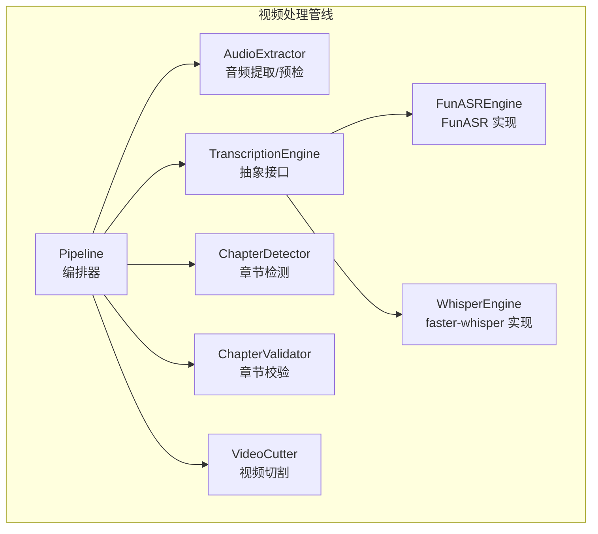
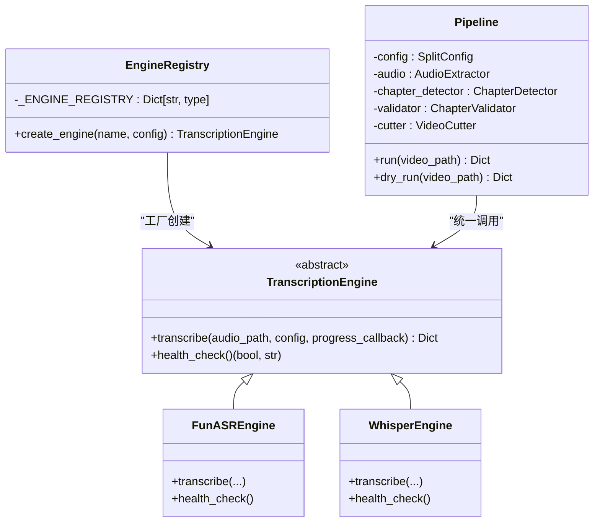
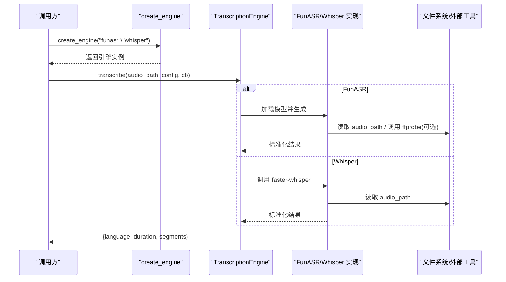
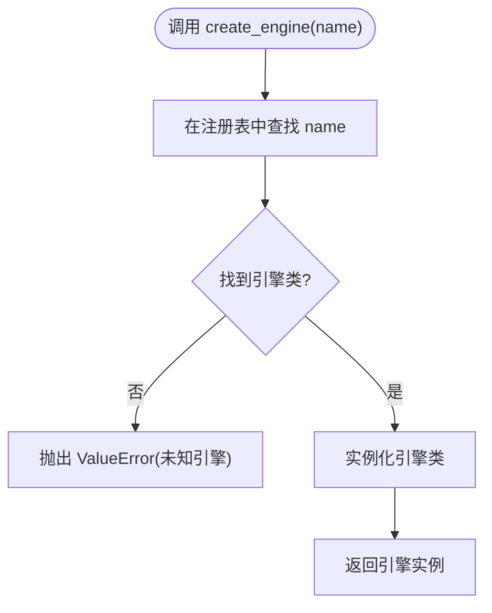
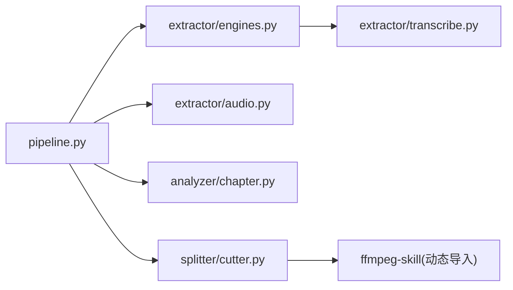

# 引擎架构设计

<cite>
**本文引用的文件**   
- [engines.py](file://video_splitter/extractor/engines.py)
- [transcribe.py](file://video_splitter/extractor/transcribe.py)
- [config.py](file://video_splitter/config.py)
- [pipeline.py](file://video_splitter/pipeline.py)
- [audio.py](file://video_splitter/extractor/audio.py)
- [chapter.py](file://video_splitter/analyzer/chapter.py)
- [cutter.py](file://video_splitter/splitter/cutter.py)
- [test_engines.py](file://video_splitter/tests/test_engines.py)
- [AGENTS.md](file://AGENTS.md)
</cite>

## 目录
1. [简介](#简介)
2. [项目结构](#项目结构)
3. [核心组件](#核心组件)
4. [架构总览](#架构总览)
5. [详细组件分析](#详细组件分析)
6. [依赖关系分析](#依赖关系分析)
7. [性能与监控](#性能与监控)
8. [故障转移与切换策略](#故障转移与切换策略)
9. [配置管理策略](#配置管理策略)
10. [排障指南](#排障指南)
11. [结论](#结论)

## 简介
本技术文档围绕语音识别（ASR）引擎的架构设计，系统化阐述多引擎支持的整体模式：抽象接口定义、动态加载机制、工厂与注册系统、基类设计规范、配置管理与继承、引擎切换与故障转移、以及性能监控与日志记录。文档同时提供架构图与数据流图，帮助读者快速理解各组件间的交互关系与扩展方式。

## 项目结构
仓库中与 ASR 引擎相关的核心代码位于 video_splitter 包内，关键模块如下：
- extractor/engines.py：定义 TranscriptionEngine 抽象基类、FunASREngine 与 WhisperEngine 实现、引擎注册表与工厂函数 create_engine。
- extractor/transcribe.py：Whisper 引擎的具体转录实现与进度回调适配。
- config.py：SplitConfig 配置数据类，包含模型、设备、计算类型、分片时长、LLM 参数、命名模板、恢复开关、当前选择的 ASR 引擎名及引擎专属配置等。
- pipeline.py：Pipeline 编排器，串联预检查、音频提取、转写、章节检测、校验、切割等步骤，并负责中间产物持久化与耗时统计。
- analyzer/chapter.py：基于 LLM 的语义章节检测，含滑动窗口切分与均匀分割回退。
- splitter/cutter.py：基于 FFmpegSkill 的视频切割，支持快速拷贝与精确重编码两种模式。
- extractor/audio.py：音频提取与质量预检（librosa + ffprobe）。

图表来源
- [pipeline.py:21-131](file://video_splitter/pipeline.py#L21-L131)
- [engines.py:17-251](file://video_splitter/extractor/engines.py#L17-L251)
- [transcribe.py:11-105](file://video_splitter/extractor/transcribe.py#L11-L105)
- [chapter.py:43-343](file://video_splitter/analyzer/chapter.py#L43-L343)
- [cutter.py:22-98](file://video_splitter/splitter/cutter.py#L22-L98)
- [audio.py:12-171](file://video_splitter/extractor/audio.py#L12-L171)

章节来源
- [pipeline.py:21-131](file://video_splitter/pipeline.py#L21-L131)
- [engines.py:17-251](file://video_splitter/extractor/engines.py#L17-L251)
- [transcribe.py:11-105](file://video_splitter/extractor/transcribe.py#L11-L105)
- [config.py:19-54](file://video_splitter/config.py#L19-L54)
- [chapter.py:43-343](file://video_splitter/analyzer/chapter.py#L43-L343)
- [cutter.py:22-98](file://video_splitter/splitter/cutter.py#L22-L98)
- [audio.py:12-171](file://video_splitter/extractor/audio.py#L12-L171)

## 核心组件
- 抽象接口与基类
  - TranscriptionEngine：统一抽象接口，定义 transcribe 与 health_check 两个方法，约束所有引擎的实现契约。
  - FunASREngine：基于 FunASR 的中文 ASR 实现，内部通过环境变量选择模型路径，解析 sentence_info 生成 segments。
  - WhisperEngine：基于 faster-whisper 的实现，委托给 transcribe.py 中的具体逻辑，并透传进度回调。
- 工厂与注册系统
  - _ENGINE_REGISTRY：名称到引擎类的映射字典，用于按名称创建引擎实例。
  - create_engine(name, config=None)：根据 name 从注册表获取对应类并返回实例；未知名称抛出 ValueError。
- 配置对象
  - SplitConfig：集中管理模型大小、设备、计算类型、分片时长、LLM 相关参数、语言、命名模板、恢复开关、当前 ASR 引擎名与引擎专属配置等；支持 from_env 覆盖默认值。
- 管线编排
  - Pipeline：串联 precheck → extract → transcribe → chapter → validate → cut，负责中间结果持久化、错误捕获与耗时统计。

章节来源
- [engines.py:17-251](file://video_splitter/extractor/engines.py#L17-L251)
- [transcribe.py:11-105](file://video_splitter/extractor/transcribe.py#L11-L105)
- [config.py:19-54](file://video_splitter/config.py#L19-L54)
- [pipeline.py:21-131](file://video_splitter/pipeline.py#L21-L131)

## 架构总览
下图展示“抽象接口 + 工厂 + 注册表”的多引擎架构模式，以及 Pipeline 如何以统一接口调用不同引擎。

图表来源
- [engines.py:17-251](file://video_splitter/extractor/engines.py#L17-L251)
- [pipeline.py:21-131](file://video_splitter/pipeline.py#L21-L131)

## 详细组件分析

### 抽象接口与基类规范
- 统一方法签名
  - transcribe(audio_path, config, progress_callback=None) -> Dict
    - 输入：WAV 音频路径、SplitConfig、可选进度回调。
    - 输出：包含 language、duration、segments 的字典；每个 segment 包含 text、start、end。
  - health_check() -> (bool, str)
    - 返回可用性元组，便于运行前自检与降级决策。
- 设计要点
  - 通过抽象基类强制实现一致性，降低上层调用复杂度。
  - 进度回调采用统一的浮点区间与描述字符串约定，便于 UI 或日志上报。

章节来源
- [engines.py:17-46](file://video_splitter/extractor/engines.py#L17-L46)

### 引擎实现：FunASR 与 Whisper
- FunASREngine
  - 使用环境变量 VIDEO_SPLITTER_FUNASR_MODEL_DIR 指定模型目录，否则使用内置默认模型名。
  - 解析 AutoModel.generate 返回的 sentence_info，构造 segments；若无有效句子信息，则通过 ffprobe 获取音频时长作为 duration。
  - health_check 尝试导入 funasr 与 numpy，并执行一次轻量推理验证。
- WhisperEngine
  - 委托至 transcribe.py 的 transcribe 函数，该函数使用 faster_whisper.WhisperModel，依据 SplitConfig 的 model_size、device、compute_type、language 进行转写。
  - 将分段进度映射为 0~1 的进度回调，最终返回标准结构。
  - health_check 仅检查 faster_whisper 是否可导入。

图表来源
- [engines.py:85-220](file://video_splitter/extractor/engines.py#L85-L220)
- [transcribe.py:11-59](file://video_splitter/extractor/transcribe.py#L11-L59)

章节来源
- [engines.py:85-220](file://video_splitter/extractor/engines.py#L85-L220)
- [transcribe.py:11-59](file://video_splitter/extractor/transcribe.py#L11-L59)

### 工厂与注册系统
- 注册表 _ENGINE_REGISTRY
  - 维护名称到引擎类的映射，当前包含 "funasr" 与 "whisper"。
- 工厂函数 create_engine
  - 根据 name 查找类，若不存在抛出 ValueError；存在则实例化并返回。
  - 支持传入 SplitConfig（预留扩展），便于未来注入引擎特定参数。
- 测试覆盖
  - 验证注册表键存在性、未知名称抛错、默认引擎为 funasr、可按名创建具体引擎。

图表来源
- [engines.py:222-251](file://video_splitter/extractor/engines.py#L222-L251)
- [test_engines.py:72-96](file://video_splitter/tests/test_engines.py#L72-L96)

章节来源
- [engines.py:222-251](file://video_splitter/extractor/engines.py#L222-L251)
- [test_engines.py:72-96](file://video_splitter/tests/test_engines.py#L72-L96)

### 配置管理策略
- SplitConfig 字段说明（节选）
  - 模型与设备：model_size、device、compute_type
  - 分片时长：max_segment_duration、min_segment_duration
  - LLM 参数：llm_api_base、llm_api_key、llm_model、llm_token_budget、llm_max_retries
  - 切割策略：cut_mode、keyframe_tolerance
  - 输出设置：language、naming_template、resume
  - 引擎选择：transcription_engine（默认 "funasr"）、engine_config（引擎专属覆盖）
- 环境变量覆盖
  - OPENAI_API_BASE、OPENAI_API_KEY、WHALECLOUD_API_KEY、VIDEO_SPLITTER_DEVICE、VIDEO_SPLITTER_RESUME、VIDEO_SPLITTER_ENGINE
- 默认值与继承
  - 通过 dataclass 默认值提供合理初始值；from_env 仅在环境变量存在时覆盖默认值，形成“默认值 + 环境覆盖”的继承式配置策略。
- 参数校验
  - 当前未做显式类型/范围校验，建议在新增字段时增加校验逻辑（如枚举白名单、数值范围、必填项检查）。

章节来源
- [config.py:19-54](file://video_splitter/config.py#L19-L54)

### 引擎切换与故障转移
- 引擎切换
  - 通过 SplitConfig.transcription_engine 指定当前使用的引擎名；也可由环境变量 VIDEO_SPLITTER_ENGINE 覆盖。
  - 上层可通过 create_engine(config.transcription_engine) 动态获取目标引擎。
- 健康检查与降级
  - 每个引擎提供 health_check，可在启动阶段或运行时探测依赖可用性。
  - 当首选引擎不可用时，可自动切换到备选引擎（例如从 funasr 切换到 whisper），并在日志中记录切换原因。
- 章节检测的容错
  - ChapterDetector 在 LLM 不可用或多次失败后，回退为均匀时间分割，保证流程不中断。

章节来源
- [engines.py:154-220](file://video_splitter/extractor/engines.py#L154-L220)
- [chapter.py:195-322](file://video_splitter/analyzer/chapter.py#L195-L322)

### 数据处理与中间产物
- 音频提取
  - AudioExtractor.extract 将视频转为 16kHz 单声道 WAV，供 ASR 引擎消费。
- 转写结果
  - 统一结构 {language, duration, segments}，segments 包含 text、start、end。
- SRT 字幕
  - to_srt 将转写结果转换为 SRT 格式，便于播放与校对。
- 章节与校验
  - ChapterDetector 生成章节列表；ChapterValidator 对章节进行长度合并与边界修正。
- 视频切割
  - VideoCutter 支持 fast（流拷贝）与 precise（重编码）两种模式，并根据 keyframe_tolerance 决定是否回退到精确模式。

章节来源
- [audio.py:130-171](file://video_splitter/extractor/audio.py#L130-L171)
- [transcribe.py:79-105](file://video_splitter/extractor/transcribe.py#L79-L105)
- [chapter.py:43-343](file://video_splitter/analyzer/chapter.py#L43-L343)
- [cutter.py:22-98](file://video_splitter/splitter/cutter.py#L22-L98)

## 依赖关系分析
- 模块耦合
  - Pipeline 依赖 AudioExtractor、TranscriptionEngine（通过工厂）、ChapterDetector、ChapterValidator、VideoCutter。
  - engines.py 依赖 transcribe.py（Whisper 实现）、subprocess（ffprobe）、funasr/faster_whisper（外部库）。
  - cutter.py 动态导入 ffmpeg-skill 包，避免强耦合。
- 外部依赖
  - FFmpeg/ffprobe：音频提取、时长查询、视频切割。
  - librosa/numpy：音频质量预检。
  - openai：章节检测的 LLM 客户端。
  - json_repair：JSON 修复辅助。
- 潜在循环依赖
  - 当前未见循环导入；transcribe.py 被 engines.py 间接引用，属于单向依赖。

图表来源
- [pipeline.py:21-131](file://video_splitter/pipeline.py#L21-L131)
- [engines.py:17-251](file://video_splitter/extractor/engines.py#L17-L251)
- [transcribe.py:11-105](file://video_splitter/extractor/transcribe.py#L11-L105)
- [cutter.py:12-19](file://video_splitter/splitter/cutter.py#L12-L19)

章节来源
- [pipeline.py:21-131](file://video_splitter/pipeline.py#L21-L131)
- [engines.py:17-251](file://video_splitter/extractor/engines.py#L17-L251)
- [cutter.py:12-19](file://video_splitter/splitter/cutter.py#L12-L19)

## 性能与监控
- 进度回调
  - 引擎层通过 progress_callback 上报 0~1 进度，便于 UI 显示与外部监控采集。
- 耗时统计
  - Pipeline.run 在 finally 块中计算 elapsed_seconds，便于整体性能评估。
- 资源与 I/O
  - 大量依赖外部进程（FFmpeg/ffprobe）与网络请求（LLM），建议引入超时控制、重试与熔断策略。
- 日志记录
  - Pipeline 使用 logging 记录关键步骤与异常；建议在引擎层也补充结构化日志（如模型加载耗时、转写分段数、错误码）。

章节来源
- [engines.py:106-152](file://video_splitter/extractor/engines.py#L106-L152)
- [transcribe.py:35-59](file://video_splitter/extractor/transcribe.py#L35-L59)
- [pipeline.py:31-111](file://video_splitter/pipeline.py#L31-L111)

## 故障转移与切换策略
- 引擎级健康检查
  - 每个引擎的 health_check 返回布尔与消息，可用于启动自检与运行时探测。
- 自动切换
  - 当首选引擎 health_check 失败时，可自动切换到备选引擎（例如从 funasr 切换到 whisper），并记录切换原因。
- 章节检测回退
  - ChapterDetector 在 LLM 不可用或多次失败后，回退为均匀时间分割，确保流程稳定。
- 切割回退
  - VideoCutter 在快速拷贝模式下若精度不足，自动回退到精确重编码模式。

章节来源
- [engines.py:154-220](file://video_splitter/extractor/engines.py#L154-L220)
- [chapter.py:195-322](file://video_splitter/analyzer/chapter.py#L195-L322)
- [cutter.py:55-86](file://video_splitter/splitter/cutter.py#L55-L86)

## 配置管理策略
- 默认值与环境变量覆盖
  - SplitConfig.from_env 仅在环境变量存在时覆盖默认值，形成“默认值 + 环境覆盖”的继承式策略。
- 引擎选择
  - transcription_engine 决定当前使用的引擎名；VIDEO_SPLITTER_ENGINE 可覆盖默认值。
- 引擎专属配置
  - engine_config 保留用于传递引擎特定参数（如模型名、设备、并发等），当前未广泛使用，可扩展。
- 参数校验建议
  - 建议对枚举型字段（如 device、compute_type、cut_mode）进行白名单校验；对数值型字段（如 llm_token_budget、keyframe_tolerance）进行范围校验。

章节来源
- [config.py:19-54](file://video_splitter/config.py#L19-L54)

## 排障指南
- 常见错误与定位
  - ffprobe 缺失或超时：检查 PATH 与安装状态，确认超时阈值是否合理。
  - JSON 解析失败：检查外部工具输出是否为合法 JSON。
  - 引擎依赖缺失：根据 health_check 返回的错误信息进行安装或配置。
  - LLM 不可用：检查 API Key、Base URL、网络连通性与配额。
- 日志与调试
  - 查看 Pipeline 记录的 steps_completed 与 error 字段，定位失败阶段。
  - 启用更详细的日志级别，关注模型加载、转写分段数量与耗时。
- 参考测试用例
  - test_engines.py 覆盖了 ffprobe 异常路径、工厂行为与健康检查异常路径，可作为排障参考。

章节来源
- [test_engines.py:22-111](file://video_splitter/tests/test_engines.py#L22-L111)
- [pipeline.py:102-111](file://video_splitter/pipeline.py#L102-L111)

## 结论
本架构通过抽象接口、工厂与注册表实现了多 ASR 引擎的统一接入与动态切换，配合 SplitConfig 的环境覆盖机制与 Pipeline 的健壮编排，形成了高内聚、低耦合、可扩展的系统。建议在后续迭代中增强参数校验、完善健康检查与自动切换策略、细化日志与指标上报，以提升系统的稳定性与可观测性。