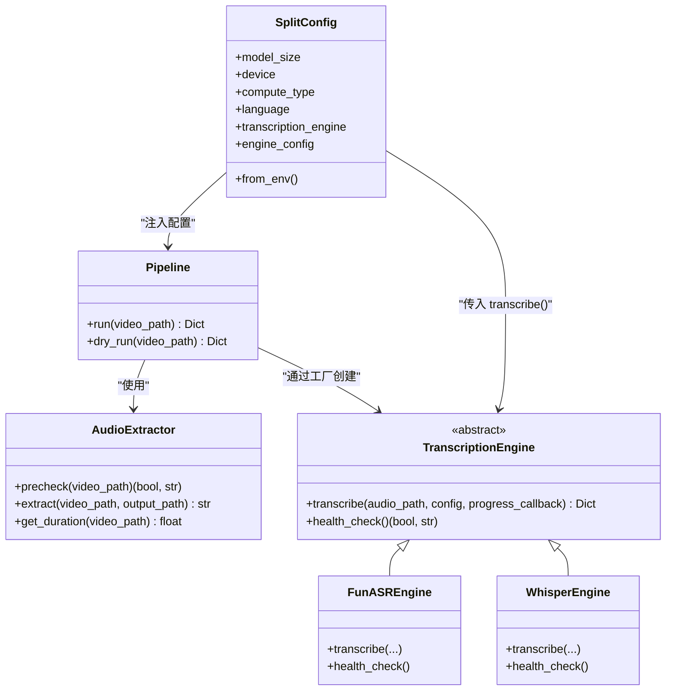
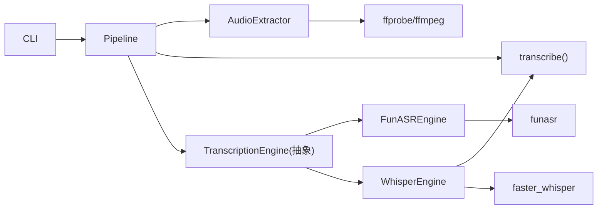

# 自定义引擎开发

<cite>
**本文引用的文件**   
- [engines.py](file://video_splitter/extractor/engines.py)
- [transcribe.py](file://video_splitter/extractor/transcribe.py)
- [config.py](file://video_splitter/config.py)
- [pipeline.py](file://video_splitter/pipeline.py)
- [audio.py](file://video_splitter/extractor/audio.py)
- [cli.py](file://video_splitter/cli.py)
- [test_engines.py](file://video_splitter/tests/test_engines.py)
- [test_transcribe_funasr.py](file://tests/test_transcribe_funasr.py)
</cite>

## 目录
1. [简介](#简介)
2. [项目结构](#项目结构)
3. [核心组件](#核心组件)
4. [架构总览](#架构总览)
5. [详细组件分析](#详细组件分析)
6. [依赖关系分析](#依赖关系分析)
7. [性能考虑](#性能考虑)
8. [故障排查指南](#故障排查指南)
9. [结论](#结论)
10. [附录：新引擎开发示例与清单](#附录：新引擎开发示例与清单)

## 简介
本指南面向需要在现有视频分割系统中集成新的语音识别（ASR）后端的开发者。系统采用可插拔的转录引擎架构，通过抽象基类定义统一接口、工厂注册机制进行实例化、以及标准化转录结果格式贯穿全链路。你将了解如何继承抽象基类、实现必要方法、遵循配置参数规范、输出标准化 segments 数组和时间戳格式，并掌握从环境搭建到测试验证的完整流程，包括单元测试与集成测试、错误处理最佳实践、性能优化建议与调试技巧。

## 项目结构
与本指南相关的核心模块如下：
- 引擎抽象与实现：video_splitter/extractor/engines.py
- Whisper 封装与 SRT 工具：video_splitter/extractor/transcribe.py
- 配置管理：video_splitter/config.py
- 管线编排：video_splitter/pipeline.py
- 音频提取与预检查：video_splitter/extractor/audio.py
- CLI 入口：video_splitter/cli.py
- 测试用例：video_splitter/tests/test_engines.py、tests/test_transcribe_funasr.py

```mermaid
graph TB
subgraph "抽取层"
AE["AudioExtractor<br/>音频提取/预检"]
ENG["TranscriptionEngine(抽象)<br/>FunASREngine / WhisperEngine"]
end
subgraph "转录层"
TR["transcribe()<br/>Whisper 封装/SRT 工具"]
end
subgraph "编排层"
PIPE["Pipeline<br/>run/dry_run"]
end
subgraph "配置"
CFG["SplitConfig<br/>from_env()"]
end
subgraph "CLI"
CLI["CLI<br/>split/transcribe/check/batch/gui"]
end
CLI --> PIPE
PIPE --> AE
PIPE --> TR
PIPE --> ENG
CFG --> PIPE
CFG --> ENG
```

图表来源
- [engines.py:17-46](file://video_splitter/extractor/engines.py#L17-L46)
- [transcribe.py:11-59](file://video_splitter/extractor/transcribe.py#L11-L59)
- [config.py:19-53](file://video_splitter/config.py#L19-L53)
- [pipeline.py:21-131](file://video_splitter/pipeline.py#L21-L131)
- [audio.py:12-171](file://video_splitter/extractor/audio.py#L12-L171)
- [cli.py:15-256](file://video_splitter/cli.py#L15-L256)

章节来源
- [engines.py:1-251](file://video_splitter/extractor/engines.py#L1-L251)
- [transcribe.py:1-105](file://video_splitter/extractor/transcribe.py#L1-L105)
- [config.py:1-54](file://video_splitter/config.py#L1-L54)
- [pipeline.py:1-131](file://video_splitter/pipeline.py#L1-L131)
- [audio.py:1-171](file://video_splitter/extractor/audio.py#L1-L171)
- [cli.py:1-256](file://video_splitter/cli.py#L1-L256)

## 核心组件
- 抽象基类 TranscriptionEngine：定义所有 ASR 后端必须实现的接口，包括 transcribe 和 health_check。
- 具体引擎 FunASREngine 与 WhisperEngine：分别基于 FunASR 与 faster-whisper 提供实现，并通过工厂 create_engine 注册与创建。
- 配置 SplitConfig：集中管理模型大小、设备、计算类型、分段时长、LLM 相关、切分模式、语言、命名模板、恢复开关、转录引擎选择及引擎特定配置等。
- 转录工具函数：transcribe、estimate_tokens、to_srt 用于 Whisper 封装、SRT 生成与 token 估算。
- 管线 Pipeline：串联音频提取、转录、章节检测、校验、切割，支持断点续跑与 dry-run。
- 音频提取 AudioExtractor：调用 ffprobe/ffmpeg 完成音频质量预检与 WAV 提取。
- CLI：提供 split、transcribe、cut、check、review、batch、gui 等命令，驱动 Pipeline 与 Engine。

章节来源
- [engines.py:17-251](file://video_splitter/extractor/engines.py#L17-L251)
- [transcribe.py:11-105](file://video_splitter/extractor/transcribe.py#L11-L105)
- [config.py:19-53](file://video_splitter/config.py#L19-L53)
- [pipeline.py:21-131](file://video_splitter/pipeline.py#L21-L131)
- [audio.py:12-171](file://video_splitter/extractor/audio.py#L12-L171)
- [cli.py:15-256](file://video_splitter/cli.py#L15-L256)

## 架构总览
下图展示了新增 ASR 后端在系统中的位置与交互方式。



图表来源
- [engines.py:17-251](file://video_splitter/extractor/engines.py#L17-L251)
- [config.py:19-53](file://video_splitter/config.py#L19-L53)
- [pipeline.py:21-131](file://video_splitter/pipeline.py#L21-L131)
- [audio.py:12-171](file://video_splitter/extractor/audio.py#L12-L171)

## 详细组件分析

### 抽象基类与接口契约
- 必须实现的方法
  - transcribe(audio_path: str, config: SplitConfig, progress_callback: Optional[Callable[[float, str], None]] = None) -> Dict[str, Any]
    - 输入：WAV 路径、配置对象、可选进度回调（进度 0~1 与阶段描述）。
    - 输出：标准化字典，包含 language、duration、segments；每个 segment 包含 text、start、end（秒级浮点数）。
  - health_check() -> tuple[bool, str]
    - 返回可用性元组，便于启动前自检或诊断。
- 进度回调约定
  - 回调签名：progress_callback(fraction: float, description: str)
  - 建议在关键阶段调用：加载模型、开始转录、处理结果、完成。
- 返回值时间戳规范
  - start/end 为秒级浮点数，保留两位小数（参考现有实现中的 round(..., 2)）。
  - duration 为整段音频时长（秒），若后端不提供句级时间戳，应回退到 ffprobe 获取。

章节来源
- [engines.py:17-46](file://video_splitter/extractor/engines.py#L17-L46)
- [engines.py:85-152](file://video_splitter/extractor/engines.py#L85-L152)
- [engines.py:175-205](file://video_splitter/extractor/engines.py#L175-L205)

### 现有引擎实现要点
- FunASREngine
  - 通过环境变量 VIDEO_SPLITTER_FUNASR_MODEL_DIR 指定模型目录，默认常量 FUNASR_MODEL。
  - 将毫秒时间戳转换为秒并四舍五入至两位小数。
  - 若无 sentence_info 或为空，则使用 _get_audio_duration_ffprobe 获取 duration。
  - health_check 会尝试导入 funasr 与 numpy，并执行一次最小推理以确认可用。
- WhisperEngine
  - 委托 video_splitter.extractor.transcribe.transcribe 完成实际转录，并转发进度回调。
  - health_check 仅检查 faster_whisper 是否可导入。

章节来源
- [engines.py:85-173](file://video_splitter/extractor/engines.py#L85-L173)
- [engines.py:175-220](file://video_splitter/extractor/engines.py#L175-L220)
- [transcribe.py:11-59](file://video_splitter/extractor/transcribe.py#L11-L59)

### 配置参数定义与验证规则
- SplitConfig 字段说明（节选）
  - model_size、device、compute_type：Whisper 模型与运行参数。
  - max_segment_duration、min_segment_duration：分段时长上下界（秒）。
  - llm_*：LLM 摘要相关设置（API Base、Key、Model、Token 预算、重试次数）。
  - cut_mode、keyframe_tolerance：切分策略与关键帧容差。
  - language、naming_template、resume：语言、命名模板、断点续跑开关。
  - transcription_engine：当前使用的 ASR 引擎名（如 "funasr"、"whisper"），可通过环境变量 VIDEO_SPLITTER_ENGINE 覆盖。
  - engine_config：引擎特定覆盖项（预留扩展）。
- 环境变量覆盖
  - OPENAI_API_BASE、OPENAI_API_KEY、WHALECLOUD_API_KEY、VIDEO_SPLITTER_DEVICE、VIDEO_SPLITTER_RESUME、VIDEO_SPLITTER_ENGINE。
  - from_env 中 WHALECLOUD_API_KEY 优先级高于 OPENAI_API_KEY。
- 验证规则
  - 当前未做严格类型/范围校验，但建议在新引擎中对关键参数进行前置校验并在 health_check 中报告问题。

章节来源
- [config.py:19-53](file://video_splitter/config.py#L19-L53)
- [test_chapter.py:312-347](file://video_splitter/tests/test_chapter.py#L312-L347)

### 转录结果标准化格式
- 顶层键
  - language: 字符串，如 "zh"、"en"。
  - duration: 数字，秒级浮点。
  - segments: 列表，每项为 dict，包含：
    - text: 字符串。
    - start: 秒级浮点，通常保留两位小数。
    - end: 秒级浮点，通常保留两位小数。
- 时间戳格式
  - 内部统一使用“秒”作为单位；SRT 转换时再转为 HH:MM:SS,mmm。
- 空文本过滤
  - 当某段 text 为空时应跳过，避免产生无效片段。

章节来源
- [transcribe.py:11-59](file://video_splitter/extractor/transcribe.py#L11-L59)
- [transcribe.py:79-105](file://video_splitter/extractor/transcribe.py#L79-L105)
- [engines.py:127-152](file://video_splitter/extractor/engines.py#L127-L152)

### 进度回调与状态上报
- 建议在各阶段调用 progress_callback，例如：
  - 0.0: 加载模型
  - 0.1: 开始转录
  - 0.8: 处理结果
  - 1.0: 完成
- 这有助于 GUI/CLI 显示实时进度与状态信息。

章节来源
- [engines.py:106-146](file://video_splitter/extractor/engines.py#L106-L146)
- [engines.py:196-205](file://video_splitter/extractor/engines.py#L196-L205)

### 健康检查与健康自检
- 目的：在运行前快速判断依赖是否就绪、模型是否能正常加载。
- 建议做法：
  - 捕获 ImportError 并返回明确安装提示。
  - 捕获其他异常并返回错误消息，便于上层展示。
  - 对于需要网络或磁盘资源的模型，尽量轻量触发（如小样本推理）。

章节来源
- [engines.py:154-173](file://video_splitter/extractor/engines.py#L154-L173)
- [engines.py:207-220](file://video_splitter/extractor/engines.py#L207-L220)

### 工厂与注册机制
- 工厂 create_engine(name, config=None)
  - 根据 name 从 _ENGINE_REGISTRY 查找对应类并实例化。
  - 未知名称抛出 ValueError，并列出可用引擎。
- 注册表 _ENGINE_REGISTRY
  - 维护 "funasr"、"whisper" 到引擎类的映射。
- 新增引擎步骤
  - 实现 TranscriptionEngine 子类。
  - 在 _ENGINE_REGISTRY 中注册新引擎名。
  - 更新 create_engine 文档与测试。

章节来源
- [engines.py:222-251](file://video_splitter/extractor/engines.py#L222-L251)

### 管线集成与断点续跑
- Pipeline.run
  - 顺序：预检 → 提取音频 → 转录 → 生成 SRT → 章节检测 → 校验 → 切割。
  - 支持 resume：若存在 transcript.json 与 chapters.json，则跳过相应步骤。
  - 记录 steps_completed、output_files、elapsed_seconds 等统计信息。
- Pipeline.dry_run
  - 不执行 LLM 调用，仅估算 token 数与成本，便于评估资源消耗。

章节来源
- [pipeline.py:21-131](file://video_splitter/pipeline.py#L21-L131)

### CLI 使用
- 常用命令
  - split：完整流水线，支持 --max-duration、--model、--cut-mode、--resume、--dry-run。
  - transcribe：仅转录，输出 .transcript.json。
  - check：检查依赖与环境，给出性能预估。
  - batch：批量处理目录下 .mp4。
  - gui：启动图形界面。
- 环境变量
  - 可通过 VIDEO_SPLITTER_ENGINE 切换默认引擎。

章节来源
- [cli.py:15-256](file://video_splitter/cli.py#L15-L256)

## 依赖关系分析
- 外部依赖
  - FFmpeg/ffprobe：音频提取与时长查询。
  - librosa/numpy：音频质量预检（可选）。
  - funasr/numpy：FunASR 引擎。
  - faster_whisper：Whisper 引擎。
- 内部耦合
  - Pipeline 强依赖 AudioExtractor、TranscriptionEngine、ChapterDetector、Validator、VideoCutter。
  - engines.py 通过 _ENGINE_REGISTRY 解耦具体引擎实现。
  - transcribe.py 被 WhisperEngine 复用，避免重复实现。



图表来源
- [cli.py:15-256](file://video_splitter/cli.py#L15-L256)
- [pipeline.py:21-131](file://video_splitter/pipeline.py#L21-L131)
- [audio.py:12-171](file://video_splitter/extractor/audio.py#L12-L171)
- [engines.py:85-220](file://video_splitter/extractor/engines.py#L85-L220)
- [transcribe.py:11-59](file://video_splitter/extractor/transcribe.py#L11-L59)

章节来源
- [engines.py:222-251](file://video_splitter/extractor/engines.py#L222-L251)
- [audio.py:12-171](file://video_splitter/extractor/audio.py#L12-L171)

## 性能考虑
- 模型选择与量化
  - 使用更小的模型尺寸（tiny/base/small）提升速度，large-v3 精度更高但耗时显著增加。
  - compute_type 可使用 int8 降低内存占用与加速推理（需硬件支持）。
- 设备与并发
  - device=auto 自动选择 GPU/CPU；GPU 下注意显存与批处理。
- 音频预处理
  - 16kHz 单声道 WAV 是通用 ASR 输入规格，减少采样率与通道可降低计算量。
- 进度与中断
  - 合理拆分进度回调粒度，便于 UI 反馈与用户取消。
- 缓存与复用
  - 对大模型加载进行缓存（进程内或会话级），避免重复初始化。
- 估算与 Dry-run
  - 使用 estimate_tokens 与 dry_run 提前评估 LLM 调用成本与分段数量。

[本节为通用指导，无需源码引用]

## 故障排查指南
- 常见错误与定位
  - ffprobe 不可用或超时：检查 PATH 与权限，确保 ffmpeg 已安装且可执行。
  - JSON 解析失败：确认 ffprobe 输出格式正确。
  - 模型加载失败：检查模型目录、网络下载、磁盘空间与依赖库版本。
  - 无音频或静音过高：使用 precheck 查看 RMS 与静音比例，必要时调整采集源。
- 健康检查
  - 先运行 health_check，再执行 transcribe，可快速隔离环境问题。
- 日志与断点
  - 启用 logging，记录各阶段耗时与异常堆栈。
  - 使用 resume 跳过已完成步骤，聚焦问题环节。

章节来源
- [engines.py:48-83](file://video_splitter/extractor/engines.py#L48-L83)
- [audio.py:26-99](file://video_splitter/extractor/audio.py#L26-L99)
- [pipeline.py:102-111](file://video_splitter/pipeline.py#L102-L111)

## 结论
通过统一的抽象基类、工厂注册与标准化结果格式，系统实现了高度可扩展的 ASR 后端集成方案。新增引擎只需遵循接口契约、注册到工厂、完善健康检查与进度回调，即可无缝接入管线。配合完善的测试与 CLI 工具，可高效完成开发与验证。

[本节为总结性内容，无需源码引用]

## 附录：新引擎开发示例与清单

### 开发流程清单
- 环境准备
  - 安装 Python 依赖与外部工具（FFmpeg/ffprobe）。
  - 安装目标 ASR SDK（如 funasr/faster_whisper）。
- 实现引擎
  - 新建类 NewASREngine 继承 TranscriptionEngine。
  - 实现 transcribe：
    - 按进度回调上报阶段。
    - 将后端时间戳归一化为秒，保留两位小数。
    - 过滤空文本片段。
    - 若无句级时间戳，使用 _get_audio_duration_ffprobe 获取 duration。
    - 返回 {language, duration, segments}。
  - 实现 health_check：
    - 捕获 ImportError 并返回安装提示。
    - 捕获其他异常并返回错误消息。
- 注册与工厂
  - 在 _ENGINE_REGISTRY 中添加 "new_asr": NewASREngine。
  - 确保 create_engine("new_asr") 能正确实例化。
- 配置与环境变量
  - 如需引擎特定参数，可在 SplitConfig.engine_config 中传递。
  - 通过 VIDEO_SPLITTER_ENGINE=new_asr 切换默认引擎。
- 测试
  - 单元测试：覆盖转写输出映射、空文本过滤、进度回调、健康检查异常分支。
  - 集成测试：通过 CLI 的 split/transcribe 命令端到端验证。
- 发布与文档
  - 更新 README 与 CLI help，说明新引擎用法与依赖。

### 单元测试编写指南
- 使用 pytest 与 unittest.mock 模拟外部依赖（funasr/faster_whisper、subprocess）。
- 重点覆盖：
  - 工厂 create_engine 的默认值与未知引擎异常。
  - 时间戳单位换算（毫秒→秒）、空文本过滤。
  - 进度回调调用次数与阶段描述。
  - health_check 的 ImportError 与非 ImportError 异常路径。
- 参考现有测试结构与断言风格。

章节来源
- [test_engines.py:1-111](file://video_splitter/tests/test_engines.py#L1-L111)
- [test_transcribe_funasr.py:1-263](file://tests/test_transcribe_funasr.py#L1-L263)

### 集成测试方法
- 使用 CLI 命令：
  - python -m video_splitter.cli transcribe <视频路径>
  - python -m video_splitter.cli split <视频路径> --dry-run
  - python -m video_splitter.cli check
- 结合环境变量切换引擎：
  - export VIDEO_SPLITTER_ENGINE=new_asr
- 断点续跑：
  - 设置 VIDEO_SPLITTER_RESUME=1，验证跳过已有中间文件。

章节来源
- [cli.py:15-256](file://video_splitter/cli.py#L15-L256)
- [config.py:39-53](file://video_splitter/config.py#L39-L53)

### 错误处理与异常管理最佳实践
- 对外暴露健康检查，避免运行时崩溃。
- 对 subprocess 调用进行 try/except，区分 FileNotFoundError、TimeoutExpired、CalledProcessError。
- 对 JSON 解析与数值转换进行健壮性检查。
- 在 health_check 中捕获非 ImportError 异常并返回可读消息。

章节来源
- [engines.py:48-83](file://video_splitter/extractor/engines.py#L48-L83)
- [engines.py:154-173](file://video_splitter/extractor/engines.py#L154-L173)

### 调试技巧
- 开启 logging，记录各阶段耗时与异常堆栈。
- 使用 dry_run 估算 token 与成本，避免不必要的 LLM 调用。
- 逐步缩小问题范围：先 health_check，再单独调用 transcribe，最后走 Pipeline。
- 借助 ffprobe 独立验证音频时长与格式。

章节来源
- [pipeline.py:113-131](file://video_splitter/pipeline.py#L113-L131)
- [audio.py:101-128](file://video_splitter/extractor/audio.py#L101-L128)

### 新引擎开发示例代码（路径指引）
- 参考以下文件中的实现模式，按相同结构创建你的新引擎：
  - 抽象基类与工厂：[engines.py:17-251](file://video_splitter/extractor/engines.py#L17-L251)
  - FunASR 实现参考：[engines.py:85-173](file://video_splitter/extractor/engines.py#L85-L173)
  - Whisper 实现参考：[engines.py:175-220](file://video_splitter/extractor/engines.py#L175-L220)
  - 进度回调与时间戳处理参考：[engines.py:106-152](file://video_splitter/extractor/engines.py#L106-L152)
  - 标准化转录与 SRT 工具参考：[transcribe.py:11-105](file://video_splitter/extractor/transcribe.py#L11-L105)
  - 配置与环境变量参考：[config.py:19-53](file://video_splitter/config.py#L19-L53)
  - 测试样例参考：[test_engines.py:1-111](file://video_splitter/tests/test_engines.py#L1-L111)、[test_transcribe_funasr.py:1-263](file://tests/test_transcribe_funasr.py#L1-L263)