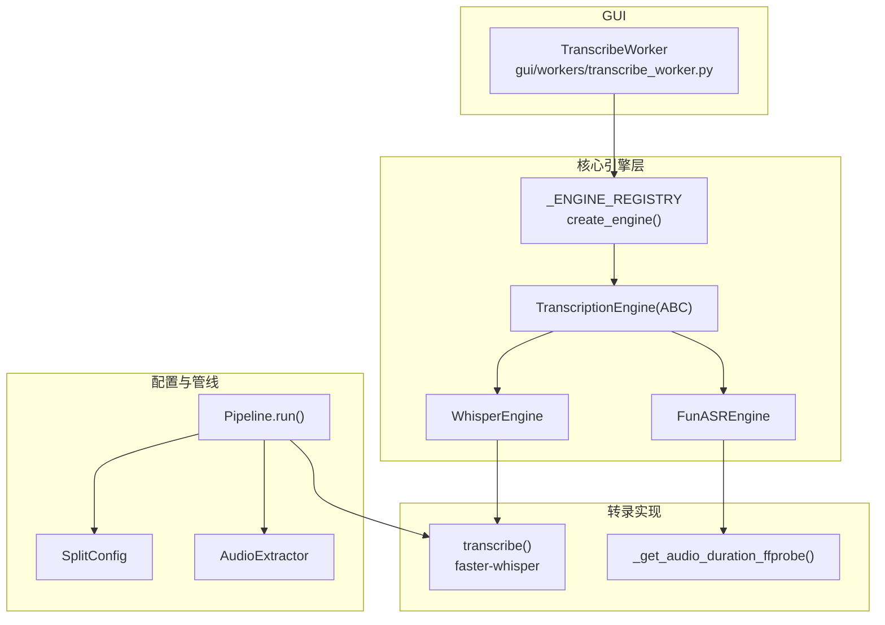
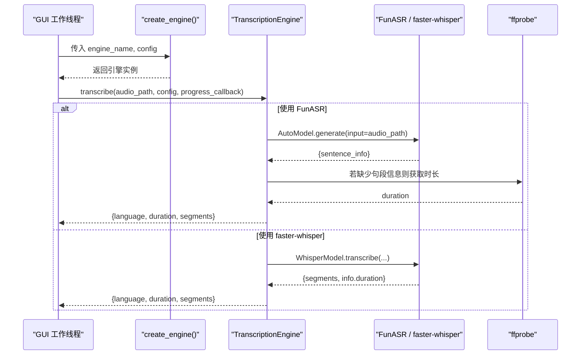
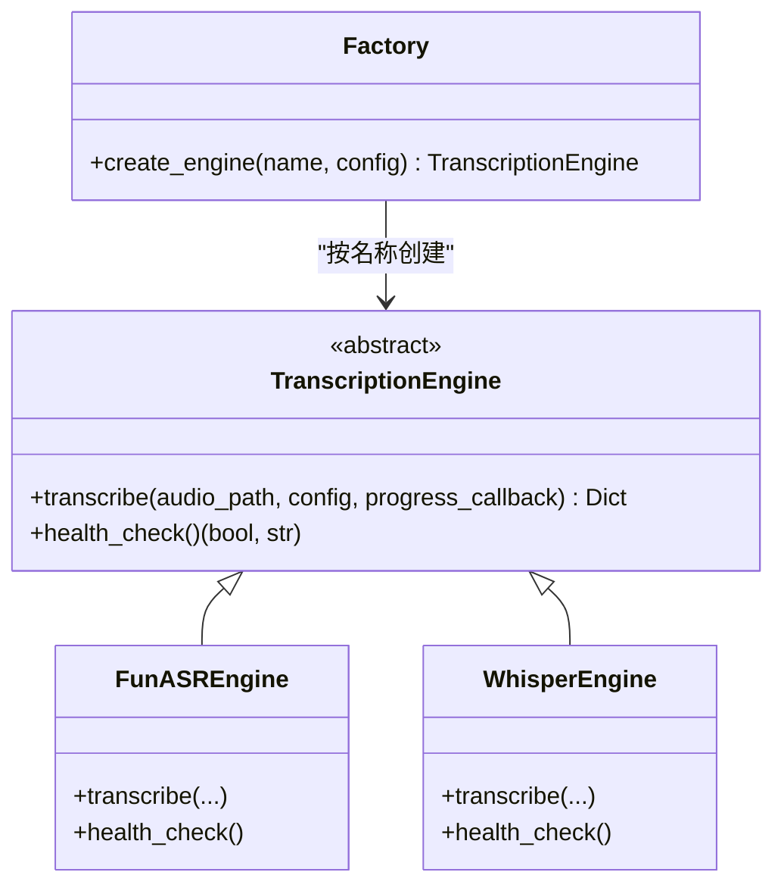
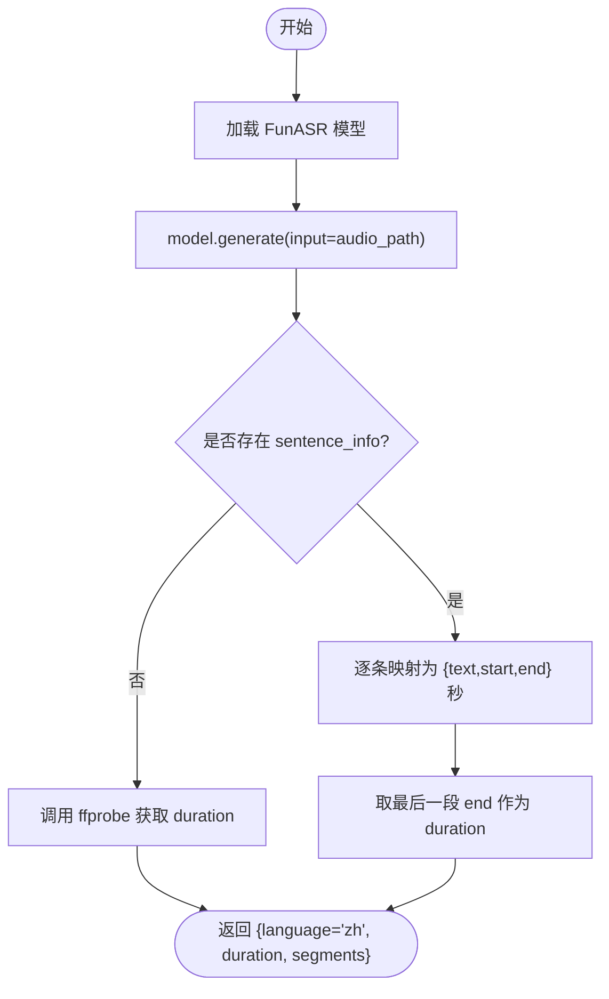
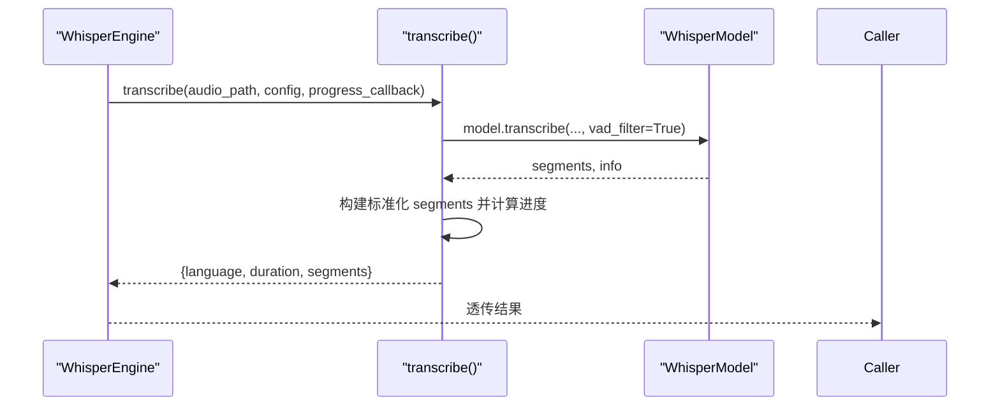
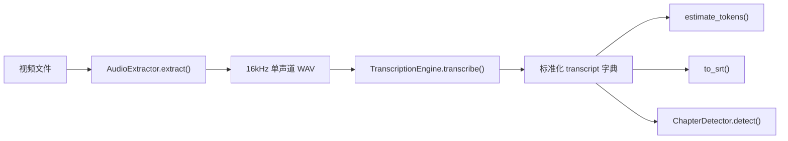
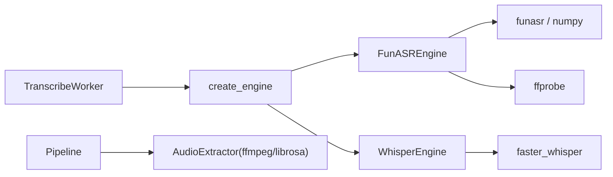

# 语音识别引擎

<cite>
**本文引用的文件**
- [engines.py](file://video_splitter/extractor/engines.py)
- [transcribe.py](file://video_splitter/extractor/transcribe.py)
- [config.py](file://video_splitter/config.py)
- [pipeline.py](file://video_splitter/pipeline.py)
- [audio.py](file://video_splitter/extractor/audio.py)
- [transcribe_worker.py](file://gui/workers/transcribe_worker.py)
- [test_transcribe_funasr.py](file://tests/test_transcribe_funasr.py)
- [test_engines.py](file://video_splitter/tests/test_engines.py)
- [funasr-migration-design.md](file://docs/funasr-migration-design.md)
</cite>

## 目录
1. [简介](#简介)
2. [项目结构](#项目结构)
3. [核心组件](#核心组件)
4. [架构总览](#架构总览)
5. [详细组件分析](#详细组件分析)
6. [依赖关系分析](#依赖关系分析)
7. [性能与选型建议](#性能与选型建议)
8. [故障排查指南](#故障排查指南)
9. [结论](#结论)
10. [附录：新引擎集成指南](#附录新引擎集成指南)

## 简介
本技术文档围绕视频分割系统中的“语音识别（ASR）引擎”模块，系统性说明多引擎支持架构、引擎切换机制与动态加载策略，并深入解析 faster-whisper 与 FunASR 两种引擎的实现细节。文档同时覆盖配置参数、数据结构标准化、错误处理模式、性能对比与选择建议，以及新增引擎的接口规范与测试方法，帮助开发者快速理解与扩展系统能力。

## 项目结构
与 ASR 引擎相关的核心代码位于 video_splitter/extractor 与 gui/workers 下，并通过 pipeline 编排整体流程。关键文件职责如下：
- engines.py：定义抽象引擎接口、FunASR 与 faster-whisper 引擎实现、工厂方法与注册表。
- transcribe.py：faster-whisper 的具体转录实现与 SRT 转换工具。
- config.py：统一配置 SplitConfig，包含设备、模型、语言、引擎名等。
- audio.py：音频提取与质量预检（FFmpeg + librosa）。
- pipeline.py：端到端流水线编排（预检查→提取→转录→章节→校验→切割）。
- transcribe_worker.py：GUI 后台线程封装，基于 create_engine 调用具体引擎。
- tests/*：针对引擎注册表、健康检查、输出映射等的单元测试。
- docs/funasr-migration-design.md：FunASR 迁移设计文档（含 API 契约与兼容性策略）。

图表来源
- [engines.py:17-251](file://video_splitter/extractor/engines.py#L17-L251)
- [transcribe.py:11-59](file://video_splitter/extractor/transcribe.py#L11-L59)
- [config.py:19-54](file://video_splitter/config.py#L19-L54)
- [pipeline.py:21-131](file://video_splitter/pipeline.py#L21-L131)
- [audio.py:12-171](file://video_splitter/extractor/audio.py#L12-L171)
- [transcribe_worker.py:16-49](file://gui/workers/transcribe_worker.py#L16-L49)

章节来源
- [engines.py:1-251](file://video_splitter/extractor/engines.py#L1-L251)
- [transcribe.py:1-105](file://video_splitter/extractor/transcribe.py#L1-L105)
- [config.py:1-54](file://video_splitter/config.py#L1-L54)
- [pipeline.py:1-131](file://video_splitter/pipeline.py#L1-L131)
- [audio.py:1-171](file://video_splitter/extractor/audio.py#L1-L171)
- [transcribe_worker.py:1-49](file://gui/workers/transcribe_worker.py#L1-L49)

## 核心组件
- 抽象接口 TranscriptionEngine：定义统一的 transcribe 与 health_check 方法，约束返回结构与进度回调签名。
- FunASREngine：基于 FunASR AutoModel 的中文识别引擎，负责将毫秒级时间戳转换为秒，并在无 sentence_info 时回退到 ffprobe 获取时长。
- WhisperEngine：对 faster-whisper 的薄封装，委托给 extractor.transcribe.transcribe，保持与上层一致的进度回调语义。
- 工厂方法 create_engine 与注册表 _ENGINE_REGISTRY：按名称动态创建引擎实例，支持未来扩展更多引擎。
- 辅助函数 _get_audio_duration_ffprobe：通过 ffprobe 获取音频时长，用于 FunASR 结果缺失时的回退。

章节来源
- [engines.py:17-251](file://video_splitter/extractor/engines.py#L17-L251)
- [transcribe.py:11-59](file://video_splitter/extractor/transcribe.py#L11-L59)

## 架构总览
系统采用“插件式引擎 + 工厂注册”的多引擎架构。上层仅依赖抽象接口与工厂方法，不关心具体实现；不同引擎在运行时根据配置或环境变量动态选择。

图表来源
- [engines.py:85-220](file://video_splitter/extractor/engines.py#L85-L220)
- [transcribe.py:27-59](file://video_splitter/extractor/transcribe.py#L27-L59)
- [engines.py:48-83](file://video_splitter/extractor/engines.py#L48-L83)

## 详细组件分析

### 抽象接口与工厂
- 接口约定
  - transcribe(audio_path, config, progress_callback=None) → Dict[str, Any]
    - 返回字段：language（字符串）、duration（秒）、segments（列表，每项含 text、start、end）
    - progress_callback 为可选回调，FunASR 提供阶段提示，faster-whisper 提供分段进度
  - health_check() → (bool, str)
- 工厂与注册表
  - _ENGINE_REGISTRY 维护引擎名到类的映射
  - create_engine(name="funasr", config=None) 按名称创建实例，未知名称抛出 ValueError

图表来源
- [engines.py:17-251](file://video_splitter/extractor/engines.py#L17-L251)

章节来源
- [engines.py:17-251](file://video_splitter/extractor/engines.py#L17-L251)

### FunASR 引擎实现要点
- 模型加载
  - 默认模型名常量 FUNASR_MODEL
  - 可通过环境变量 VIDEO_SPLITTER_FUNASR_MODEL_DIR 指定本地或远程模型路径
- 结果映射
  - 从 result[0].get("sentence_info") 读取句段，text 直接保留，start/end 由毫秒转为秒并四舍五入至两位小数
  - 若无句段信息或为空，回退到 ffprobe 获取 duration，segments 可能为空
- 进度回调
  - 分阶段提示：加载模型、转录中、处理结果、完成
- 健康检查
  - 尝试导入 funasr 与 numpy，构造模型并用空音频进行 generate 以验证可用性

图表来源
- [engines.py:85-173](file://video_splitter/extractor/engines.py#L85-L173)
- [engines.py:48-83](file://video_splitter/extractor/engines.py#L48-L83)

章节来源
- [engines.py:85-173](file://video_splitter/extractor/engines.py#L85-L173)
- [engines.py:48-83](file://video_splitter/extractor/engines.py#L48-L83)

### faster-whisper 引擎实现要点
- 委托实现
  - WhisperEngine 内部调用 extractor.transcribe.transcribe，保持进度回调透传
- 转录逻辑
  - 使用 WhisperModel 初始化（device、compute_type 来自配置）
  - 开启 VAD 过滤，按 segment 迭代生成标准化 segments，更新进度
  - 返回 language、duration（info.duration）、segments

图表来源
- [engines.py:175-220](file://video_splitter/extractor/engines.py#L175-L220)
- [transcribe.py:27-59](file://video_splitter/extractor/transcribe.py#L27-L59)

章节来源
- [engines.py:175-220](file://video_splitter/extractor/engines.py#L175-L220)
- [transcribe.py:27-59](file://video_splitter/extractor/transcribe.py#L27-L59)

### 配置与环境变量
- SplitConfig 关键字段
  - transcription_engine：当前使用的引擎名，默认 "funasr"
  - device/compute_type/model_size：faster-whisper 相关；FunASR 主要使用 device 与 model_size（后者可承载 FunASR 模型名）
  - language：默认 "zh"
  - engine_config：预留的引擎特定配置字典
- 环境变量覆盖
  - VIDEO_SPLITTER_ENGINE：覆盖 transcription_engine
  - VIDEO_SPLITTER_DEVICE：覆盖 device
  - VIDEO_SPLITTER_RESUME：控制是否恢复中间结果
  - OPENAI_API_BASE/WHALECLOUD_API_KEY：LLM 相关（非 ASR 核心）
  - VIDEO_SPLITTER_FUNASR_MODEL_DIR：FunASR 模型路径

章节来源
- [config.py:19-54](file://video_splitter/config.py#L19-L54)
- [engines.py:14](file://video_splitter/extractor/engines.py#L14)

### 数据流与标准化
- 输入：16kHz 单声道 WAV（由 AudioExtractor.extract 保证）
- 输出：标准化 transcript 字典
  - language：字符串
  - duration：浮点秒
  - segments：列表，每项包含 text、start、end（秒）
- 下游消费
  - estimate_tokens：粗略估算 token 数
  - to_srt：导出 SRT 字幕
  - ChapterDetector/Validator/Cutter：基于 segments 进行章节检测与视频切割

图表来源
- [audio.py:130-171](file://video_splitter/extractor/audio.py#L130-L171)
- [transcribe.py:62-105](file://video_splitter/extractor/transcribe.py#L62-L105)
- [pipeline.py:60-98](file://video_splitter/pipeline.py#L60-L98)

章节来源
- [audio.py:130-171](file://video_splitter/extractor/audio.py#L130-L171)
- [transcribe.py:62-105](file://video_splitter/extractor/transcribe.py#L62-L105)
- [pipeline.py:60-98](file://video_splitter/pipeline.py#L60-L98)

## 依赖关系分析
- 组件耦合
  - GUI 工作线程仅依赖 create_engine 与 SplitConfig，不感知具体引擎实现
  - 引擎层通过注册表解耦，新增引擎只需实现接口并注册
  - faster-whisper 与 FunASR 各自独立，互不影响
- 外部依赖
  - faster_whisper：WhisperEngine 使用
  - funasr/numpy：FunASREngine 使用
  - ffprobe：FunASR 回退时长获取
  - ffmpeg/librosa：音频提取与质量预检

图表来源
- [transcribe_worker.py:16-49](file://gui/workers/transcribe_worker.py#L16-L49)
- [engines.py:222-251](file://video_splitter/extractor/engines.py#L222-L251)
- [audio.py:12-171](file://video_splitter/extractor/audio.py#L12-L171)

章节来源
- [transcribe_worker.py:16-49](file://gui/workers/transcribe_worker.py#L16-L49)
- [engines.py:222-251](file://video_splitter/extractor/engines.py#L222-L251)
- [audio.py:12-171](file://video_splitter/extractor/audio.py#L12-L171)

## 性能与选型建议
- 场景建议
  - 中文为主、追求开箱即用与较低部署复杂度：优先 FunASR（paraformer-zh），内置标点与句子级切分，适合中文视频
  - 需要多语言或更细粒度 VAD 控制：可使用 faster-whisper，结合 vad_filter 与 compute_type 调优
- 资源与速度
  - FunASR 首次调用会下载模型（约数百 MB），后续复用缓存；CPU 上对中文表现良好
  - faster-whisper 支持多种 compute_type，可在 GPU/CPU 间权衡速度与显存占用
- 稳定性与容错
  - FunASR 在无句段信息时自动回退 ffprobe 获取时长，增强鲁棒性
  - 两者均提供 health_check，便于启动前自检

[本节为通用指导，不直接分析具体文件]

## 故障排查指南
- 常见错误与定位
  - ffprobe 不可用或超时：检查 PATH 与安装状态；参考 _get_audio_duration_ffprobe 的错误分支
  - 模型未安装或网络问题：FunASR 健康检查失败时会给出安装或下载提示；可通过环境变量指定本地模型目录
  - 依赖缺失：faster_whisper 或 funasr 未安装导致 health_check 失败
- 调试建议
  - 启用日志：查看 Pipeline 各步骤完成标记与异常堆栈
  - 使用 dry_run：评估预估 token 数与成本，确认配置合理
  - 单元测试：参考 test_engines.py 与 test_transcribe_funasr.py 中的断言与 mock 方式

章节来源
- [engines.py:48-83](file://video_splitter/extractor/engines.py#L48-L83)
- [engines.py:154-173](file://video_splitter/extractor/engines.py#L154-L173)
- [engines.py:207-220](file://video_splitter/extractor/engines.py#L207-L220)
- [pipeline.py:102-111](file://video_splitter/pipeline.py#L102-L111)
- [test_engines.py:22-70](file://video_splitter/tests/test_engines.py#L22-L70)
- [test_transcribe_funasr.py:164-222](file://tests/test_transcribe_funasr.py#L164-L222)

## 结论
本系统通过抽象接口与工厂注册实现了多引擎可扩展的 ASR 架构。FunASR 与 faster-whisper 两种引擎共享统一的输入输出契约，便于在中文场景与多语言场景之间灵活切换。配合完善的健康检查、进度回调与错误处理，系统在易用性与健壮性方面达到良好平衡。

[本节为总结性内容，不直接分析具体文件]

## 附录：新引擎集成指南

### 接口规范
- 必须实现的方法
  - transcribe(audio_path: str, config: SplitConfig, progress_callback: Optional[Callable[[float, str], None]] = None) -> Dict[str, Any]
    - 返回标准 transcript 字典：{language, duration, segments[{text, start, end}]}
    - 支持可选进度回调，回调参数为 (frac: float, description: str)
  - health_check() -> tuple[bool, str]
    - 返回可用性布尔值与消息
- 注册与创建
  - 在 _ENGINE_REGISTRY 中添加键值对（如 "myengine": MyEngine）
  - 通过 create_engine("myengine", config) 获取实例

章节来源
- [engines.py:17-46](file://video_splitter/extractor/engines.py#L17-L46)
- [engines.py:222-251](file://video_splitter/extractor/engines.py#L222-L251)

### 开发步骤
- 新建引擎类
  - 继承 TranscriptionEngine
  - 实现 transcribe 与 health_check
  - 遵循进度回调与返回值契约
- 注册引擎
  - 在 _ENGINE_REGISTRY 中登记新引擎名
- 配置与运行
  - 设置环境变量 VIDEO_SPLITTER_ENGINE=myengine 或通过 SplitConfig.transcription_engine 指定
  - 在 GUI 或 CLI 中传入对应 engine_name

章节来源
- [config.py:36-53](file://video_splitter/config.py#L36-L53)
- [transcribe_worker.py:23-49](file://gui/workers/transcribe_worker.py#L23-L49)

### 测试方法
- 单元测试要点
  - 工厂行为：默认引擎、已知引擎、未知引擎抛错
  - 健康检查：依赖缺失、模型加载失败、成功路径
  - 输出映射：时间单位换算、空结果回退、进度回调触发
- 参考用例
  - 工厂与注册表：见 test_engines.py
  - FunASR 输出映射与健康检查：见 test_transcribe_funasr.py

章节来源
- [test_engines.py:72-96](file://video_splitter/tests/test_engines.py#L72-L96)
- [test_transcribe_funasr.py:18-47](file://tests/test_transcribe_funasr.py#L18-L47)
- [test_transcribe_funasr.py:49-162](file://tests/test_transcribe_funasr.py#L49-L162)
- [test_transcribe_funasr.py:164-222](file://tests/test_transcribe_funasr.py#L164-L222)

### API 调用示例与错误处理模式
- 基本调用（GUI 工作线程）
  - 通过 create_engine(engine_name, config) 获取引擎
  - 调用 engine.transcribe(audio_path, config, progress_callback=_on_progress)
  - 捕获异常并通过 error 信号上报
- 错误处理模式
  - 健康检查失败：在启动前执行 health_check，提前发现依赖问题
  - 转录异常：包装 try/except，记录日志并向上抛出，供上层统一处理
  - 时长回退：当引擎无法提供有效时间戳时，使用 ffprobe 回退

章节来源
- [transcribe_worker.py:33-49](file://gui/workers/transcribe_worker.py#L33-L49)
- [engines.py:154-173](file://video_splitter/extractor/engines.py#L154-L173)
- [engines.py:207-220](file://video_splitter/extractor/engines.py#L207-L220)
- [engines.py:48-83](file://video_splitter/extractor/engines.py#L48-L83)

### 迁移与设计参考
- 迁移策略
  - 保持 transcribe 契约不变，仅替换底层实现
  - 通过环境变量与配置项平滑切换引擎
- 兼容性与风险
  - 时间戳精度差异、GPU 内存占用、离线模型路径等已在迁移设计中详细说明

章节来源
- [funasr-migration-design.md:1-435](file://docs/funasr-migration-design.md#L1-L435)