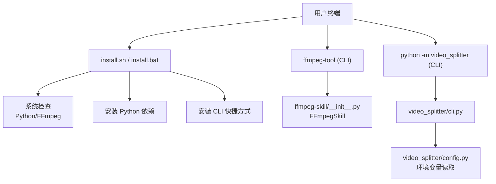
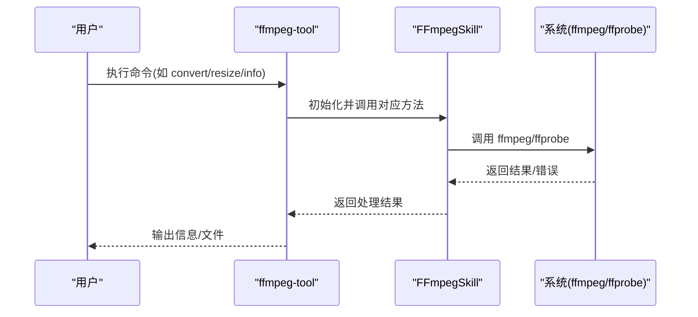
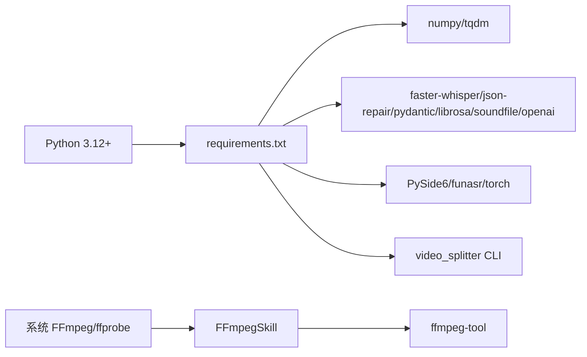

# 安装部署

<cite>
**本文引用的文件**
- [README.md](file://README.md)
- [install.sh](file://install.sh)
- [install.bat](file://install.bat)
- [requirements.txt](file://requirements.txt)
- [pyproject.toml](file://pyproject.toml)
- [ffmpeg-skill/ffmpeg_tool.py](file://ffmpeg-skill/ffmpeg_tool.py)
- [ffmpeg-skill/__init__.py](file://ffmpeg-skill/__init__.py)
- [video_splitter/cli.py](file://video_splitter/cli.py)
- [video_splitter/config.py](file://video_splitter/config.py)
</cite>

## 目录
1. [简介](#简介)
2. [项目结构](#项目结构)
3. [核心组件](#核心组件)
4. [架构总览](#架构总览)
5. [详细组件分析](#详细组件分析)
6. [依赖关系分析](#依赖关系分析)
7. [性能与资源建议](#性能与资源建议)
8. [故障排查指南](#故障排查指南)
9. [结论](#结论)
10. [附录：验证清单](#附录验证清单)

## 简介
本指南面向 VideoSplitter 的安装与部署，覆盖 Windows、macOS、Linux 三大平台。内容包括：
- Python 环境要求与版本约束
- FFmpeg 依赖安装与 PATH 配置
- 项目依赖安装（含可选 GUI 与语音识别相关依赖）
- 自动安装脚本使用方法（Windows/macOS/Linux）
- 手动安装步骤详解（虚拟环境、环境变量、路径配置）
- 常见安装问题诊断与解决方案
- 安装成功验证方法

## 项目结构
仓库包含两类能力：
- ffmpeg-skill：基于 FFmpeg 的通用视频处理封装与 CLI 工具
- video_splitter：以 ASR + LLM 为核心的智能分段流水线及 CLI

图表来源
- [install.sh:1-152](file://install.sh#L1-L152)
- [install.bat:1-81](file://install.bat#L1-L81)
- [ffmpeg-skill/ffmpeg_tool.py:1-283](file://ffmpeg-skill/ffmpeg_tool.py#L1-L283)
- [ffmpeg-skill/__init__.py:58-93](file://ffmpeg-skill/__init__.py#L58-L93)
- [video_splitter/cli.py:1-256](file://video_splitter/cli.py#L1-L256)
- [video_splitter/config.py:1-54](file://video_splitter/config.py#L1-L54)

章节来源
- [README.md:34-45](file://README.md#L34-L45)
- [install.sh:1-152](file://install.sh#L1-L152)
- [install.bat:1-81](file://install.bat#L1-L81)

## 核心组件
- FFmpeg 依赖：必须安装到系统 PATH，供 ffmpeg 与 ffprobe 调用
- Python 依赖：基础依赖与可选扩展（GUI、ASR、LLM）
- CLI 入口：
  - ffmpeg-tool：独立命令行工具，封装常用 FFmpeg 操作
  - python -m video_splitter：VideoSplitter 主流程 CLI（split/transcribe/cut/check/review/batch/gui）

章节来源
- [ffmpeg-skill/ffmpeg_tool.py:1-283](file://ffmpeg-skill/ffmpeg_tool.py#L1-L283)
- [video_splitter/cli.py:1-256](file://video_splitter/cli.py#L1-L256)
- [requirements.txt:1-26](file://requirements.txt#L1-L26)

## 架构总览
下图展示安装后典型运行时的关键交互：用户通过 CLI 调用，底层执行 FFmpeg 命令或触发 VideoSplitter 流水线。

图表来源
- [ffmpeg-skill/ffmpeg_tool.py:1-283](file://ffmpeg-skill/ffmpeg_tool.py#L1-L283)
- [ffmpeg-skill/__init__.py:58-93](file://ffmpeg-skill/__init__.py#L58-L93)

## 详细组件分析

### 自动安装脚本使用
- Linux/macOS
  - 在仓库根目录执行安装脚本，脚本会检测操作系统、Python 与 FFmpeg，提示缺失项并给出安装指引；随后安装 Python 依赖并将 ffmpeg-tool 放入可执行目录，必要时更新 PATH。
- Windows
  - 双击或命令行执行批处理脚本，完成 Python/FFmpeg 检测、依赖安装，并在用户目录下创建便捷启动脚本，便于直接调用 ffmpeg-tool。

注意：脚本仅安装 ffmpeg-skill 所需的基础依赖（numpy、tqdm）。如需使用 VideoSplitter 完整功能，请参见“手动安装”部分。

章节来源
- [install.sh:1-152](file://install.sh#L1-L152)
- [install.bat:1-81](file://install.bat#L1-L81)

### 手动安装（推荐用于完整功能）
以下步骤适用于需要 VideoSplitter 全部能力的场景（包括转写、分段、GUI 等）。

1) 准备 Python 环境
- 版本要求
  - pyproject 指定 requires-python >= 3.12
  - README 与安装脚本对 ffmpeg-skill 基础能力要求 Python 3.8+
  - 建议优先使用 Python 3.12+ 以获得最佳兼容性
- 推荐做法：使用虚拟环境
  - 创建并激活虚拟环境（示例为 venv）
    - Linux/macOS: python3 -m venv .venv && source .venv/bin/activate
    - Windows: python -m venv .venv && .venv\Scripts\activate

2) 安装 FFmpeg
- 确保 ffmpeg 与 ffprobe 可在终端中直接调用
- 安装方式
  - Linux: 使用发行版包管理器安装（例如 apt/pacman），或将下载的二进制加入 PATH
  - macOS: 使用 Homebrew 安装
  - Windows: 从官网下载压缩包，解压后将 bin 目录加入系统 PATH
- 验证
  - 在终端执行 ffmpeg -version 与 ffprobe -version 均能正常输出版本信息

3) 安装 Python 依赖
- 基础依赖（ffmpeg-skill）
  - pip install numpy tqdm
- VideoSplitter 全量依赖
  - pip install -r requirements.txt
  - 说明：该列表包含 ASR、LLM、GUI 等相关库，体积较大且部分依赖需编译，建议在具备网络与编译环境的机器上执行
- 可选：仅安装测试依赖
  - pip install pytest

4) 环境变量与路径配置
- 支持的环境变量（由 SplitConfig.from_env 读取）
  - OPENAI_API_BASE：LLM API 基地址
  - OPENAI_API_KEY：LLM API Key
  - WHALECLOUD_API_KEY：若设置，将覆盖 OPENAI_API_KEY
  - VIDEO_SPLITTER_DEVICE：设备选择（如 cpu/gpu）
  - VIDEO_SPLITTER_RESUME：是否启用断点续跑（接受 1/true/yes）
  - VIDEO_SPLITTER_ENGINE：转写引擎名称（如 funasr）
- 设置方式
  - Linux/macOS：写入 ~/.bashrc 或 ~/.zshrc 后 source
  - Windows：在“系统属性 > 高级 > 环境变量”中添加，或在当前会话中 set

5) 验证安装
- FFmpeg 可用
  - ffmpeg -version
  - ffprobe -version
- ffmpeg-tool 可用
  - ffmpeg-tool --help
- VideoSplitter CLI 可用
  - python -m video_splitter --help
  - python -m video_splitter check（检查依赖与环境）
- 简单功能验证
  - ffmpeg-tool info <任意视频文件>
  - python -m video_splitter transcribe <视频文件>（需已安装 ASR 依赖）

章节来源
- [pyproject.toml:1-28](file://pyproject.toml#L1-L28)
- [requirements.txt:1-26](file://requirements.txt#L1-L26)
- [video_splitter/config.py:1-54](file://video_splitter/config.py#L1-L54)
- [video_splitter/cli.py:85-152](file://video_splitter/cli.py#L85-L152)
- [ffmpeg-skill/ffmpeg_tool.py:1-283](file://ffmpeg-skill/ffmpeg_tool.py#L1-L283)

### 虚拟环境与隔离
- 推荐使用 venv 或 conda 创建隔离环境，避免系统级污染
- 在激活后的环境中执行所有 pip 安装与 CLI 命令
- 若使用 IDE，请将解释器指向虚拟环境中的 Python

[本节为通用实践，不直接分析具体文件]

### 环境变量设置与路径配置
- 环境变量优先级
  - WHALECLOUD_API_KEY 覆盖 OPENAI_API_KEY
  - VIDEO_SPLITTER_* 系列变量覆盖默认行为
- PATH 配置
  - 确保 ffmpeg/ffprobe 所在目录已在 PATH
  - 在 Linux/macOS 下，可将自定义脚本目录加入 PATH（安装脚本会自动尝试追加）

章节来源
- [video_splitter/config.py:39-53](file://video_splitter/config.py#L39-L53)
- [install.sh:88-112](file://install.sh#L88-L112)

## 依赖关系分析
- 运行时外部依赖
  - FFmpeg/ffprobe：必须在系统 PATH 中可用
- Python 依赖分层
  - 基础层：numpy、tqdm（ffmpeg-skill）
  - 核心层：faster-whisper、json-repair、pydantic、librosa、soundfile、openai（video_splitter）
  - 可选层：PySide6、funasr、torch（GUI 与 ASR 增强）
- 版本约束
  - pyproject 要求 Python >= 3.12
  - requirements 指定各库最低版本

图表来源
- [requirements.txt:1-26](file://requirements.txt#L1-L26)
- [pyproject.toml:1-28](file://pyproject.toml#L1-L28)
- [ffmpeg-skill/__init__.py:58-93](file://ffmpeg-skill/__init__.py#L58-L93)
- [ffmpeg-skill/ffmpeg_tool.py:1-283](file://ffmpeg-skill/ffmpeg_tool.py#L1-L283)
- [video_splitter/cli.py:1-256](file://video_splitter/cli.py#L1-L256)

章节来源
- [requirements.txt:1-26](file://requirements.txt#L1-L26)
- [pyproject.toml:1-28](file://pyproject.toml#L1-L28)

## 性能与资源建议
- CPU 转写估算
  - CLI 内置基准逻辑会以 tiny/cpu 模型进行快速评估，并据此估算 large-v3 在 CPU 上的耗时
- 磁盘空间
  - 中间产物与输出文件可能占用较多空间，建议预留足够容量
- 并行与批处理
  - 可使用 batch 命令顺序处理多个视频，避免并发导致的资源争用

章节来源
- [video_splitter/cli.py:101-128](file://video_splitter/cli.py#L101-L128)

## 故障排查指南
- “找不到 ffmpeg/ffprobe”
  - 确认已安装并将 bin 目录加入 PATH
  - 在终端执行 ffmpeg -version 与 ffprobe -version 验证
  - 参考安装脚本中的平台提示
- “Python 版本不兼容”
  - pyproject 要求 Python >= 3.12；ffmpeg-skill 基础能力要求 Python 3.8+
  - 建议使用 3.12+ 并配合虚拟环境
- “pip 安装失败/编译报错”
  - 某些依赖需要编译环境（如 torch、funasr），请确保系统具备相应编译器与依赖
  - 可先安装基础依赖，再逐步添加可选依赖
- “LLM API Key 未配置”
  - 设置 OPENAI_API_KEY 或 WHALECLOUD_API_KEY
  - 可通过 video_splitter check 查看状态
- “权限或磁盘空间不足”
  - 确保输出目录可写，磁盘有足够剩余空间

章节来源
- [install.sh:51-76](file://install.sh#L51-L76)
- [install.bat:22-35](file://install.bat#L22-L35)
- [video_splitter/cli.py:85-152](file://video_splitter/cli.py#L85-L152)
- [ffmpeg-skill/__init__.py:73-93](file://ffmpeg-skill/__init__.py#L73-L93)

## 结论
- 若仅需通用 FFmpeg 封装与 CLI，可直接使用自动安装脚本，并满足 Python 3.8+ 与 FFmpeg 即可
- 若需 VideoSplitter 完整能力（转写、分段、GUI），请使用手动安装流程，按 pyproject 与 requirements 配置环境，并正确设置环境变量与 PATH
- 安装完成后，通过 ffmpeg-tool 与 video_splitter CLI 的 help 与 check 命令进行验证

[本节为总结性内容，不直接分析具体文件]

## 附录：验证清单
- 系统依赖
  - ffmpeg -version 输出正常
  - ffprobe -version 输出正常
- Python 环境
  - python --version 符合预期（建议 3.12+）
  - pip 可用并可安装依赖
- 功能验证
  - ffmpeg-tool --help 显示帮助
  - ffmpeg-tool info <视频文件> 返回媒体信息
  - python -m video_splitter --help 显示子命令
  - python -m video_splitter check 显示依赖检查结果
- 环境变量
  - 设置 OPENAI_API_KEY/WHALECLOUD_API_KEY 后，CLI 应能识别
  - 设置 VIDEO_SPLITTER_DEVICE/VIDEO_SPLITTER_RESUME/VIDEO_SPLITTER_ENGINE 后，行为应随之变化

章节来源
- [ffmpeg-skill/ffmpeg_tool.py:1-283](file://ffmpeg-skill/ffmpeg_tool.py#L1-L283)
- [video_splitter/cli.py:207-256](file://video_splitter/cli.py#L207-L256)
- [video_splitter/config.py:39-53](file://video_splitter/config.py#L39-L53)